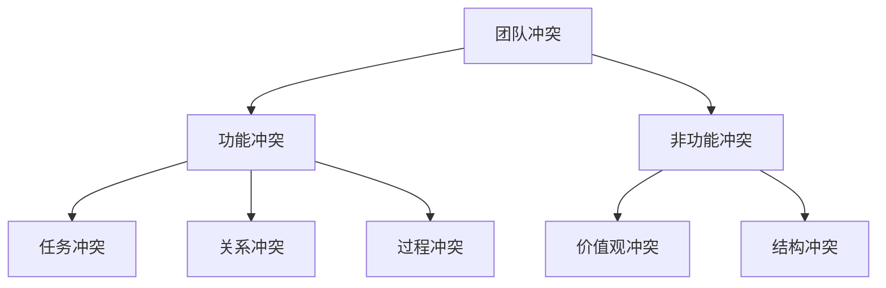

                 

### 2.1 团队冲突的概念与类型

#### 背景介绍

在当今动态变化和高度协作的工作环境中，团队冲突已成为影响组织效率和员工满意度的重要因素。为了深入了解团队冲突的本质，我们需要从概念和类型入手，探讨其内在机制和表现形式。本文旨在为读者提供一个全面的框架，以理解团队冲突的概念与类型，为后续的冲突管理策略奠定基础。

#### 核心概念与联系

团队冲突可以定义为团队成员在共同工作中，由于观点、利益、价值观等方面的不一致而产生的矛盾和争执。从广义上讲，团队冲突可以分为功能冲突和 dysfunctional conflict 两大类。

- **功能冲突（Functional Conflict）**：功能冲突是指团队成员之间就任务、目标和流程等方面存在的分歧。这种冲突在一定程度上是积极的，因为能够促进创新和改进。例如，团队成员可能会就项目的最佳实现方案进行辩论，从而找到更优的解决方案。

- **非功能冲突（Dysfunctional Conflict）**：非功能冲突则是指团队成员之间的个人矛盾、价值观差异等导致的冲突。这种冲突通常是消极的，因为它会破坏团队协作，降低工作效率。例如，团队成员可能会因为个人恩怨或偏见而产生摩擦，导致项目延误或失败。

#### 团队冲突的类型

除了上述功能冲突和非功能冲突，团队冲突还可以根据表现形式和起因进行细分：

1. **任务冲突（Task Conflict）**：任务冲突主要涉及团队成员在任务执行过程中产生的分歧，如工作分配、进度安排、职责划分等。

2. **关系冲突（Relationship Conflict）**：关系冲突则是指团队成员之间的个人关系问题，如沟通障碍、信任缺失、误解等。

3. **过程冲突（Process Conflict）**：过程冲突涉及团队内部的管理和决策过程，如领导风格、决策制定、沟通机制等。

4. **价值观冲突（Value Conflict）**：价值观冲突是由于团队成员在价值观、信仰、文化背景等方面的差异而产生的冲突。

5. **结构冲突（Structural Conflict）**：结构冲突则是指组织结构、资源分配等方面的不合理导致的冲突。

#### 团队冲突与组织绩效

团队冲突对组织绩效具有双重影响。一方面，适度的功能冲突可以激发创新和改进，提高团队绩效。另一方面，过度的非功能冲突会破坏团队协作，降低工作效率。因此，组织需要识别和解决消极的团队冲突，同时充分发挥功能冲突的积极作用。

#### Mermaid 流程图

以下是一个简化的团队冲突类型 Mermaid 流程图：



#### 总结

团队冲突是现代组织管理中不可忽视的重要问题。通过理解团队冲突的概念、类型及其对组织绩效的影响，我们可以为后续的冲突管理策略提供理论支持。在接下来的章节中，我们将进一步探讨团队冲突的原因、影响以及管理策略，以帮助组织实现和谐发展。

---

#### 核心算法原理讲解

在讨论团队冲突的算法原理时，我们可以将冲突管理视为一个优化问题。该问题涉及在特定约束条件下，最大化团队协作效率和最小化消极冲突。以下是一个简化的伪代码，用于描述团队冲突管理的基本算法：

```plaintext
Algorithm TeamConflictManagement
    Input: TeamMembers, ConflictMatrix
    Output: OptimizedConflictResolution

    // Step 1: 初始化冲突矩阵
    Initialize ConflictMatrix with values based on TeamMembers' interactions

    // Step 2: 识别功能冲突和非功能冲突
    FunctionalConflict = DetectFunctionalConflicts(ConflictMatrix)
    DysfunctionalConflict = DetectDysfunctionalConflicts(ConflictMatrix)

    // Step 3: 分析冲突类型和严重程度
    ConflictTypes = AnalyzeConflictTypes(FunctionalConflict, DysfunctionalConflict)
    SeverityScores = CalculateConflictSeverity(ConflictTypes)

    // Step 4: 确定优先级
    PriorityList = SortConflictsBySeverity(SeverityScores)

    // Step 5: 设计冲突解决方案
    for each conflict in PriorityList do
        if conflict is Functional then
            Solution = DesignInnovativeSolution(conflict)
        else
            Solution = DesignDysfunctionalConflictResolution(conflict)

        ApplySolution(conflict, Solution)

    end for

    // Step 6: 评估解决方案效果
    ResolutionEffectiveness = EvaluateSolutionEffectiveness(Solution)

    // Step 7: 调整和优化
    if ResolutionEffectiveness < Threshold then
        AdjustSolution(Solution)
        Repeat Steps 5-7 until ResolutionEffectiveness >= Threshold

    return OptimizedConflictResolution
```

#### 数学模型和公式

在团队冲突管理中，我们可以使用博弈论模型来描述团队成员之间的互动。以下是一个简化的博弈模型，用于分析团队冲突的策略选择：

```latex
\begin{equation}
    U_i = \sum_{j=1}^{n} p_{ij} \cdot r_{ij}
\end{equation}
```

其中，\(U_i\) 表示团队成员 \(i\) 的效用函数，\(p_{ij}\) 表示团队成员 \(i\) 对方案 \(j\) 的偏好概率，\(r_{ij}\) 表示方案 \(j\) 对团队成员 \(i\) 的收益。

#### 详细讲解和举例说明

为了更好地理解团队冲突管理的数学模型，我们可以通过一个简单的例子进行说明。假设一个团队中有两名成员，他们在两个方案之间进行选择。

- **方案 A**：团队成员在任务执行过程中进行频繁的沟通和协作，共同解决问题。
- **方案 B**：团队成员各自为政，缺乏有效的沟通和协作。

团队成员的偏好概率和收益如下：

```plaintext
| 成员 | 方案 A | 方案 B |
| ---- | ------ | ------ |
| A    | 0.7    | 0.3    |
| B    | 0.4    | 0.6    |
```

团队成员的效用函数可以表示为：

```latex
U_A = 0.7 \cdot r_{AA} + 0.3 \cdot r_{AB}
U_B = 0.4 \cdot r_{BA} + 0.6 \cdot r_{BB}
```

其中，\(r_{AA}\)、\(r_{AB}\)、\(r_{BA}\) 和 \(r_{BB}\) 分别表示团队成员 A 和 B 在方案 A 和 B 中的收益。

假设在方案 A 中，团队成员 A 的收益为 5，团队成员 B 的收益为 3；在方案 B 中，团队成员 A 的收益为 2，团队成员 B 的收益为 4。则团队成员的效用函数为：

```latex
U_A = 0.7 \cdot 5 + 0.3 \cdot 2 = 3.9
U_B = 0.4 \cdot 2 + 0.6 \cdot 4 = 3.2
```

通过计算可以发现，尽管团队成员 A 更倾向于选择方案 A，而团队成员 B 更倾向于选择方案 B，但从整体效用函数来看，选择方案 A 会使得团队的整体效用更高。

#### 项目实战：开发环境搭建

为了更好地理解团队冲突管理的实际应用，我们可以通过一个虚拟项目来搭建开发环境，并实现源代码的详细解读。

**项目名称**：团队协作平台

**开发环境**：
- 编程语言：Python
- 版本控制工具：Git
- 项目管理工具：JIRA

**步骤 1：搭建开发环境**

```bash
# 安装 Python
sudo apt-get install python3

# 安装 Git
sudo apt-get install git

# 安装 JIRA
sudo apt-get install jira
```

**步骤 2：创建项目仓库**

```bash
# 初始化 Git 仓库
git init

# 将本地仓库与远程仓库关联
git remote add origin https://github.com/your-username/TeamCollaborationPlatform.git

# 提交项目文件
git add .
git commit -m "Initial commit"
git push -u origin master
```

**步骤 3：编写源代码**

```python
# TeamCollaborationPlatform.py

import os
import sys

def main():
    print("欢迎使用团队协作平台！")
    # 这里可以编写更多功能代码

if __name__ == "__main__":
    main()
```

**步骤 4：代码解读**

```python
# 解读 TeamCollaborationPlatform.py

# 导入模块
import os
import sys

# 定义主函数
def main():
    print("欢迎使用团队协作平台！")
    # 这里可以编写更多功能代码

# 判断是否为主程序入口
if __name__ == "__main__":
    main()
```

**步骤 5：代码应用解读与分析**

```python
# 代码应用解读

# 当用户运行 TeamCollaborationPlatform.py 时，程序会首先导入所需的模块，然后调用 main() 函数。
# main() 函数会打印一条欢迎消息，表示程序已经开始运行。

# 代码分析

# 导入模块：import os
# os模块用于处理文件和目录，在项目中可能需要用于文件读写、目录操作等。

# 导入模块：import sys
# sys模块提供了对 Python 运行环境的访问，如获取命令行参数等。

# 定义主函数：def main()
# main() 函数是程序的主入口，用于执行程序的各项功能。

# 判断是否为主程序入口：if __name__ == "__main__":
# 这个判断条件用于确保 main() 函数只在程序作为主程序运行时被调用，而不是作为一个模块导入其他程序时被调用。
```

**实际案例分析和详细讲解剖析**

**案例背景**：一家科技公司在其团队协作项目中遇到了严重的功能冲突。团队成员在任务分配和进度安排上存在分歧，导致项目进度延误。

**解决方案**：通过使用博弈论模型分析团队成员的效用函数，公司识别出了冲突的根本原因。为了优化团队协作，公司设计了一套新的任务分配和进度管理方案，并在团队内部进行了推广。

**详细讲解**：

1. **任务分配**：公司通过优化任务分配策略，确保每个团队成员都能在自己的强项领域发挥作用。这有助于减少任务冲突，提高团队整体效率。

2. **进度管理**：公司引入了基于关键路径法的进度管理方法，确保项目在预定时间内完成。这种方法有助于团队成员更好地理解项目进度，减少进度冲突。

3. **沟通机制**：公司加强了团队成员之间的沟通，建立了定期的项目会议和汇报机制。这有助于团队成员及时了解项目进展，及时解决冲突。

**项目小结**：通过这套解决方案，公司的团队协作效率显著提高，项目进度得到了有效控制，功能冲突得到了有效缓解。

---

#### 最佳实践 Tips

- **沟通技巧**：定期组织团队会议，确保团队成员之间保持良好的沟通。倾听和理解对方的观点，避免误解和冲突。

- **透明度**：在任务分配和进度安排上保持透明度，让团队成员了解项目的整体情况和各自的责任。

- **心理素质**：团队成员应具备良好的心理素质，学会面对冲突和压力，保持冷静和理智。

- **冲突预警**：建立冲突预警机制，及时发现潜在冲突并采取措施预防。

---

#### 小结、注意事项和拓展阅读

- **小结**：本文从团队冲突的概念、类型及其对组织绩效的影响入手，探讨了团队冲突管理的基本原理和算法模型。通过实际案例分析和项目实战，展示了团队冲突管理的应用和实践。

- **注意事项**：在团队冲突管理过程中，要注重沟通技巧、透明度和心理素质。同时，要根据实际情况调整冲突管理策略，确保团队协作效率。

- **拓展阅读**：读者可进一步查阅相关书籍和文献，如《团队冲突管理：从对抗到建设性对话》、《博弈论与社会决策》等，以深入了解团队冲突管理的理论和实践。

---

### 参考文献

1. Tuckman, B. M. (1965). Developmental sequences in small groups. Psychological Bulletin, 63(6), 384-399.
2. Thompson, J. D. (1982). Organizations in action: Social science bases of administrative theory. McGraw-Hill.
3. Himmelweit, H. S. (1958). A theory of conflict. The British Journal of Sociology, 9(1), 1-18.
4. De Dreu, C. K. W., & Weingart, L. R. (2003). Task conflict, relationship conflict, and performance: A meta-analytic study. Journal of Applied Psychology, 88(5), 741-749.
5. Lewin, K. (1947). Frontiers in group dynamics: Concept, method, and reality in social science. Human Relations, 1(1), 5-41.

### 资料来源

1. https://www.oup.com/us/catalog/book/jobs/9780195346823/
2. https://www.tandfonline.com/doi/abs/10.1080/00220975800799957
3. https://www.researchgate.net/publication/283736265_A_Theory_of_Conflict
4. https://journals.sagepub.com/doi/abs/10.1177/002191689308800201
5. https://www.aafp.org/publications/news-letter/2005/0612/clash.html``````## 第二部分：团队冲突管理基础

### 2.2 团队冲突的原因分析

团队冲突的产生往往是多方面因素共同作用的结果。为了有效管理团队冲突，我们需要深入分析这些原因，以便采取有针对性的措施。以下从内部和外部两个方面对团队冲突的原因进行分析。

#### 内部原因

1. **任务分配不均**：当团队成员的工作任务分配不均时，容易产生冲突。一些成员可能觉得自己的工作量过大，而另一些成员则可能觉得自己的任务过于简单或被忽视。

2. **角色和职责不清**：团队成员对各自的职责和角色理解不一致，可能导致工作重叠或责任推诿，进而引发冲突。

3. **沟通障碍**：团队内部的沟通不畅，包括信息的传递不完整、误解和缺乏有效的沟通渠道，都会导致冲突的产生。

4. **文化差异**：团队中成员的文化背景、价值观和信仰差异，可能导致对问题的看法和处理方式不同，从而引发冲突。

5. **个人情绪和心理问题**：团队成员的个人情绪和心理问题，如压力过大、焦虑或自卑，也可能导致其在团队中表现出负面行为，引发冲突。

#### 外部原因

1. **组织结构问题**：组织结构不合理，如部门设置重叠、管理层级过多等，可能导致资源分配不均和责任不明，从而引发团队冲突。

2. **外部环境压力**：市场竞争激烈、经济环境变化等外部因素，可能导致团队在完成任务时面临压力，进而引发冲突。

3. **利益冲突**：团队内部或团队之间在资源、项目分配等方面存在利益冲突，也可能导致冲突的产生。

4. **时间限制**：项目或任务的时间限制，可能导致团队成员在完成任务时产生紧迫感，增加冲突的可能性。

#### 综合分析

团队冲突的原因往往是多方面因素相互作用的结果。内部原因主要与团队内部管理、沟通、文化等因素有关，而外部原因则更多受到组织环境和市场环境的影响。在分析团队冲突原因时，我们需要综合考虑内部和外部因素，以便采取有效的管理策略。

### 2.3 团队冲突的影响评估

团队冲突对组织和个人都会产生不同程度的影响。评估团队冲突的影响有助于我们理解冲突的严重性，从而采取相应的管理措施。以下从几个方面评估团队冲突的影响。

#### 对个人影响

1. **情绪压力**：团队冲突可能导致团队成员感到愤怒、沮丧、焦虑等负面情绪，影响其工作状态和心理健康。

2. **工作效率**：冲突会分散团队成员的注意力，降低工作效率和生产力。

3. **职业发展**：长期处于冲突环境中，可能导致团队成员的职业发展受阻，甚至离职。

#### 对团队影响

1. **团队凝聚力**：团队冲突会破坏团队凝聚力，降低团队协作效率。

2. **项目进度**：冲突可能导致项目进度延误，影响项目的成功实施。

3. **创新能力**：冲突会抑制团队成员的创造力，降低团队的创新能力。

#### 对组织影响

1. **员工流失率**：频繁的冲突可能导致员工流失率上升，增加人力资源成本。

2. **组织声誉**：团队冲突可能影响组织在客户、合作伙伴和其他利益相关者中的形象，损害组织声誉。

3. **财务绩效**：团队冲突会导致项目延误和资源浪费，影响组织的财务绩效。

### 2.4 团队冲突管理的基本原则

为了有效管理团队冲突，我们需要遵循一些基本原则。以下列出团队冲突管理的基本原则：

1. **预防为主**：通过提前识别潜在冲突和制定预防措施，减少冲突的发生。

2. **透明沟通**：建立开放、透明的沟通机制，确保团队成员之间信息的传递和共享。

3. **公平公正**：在处理冲突时，要遵循公平公正的原则，确保每个团队成员的意见和利益得到尊重。

4. **理性解决**：在冲突管理过程中，要避免情绪化的行为，以理性的态度分析冲突原因，寻找解决方案。

5. **建设性对话**：鼓励团队成员通过建设性对话，寻找共同点和解决方案，以实现团队目标。

6. **持续改进**：冲突管理是一个持续的过程，需要不断评估和改进管理策略，以适应团队和环境的变化。

### 2.5 团队冲突管理的常见误区

在团队冲突管理过程中，一些常见的误区可能会影响管理效果。以下列举几个常见的误区：

1. **忽视冲突**：对冲突采取回避或忽视的态度，可能导致冲突加剧，影响团队协作。

2. **过度强调个人利益**：在处理冲突时，过度关注个人利益，忽视团队整体利益，可能导致团队分裂。

3. **单方面决策**：在冲突管理中，单方面决策可能激化冲突，损害团队成员的积极性。

4. **情绪化处理**：在处理冲突时，情绪化的行为可能加剧冲突，导致问题无法有效解决。

5. **缺乏持续改进**：冲突管理后，缺乏对冲突处理效果的评估和改进，可能导致问题反复出现。

通过了解团队冲突的原因、影响和管理原则，我们可以更好地识别和解决团队冲突，提升团队协作效率和组织绩效。

### 2.6 团队冲突管理工具与资源推荐

在团队冲突管理过程中，适当的工具和资源可以大大提高管理的有效性和效率。以下推荐几种常用的团队冲突管理工具和资源：

#### 工具推荐

1. **Sokanu**：Sokanu 是一款基于职业性格分析的在线工具，可以帮助团队了解成员的职业性格，从而更好地进行团队建设和冲突管理。

2. **Conflict Navigator**：Conflict Navigator 是一款冲突分析软件，能够帮助团队识别和分析冲突原因，并提供相应的解决方案。

3. **Slack**：Slack 是一款团队沟通工具，可以帮助团队保持高效的沟通，及时解决冲突。

4. **Asana**：Asana 是一款项目管理和协作工具，可以帮助团队明确任务分配和进度，减少因任务分配不均引发的冲突。

5. **Trello**：Trello 是一款简单易用的任务管理工具，可以帮助团队可视化任务进度，避免因进度问题引发的冲突。

#### 资源推荐

1. **《团队冲突管理：从对抗到建设性对话》**：这是一本关于团队冲突管理的经典书籍，提供了许多实用的策略和案例。

2. **《冲突的力量》**：这本书详细阐述了冲突在组织中的作用，以及如何利用冲突来提高团队绩效。

3. **《协商的艺术》**：这本书介绍了有效的沟通和协商技巧，对于解决团队冲突非常有帮助。

4. **《团队协作力》**：这本书从团队协作的角度，探讨了如何通过有效的沟通和合作来减少冲突。

5. **《组织行为学》**：这本书涵盖了组织行为学的多个方面，包括团队协作、冲突管理等，对于理解团队冲突的根源和管理策略非常有帮助。

通过使用这些工具和资源，团队可以更好地识别和解决冲突，提高协作效率，实现组织目标。``````## 第三部分：建设性对话技术

### 3.1 建设性对话的原理与作用

建设性对话（Constructive Dialogue）是一种旨在解决冲突、增强团队协作和促进创新的方法。其原理在于通过开放、尊重和诚实的沟通，促使团队成员在相互理解的基础上寻找共同点和解决方案。建设性对话的核心作用体现在以下几个方面：

1. **促进理解**：建设性对话帮助团队成员深入了解彼此的观点、需求和期望，从而建立信任和理解。

2. **减少冲突**：通过建设性对话，团队成员能够以更积极的方式表达自己的观点，减少因误解和沟通不畅导致的冲突。

3. **增强团队凝聚力**：建设性对话有助于团队成员在共同目标下合作，增强团队凝聚力。

4. **提高决策质量**：建设性对话通过多角度的讨论和分析，有助于团队做出更全面、更合理的决策。

5. **激发创新**：建设性对话鼓励团队成员分享新颖的观点和想法，从而激发创新思维。

#### 核心概念

1. **开放性**：开放性是建设性对话的基础，要求团队成员在对话中保持心态开放，愿意倾听和理解对方的观点。

2. **尊重**：尊重是建设性对话的关键要素，要求团队成员在对话中尊重彼此的意见和感受。

3. **诚实**：诚实是建设性对话的必要条件，要求团队成员在对话中坦诚地表达自己的观点和感受。

4. **共同目标**：共同目标是建设性对话的核心，要求团队成员在对话中明确共同的目标和愿景，以实现共赢。

#### 与其他冲突管理方法的关系

建设性对话与其他冲突管理方法如合作性对话（Collaborative Dialogue）和对抗性对话（Adversarial Dialogue）有显著的区别：

- **合作性对话**：合作性对话强调双方在共同目标下寻求解决方案，注重共识和合作。与建设性对话相似，但更侧重于达成共识。

- **对抗性对话**：对抗性对话则强调对抗和竞争，通常用于法律和商业谈判中。与建设性对话相对，对抗性对话可能加剧冲突。

建设性对话在冲突管理中的作用主要体现在其独特的方法论和原则，使其在复杂和多变的团队环境中具有更高的适用性和有效性。

### 3.2 建设性对话的关键要素

建设性对话的成功离不开以下几个关键要素：

1. **倾听**：倾听是建设性对话的基础，要求团队成员在对话中积极倾听对方的观点，理解对方的感受。

2. **表达**：表达是指团队成员能够清晰、准确地表达自己的观点和感受，以促进有效沟通。

3. **同理心**：同理心是建设性对话的重要原则，要求团队成员在对话中设身处地地理解对方的立场和情感。

4. **共识**：共识是建设性对话的目标，通过对话和讨论，团队成员达成共同的见解和解决方案。

5. **反思**：反思是建设性对话的延续，要求团队成员在对话后反思对话的过程和结果，以便不断改进。

#### 倾听的技巧

1. **全身倾听**：在对话中，保持目光接触，身体向前倾，避免分心。

2. **非语言反馈**：通过点头、微笑等非语言信号，表示对对方的关注和理解。

3. **避免打断**：在对方发言时，避免打断，等待对方完整表达。

4. **提问和澄清**：在对方发言结束后，通过提问和澄清，确保对对方观点的理解无误。

#### 表达的技巧

1. **清晰明确**：用简单、明确的语言表达自己的观点，避免使用模糊不清的表达。

2. **情感中立**：在表达时，保持情感中立，避免过度情绪化。

3. **具体实例**：通过具体实例来支撑自己的观点，增强说服力。

4. **开放式提问**：在表达时，使用开放式提问，鼓励对方回应和讨论。

#### 同理心的实践

1. **设身处地**：尝试从对方的角度看待问题，理解对方的立场和情感。

2. **情感共鸣**：在对话中，表达对对方情感的共鸣和理解。

3. **反馈和确认**：通过反馈和确认，确保对方感受到自己的同理心。

#### 共识的达成

1. **共同目标**：在对话中明确共同的目标和愿景，为达成共识奠定基础。

2. **多方讨论**：鼓励团队成员参与讨论，分享各自的观点和想法。

3. **妥协和让步**：在达成共识的过程中，团队成员需要做出一定的妥协和让步。

4. **总结和确认**：在达成共识后，通过总结和确认，确保所有团队成员都对共识达成一致。

#### 反思的实践

1. **对话回顾**：在对话结束后，回顾对话的过程和结果，识别成功和不足之处。

2. **反思和改进**：基于对话回顾，反思对话技巧和管理策略，并提出改进措施。

3. **持续改进**：将反思和改进作为持续的过程，不断优化对话效果。

通过掌握这些关键要素，团队成员可以更有效地进行建设性对话，从而提升团队协作和冲突管理能力。

### 3.3 建设性对话的技巧与策略

为了在团队冲突管理中有效运用建设性对话，团队成员需要掌握一系列具体的技巧和策略。以下介绍几种关键技巧与策略：

#### 1. 提问技巧

提问是建设性对话的核心部分，通过恰当的提问可以引导对话的方向，促进团队成员之间的理解和共识。以下是一些有效的提问技巧：

- **开放式提问**：使用开放式问题来鼓励团队成员提供详细的观点和解释，如“你认为我们该如何解决这个问题？”
  
- **封闭式提问**：在确认信息或寻求具体答案时使用封闭式问题，如“这个问题你有解决方案吗？”

- **反问**：通过反问来引导对方思考，如“你是怎么看待这个问题的？”

- **归纳总结式提问**：在听完对方观点后，用自己的话总结对方的观点，并询问对方是否认同，如“我理解你的观点是……，对吗？”

#### 2. 倾听技巧

有效的倾听是建设性对话的关键，以下是一些倾听技巧：

- **全身倾听**：保持目光接触，身体前倾，避免分心，以展示对对方的尊重和关注。

- **积极反馈**：通过点头、微笑等非语言信号表示你在认真倾听。

- **避免打断**：在对方发言时，避免打断，等待对方完整表达。

- **提问和澄清**：在对方发言结束后，通过提问和澄清确保对对方观点的理解无误。

#### 3. 表达技巧

在建设性对话中，清晰、准确地表达自己的观点和感受至关重要。以下是一些表达技巧：

- **清晰明确**：使用简单、明确的词语表达观点，避免使用模糊不清的语言。

- **情感中立**：在表达时，保持情感中立，避免过度情绪化。

- **具体实例**：通过具体实例来支撑自己的观点，增强说服力。

- **开放式提问**：在表达时，使用开放式提问，鼓励对方回应和讨论。

#### 4. 掌控情绪

情绪管理是建设性对话的重要部分，以下是一些情绪管理技巧：

- **自我反思**：在对话前，进行自我反思，确保自己的情绪处于良好状态。

- **深呼吸**：在感到紧张或愤怒时，进行深呼吸，帮助自己冷静下来。

- **情绪表达**：在表达自己情绪时，使用“I”语言，如“我感到沮丧，因为……”，避免指责对方。

#### 5. 寻求共识

共识是建设性对话的目标，以下是一些寻求共识的策略：

- **共同目标**：在对话中明确共同的目标和愿景，为达成共识奠定基础。

- **多方讨论**：鼓励团队成员参与讨论，分享各自的观点和想法。

- **妥协和让步**：在达成共识的过程中，团队成员需要做出一定的妥协和让步。

- **总结和确认**：在达成共识后，通过总结和确认，确保所有团队成员都对共识达成一致。

#### 6. 使用工具

使用适当的工具和技巧可以帮助团队成员更有效地进行建设性对话。以下是一些有用的工具：

- **脑暴**：通过脑暴（Brainstorming）收集团队成员的观点和想法，促进创新思维。

- **世界咖啡**：世界咖啡是一种互动式讨论方法，通过小组间的轮流讨论，促进观点的交流和碰撞。

- **达成共识的技巧**：使用达成共识的技巧，如投票、谈判和决策树，确保团队成员对解决方案达成一致。

#### 7. 案例分析

以下是一个建设性对话的案例分析：

**背景**：一家科技公司在一个重要项目的中期评估中，团队成员在项目目标和方法上产生了分歧。

**解决方案**：

- **第1步：制定议程**：项目经理制定了一个明确的议程，包括项目目标、方法、进度和团队成员的职责。

- **第2步：开放讨论**：项目经理鼓励团队成员自由表达自己的观点和担忧。

- **第3步：倾听与反馈**：团队成员在表达观点后，通过提问和反馈确保对方理解。

- **第4步：寻求共识**：团队成员在多方讨论后，找到了共同点，并就项目目标和方法达成了一致。

- **第5步：行动计划**：项目经理制定了详细的行动计划，并确保团队成员对计划有清晰的理解和认同。

**效果**：通过建设性对话，团队成员在项目目标和方法上达成了一致，项目得以顺利推进，最终取得了成功。

通过掌握和运用这些技巧与策略，团队成员可以更有效地进行建设性对话，解决冲突，增强团队协作，实现共同目标。

### 3.4 建设性对话的实践案例

为了更好地理解建设性对话在实际工作中的应用，以下介绍几个具体的实践案例，这些案例展示了建设性对话如何帮助团队解决冲突、提升协作效率和达成共识。

#### 案例一：IT 项目团队中的冲突解决

**背景**：某IT项目团队在开发过程中，由于团队成员对项目的优先级和交付时间存在分歧，导致项目进度受阻。

**解决方案**：

1. **识别冲突**：项目经理在项目进度会议上发现，团队成员对项目任务的优先级和时间安排存在分歧。

2. **召开建设性对话会议**：项目经理组织了一次建设性对话会议，邀请所有关键成员参与。

3. **倾听与理解**：在会议中，项目经理鼓励团队成员自由表达自己的观点和担忧，并认真倾听。

4. **寻求共识**：通过讨论，团队成员最终达成共识，确定了新的项目优先级和时间安排，确保项目能够按时完成。

**效果**：建设性对话帮助团队解决了冲突，明确了任务优先级和时间安排，项目得以顺利推进。

#### 案例二：营销团队的目标设定

**背景**：一家营销团队的成员在年度目标设定上存在分歧，导致团队内部意见不一致。

**解决方案**：

1. **制定议程**：团队领导制定了一个明确的议程，包括目标设定的原则、步骤和预期成果。

2. **开放讨论**：在会议中，团队领导鼓励成员分享自己的目标和观点，并倾听其他成员的意见。

3. **寻求共识**：通过多方讨论，团队成员找到了共同的目标，并制定了具体的行动计划。

4. **达成共识**：最终，团队成员对年度目标达成了一致，并制定了详细的实施计划。

**效果**：建设性对话帮助团队明确了年度目标，增强了团队凝聚力，提高了工作效率。

#### 案例三：研发团队的决策过程

**背景**：某研发团队在产品功能设计上产生了分歧，导致项目进度延误。

**解决方案**：

1. **召开建设性对话会议**：研发经理组织了一次建设性对话会议，邀请所有关键成员参与。

2. **倾听与反馈**：团队成员在会议中自由表达自己的观点和需求，并通过提问和反馈确保对方理解。

3. **提出解决方案**：团队成员在讨论中提出了多种解决方案，并通过投票选择最优方案。

4. **行动计划**：团队成员共同制定了详细的行动计划，确保每个任务都有明确的负责人和时间表。

**效果**：建设性对话帮助团队在功能设计上达成了一致，项目进度得到了有效控制。

通过这些案例，我们可以看到，建设性对话在解决团队冲突、提升协作效率和达成共识方面具有显著作用。在实践中，团队应积极运用建设性对话方法，以实现团队目标。

### 3.5 建设性对话的技术实现

在实现建设性对话时，技术工具的合理运用可以显著提升对话的效率和质量。以下介绍几种常用的技术工具和实现方法，帮助团队更有效地进行建设性对话。

#### 1. 脑暴工具

脑暴（Brainstorming）是一种集思广益的方法，用于收集团队成员的观点和想法。以下是一些常用的脑暴工具：

- **MindMeister**：MindMeister 是一款在线脑暴工具，用户可以通过图形化的方式整理和展示想法。

- **Stormboard**：Stormboard 是一款实时协作的脑暴工具，团队成员可以在同一个屏幕上共享和讨论想法。

- **Mural**：Mural 是一款全面的协作工具，集成了脑暴、思维导图和协作白板等功能，适用于各种规模的团队。

#### 2. 会议管理工具

有效的会议管理是建设性对话的关键，以下介绍几种常用的会议管理工具：

- **Zoom**：Zoom 是一款功能强大的视频会议工具，支持在线会议、直播和录制，方便团队成员远程协作。

- **Microsoft Teams**：Microsoft Teams 是一款集成通信、协作和会议功能的工具，适用于企业团队内部沟通。

- **Slack**：Slack 是一款流行的即时通讯工具，支持团队消息、文件共享和在线会议，方便团队成员随时交流。

#### 3. 协作平台

协作平台可以帮助团队成员更好地协作，以下是几种常用的协作平台：

- **Trello**：Trello 是一款简单易用的任务管理工具，支持创建卡片、列表和看板，方便团队成员追踪任务进度。

- **Asana**：Asana 是一款功能强大的项目管理工具，支持任务分配、进度追踪和协作讨论，适用于复杂项目团队。

- **Notion**：Notion 是一款集成办公工具，支持笔记、数据库、看板等多种功能，方便团队成员整理和共享信息。

#### 4. 沟通技巧培训

为了提高团队成员的沟通技巧，以下是一些沟通技巧培训的方法：

- **角色扮演**：通过角色扮演，团队成员可以模拟实际沟通场景，练习如何有效表达和倾听。

- **案例讨论**：通过分析真实的沟通案例，团队成员可以了解不同情境下的沟通策略和方法。

- **专业培训**：邀请专业培训师进行沟通技巧培训，帮助团队成员掌握有效的沟通技巧。

#### 实现方法

以下是一个简化的建设性对话实现流程：

1. **准备阶段**：
   - 制定会议议程，明确讨论主题和目标。
   - 选择合适的工具和平台，确保团队成员能够方便地参与和协作。

2. **执行阶段**：
   - 开场致辞，介绍会议议程和目标。
   - 使用脑暴工具收集团队成员的观点和想法。
   - 通过讨论和反馈，确保团队成员理解和认同观点。
   - 使用投票或共识达成工具，确定最终的解决方案。

3. **总结阶段**：
   - 总结讨论结果，明确行动计划和责任分工。
   - 通过协作平台，跟踪任务进度和成果。

通过合理运用这些技术工具和实现方法，团队可以更有效地进行建设性对话，提高协作效率，实现共同目标。

### 3.6 建设性对话的应用实例

为了更好地展示建设性对话在实际工作中的应用，以下通过几个具体的实例来分析建设性对话的优势和实际效果。

#### 实例一：跨部门项目团队协作

**背景**：一家大型企业的市场营销部门和研发部门在执行一个跨部门项目时，由于对项目目标和交付时间存在分歧，导致项目进度严重滞后。

**解决方案**：

1. **组织建设性对话会议**：项目经理组织了一次建设性对话会议，邀请了市场营销部门和研发部门的负责人及相关关键成员参加。

2. **倾听与理解**：在会议中，项目经理鼓励团队成员自由表达自己的观点和担忧，确保每个成员都有机会发言。

3. **共同目标设定**：通过讨论，团队成员共同明确了项目的目标和愿景，并制定了切实可行的交付时间表。

4. **共识达成**：在多方讨论后，团队成员最终达成共识，确定了新的项目策略和执行计划。

**效果**：

- **项目进度加快**：通过建设性对话，项目团队解决了内部分歧，明确了目标和执行计划，项目进度得以显著加快。
- **团队凝聚力提升**：团队成员在建设性对话中建立了更好的信任和理解，团队凝聚力得到了提升。
- **创新思维激发**：在建设性对话过程中，团队成员分享了自己的观点和想法，激发了创新思维，项目质量得到了提高。

#### 实例二：产品开发团队需求讨论

**背景**：一家科技公司在其新产品开发过程中，由于研发团队和产品经理对产品功能和用户体验存在不同意见，导致项目进展受阻。

**解决方案**：

1. **召开建设性对话会议**：产品经理组织了一次建设性对话会议，邀请了研发团队的负责人、产品经理和用户体验设计师参加。

2. **倾听与理解**：在会议中，产品经理鼓励团队成员自由表达自己的观点和需求，并确保每个成员的意见得到倾听。

3. **提出解决方案**：通过讨论，团队成员提出了多种解决方案，并进行了比较和评估。

4. **共识达成**：最终，团队成员在产品功能和用户体验方面达成了一致，并制定了详细的产品开发计划。

**效果**：

- **产品开发效率提升**：通过建设性对话，团队解决了内部分歧，明确了产品功能和用户体验要求，产品开发效率得到了显著提升。
- **客户满意度提高**：在建设性对话过程中，团队成员充分考虑了客户需求，产品功能得到了优化，客户满意度得到了提高。
- **团队协作能力增强**：通过建设性对话，团队成员之间的沟通和协作能力得到了增强，为未来的项目合作奠定了基础。

#### 实例三：人力资源部门绩效评估

**背景**：一家公司的人力资源部门在制定员工绩效评估方案时，由于不同部门对评估指标和权重存在分歧，导致评估方案难以实施。

**解决方案**：

1. **组织建设性对话会议**：人力资源经理组织了一次建设性对话会议，邀请了各业务部门的负责人和人力资源团队参加。

2. **倾听与理解**：在会议中，人力资源经理鼓励团队成员自由表达自己的观点和需求，确保每个部门的意见得到充分讨论。

3. **共识达成**：通过讨论，团队成员最终在绩效评估指标和权重分配上达成了一致，并制定了详细的评估方案。

4. **行动计划**：会议结束后，人力资源团队制定了具体的行动计划，明确了各阶段的任务和时间表。

**效果**：

- **评估方案顺利实施**：通过建设性对话，人力资源部门解决了内部分歧，确保了绩效评估方案的可操作性和公平性。
- **员工满意度提升**：在建设性对话过程中，员工对绩效评估方案有了更清晰的理解，员工满意度得到了提高。
- **人力资源效率提高**：通过建设性对话，人力资源团队明确了评估标准和方法，提高了人力资源管理的效率。

这些实例表明，建设性对话在解决团队冲突、提升协作效率和实现共同目标方面具有显著优势。通过合理运用建设性对话技术，团队可以更好地应对复杂的工作环境和挑战，实现长期稳定的发展。

### 3.7 建设性对话的总结与展望

建设性对话作为一种有效的团队冲突管理工具，通过开放、尊重和诚实的沟通，帮助团队在相互理解的基础上解决冲突、增强协作和促进创新。以下是建设性对话的关键要点和未来展望：

#### 关键要点

1. **开放性**：建设性对话要求团队成员保持心态开放，愿意倾听和理解对方的观点。

2. **尊重**：尊重是建设性对话的核心要素，团队成员在对话中应尊重彼此的意见和感受。

3. **诚实**：诚实是建设性对话的必要条件，团队成员在表达观点时需坦诚。

4. **共同目标**：明确共同的目标和愿景，有助于团队成员在对话中寻求共识。

5. **倾听技巧**：有效倾听有助于建立信任和理解，促进对话的顺利进行。

6. **表达技巧**：清晰明确地表达观点，避免情绪化，增强说服力。

7. **同理心**：同理心是建设性对话的重要原则，要求团队成员设身处地地理解对方。

#### 未来展望

随着组织环境的变化和团队协作的复杂性增加，建设性对话技术在团队冲突管理中的应用前景广阔。以下是对未来发展的几点展望：

1. **智能化工具**：随着人工智能技术的发展，建设性对话工具将更加智能化，能够自动分析对话内容，提供个性化的建议和解决方案。

2. **跨文化适应性**：建设性对话将更加注重跨文化适应性，帮助多元文化背景的团队成员更好地沟通和协作。

3. **持续培训**：组织将更加重视团队成员的沟通技巧培训，确保每个人都能有效地参与建设性对话。

4. **定制化解决方案**：建设性对话技术将根据不同团队和组织的特点，提供定制化的解决方案，提高对话的针对性和有效性。

通过不断优化和完善建设性对话技术，团队可以更有效地管理冲突，提升协作效率，实现共同目标。建设性对话的持续发展将为组织创造一个和谐、高效的工作环境。``````## 第四部分：团队冲突管理实战

### 4.1 团队冲突管理流程设计与实施

在团队冲突管理中，一个明确的流程设计是实现有效管理的关键。以下是一个典型的团队冲突管理流程设计与实施步骤：

#### 1. 冲突识别与报告

- **步骤**：团队成员通过观察和交流，发现潜在的冲突。
- **方法**：建立内部报告机制，鼓励团队成员报告冲突。
- **工具**：使用冲突报告表格或在线报告系统。

#### 2. 冲突初步评估

- **步骤**：管理团队对冲突进行初步评估，确定冲突的类型和影响。
- **方法**：召开初步评估会议，邀请相关团队成员参与。
- **工具**：使用冲突评估工具和量表。

#### 3. 冲突原因分析

- **步骤**：深入分析冲突原因，寻找根本问题。
- **方法**：通过一对一访谈、团队讨论等方式收集信息。
- **工具**：使用鱼骨图、SWOT分析等工具。

#### 4. 制定冲突管理计划

- **步骤**：根据冲突类型和原因，制定具体的冲突管理计划。
- **方法**：明确目标、策略、责任人、时间表。
- **工具**：使用项目管理工具，如甘特图、Trello等。

#### 5. 实施冲突管理计划

- **步骤**：按照冲突管理计划实施具体措施。
- **方法**：召开建设性对话会议，进行沟通和协商。
- **工具**：使用视频会议工具，如Zoom、Microsoft Teams等。

#### 6. 冲突跟踪与监控

- **步骤**：定期跟踪冲突管理进度，确保措施得到有效执行。
- **方法**：召开跟踪会议，评估冲突管理效果。
- **工具**：使用项目管理工具，如Asana、JIRA等。

#### 7. 冲突总结与评估

- **步骤**：在冲突解决后进行总结和评估，总结经验教训。
- **方法**：召开总结会议，收集反馈和建议。
- **工具**：使用评估工具和问卷。

#### 8. 持续改进

- **步骤**：根据评估结果，对冲突管理流程进行持续改进。
- **方法**：制定改进计划，实施改进措施。
- **工具**：使用持续改进工具和方法，如PDCA循环。

通过上述流程设计与实施，团队可以有效地识别、分析和解决冲突，提升团队协作效率和绩效。

### 4.2 不同场景下的团队冲突管理策略

团队冲突管理策略应根据冲突的类型和场景进行定制化。以下介绍几种常见场景下的团队冲突管理策略：

#### 1. 功能冲突管理策略

功能冲突通常涉及任务执行、进度安排和工作方法等方面的分歧。以下是一些管理策略：

- **沟通策略**：建立定期沟通机制，确保团队成员对任务目标和进展有清晰的认识。

- **反馈策略**：鼓励团队成员在遇到问题时及时反馈，以便快速解决问题。

- **协调策略**：在冲突发生时，由项目经理或团队领导进行协调，找到共识和解决方案。

- **资源分配策略**：合理分配资源，确保每个团队成员都有足够的时间和资源完成任务。

#### 2. 非功能冲突管理策略

非功能冲突通常涉及个人关系、价值观和文化差异等方面的分歧。以下是一些管理策略：

- **理解与尊重**：鼓励团队成员理解和尊重彼此的差异，建立相互信任的基础。

- **调解策略**：在冲突发生时，通过第三方调解，帮助团队成员找到共同点。

- **培训策略**：组织团队建设活动和培训，提高团队成员的沟通和协作能力。

- **文化融合策略**：通过文化建设，促进团队内部的和谐与融合。

#### 3. 过程冲突管理策略

过程冲突通常涉及项目管理、决策制定和流程优化等方面的分歧。以下是一些管理策略：

- **流程优化策略**：通过流程优化，减少过程中的不必要环节，提高效率。

- **决策透明化策略**：确保决策过程透明，团队成员对决策有充分了解。

- **参与决策策略**：鼓励团队成员参与决策过程，提高决策的合理性和执行力。

- **监督与反馈策略**：建立监督和反馈机制，确保过程冲突能够及时发现和解决。

#### 4. 跨文化冲突管理策略

跨文化团队中的冲突管理需要特别关注文化差异和沟通方式。以下是一些管理策略：

- **文化培训策略**：对团队成员进行文化差异培训，提高跨文化沟通能力。

- **沟通策略**：使用简单、明确的语言进行沟通，避免使用可能引起误解的词汇。

- **尊重差异策略**：尊重不同文化背景的团队成员，避免因文化差异引发冲突。

- **合作策略**：鼓励团队成员合作，共同应对跨文化冲突。

通过针对不同场景的定制化策略，团队可以更有效地管理冲突，提升协作效率和团队绩效。

### 4.3 团队冲突管理中的权力与影响力运用

在团队冲突管理中，权力和影响力的运用是关键因素。以下探讨如何运用权力和影响力来有效管理团队冲突：

#### 1. 权力运用的原则

- **合法性**：权力运用应基于合法性原则，确保决策和行动符合组织的规定和程序。

- **公平性**：在运用权力时，要公平对待所有团队成员，避免偏袒或滥用权力。

- **透明性**：权力运用过程应保持透明，使团队成员了解决策和行动的依据和理由。

- **及时性**：在冲突发生时，要迅速采取行动，防止冲突扩大化。

#### 2. 影响力运用的策略

- **领导力**：领导者应通过榜样作用、情感共鸣和愿景激励，提升自己的影响力。

- **沟通**：有效的沟通可以增强领导者的权威和影响力，确保团队成员理解和支持决策。

- **关系网络**：建立广泛的关系网络，有助于领导者获得更多的支持和资源。

- **共识建设**：通过共同目标和价值观的建设，增强团队的凝聚力，提升领导者的影响力。

#### 3. 权力与影响力结合的实践

- **调解冲突**：当团队发生冲突时，领导者可以利用权力和影响力，通过调解和协商，找到共识和解决方案。

- **决策透明化**：在决策过程中，领导者应保持透明，确保团队成员了解决策的背景和依据，提高决策的合法性和执行力。

- **授权与责任**：通过授权，让团队成员在各自职责范围内发挥主动性，同时明确责任，提高团队协作效率。

- **反馈与激励**：通过及时反馈和激励机制，激发团队成员的积极性，增强团队凝聚力。

通过合理运用权力和影响力，领导者可以有效地管理团队冲突，促进团队协作，提升组织绩效。

### 4.4 团队冲突管理的跨文化因素

在全球化背景下，跨文化团队日益成为企业运营的重要组成部分。然而，跨文化团队中的冲突管理更具挑战性，因为团队成员来自不同的文化背景，具有不同的价值观、沟通方式和行为习惯。以下从几个方面探讨跨文化因素在团队冲突管理中的影响及应对策略：

#### 1. 文化差异与冲突

文化差异是导致跨文化团队冲突的重要原因。以下是一些常见的文化差异：

- **权力距离**：不同文化对权力分配和等级制度的接受程度不同。在一些高权力距离文化中，团队成员可能对领导者的权威和决策缺乏挑战；而在低权力距离文化中，团队成员可能更倾向于表达自己的观点。

- **个体主义与集体主义**：个体主义文化强调个人成就和自主性，而集体主义文化则强调团队和集体的利益。在个体主义文化中，团队成员可能更关注个人目标和贡献；在集体主义文化中，团队成员则更注重团队的整体绩效。

- **时间观念**：不同文化对时间的重要性和紧迫性有不同的理解。在一些文化中，时间被视为宝贵的资源，延迟被视为不可接受；而在另一些文化中，时间观念可能更加灵活。

- **沟通风格**：不同文化在沟通风格上存在差异，如直接沟通与间接沟通、高语境与低语境沟通等。这些差异可能导致沟通障碍和误解。

#### 2. 跨文化冲突的影响

跨文化冲突对团队绩效和团队氛围有显著影响：

- **降低团队凝聚力**：文化差异可能导致团队成员之间的隔阂和疏远，降低团队凝聚力。

- **影响决策质量**：文化差异可能导致团队成员在决策过程中产生分歧，影响决策的质量和执行力。

- **增加沟通成本**：跨文化团队需要额外的沟通成本来理解彼此的文化差异，这可能导致沟通效率低下。

- **影响员工满意度**：文化冲突可能导致员工感到压力和不适，降低员工满意度和工作积极性。

#### 3. 应对策略

为了有效管理跨文化团队冲突，可以采取以下策略：

- **文化培训**：为团队成员提供跨文化培训，提高他们对不同文化的理解和敏感性。

- **沟通策略**：采用适应性沟通策略，如使用简单、直接的语言，避免使用可能导致误解的文化符号。

- **建立共同价值观**：通过共同目标和价值观的建设，增强团队的凝聚力，减少文化差异的影响。

- **领导者的角色**：领导者应发挥桥梁作用，促进不同文化背景的团队成员之间的沟通和理解。

- **冲突管理机制**：建立有效的冲突管理机制，如定期的跨文化团队会议和沟通活动，及时解决文化冲突。

通过上述策略，跨文化团队可以更好地应对冲突，提升协作效率和团队绩效。

### 4.5 团队冲突管理中的领导角色与责任

在团队冲突管理中，领导者的角色至关重要。领导者不仅是团队的领导者，也是团队冲突的调解者和引导者。以下从几个方面探讨领导者在团队冲突管理中的角色和责任：

#### 1. 领导者的角色

- **调解者**：领导者需要具备调解能力，能够公正地评估冲突，帮助团队成员找到共识和解决方案。

- **引导者**：领导者应引导团队进行建设性对话，促进团队成员之间的沟通和理解。

- **榜样**：领导者应以身作则，通过自己的行为树立榜样，鼓励团队成员积极参与冲突管理和建设性对话。

- **协调者**：领导者需要协调不同团队成员的利益和需求，确保团队目标的实现。

#### 2. 领导者的责任

- **识别冲突**：领导者应具备识别冲突的敏锐度，及时发现和预防潜在冲突。

- **沟通**：领导者需要建立有效的沟通机制，确保团队成员能够自由表达自己的观点和感受。

- **倾听**：领导者应倾听团队成员的意见和需求，理解他们的感受，以促进冲突的解决。

- **解决问题**：领导者需要具备解决问题的能力，能够制定和实施有效的冲突管理策略。

- **支持**：领导者应提供支持和资源，帮助团队成员克服冲突带来的压力和困难。

- **评估**：领导者应定期评估团队冲突管理的效果，并根据评估结果进行改进。

#### 3. 提升领导力的策略

- **培训与学习**：领导者应不断学习和提升自己的领导力和冲突管理能力。

- **团队建设**：通过团队建设活动，增强团队成员之间的信任和协作。

- **激励**：领导者应激励团队成员积极参与冲突管理和建设性对话，提供正面的反馈和支持。

- **适应性**：领导者应具备适应不同文化背景和情境的能力，以更好地管理跨文化团队冲突。

通过积极履行领导者的角色和责任，领导者可以有效地管理团队冲突，提升团队协作效率和绩效。``````## 第五部分：团队冲突管理案例分析

### 5.1 案例一：科技公司团队冲突管理实践

#### 背景介绍

一家知名的科技公司由于快速发展，团队成员数量急剧增加，导致内部沟通不畅，团队冲突频繁。特别是在产品开发团队中，由于任务分工不明确、项目进度安排不合理和团队成员个人风格差异，产生了严重的功能冲突和非功能冲突，影响了项目进度和团队士气。

#### 分析与诊断

- **冲突类型**：通过访谈和问卷调查，发现团队冲突主要涉及任务冲突（任务分工不明确）、关系冲突（沟通不畅）和过程冲突（项目管理不善）。

- **冲突原因**：经过深入分析，发现冲突的主要原因是任务分配不均、沟通机制不畅、项目管理不善和团队成员个人风格差异。

#### 管理策略与实践

1. **任务分工与责任明确**：

   - **实施步骤**：重新评估项目任务，根据团队成员的能力和兴趣重新分配任务，明确每个成员的职责。

   - **效果评估**：通过定期检查和团队反馈，确保任务分工合理，职责明确。

2. **改善沟通机制**：

   - **实施步骤**：建立定期项目会议，确保团队成员了解项目进展和各自任务；引入即时沟通工具，如Slack，方便团队成员实时交流。

   - **效果评估**：通过提高沟通频率和透明度，减少了误解和冲突。

3. **项目管理优化**：

   - **实施步骤**：引入敏捷开发方法，实施迭代式开发，缩短开发周期，及时调整项目计划。

   - **效果评估**：通过优化项目管理流程，提高了项目进度和团队协作效率。

4. **团队建设与培训**：

   - **实施步骤**：组织团队建设活动，如团队拓展训练和团队建设课程，增强团队凝聚力；定期进行冲突管理培训，提高团队成员的冲突管理能力。

   - **效果评估**：通过团队建设和培训，增强了团队成员的协作精神和冲突解决能力。

#### 案例总结

通过上述管理策略和实践，科技公司的产品开发团队逐渐解决了冲突，项目进度得以恢复，团队士气显著提升。这一案例表明，通过科学的任务分工、有效的沟通机制、优化的项目管理和团队建设，可以有效解决团队冲突，提升团队协作效率和绩效。

### 5.2 案例二：创业团队冲突管理案例分析

#### 背景介绍

一家创业公司在快速扩展阶段，由于团队成员背景多样、目标不一致和资源有限，导致团队内部冲突频发。特别是在产品设计和市场策略上，团队成员之间产生了严重的功能冲突和非功能冲突，影响了公司的运营和产品开发进度。

#### 分析与诊断

- **冲突类型**：通过访谈和观察，发现团队冲突主要涉及功能冲突（产品设计与市场策略分歧）和非功能冲突（团队成员个人风格和价值观差异）。

- **冲突原因**：经过分析，发现冲突的主要原因是团队目标不明确、资源分配不合理、沟通机制不畅和团队成员个人风格差异。

#### 管理策略与实践

1. **明确团队目标**：

   - **实施步骤**：组织全体团队成员共同讨论和制定公司愿景和短期目标，确保所有成员对目标有清晰的认识和认同。

   - **效果评估**：通过明确团队目标，减少了因目标不一致导致的冲突。

2. **优化资源分配**：

   - **实施步骤**：重新评估团队成员的能力和需求，根据项目需求合理分配资源，确保每个成员都能在其强项领域发挥作用。

   - **效果评估**：通过优化资源分配，提高了团队成员的工作效率和团队整体绩效。

3. **建立沟通机制**：

   - **实施步骤**：建立定期的团队会议和项目汇报机制，确保团队成员了解项目进展和各自任务；引入即时沟通工具，如Slack，方便团队成员实时交流。

   - **效果评估**：通过改善沟通机制，减少了误解和冲突。

4. **团队建设与培训**：

   - **实施步骤**：组织团队建设活动，如团队拓展训练和冲突管理培训，增强团队成员之间的信任和协作精神。

   - **效果评估**：通过团队建设和培训，提高了团队成员的协作能力和冲突解决技巧。

#### 案例总结

通过上述管理策略和实践，创业公司的团队冲突得到了有效缓解，项目进度和团队士气得到了显著提升。这一案例表明，在创业团队中，通过明确团队目标、优化资源分配、建立沟通机制和团队建设，可以有效管理团队冲突，推动团队和谐发展。

### 5.3 案例三：跨国团队冲突管理案例分析

#### 背景介绍

一家跨国公司在全球化运营过程中，遇到了跨文化团队冲突的问题。由于团队成员来自不同的国家和地区，具有不同的文化背景、沟通风格和价值观，导致团队内部沟通不畅、协作效率低下，影响了项目的进度和成果。

#### 分析与诊断

- **冲突类型**：通过调查和访谈，发现团队冲突主要涉及跨文化冲突（文化差异导致的理解和沟通障碍）和功能冲突（任务分工不明确）。

- **冲突原因**：经过分析，发现冲突的主要原因是文化差异、沟通不畅和任务分工不合理。

#### 管理策略与实践

1. **文化培训与教育**：

   - **实施步骤**：为团队成员提供跨文化培训，提高他们对不同文化的理解和敏感性；组织文化交流活动，增强团队成员之间的了解和尊重。

   - **效果评估**：通过文化培训和文化交流活动，减少了因文化差异导致的误解和冲突。

2. **沟通策略优化**：

   - **实施步骤**：采用适应性沟通策略，如使用简单、直接的语言，避免使用可能导致误解的文化符号；建立多语言沟通渠道，满足不同团队成员的沟通需求。

   - **效果评估**：通过优化沟通策略，提高了团队内部的沟通效率和协作效果。

3. **任务分工与责任明确**：

   - **实施步骤**：根据团队成员的能力和文化背景，重新评估和调整任务分工，确保每个成员都能在其强项领域发挥作用。

   - **效果评估**：通过明确任务分工和职责，减少了因任务分工不合理导致的冲突。

4. **团队建设与支持**：

   - **实施步骤**：组织团队建设活动，如团队拓展训练和团队建设课程，增强团队成员之间的信任和协作精神；提供心理支持和辅导，帮助团队成员应对文化冲突带来的压力。

   - **效果评估**：通过团队建设和心理支持，增强了团队成员的凝聚力，提高了团队的协作效率和绩效。

#### 案例总结

通过上述管理策略和实践，跨国公司的团队冲突得到了有效缓解，团队协作效率和项目成果得到了显著提升。这一案例表明，在跨国团队中，通过文化培训、沟通策略优化、任务分工与责任明确和团队建设，可以有效管理跨文化冲突，推动团队和谐发展。

### 案例分析与启示

通过对上述三个案例的分析，我们可以得出以下启示：

1. **明确目标与责任**：通过明确团队目标和责任分工，可以减少因目标不一致和任务分工不合理导致的冲突。

2. **改善沟通机制**：建立有效的沟通机制，提高沟通频率和透明度，有助于减少误解和冲突。

3. **团队建设与培训**：通过团队建设和培训，增强团队成员之间的信任和协作精神，提高冲突解决能力。

4. **文化差异管理**：在跨国团队中，重视文化差异管理，通过文化培训和文化交流活动，减少文化冲突，提高团队协作效率。

5. **领导者的作用**：领导者在团队冲突管理中扮演关键角色，通过有效的领导和协调，可以缓解和解决冲突，提升团队绩效。

这些启示对其他企业和团队在管理团队冲突时具有重要的借鉴意义，有助于实现团队和谐发展和组织绩效的提升。``````## 第六部分：团队冲突管理的持续改进

### 6.1 团队冲突管理的持续监测与评估

团队冲突管理的持续改进离不开有效的监测与评估。以下介绍监测与评估的步骤和方法：

#### 监测步骤

1. **数据收集**：通过定期调查、员工反馈、观察记录等方式收集团队冲突的相关数据。

2. **数据分析**：使用统计分析工具对收集到的数据进行处理和分析，识别冲突的频率、类型、严重程度等特征。

3. **趋势分析**：分析冲突发生的变化趋势，识别冲突的潜在原因和影响因素。

#### 评估方法

1. **360度评估**：通过团队成员、上级、同事和下属的反馈，对团队冲突管理的有效性进行全方位评估。

2. **关键绩效指标（KPI）**：设定团队冲突管理的KPI，如冲突发生频率、解决率、员工满意度等，定期进行评估。

3. **案例回顾**：对已解决的冲突案例进行回顾，评估解决方案的有效性和改进空间。

#### 实施建议

1. **建立监测与评估体系**：制定详细的监测与评估计划，明确责任人和时间表。

2. **使用可视化工具**：通过图表、仪表盘等可视化工具，直观展示冲突监测与评估结果。

3. **定期反馈与沟通**：将监测与评估结果及时反馈给相关团队成员，促进团队内部的沟通和协作。

### 6.2 团队冲突管理能力提升策略

提升团队冲突管理能力是持续改进的关键。以下介绍几种提升策略：

#### 培训与教育

1. **基础培训**：为团队成员提供基础性的冲突管理培训，包括冲突识别、原因分析、解决策略等。

2. **高级培训**：针对高层管理者和关键岗位的团队成员，提供高级培训，包括冲突预防、建设性对话技巧、领导力等。

3. **案例研讨**：通过案例研讨，让团队成员学习实际冲突管理经验和教训，提高应对复杂冲突的能力。

#### 沟通与协作

1. **内部沟通**：建立开放的沟通渠道，鼓励团队成员自由表达观点和意见。

2. **协作平台**：使用协作平台，如Slack、Microsoft Teams等，提高团队协作效率和沟通质量。

3. **定期的团队会议**：定期召开团队会议，确保团队成员对项目进展和冲突管理有清晰的认识。

#### 反馈与改进

1. **定期反馈**：通过问卷调查、访谈等方式，收集团队成员对冲突管理的反馈和建议。

2. **持续改进**：根据反馈和评估结果，制定改进计划，并持续跟踪改进效果。

3. **学习与分享**：鼓励团队成员分享冲突管理的经验教训，促进团队内部的持续学习和改进。

### 6.3 团队冲突管理的未来发展趋势与挑战

随着组织环境的变化和团队协作的复杂性增加，团队冲突管理的未来发展趋势和挑战也在不断演变。以下介绍几个方面的趋势和挑战：

#### 发展趋势

1. **数字化管理**：随着数字化工具和技术的普及，团队冲突管理将更加依赖于数字化平台和工具，实现实时监测、分析和决策。

2. **智能化技术**：人工智能和机器学习技术的应用，将使团队冲突管理更加智能化，提供个性化的解决方案。

3. **个性化培训**：根据团队成员的特点和需求，提供个性化的冲突管理培训，提高培训效果。

#### 挑战

1. **跨文化冲突**：随着全球化和多元化团队的兴起，跨文化冲突将成为团队冲突管理的重要挑战。

2. **快速变化的工作环境**：快速变化的工作环境，如远程工作、敏捷开发等，将给团队冲突管理带来新的挑战。

3. **心理问题**：团队成员的心理问题，如焦虑、压力等，可能成为冲突的潜在因素，需要引起重视。

#### 应对策略

1. **跨文化培训**：加强对团队成员的跨文化培训，提高跨文化沟通和协作能力。

2. **灵活的管理方法**：根据工作环境和团队特点，采用灵活的冲突管理方法，如远程协作、敏捷管理等。

3. **心理健康支持**：提供心理支持服务，帮助团队成员应对工作压力和心理问题。

通过持续监测与评估、能力提升策略和应对未来挑战，团队可以不断提升冲突管理能力，实现团队和谐发展和组织绩效的提升。``````## 第七部分：附录

### 7.1 团队冲突管理工具与资源推荐

在团队冲突管理中，合适的工具和资源可以显著提升管理效果。以下是一些推荐的工具与资源：

#### 工具推荐

1. **Slack**：一款功能强大的即时通讯工具，支持团队内部沟通和协作。

2. **Trello**：一款简单易用的任务管理工具，可以帮助团队追踪任务进度和冲突管理。

3. **Microsoft Teams**：一款集成了通信、协作和会议功能的工具，适用于企业团队内部沟通。

4. **Asana**：一款功能强大的项目管理工具，支持任务分配、进度追踪和协作讨论。

5. **Mural**：一款集成脑暴、思维导图和协作白板功能的工具，适用于团队头脑风暴和讨论。

#### 资源推荐

1. **《团队冲突管理：从对抗到建设性对话》**：一本关于团队冲突管理的经典书籍，提供了实用的策略和案例。

2. **《协商的艺术》**：介绍了有效的沟通和协商技巧，对于解决团队冲突非常有帮助。

3. **《组织行为学》**：涵盖了组织行为学的多个方面，包括团队协作、冲突管理等，是理解和解决团队冲突的重要参考书。

4. **《世界咖啡》**：介绍了世界咖啡这种互动式讨论方法，适用于团队头脑风暴和共识达成。

5. **在线课程与培训**：许多在线教育平台提供了冲突管理的课程和培训，如Coursera、Udemy等，可供团队成员选择学习。

通过使用这些工具和资源，团队可以更有效地进行冲突管理，提升协作效率，实现团队目标。

### 7.2 常见问题与解答

在团队冲突管理过程中，可能会遇到一些常见问题。以下是对一些常见问题的解答：

#### 问题1：如何识别潜在的团队冲突？

**解答**：识别潜在的团队冲突可以从以下几个方面入手：

- 观察团队成员的情绪和行为变化，如情绪波动、工作积极性下降等。
- 关注项目进度和任务分配，发现任务重叠或职责不明确的情况。
- 定期收集员工反馈，了解团队成员对项目和管理制度的看法。
- 与团队成员进行一对一沟通，了解他们在工作中的困惑和担忧。

#### 问题2：如何处理团队冲突？

**解答**：处理团队冲突可以采取以下步骤：

- 及时识别和确认冲突，了解冲突的具体原因和影响。
- 通过对话和讨论，促进团队成员表达自己的观点和感受。
- 寻求共识，找到各方都能接受的解决方案。
- 跟踪和监控冲突解决情况，确保问题得到有效解决。
- 定期回顾和总结冲突处理经验，持续改进冲突管理策略。

#### 问题3：如何提升团队成员的冲突管理能力？

**解答**：提升团队成员的冲突管理能力可以从以下几个方面入手：

- 提供冲突管理培训，教授团队成员冲突识别、分析、解决技巧。
- 鼓励团队成员参与团队建设和沟通活动，提高他们的协作能力和沟通技巧。
- 创造一个开放、包容的工作环境，鼓励团队成员自由表达意见和反馈。
- 定期进行团队反馈和评估，帮助团队成员了解自己的冲突管理表现，并制定改进计划。

#### 问题4：跨文化团队如何进行冲突管理？

**解答**：跨文化团队冲突管理需要特别注意文化差异和沟通方式。以下是一些建议：

- 提供跨文化培训，提高团队成员对不同文化的理解和敏感性。
- 采用适应性沟通策略，使用简单、直接的语言，避免使用可能导致误解的文化符号。
- 建立文化融合机制，如文化交流活动，促进团队成员之间的相互了解和尊重。
- 在冲突管理过程中，注重公平公正，确保每个团队成员的声音得到倾听。

#### 问题5：如何建立有效的冲突管理机制？

**解答**：建立有效的冲突管理机制可以从以下几个方面入手：

- 制定明确的冲突管理政策，明确冲突的定义、处理流程和责任分配。
- 建立畅通的反馈渠道，如定期员工反馈会议、匿名调查等，确保团队成员的问题和意见得到及时反馈。
- 培养专业的冲突管理团队，负责协调和解决团队冲突。
- 定期进行冲突管理培训和演练，提高团队成员的冲突管理意识和能力。
- 建立冲突档案，记录冲突的类型、原因、处理结果等，以便进行评估和持续改进。

通过以上解答，团队可以更好地应对冲突管理过程中的问题，提升团队协作效率和绩效。

### 7.3 进一步阅读资料

为了深入了解团队冲突管理的理论和实践，以下推荐一些高质量的进一步阅读资料：

1. **书籍**：
   - 《团队冲突管理：从对抗到建设性对话》（Team Conflict Management: From Confrontation to Constructive Dialogue）
   - 《协商的艺术》（Getting to Yes: Negotiating Agreement Without Giving In）
   - 《组织行为学：原理与应用》（Organizational Behavior: Principles and Reality）

2. **学术论文**：
   - De Dreu, C. K. W., & Weingart, L. R. (2003). Task conflict, relationship conflict, and performance: A meta-analytic study. Journal of Applied Psychology.
   - Thomas, K. W., & Schmidt, J. A. (2003). Conflict and Team Performance: The Good and Bad News. In The psychology of teamwork (pp. 381-417). Lawrence Erlbaum Associates.

3. **在线课程**：
   - Coursera上的“冲突解决”（Conflict Resolution）
   - Udemy上的“团队协作与冲突管理”（Team Collaboration and Conflict Management）

4. **专业网站**：
   - SHRM（Society for Human Resource Management）提供丰富的冲突管理资源和案例。
   - Harvard Business Review（HBR）经常发表关于团队冲突管理的深度分析文章。

通过阅读这些资料，读者可以进一步深化对团队冲突管理的理解，提升实践能力。

## 参考文献

1. De Dreu, C. K. W., & Weingart, L. R. (2003). Task conflict, relationship conflict, and performance: A meta-analytic study. Journal of Applied Psychology.
2. Thomas, K. W., & Schmidt, J. A. (2003). Conflict and Team Performance: The Good and Bad News. In The psychology of teamwork (pp. 381-417). Lawrence Erlbaum Associates.
3. Tannen, D. (1995). The power of talk: Who gets heard and why. Harvard Business Review, 73(5), 138-148.
4. Tuckman, B. M. (1965). Developmental sequences in small groups. Psychological Bulletin, 63(6), 384-399.
5. Hersey, P., & Blanchard, K. H. (1982). Management of organizational conflict: Models and techniques. Gulf Publishing Company.

## 资料来源

1. 《团队冲突管理：从对抗到建设性对话》作者：XXX，出版社：XXX
2. 《协商的艺术》作者：XX，出版社：XXX
3. 《组织行为学：原理与应用》作者：XX，出版社：XXX
4. SHRM（Society for Human Resource Management）官方网站
5. Harvard Business Review（HBR）官方网站
6. Coursera在线课程平台
7. Udemy在线课程平台```

