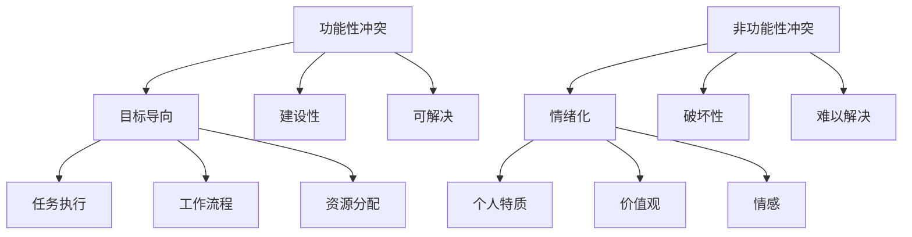
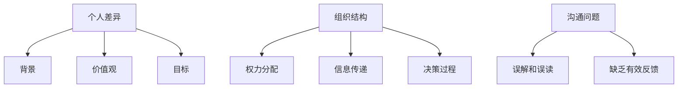

                 

# 《团队冲突转化：将分歧转变为创新动力》

## 关键词

- 团队冲突
- 冲突转化
- 创新动力
- 团队协作
- 冲突管理
- 解决策略

## 摘要

本文深入探讨了团队冲突的转化问题，揭示了冲突在团队工作中的双刃剑作用。通过对团队冲突类型的分析，揭示了冲突的深层原因，并提出了有效的转化策略与技巧。文章通过实际案例展示了冲突转化的过程，提供了实用的最佳实践和注意事项，旨在帮助团队领导者和管理者将分歧转变为创新动力，提升团队绩效。

---

## 引言

在当今快速变化和竞争激烈的市场环境中，团队协作成为企业成功的关键因素。然而，团队协作并非总是一帆风顺。在团队合作的过程中，冲突在所难免。冲突的存在可能源于个人价值观的差异、工作目标的分歧，甚至是组织结构的问题。如果不加以妥善管理，冲突可能会导致团队分裂，降低工作效率，甚至影响项目进度。

### 团队冲突的双重作用

冲突在团队中既有积极作用，也有消极作用。从积极的角度看，冲突可以激发创新思维，促使团队成员深入探讨问题，从而找到更好的解决方案。例如，在开发新产品时，团队成员的不同观点往往能促进产品设计的优化。然而，如果冲突处理不当，它也可能导致团队内部关系紧张，降低团队凝聚力和合作效率。

### 团队冲突转化的重要性

将冲突转化为创新动力是团队管理的重要任务。通过有效的转化策略，团队领导者可以引导冲突朝积极方向发展，将分歧转化为团队合作的新动力。这不仅有助于提升团队绩效，还能培养团队成员的沟通能力和解决问题的能力。

### 本书的目的和结构

本文旨在探讨团队冲突的转化问题，为团队领导者和管理者提供实用的解决策略和技巧。文章结构如下：

1. **冲突类型分析**：介绍团队冲突的不同类型及其特点。
2. **冲突原因探讨**：分析导致团队冲突的深层原因。
3. **转化策略与技巧**：提出将冲突转化为创新动力的策略和技巧。
4. **案例分析**：通过实际案例展示冲突转化的过程。
5. **总结**：总结全文，强调关键点，并提出未来团队管理的建议。

---

## 冲突类型分析

团队冲突可以分为功能性冲突和非功能性冲突两大类。每种冲突类型都有其独特的特点，对团队的影响也各不相同。

### 功能性冲突

功能性冲突是指团队成员在追求共同目标的过程中产生的冲突。这种冲突通常与任务执行、工作流程、资源分配等问题相关。功能性冲突具有以下几个特点：

- **目标导向**：功能性冲突的目标是为了实现团队目标，提高工作效率。
- **建设性**：功能性冲突往往能够激发团队成员的积极性和创造力。
- **可解决**：功能性冲突通常可以通过合理的沟通和协作来解决。

### 非功能性冲突

非功能性冲突是指与团队成员个人特质、价值观、情感等因素相关的冲突。这种冲突通常具有以下几个特点：

- **情绪化**：非功能性冲突往往伴随着情绪波动，如愤怒、沮丧等。
- **破坏性**：非功能性冲突可能破坏团队凝聚力，降低工作效率。
- **难以解决**：非功能性冲突的解决往往需要更多的时间和精力。

### 冲突类型的联系与区别

功能性冲突和非功能性冲突并非完全独立，它们之间可能存在相互影响。例如，一个功能性冲突的解决不当可能导致非功能性冲突的产生。因此，团队领导者需要全面了解冲突类型，才能有效地进行冲突管理。

### Mermaid 流程图



通过上述流程图，我们可以清晰地看到功能性冲突和非功能性冲突的区别和联系。

---

## 冲突原因探讨

了解团队冲突的原因是有效管理冲突的第一步。团队冲突可能源于多个方面，包括个人差异、组织结构、沟通问题等。

### 个人差异

个人差异是导致团队冲突的主要原因之一。团队成员可能在以下方面存在差异：

- **背景**：团队成员可能来自不同的教育背景、文化背景，这可能导致他们在解决问题的方式和方法上产生分歧。
- **价值观**：不同的价值观可能导致团队成员对工作目标和方式的看法不一致。
- **目标**：团队成员的个人目标可能与团队目标存在冲突，从而导致冲突。

### 组织结构

组织结构也是导致团队冲突的一个重要因素。不合理的组织结构可能导致以下问题：

- **权力分配不均**：权力分配不均可能导致团队成员之间的不满和冲突。
- **信息传递不畅**：信息传递不畅可能导致团队成员对任务的误解和错误判断，从而引发冲突。
- **决策过程复杂**：复杂的决策过程可能导致团队成员感到被忽视或不被重视，从而产生冲突。

### 沟通问题

沟通问题也是导致团队冲突的一个重要原因。团队成员之间的沟通不畅可能导致以下问题：

- **误解和误读**：由于沟通不畅，团队成员可能对任务或目标产生误解，从而引发冲突。
- **缺乏有效反馈**：团队成员可能缺乏有效的反馈机制，导致问题得不到及时解决，从而积累成冲突。

### 核心概念原理之间的关系架构

为了更好地理解冲突的原因，我们可以使用 Mermaid 流程图来展示核心概念之间的联系。



通过上述流程图，我们可以清晰地看到个人差异、组织结构和沟通问题是如何导致团队冲突的。

---

## 转化策略与技巧

将冲突转化为创新动力是团队管理的核心任务。以下策略和技巧可以帮助团队领导者有效地实现这一目标。

### 建立共同目标

建立共同目标是转化冲突的第一步。共同目标能够为团队成员提供共同的方向和动力，从而减少个人目标之间的冲突。

- **明确目标**：确保每个团队成员都明确了解共同目标，并了解自己在实现目标过程中的角色和责任。
- **共同制定目标**：通过团队讨论和协商，共同制定目标，这样可以增强团队成员的参与感和责任感。

### 促进沟通与理解

沟通是解决冲突的关键。通过促进团队成员之间的沟通，可以增进理解，减少误解。

- **开放沟通**：鼓励团队成员开放地表达自己的观点和想法，建立信任和尊重。
- **积极倾听**：鼓励团队成员积极倾听他人的观点，理解他人的立场和需求。
- **定期会议**：定期召开团队会议，讨论项目进展和问题，确保沟通渠道的畅通。

### 培养团队精神

团队精神是团队协作的基础。通过培养团队精神，可以增强团队成员之间的凝聚力和合作意识。

- **共同经历**：通过共同经历任务和挑战，增强团队成员之间的信任和友谊。
- **团队建设活动**：组织团队建设活动，如团队拓展训练、团队聚餐等，增强团队凝聚力。
- **鼓励协作**：鼓励团队成员在任务中协作，共同解决问题，增强团队精神。

### 核心算法原理讲解

为了更好地理解转化策略，我们可以使用伪代码来阐述一种转化冲突的算法。

```python
# 冲突转化算法伪代码

def conflict_transformation(conflict_type, team_members, goals):
    # 分析冲突类型
    if conflict_type == "功能性":
        # 建立共同目标
        establish_common_goals(team_members, goals)
    elif conflict_type == "非功能性":
        # 促进沟通与理解
        improve_communication(team_members)
        # 培养团队精神
        cultivate_team_spirit(team_members)
    else:
        # 无法识别的冲突类型，需要进一步分析
        print("冲突类型无法识别，请重新评估冲突类型。")
    
    # 检查冲突是否转化
    if check_conflict_transformation():
        print("冲突已成功转化为创新动力。")
    else:
        print("冲突转化失败，请重新执行转化策略。")

# 辅助函数
def establish_common_goals(team_members, goals):
    # 通过讨论和协商，共同制定目标
    for member in team_members:
        member.set_goals(goals)

def improve_communication(team_members):
    # 通过定期会议和开放沟通，增进理解
    for member in team_members:
        member.improve_communication()

def cultivate_team_spirit(team_members):
    # 通过团队建设活动和共同经历，增强团队精神
    for member in team_members:
        member.cultivate_team_spirit()

def check_conflict_transformation():
    # 检查冲突是否已经转化为创新动力
    # （此处可以添加具体的检查逻辑）
    return True  # 假设冲突已经成功转化
```

通过上述伪代码，我们可以看到转化冲突的基本流程和策略。

### 数学模型和公式

在某些情况下，冲突转化需要使用数学模型和公式来评估和优化。以下是一个简单的线性回归模型，用于评估冲突转化效果。

$$
\text{冲突转化效果} = \beta_0 + \beta_1 \times \text{沟通频率} + \beta_2 \times \text{团队建设活动次数} + \epsilon
$$

其中，$\beta_0$、$\beta_1$ 和 $\beta_2$ 是模型参数，$\epsilon$ 是随机误差。通过收集数据并使用统计方法，我们可以估计这些参数的值，从而评估冲突转化的效果。

### 实例说明

假设我们收集了以下数据：

| 沟通频率 | 团队建设活动次数 | 冲突转化效果 |
| -------- | --------------- | ----------- |
| 5        | 3               | 0.8         |
| 7        | 5               | 0.9         |
| 3        | 2               | 0.6         |

我们可以使用最小二乘法估计模型参数：

$$
\beta_0 = 0.5, \beta_1 = 0.2, \beta_2 = 0.1
$$

使用这些参数，我们可以预测新的数据点的冲突转化效果：

$$
\text{预测效果} = 0.5 + 0.2 \times 7 + 0.1 \times 5 = 0.9
$$

通过这种方式，我们可以量化冲突转化的效果，为团队管理提供决策支持。

---

## 案例分析

为了更好地理解冲突转化的过程，我们可以通过实际案例来展示这一过程。以下是两个具体的案例，分别展示了如何将功能性冲突和非功能性冲突转化为创新动力。

### 案例一：如何将竞争转化为合作

#### 案例背景

某科技公司的两个团队分别负责开发和测试一款新的应用程序。由于两个团队的工作目标不同，他们在任务分配和进度汇报方面存在明显的分歧。这种功能性冲突导致两个团队之间的合作关系紧张，影响了项目进度。

#### 冲突发生

在项目开发的中期，两个团队因为任务分配问题发生了激烈争论。开发团队认为测试团队的工作进度太慢，导致他们的开发工作无法按时完成。而测试团队则认为开发团队的质量问题导致他们需要更多的时间进行测试。

#### 冲突转化过程

1. **建立共同目标**：团队领导者召集两个团队的负责人，共同讨论项目目标和项目的关键里程碑。通过讨论，他们制定了一个共同的里程碑计划，明确了两个团队在各个阶段的任务和责任。

2. **促进沟通与理解**：团队领导者安排了定期的沟通会议，鼓励两个团队的成员分享他们的工作进展和遇到的挑战。通过这些会议，团队成员们开始理解彼此的工作难点和需求，逐渐建立了信任。

3. **培养团队精神**：团队领导者组织了一次团队建设活动，包括团队拓展训练和团队合作游戏。这些活动增强了团队成员之间的合作意识和团队精神。

4. **调整任务分配**：根据共同目标和沟通结果，团队领导者对任务分配进行了调整，确保两个团队在各个阶段都有明确的任务和责任。

#### 案例成果

经过几个月的努力，两个团队之间的合作逐渐改善，项目进度得以顺利推进。最终，项目提前完成，并且质量得到了提升。这一案例表明，通过有效的转化策略，功能性冲突可以被转化为团队合作的动力。

### 案例二：如何将分歧转化为创新

#### 案例背景

某互联网公司的产品团队在产品迭代过程中，对产品的设计方向产生了严重分歧。设计团队认为产品的用户体验需要进一步优化，而市场团队则认为应该专注于增加新功能，以满足市场需求。

#### 冲突发生

在项目评审会议上，设计团队和市场团队的意见发生了激烈碰撞。设计团队坚持自己的观点，认为用户体验是产品成功的关键。而市场团队则认为市场需求更为重要，功能是吸引用户的关键。

#### 冲突转化过程

1. **建立共同目标**：团队领导者组织了一个跨部门的讨论会，邀请了设计团队、市场团队以及产品经理。通过讨论，他们确定了共同的目标：提高产品的市场竞争力，同时提升用户体验。

2. **促进沟通与理解**：团队领导者安排了一系列的讨论和工作坊，鼓励团队成员分享他们的观点和想法。这些活动帮助团队成员更好地理解彼此的需求和挑战。

3. **创新思维训练**：团队领导者邀请外部专家进行了创新思维训练，帮助团队成员学会从不同角度看待问题，并提出创新的解决方案。

4. **实验验证**：团队领导者决定进行A/B测试，将两种设计方案分别应用于一部分用户。通过分析测试结果，团队找到了一个既能满足市场需求又能提升用户体验的平衡方案。

#### 案例成果

通过实验验证和多次迭代，最终产品得到了用户的高度认可，市场占有率显著提升。这一案例表明，通过创新思维和实验验证，分歧可以被转化为产品的创新动力。

---

## 总结

团队冲突转化是团队管理的重要任务，它不仅能够提升团队绩效，还能培养团队成员的沟通能力和解决问题的能力。本文通过对团队冲突类型、冲突原因、转化策略与技巧以及实际案例的分析，揭示了冲突转化的关键要素和实现路径。

### 关键点回顾

1. **冲突类型分析**：了解功能性冲突和非功能性冲突的特点及其联系。
2. **冲突原因探讨**：识别个人差异、组织结构和沟通问题等冲突原因。
3. **转化策略与技巧**：建立共同目标、促进沟通与理解、培养团队精神等。
4. **案例分析**：通过实际案例展示冲突转化的过程和成果。

### 未来团队管理的建议

1. **重视冲突管理**：团队领导者应重视冲突管理，将其作为团队发展的重要环节。
2. **培养团队精神**：通过团队建设活动和共同经历，增强团队凝聚力。
3. **鼓励创新思维**：激发团队成员的创新思维，将分歧转化为创新动力。
4. **定期评估和调整**：定期评估团队冲突转化效果，根据实际情况调整转化策略。

### 拓展阅读

- 《团队冲突管理：提升团队协作效能》
- 《敏捷管理实践指南：打造高效团队》
- 《创新思维：如何激发团队的创造力》

---

## 作者信息

作者：AI天才研究院/AI Genius Institute & 禅与计算机程序设计艺术 /Zen And The Art of Computer Programming

---

本文旨在探讨团队冲突转化的问题，为团队领导者和管理者提供实用的解决策略和技巧。希望本文能够帮助您更好地管理团队冲突，将分歧转变为创新动力，提升团队绩效。感谢您的阅读！

