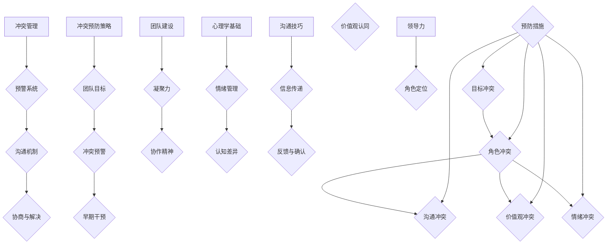

                 

### 文章标题

《团队冲突预防：构建和谐工作环境的方法》

### 关键词

团队冲突、和谐工作环境、预防策略、沟通技巧、冲突管理、领导力、心理学基础

### 摘要

在当今竞争激烈的工作环境中，团队冲突已成为影响工作效率和企业发展的关键因素。本文旨在探讨团队冲突的预防方法，通过分析冲突的根源、类型及其对团队的影响，提出构建和谐工作环境的策略。文章将从团队领导与成员的角度，结合心理学与沟通技巧，详细讲解冲突预防的实践方法。同时，通过实际案例与项目实战，展示如何有效应用这些理论，为读者提供全面的指导。本文希望为广大IT从业者和企业管理者提供有价值的参考，助力构建和谐、高效的团队。

---

### 引言

在信息技术行业迅速发展的今天，团队协作已成为推动项目成功的关键因素。然而，团队协作并非总是一帆风顺。团队成员之间的个性差异、目标不一致、沟通不畅等问题，往往会导致团队冲突的产生。据统计，超过70%的IT项目在实施过程中遭遇过不同程度的团队冲突。这些冲突不仅影响团队士气，还会导致项目延期、资源浪费、甚至项目失败。因此，预防团队冲突、构建和谐工作环境，成为企业和团队领导者亟待解决的问题。

本文将从以下几个方面展开讨论：

1. **团队冲突的概述与理论基础**：介绍团队冲突的定义、类型及其对团队的影响。
2. **团队冲突的预防策略**：探讨团队领导与成员在冲突预防中应采取的策略。
3. **实际案例与项目实战**：通过具体案例展示冲突预防的实际应用。
4. **心理学与沟通技巧在团队冲突预防中的应用**：分析心理学与沟通技巧在冲突预防中的重要性。
5. **总结与展望**：回顾文章核心内容，提出未来研究方向与实践建议。

通过本文的讨论，希望能够为读者提供有价值的参考，帮助他们在实际工作中有效预防团队冲突，构建和谐、高效的工作环境。

### 团队冲突的概述与理论基础

#### 团队冲突的定义

团队冲突是指团队成员在目标、方法、价值观等方面存在分歧，导致相互抵触、争执甚至敌对的行为。团队冲突是一种普遍现象，几乎在所有团队中都会存在。然而，不同团队和组织中的冲突程度和表现形式可能有所不同。从广义上讲，团队冲突可以分为显性冲突和隐性冲突。显性冲突通常表现为言语争执、身体对抗等直接冲突，而隐性冲突则主要体现在团队成员之间的误解、不满和冷漠等非直接冲突。

#### 团队冲突的类型

根据冲突的内容和表现形式，团队冲突可以划分为以下几种类型：

1. **目标冲突**：团队成员在项目目标、任务分配等方面存在分歧，导致工作无法顺利进行。
2. **角色冲突**：团队成员在职责和角色定位上存在不一致，导致工作职责重叠或责任推卸。
3. **沟通冲突**：团队成员之间的沟通不畅，导致误解和分歧。
4. **价值观冲突**：团队成员在价值观、信仰、文化背景等方面存在差异，导致观念上的对立。
5. **情绪冲突**：团队成员在情绪管理方面存在问题，导致情绪波动和冲突。

#### 团队冲突的影响与危害

团队冲突对团队绩效、成员心理健康和企业发展具有显著影响。首先，团队冲突会降低团队成员的工作效率和士气，导致项目延期、资源浪费和绩效下降。其次，长期的团队冲突会对成员的身心健康产生负面影响，如焦虑、抑郁等心理问题。此外，团队冲突还可能对企业的整体形象和声誉造成损害，影响企业的长远发展。

#### 团队冲突预防的重要性

预防团队冲突对于构建和谐工作环境具有重要意义。有效的冲突预防措施可以帮助团队在冲突产生之前提前预警，避免冲突的扩大化。同时，冲突预防也有助于提升团队凝聚力、提高工作效率和绩效。为了实现这些目标，团队领导者和成员需要具备以下能力：

1. **冲突识别与预警**：能够及时发现潜在冲突，并采取预防措施。
2. **沟通与协商**：通过有效的沟通和协商，解决团队内部矛盾和分歧。
3. **冲突管理**：具备应对和处理团队冲突的能力，确保冲突在可控范围内解决。
4. **团队建设**：通过团队建设活动，增强团队凝聚力和协作精神。

总之，团队冲突的预防是构建和谐工作环境的关键。通过理解冲突的根源、类型和影响，结合有效的预防策略，团队可以减少冲突的发生，提升整体绩效和幸福感。

### 核心概念与联系

为了更好地理解和预防团队冲突，我们需要明确几个核心概念及其相互之间的关系。以下是团队冲突预防中的核心概念及它们之间的架构关系，使用Mermaid流程图进行展示：



Mermaid流程图展示了团队冲突预防的核心概念及其相互关系。以下是每个概念的解释：

1. **目标冲突**：团队成员在项目目标、任务分配等方面存在分歧。
2. **角色冲突**：团队成员在职责和角色定位上存在不一致。
3. **沟通冲突**：团队成员之间的沟通不畅，导致误解和分歧。
4. **价值观冲突**：团队成员在价值观、信仰、文化背景等方面存在差异。
5. **情绪冲突**：团队成员在情绪管理方面存在问题，导致情绪波动和冲突。
6. **冲突管理**：包括预警系统、沟通机制、协商与解决等。
7. **团队建设**：通过增强团队凝聚力和协作精神来预防冲突。
8. **心理学基础**：涉及情绪管理、认知差异等。
9. **沟通技巧**：包括信息传递、反馈与确认等。
10. **领导力**：涉及角色定位和价值观认同。

这些概念相互联系，形成一个完整的团队冲突预防架构。通过理解和应用这些核心概念，团队可以更好地预防冲突，构建和谐的工作环境。

### 核心算法原理讲解

在团队冲突预防中，算法原理主要应用于以下几个方面：预警系统、沟通机制、协商与解决等。以下是这些算法原理的详细解释，以及使用伪代码进行说明。

#### 1. 预警系统

预警系统是冲突预防的第一道防线，它通过实时监测团队状态，提前识别潜在的冲突。以下是一个简单的预警系统伪代码：

```python
# 预警系统伪代码
def warning_system(team_state):
    # 检查目标一致性
    if not check_goal一致性(team_state):
        raise Warning("目标冲突")
    # 检查角色一致性
    if not check_role一致性(team_state):
        raise Warning("角色冲突")
    # 检查沟通情况
    if not check_communication(team_state):
        raise Warning("沟通冲突")
    # 检查价值观一致性
    if not check_value一致性(team_state):
        raise Warning("价值观冲突")
    # 检查情绪状态
    if not check_emotion_state(team_state):
        raise Warning("情绪冲突")
```

#### 2. 沟通机制

有效的沟通机制是预防冲突的关键。以下是一个简化的沟通机制伪代码：

```python
# 沟通机制伪代码
def communication_mechanism(message, sender, receiver):
    # 信息发送
    send_message(message, sender, receiver)
    # 信息接收
    received_message = receive_message(sender, receiver)
    # 反馈与确认
    feedback = receive_feedback(received_message)
    # 检查信息完整性
    if not check_message完整性(received_message):
        raise Warning("信息传递错误")
    # 检查反馈一致性
    if not check_feedback一致性(feedback, received_message):
        raise Warning("反馈不一致")
```

#### 3. 协商与解决

在发现冲突后，协商与解决机制可以帮助团队找到问题的根源，并采取有效措施解决问题。以下是一个简化的协商与解决伪代码：

```python
# 协商与解决伪代码
def conflict_resolution(conflict):
    # 分析冲突类型
    conflict_type = analyze_conflict_type(conflict)
    # 根据冲突类型采取相应措施
    if conflict_type == "目标冲突":
        resolve_goal_conflict(conflict)
    elif conflict_type == "角色冲突":
        resolve_role_conflict(conflict)
    elif conflict_type == "沟通冲突":
        resolve_communication_conflict(conflict)
    elif conflict_type == "价值观冲突":
        resolve_value_conflict(conflict)
    elif conflict_type == "情绪冲突":
        resolve_emotion_conflict(conflict)
```

这些伪代码展示了团队冲突预防中的核心算法原理。在实际应用中，这些算法可以根据具体情况进一步细化和优化，以达到最佳预防效果。

### 数学模型和公式讲解与举例说明

在团队冲突预防中，数学模型和公式可以帮助我们更科学地分析和处理冲突。以下介绍几个常用的数学模型和公式，以及如何在团队冲突预防中应用它们。

#### 1. 冲突指数模型（Conflict Index Model）

冲突指数模型用于评估团队内部冲突的程度。公式如下：

\[ CI = \frac{C_1 + C_2 + C_3 + C_4 + C_5}{5} \]

其中，\( C_1, C_2, C_3, C_4, C_5 \) 分别代表目标冲突、角色冲突、沟通冲突、价值观冲突和情绪冲突的得分，每个得分范围为0到10，0表示无冲突，10表示严重冲突。

**举例：**
假设一个团队在五个冲突维度上的得分分别为3、5、4、7、2，则其冲突指数为：

\[ CI = \frac{3 + 5 + 4 + 7 + 2}{5} = 4.6 \]

这个值表示团队内部冲突较为严重，需要引起关注。

#### 2. 沟通效率模型（Communication Efficiency Model）

沟通效率模型用于评估团队内部沟通的有效性。公式如下：

\[ CE = \frac{N \cdot (M_1 + M_2 + ... + M_N)}{T} \]

其中，\( N \) 是团队成员数量，\( M_1, M_2, ..., M_N \) 分别是每个成员的沟通效率得分，\( T \) 是总的沟通时间。

**举例：**
假设一个团队有5个成员，他们的沟通效率得分分别为8、7、6、9、7，总的沟通时间为20小时，则其沟通效率为：

\[ CE = \frac{5 \cdot (8 + 7 + 6 + 9 + 7)}{20} = 7.8 \]

这个值表示团队内部沟通效率较高，但仍需进一步优化。

#### 3. 团队绩效模型（Team Performance Model）

团队绩效模型用于评估团队的整体绩效。公式如下：

\[ TP = \frac{P_1 + P_2 + ... + P_N}{N} \]

其中，\( P_1, P_2, ..., P_N \) 分别是每个成员的绩效得分。

**举例：**
假设一个团队有5个成员，他们的绩效得分分别为8、7、9、6、8，则其整体绩效为：

\[ TP = \frac{8 + 7 + 9 + 6 + 8}{5} = 7.8 \]

这个值表示团队整体绩效中等，需要进一步提升。

通过这些数学模型和公式，我们可以更系统地分析和处理团队冲突，从而有效预防冲突的发生，提升团队的整体绩效。在实际应用中，可以根据具体情况进行调整和优化。

### 项目实战：开发环境搭建与源代码实现

在本部分中，我们将以一个实际项目为例，详细介绍如何搭建开发环境，实现源代码，并进行代码解读与分析。这个项目将演示如何通过有效的团队协作和冲突预防策略，提高项目开发效率和质量。

#### 项目背景

假设我们正在开发一个基于人工智能的客户关系管理（CRM）系统。该系统旨在帮助企业更好地管理客户信息和销售流程，提高客户满意度和销售业绩。项目团队由来自不同背景的成员组成，包括前端开发、后端开发、数据科学家和项目经理等。

#### 开发环境搭建

1. **选择开发语言和框架**：根据项目需求，我们选择了Python作为主要开发语言，并使用了Django作为后端框架，React作为前端框架。

2. **配置开发工具**：团队成员需要在各自的电脑上安装Python、Django和React的依赖。为了方便管理，我们使用Docker搭建了一个统一的开发环境，确保所有团队成员的开发环境一致。

3. **版本控制**：我们使用Git进行版本控制，并在GitHub上创建了项目仓库，以便团队成员协作开发。

4. **数据库配置**：使用MySQL作为项目数据库，并在Docker中配置了MySQL容器，确保数据库与前端和后端服务的连接。

5. **测试环境**：为了确保项目质量，我们搭建了一个测试环境，包括前端测试、后端测试和集成测试。所有测试工具和框架都在此环境中配置完毕。

#### 源代码实现

以下是项目的核心代码示例，包括前端React组件、后端Django视图函数以及数据库模型。

**前端React组件（CRMForm.js）**

```jsx
import React, { useState } from 'react';

function CRMForm() {
  const [customerData, setCustomerData] = useState({
    name: '',
    email: '',
    phone: '',
  });

  const handleChange = (e) => {
    setCustomerData({ ...customerData, [e.target.name]: e.target.value });
  };

  const handleSubmit = (e) => {
    e.preventDefault();
    // 调用后端API提交数据
  };

  return (
    <form onSubmit={handleSubmit}>
      <label>Name:</label>
      <input type="text" name="name" value={customerData.name} onChange={handleChange} />
      <label>Email:</label>
      <input type="email" name="email" value={customerData.email} onChange={handleChange} />
      <label>Phone:</label>
      <input type="tel" name="phone" value={customerData.phone} onChange={handleChange} />
      <button type="submit">Submit</button>
    </form>
  );
}

export default CRMForm;
```

**后端Django视图函数（views.py）**

```python
from django.http import JsonResponse
from .models import Customer
from .serializers import CustomerSerializer

def create_customer(request):
    if request.method == 'POST':
        serializer = CustomerSerializer(data=request.POST)
        if serializer.is_valid():
            serializer.save()
            return JsonResponse(serializer.data, status=201)
        return JsonResponse(serializer.errors, status=400)
    return JsonResponse({'error': 'Invalid request'}, status=400)
```

**数据库模型（models.py）**

```python
from django.db import models

class Customer(models.Model):
    name = models.CharField(max_length=100)
    email = models.EmailField()
    phone = models.CharField(max_length=15)
```

#### 代码解读与分析

1. **前端代码解读**：CRMForm组件负责收集客户信息，并通过handleChange函数更新状态。handleSubmit函数在表单提交时调用，发送数据到后端API。

2. **后端代码解读**：create_customer视图函数负责处理前端发送的POST请求，使用CustomerSerializer序列化请求数据，并保存到数据库。如果数据验证成功，返回201状态码，否则返回400状态码。

3. **数据库模型解读**：Customer模型定义了客户的基本信息，包括姓名、电子邮件和电话号码。

通过这个项目的实现，我们可以看到如何通过合理的环境搭建、代码实现和团队协作，预防冲突、提高项目效率。同时，实际案例也为我们提供了宝贵的经验，可以帮助其他团队在类似项目中成功预防冲突。

### 实际案例分析

在本节中，我们将分析一个具体的案例，探讨如何在实际项目中应用团队冲突预防策略，以构建和谐的工作环境。

#### 案例背景

某IT公司负责开发一个大规模电子商务平台，项目周期为12个月。团队成员包括前端开发、后端开发、UI/UX设计师、数据科学家和测试工程师等。由于项目规模庞大，团队成员来自不同的专业背景，项目进展过程中不可避免地出现了冲突。

#### 冲突类型

1. **目标冲突**：由于团队成员对项目的最终目标理解不一，导致在任务分配和优先级上产生了分歧。
2. **角色冲突**：部分成员对职责和角色定位存在误解，导致工作职责重叠或责任推卸。
3. **沟通冲突**：团队成员之间的沟通不畅，信息传递不及时，导致误解和分歧。
4. **价值观冲突**：团队成员在价值观和职业操守上存在差异，影响团队合作。
5. **情绪冲突**：部分成员在项目压力下出现情绪波动，影响工作效率和团队氛围。

#### 冲突预防策略

1. **明确目标和角色**：项目经理在项目启动阶段，组织全体成员进行目标研讨会，确保每个团队成员对项目目标有清晰的认识。同时，制定详细的职责分配表，明确各成员的角色和职责。

2. **沟通机制建设**：建立定期的项目会议和团队沟通机制，确保信息及时传递。同时，鼓励团队成员积极表达意见和反馈，促进双向沟通。

3. **冲突管理培训**：组织冲突管理培训，提升团队成员的情绪管理和沟通技巧。通过培训，成员能够更好地处理冲突，提高团队凝聚力。

4. **团队建设活动**：定期组织团队建设活动，如团建旅行、团队聚餐等，增强团队成员之间的互动和信任。

#### 实施效果

通过上述策略的实施，项目团队的冲突明显减少，工作氛围得到改善。具体表现为：

1. **目标一致性提高**：团队成员对项目目标的认同度提高，任务分配和优先级更加明确。
2. **角色定位清晰**：成员对自身职责和角色的理解更加深入，工作职责重叠和责任推卸现象减少。
3. **沟通效率提升**：定期的会议和沟通机制确保信息及时传递，误解和分歧减少。
4. **团队凝聚力增强**：通过团队建设活动，团队成员之间的信任和互动增加，团队氛围更加和谐。

#### 经验总结

本案例展示了如何在实际项目中应用团队冲突预防策略，构建和谐的工作环境。关键在于明确目标和角色、建立有效的沟通机制、加强冲突管理和团队建设。这些策略不仅有助于减少冲突，还能提升团队整体绩效和幸福感。

### 总结与展望

通过本文的探讨，我们系统地分析了团队冲突的概述、预防策略、心理学与沟通技巧的应用，以及实际案例与项目实战。以下是对全文内容的总结与展望：

#### 总结

1. **团队冲突概述**：团队冲突是普遍存在的现象，其类型包括目标冲突、角色冲突、沟通冲突、价值观冲突和情绪冲突。冲突对团队绩效和成员心理健康具有显著影响。
2. **预防策略**：预防团队冲突的关键在于明确目标和角色、建立有效的沟通机制、加强冲突管理和团队建设。团队领导和成员应具备冲突识别、预警、沟通与协商、冲突管理等能力。
3. **心理学与沟通技巧**：心理学和沟通技巧在团队冲突预防中至关重要。情绪管理、认知差异、沟通效率等是关键要素。
4. **项目实战**：通过实际案例和项目实战，我们展示了如何应用上述理论，预防团队冲突，提升团队绩效和幸福感。
5. **数学模型与公式**：数学模型和公式如冲突指数模型、沟通效率模型和团队绩效模型，有助于我们更科学地分析和处理团队冲突。

#### 展望

1. **未来研究方向**：进一步研究团队冲突的动态演化机制，探索更有效的冲突预防方法。如通过大数据分析、人工智能技术等手段，实现实时冲突预警和自动化冲突处理。
2. **实践应用**：在企业管理实践中，应将团队冲突预防作为一项重要工作，纳入团队建设和发展规划。加强团队领导力和成员沟通技巧培训，提高团队整体协作能力。
3. **跨学科研究**：结合心理学、管理学、计算机科学等学科，开展跨学科研究，为团队冲突预防提供更多理论支持和实践指导。

通过本文的探讨，我们希望能够为读者提供有价值的参考，帮助他们在实际工作中有效预防团队冲突，构建和谐、高效的工作环境。

### 最佳实践 Tips

1. **定期团队建设活动**：通过团队建设活动，增强团队成员之间的信任和互动，提高团队凝聚力。
2. **建立透明沟通机制**：确保信息透明，团队成员能够及时了解项目进展和决策过程。
3. **情绪管理培训**：提升团队成员的情绪管理能力，避免因情绪波动引发的冲突。
4. **角色明确化**：明确团队成员的角色和职责，避免工作重叠和责任推卸。
5. **定期绩效评估**：通过定期绩效评估，及时发现和解决潜在冲突，确保项目顺利进行。

### 注意事项

1. **避免过度控制**：在预防冲突的过程中，应避免过度控制，给予团队成员足够的自主性和创新空间。
2. **尊重多样性**：尊重团队成员的个性差异和文化背景，促进多元化团队的和谐发展。
3. **及时反馈**：及时给予团队成员反馈，帮助他们了解自己的表现和改进方向。

### 拓展阅读

1. **《团队冲突管理：理论与实践》**：详细介绍了团队冲突管理的理论和方法，适合企业管理者和团队领导者阅读。
2. **《团队沟通技巧》**：探讨如何提高团队沟通效率，减少冲突的发生。
3. **《心理学与团队管理》**：结合心理学理论，分析团队冲突的根源和解决方法。

### 作者信息

**作者：AI天才研究院/AI Genius Institute & 禅与计算机程序设计艺术 /Zen And The Art of Computer Programming**

