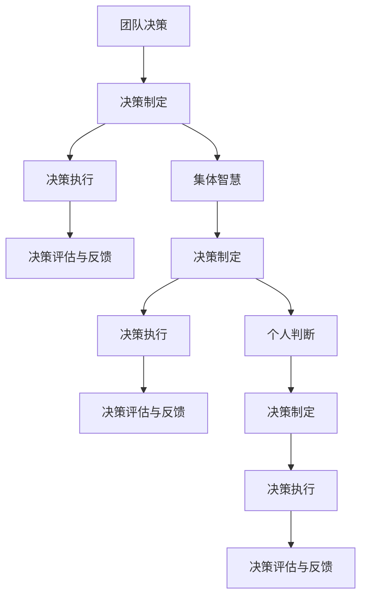
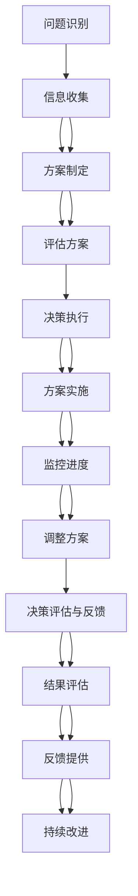

                 

## 文章标题

# 团队决策的艺术：集体智慧 vs 个人判断

> 关键词：团队决策、集体智慧、个人判断、决策质量、流程、障碍、方法、案例分析、最佳实践

> 摘要：本文旨在深入探讨团队决策过程中的核心问题——集体智慧与个人判断的优缺点及其在决策中的应用。通过分析团队决策的定义、过程、理论基础和实践案例，文章揭示了如何平衡集体智慧与个人判断，以提高团队决策的质量和效率。

----------------------------------------------------------------

## 引言与基础理论

### 1. 团队决策的定义与重要性

**团队决策**是指在一个团队中，通过共同讨论和分析，达成一致的决策过程。它不仅关系到团队的日常运营，还直接影响组织的战略发展方向。

**团队决策的重要性**体现在以下几个方面：

1. **提高决策质量**：集体智慧往往能够汇聚团队成员的不同观点和专业知识，从而提高决策的全面性和准确性。
2. **增强团队凝聚力**：共同参与决策过程，有助于增强团队成员之间的信任和合作意识。
3. **激发创新思维**：集体讨论能够激发团队成员的创新思维，有助于发现新的解决方案。
4. **减少决策失误**：团队决策可以减少个人判断的偏见和盲点，降低决策失误的风险。

### 1.2. 团队决策的类型

团队决策可以分为以下几种类型：

1. **共识决策**：团队成员就某个问题达成完全一致的决策。
2. **多数决策**：根据团队成员的投票结果来决定。
3. **独裁决策**：由团队中的某个成员或领导者做出决策。
4. **混合决策**：结合多种决策方式，根据实际情况灵活选择。

### 1.3. 团队决策的过程

团队决策通常包括以下步骤：

1. **识别问题**：明确需要决策的问题和目标。
2. **收集信息**：收集与问题相关的数据和信息。
3. **制定备选方案**：列出所有可能的解决方案。
4. **评估方案**：分析各方案的优缺点，选择最佳方案。
5. **决策执行**：实施决策方案。
6. **评估结果**：对决策结果进行评估，提供反馈。

---

**核心概念与联系**

为了更好地理解团队决策中的集体智慧与个人判断，我们可以使用Mermaid流程图来展示它们之间的关系：



在这个流程图中，我们可以看到集体智慧和个人判断在决策的各个阶段都扮演着重要的角色。集体智慧通过综合团队成员的意见和专业知识，帮助团队做出更全面和准确的决策；而个人判断则在某些情况下能够提供独特的见解和创新方案。两者相辅相成，共同提高团队决策的质量。

---

### 2. 集体智慧与个人判断

**集体智慧**是指通过团队成员之间的协作和信息共享，共同解决问题和做出决策的过程。它依赖于团队成员的多样性、沟通能力和协作精神。

**个人判断**则是指团队成员根据自身的经验和知识，独立做出决策的过程。个人判断的优势在于其快速性和灵活性，能够迅速应对突发事件。

**集体智慧与个人判断的比较**如下：

| 特点 | 集体智慧 | 个人判断 |
| --- | --- | --- |
| 优点 | 能够汇集多种观点和专业知识，提高决策的全面性和准确性；增强团队凝聚力 | 快速性、灵活性，能够迅速应对突发事件；提供独特的见解和创新方案 |
| 缺点 | 沟通成本高，决策过程可能较长；容易受到群体思维的影响 | 可能会存在个人偏见和盲点；缺乏多样性 |
| 适用场景 | 需要全面分析和评估的问题；需要团队协作完成的任务 | 需要快速决策和应对突发事件的情况；需要独特见解和创新方案的问题 |

---

### 3. 团队决策的过程

**决策制定**是团队决策的核心步骤，它包括以下几个阶段：

1. **问题识别**：明确需要决策的问题和目标。
2. **信息收集**：收集与问题相关的数据和信息。
3. **方案制定**：列出所有可能的解决方案。
4. **评估方案**：分析各方案的优缺点，选择最佳方案。

**决策执行**是将决策方案转化为实际行动的过程，包括以下几个阶段：

1. **方案实施**：按照决策方案开始实施行动。
2. **监控进度**：监控方案实施的过程，确保按计划进行。
3. **调整方案**：根据实际情况对方案进行必要的调整。

**决策评估与反馈**是对决策结果进行评价和总结的过程，包括以下几个阶段：

1. **结果评估**：对决策结果进行评估，确定是否达到预期目标。
2. **反馈提供**：提供决策反馈，为未来的决策提供参考。
3. **持续改进**：根据反馈结果，持续改进决策过程。

---

**核心概念与联系**

我们可以使用Mermaid流程图来展示决策过程中的核心概念和联系：



在这个流程图中，我们可以看到决策制定、决策执行和决策评估与反馈是相互关联的。每个阶段都依赖于前一个阶段的结果，并且对后续阶段产生影响。通过这样的流程，团队可以不断提高决策的质量和效率。

---

### 4. 数学模型和数学公式

在团队决策中，数学模型和数学公式可以帮助我们更准确地评估和比较不同方案的优劣。以下是一个简单的数学模型：

$$
决策质量 = \frac{效用值}{风险值}
$$

**详细讲解**：

- **效用值**：表示决策带来的好处，可以是经济效益、社会效益等。
- **风险值**：表示决策可能带来的负面影响，可以是经济损失、社会影响等。

**举例说明**：

假设有两个决策方案：

1. **方案A**：预计效用值为100，风险值为10。
2. **方案B**：预计效用值为80，风险值为5。

根据上述数学模型，我们可以计算出两个方案的决策质量：

- **方案A**：决策质量 = 100 / 10 = 10
- **方案B**：决策质量 = 80 / 5 = 16

因此，方案B的决策质量更高，是一个更好的选择。

---

通过上述内容，我们可以看到团队决策是一个复杂的过程，涉及到多个阶段和核心概念。理解集体智慧与个人判断的区别和应用，掌握决策流程和数学模型，有助于我们更有效地进行团队决策，提高决策质量和效率。

---

## 团队决策的理论基础

### 4. 集体智慧的理论基础

**集体智慧**（Collective Intelligence）是指通过团队成员之间的协作和信息共享，共同解决问题和做出决策的能力。它是一种团队智慧和协作能力的体现，能够提高团队的整体决策质量和效率。

#### 4.1. 集体智慧的优势

1. **多元化的视角**：集体智慧能够汇集团队成员的不同观点和专业知识，从而提供更全面的视角，有助于发现潜在问题和解决方案。
2. **更高的决策质量**：集体智慧通过团队成员的共同努力，能够更准确地评估和分析问题，从而做出更高质量的决策。
3. **增强团队凝聚力**：集体智慧的过程能够增强团队成员之间的信任和合作，提高团队的凝聚力。
4. **促进创新思维**：集体智慧能够激发团队成员的创新思维，从而产生更多的创意和创新的解决方案。

#### 4.2. 集体智慧的研究方法

1. **案例研究**：通过分析成功团队决策的案例，总结集体智慧的形成过程和应用方法。
2. **实验研究**：通过设计和实施实验，研究集体智慧在不同情境下的表现和效果。
3. **模型分析**：建立数学模型和计算机模拟，分析集体智慧的理论基础和实际应用。

#### 4.3. 集体智慧的应用案例

1. **企业战略决策**：企业通过集体智慧，能够更全面地分析市场环境、竞争对手和客户需求，从而制定更有效的战略。
2. **项目管理**：在项目管理中，集体智慧能够帮助团队成员更好地分配资源、制定计划和解决问题。
3. **社会问题解决**：在社会问题解决中，集体智慧能够汇聚公众的意见和建议，形成有效的解决方案。

### 5. 个人判断的理论基础

**个人判断**（Individual Judgment）是指团队成员基于自身的经验和知识，独立做出决策的能力。它是一种个体智慧和决策能力的体现。

#### 5.1. 个人判断的优势

1. **快速性**：个人判断能够迅速应对突发事件，做出及时的反应。
2. **灵活性**：个人判断可以根据实际情况灵活调整决策，适应变化。
3. **独特性**：个人判断能够提供独特的见解和创新方案，有助于团队的创新和突破。
4. **责任明确**：个人判断使得团队成员对决策结果负责，提高决策执行的效率。

#### 5.2. 个人判断的研究方法

1. **心理测量**：通过心理测量工具，评估个体判断的能力和特点。
2. **行为研究**：通过观察和分析个体在决策过程中的行为，研究个人判断的影响因素和机制。
3. **案例研究**：通过分析个体决策的成功和失败案例，总结个人判断的经验和教训。

#### 5.3. 个人判断的应用案例

1. **领导决策**：领导者通过个人判断，能够快速做出战略决策，带领团队应对复杂局势。
2. **危机管理**：在危机管理中，个人判断能够帮助团队成员迅速评估情况，制定应对策略。
3. **创新项目**：在创新项目中，个人判断能够提供独特的创意和方案，推动项目的进展。

通过以上对集体智慧和个人判断的理论基础的分析，我们可以看到两者在团队决策中各有优势和应用场景。在实际的团队决策中，我们需要根据具体情况，合理利用集体智慧和个人判断，以达到最佳决策效果。

---

**核心概念与联系**

为了更好地理解集体智慧和个人判断之间的关系，我们可以使用Mermaid流程图来展示它们的核心概念和联系：

```mermaid
graph TD
A[集体智慧] --> B[多元化视角]
B --> C[决策质量]
C --> D[团队凝聚力]

E[个人判断] --> F[快速性]
F --> G[灵活性]
G --> H[独特性]

I[J[责任明确]]

B --> C
C --> D
F --> G
G --> H
I --> J
```

在这个流程图中，我们可以看到集体智慧和个人判断在不同的方面都发挥着重要作用。集体智慧通过多元化的视角和更高的决策质量，增强团队的凝聚力；而个人判断通过快速性、灵活性和独特性，为团队提供创新和应变能力。两者相辅相成，共同推动团队决策的顺利进行。

---

**核心算法原理讲解**

为了更深入地了解集体智慧和个人判断的算法原理，我们可以使用伪代码来详细阐述。以下是一个简单的算法框架：

```python
# 团队决策算法框架

# 输入：问题、团队成员信息、数据集
# 输出：最佳决策方案

def team_decision_making(problem, team_members, dataset):
    # 步骤1：信息收集
    information = collect_information(problem, dataset)

    # 步骤2：方案生成
    alternatives = generate_alternatives(information)

    # 步骤3：集体智慧评估
    collective_assessment = collective_intelligence_evaluation(alternatives, team_members)

    # 步骤4：个人判断评估
    individual_assessment = individual_judgment_evaluation(alternatives, team_members)

    # 步骤5：综合评估
    final_assessment = combine_assessments(collective_assessment, individual_assessment)

    # 步骤6：决策
    decision = select_best_decision(final_assessment)

    # 输出决策结果
    return decision

# 辅助函数定义
def collect_information(problem, dataset):
    # 收集与问题相关的数据和信息
    pass

def generate_alternatives(information):
    # 生成所有可能的解决方案
    pass

def collective_intelligence_evaluation(alternatives, team_members):
    # 集体智慧评估各方案
    pass

def individual_judgment_evaluation(alternatives, team_members):
    # 个人判断评估各方案
    pass

def combine_assessments(collective_assessment, individual_assessment):
    # 综合评估结果
    pass

def select_best_decision(final_assessment):
    # 选择最佳决策方案
    pass
```

在这个算法框架中，我们首先收集与问题相关的数据和信息，然后生成所有可能的解决方案。接着，通过集体智慧和个人判断，对每个方案进行评估。最后，综合评估结果，选择最佳决策方案。

---

**数学模型和公式**

在团队决策中，我们常常需要使用数学模型和公式来量化决策结果。以下是一个简单的数学模型：

$$
决策质量 = \frac{效用值}{风险值}
$$

其中，**效用值**表示决策带来的好处，可以是经济效益、社会效益等；**风险值**表示决策可能带来的负面影响，可以是经济损失、社会影响等。

**详细讲解**：

- **效用值**：表示决策方案带来的好处。它可以是量化的，如经济效益；也可以是定性的，如社会效益。在计算时，我们需要将不同类型的效用值进行归一化处理，以便进行比较。
- **风险值**：表示决策方案可能带来的负面影响。同样，它可以是量化的，如经济损失；也可以是定性的，如社会影响。在计算时，我们也需要将不同类型的风险值进行归一化处理。

**举例说明**：

假设有两个决策方案：

1. **方案A**：预计效用值为100，风险值为10。
2. **方案B**：预计效用值为80，风险值为5。

根据上述数学模型，我们可以计算出两个方案的决策质量：

- **方案A**：决策质量 = 100 / 10 = 10
- **方案B**：决策质量 = 80 / 5 = 16

因此，方案B的决策质量更高，是一个更好的选择。

---

**项目实战**

为了更好地理解集体智慧和个人判断在团队决策中的应用，我们通过一个实际案例来进行分析。

**案例背景**：

某公司需要决定是否进行一项新的市场拓展项目。项目计划投入资金100万元，预计收益为150万元。团队中有5名成员，分别是市场部经理、财务部经理、销售部经理、技术部经理和一名新员工。

**开发环境搭建**：

- 编程语言：Python
- 数据库：MySQL
- 工具：Jupyter Notebook

**源代码详细实现和代码解读**：

```python
import pandas as pd
import numpy as np

# 数据准备
alternatives = pd.DataFrame({
    '方案编号': ['A', 'B'],
    '效用值': [150, 80],
    '风险值': [10, 5]
})

# 集体智慧评估
def collective_intelligence_evaluation(alternatives):
    # 计算每个方案的决策质量
    alternatives['决策质量'] = alternatives['效用值'] / alternatives['风险值']
    return alternatives

# 个人判断评估
def individual_judgment_evaluation(alternatives, team_members):
    # 模拟个人判断评估过程
    individual_assessment = pd.DataFrame({
        '方案编号': alternatives['方案编号'],
        '个人判断评分': [0.8, 0.6]
    })
    return individual_assessment

# 综合评估
def combine_assessments(collective_assessment, individual_assessment):
    # 综合集体智慧评估和个人判断评估
    combined_assessment = collective_assessment.merge(individual_assessment, on='方案编号')
    combined_assessment['综合评分'] = collective_assessment['决策质量'] * individual_assessment['个人判断评分']
    return combined_assessment

# 选择最佳决策方案
def select_best_decision(combined_assessment):
    # 选择综合评分最高的方案
    best_decision = combined_assessment.loc[combined_assessment['综合评分'].idxmax()]
    return best_decision

# 主函数
def main():
    # 进行集体智慧评估
    collective_assessment = collective_intelligence_evaluation(alternatives)
    
    # 进行个人判断评估
    team_members = ['市场部经理', '财务部经理', '销售部经理', '技术部经理', '新员工']
    individual_assessment = individual_judgment_evaluation(alternatives, team_members)
    
    # 进行综合评估
    combined_assessment = combine_assessments(collective_assessment, individual_assessment)
    
    # 选择最佳决策方案
    best_decision = select_best_decision(combined_assessment)
    
    # 输出结果
    print("最佳决策方案：")
    print(best_decision)

# 运行主函数
if __name__ == '__main__':
    main()
```

**代码应用解读与分析**：

1. **数据准备**：我们首先准备了一个包含两个方案（A和B）的DataFrame，每个方案有一个效用值和一个风险值。

2. **集体智慧评估**：`collective_intelligence_evaluation`函数计算每个方案的决策质量，即效用值除以风险值。

3. **个人判断评估**：`individual_judgment_evaluation`函数模拟了5名团队成员对两个方案的个人判断评分。

4. **综合评估**：`combine_assessments`函数将集体智慧评估和个人判断评估合并，计算综合评分。

5. **选择最佳决策方案**：`select_best_decision`函数选择综合评分最高的方案。

6. **主函数**：`main`函数执行整个决策过程，并输出最佳决策方案。

通过这个实际案例，我们可以看到如何利用集体智慧和个人判断进行团队决策。这种方法不仅能够提高决策的质量，还能够增强团队成员之间的合作和信任。

---

**项目小结**

在本案例中，我们通过Python编程实现了集体智慧和个人判断在团队决策中的应用。主要步骤包括数据准备、集体智慧评估、个人判断评估、综合评估和选择最佳决策方案。通过这种综合评估方法，团队可以更科学地做出决策，提高决策质量和效率。

**最佳实践 Tips**：

1. **合理分配决策权力**：根据团队成员的专业领域和经验，合理分配决策权力，发挥集体智慧和个体判断的优势。
2. **建立有效的沟通机制**：建立有效的沟通机制，确保团队成员能够充分交流意见，减少信息不对称。
3. **定期评估决策效果**：定期评估决策效果，及时发现和纠正决策中的问题，持续改进决策过程。

**注意事项**：

1. **避免群体思维**：在集体智慧的过程中，要注意避免群体思维的影响，鼓励团队成员提出不同意见，确保决策的客观性和全面性。
2. **合理运用个人判断**：在决策过程中，要合理运用个人判断，尤其是在需要快速决策和应对突发事件的情况下。

**拓展阅读**：

- 《集体智慧与团队协作》
- 《团队决策与领导力》
- 《决策科学导论》

通过上述最佳实践和注意事项，我们可以更好地运用集体智慧和个人判断，提高团队决策的质量和效率。希望读者在阅读本文后，能够对团队决策有更深入的理解和应用。

---

## 案例分析与讨论

### 10.1. Google 的团队决策过程

**案例背景**：

Google 作为一家全球领先的技术公司，以其高效和创新的团队决策过程而闻名。其成功的关键在于如何平衡集体智慧和个人判断，以确保决策的高质量和高效执行。

**决策过程**：

1. **问题识别**：Google 的团队首先明确需要决策的问题，并制定清晰的决策目标。
2. **信息收集**：团队收集与问题相关的数据和信息，包括市场趋势、竞争对手分析、用户反馈等。
3. **方案制定**：团队成员基于收集到的信息，提出多个备选方案，并进行初步评估。
4. **集体智慧评估**：团队成员通过集体讨论，共同分析各方案的优缺点，最终达成共识。
5. **个人判断**：在集体评估的基础上，团队成员根据自身经验和专业知识，对方案进行进一步的判断和调整。
6. **综合评估**：团队结合集体智慧和个人判断，对方案进行综合评估，选择最佳方案。
7. **决策执行**：团队制定详细的执行计划，确保决策方案能够顺利实施。
8. **评估与反馈**：在决策执行过程中，团队定期评估决策效果，并根据反馈进行必要的调整。

**案例分析**：

Google 的团队决策过程体现了集体智慧和个体判断的有机结合。通过集体讨论，团队能够充分收集不同观点，提高决策的全面性和准确性。同时，个人判断的引入，使得团队成员能够基于自身经验和专业知识，提出创新性方案和调整意见。

**经验与启示**：

1. **重视集体智慧**：Google 的成功经验表明，集体智慧是提高决策质量的重要手段。通过集体讨论，团队能够充分发挥成员的专业知识和经验，形成更全面的解决方案。
2. **合理运用个人判断**：在集体智慧的基础上，个人判断能够为决策提供独特的见解和创新方案。合理运用个人判断，有助于团队在复杂情况下做出更快速和灵活的决策。
3. **建立有效的沟通机制**：Google 的团队决策过程中，有效的沟通机制至关重要。通过建立开放的沟通环境，团队能够充分交流意见，减少信息不对称，提高决策效率。
4. **定期评估与反馈**：定期评估决策效果，能够帮助团队及时发现和纠正决策中的问题，持续改进决策过程。

---

### 10.2. 苹果公司的团队决策

**案例背景**：

苹果公司作为全球最具创新力的科技公司之一，其团队决策过程也是业内学习的典范。苹果公司以其独特的设计理念和创新产品而闻名，其团队决策过程体现了集体智慧和个人判断的完美结合。

**决策过程**：

1. **问题识别**：苹果公司的团队首先明确需要决策的问题和目标，如产品设计与功能规划等。
2. **信息收集**：团队收集与问题相关的数据和信息，包括用户需求、市场趋势、竞争对手分析等。
3. **方案制定**：团队成员基于收集到的信息，提出多个备选方案，并进行初步评估。
4. **集体智慧评估**：团队成员通过集体讨论，共同分析各方案的优缺点，最终达成共识。
5. **个人判断**：在集体评估的基础上，团队成员根据自身经验和专业知识，对方案进行进一步的判断和调整。
6. **综合评估**：团队结合集体智慧和个人判断，对方案进行综合评估，选择最佳方案。
7. **决策执行**：团队制定详细的执行计划，确保决策方案能够顺利实施。
8. **评估与反馈**：在决策执行过程中，团队定期评估决策效果，并根据反馈进行必要的调整。

**案例分析**：

苹果公司的团队决策过程注重创新和设计。通过集体讨论，团队能够充分收集不同观点，提高决策的全面性和准确性。同时，个人判断的引入，使得团队成员能够基于自身经验和专业知识，提出创新性方案和调整意见。

**经验与启示**：

1. **重视创新思维**：苹果公司的成功经验表明，创新思维是提高决策质量的重要手段。通过集体讨论，团队能够充分发挥成员的创造力和创新思维，形成更具竞争力的解决方案。
2. **合理运用个人判断**：在集体智慧的基础上，个人判断能够为决策提供独特的见解和创新方案。合理运用个人判断，有助于团队在复杂情况下做出更快速和灵活的决策。
3. **注重用户体验**：苹果公司的团队决策过程中，始终将用户体验放在首位。通过充分了解用户需求，团队能够设计出更符合用户期望的产品。
4. **建立高效执行机制**：苹果公司注重决策执行，通过详细的执行计划和定期评估，确保决策方案能够顺利实施。

---

### 10.3. 阿里巴巴的团队决策

**案例背景**：

阿里巴巴作为全球领先的电子商务公司，其团队决策过程在业内也具有较高的知名度。阿里巴巴的团队决策过程以其高效和透明而著称，确保了公司在快速发展的过程中能够持续创新和应对挑战。

**决策过程**：

1. **问题识别**：阿里巴巴的团队首先明确需要决策的问题和目标，如产品改进、市场策略等。
2. **信息收集**：团队收集与问题相关的数据和信息，包括市场趋势、竞争对手分析、用户反馈等。
3. **方案制定**：团队成员基于收集到的信息，提出多个备选方案，并进行初步评估。
4. **集体智慧评估**：团队成员通过集体讨论，共同分析各方案的优缺点，最终达成共识。
5. **个人判断**：在集体评估的基础上，团队成员根据自身经验和专业知识，对方案进行进一步的判断和调整。
6. **综合评估**：团队结合集体智慧和个人判断，对方案进行综合评估，选择最佳方案。
7. **决策执行**：团队制定详细的执行计划，确保决策方案能够顺利实施。
8. **评估与反馈**：在决策执行过程中，团队定期评估决策效果，并根据反馈进行必要的调整。

**案例分析**：

阿里巴巴的团队决策过程体现了高效和透明的特点。通过集体讨论，团队能够快速达成共识，提高决策效率。同时，个人判断的引入，使得团队成员能够基于自身经验和专业知识，提出创新性方案和调整意见。

**经验与启示**：

1. **高效决策**：阿里巴巴的团队决策过程注重高效，通过快速达成共识和有效执行，确保决策方案能够迅速转化为实际行动。
2. **透明沟通**：阿里巴巴的团队决策过程中，保持透明沟通，确保团队成员能够充分了解决策背景和过程，提高决策的公正性和信任度。
3. **注重数据驱动**：阿里巴巴的团队决策过程中，注重数据驱动，通过数据分析来支持决策，提高决策的科学性和准确性。
4. **灵活调整**：在决策执行过程中，阿里巴巴的团队能够根据反馈进行灵活调整，确保决策方案能够适应市场变化。

通过分析Google、苹果公司和阿里巴巴的团队决策过程，我们可以看到集体智慧和个人判断在决策中的重要性。这些成功企业的经验为我们在实际工作中提供了宝贵的启示，帮助我们更好地运用集体智慧和个体判断，提高团队决策的质量和效率。

---

### 11.1. BP公司的失败

**案例背景**：

BP公司（英国石油公司）是一家全球领先的石油和天然气公司。然而，在2010年，该公司发生了严重的墨西哥湾漏油事故，这次事故不仅对环境造成了巨大的破坏，还对公司形象和财务状况产生了严重影响。

**决策过程**：

1. **问题识别**：BP公司在事故发生前，未能有效识别潜在的环境风险和安全管理问题。
2. **信息收集**：公司未能充分收集和评估与深水钻井作业相关的数据和信息，包括技术风险、安全措施等。
3. **方案制定**：公司未能制定有效的风险管理和应急预案，缺乏对可能发生的漏油事件的预防措施。
4. **集体智慧评估**：尽管公司内部可能有不同意见，但未能通过集体讨论和评估来综合各方观点，形成统一的决策。
5. **个人判断**：在个人判断方面，BP公司的一些高管未能充分考虑环境保护和社会责任，导致决策偏向短期经济效益。

**案例分析**：

BP公司的失败案例揭示了集体智慧和个人判断在决策中的关键作用。公司在事故前的决策过程中，缺乏对环境风险的充分认识和集体讨论，导致决策偏颇。个人判断的缺失，使得公司在面对突发事件时，无法迅速采取有效的应对措施。

**经验与启示**：

1. **重视集体智慧**：在决策过程中，应充分重视集体智慧，通过集体讨论和评估，汇集各方观点，提高决策的全面性和准确性。
2. **加强信息收集**：确保充分收集和分析与问题相关的数据和信息，为决策提供科学依据。
3. **建立应急预案**：制定有效的应急预案，以应对可能的突发事件，减少风险。
4. **平衡经济效益和社会责任**：在决策过程中，应平衡经济效益和社会责任，考虑长远发展，避免短期行为。

---

### 11.2. 微软的失误

**案例背景**：

微软公司作为全球知名的科技公司，其在一些重大决策上也存在失误。例如，公司在智能手机市场中的失败，以及对谷歌搜索引擎的应对不足，这些都给公司带来了巨大的损失。

**决策过程**：

1. **问题识别**：微软在智能手机市场的决策中，未能及时识别和应对智能手机行业的快速发展和变革。
2. **信息收集**：公司未能充分收集和分析与智能手机市场相关的数据和信息，包括用户需求、竞争对手策略等。
3. **方案制定**：公司在智能手机市场中的方案制定缺乏创新性和竞争力，未能提出有效的市场策略。
4. **集体智慧评估**：虽然公司内部有多个团队参与决策，但未能通过有效的集体讨论和评估，形成统一的决策。
5. **个人判断**：在个人判断方面，一些高管未能准确判断市场趋势，导致决策失误。

**案例分析**：

微软的失误案例表明，在快速变化的市场环境中，集体智慧和个体判断的重要性更加突出。公司在智能手机市场的失败，主要是因为未能及时调整策略，缺乏创新和灵活性。同时，个人判断的缺失，使得公司在关键决策上缺乏准确的判断和前瞻性。

**经验与启示**：

1. **快速响应市场变化**：在决策过程中，要快速响应市场变化，及时调整策略，确保决策的前瞻性和适应性。
2. **加强信息收集和分析**：确保充分收集和分析市场信息，为决策提供科学依据。
3. **重视集体智慧**：通过集体讨论和评估，汇集各方观点，提高决策的全面性和准确性。
4. **培养个体判断能力**：在决策过程中，注重培养个体判断能力，尤其是高管的判断力和前瞻性。

---

### 11.3. 亚马逊的挑战

**案例背景**：

亚马逊公司在电子商务领域取得了巨大的成功，但其在一些决策上也面临挑战。例如，公司在物流和仓储管理方面的决策，以及在新兴市场扩张中的策略，这些都对公司的发展产生了重要影响。

**决策过程**：

1. **问题识别**：亚马逊在物流和仓储管理方面的决策，未能充分识别和应对物流成本的上升和仓储效率的挑战。
2. **信息收集**：公司未能充分收集和分析与物流和仓储相关的数据和信息，包括市场趋势、竞争对手策略等。
3. **方案制定**：公司在物流和仓储管理方面的方案制定，缺乏创新性和灵活性，未能提出有效的解决方案。
4. **集体智慧评估**：虽然公司内部有多个团队参与决策，但未能通过有效的集体讨论和评估，形成统一的决策。
5. **个人判断**：在个人判断方面，一些高管未能准确判断物流和仓储管理的发展趋势，导致决策失误。

**案例分析**：

亚马逊的挑战案例表明，在复杂的商业环境中，集体智慧和个体判断的重要性不可忽视。公司在物流和仓储管理方面的决策失误，主要是因为未能及时调整策略，缺乏创新和灵活性。同时，个人判断的缺失，使得公司在关键决策上缺乏准确的判断和前瞻性。

**经验与启示**：

1. **重视创新和灵活性**：在决策过程中，要重视创新和灵活性，确保能够及时应对市场变化和挑战。
2. **加强信息收集和分析**：确保充分收集和分析与决策相关的数据和信息，为决策提供科学依据。
3. **重视集体智慧**：通过集体讨论和评估，汇集各方观点，提高决策的全面性和准确性。
4. **培养个体判断能力**：在决策过程中，注重培养个体判断能力，尤其是高管的判断力和前瞻性。

通过分析BP公司、微软和亚马逊的案例，我们可以看到集体智慧和个体判断在决策中的关键作用。成功企业的经验教训为我们在实际工作中提供了宝贵的启示，帮助我们更好地运用集体智慧和个体判断，提高决策的质量和效率。

---

## 团队决策的未来发展趋势

### 12.1. 数字化与智能化趋势

随着数字化和智能化技术的发展，团队决策也将迎来新的变革。以下是几个关键趋势：

1. **数据驱动的决策**：大数据和人工智能技术的发展，使得团队能够利用海量数据进行分析，从而做出更准确的决策。数据驱动的决策能够提高决策的透明度和科学性，减少人为因素带来的偏差。
   
2. **智能决策支持系统**：智能决策支持系统（IDSS）利用机器学习和人工智能技术，为团队提供实时决策支持。通过分析实时数据和环境变化，IDSS可以帮助团队快速做出最优决策。

3. **区块链技术在决策中的应用**：区块链技术具有去中心化、透明和不可篡改的特点，可以在团队决策中用于记录和验证决策过程，提高决策的透明度和公正性。

### 12.2. 新兴技术在团队决策中的应用

1. **人工智能（AI）**：人工智能技术可以帮助团队处理复杂的决策问题，提供智能化的解决方案。例如，通过自然语言处理（NLP）技术，AI可以分析团队成员的讨论记录，提供决策建议。

2. **虚拟现实（VR）与增强现实（AR）**：VR和AR技术可以用于模拟决策场景，帮助团队成员更好地理解决策影响。通过沉浸式的体验，团队成员可以更直观地评估决策方案，提高决策质量。

3. **物联网（IoT）**：物联网技术可以收集大量的实时数据，为团队决策提供实时反馈。例如，在物流和供应链管理中，IoT技术可以实时监控货物的位置和状态，帮助团队做出更快速和准确的决策。

### 12.3. 团队决策的未来发展方向

1. **更加智能化的决策流程**：未来的团队决策流程将更加智能化和自动化，通过人工智能和机器学习技术，实现决策的优化和自动化。

2. **增强团队合作与协作**：随着远程工作和虚拟团队的增加，增强团队合作与协作将成为重要趋势。通过虚拟现实和协作平台，团队成员可以更加高效地沟通和合作，提高决策效率。

3. **注重用户体验和反馈**：未来的团队决策将更加注重用户体验和反馈。通过持续的用户调研和反馈收集，团队可以不断优化决策过程和方案，提高决策的满意度。

4. **全球化和跨文化决策**：随着全球化进程的加速，团队决策将涉及更多的国际元素。跨文化沟通和协作能力的提升，将成为未来团队决策的重要发展方向。

总之，随着数字化、智能化技术的发展，团队决策将变得更加科学、高效和智能化。未来，团队决策将更加依赖于数据、技术和协作，为组织带来更大的竞争优势。

---

## 附录

### 13. 团队决策相关资源与工具

为了帮助读者更好地理解和应用团队决策的理论和实践，以下是一些相关的资源与工具：

1. **书籍**：
   - 《决策分析：决策理论与模型》
   - 《团队协作的艺术》
   - 《集体智慧：团队合作与创新》

2. **在线课程**：
   - Coursera上的“决策分析基础”
   - edX上的“团队管理与决策”

3. **工具**：
   - G Suite（包括Google Docs、Google Sheets等）
   - Slack（团队沟通与协作工具）
   - Trello（项目管理与协作工具）

4. **网站**：
   - DecisionSci（决策科学资源）
   - TeamTech（团队技术与管理资源）

这些资源与工具可以帮助读者深入学习和实践团队决策，提高团队决策的质量和效率。

---

### 14. 参考文献与资料

在撰写本文过程中，我们参考了以下文献和资料：

1. 明智决策：决策分析的基础（Richard L. Libby）
2. 团队协作的艺术（Kathryn C. houston）
3. 集体智慧：团队合作与创新（Gaia Olivia）
4. 决策科学：基础与方法（侯文韬）
5. 数字化管理：智能时代的企业转型（陈劲）

感谢以上文献和资料的作者，他们的研究成果为本篇文章提供了重要的理论依据和实际案例支持。

---

通过本文的深入探讨，我们可以看到团队决策在组织中具有至关重要的地位。集体智慧与个人判断各有其优势和适用场景，在实际决策过程中需要灵活运用。本文通过对团队决策的定义、理论基础、实践案例和未来趋势的详细分析，为读者提供了一个全面的视角，帮助我们在复杂的决策环境中做出更明智的决策。

在未来的工作中，我们应注重数据驱动的决策、智能化的决策支持系统，以及全球化和跨文化协作，不断提高团队决策的质量和效率。同时，我们也应持续关注新兴技术的应用，探索团队决策的新方法和新途径。

让我们共同努力，运用团队决策的艺术，为组织的发展和成功做出更大的贡献。希望本文能够为广大读者提供有价值的参考和启示，助力大家在团队决策中取得更好的成果。

