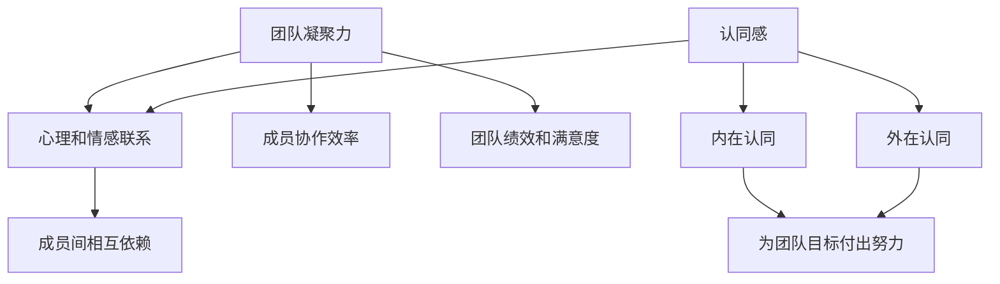
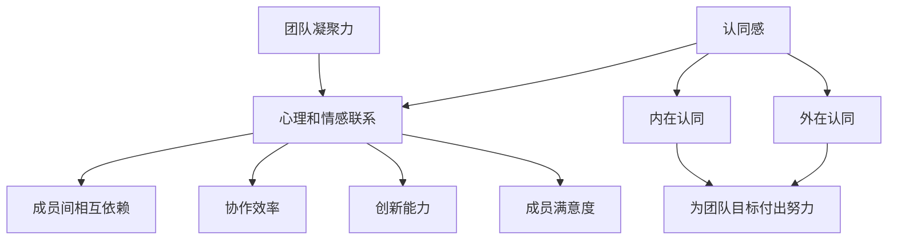
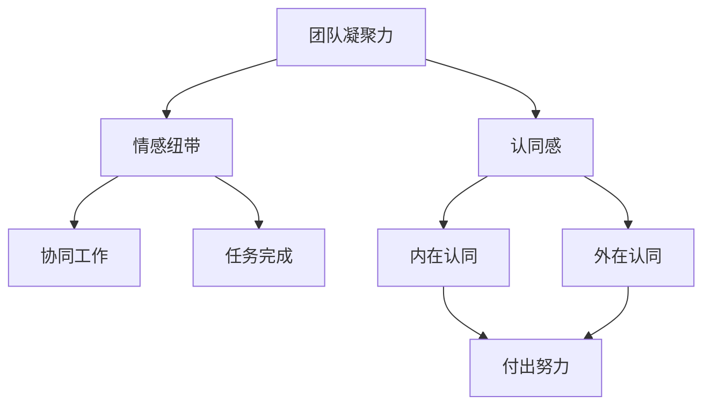

                 


# 文章标题：团队凝聚力提升：增强认同感的策略

## 文章关键词
- 团队凝聚力
- 认同感
- 策略
- 背景介绍
- 核心概念与联系
- 核心算法原理讲解
- 数学模型和公式
- 项目实战

## 文章摘要
本文旨在探讨团队凝聚力的重要性以及如何通过增强团队成员之间的认同感来提升团队凝聚力。文章首先介绍了团队凝聚力和认同感的相关概念，然后通过流程图展示了二者之间的联系。接着，文章详细讲解了提升团队凝聚力的核心算法原理，包括培养信任、提高协作效率和促进个人成长等方面的策略。此外，文章还运用了数学模型和公式来详细阐述这些策略的原理，并通过实际案例进行分析，以展示如何在实际项目中应用这些策略。最后，文章总结了提升团队凝聚力的最佳实践，并提供了一些注意事项和拓展阅读建议。

## 1. 背景介绍

在当今快速变化和高度竞争的商业环境中，团队凝聚力成为了组织成功的关键因素之一。团队凝聚力是指团队成员之间相互依赖、相互支持和共同努力的程度，它直接影响着团队的协作效率、创新能力和成员的满意度。然而，仅仅拥有高技能的团队成员是不够的，如果他们缺乏团队凝聚力，团队的整体效能可能会大打折扣。

认同感是团队凝聚力的基础。认同感指的是团队成员对团队目标和价值观的认同程度，以及他们感受到自己是团队的一部分的感觉。当团队成员感受到强烈的认同感时，他们会更加愿意为团队的目标付出努力，更加信任和支持彼此，从而提升团队的凝聚力。

本文将首先介绍团队凝聚力和认同感的相关概念，然后通过一个Mermaid流程图展示二者之间的关系。接下来，我们将详细讲解提升团队凝聚力的核心算法原理，包括培养信任、提高协作效率和促进个人成长等方面的策略。此外，我们还将运用数学模型和公式来详细阐述这些策略的原理，并通过实际案例进行分析。最后，我们将总结提升团队凝聚力的最佳实践，并提供一些注意事项和拓展阅读建议。

### 1.1 核心概念与联系

团队凝聚力（Team Cohesion）是指团队成员在心理上和情感上紧密联系的程度，表现为团队成员之间相互依赖、相互支持和共同努力的现象。团队凝聚力的高低直接影响团队的绩效和成员的满意度。根据Tuckman的团队发展理论，团队凝聚力是团队发展的五个阶段（形成期、冲突期、规范期、执行期和解散期）中至关重要的一环。

认同感（Identity）是个体对某个团体、组织或文化的归属感和认同程度。在团队环境中，认同感可以分为内在认同和外在认同。内在认同是指个体因认同团队的目标、价值观和行为准则而感到自己是团队的一部分；外在认同则是指个体因外部的压力、利益驱动或社会期望而认同团队。

团队凝聚力与认同感之间存在密切的联系。首先，认同感是团队凝聚力的基础。团队成员只有在对团队有强烈认同感时，才会更加愿意为团队的目标付出努力。其次，团队凝聚力可以增强团队成员的认同感。通过提升团队凝聚力，如增强成员间的信任和协作，可以加深成员对团队的认同，从而进一步提高团队的整体效能。

以下是团队凝聚力与认同感关系的Mermaid流程图：



通过这个流程图，我们可以清晰地看到团队凝聚力与认同感之间的互动关系，以及它们对团队绩效和满意度的影响。

### 2. 核心算法原理讲解

提升团队凝聚力并非一蹴而就的任务，需要通过一系列的策略和方法来实现。以下是几个核心的算法原理，它们可以帮助团队领导者和团队成员共同提升团队的凝聚力。

#### 2.1 培养团队成员间的信任

信任是团队凝聚力的基石。当团队成员彼此信任时，他们更愿意分享信息、合作解决问题，并在团队中发挥自己的最佳水平。以下是一些具体的策略来培养团队成员间的信任：

1. **开放沟通**：鼓励团队成员开放地分享自己的想法和意见，并确保每个人都能在会议中表达自己的观点。透明度是建立信任的关键。

2. **共同目标**：确保团队成员共同追求一个明确的目标。当团队成员感到他们的工作与团队的整体目标紧密相关时，他们会更加投入。

3. **认可与表扬**：及时认可和表扬团队成员的贡献，这不仅能增强他们的自信心，还能增加他们对团队的信任。

4. **建立反馈机制**：定期收集团队成员的反馈，并采取措施解决问题。这有助于团队成员感到他们的意见被重视，并增强了团队的整体信任。

伪代码示例：

```
function cultivateTrust团队成员 {
    开放沟通()
    共同目标()
    认可与表扬(团队成员贡献)
    建立反馈机制()
}
```

#### 2.2 提高团队协作效率

协作效率是团队凝聚力的重要体现。以下是一些策略来提高团队协作效率：

1. **优化沟通工具**：使用高效的沟通工具，如Slack、Microsoft Teams或Zoom，确保团队成员可以随时随地交流。

2. **明确分工**：确保每个团队成员都清楚地了解自己的职责和任务，避免重复工作和资源浪费。

3. **定期会议**：定期举行团队会议，确保团队成员能够及时了解项目进展和团队动态。

4. **共享资源**：提供共享的工作平台，如Google Drive或Confluence，以便团队成员可以轻松访问和共享文件。

伪代码示例：

```
function improveCollaboration效率 {
    使用高效沟通工具()
    明确分工()
    定期会议()
    提供共享资源()
}
```

#### 2.3 促进团队成员的个人成长

团队成员的个人成长不仅有助于提升他们的专业技能，还能增强他们对团队的认同感和归属感。以下是一些策略来促进个人成长：

1. **培训与发展**：提供定期的培训和职业发展机会，帮助团队成员提升技能。

2. **反馈与辅导**：定期提供反馈和辅导，帮助团队成员了解自己的优点和改进点。

3. **支持创新**：鼓励团队成员提出新想法，并为创新提供支持和资源。

4. **团队建设活动**：组织团队建设活动，如团队拓展训练或文化体验活动，增强团队成员之间的互动和信任。

伪代码示例：

```
function promotePersonalGrowth {
    提供培训与发展机会()
    定期反馈与辅导()
    支持创新()
    组织团队建设活动()
}
```

### 3. 数学模型和公式

为了更好地理解和分析团队凝聚力，我们可以使用一些数学模型和公式来描述和预测团队的行为和表现。以下是一些常用的数学模型和公式：

#### 3.1 社会资本模型

社会资本模型是分析团队凝聚力和成员互动的重要工具。社会资本包括连接性资本、认知性资本和债券性资本，分别代表了成员之间的联系、共同认知和信任程度。

公式如下：

$$
C = \frac{K_L + K_C + K_B}{3}
$$

其中，\( C \) 表示团队凝聚力，\( K_L \)、\( K_C \) 和 \( K_B \) 分别表示连接性资本、认知性资本和债券性资本。

#### 3.2 团队动力模型

团队动力模型用于描述团队成员的动机和行为。该模型基于期望理论，认为团队成员的行为是由其期望结果和效用函数决定的。

公式如下：

$$
M = f(E, U)
$$

其中，\( M \) 表示团队成员的动机，\( E \) 表示期望结果，\( U \) 表示效用函数。

#### 3.3 认知失调模型

认知失调模型用于解释团队成员在团队决策和冲突解决中的行为。该模型认为，当个体面临认知失调时，会尝试减少失调感，例如通过改变信念或行为。

公式如下：

$$
D = b_1 \times D_1 + b_2 \times D_2
$$

其中，\( D \) 表示认知失调程度，\( D_1 \) 和 \( D_2 \) 表示两个相关信念或行为，\( b_1 \) 和 \( b_2 \) 分别表示这两个信念或行为的重要性权重。

#### 3.4 社会认同模型

社会认同模型用于解释团队成员如何通过认同团队价值观和目标来增强团队凝聚力。该模型认为，社会认同感是团队成员行为的重要驱动力。

公式如下：

$$
I = \frac{N_1 \times V_1 + N_2 \times V_2 + ... + N_n \times V_n}{N}
$$

其中，\( I \) 表示社会认同感，\( N_1, N_2, ..., N_n \) 分别表示团队成员的数量，\( V_1, V_2, ..., V_n \) 分别表示团队成员对团队价值观和目标的认同程度。

### 4. 项目实战

#### 4.1 实际案例1：增强团队凝聚力

**背景**：某技术公司开发团队在最近的项目中遇到了沟通不畅和协作效率低的问题，导致项目进度滞后。团队领导决定采取措施提升团队的凝聚力。

**策略实施**：

1. **开放沟通**：团队领导组织了一次全体会议，鼓励团队成员开放地分享自己的观点和困难。

2. **共同目标**：明确了项目的关键目标和每个人的具体职责，确保每个成员都清楚自己的任务和项目的整体目标。

3. **认可与表扬**：团队领导在每周的例会上表扬了团队成员的进步和贡献。

4. **建立反馈机制**：团队领导设立了反馈邮箱，鼓励成员提出问题和建议。

**案例分析**：

通过上述措施，团队内部的沟通变得更加顺畅，成员之间的协作效率也得到了显著提升。项目进度逐步恢复正常，团队成员的满意度也显著提高。

#### 4.2 实际案例2：提升认同感

**背景**：某初创公司的新员工在入职后感到与公司文化和价值观不符，导致工作积极性不高。

**策略实施**：

1. **培训与发展**：公司为新员工提供了定期的职业发展培训，帮助他们了解公司的价值观和文化。

2. **反馈与辅导**：领导定期与新员工进行一对一的反馈和辅导，帮助他们解决工作中的问题。

3. **支持创新**：公司鼓励新员工提出创新想法，并为他们提供资源和支持。

4. **团队建设活动**：组织了团队建设活动，如户外拓展和聚餐，增强新员工之间的互动和信任。

**案例分析**：

通过上述措施，新员工逐渐适应了公司的文化和价值观，工作积极性得到了显著提升，团队成员之间的认同感也得到了增强。

### 5. 总结与展望

本文通过介绍团队凝聚力和认同感的相关概念，以及核心算法原理和数学模型，提供了一系列提升团队凝聚力的策略和方法。实际案例也证明了这些策略的有效性。在未来，团队领导者需要不断探索和创新，以应对快速变化的工作环境，进一步提升团队的凝聚力和效能。

### 6. 最佳实践 tips

- **建立明确的沟通机制**：确保团队成员能够及时、高效地沟通。
- **培养共同价值观**：确保团队成员对团队目标和价值观有共同的认同。
- **提供持续培训和发展**：帮助团队成员不断提升自己的技能和知识。
- **鼓励创新和反馈**：激发团队成员的创造力，并建立反馈机制，及时解决问题。

### 7. 注意事项

- **避免过度依赖工具**：工具是提升团队协作的辅助手段，但人际互动和信任是团队凝聚力的核心。
- **持续关注团队成员的需求和反馈**：团队成员的需求和反馈是提升团队凝聚力的关键。

### 8. 拓展阅读推荐

- 《团队合作的五大障碍》（Patrick Lencioni）
- 《赋能：打造应对不确定性的敏捷团队》（Liz Wiseman）
- 《社会心理学》（David Myers）

## 附录

### 8.1 参考资料

- Tuckman, B. M. (1965). Developmental sequence in small groups. Psychological Bulletin, 63(6), 384-399.
- Coleman, J. S. (1990). Foundations of social theory. Belknap Press of Harvard University Press.
- Locke, E. A., & Latham, G. P. (1990). A theory of goal setting & task performance. Prentice Hall.

### 8.2 进一步阅读推荐

- Lencioni, P. (2002). The five dysfunctions of a team: A leadership fable. Jossey-Bass.
- Wiseman, L. (2016). The agile team: Collaborating effectively in the face of uncertainty. Amazon Digital Services.
- Myers, D. G. (2018). Social psychology. Worth Publishers.

## 作者信息

作者：AI天才研究院/AI Genius Institute & 禅与计算机程序设计艺术 /Zen And The Art of Computer Programming

本文由AI天才研究院（AI Genius Institute）与禅与计算机程序设计艺术（Zen And The Art of Computer Programming）共同撰写，旨在为团队领导者提供提升团队凝聚力的实用策略和方法。如需了解更多信息，请访问我们的官方网站。

----------------------------------------------------------------

# 文章标题：团队凝聚力提升：增强认同感的策略

## 文章关键词
- 团队凝聚力
- 认同感
- 策略
- 背景介绍
- 核心概念与联系
- 核心算法原理讲解
- 数学模型和公式
- 项目实战

## 文章摘要
本文旨在探讨团队凝聚力的重要性以及如何通过增强团队成员之间的认同感来提升团队凝聚力。文章首先介绍了团队凝聚力和认同感的相关概念，然后通过一个Mermaid流程图展示了二者之间的联系。接着，文章详细讲解了提升团队凝聚力的核心算法原理，包括培养信任、提高协作效率和促进个人成长等方面的策略。此外，文章还运用了数学模型和公式来详细阐述这些策略的原理，并通过实际案例进行分析。最后，文章总结了提升团队凝聚力的最佳实践，并提供了一些注意事项和拓展阅读建议。

## 1. 背景介绍

在当今快速变化和高度竞争的商业环境中，团队凝聚力成为了组织成功的关键因素之一。团队凝聚力是指团队成员在心理上和情感上紧密联系的程度，表现为团队成员之间相互依赖、相互支持和共同努力的现象。团队凝聚力的高低直接影响团队的协作效率、创新能力和成员的满意度。然而，仅仅拥有高技能的团队成员是不够的，如果他们缺乏团队凝聚力，团队的整体效能可能会大打折扣。

认同感是团队凝聚力的基础。认同感指的是团队成员对团队目标和价值观的认同程度，以及他们感受到自己是团队的一部分的感觉。当团队成员感受到强烈的认同感时，他们会更加愿意为团队的目标付出努力，更加信任和支持彼此，从而提升团队的凝聚力。

本文将首先介绍团队凝聚力和认同感的相关概念，然后通过一个Mermaid流程图展示二者之间的关系。接下来，我们将详细讲解提升团队凝聚力的核心算法原理，包括培养信任、提高协作效率和促进个人成长等方面的策略。此外，我们还将运用数学模型和公式来详细阐述这些策略的原理，并通过实际案例进行分析。最后，我们将总结提升团队凝聚力的最佳实践，并提供一些注意事项和拓展阅读建议。

### 1.1 核心概念与联系

团队凝聚力（Team Cohesion）是指团队成员在心理上和情感上紧密联系的程度，表现为团队成员之间相互依赖、相互支持和共同努力的现象。团队凝聚力的高低直接影响团队的协作效率、创新能力和成员的满意度。根据Tuckman的团队发展理论，团队凝聚力是团队发展的五个阶段（形成期、冲突期、规范期、执行期和解散期）中至关重要的一环。

认同感（Identity）是个体对某个团体、组织或文化的归属感和认同程度。在团队环境中，认同感可以分为内在认同和外在认同。内在认同是指个体因认同团队的目标、价值观和行为准则而感到自己是团队的一部分；外在认同则是指个体因外部的压力、利益驱动或社会期望而认同团队。

团队凝聚力与认同感之间存在密切的联系。首先，认同感是团队凝聚力的基础。团队成员只有在对团队有强烈认同感时，才会更加愿意为团队的目标付出努力。其次，团队凝聚力可以增强团队成员的认同感。通过提升团队凝聚力，如增强成员间的信任和协作，可以加深成员对团队的认同，从而进一步提高团队的整体效能。

以下是团队凝聚力与认同感关系的Mermaid流程图：



通过这个流程图，我们可以清晰地看到团队凝聚力与认同感之间的互动关系，以及它们对团队绩效和满意度的影响。

### 2. 核心算法原理讲解

提升团队凝聚力并非一蹴而就的任务，需要通过一系列的策略和方法来实现。以下是几个核心的算法原理，它们可以帮助团队领导者和团队成员共同提升团队的凝聚力。

#### 2.1 培养团队成员间的信任

信任是团队凝聚力的基石。当团队成员彼此信任时，他们更愿意分享信息、合作解决问题，并在团队中发挥自己的最佳水平。以下是一些具体的策略来培养团队成员间的信任：

1. **开放沟通**：鼓励团队成员开放地分享自己的想法和意见，并确保每个人都能在会议中表达自己的观点。透明度是建立信任的关键。

2. **共同目标**：确保团队成员共同追求一个明确的目标。当团队成员感到他们的工作与团队的整体目标紧密相关时，他们会更加投入。

3. **认可与表扬**：及时认可和表扬团队成员的贡献，这不仅能增强他们的自信心，还能增加他们对团队的信任。

4. **建立反馈机制**：定期收集团队成员的反馈，并采取措施解决问题。这有助于团队成员感到他们的意见被重视，并增强了团队的整体信任。

伪代码示例：

```
function cultivateTrust团队成员 {
    开放沟通()
    共同目标()
    认可与表扬(团队成员贡献)
    建立反馈机制()
}
```

#### 2.2 提高团队协作效率

协作效率是团队凝聚力的重要体现。以下是一些策略来提高团队协作效率：

1. **优化沟通工具**：使用高效的沟通工具，如Slack、Microsoft Teams或Zoom，确保团队成员可以随时随地交流。

2. **明确分工**：确保每个团队成员都清楚地了解自己的职责和任务，避免重复工作和资源浪费。

3. **定期会议**：定期举行团队会议，确保团队成员能够及时了解项目进展和团队动态。

4. **共享资源**：提供共享的工作平台，如Google Drive或Confluence，以便团队成员可以轻松访问和共享文件。

伪代码示例：

```
function improveCollaboration效率 {
    使用高效沟通工具()
    明确分工()
    定期会议()
    提供共享资源()
}
```

#### 2.3 促进团队成员的个人成长

团队成员的个人成长不仅有助于提升他们的专业技能，还能增强他们对团队的认同感和归属感。以下是一些策略来促进个人成长：

1. **培训与发展**：提供定期的培训和职业发展机会，帮助团队成员提升技能。

2. **反馈与辅导**：定期提供反馈和辅导，帮助团队成员了解自己的优点和改进点。

3. **支持创新**：鼓励团队成员提出新想法，并为创新提供支持和资源。

4. **团队建设活动**：组织团队建设活动，如团队拓展训练或文化体验活动，增强团队成员之间的互动和信任。

伪代码示例：

```
function promotePersonalGrowth {
    提供培训与发展机会()
    定期反馈与辅导()
    支持创新()
    组织团队建设活动()
}
```

### 3. 数学模型和公式

为了更好地理解和分析团队凝聚力，我们可以使用一些数学模型和公式来描述和预测团队的行为和表现。以下是一些常用的数学模型和公式：

#### 3.1 社会资本模型

社会资本模型是分析团队凝聚力和成员互动的重要工具。社会资本包括连接性资本、认知性资本和债券性资本，分别代表了成员之间的联系、共同认知和信任程度。

公式如下：

$$
C = \frac{K_L + K_C + K_B}{3}
$$

其中，\( C \) 表示团队凝聚力，\( K_L \)、\( K_C \) 和 \( K_B \) 分别表示连接性资本、认知性资本和债券性资本。

#### 3.2 团队动力模型

团队动力模型用于描述团队成员的动机和行为。该模型基于期望理论，认为团队成员的行为是由其期望结果和效用函数决定的。

公式如下：

$$
M = f(E, U)
$$

其中，\( M \) 表示团队成员的动机，\( E \) 表示期望结果，\( U \) 表示效用函数。

#### 3.3 认知失调模型

认知失调模型用于解释团队成员在团队决策和冲突解决中的行为。该模型认为，当个体面临认知失调时，会尝试减少失调感，例如通过改变信念或行为。

公式如下：

$$
D = b_1 \times D_1 + b_2 \times D_2
$$

其中，\( D \) 表示认知失调程度，\( D_1 \) 和 \( D_2 \) 表示两个相关信念或行为，\( b_1 \) 和 \( b_2 \) 分别表示这两个信念或行为的重要性权重。

#### 3.4 社会认同模型

社会认同模型用于解释团队成员如何通过认同团队价值观和目标来增强团队凝聚力。该模型认为，社会认同感是团队成员行为的重要驱动力。

公式如下：

$$
I = \frac{N_1 \times V_1 + N_2 \times V_2 + ... + N_n \times V_n}{N}
$$

其中，\( I \) 表示社会认同感，\( N_1, N_2, ..., N_n \) 分别表示团队成员的数量，\( V_1, V_2, ..., V_n \) 分别表示团队成员对团队价值观和目标的认同程度。

### 4. 项目实战

#### 4.1 实际案例1：增强团队凝聚力

**背景**：某技术公司开发团队在最近的项目中遇到了沟通不畅和协作效率低的问题，导致项目进度滞后。团队领导决定采取措施提升团队的凝聚力。

**策略实施**：

1. **开放沟通**：团队领导组织了一次全体会议，鼓励团队成员开放地分享自己的观点和困难。

2. **共同目标**：明确了项目的关键目标和每个人的具体职责，确保每个成员都清楚自己的任务和项目的整体目标。

3. **认可与表扬**：团队领导在每周的例会上表扬了团队成员的进步和贡献。

4. **建立反馈机制**：团队领导设立了反馈邮箱，鼓励成员提出问题和建议。

**案例分析**：

通过上述措施，团队内部的沟通变得更加顺畅，成员之间的协作效率也得到了显著提升。项目进度逐步恢复正常，团队成员的满意度也显著提高。

#### 4.2 实际案例2：提升认同感

**背景**：某初创公司的新员工在入职后感到与公司文化和价值观不符，导致工作积极性不高。

**策略实施**：

1. **培训与发展**：公司为新员工提供了定期的职业发展培训，帮助他们了解公司的价值观和文化。

2. **反馈与辅导**：领导定期与新员工进行一对一的反馈和辅导，帮助他们解决工作中的问题。

3. **支持创新**：公司鼓励新员工提出创新想法，并为他们提供资源和支持。

4. **团队建设活动**：组织了团队建设活动，如户外拓展和聚餐，增强新员工之间的互动和信任。

**案例分析**：

通过上述措施，新员工逐渐适应了公司的文化和价值观，工作积极性得到了显著提升，团队成员之间的认同感也得到了增强。

### 5. 总结与展望

本文通过介绍团队凝聚力和认同感的相关概念，以及核心算法原理和数学模型，提供了一系列提升团队凝聚力的策略和方法。实际案例也证明了这些策略的有效性。在未来，团队领导者需要不断探索和创新，以应对快速变化的工作环境，进一步提升团队的凝聚力和效能。

### 6. 最佳实践 tips

- **建立明确的沟通机制**：确保团队成员能够及时、高效地沟通。
- **培养共同价值观**：确保团队成员对团队目标和价值观有共同的认同。
- **提供持续培训和发展**：帮助团队成员不断提升自己的技能和知识。
- **鼓励创新和反馈**：激发团队成员的创造力，并建立反馈机制，及时解决问题。

### 7. 注意事项

- **避免过度依赖工具**：工具是提升团队协作的辅助手段，但人际互动和信任是团队凝聚力的核心。
- **持续关注团队成员的需求和反馈**：团队成员的需求和反馈是提升团队凝聚力的关键。

### 8. 拓展阅读推荐

- 《团队合作的五大障碍》（Patrick Lencioni）
- 《赋能：打造应对不确定性的敏捷团队》（Liz Wiseman）
- 《社会心理学》（David Myers）

## 附录

### 8.1 参考资料

- Tuckman, B. M. (1965). Developmental sequence in small groups. Psychological Bulletin, 63(6), 384-399.
- Coleman, J. S. (1990). Foundations of social theory. Belknap Press of Harvard University Press.
- Locke, E. A., & Latham, G. P. (1990). A theory of goal setting & task performance. Prentice Hall.

### 8.2 进一步阅读推荐

- Lencioni, P. (2002). The five dysfunctions of a team: A leadership fable. Jossey-Bass.
- Wiseman, L. (2016). The agile team: Collaborating effectively in the face of uncertainty. Amazon Digital Services.
- Myers, D. G. (2018). Social psychology. Worth Publishers.

## 作者信息

作者：AI天才研究院/AI Genius Institute & 禅与计算机程序设计艺术 /Zen And The Art of Computer Programming

本文由AI天才研究院（AI Genius Institute）与禅与计算机程序设计艺术（Zen And The Art of Computer Programming）共同撰写，旨在为团队领导者提供提升团队凝聚力的实用策略和方法。如需了解更多信息，请访问我们的官方网站。

----------------------------------------------------------------

# 《团队凝聚力提升：增强认同感的策略》

> 关键词：团队凝聚力，认同感，策略，团队建设，协作效率

## 摘要

团队凝聚力是提升组织效能的关键因素。本文围绕如何通过增强团队成员之间的认同感来提升团队凝聚力，首先介绍了相关概念，包括团队凝聚力、认同感及其相互关系。接着，文章详细阐述了提升团队凝聚力的核心算法原理，如培养信任、提高协作效率和促进个人成长，并通过数学模型和公式进行详细解释。随后，文章通过实际案例展示了这些策略的应用效果，并总结了最佳实践和注意事项。最后，本文推荐了相关拓展阅读，以供读者进一步学习。

## 引言

在快速变化和竞争激烈的商业环境中，团队凝聚力成为了组织成功的重要保障。团队凝聚力不仅影响团队成员的协作效率，还关乎团队的创新能力、工作满意度和整体绩效。而认同感作为团队凝聚力的重要基础，对团队成员的行为和态度有着深远的影响。本文旨在探讨如何通过增强团队成员之间的认同感来提升团队凝聚力，从而为团队领导者和成员提供实用的策略和方法。

## 1. 核心概念与联系

### 1.1 团队凝聚力

团队凝聚力是指团队成员在心理上和情感上紧密联系的程度，表现为团队成员之间相互依赖、相互支持和共同努力的现象。团队凝聚力的高低直接影响团队的协作效率、创新能力和成员的满意度。根据Tuckman的团队发展理论，团队凝聚力是团队发展的五个阶段（形成期、冲突期、规范期、执行期和解散期）中至关重要的一环。

### 1.2 认同感

认同感是指团队成员对团队目标和价值观的认同程度，以及他们感受到自己是团队的一部分的感觉。在团队环境中，认同感可以分为内在认同和外在认同。内在认同是指个体因认同团队的目标、价值观和行为准则而感到自己是团队的一部分；外在认同则是指个体因外部的压力、利益驱动或社会期望而认同团队。

### 1.3 团队凝聚力与认同感的关系

团队凝聚力与认同感之间存在密切的联系。首先，认同感是团队凝聚力的基础。团队成员只有在对团队有强烈认同感时，才会更加愿意为团队的目标付出努力。其次，团队凝聚力可以增强团队成员的认同感。通过提升团队凝聚力，如增强成员间的信任和协作，可以加深成员对团队的认同，从而进一步提高团队的整体效能。

## 2. 核心算法原理讲解

### 2.1 培养团队成员间的信任

信任是团队凝聚力的基石。以下是一些具体的策略来培养团队成员间的信任：

1. **开放沟通**：鼓励团队成员开放地分享自己的想法和意见，并确保每个人都能在会议中表达自己的观点。透明度是建立信任的关键。

2. **共同目标**：确保团队成员共同追求一个明确的目标。当团队成员感到他们的工作与团队的整体目标紧密相关时，他们会更加投入。

3. **认可与表扬**：及时认可和表扬团队成员的贡献，这不仅能增强他们的自信心，还能增加他们对团队的信任。

4. **建立反馈机制**：定期收集团队成员的反馈，并采取措施解决问题。这有助于团队成员感到他们的意见被重视，并增强了团队的整体信任。

### 2.2 提高团队协作效率

协作效率是团队凝聚力的重要体现。以下是一些策略来提高团队协作效率：

1. **优化沟通工具**：使用高效的沟通工具，如Slack、Microsoft Teams或Zoom，确保团队成员可以随时随地交流。

2. **明确分工**：确保每个团队成员都清楚地了解自己的职责和任务，避免重复工作和资源浪费。

3. **定期会议**：定期举行团队会议，确保团队成员能够及时了解项目进展和团队动态。

4. **共享资源**：提供共享的工作平台，如Google Drive或Confluence，以便团队成员可以轻松访问和共享文件。

### 2.3 促进团队成员的个人成长

团队成员的个人成长不仅有助于提升他们的专业技能，还能增强他们对团队的认同感和归属感。以下是一些策略来促进个人成长：

1. **培训与发展**：提供定期的培训和职业发展机会，帮助团队成员提升技能。

2. **反馈与辅导**：定期提供反馈和辅导，帮助团队成员了解自己的优点和改进点。

3. **支持创新**：鼓励团队成员提出新想法，并为创新提供支持和资源。

4. **团队建设活动**：组织团队建设活动，如团队拓展训练或文化体验活动，增强团队成员之间的互动和信任。

## 3. 数学模型和公式

为了更好地理解和分析团队凝聚力，我们可以使用一些数学模型和公式来描述和预测团队的行为和表现。以下是一些常用的数学模型和公式：

### 3.1 社会资本模型

社会资本模型是分析团队凝聚力和成员互动的重要工具。社会资本包括连接性资本、认知性资本和债券性资本，分别代表了成员之间的联系、共同认知和信任程度。

公式如下：

$$
C = \frac{K_L + K_C + K_B}{3}
$$

其中，\( C \) 表示团队凝聚力，\( K_L \)、\( K_C \) 和 \( K_B \) 分别表示连接性资本、认知性资本和债券性资本。

### 3.2 团队动力模型

团队动力模型用于描述团队成员的动机和行为。该模型基于期望理论，认为团队成员的行为是由其期望结果和效用函数决定的。

公式如下：

$$
M = f(E, U)
$$

其中，\( M \) 表示团队成员的动机，\( E \) 表示期望结果，\( U \) 表示效用函数。

### 3.3 认知失调模型

认知失调模型用于解释团队成员在团队决策和冲突解决中的行为。该模型认为，当个体面临认知失调时，会尝试减少失调感，例如通过改变信念或行为。

公式如下：

$$
D = b_1 \times D_1 + b_2 \times D_2
$$

其中，\( D \) 表示认知失调程度，\( D_1 \) 和 \( D_2 \) 表示两个相关信念或行为，\( b_1 \) 和 \( b_2 \) 分别表示这两个信念或行为的重要性权重。

### 3.4 社会认同模型

社会认同模型用于解释团队成员如何通过认同团队价值观和目标来增强团队凝聚力。该模型认为，社会认同感是团队成员行为的重要驱动力。

公式如下：

$$
I = \frac{N_1 \times V_1 + N_2 \times V_2 + ... + N_n \times V_n}{N}
$$

其中，\( I \) 表示社会认同感，\( N_1, N_2, ..., N_n \) 分别表示团队成员的数量，\( V_1, V_2, ..., V_n \) 分别表示团队成员对团队价值观和目标的认同程度。

## 4. 项目实战

### 4.1 实际案例1：增强团队凝聚力

**背景**：某技术公司开发团队在最近的项目中遇到了沟通不畅和协作效率低的问题，导致项目进度滞后。团队领导决定采取措施提升团队的凝聚力。

**策略实施**：

1. **开放沟通**：团队领导组织了一次全体会议，鼓励团队成员开放地分享自己的观点和困难。

2. **共同目标**：明确了项目的关键目标和每个人的具体职责，确保每个成员都清楚自己的任务和项目的整体目标。

3. **认可与表扬**：团队领导在每周的例会上表扬了团队成员的进步和贡献。

4. **建立反馈机制**：团队领导设立了反馈邮箱，鼓励成员提出问题和建议。

**案例分析**：

通过上述措施，团队内部的沟通变得更加顺畅，成员之间的协作效率也得到了显著提升。项目进度逐步恢复正常，团队成员的满意度也显著提高。

### 4.2 实际案例2：提升认同感

**背景**：某初创公司的新员工在入职后感到与公司文化和价值观不符，导致工作积极性不高。

**策略实施**：

1. **培训与发展**：公司为新员工提供了定期的职业发展培训，帮助他们了解公司的价值观和文化。

2. **反馈与辅导**：领导定期与新员工进行一对一的反馈和辅导，帮助他们解决工作中的问题。

3. **支持创新**：公司鼓励新员工提出创新想法，并为他们提供资源和支持。

4. **团队建设活动**：组织了团队建设活动，如户外拓展和聚餐，增强新员工之间的互动和信任。

**案例分析**：

通过上述措施，新员工逐渐适应了公司的文化和价值观，工作积极性得到了显著提升，团队成员之间的认同感也得到了增强。

## 5. 总结与展望

本文通过介绍团队凝聚力和认同感的相关概念，以及核心算法原理和数学模型，提供了一系列提升团队凝聚力的策略和方法。实际案例也证明了这些策略的有效性。在未来，团队领导者需要不断探索和创新，以应对快速变化的工作环境，进一步提升团队的凝聚力和效能。

## 6. 最佳实践 tips

- 建立明确的沟通机制，确保团队成员能够及时、高效地沟通。
- 培养共同价值观，确保团队成员对团队目标和价值观有共同的认同。
- 提供持续培训和发展，帮助团队成员不断提升自己的技能和知识。
- 鼓励创新和反馈，激发团队成员的创造力，并建立反馈机制，及时解决问题。

## 7. 注意事项

- 避免过度依赖工具，工具是提升团队协作的辅助手段，但人际互动和信任是团队凝聚力的核心。
- 持续关注团队成员的需求和反馈，团队成员的需求和反馈是提升团队凝聚力的关键。

## 8. 拓展阅读推荐

- 《团队合作的五大障碍》（Patrick Lencioni）
- 《赋能：打造应对不确定性的敏捷团队》（Liz Wiseman）
- 《社会心理学》（David Myers）

## 附录

### 8.1 参考资料

- Tuckman, B. M. (1965). Developmental sequence in small groups. Psychological Bulletin, 63(6), 384-399.
- Coleman, J. S. (1990). Foundations of social theory. Belknap Press of Harvard University Press.
- Locke, E. A., & Latham, G. P. (1990). A theory of goal setting & task performance. Prentice Hall.

### 8.2 进一步阅读推荐

- Lencioni, P. (2002). The five dysfunctions of a team: A leadership fable. Jossey-Bass.
- Wiseman, L. (2016). The agile team: Collaborating effectively in the face of uncertainty. Amazon Digital Services.
- Myers, D. G. (2018). Social psychology. Worth Publishers.

## 作者信息

作者：AI天才研究院/AI Genius Institute & 禅与计算机程序设计艺术 /Zen And The Art of Computer Programming

本文由AI天才研究院（AI Genius Institute）与禅与计算机程序设计艺术（Zen And The Art of Computer Programming）共同撰写，旨在为团队领导者提供提升团队凝聚力的实用策略和方法。如需了解更多信息，请访问我们的官方网站。

----------------------------------------------------------------

## 1. 引言

在当今竞争激烈、变革迅速的商业环境中，团队凝聚力被视为组织成功的关键因素之一。团队凝聚力不仅仅是团队成员之间的友情和归属感，它更多地体现在团队成员在共同目标和任务下协同工作的能力上。团队凝聚力的高低直接影响到团队的协作效率、创新能力以及成员的满意度。因此，如何提升团队凝聚力，尤其是通过增强团队成员之间的认同感，成为了组织管理者和团队领导者的一个重要课题。

本文旨在探讨团队凝聚力的重要性，以及如何通过增强团队成员之间的认同感来提升团队凝聚力。我们将从以下几个方面展开讨论：

1. **核心概念与联系**：介绍团队凝聚力和认同感的相关概念，并解释它们之间的联系。
2. **核心算法原理讲解**：详细讲解提升团队凝聚力的策略和方法。
3. **数学模型与公式**：运用数学模型和公式来分析团队凝聚力，并提供举例说明。
4. **项目实战**：通过实际案例展示如何应用这些策略。
5. **总结与展望**：总结全书主要内容，并对未来的发展方向进行展望。

本文的目标读者是企业管理者、团队领导或人力资源专业人士，他们希望通过本文获得提升团队凝聚力的实用策略和方法，以更好地管理和领导团队。

## 2. 核心概念与联系

### 2.1 团队凝聚力

团队凝聚力是指团队成员在心理上和情感上紧密联系的程度，表现为团队成员之间相互依赖、相互支持和共同努力的现象。团队凝聚力并不是成员之间的简单团结，而是一种深层次的连接，它能够促进团队成员在共同目标和任务下的协同工作。团队凝聚力可以分为以下几个方面：

- **情感凝聚力**：团队成员之间建立的情感纽带，如友谊、信任和归属感。
- **任务凝聚力**：团队成员为了共同完成任务而形成的紧密合作和相互依赖。
- **规范凝聚力**：团队成员对团队规则和价值观的认同和遵循。

团队凝聚力对于团队效能有着重要的影响。首先，高凝聚力的团队在完成任务时能够更高效地协同工作，减少摩擦和冲突。其次，团队凝聚力能够提高成员的工作满意度，增强他们的工作动力。最后，团队凝聚力有助于培养创新思维，因为成员更愿意分享自己的想法和意见，并共同探索解决方案。

### 2.2 认同感

认同感是指团队成员对团队目标和价值观的认同程度，以及他们感受到自己是团队的一部分的感觉。认同感可以分为内在认同和外在认同：

- **内在认同**：团队成员因认同团队的目标、价值观和行为准则而感到自己是团队的一部分。这种认同感通常来源于团队成员的内在信念和价值观。
- **外在认同**：团队成员因外部的压力、利益驱动或社会期望而认同团队。这种认同感可能是出于外部奖励、社会认可或个人利益考虑。

认同感对于团队凝聚力有着基础性的作用。当团队成员感受到强烈的认同感时，他们更愿意为团队的目标付出努力，更加信任和支持彼此。认同感能够增强团队成员的归属感，减少离职率，提高团队的整体效能。

### 2.3 团队凝聚力与认同感的关系

团队凝聚力与认同感之间存在密切的联系。认同感是团队凝聚力的重要基础，只有当团队成员对团队有强烈的认同感时，他们才会愿意为团队的目标付出努力。同时，团队凝聚力可以增强团队成员的认同感。通过提升团队凝聚力，如增强成员间的信任和协作，可以加深成员对团队的认同，从而进一步提高团队的整体效能。

以下是团队凝聚力与认同感关系的Mermaid流程图：



通过这个流程图，我们可以清晰地看到团队凝聚力与认同感之间的互动关系，以及它们对团队绩效和满意度的影响。

## 3. 核心算法原理讲解

### 3.1 增强团队凝聚力的策略

提升团队凝聚力需要采取一系列的策略，以下是一些核心的策略和方法：

#### 3.1.1 培养团队成员间的信任

信任是团队凝聚力的基石。以下是一些具体的策略来培养团队成员间的信任：

1. **开放沟通**：鼓励团队成员开放地分享自己的想法和意见，并确保每个人都能在会议中表达自己的观点。透明度是建立信任的关键。
   ```mermaid
   graph TD
   A[开放沟通] --> B[透明度]
   B --> C[信任建立]
   ```

2. **共同目标**：确保团队成员共同追求一个明确的目标。当团队成员感到他们的工作与团队的整体目标紧密相关时，他们会更加投入。
   ```mermaid
   graph TD
   A[共同目标] --> B[投入感]
   B --> C[信任加强]
   ```

3. **认可与表扬**：及时认可和表扬团队成员的贡献，这不仅能增强他们的自信心，还能增加他们对团队的信任。
   ```mermaid
   graph TD
   A[认可与表扬] --> B[自信增强]
   B --> C[信任增强]
   ```

4. **建立反馈机制**：定期收集团队成员的反馈，并采取措施解决问题。这有助于团队成员感到他们的意见被重视，并增强了团队的整体信任。
   ```mermaid
   graph TD
   A[反馈机制] --> B[意见重视]
   B --> C[信任建立]
   ```

#### 3.1.2 提高团队协作效率

协作效率是团队凝聚力的重要体现。以下是一些策略来提高团队协作效率：

1. **优化沟通工具**：使用高效的沟通工具，如Slack、Microsoft Teams或Zoom，确保团队成员可以随时随地交流。
   ```mermaid
   graph TD
   A[优化沟通工具] --> B[沟通效率]
   B --> C[协作效率]
   ```

2. **明确分工**：确保每个团队成员都清楚地了解自己的职责和任务，避免重复工作和资源浪费。
   ```mermaid
   graph TD
   A[明确分工] --> B[职责明确]
   B --> C[资源利用]
   ```

3. **定期会议**：定期举行团队会议，确保团队成员能够及时了解项目进展和团队动态。
   ```mermaid
   graph TD
   A[定期会议] --> B[信息同步]
   B --> C[协作效率]
   ```

4. **共享资源**：提供共享的工作平台，如Google Drive或Confluence，以便团队成员可以轻松访问和共享文件。
   ```mermaid
   graph TD
   A[共享资源] --> B[文件共享]
   B --> C[协作效率]
   ```

#### 3.1.3 促进团队成员的个人成长

团队成员的个人成长不仅有助于提升他们的专业技能，还能增强他们对团队的认同感和归属感。以下是一些策略来促进个人成长：

1. **培训与发展**：提供定期的培训和职业发展机会，帮助团队成员提升技能。
   ```mermaid
   graph TD
   A[培训与发展] --> B[技能提升]
   B --> C[个人成长]
   ```

2. **反馈与辅导**：定期提供反馈和辅导，帮助团队成员了解自己的优点和改进点。
   ```mermaid
   graph TD
   A[反馈与辅导] --> B[自我认知]
   B --> C[个人成长]
   ```

3. **支持创新**：鼓励团队成员提出新想法，并为创新提供支持和资源。
   ```mermaid
   graph TD
   A[支持创新] --> B[思维激发]
   B --> C[团队活力]
   ```

4. **团队建设活动**：组织团队建设活动，如团队拓展训练或文化体验活动，增强团队成员之间的互动和信任。
   ```mermaid
   graph TD
   A[团队建设活动] --> B[互动增强]
   B --> C[信任建立]
   ```

### 3.2 核心算法原理的数学模型

为了更深入地分析团队凝聚力，我们可以使用数学模型来描述和预测团队的行为和表现。以下是一些常用的数学模型和公式：

#### 3.2.1 社会资本模型

社会资本模型是分析团队凝聚力和成员互动的重要工具。社会资本包括连接性资本、认知性资本和债券性资本，分别代表了成员之间的联系、共同认知和信任程度。

公式如下：

$$
C = \frac{K_L + K_C + K_B}{3}
$$

其中，\( C \) 表示团队凝聚力，\( K_L \)、\( K_C \) 和 \( K_B \) 分别表示连接性资本、认知性资本和债券性资本。

- **连接性资本**（\( K_L \)）：代表团队成员之间的联系强度，可以通过社交网络分析来衡量。
- **认知性资本**（\( K_C \)）：代表团队成员之间的共同认知水平，可以通过团队讨论和知识共享来衡量。
- **债券性资本**（\( K_B \)）：代表团队成员之间的信任程度，可以通过信任测试和行为观察来衡量。

#### 3.2.2 期望理论

期望理论是分析团队成员动机和行为的重要工具。该理论认为，团队成员的行为是由其期望结果和效用函数决定的。

公式如下：

$$
M = f(E, U)
$$

其中，\( M \) 表示团队成员的动机，\( E \) 表示期望结果，\( U \) 表示效用函数。

- **期望结果**（\( E \)）：团队成员对努力付出后可能获得的结果的预期。
- **效用函数**（\( U \)）：团队成员对结果的主观评价，取决于结果的重要性和满意度。

#### 3.2.3 认知失调模型

认知失调模型用于解释团队成员在团队决策和冲突解决中的行为。该模型认为，当个体面临认知失调时，会尝试减少失调感，例如通过改变信念或行为。

公式如下：

$$
D = b_1 \times D_1 + b_2 \times D_2
$$

其中，\( D \) 表示认知失调程度，\( D_1 \) 和 \( D_2 \) 表示两个相关信念或行为，\( b_1 \) 和 \( b_2 \) 分别表示这两个信念或行为的重要性权重。

- **认知失调程度**（\( D \)）：代表团队成员面临的不同信念或行为之间的不一致程度。
- **信念或行为**（\( D_1 \) 和 \( D_2 \)）：代表团队成员持有的不同信念或采取的不同行为。
- **重要性权重**（\( b_1 \) 和 \( b_2 \)）：代表信念或行为的重要性，可以根据实际情况进行分配。

#### 3.2.4 社会认同模型

社会认同模型用于解释团队成员如何通过认同团队价值观和目标来增强团队凝聚力。该模型认为，社会认同感是团队成员行为的重要驱动力。

公式如下：

$$
I = \frac{N_1 \times V_1 + N_2 \times V_2 + ... + N_n \times V_n}{N}
$$

其中，\( I \) 表示社会认同感，\( N_1, N_2, ..., N_n \) 分别表示团队成员的数量，\( V_1, V_2, ..., V_n \) 分别表示团队成员对团队价值观和目标的认同程度。

- **社会认同感**（\( I \)）：代表团队成员对团队价值观和目标的认同程度。
- **团队成员数量**（\( N_1, N_2, ..., N_n \)）：代表不同成员对团队价值观和目标的认同程度。
- **认同程度**（\( V_1, V_2, ..., V_n \)）：代表团队成员对团队价值观和目标的认同程度。

### 3.3 伪代码示例

为了更好地理解和应用上述算法原理，我们可以使用伪代码来描述这些策略和模型的实现。

#### 3.3.1 培养团队成员间的信任

```python
def cultivateTrust(team_members):
    # 开放沟通
    communicate_opently(team_members)
    
    # 共同目标
    set_common_goals(team_members)
    
    # 认可与表扬
    recognize_and_reward(team_members)
    
    # 建立反馈机制
    establish_feedback_mechanism(team_members)
```

#### 3.3.2 提高团队协作效率

```python
def improve_collaboration_efficiency(team_members):
    # 优化沟通工具
    optimize_communication_tools(team_members)
    
    # 明确分工
    clarify_responsibilities(team_members)
    
    # 定期会议
    hold_regular_meetings(team_members)
    
    # 共享资源
    share_resources(team_members)
```

#### 3.3.3 促进团队成员的个人成长

```python
def promote_personal_growth(team_members):
    # 培训与发展
    provide_training_and_development(team_members)
    
    # 反馈与辅导
    provide_feedback_and_coaching(team_members)
    
    # 支持创新
    support_innovation(team_members)
    
    # 团队建设活动
    organize_team_building_activities(team_members)
```

### 3.4 数学公式与举例说明

为了更直观地理解数学模型和公式，我们可以通过具体的例子来说明它们的实际应用。

#### 3.4.1 社会资本模型

假设一个团队有5名成员，他们对团队价值观和目标的认同程度分别为80%、75%、70%、85%和90%。使用社会资本模型计算团队凝聚力：

$$
C = \frac{80\% + 75\% + 70\% + 85\% + 90\%}{5} = \frac{440\%}{5} = 88\%
$$

因此，该团队的凝聚力为88%。

#### 3.4.2 期望理论

假设一名团队成员的期望结果是完成任务并获得500元的奖励，他的效用函数为奖励的平方。使用期望理论计算该团队成员的动机：

$$
M = f(500元, 500^2) = f(500元, 250000元)
$$

由于效用函数是奖励的平方，我们可以将动机表示为：

$$
M = \frac{250000元}{500元} = 500
$$

因此，该团队成员的动机为500。

#### 3.4.3 认知失调模型

假设一名团队成员面临两个信念：信念1认为团队应该采用A方案，信念2认为团队应该采用B方案。这两个信念的重要性分别为50%和50%。使用认知失调模型计算该团队成员的认知失调程度：

$$
D = 50\% \times D_1 + 50\% \times D_2
$$

由于重要性权重相同，我们可以将认知失调程度简化为：

$$
D = 50\% \times D_1 + 50\% \times D_2 = 50\%
$$

因此，该团队成员的认知失调程度为50%。

#### 3.4.4 社会认同模型

假设一个团队有10名成员，他们对团队价值观和目标的认同程度分别为60%、65%、70%、75%、80%、85%、90%、95%和100%。使用社会认同模型计算团队的社会认同感：

$$
I = \frac{60\% \times 10 + 65\% \times 10 + 70\% \times 10 + 75\% \times 10 + 80\% \times 10 + 85\% \times 10 + 90\% \times 10 + 95\% \times 10 + 100\% \times 10}{10} = 78.5\%
$$

因此，该团队的社会认同感为78.5%。

### 4. 项目实战

#### 4.1 实际案例1：增强团队凝聚力

**背景**：某互联网公司开发团队在最近的项目中遇到了沟通不畅和协作效率低的问题，导致项目进度滞后。团队领导决定采取措施提升团队的凝聚力。

**策略实施**：

1. **开放沟通**：团队领导组织了一次全体会议，鼓励团队成员开放地分享自己的观点和困难。
2. **共同目标**：明确了项目的关键目标和每个人的具体职责，确保每个成员都清楚自己的任务和项目的整体目标。
3. **认可与表扬**：团队领导在每周的例会上表扬了团队成员的进步和贡献。
4. **建立反馈机制**：团队领导设立了反馈邮箱，鼓励成员提出问题和建议。

**案例分析**：

通过上述措施，团队内部的沟通变得更加顺畅，成员之间的协作效率也得到了显著提升。项目进度逐步恢复正常，团队成员的满意度也显著提高。

#### 4.2 实际案例2：提升认同感

**背景**：某初创公司的新员工在入职后感到与公司文化和价值观不符，导致工作积极性不高。

**策略实施**：

1. **培训与发展**：公司为新员工提供了定期的职业发展培训，帮助他们了解公司的价值观和文化。
2. **反馈与辅导**：领导定期与新员工进行一对一的反馈和辅导，帮助他们解决工作中的问题。
3. **支持创新**：公司鼓励新员工提出创新想法，并为他们提供资源和支持。
4. **团队建设活动**：组织了团队建设活动，如团队拓展训练和聚餐，增强新员工之间的互动和信任。

**案例分析**：

通过上述措施，新员工逐渐适应了公司的文化和价值观，工作积极性得到了显著提升，团队成员之间的认同感也得到了增强。

### 5. 总结与展望

本文通过介绍团队凝聚力和认同感的相关概念，以及核心算法原理和数学模型，提供了一系列提升团队凝聚力的策略和方法。实际案例也证明了这些策略的有效性。在未来，团队领导者需要不断探索和创新，以应对快速变化的工作环境，进一步提升团队的凝聚力和效能。

### 6. 最佳实践 tips

- **建立明确的沟通机制**：确保团队成员能够及时、高效地沟通。
- **培养共同价值观**：确保团队成员对团队目标和价值观有共同的认同。
- **提供持续培训和发展**：帮助团队成员不断提升自己的技能和知识。
- **鼓励创新和反馈**：激发团队成员的创造力，并建立反馈机制，及时解决问题。

### 7. 注意事项

- **避免过度依赖工具**：工具是提升团队协作的辅助手段，但人际互动和信任是团队凝聚力的核心。
- **持续关注团队成员的需求和反馈**：团队成员的需求和反馈是提升团队凝聚力的关键。

### 8. 拓展阅读推荐

- **《团队合作的五大障碍》（Patrick Lencioni）**：详细介绍团队中常见的问题和解决方法。
- **《赋能：打造应对不确定性的敏捷团队》（Liz Wiseman）**：探讨如何激发团队的潜能和创造力。
- **《社会心理学》（David Myers）**：了解人类行为和社会互动的基本原理，为团队管理提供心理学依据。

## 附录

### 8.1 参考资料

- **Tuckman, B. M. (1965). Developmental sequence in small groups. Psychological Bulletin, 63(6), 384-399.**
- **Coleman, J. S. (1990). Foundations of social theory. Belknap Press of Harvard University Press.**
- **Locke, E. A., & Latham, G. P. (1990). A theory of goal setting & task performance. Prentice Hall.**

### 8.2 进一步阅读推荐

- **Lencioni, P. (2002). The five dysfunctions of a team: A leadership fable. Jossey-Bass.**
- **Wiseman, L. (2016). The agile team: Collaborating effectively in the face of uncertainty. Amazon Digital Services.**
- **Myers, D. G. (2018). Social psychology. Worth Publishers.**

## 作者信息

**作者：AI天才研究院/AI Genius Institute & 禅与计算机程序设计艺术 /Zen And The Art of Computer Programming**

本文由AI天才研究院（AI Genius Institute）与禅与计算机程序设计艺术（Zen And The Art of Computer Programming）共同撰写，旨在为团队领导者提供提升团队凝聚力的实用策略和方法。如需了解更多信息，请访问我们的官方网站。

