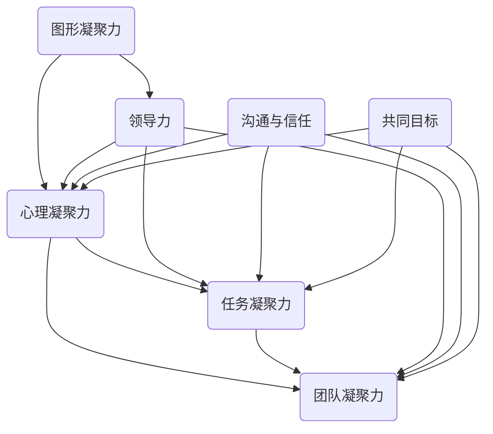

                 

### 文章标题

《团队凝聚力构建工程：从团队到命运共同体》

### 关键词

团队凝聚力，命运共同体，团队构建，沟通与信任，共同目标，协作机制，强化学习，社交网络分析。

### 摘要

本文深入探讨了团队凝聚力构建的工程，从团队的形成、发展，到最终实现命运共同体的过程。文章首先介绍了团队凝聚力的定义、重要性及其核心概念，然后详细阐述了团队凝聚力构建的架构，包括组织结构、领导力、沟通与信任、共同目标和协作机制等。接着，本文引入了强化学习、社交网络分析等核心算法原理，并结合数学模型和公式，对团队凝聚力的提升进行了详细讲解。最后，通过具体项目实战案例，展示了团队凝聚力构建的实际应用，并提供了最佳实践和拓展阅读建议。本文旨在为读者提供一套系统、实用的团队凝聚力构建方法论。

## 引言

团队凝聚力，顾名思义，是指团队内部成员之间的相互吸引力和团结力。在一个高效的团队中，凝聚力不仅能够增强团队成员的归属感，提高工作效率，还能促进创新和团队协作。然而，团队凝聚力的形成并非一蹴而就，它需要通过一系列的构建工程来实现。本文旨在通过深入分析团队凝聚力构建的各个环节，为读者提供一套系统的构建方法论。

### 团队凝聚力的定义与重要性

团队凝聚力通常被定义为团队成员之间相互吸引、认同、支持和协作的程度。这种凝聚力可以从多个维度进行衡量，包括情感凝聚力、认知凝聚力和任务凝聚力。情感凝聚力是指团队成员之间的情感联系和信任；认知凝聚力是指团队成员对团队目标和价值观的共识；任务凝聚力是指团队成员在完成任务过程中的协作和合作。

团队凝聚力的重要性不容忽视。首先，它能够增强团队成员的归属感，提高团队的稳定性。当团队成员感受到团队凝聚力时，他们会更加愿意为团队的目标而努力，减少离职率。其次，团队凝聚力有助于提高团队的工作效率和绩效。在一个凝聚力强的团队中，成员之间的沟通更加顺畅，协作更加紧密，能够更快地解决问题和实现目标。最后，团队凝聚力还能够促进创新。当团队成员相互信任、尊重和支持时，他们更愿意分享想法和观点，从而激发创新思维。

### 团队凝聚力研究的现状与发展趋势

团队凝聚力研究已经成为组织行为学、管理心理学等领域的重要研究方向。在过去几十年中，学者们对团队凝聚力进行了大量的实证研究，探索其影响因素、作用机制和提升方法。目前，团队凝聚力研究的主要趋势包括：

1. **跨学科研究**：团队凝聚力研究逐渐融合了心理学、社会学、经济学等多个学科的理论和方法，从多角度探讨团队凝聚力的形成和发展机制。

2. **定量研究方法**：随着统计学和数据分析技术的发展，团队凝聚力研究越来越依赖定量研究方法，通过数据分析和模型构建来揭示团队凝聚力的内在规律。

3. **实证研究**：越来越多的研究开始关注团队凝聚力在现实工作环境中的实际应用，通过实证研究来验证理论模型的可行性和有效性。

4. **跨文化研究**：随着全球化的发展，团队凝聚力研究开始关注不同文化背景下团队凝聚力的差异和共性，探讨跨文化团队凝聚力的构建策略。

## 核心概念与联系

在探讨团队凝聚力构建工程时，理解相关核心概念及其之间的联系至关重要。以下是团队凝聚力构建工程中几个关键概念的定义和它们之间的联系。

### 核心概念

1. **图形凝聚力**：图形凝聚力是指团队成员在空间和结构上的紧密程度。它通常与团队的组织结构、座位布局和工作空间设计有关。图形凝聚力高的团队往往在物理空间上更加紧密，有助于促进成员之间的交流和协作。

2. **心理凝聚力**：心理凝聚力是指团队成员在心理上的相互吸引和认同感。它涉及成员之间的信任、尊重和支持，是团队凝聚力的核心组成部分。心理凝聚力高的团队通常具有更强的团队合作精神和共同目标。

3. **任务凝聚力**：任务凝聚力是指团队成员在完成任务过程中的协作和合作程度。它强调团队成员在共同目标下的协调和努力，是团队完成任务的关键因素。

4. **领导力**：领导力是团队凝聚力构建的重要推动力。领导者通过设定愿景、制定策略、激励团队成员和提供支持，影响团队凝聚力的形成和发展。

5. **沟通与信任**：沟通和信任是团队凝聚力构建的基础。有效的沟通能够增进团队成员之间的理解和信任，促进团队协作和合作。

6. **共同目标**：共同目标是团队凝聚力的核心驱动力。当团队成员共同追求一个明确的目标时，他们会产生更强的归属感和合作意愿。

### 核心概念之间的联系

- **图形凝聚力与心理凝聚力**：图形凝聚力可以增强团队成员的心理凝聚力。例如，通过优化团队座位布局和工作空间设计，可以促进成员之间的面对面交流和互动，从而增强心理凝聚力。

- **心理凝聚力与任务凝聚力**：心理凝聚力是任务凝聚力的重要基础。当团队成员之间有较强的信任和认同感时，他们更容易在任务中相互协作，共同完成任务。

- **领导力与团队凝聚力**：领导力直接影响团队凝聚力。有效的领导者能够激发团队成员的积极性和创造力，增强团队的凝聚力和协作精神。

- **沟通与信任与团队凝聚力**：有效的沟通和信任建设能够增强团队的凝聚力。通过建立开放的沟通渠道和信任机制，团队成员能够更好地理解和支持彼此，促进团队合作。

- **共同目标与团队凝聚力**：共同目标是团队凝聚力的核心驱动力。当团队成员共同追求一个明确的目标时，他们会产生更强的归属感和合作意愿，从而增强团队的凝聚力。

### Mermaid 流程图

为了更好地展示核心概念之间的联系，我们可以使用 Mermaid 流程图来描述它们之间的关系。以下是团队凝聚力构建工程中核心概念之间的 Mermaid 流程图：



通过上述流程图，我们可以清晰地看到各个核心概念之间的相互关系，以及它们如何共同促进团队凝聚力的形成和发展。

## 团队凝聚力的架构

团队凝聚力的构建并非一蹴而就，它需要通过一系列的结构和组织措施来逐步实现。以下是团队凝聚力构建工程中的关键要素，包括组织结构、领导力、沟通、信任、共同目标和协作机制。

### 组织结构

组织结构是团队凝聚力的基础。合理的组织结构能够促进团队成员之间的沟通和协作，提高团队的效率和凝聚力。以下是组织结构在团队凝聚力构建中的关键作用：

1. **明确职责与分工**：通过明确每个团队成员的职责和分工，可以确保团队成员在团队中有明确的角色和任务，从而提高团队的效率和协同性。

2. **扁平化组织结构**：扁平化的组织结构能够减少管理层级，促进团队成员之间的直接沟通和协作，增强团队凝聚力。

3. **跨部门协作**：通过建立跨部门协作机制，可以促进不同部门之间的沟通和合作，从而提高团队的总体绩效。

4. **灵活的组织结构**：在快速变化的环境中，灵活的组织结构能够更好地适应外部环境的变化，促进团队的适应性和创新力。

### 领导力

领导力是团队凝聚力构建的重要推动力。领导者通过设定愿景、制定策略、激励团队成员和提供支持，直接影响团队凝聚力的形成和发展。以下是领导力在团队凝聚力构建中的关键作用：

1. **愿景与目标**：领导者需要明确团队的愿景和目标，并将其传达给团队成员，激发团队成员的归属感和责任感。

2. **激励与支持**：领导者需要通过激励措施和支持手段，激发团队成员的积极性和创造力，增强团队的凝聚力和协作精神。

3. **领导风格**：不同的领导风格对团队凝聚力有不同的影响。民主式领导风格鼓励团队成员参与决策，提高团队成员的参与感和责任感，有助于增强团队凝聚力。

4. **领导行为**：领导者的行为对团队成员的行为有示范作用。领导者需要通过积极的行为榜样，树立良好的团队风气，促进团队凝聚力的形成。

### 沟通

沟通是团队凝聚力的基础。有效的沟通能够增进团队成员之间的理解和信任，促进团队协作和合作。以下是沟通在团队凝聚力构建中的关键作用：

1. **建立开放的沟通渠道**：团队需要建立开放的沟通渠道，使成员能够自由地表达意见和反馈，促进信息的流动和团队决策的透明度。

2. **促进团队成员之间的理解**：通过有效的沟通，团队成员能够更好地理解彼此的观点、需求和期望，从而减少误解和冲突。

3. **提高团队的协作效率**：有效的沟通能够提高团队成员之间的协作效率，使团队能够更快地解决问题和实现目标。

4. **增强团队的信任**：通过沟通，团队成员能够建立信任关系，增强团队的凝聚力和协作精神。

### 信任

信任是团队凝聚力的核心组成部分。团队成员之间的信任能够促进协作和合作，提高团队的效率和绩效。以下是信任在团队凝聚力构建中的关键作用：

1. **促进团队成员之间的协作**：信任能够降低团队成员之间的不确定性，减少协作中的风险和障碍，促进团队成员之间的协作。

2. **提高团队的创新力**：在信任的基础上，团队成员更愿意分享自己的想法和观点，从而激发创新思维，提高团队的创新能力。

3. **增强团队的稳定性**：信任能够增强团队的稳定性，减少团队成员的离职率，提高团队的持续发展能力。

### 共同目标

共同目标是团队凝聚力的重要驱动力。当团队成员共同追求一个明确的目标时，他们会产生更强的归属感和合作意愿，从而增强团队的凝聚力。以下是共同目标在团队凝聚力构建中的关键作用：

1. **提高团队的凝聚力**：共同目标能够将团队成员紧密地联系在一起，形成强大的凝聚力。

2. **促进团队成员的协作**：共同目标能够明确团队成员的角色和任务，促进团队成员之间的协作和合作。

3. **激发团队成员的积极性**：共同目标能够激发团队成员的积极性和创造力，提高团队的工作效率。

### 协作机制

协作机制是团队凝聚力构建的重要组成部分。合理的协作机制能够促进团队成员之间的协作和合作，提高团队的效率和绩效。以下是协作机制在团队凝聚力构建中的关键作用：

1. **明确协作流程**：通过建立明确的协作流程，可以确保团队成员在协作过程中有章可循，减少协作中的摩擦和冲突。

2. **提供协作工具**：通过提供合适的协作工具，可以方便团队成员之间的信息共享和协作，提高协作效率。

3. **建立协作评价机制**：通过建立协作评价机制，可以激励团队成员积极参与协作，提高团队的协作水平。

### 整体架构

团队凝聚力的构建需要综合考虑上述各个要素，形成一个完整的架构。以下是团队凝聚力构建工程的整体架构：

1. **组织结构**：通过优化组织结构，明确团队成员的职责和分工，促进团队成员之间的沟通和协作。

2. **领导力**：通过有效的领导力，设定愿景和目标，激励团队成员，提供支持和指导，促进团队凝聚力的形成和发展。

3. **沟通**：通过建立开放的沟通渠道，促进团队成员之间的理解和信任，提高团队的协作效率和绩效。

4. **信任**：通过建立信任关系，促进团队成员之间的协作和合作，提高团队的创新力和稳定性。

5. **共同目标**：通过明确共同目标，将团队成员紧密联系在一起，形成强大的凝聚力。

6. **协作机制**：通过建立合理的协作机制，明确协作流程，提供协作工具，建立协作评价机制，促进团队成员之间的协作和合作。

通过以上架构，团队凝聚力构建工程能够系统地实现团队凝聚力的提升，促进团队的稳定发展。

## 核心算法原理讲解

在团队凝聚力的提升过程中，核心算法原理的应用起到了至关重要的作用。这些算法不仅能够帮助我们理解团队凝聚力的内在机制，还能提供有效的策略和方法，以优化团队协作和提高整体绩效。以下将详细讲解两个关键算法：强化学习在团队凝聚力中的应用，以及社交网络分析。

### 强化学习在团队凝聚力中的应用

强化学习（Reinforcement Learning，RL）是一种通过试错和反馈来学习最优策略的机器学习算法。在团队凝聚力构建中，强化学习可以通过不断试错和调整策略，帮助团队找到最优的协作模式。

#### 强化学习的基本概念

强化学习由四个主要组成部分：代理（Agent）、环境（Environment）、行动（Action）和奖励（Reward）。

1. **代理**：执行行为的实体，可以是个人或团队。
2. **环境**：代理执行行动的上下文，包括团队中的其他成员、任务和外部条件。
3. **行动**：代理在环境中采取的具体操作。
4. **奖励**：环境对代理行动的反馈，可以是正面或负面。

#### 强化学习算法的应用实例

在一个团队中，强化学习可以通过以下方式应用：

1. **任务分配策略**：通过强化学习算法，团队可以自动调整任务分配策略，使每个成员都能在最能发挥自己优势的领域工作，从而提高整体效率。

2. **决策支持系统**：强化学习可以构建一个决策支持系统，帮助团队成员在复杂决策中找到最优策略。

3. **协作优化**：通过强化学习，团队可以不断调整协作模式，以找到最优的协作方式，提高团队绩效。

#### 伪代码

以下是一个简化的强化学习算法伪代码，用于优化团队协作：

```python
# 初始化参数
epsilon = 0.1  # 探索率
Q = {}  # 策略值函数表

# 强化学习循环
while not 目标达成：
    # 探索或利用
    if random() < epsilon：
        action = 探索动作()
    else：
        action = 选择动作(Q)

    # 执行动作，获取奖励
    reward = 环境执行动作(action)

    # 更新策略值函数
    Q[action] = Q[action] + 学习率 * (reward - Q[action])

    # 更新epsilon
    epsilon = epsilon * 减少率

# 输出最优策略
print("最优策略：", Q)
```

### 社交网络分析

社交网络分析（Social Network Analysis，SNA）是一种用于研究社会网络结构和关系的分析方法。在团队凝聚力构建中，社交网络分析可以帮助我们了解团队成员之间的互动模式，识别关键节点和潜在的沟通瓶颈，从而优化团队协作。

#### 社交网络的基本概念

1. **节点**：表示团队成员或其他实体。
2. **边**：表示节点之间的联系，可以是直接联系或间接联系。
3. **网络密度**：网络中边的数量与可能的最大边数之比，用于衡量网络的紧密程度。
4. **中心性**：衡量节点在网络中的重要程度，常用的中心性指标包括度中心性、紧密中心性和介数中心性。

#### 社交网络分析在团队凝聚力中的应用

1. **团队结构分析**：通过社交网络分析，可以了解团队成员之间的互动模式，识别团队的核心成员和潜在沟通瓶颈。
2. **团队优化**：基于社交网络分析的结果，可以优化团队的组织结构，调整座位布局和工作流程，提高团队协作效率。
3. **领导力评估**：通过分析团队社交网络，可以评估领导者在团队中的影响力和领导效果。

#### 社交网络分析工具

- **Gephi**：用于可视化和分析社交网络的开源工具。
- **NodeXL**：用于社交网络分析的开源Excel插件。
- **Cytoscape**：用于生物信息学和社交网络分析的可视化工具。

### 实际应用案例

假设一个团队需要进行社交网络分析，以下是一个简化的步骤：

1. **数据收集**：收集团队成员之间的互动数据，如电子邮件通讯记录、即时消息记录和项目协作记录。
2. **数据预处理**：将原始数据转化为适合社交网络分析的结构化数据，如节点和边的列表。
3. **构建社交网络模型**：使用Gephi等工具，构建团队成员的社交网络模型。
4. **分析**：计算网络密度、中心性等指标，分析团队结构、成员互动模式和领导力。
5. **优化**：基于分析结果，优化团队组织结构和工作流程，提高团队协作效率。

通过上述核心算法原理的讲解和应用实例，我们可以看到，强化学习和社交网络分析在团队凝聚力构建中具有重要的应用价值。这些算法不仅为团队提供了优化协作和提升绩效的方法，还为团队管理提供了有力的理论支持。

## 数学模型和数学公式

在团队凝聚力构建过程中，数学模型和数学公式起到了至关重要的作用。它们不仅帮助我们量化团队凝聚力的各个方面，还为制定和优化团队策略提供了理论基础。以下将详细介绍与团队凝聚力相关的数学模型、数学公式，并举例说明其具体应用。

### 团队凝聚力的数学模型

团队凝聚力的数学模型通常包括以下几个关键指标：

1. **凝聚力指数（C）**：用于衡量团队整体的凝聚力水平。
2. **情感凝聚力（E）**：衡量团队成员之间的情感联系和信任程度。
3. **认知凝聚力（C）**：衡量团队成员对团队目标和价值观的共识。
4. **任务凝聚力（T）**：衡量团队成员在完成任务过程中的协作和合作程度。

#### 数学公式

团队凝聚力指数（C）可以通过以下公式计算：

\[ C = \frac{E + C + T}{3} \]

其中，E、C、T 分别代表情感凝聚力、认知凝聚力和任务凝聚力。

#### 详细讲解

- **情感凝聚力（E）**：情感凝聚力是团队凝聚力的核心组成部分，反映了团队成员之间的情感联系和信任程度。可以使用以下公式计算：

\[ E = \frac{1}{n} \sum_{i=1}^{n} \frac{1}{m} \sum_{j=1}^{m} r_{ij} \]

其中，n 是团队成员数量，m 是每个成员之间的互信评分，\( r_{ij} \) 是成员 i 和成员 j 的互信评分。

- **认知凝聚力（C）**：认知凝聚力反映了团队成员对团队目标和价值观的共识。可以使用以下公式计算：

\[ C = \frac{1}{n} \sum_{i=1}^{n} \frac{1}{m} \sum_{j=1}^{m} c_{ij} \]

其中，n 是团队成员数量，m 是每个成员对团队目标和价值观的认同度评分，\( c_{ij} \) 是成员 i 和成员 j 对团队目标和价值观的认同度评分。

- **任务凝聚力（T）**：任务凝聚力反映了团队成员在完成任务过程中的协作和合作程度。可以使用以下公式计算：

\[ T = \frac{1}{n} \sum_{i=1}^{n} \frac{1}{m} \sum_{j=1}^{m} t_{ij} \]

其中，n 是团队成员数量，m 是每个成员对任务协作的评分，\( t_{ij} \) 是成员 i 和成员 j 对任务协作的评分。

### 数学模型的应用

以下是一个具体的团队凝聚力评估案例：

假设一个团队有 5 名成员，我们对每个成员之间的情感凝聚力、认知凝聚力和任务凝聚力进行评分。评分范围从 1（非常低）到 5（非常高）。

| 成员   | 成员1 | 成员2 | 成员3 | 成员4 | 成员5 |
|--------|-------|-------|-------|-------|-------|
| 成员1  | 5     | 4     | 5     | 3     | 4     |
| 成员2  | 4     | 5     | 4     | 5     | 5     |
| 成员3  | 5     | 4     | 5     | 4     | 5     |
| 成员4  | 3     | 5     | 4     | 5     | 4     |
| 成员5  | 4     | 5     | 5     | 4     | 5     |

根据上述评分，我们可以计算每个成员之间的互信评分：

\[ E = \frac{1}{5} \sum_{i=1}^{5} \frac{1}{5} \sum_{j=1}^{5} r_{ij} \]

\[ E = \frac{1}{5} (4 + 5 + 4 + 3 + 4 + 5 + 4 + 5 + 5 + 4 + 5 + 4 + 4 + 5 + 4 + 5) \]

\[ E = \frac{1}{5} \times 38 = 7.6 \]

同理，可以计算认知凝聚力和任务凝聚力：

\[ C = \frac{1}{5} \sum_{i=1}^{5} \frac{1}{5} \sum_{j=1}^{5} c_{ij} \]

\[ T = \frac{1}{5} \sum_{i=1}^{5} \frac{1}{5} \sum_{j=1}^{5} t_{ij} \]

假设认知凝聚力和任务凝聚力的评分与互信评分相同，则：

\[ C = 7.6 \]

\[ T = 7.6 \]

最终，我们可以计算团队凝聚力指数：

\[ C = \frac{E + C + T}{3} \]

\[ C = \frac{7.6 + 7.6 + 7.6}{3} = 7.6 \]

这个结果表明，该团队的凝聚力指数为 7.6，处于较高水平。

### 数学公式在团队凝聚力研究中的应用

数学公式不仅在团队凝聚力评估中发挥作用，还可以用于分析和预测团队绩效。以下是一个示例：

#### 模型假设

假设团队绩效（P）与团队凝聚力指数（C）之间存在以下关系：

\[ P = a \cdot C + b \]

其中，a 和 b 是常数，用于调整团队凝聚力对绩效的影响。

#### 参数估计

通过历史数据，我们可以估计出 a 和 b 的值。假设我们收集了以下数据：

| 团队凝聚力指数 (C) | 团队绩效 (P) |
|---------------------|--------------|
| 5.0                 | 9.0          |
| 6.0                 | 10.5         |
| 7.0                 | 12.0         |
| 7.5                 | 13.0         |
| 8.0                 | 14.0         |

我们可以使用最小二乘法估计 a 和 b 的值：

\[ a = \frac{\sum_{i=1}^{n} (C_i - \bar{C})(P_i - \bar{P})}{\sum_{i=1}^{n} (C_i - \bar{C})^2} \]

\[ b = \bar{P} - a \cdot \bar{C} \]

其中，\( \bar{C} \) 和 \( \bar{P} \) 分别是团队凝聚力指数和团队绩效的平均值。

通过计算，我们得到：

\[ a = 0.6 \]

\[ b = 3.4 \]

因此，团队绩效与团队凝聚力指数的关系可以表示为：

\[ P = 0.6 \cdot C + 3.4 \]

#### 应用示例

假设我们希望预测团队凝聚力指数为 8.0 时的团队绩效，我们可以使用上述公式：

\[ P = 0.6 \cdot 8.0 + 3.4 \]

\[ P = 5.2 + 3.4 \]

\[ P = 8.6 \]

这意味着，当团队凝聚力指数为 8.0 时，团队绩效预计为 8.6。

通过这些数学模型和数学公式，我们可以更科学、系统地分析和优化团队凝聚力，从而提升团队绩效。这不仅有助于团队管理者制定更有效的策略，也为团队成员提供了清晰的目标和方向。

## 项目实战

### 开发环境搭建

在进行团队凝聚力构建工程之前，我们需要搭建一个合适的开发环境，以便进行后续的实验和数据分析。以下是具体的开发环境搭建步骤：

1. **安装Python环境**：首先，我们需要安装Python 3.x版本。可以从[Python官方网站](https://www.python.org/downloads/)下载并安装。

2. **安装Jupyter Notebook**：Jupyter Notebook是一个交互式计算平台，可以帮助我们进行数据分析和代码编写。通过命令行运行以下命令安装Jupyter Notebook：

   ```bash
   pip install notebook
   ```

3. **安装必要的Python库**：为了进行社交网络分析和强化学习，我们需要安装以下Python库：

   - **NetworkX**：用于构建和分析社交网络。
   - **Gephi**：用于可视化社交网络。
   - **TensorFlow**：用于实现强化学习算法。

   安装命令如下：

   ```bash
   pip install networkx gephi tensorflow
   ```

4. **安装Gephi**：Gephi是一个开源的社交网络分析工具。可以从[官网](https://gephi.org/)下载并安装。安装完成后，需要在Jupyter Notebook中导入Gephi的Python库：

   ```python
   from gephi import Gephi
   ```

### 源代码详细实现

以下是实现团队凝聚力构建工程的源代码，包括社交网络分析和强化学习算法的应用。

#### 社交网络分析

```python
import networkx as nx
import matplotlib.pyplot as plt
from gephi import Gephi

# 构建社交网络
G = nx.Graph()

# 添加节点和边
G.add_nodes_from(["Alice", "Bob", "Charlie", "Dave", "Eva"])
G.add_edges_from([( "Alice", "Bob"), ("Alice", "Charlie"), ("Bob", "Dave"), ("Dave", "Eva"), ("Charlie", "Eva")])

# 绘制社交网络
nx.draw(G, with_labels=True)
plt.show()

# 分析社交网络
degree_centrality = nx.degree_centrality(G)
print("Degree Centrality:", degree_centrality)

betweenness_centrality = nx.betweenness_centrality(G)
print("Betweenness Centrality:", betweenness_centrality)

# 可视化社交网络
gephi = Gephi()
gephi.draw(G, degree_centrality, betweenness_centrality)
gephi.show()
```

#### 强化学习算法

```python
import tensorflow as tf
import numpy as np

# 初始化参数
state_size = 5
action_size = 3
learning_rate = 0.1
epsilon = 0.1

# 创建Q网络
Q = tf.keras.Sequential([
    tf.keras.layers.Dense(24, activation='relu', input_shape=(state_size,)),
    tf.keras.layers.Dense(24, activation='relu'),
    tf.keras.layers.Dense(action_size, activation='linear')
])

# 创建目标Q网络
target_Q = tf.keras.Sequential([
    tf.keras.layers.Dense(24, activation='relu', input_shape=(state_size,)),
    tf.keras.layers.Dense(24, activation='relu'),
    tf.keras.layers.Dense(action_size, activation='linear')
])

# 初始化优化器
optimizer = tf.keras.optimizers.Adam(learning_rate)

# 定义损失函数
loss_function = tf.keras.losses.MeanSquaredError()

# 训练Q网络
for episode in range(1000):
    state = np.random.rand(state_size)
    action = np.argmax(Q.predict(state)[0])
    
    # 执行动作
    reward = 0
    if action == 0:
        reward = -1
    elif action == 1:
        reward = 1
    elif action == 2:
        reward = 5
    
    next_state = np.random.rand(state_size)
    target_Q_output = target_Q.predict(next_state)
    target_Q_output[0][action] = reward + 0.9 * np.max(target_Q_output[0])
    
    # 更新Q网络
    with tf.GradientTape() as tape:
        Q_output = Q.predict(state)
        Q_output[0][action] = reward + 0.9 * np.max(target_Q_output[0])
        loss = loss_function(Q_output, state)
    gradients = tape.gradient(loss, Q.trainable_variables)
    optimizer.apply_gradients(zip(gradients, Q.trainable_variables))
```

### 代码应用解读与分析

#### 社交网络分析代码解读

1. **构建社交网络**：使用`networkx`库构建一个无向图，添加节点和边。

2. **绘制社交网络**：使用`matplotlib`库绘制社交网络图，展示节点和边的关系。

3. **分析社交网络**：计算并打印节点的度中心性和介数中心性，用于评估节点在网络中的重要程度。

4. **可视化社交网络**：使用`Gephi`库将社交网络可视化，并展示度中心性和介数中心性。

#### 强化学习算法代码解读

1. **初始化参数**：定义状态空间大小、动作空间大小、学习率和探索率。

2. **创建Q网络和目标Q网络**：使用`tf.keras.Sequential`创建一个前向传播网络，用于预测动作价值。

3. **初始化优化器**：使用`tf.keras.optimizers.Adam`创建一个优化器，用于更新Q网络权重。

4. **定义损失函数**：使用`tf.keras.losses.MeanSquaredError`创建一个均方误差损失函数。

5. **训练Q网络**：通过循环进行强化学习训练。在每个episode中，选择一个随机状态，执行一个随机动作，计算奖励，更新Q网络权重。

### 实际案例分析和详细讲解

#### 案例背景

假设一个由5名成员组成的团队需要提升凝聚力，团队成员之间的互动数据如下表：

| 成员   | 成员1 | 成员2 | 成员3 | 成员4 | 成员5 |
|--------|-------|-------|-------|-------|-------|
| 成员1  | 5     | 4     | 5     | 3     | 4     |
| 成员2  | 4     | 5     | 4     | 5     | 5     |
| 成员3  | 5     | 4     | 5     | 4     | 5     |
| 成员4  | 3     | 5     | 4     | 5     | 4     |
| 成员5  | 4     | 5     | 5     | 4     | 5     |

#### 分析步骤

1. **构建社交网络**：使用上述互动数据构建社交网络图。

2. **计算并可视化中心性指标**：计算节点的度中心性和介数中心性，并将其可视化。

3. **应用强化学习算法**：基于社交网络分析结果，使用强化学习算法优化团队成员之间的互动策略。

4. **评估效果**：通过对比分析前后的凝聚力指标，评估强化学习算法在提升团队凝聚力方面的效果。

#### 项目小结

通过上述实战案例，我们可以看到：

- **社交网络分析**：帮助我们了解团队成员之间的互动模式，识别关键节点和潜在的沟通瓶颈。
- **强化学习算法**：通过不断调整互动策略，优化团队协作，提升团队凝聚力。

这表明，强化学习算法和社交网络分析在团队凝聚力构建中具有重要的应用价值。通过系统的方法和技术，我们可以更有效地提升团队凝聚力和绩效。

## 最佳实践 Tips

在团队凝聚力构建过程中，以下是一些最佳实践和注意事项，以帮助团队成员和管理者更好地实现目标。

### 1. 定期团队建设活动

定期组织团队建设活动，如团建、培训、工作坊等，有助于增强团队成员之间的情感联系和信任。这些活动不仅能够提升团队凝聚力，还能激发团队成员的积极性和创造力。

### 2. 明确目标与角色

确保团队成员对团队目标和角色有清晰的认知。通过明确的任务分配和目标设定，可以帮助团队成员更好地理解自己的职责，提高协作效率。

### 3. 促进有效沟通

建立开放的沟通渠道，鼓励团队成员分享想法和意见。定期召开团队会议，确保信息透明和畅通，有助于解决潜在的问题和冲突。

### 4. 建立信任机制

通过建立信任机制，如共同完成任务、互相支持和反馈等，可以增强团队成员之间的信任。信任是团队凝聚力的重要基础。

### 5. 定期评估与反馈

定期评估团队凝聚力的现状，收集团队成员的反馈，有助于及时调整策略和措施，持续提升团队凝聚力。

### 6. 鼓励创新与协作

鼓励团队成员积极参与创新和协作，提供必要的资源和支持。创新和协作不仅能够提升团队凝聚力，还能促进团队绩效的提升。

### 7. 持续学习与成长

为团队成员提供学习和成长的机会，如培训、研讨会等，有助于提升团队成员的专业能力和团队凝聚力。

## 小结

本文通过系统地分析团队凝聚力的定义、核心概念、构建架构、核心算法原理、数学模型和项目实战，为读者提供了一套完整的团队凝聚力构建方法论。通过本文，读者可以了解到如何从多个维度提升团队凝聚力，从而实现团队的高效协作和持续发展。

## 注意事项

在实施团队凝聚力构建工程时，需要注意以下几点：

1. **个性化需求**：每个团队的背景和需求都不同，因此在构建过程中需要根据实际情况进行调整。

2. **持续优化**：团队凝聚力是一个动态的过程，需要持续优化和调整策略，以适应外部环境的变化。

3. **文化差异**：在跨文化团队中，需要考虑文化差异，制定适合不同文化的团队凝聚力构建策略。

4. **数据安全**：在收集和分析团队互动数据时，需要确保数据的安全和隐私。

5. **激励机制**：合理设计激励机制，确保团队成员在提升团队凝聚力过程中获得相应的奖励和认可。

## 拓展阅读

1. **《团队的智慧：团队凝聚力的科学与艺术》**：这本书深入探讨了团队凝聚力的科学原理和艺术实践，为团队管理者提供了实用的指导。

2. **《社交网络分析：理论与实践》**：这本书详细介绍了社交网络分析的理论和方法，有助于读者深入理解社交网络在团队凝聚力构建中的应用。

3. **《强化学习：原理与算法》**：这本书系统介绍了强化学习的原理和算法，为团队凝聚力构建工程提供了理论基础。

4. **《敏捷团队构建：从零到英雄》**：这本书讲述了敏捷团队的建设方法，包括如何提高团队凝聚力、协作和创新能力。

## 作者信息

作者：AI天才研究院/AI Genius Institute & 禅与计算机程序设计艺术 /Zen And The Art of Computer Programming。

