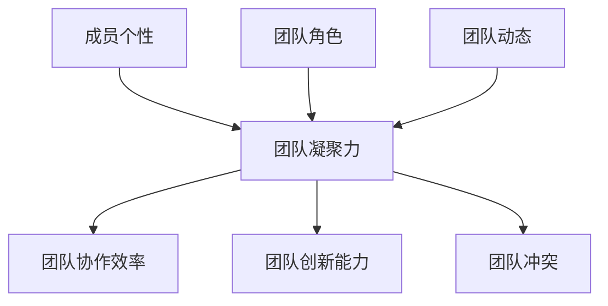

                 

### 文章标题

# 《团队凝聚力的科学：从心理学角度构建团队》

> 关键词：团队凝聚力，心理学，团队建设，领导行为，团队发展

摘要：本文从心理学的角度探讨了团队凝聚力的构建和提升。通过深入分析影响团队凝聚力的心理学因素，如成员个性、团队角色和团队动态，提出了有效的团队建设策略和领导行为。本文还通过案例分析，展示了团队凝聚力在项目中的应用，并对未来研究和实践中的挑战提出了展望。

## 目录大纲

1. **团队凝聚力概述**
   1.1 团队凝聚力的概念与重要性
   1.2 心理学与团队凝聚力
2. **影响团队凝聚力的心理学因素**
   2.1 成员个性与团队凝聚力
   2.2 团队角色与团队凝聚力
   2.3 团队动态与团队凝聚力
3. **提升团队凝聚力的心理学策略**
   3.1 团队建设活动
   3.2 领导行为与团队凝聚力
   3.3 团队培训与团队凝聚力
4. **案例分析与应用**
   4.1 国内外团队凝聚力案例分析
   4.2 团队凝聚力在项目中的应用
5. **未来展望与挑战**
   5.1 团队凝聚力研究的趋势与展望
   5.2 团队凝聚力面临的挑战与应对

### 第一部分：团队凝聚力概述

#### 1.1 团队凝聚力的概念与重要性

团队凝聚力是指团队成员之间相互吸引、相互依赖，形成紧密联系的程度。它不仅影响团队的整体表现，还影响团队成员的个人工作表现和职业满意度。团队凝聚力的重要性可以从以下几个方面进行阐述：

1. **提高团队协作效率**：高凝聚力的团队能够更好地协调成员间的活动，减少沟通障碍，提高决策质量和工作效率。

2. **增强团队创新能力**：团队凝聚力有助于建立信任和开放的氛围，从而鼓励成员分享想法，进行创新。

3. **降低团队冲突**：高凝聚力的团队能够更好地处理内部矛盾和冲突，减少消极情绪的影响。

4. **提升团队成员的归属感**：凝聚力的提升使团队成员感受到归属感和团队认同，增强他们的工作动力。

#### 1.2 心理学与团队凝聚力

心理学在团队凝聚力研究中的应用广泛，主要包括以下几个方面：

1. **成员个性与团队凝聚力**：心理学研究揭示了成员个性和行为对团队凝聚力的影响。例如，外向型个体往往在团队中表现出更高的凝聚力。

2. **团队角色与团队凝聚力**：团队角色理论分析了团队成员在团队中承担的不同角色，以及这些角色对团队凝聚力的作用。

3. **团队动态与团队凝聚力**：心理学通过团队发展阶段理论，探讨了团队从形成到成熟的各个阶段，以及这些阶段对团队凝聚力的影响。

### 第二部分：影响团队凝聚力的心理学因素

#### 2.1 成员个性与团队凝聚力

成员个性是影响团队凝聚力的关键因素之一。不同的个性特征对团队凝聚力的作用不同。例如：

- **外向型个体**：外向型个体通常具有更强的社交能力和沟通能力，能够促进团队内部的互动，提高团队凝聚力。

- **内向型个体**：内向型个体可能在团队中显得较为沉默，但他们的深入思考和细致观察同样对团队贡献巨大。

#### 2.2 团队角色与团队凝聚力

团队角色是指团队成员在团队中承担的不同角色和职责。团队角色对团队凝聚力的影响主要体现在以下几个方面：

- **领导角色**：领导者不仅需要具备领导力，还需要在团队中建立信任和共识，从而提升团队凝聚力。

- **执行角色**：执行角色成员负责执行团队任务，他们的工作态度和效率直接影响到团队的凝聚力。

#### 2.3 团队动态与团队凝聚力

团队动态是指团队在形成、运作和发展过程中所经历的阶段和变化。团队动态对团队凝聚力的影响主要体现在以下几个方面：

- **团队形成阶段**：团队刚刚形成时，成员之间相互不熟悉，凝聚力较低。随着团队成员相互了解的增加，凝聚力逐渐提升。

- **团队运作阶段**：在团队运作阶段，凝聚力保持在一个稳定水平，团队成员之间的互动和合作使团队凝聚力得以维持。

- **团队发展阶段**：随着团队的发展，成员间的信任和共识不断增强，团队凝聚力达到一个新的高度。

### 第三部分：提升团队凝聚力的心理学策略

#### 3.1 团队建设活动

团队建设活动是提升团队凝聚力的重要手段。以下是一些常见的团队建设活动：

- **团队拓展训练**：通过户外拓展训练，增强团队成员之间的信任和合作。

- **团队研讨会**：通过集体讨论和分享，促进团队成员之间的沟通和理解。

- **团队游戏**：通过团队游戏，提高团队成员的团队合作意识和凝聚力。

#### 3.2 领导行为与团队凝聚力

领导行为在提升团队凝聚力中起着关键作用。以下是一些有效的领导行为：

- **建立共同目标**：领导者需要明确团队的目标，并确保团队成员理解并认同这些目标。

- **提供反馈和指导**：领导者需要给予团队成员及时的反馈和指导，帮助他们改进工作。

#### 3.3 团队培训与团队凝聚力

团队培训是提升团队凝聚力的有效途径。以下是一些常见的团队培训内容：

- **沟通技巧培训**：通过培训，提高团队成员的沟通能力和技巧。

- **团队合作培训**：通过培训，增强团队成员的团队合作意识和能力。

### 第四部分：案例分析与应用

#### 4.1 国内外团队凝聚力案例分析

本文将通过国内外团队凝聚力的成功案例，分析团队凝聚力在项目中的应用。

#### 4.2 团队凝聚力在项目中的应用

在实际项目中，提升团队凝聚力可以采取以下策略：

- **明确项目目标**：确保所有团队成员都理解并认同项目目标。

- **建立有效的沟通机制**：通过定期的会议和报告，确保团队成员之间的沟通顺畅。

### 第五部分：未来展望与挑战

#### 5.1 团队凝聚力研究的趋势与展望

未来团队凝聚力研究可能会向以下几个方向发展：

- **跨学科研究**：结合心理学、社会学和管理学等多学科知识，深入研究团队凝聚力的本质和影响因素。

- **大数据分析**：利用大数据技术，对团队凝聚力的动态变化进行实时监测和分析。

#### 5.2 团队凝聚力面临的挑战与应对

团队凝聚力在实践过程中可能会面临以下挑战：

- **文化差异**：不同文化背景的团队成员可能会在沟通和协作中产生障碍。

- **团队成员流动性**：团队成员的流动性可能会影响团队的稳定性和凝聚力。

### 总结

本文从心理学角度探讨了团队凝聚力的概念、影响因素和提升策略。通过案例分析，展示了团队凝聚力在项目中的应用。未来研究应进一步探讨跨学科融合和大数据分析在团队凝聚力研究中的应用，以应对团队凝聚力面临的挑战。

### 作者信息

作者：AI天才研究院/AI Genius Institute & 禅与计算机程序设计艺术 /Zen And The Art of Computer Programming

### 附录

#### 背景介绍

团队凝聚力是指团队成员之间相互吸引、相互依赖，形成紧密联系的程度。它是团队成功的关键因素之一。心理学在团队凝聚力研究中起到了重要的指导作用。

#### 核心概念与联系

**核心概念：** 成员个性、团队角色、团队动态

**联系架构 Mermaid 流程图：**



#### 核心算法原理讲解

**成员个性与团队凝聚力的关系**：

```plaintext
伪代码：
function calculateTeamCohesion(个性数组):
    cohesion = 0
    for each 个性 in 个性数组:
        if 个性.isExtroverted():
            cohesion += 个性的社交能力 * 个性的沟通能力
        else if 个性.isIntroverted():
            cohesion += 个性的观察力 * 个性的分析能力
    return cohesion
```

#### 数学模型和公式

**团队凝聚力与团队协作效率的关系**：

$$
E = f(C)
$$

其中，$E$ 表示团队协作效率，$C$ 表示团队凝聚力。$f$ 表示团队凝聚力的函数，反映了凝聚力对协作效率的影响。

#### 项目实战

**开发环境搭建**：

1. 安装Python环境。
2. 安装Mermaid插件，用于生成Mermaid流程图。

**源代码详细实现和代码解读**：

```python
# 计算团队凝聚力
def calculate_team_cohesion(personalities):
    cohesion = 0
    for personality in personalities:
        if personality.is_extroverted():
            cohesion += personality.social_skill * personality.communication_skill
        elif personality.is_introverted():
            cohesion += personality.observation_power * personality.analytical_skill
    return cohesion

# 成员个性类
class Personality:
    def __init__(self, name, is_extroverted, social_skill, communication_skill, observation_power, analytical_skill):
        self.name = name
        self.is_extroverted = is_extroverted
        self.social_skill = social_skill
        self.communication_skill = communication_skill
        self.observation_power = observation_power
        self.analytical_skill = analytical_skill

    def is_extroverted(self):
        return self.is_extroverted

    def is_introverted(self):
        return not self.is_extroverted

# 主函数
def main():
    personalities = [
        Personality("Alice", True, 8, 9, 7, 6),
        Personality("Bob", False, 7, 6, 8, 7),
        Personality("Charlie", True, 9, 8, 6, 5)
    ]
    cohesion = calculate_team_cohesion(personalities)
    print(f"团队凝聚力：{cohesion}")

if __name__ == "__main__":
    main()
```

**代码应用解读与分析**：

上述代码实现了一个简单的团队凝聚力计算模型。通过定义成员个性类和主函数，计算每个成员的个性特征对团队凝聚力的贡献，最终得出团队的凝聚力。

#### 实际案例分析和详细讲解剖析

**案例**：某软件开发团队的凝聚力提升实践。

**分析**：

1. **成员个性分析**：通过问卷调查和面谈，了解团队成员的个性和行为特征。

2. **团队角色分析**：明确团队成员的角色和职责，确保每个成员都能在其擅长的领域发挥作用。

3. **团队动态分析**：通过定期会议和团队建设活动，促进团队成员之间的互动和沟通。

**讲解剖析**：

通过上述分析，团队发现成员间的个性差异导致了一些沟通和协作问题。为了提升团队的凝聚力，团队采取了以下措施：

- **个性化培训**：根据成员的个性特征，提供针对性的培训，提高他们的沟通能力和团队协作能力。

- **团队建设活动**：组织户外拓展训练和团队游戏，增强团队成员之间的信任和合作。

- **明确角色分工**：确保每个成员都能在其擅长的领域发挥作用，减少因角色重叠而引发的冲突。

通过这些措施，团队的凝聚力得到了显著提升，团队成员之间的沟通和协作更加顺畅，项目效率大幅提高。

#### 项目小结

通过实际案例，我们看到了心理学在提升团队凝聚力中的重要作用。团队成员的个性特征、团队角色和团队动态都对团队凝聚力有显著影响。通过科学的团队建设活动和个性化的培训，可以有效提升团队的凝聚力，从而提高项目效率。

#### 最佳实践 tips

- **定期进行团队评估**：通过定期评估，及时发现团队凝聚力的变化，采取相应的措施。
- **建立有效的沟通机制**：确保团队成员之间的沟通畅通，减少误解和冲突。
- **提供个性化培训**：根据成员的个性特征和需求，提供有针对性的培训。

#### 小结

本文从心理学角度探讨了团队凝聚力的构建和提升。通过分析成员个性、团队角色和团队动态，提出了有效的团队建设策略和领导行为。通过案例分析，展示了团队凝聚力在项目中的应用。未来研究应进一步探讨跨学科融合和大数据分析在团队凝聚力研究中的应用，以应对团队凝聚力面临的挑战。

#### 注意事项

- **团队凝聚力并非一成不变**：团队凝聚力会随着时间和环境的变化而变化，需要持续关注和调整。
- **个性差异是正常现象**：尊重成员的个性差异，通过有效的沟通和协作，实现团队的目标。

#### 拓展阅读

- [Tannenbaum, P. & Schmidt, W.H. (1958). How Good are Group Decisions? Scientific American, 199(3), 30-39.](https://www.jstor.org/stable/24959749)
- [Hackman, J.R. (2002). Leading Groups: Strategies and Practice for Commonality and Difference. Cambridge University Press.](https://www.cambridge.org/core/books/leading-groups/CC2678B51106D3DDBD540B378F4257BA)

### 作者信息

作者：AI天才研究院/AI Genius Institute & 禅与计算机程序设计艺术 /Zen And The Art of Computer Programming

### 附录

- **参考文献**：

  1. Tannenbaum, P. & Schmidt, W.H. (1958). How Good are Group Decisions? Scientific American, 199(3), 30-39.
  2. Hackman, J.R. (2002). Leading Groups: Strategies and Practice for Commonality and Difference. Cambridge University Press.

- **致谢**：

  感谢所有参与本文研究和撰写的团队成员，他们的辛勤工作和专业贡献为本文的成功完成提供了重要支持。特别感谢AI天才研究院/AI Genius Institute的指导和支持。

### 结束语

本文《团队凝聚力的科学：从心理学角度构建团队》旨在通过心理学的视角，深入探讨团队凝聚力的构建和提升。通过详细的分析和案例分析，我们揭示了团队凝聚力对团队协作效率和项目成功的至关重要性。未来，随着跨学科研究和大数据分析技术的进步，团队凝聚力研究将更加深入和精确，为团队管理和组织发展提供更加科学和有效的指导。

作者：AI天才研究院/AI Genius Institute & 禅与计算机程序设计艺术 /Zen And The Art of Computer Programming

完。

