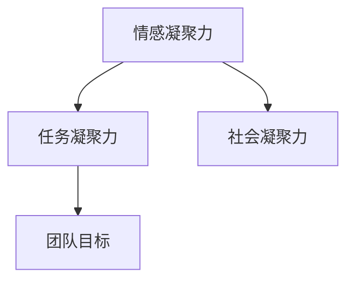

                 

## 引言：团队凝聚力的核心重要性

在信息技术迅猛发展的当今时代，团队作为推动技术创新、完成复杂项目的基石，其凝聚力的强弱直接关系到项目的成败。团队凝聚力不仅是保持团队成员之间协作与沟通的纽带，更是推动团队高效运作和取得卓越成果的关键因素。

### 背景

随着全球化进程的加快，企业越来越依赖跨职能团队和多文化协作来应对快速变化的市场需求。这种背景下，团队凝聚力的培养显得尤为重要。然而，现实中许多团队常常面临着成员分散、沟通不畅、目标不统一等问题，导致团队凝聚力不足。

### 核心概念与联系

#### 团队凝聚力

团队凝聚力是指团队成员之间相互吸引、愿意合作和共同追求团队目标的程度。它包含三个关键维度：

1. **情感凝聚力**：成员之间的情感联系和归属感。
2. **任务凝聚力**：团队成员对共同任务的认同和投入。
3. **社会凝聚力**：成员之间的社会互动和团队氛围。

Mermaid 流程图示例：

#### 团队凝聚力的作用

团队凝聚力的作用主要体现在以下几个方面：

1. **提高沟通效率**：凝聚力强的团队往往能更高效地进行信息共享和问题解决。
2. **增强团队合作**：凝聚力可以促进团队成员之间的合作与信任，共同应对挑战。
3. **提升创新能力**：团队凝聚力有助于形成开放和创新的工作环境，激发团队成员的创造力。
4. **降低离职率**：凝聚力强的团队通常员工满意度更高，离职率较低。

#### 团队分散与团结的转变

团队分散通常表现为成员间的沟通障碍、缺乏共同目标和相互信任。而团结则体现在团队成员之间的紧密协作、共同追求团队目标。这种转变的核心在于如何提高团队凝聚力。

### 目标

本文旨在通过深入分析团队凝聚力的定义、评估方法、提升策略以及实际案例，探讨如何从分散走向团结，为团队建设提供实用指导。

### 摘要

本文首先介绍了团队凝聚力的核心概念和重要性，随后详细讨论了评估和提升团队凝聚力的方法，并通过实际案例展示了从分散到团结的转变过程。文章最后提出了团队凝聚力建设实践指南，以帮助团队管理者在实际工作中应用。

## 文章关键词

- 团队凝聚力
- 团队分散
- 团队团结
- 沟通效率
- 合作与信任
- 创新能力
- 离职率

## 摘要

本文首先介绍了团队凝聚力的核心概念和重要性，随后详细讨论了评估和提升团队凝聚力的方法，并通过实际案例展示了从分散到团结的转变过程。文章最后提出了团队凝聚力建设实践指南，以帮助团队管理者在实际工作中应用。通过本文的阅读，读者可以深入了解团队凝聚力对于团队绩效的影响，以及如何通过有效的策略和方法提升团队的凝聚力，实现从分散到团结的转变。

