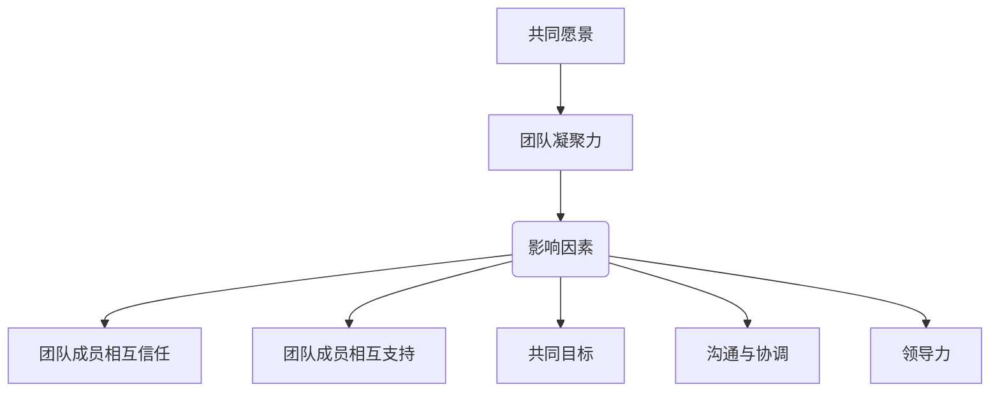
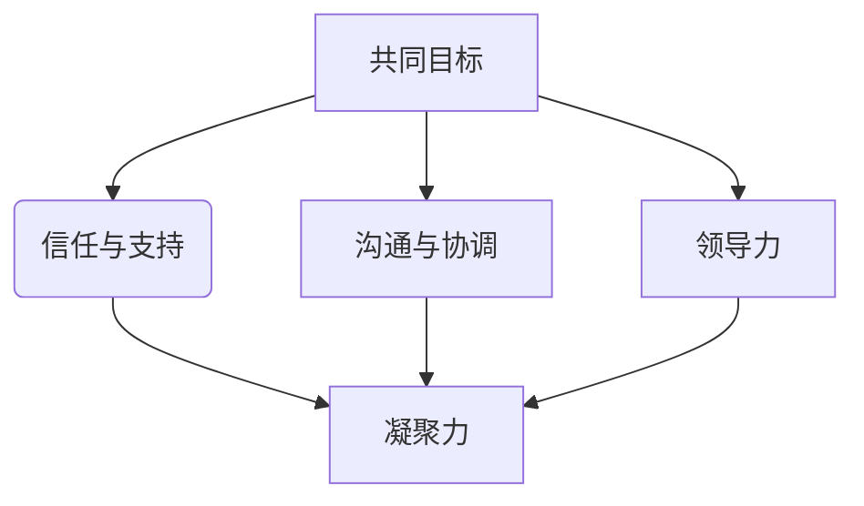

                 

### 概述

在现代企业中，团队凝聚力已成为衡量团队成功与否的关键因素。本文将探讨团队凝聚力及其与共同愿景之间的紧密关系，旨在提供一种系统化的方法来建立和加强团队凝聚力。通过深入分析团队凝聚力的定义、影响因素、建立策略，以及沟通、协调、领导力等关键要素，本文旨在帮助读者理解和掌握提升团队凝聚力的艺术。

#### 核心概念与联系

**团队凝聚力**，是指团队成员之间相互吸引、相互信任、相互支持的程度。它不仅关系到团队的内部和谐，还直接影响到团队的工作效率和创造力。团队凝聚力与其他概念，如团队协作、团队精神等密切相关，但各有侧重。团队协作强调的是团队成员共同完成任务的能力，而团队精神则更多地体现在团队成员之间的情感共鸣和互助意识上。团队凝聚力则是这两者的综合体现，是驱动团队高效运作的核心力量。

**共同愿景**，是团队成员共同追求的目标和期望。它不仅为团队提供了明确的方向，还激发了团队成员的积极性和创造力。共同愿景是团队凝聚力的基础，没有共同愿景，团队凝聚力将失去灵魂。共同愿景与团队凝聚力之间的关系可以看作是“愿景引导凝聚力，凝聚力实现愿景”的互动过程。共同愿景引导团队成员朝着共同的目标努力，而团队凝聚力则为这一愿景提供了坚实的基础。

#### Mermaid流程图：团队凝聚力的影响因素和形成过程

下面是一个简化的Mermaid流程图，展示了团队凝聚力的影响因素和形成过程：



**团队成员相互信任**：信任是团队凝聚力的基石，它减少了团队成员之间的冲突和误解，增强了合作意愿。

**团队成员相互支持**：支持体现在团队成员在工作和生活上的相互帮助，这种互助意识加强了团队凝聚力。

**共同目标**：明确的目标使团队成员朝着相同的方向努力，共同目标增强了团队成员之间的合作意愿。

**沟通与协调**：良好的沟通和协调机制有助于减少误解和冲突，增强团队成员之间的合作。

**领导力**：领导者在塑造团队文化和氛围中起着关键作用，领导力是提升团队凝聚力的重要手段。

**共同愿景**：共同愿景为团队提供了共同的目标和方向，是团队凝聚力的核心驱动力。

#### 核心算法原理讲解

为了更深入地理解团队凝聚力的形成过程，我们可以将其抽象为一个算法模型。以下是一个简化的伪代码，用于描述团队凝聚力的形成过程：

```plaintext
// 团队凝聚力形成过程
function buildTeamCohesion(teams, vision, communication, support, leadership) {
    // 初始化团队凝聚力
    cohesion = 0

    // 建立共同愿景
    visionStatus = establishVision(vision)
    cohesion += visionStatus

    // 增强团队成员信任和支持
    trustSupportStatus = enhanceTrustAndSupport(teams)
    cohesion += trustSupportStatus

    // 提高沟通与协调效率
    communicationStatus = improveCommunication(communication)
    cohesion += communicationStatus

    // 增强领导力
    leadershipStatus = enhanceLeadership(leadership)
    cohesion += leadershipStatus

    // 评估团队凝聚力
    cohesionStatus = assessCohesion(cohesion)
    return cohesionStatus
}
```

- **establishVision(vision)**: 建立共同愿景的过程。
- **enhanceTrustAndSupport(teams)**: 提高团队成员之间的信任和支持。
- **improveCommunication(communication)**: 提升沟通和协调效率。
- **enhanceLeadership(leadership)**: 增强领导力。
- **assessCohesion(cohesion)**: 评估团队凝聚力。

#### 数学模型和数学公式

为了量化团队凝聚力，我们可以引入一个简单的数学模型。假设团队凝聚力由以下四个主要因素决定：共同愿景（V）、信任与支持（T）、沟通与协调（C）以及领导力（L），则团队凝聚力（Cohesion）可以用以下公式表示：

$$
Cohesion = f(V, T, C, L)
$$

其中，f是一个非线性函数，用于综合这四个因素来评估团队凝聚力。具体公式可以表示为：

$$
Cohesion = \alpha V + \beta T + \gamma C + \delta L
$$

这里，α、β、γ和δ是加权系数，用于衡量各因素对团队凝聚力的相对重要性。通过调整这些系数，可以更准确地反映不同团队的具体情况。

#### 详细讲解

上述数学模型提供了一个基本的框架，用于量化团队凝聚力。然而，在实际应用中，还需要根据具体情况对这些系数进行调整。例如，对于注重创新的团队，可以增加共同愿景（V）的权重，而对于需要高效执行的团队，则可以增加沟通与协调（C）的权重。

此外，团队凝聚力的评估不仅仅依赖于公式计算，还需要结合实际数据和案例分析。例如，通过问卷调查、团队绩效评估等方式，收集团队成员对凝聚力各方面的主观评价，并将其纳入到公式中。

#### 举例说明

假设有一个团队，其共同愿景（V）的权重为0.4，信任与支持（T）的权重为0.3，沟通与协调（C）的权重为0.2，领导力（L）的权重为0.1。根据公式，团队凝聚力（Cohesion）的计算结果如下：

$$
Cohesion = 0.4 \times V + 0.3 \times T + 0.2 \times C + 0.1 \times L
$$

如果团队在共同愿景、信任与支持、沟通与协调和领导力方面的得分分别为80、70、60和90，则：

$$
Cohesion = 0.4 \times 80 + 0.3 \times 70 + 0.2 \times 60 + 0.1 \times 90 = 32 + 21 + 12 + 9 = 74
$$

因此，该团队的凝聚力得分为74分，属于较高的水平。通过这种方式，团队可以更好地了解自己的凝聚状态，并针对性地采取措施来提升团队凝聚力。

### 第1章 团队凝聚力概述

#### 1.1 团队凝聚力的定义

团队凝聚力（Team Cohesion）是指团队成员之间相互吸引、相互信任、相互支持的程度的总和。它是一种心理状态，反映了团队成员在情感和行动上的融合程度。团队凝聚力不仅仅体现在团队成员之间的紧密合作上，还体现在他们对团队目标和价值观的认同上。一个高凝聚力的团队通常能够更好地面对挑战，提高工作效率，创新能力和团队士气。

#### 1.2 团队凝聚力与其他相关概念的关联

**团队协作**和**团队精神**是与团队凝聚力密切相关的概念。**团队协作**（Team Collaboration）强调的是团队成员共同完成任务的能力，它关注的是团队成员如何通过合作来实现团队目标。而**团队精神**（Team Spirit）则更多地体现在团队成员之间的情感共鸣和互助意识上，它关注的是团队成员在情感上的相互支持。

**团队凝聚力**与**团队协作**和**团队精神**之间的关系可以看作是相互促进的。高团队凝聚力能够增强团队成员之间的协作意愿，提高协作效率；同时，有效的团队协作和团队精神也是提升团队凝聚力的关键因素。三者共同构成了一个良性循环，推动团队不断向前发展。

#### 1.3 团队凝聚力的影响因素和形成过程

团队凝聚力的影响因素多种多样，主要包括以下几个方面：

1. **共同目标**：明确的目标是团队凝聚力的基础。当团队成员共同追求一个明确的目标时，他们更容易在情感和行动上形成一致性。
2. **信任与支持**：信任是团队凝聚力的基石。团队成员之间的信任能够减少误解和冲突，增强合作意愿。同时，相互支持也能够增强团队的凝聚力。
3. **沟通与协调**：良好的沟通和协调机制有助于团队成员之间建立信任，减少误解，提高合作效率。
4. **领导力**：领导者在塑造团队文化和氛围中起着关键作用。有效的领导力能够激发团队成员的积极性和创造力，从而增强团队凝聚力。

团队凝聚力的形成过程是一个动态的、逐步积累的过程。首先，团队成员需要建立共同的目标和价值观，形成共识。在此基础上，通过有效的沟通和协调，建立信任关系，增强相互支持。同时，领导者的领导力也起着至关重要的作用，他们需要通过激励和引导，推动团队凝聚力的提升。

#### Mermaid流程图：团队凝聚力的影响因素和形成过程

下面是一个简化的Mermaid流程图，展示了团队凝聚力的影响因素和形成过程：



- **共同目标**：为团队提供明确的方向和动力，是团队凝聚力的基础。
- **信任与支持**：通过减少误解和冲突，增强合作意愿，是团队凝聚力的关键因素。
- **沟通与协调**：通过提高信息共享和协作效率，是团队凝聚力的重要保障。
- **领导力**：通过塑造团队文化和激励团队成员，是团队凝聚力的重要推动力。

### 1.1 团队凝聚力的定义

团队凝聚力（Team Cohesion）是一个多维度的概念，涉及团队成员之间的情感联系、相互信任、共同目标和协同工作等多个方面。简单来说，团队凝聚力指的是团队成员之间相互吸引、相互信任、相互支持的程度，这种程度的强弱直接影响到团队的整体表现和效能。

在技术领域，团队凝聚力的重要性尤为突出。一个高凝聚力的技术团队不仅能够在复杂的项目中保持高效的工作节奏，还能在面对挑战时迅速调整策略，共同克服困难。以下是团队凝聚力在技术领域的几个关键作用：

1. **协同开发**：在软件开发项目中，团队成员需要紧密协作，共同解决技术难题。高凝聚力能够促进团队成员之间的信息共享和知识传递，提高开发效率。
2. **问题解决**：面对技术挑战时，团队凝聚力能够增强成员之间的信任和依赖，使团队成员更愿意分享自己的想法和建议，从而快速找到解决方案。
3. **创新氛围**：一个高凝聚力的团队往往能够创造出开放和包容的创新氛围。团队成员在相互支持的环境中更容易提出创新的想法，从而推动技术进步。
4. **团队合作精神**：在技术团队中，团队成员往往需要承担不同的角色和任务。团队凝聚力能够增强成员之间的默契和合作精神，使团队工作更加顺畅。

具体来说，团队凝聚力可以从以下几个方面进行衡量：

1. **情感联系**：团队成员之间是否存在亲密的情感联系，是否愿意分享个人感受和经历。
2. **信任水平**：团队成员是否相互信任，是否相信对方会履行承诺，是否会因信任而减少误解和冲突。
3. **共同目标**：团队成员是否拥有共同的目标和愿景，是否为共同的目标而努力。
4. **沟通质量**：团队成员之间的沟通是否顺畅，是否能够有效传达信息和解决问题。
5. **协作意愿**：团队成员是否愿意在项目中相互支持和帮助，是否能够在团队中发挥各自的优势。

通过这些维度的综合评估，可以更好地理解团队凝聚力的现状，并采取相应的措施来提升团队凝聚力。例如，通过定期的团队建设活动、提高沟通技巧和增强信任机制，都可以有效地提升团队的凝聚力。

#### Mermaid流程图：团队凝聚力的影响因素和形成过程

为了更好地理解团队凝聚力的影响因素和形成过程，我们可以借助Mermaid流程图来展示它们之间的关系。以下是一个简化的Mermaid流程图：


- **共同目标**：明确的目标和愿景为团队提供了方向和动力，是团队凝聚力的起点。
- **信任与支持**：信任是团队凝聚力的重要基石，通过减少误解和冲突，增强合作意愿。
- **沟通与协调**：良好的沟通和协调机制有助于团队成员之间建立信任，减少误解，提高合作效率。
- **领导力**：领导者在塑造团队文化和激励团队成员方面起着关键作用，推动团队凝聚力的提升。

通过这个流程图，我们可以清晰地看到团队凝聚力是如何通过共同目标、信任与支持、沟通与协调和领导力这四个关键因素相互作用和形成的。

### 第2章 共同愿景的概念与重要性

#### 2.1 共同愿景的定义

共同愿景（Shared Vision）是指团队成员共同拥有的目标和期望，它不仅是团队前进的方向标，也是凝聚团队成员的核心力量。共同愿景超越了个人利益，强调团队的整体目标和长远发展。它不仅为团队成员提供了明确的工作目标和方向，还激发了团队成员的内在动机和积极性。

共同愿景的定义可以进一步细化为以下几个关键要素：

1. **明确性**：共同愿景需要清晰、具体，使团队成员能够清楚地了解团队的目标和使命。
2. **一致性**：共同愿景应得到所有团队成员的一致认可，减少个人差异和分歧。
3. **激励性**：共同愿景应具备激励性，能够激发团队成员的内在动机，推动他们为实现目标而努力。
4. **可达成性**：共同愿景应具备可实现性，即团队成员通过努力能够实现的目标。

#### 2.2 共同愿景对团队凝聚力的重要性

共同愿景对团队凝聚力具有至关重要的作用，它不仅是团队凝聚力的基础，也是团队持续发展的重要推动力。以下是共同愿景对团队凝聚力的重要性体现：

1. **方向指引**：共同愿景为团队提供了明确的方向，使团队成员能够明确自己的工作目标和责任，减少迷茫和不确定性。
2. **情感共鸣**：共同愿景能够激发团队成员的情感共鸣，使他们在追求共同目标的过程中产生强烈的归属感和认同感，增强团队的凝聚力。
3. **团队协作**：共同愿景促进了团队成员之间的协作和合作，使他们在实现目标的过程中能够相互支持、相互依赖，形成紧密的团队关系。
4. **目标一致性**：共同愿景确保了团队成员的目标一致，减少了个人的利益冲突，增强了团队的统一性和协调性。

#### 2.3 共同愿景的形成和作用机制

共同愿景的形成是一个动态的过程，涉及多个阶段和关键因素。以下是共同愿景的形成和作用机制：

1. **初始共识**：团队领导者需要通过沟通和讨论，引导团队成员就共同愿景进行初步讨论，形成初步共识。
2. **目标细化**：在初步共识的基础上，团队需要进一步细化愿景，明确目标的具体内容和实现路径，使愿景更加具体和可操作。
3. **全员参与**：共同愿景的形成需要全员参与，通过团队会议、讨论和反馈，使所有成员对愿景有深刻的理解和认同。
4. **持续更新**：共同愿景不是一成不变的，需要根据团队的发展和外部环境的变化进行持续更新和调整，以保持其激励性和可实现性。

共同愿景的作用机制主要体现在以下几个方面：

1. **激发动力**：共同愿景能够激发团队成员的内在动力，使他们更愿意为团队的目标而努力。
2. **引导行为**：共同愿景为团队成员提供了明确的行为指南，使他们在实现目标的过程中能够保持一致性和协同性。
3. **增强凝聚力**：共同愿景能够增强团队成员之间的情感联系和合作意愿，提高团队的凝聚力。
4. **促进创新**：共同愿景激发了团队成员的创新思维和创造力，使团队能够应对各种挑战和变化。

通过上述机制，共同愿景不仅能够为团队提供方向和动力，还能够增强团队的凝聚力和协作能力，推动团队持续发展和成长。

### 第3章 建立共同愿景的策略与方法

#### 3.1 制定共同愿景的方法

建立共同愿景是一个系统化的过程，需要明确的目标、详细的规划以及全员参与。以下是制定共同愿景的一些关键方法：

1. **目标明确化**：首先，团队需要明确共同愿景的具体目标和期望。这可以通过团队会议、头脑风暴等方式进行。明确的目标有助于团队成员理解和接受共同愿景。
   
2. **价值共识**：在明确目标的基础上，团队需要就核心价值观进行讨论和共识。核心价值观是团队愿景的灵魂，是团队成员共同追求的目标和信念。

3. **策略规划**：制定详细的策略和行动计划，确保共同愿景能够落地实施。策略规划需要明确实现愿景的步骤、时间表和资源需求。

4. **全员参与**：共同愿景的制定需要全员参与，通过定期的团队会议、讨论和反馈，确保每个成员都对愿景有深刻的理解和认同。

5. **持续更新**：共同愿景不是一成不变的，需要根据团队的发展和外部环境的变化进行持续更新和调整。

#### 3.2 共同愿景制定的关键步骤

以下是制定共同愿景的关键步骤：

1. **愿景陈述**：首先，团队需要制定一个愿景陈述，明确团队的未来目标和期望。愿景陈述应该简洁、清晰，能够激发团队成员的共鸣。

2. **目标设定**：在愿景陈述的基础上，团队需要设定具体的目标，这些目标应该具有可实现性和激励性。目标应包括短期和长期目标，以适应不同阶段的需求。

3. **策略制定**：制定实现目标的策略和行动计划。策略应涵盖资源分配、任务分工、时间表和关键绩效指标（KPI）。

4. **共识达成**：通过团队会议、讨论和反馈，确保团队成员对愿景和目标的认同和接受。共识的达成是共同愿景成功的关键。

5. **执行监控**：在愿景和目标确定后，团队需要建立监控和评估机制，确保计划的有效执行。定期评估和调整是确保共同愿景持续有效的关键。

#### 3.3 制定共同愿景的算法步骤

为了更加系统化和可操作，我们可以将制定共同愿景的过程抽象为一个算法模型。以下是制定共同愿景的伪代码：

```plaintext
// 制定共同愿景算法
function establishSharedVision(teamMembers, externalEnvironment) {
    // 初始化愿景变量
    vision = {}

    // 第一步：愿景陈述
    vision.statement = defineVisionStatement()

    // 第二步：目标设定
    vision.shortTermGoals = setShortTermGoals()
    vision.longTermGoals = setLongTermGoals()

    // 第三步：策略制定
    vision strategies = defineStrategies()

    // 第四步：共识达成
    consensus = achieveConsensus(teamMembers, vision)

    // 第五步：执行监控
    monitoringSystem = setupMonitoringSystem(vision, strategies)

    // 返回共同愿景
    return vision
}

// 愿景陈述
function defineVisionStatement() {
    // 通过团队会议、头脑风暴等方式，形成愿景陈述
    return "我们的愿景是成为行业的领导者，提供卓越的技术解决方案。"
}

// 目标设定
function setShortTermGoals() {
    // 设定短期目标，如：提高产品市场份额、改进技术方案等
    return ["提高产品市场份额10%","改进技术方案，缩短开发周期20%"]
}

function setLongTermGoals() {
    // 设定长期目标，如：成为行业领导者、实现全球业务拓展等
    return ["成为行业领导者","实现全球业务拓展"]
}

// 策略制定
function defineStrategies() {
    // 制定实现目标的策略和行动计划
    strategies = {
        "increaseMarketShare": {
            "action": "加强市场调研，优化产品功能",
            "timeFrame": "3个月内完成"
        },
        "improveTechnicalSolutions": {
            "action": "引进新技术，提升开发效率",
            "timeFrame": "6个月内完成"
        }
    }
    return strategies
}

// 共识达成
function achieveConsensus(teamMembers, vision) {
    // 通过团队会议、讨论和反馈，确保团队成员对愿景和目标的认同
    return true
}

// 执行监控
function setupMonitoringSystem(vision, strategies) {
    // 建立监控和评估机制，确保计划的有效执行
    monitoringSystem = {
        "evaluationSchedule": "每月进行一次绩效评估",
        "adjustmentStrategy": "根据评估结果进行调整"
    }
    return monitoringSystem
}
```

在这个算法中，`defineVisionStatement`、`setShortTermGoals`、`setLongTermGoals`、`defineStrategies`和`achieveConsensus`是关键的函数，分别负责愿景的陈述、目标的设定、策略的制定、共识的达成和执行监控。通过这个算法，团队可以系统化地制定共同愿景，确保愿景的清晰、可操作和实现。

### 第4章 沟通与协调

#### 4.1 沟通在建立共同愿景中的关键作用

沟通是建立共同愿景的核心要素之一，它不仅在团队成员之间传递信息和知识，还在塑造团队文化和氛围中起着关键作用。以下是沟通在建立共同愿景中的几个关键作用：

1. **信息传递**：有效的沟通能够确保团队成员了解共同愿景的具体内容和目标，减少误解和不确定性。团队成员需要通过沟通了解团队的期望、目标和行动计划，从而形成共识。

2. **团队协作**：沟通促进了团队成员之间的协作和合作。通过沟通，团队成员能够分享自己的想法、建议和资源，共同解决问题，提高工作效率。

3. **冲突解决**：沟通有助于团队成员在面对冲突时找到共同点，通过讨论和协商解决分歧。良好的沟通机制能够减少误解和冲突，增强团队的凝聚力和稳定性。

4. **情感连接**：沟通不仅仅是信息的交流，更是情感的传递。通过沟通，团队成员能够建立信任和友谊，增强对团队的归属感和认同感。

5. **持续更新**：共同愿景不是一成不变的，它需要根据团队的发展和外部环境的变化进行持续更新。沟通是实现这一目标的关键，通过定期的沟通，团队成员能够及时了解和适应新的愿景和目标。

#### 4.2 协调与沟通的关系

协调与沟通密切相关，它们共同构成了团队运作的两大支柱。以下是协调与沟通之间的几个关键关系：

1. **互动性**：协调和沟通是相互依存的，良好的沟通能够促进协调，而有效的协调也能够增强沟通。团队成员需要通过沟通来协调各自的行动和资源，实现共同的目标。

2. **互补性**：沟通侧重于信息的传递和交流，而协调则侧重于资源的分配和任务的分工。两者相辅相成，共同推动团队的运作。

3. **依赖性**：协调和沟通相互依赖，协调需要沟通来传递信息和安排任务，而沟通则需要协调来确保信息的传递和反馈。

4. **反馈循环**：良好的沟通和协调形成了一个反馈循环，通过不断地沟通和协调，团队成员能够及时调整和优化团队的运作。

#### 4.3 有效沟通与协调的策略

为了提升团队的沟通和协调效率，以下是一些实用的策略：

1. **明确目标**：确保所有团队成员都明确共同愿景和目标，减少误解和混淆。明确的目标是有效沟通和协调的基础。

2. **建立沟通渠道**：建立多种沟通渠道，如定期会议、即时通讯工具和邮件等，确保团队成员能够随时进行有效的沟通。

3. **促进开放式沟通**：鼓励团队成员自由表达意见和想法，创造一个开放和包容的沟通环境。这有助于减少误解和冲突，增强团队凝聚力。

4. **明确角色和职责**：确保团队成员明确自己的角色和职责，减少因职责不清导致的冲突和协调困难。

5. **定期回顾和反馈**：定期进行团队回顾和反馈，评估沟通和协调的效果，及时调整和优化。

6. **建立信任**：建立团队成员之间的信任，通过透明的沟通和协作，减少猜疑和隔阂。

7. **培养协作文化**：通过团队建设活动和协作项目，培养团队成员的协作意识和团队精神。

通过这些策略，团队可以有效地提升沟通和协调效率，确保共同愿景的顺利实现。

### 第5章 领导力与影响力

#### 5.1 领导者在建立共同愿景中的作用

领导者在建立共同愿景中扮演着至关重要的角色。他们的作用不仅仅在于提出愿景，更在于确保团队成员理解和接受这一愿景，并为之努力。以下是领导者在这个过程中的几个关键作用：

1. **愿景倡导者**：领导者需要首先成为共同愿景的倡导者，通过自己的行为和言论，使团队成员对愿景产生认同感和信心。他们需要清晰地传达愿景的意义和价值，使团队成员认识到共同愿景对团队和个人发展的重要性。

2. **沟通桥梁**：领导者需要成为沟通的桥梁，确保愿景和目标能够准确、清晰地传达给所有团队成员。他们需要通过多种渠道，如会议、报告和一对一交流，与团队成员进行有效的沟通，确保每个人都对愿景有深刻的理解。

3. **激励者**：领导者需要激励团队成员，使他们充满热情地参与到共同愿景的实现过程中。他们可以通过奖励、认可和激励措施，激发团队成员的积极性和创造力，确保团队始终保持高昂的士气。

4. **协调者**：在建立共同愿景的过程中，领导者还需要扮演协调者的角色，确保团队成员之间的协作和合作。他们需要解决团队成员之间的冲突和分歧，推动团队团结一致地朝着愿景前进。

5. **文化塑造者**：领导者需要通过自己的行为和决策，塑造和维持团队的文化。一个积极、开放和包容的团队文化能够增强团队成员的归属感和认同感，有助于共同愿景的实现。

#### 5.2 如何发挥领导力来推动团队凝聚力的提升

领导力在推动团队凝聚力的提升中起着关键作用。以下是几个有效的策略，帮助领导者发挥领导力，提升团队凝聚力：

1. **建立信任**：信任是团队凝聚力的基石。领导者需要通过透明、公正的领导方式，建立团队成员之间的信任。他们需要真诚地对待团队成员，尊重他们的意见和贡献，减少误解和冲突。

2. **激发内在动机**：领导者需要激发团队成员的内在动机，使他们为实现共同愿景而努力。他们可以通过设定具有挑战性的目标和提供支持和资源，激发团队成员的自我驱动和创造力。

3. **培养团队精神**：领导者需要通过团队建设活动和共同的任务，培养团队精神。他们可以组织团队活动，如团队建设工作坊、团队拓展训练等，增强团队成员之间的合作和信任。

4. **提供反馈和认可**：领导者需要定期提供反馈和认可，帮助团队成员了解自己的表现，并提供改进的建议。他们可以通过公开表扬、奖励等方式，激励团队成员保持积极性和动力。

5. **促进开放沟通**：领导者需要鼓励团队成员之间的开放沟通，创造一个包容、开放和尊重的氛围。他们可以通过定期会议、开放式讨论和反馈机制，确保团队成员能够自由地表达意见和想法。

6. **塑造积极文化**：领导者需要通过自己的行为和决策，塑造一个积极、开放和包容的团队文化。他们需要以身作则，树立榜样，确保团队成员能够在这样的文化氛围中茁壮成长。

通过这些策略，领导者可以有效地发挥领导力，推动团队凝聚力的提升，确保团队在实现共同愿景的过程中保持团结和高效。

#### 5.3 领导力提升的方法

为了提升领导力，领导者可以采取以下几种方法：

1. **持续学习**：领导者需要不断学习新的管理知识和技能，通过阅读、参加培训课程和研讨会等方式，提升自己的管理能力。学习新的领导理论和方法，有助于领导者更好地应对复杂的工作环境。

2. **反思与自我提升**：领导者需要定期反思自己的领导行为和决策，找出不足之处，并制定改进计划。通过自我提升，领导者可以不断完善自己的领导技能和风格。

3. **建立积极团队文化**：领导者需要通过自己的行为和决策，塑造一个积极、开放和包容的团队文化。他们可以鼓励团队成员之间的沟通和合作，建立信任和尊重，提升团队的凝聚力和工作效率。

4. **培养下属**：领导者需要培养下属的领导能力和潜力，通过提供培训和指导，帮助他们成长为未来的领导者。培养下属不仅有助于提升团队的整体实力，也能增强团队成员的忠诚度和归属感。

5. **有效沟通**：领导者需要具备良好的沟通能力，能够清晰、准确地传达愿景和目标，激励团队成员。他们需要通过多种沟通方式，如会议、邮件、一对一交流等，确保信息传递的有效性和及时性。

6. **建立反馈机制**：领导者需要建立有效的反馈机制，通过定期的绩效评估和团队反馈，帮助团队成员了解自己的表现，并提供改进的建议。反馈机制有助于领导者及时了解团队的情况，调整管理策略。

通过这些方法，领导者可以不断提升自己的领导力，推动团队凝聚力的提升，确保团队在实现共同愿景的过程中保持高效和团结。

### 第6章 团队凝聚力的评估与优化

#### 6.1 团队凝聚力评估的数学模型

为了科学、系统地评估团队凝聚力，我们可以采用数学模型来量化团队凝聚力的各项指标。以下是一个简化的数学模型，用于评估团队凝聚力：

$$
Cohesion = f(T, C, L, M)
$$

其中，Cohesion 表示团队凝聚力，T 表示信任水平，C 表示沟通效率，L 表示领导力，M 表示团队成员的参与度。f 是一个综合评价函数，用于计算团队凝聚力的得分。

具体公式可以表示为：

$$
Cohesion = \alpha T + \beta C + \gamma L + \delta M
$$

其中，α、β、γ和δ是加权系数，用于衡量各因素对团队凝聚力的相对重要性。这些系数可以根据实际情况进行调整，以反映不同团队的特点。

#### 6.2 如何通过数据来评估团队凝聚力

评估团队凝聚力需要收集和分析多种数据，以下是一些常用的方法和步骤：

1. **问卷调查**：通过问卷调查可以收集团队成员对团队凝聚力的主观评价。问卷应涵盖信任水平、沟通效率、领导力和参与度等多个方面。以下是一个简化的问卷示例：

   - **信任水平**：
     - 您觉得团队成员之间是否容易相互信任？
     - 您是否相信团队成员会履行他们的承诺？
   
   - **沟通效率**：
     - 团队内部沟通是否顺畅？
     - 您是否觉得信息在团队内部能够及时传达？

   - **领导力**：
     - 您的领导是否能够激发团队成员的积极性？
     - 您的领导是否能够有效地解决团队中的问题？

   - **参与度**：
     - 您是否觉得在团队中能够充分表达自己的意见？
     - 您是否觉得团队的目标和愿景与您的个人目标相一致？

2. **绩效数据**：通过分析团队的绩效数据，可以评估团队的工作效率和成果。以下是一些关键的绩效指标：

   - **项目完成时间**：团队完成项目所需的时间。
   - **项目质量**：项目交付的质量和客户满意度。
   - **问题解决效率**：团队解决技术问题或困难的速度和效果。

3. **行为观察**：通过观察团队成员的行为和互动，可以评估团队凝聚力的实际表现。以下是一些观察指标：

   - **合作行为**：团队成员是否经常合作解决共同的问题？
   - **团队互动**：团队成员之间的互动频率和方式。
   - **参与热情**：团队成员对团队活动和项目的参与程度。

#### 公式与详细讲解

为了更好地理解上述数学模型，我们可以通过具体的例子来详细讲解。假设我们有一个四人的团队，其信任水平、沟通效率、领导力和参与度分别得分如下：

- 信任水平（T）：8分
- 沟通效率（C）：7分
- 领导力（L）：9分
- 参与度（M）：6分

根据公式：

$$
Cohesion = \alpha T + \beta C + \gamma L + \delta M
$$

我们假设各因素的权重如下：

- 信任水平（T）：α = 0.3
- 沟通效率（C）：β = 0.2
- 领导力（L）：γ = 0.3
- 参与度（M）：δ = 0.2

则团队凝聚力的计算结果为：

$$
Cohesion = 0.3 \times 8 + 0.2 \times 7 + 0.3 \times 9 + 0.2 \times 6 = 2.4 + 1.4 + 2.7 + 1.2 = 7.7
$$

因此，该团队的凝聚力得分为7.7分，属于较高的水平。通过这种方式，团队可以更好地了解自己的凝聚状态，并针对性地采取措施来提升团队凝聚力。

#### 举例说明

为了更好地理解上述评估方法，我们可以通过一个实际案例来说明团队凝聚力的评估过程。

假设我们有一个软件开发团队，团队成员对团队凝聚力的评价如下：

1. **信任水平**：
   - 成员A：8分
   - 成员B：7分
   - 成员C：8分
   - 成员D：9分
   平均分：8分

2. **沟通效率**：
   - 成员A：7分
   - 成员B：6分
   - 成员C：7分
   - 成员D：8分
   平均分：7分

3. **领导力**：
   - 成员A：9分
   - 成员B：8分
   - 成员C：8分
   - 成员D：9分
   平均分：9分

4. **参与度**：
   - 成员A：6分
   - 成员B：7分
   - 成员C：6分
   - 成员D：7分
   平均分：6.5分

根据上述评估公式，我们可以计算团队凝聚力：

$$
Cohesion = 0.3 \times 8 + 0.2 \times 7 + 0.3 \times 9 + 0.2 \times 6.5 = 2.4 + 1.4 + 2.7 + 1.3 = 7.8
$$

因此，该团队的凝聚力得分为7.8分，属于较高的水平。

通过这个案例，我们可以看到，团队凝聚力评估不仅仅依赖于平均分，还需要结合具体的评价内容和权重。这种方式可以帮助团队更全面地了解自己的凝聚力状况，并针对性地进行优化。

### 第7章 案例分析：成功与失败

#### 7.1 团队凝聚力成功的案例

**案例一：Google的团队文化**

Google以其独特的团队文化和高度凝聚力而闻名。Google成功的关键之一是其“20%时间项目”政策，允许员工用20%的工作时间自由探索和创新。这种政策不仅激发了员工的创造力，还增强了团队之间的协作和信任。以下是Google团队凝聚力成功的几个关键因素：

1. **共同愿景**：Google的愿景是“组织全球的信息，让所有人都能访问并从中受益”。这一愿景不仅清晰，而且具有强烈的激励性，使团队成员为之努力。

2. **领导力**：Google的领导层鼓励创新和开放沟通，通过定期的团队会议和反馈机制，确保团队成员之间的信息共享和协作。

3. **信任与支持**：Google营造了一个开放和包容的工作环境，使团队成员能够自由地表达意见和想法，减少误解和冲突。

4. **沟通与协调**：Google建立了多种沟通渠道，如内部邮件、即时通讯工具和团队会议，确保信息能够及时传达和反馈。

**案例二：Netflix的绩效管理体系**

Netflix以其灵活的绩效管理体系和强大的团队凝聚力而著称。Netflix的绩效管理体系包括定期评估和反馈，以及开放和坦诚的沟通。以下是Netflix团队凝聚力成功的几个关键因素：

1. **共同目标**：Netflix的团队目标与其公司愿景紧密相连，即提供高质量的娱乐内容。团队成员清楚地了解自己的工作目标，并为共同的目标而努力。

2. **领导力**：Netflix的领导层通过明确的绩效目标和反馈机制，激发团队成员的积极性和创造力。领导层不仅关注团队成员的工作成果，还关注他们的个人成长和发展。

3. **信任与支持**：Netflix鼓励团队成员之间的信任和相互支持，通过定期的团队建设活动和开放的沟通渠道，增强团队成员之间的情感联系。

4. **沟通与协调**：Netflix建立了多种沟通渠道，如团队会议、电子邮件和即时通讯工具，确保团队成员之间的信息共享和协作。

#### 7.2 团队凝聚力失败的案例

**案例一：Uber的领导层问题**

Uber在团队凝聚力方面曾遭遇重大挫折，主要原因是其领导层的问题。以下是Uber团队凝聚力失败的几个关键因素：

1. **领导力**：Uber的创始人特拉维斯·卡拉尼克（Travis Kalanick）在领导风格上存在明显缺陷，如专制和缺乏同理心。这导致了团队成员之间的信任和合作减少。

2. **沟通与协调**：Uber的领导层在沟通方面存在严重问题，导致信息传达不畅，团队成员之间的误解和冲突增加。

3. **信任与支持**：Uber的领导层在处理团队成员关系时存在明显不足，如不公正的待遇和缺乏关心，这进一步削弱了团队的凝聚力。

4. **共同愿景**：Uber的愿景和目标不够清晰，导致团队成员在方向上存在分歧，缺乏共同的奋斗目标。

**案例二：Facebook的数据泄露事件**

Facebook在2018年遭遇了一次严重的用户数据泄露事件，这对其团队凝聚力产生了负面影响。以下是Facebook团队凝聚力失败的几个关键因素：

1. **领导力**：Facebook的领导层在处理数据泄露事件时反应迟缓，缺乏有效的危机管理能力，这削弱了团队的信任和合作。

2. **沟通与协调**：Facebook在内部沟通方面存在缺陷，导致团队成员在应对数据泄露事件时缺乏协调，难以形成统一的行动。

3. **信任与支持**：数据泄露事件暴露了Facebook在用户隐私保护方面的不足，这削弱了用户对公司的信任，也影响了团队成员之间的信任。

4. **共同愿景**：Facebook在事件发生前，其愿景和目标不够明确，导致团队成员在应对挑战时缺乏一致的行动方向。

#### 7.3 代码实际案例和详细讲解剖析

为了更深入地理解团队凝聚力在技术项目中的应用，我们可以通过一个具体的代码实现案例来分析。

**项目背景**：一个软件开发团队负责开发一个在线教育平台。团队成员需要紧密协作，确保平台的功能和质量。

**代码实现**：

```python
# 共同愿景：开发一个高质量、用户体验良好的在线教育平台
class OnlineEducationPlatform:
    def __init__(self):
        self.courses = []
        self.users = []

    def add_course(self, course):
        self.courses.append(course)

    def add_user(self, user):
        self.users.append(user)

    def enroll_user_in_course(self, user, course):
        if course in self.courses and user in self.users:
            user.enroll_in_course(course)
            course.add_student(user)
            print(f"{user.name} has been enrolled in {course.name}.")

# 课程类
class Course:
    def __init__(self, name, instructor):
        self.name = name
        self.instructor = instructor
        self.students = []

    def add_student(self, student):
        self.students.append(student)

    def remove_student(self, student):
        self.students.remove(student)

# 用户类
class User:
    def __init__(self, name):
        self.name = name
        self.enrolled_courses = []

    def enroll_in_course(self, course):
        self.enrolled_courses.append(course)

    def drop_course(self, course):
        self.enrolled_courses.remove(course)
```

**详细讲解**：

1. **共同愿景的实现**：通过定义`OnlineEducationPlatform`类，我们为团队提供了一个共同的愿景——开发一个能够管理课程和用户的在线教育平台。这个类包含了添加课程、用户以及用户报名课程的函数，确保了团队成员在实现共同愿景的过程中有明确的指导。

2. **课程和用户的定义**：`Course`和`User`类分别代表课程和用户。这些类定义了如何添加和删除学生，如何报名和退课，为团队成员提供了具体的操作接口。

3. **代码解析**：通过具体的类和方法，我们可以看到团队成员如何通过代码实现共同愿景。每个类都有明确的职责，`OnlineEducationPlatform`负责整体管理，`Course`负责课程管理，`User`负责用户管理。这种清晰的职责划分有助于团队成员之间的协作。

4. **代码应用解读与分析**：在实际开发过程中，团队成员可以通过这个代码框架进行功能扩展和优化。例如，可以添加新的功能如课程评价、用户反馈等，或者对现有功能进行改进，如优化报名流程、增加用户权限管理。

**项目小结**：

通过这个案例，我们可以看到团队凝聚力在技术项目中的具体应用。共同愿景不仅为团队提供了方向，还通过清晰的职责划分和协作机制，提高了团队的工作效率和代码质量。成功的关键在于团队成员之间的信任、良好的沟通和有效的领导力，这些因素共同促进了项目的顺利完成。

### 最佳实践 Tips

为了在团队中建立和保持高凝聚力的共同愿景，以下是一些实用的最佳实践建议：

1. **明确共同愿景**：确保团队的所有成员都清楚共同愿景的内容和意义，可以通过定期的团队会议和讨论来传达和强化这一愿景。

2. **建立信任**：通过开放和透明的沟通方式，建立团队成员之间的信任。领导者需要以身作则，展示对团队成员的信任，以促进团队内部的相互信任。

3. **定期反馈**：定期进行绩效评估和团队反馈，帮助团队成员了解自己的表现，及时调整和优化。

4. **鼓励合作**：通过团队项目和协作活动，鼓励团队成员之间的合作和互动，增强团队的凝聚力。

5. **培训与发展**：为团队成员提供培训和职业发展机会，提高他们的技能和知识，增强他们对团队的归属感和认同感。

6. **领导者的角色**：领导者需要发挥关键作用，通过激励和引导，推动团队凝聚力的提升。

7. **持续优化**：团队凝聚力不是一成不变的，需要根据团队的发展和外部环境的变化进行持续优化和调整。

通过这些最佳实践，团队可以更有效地建立和保持高凝聚力的共同愿景，推动团队持续发展和成功。

### 小结

本文通过详细探讨团队凝聚力及其与共同愿景之间的关系，为读者提供了一个系统化的理解框架。团队凝聚力不仅是团队高效运作的核心，也是实现共同愿景的重要保障。通过明确共同愿景、建立信任、优化沟通、发挥领导力以及持续评估和优化，团队可以更有效地提升凝聚力，实现共同目标。

### 注意事项

在建立和维护团队凝聚力时，以下注意事项至关重要：

1. **明确目标和愿景**：确保团队成员对共同目标和愿景有清晰的理解和认同。
2. **建立信任**：通过开放和透明的沟通方式，建立团队成员之间的信任。
3. **持续沟通**：定期进行团队沟通和反馈，确保团队成员之间的信息传递和协作。
4. **个性化激励**：针对不同成员的特点和需求，提供个性化的激励和认可。
5. **灵活调整**：根据团队的发展和外部环境变化，灵活调整团队策略和目标。

通过遵循这些注意事项，团队可以更好地建立和保持高凝聚力，推动团队的长期成功。

### 拓展阅读

为了深入理解和实践团队凝聚力与共同愿景，以下几本书籍提供了丰富的知识和实用技巧：

1. **《团队的五项修炼》**（The Five Dysfunctions of a Team）作者：帕特里克·莱西奥尼（Patrick Lencioni）。这本书详细分析了团队常见的五大障碍，并提供了解决方案，帮助团队建立高凝聚力。

2. **《团队协作工具与方法》**（Team Collaboration Tools and Methods）作者：托马斯·哈克勒（Thomas Hülsbäumer）。这本书介绍了多种团队协作工具和方法，帮助团队提高沟通效率和协作能力。

3. **《团队领导力》**（The Team Leader’s Handbook）作者：约翰·P·科特（John P. Kotter）和丽贝卡·莫尔斯（Rebecca Morgan）。这本书为团队领导者提供了全面的领导力和管理技巧，帮助团队实现共同愿景。

4. **《共同愿景》**（The Power of a Shared Vision）作者：斯蒂芬·R·柯维（Stephen R. Covey）。这本书探讨了共同愿景的重要性，并提供了实用的方法，帮助团队建立和维持共同愿景。

通过阅读这些书籍，读者可以深入了解团队凝聚力和共同愿景的理论和实践，为自己的团队提供有力的指导。

