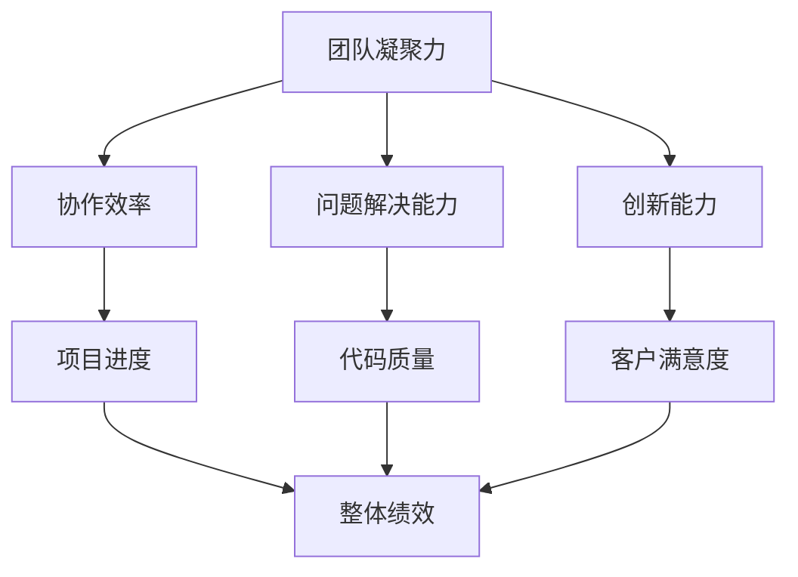
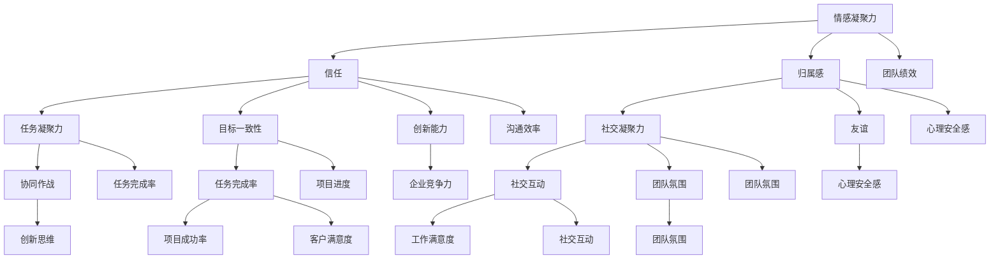
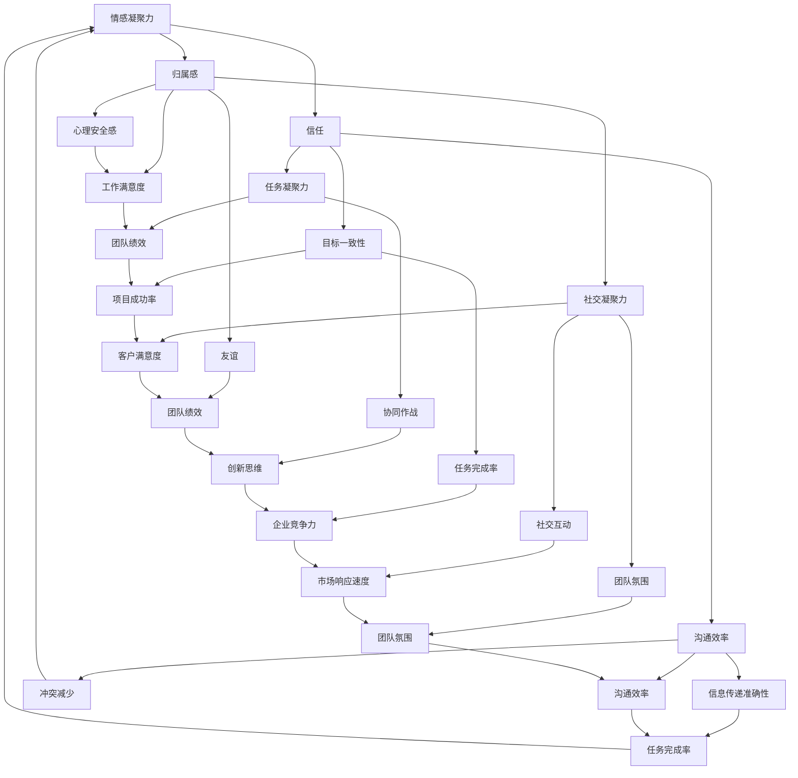

                 

### 文章标题

# 团队凝聚力：建立强大的集体意识

## 关键词

- 团队凝聚力
- 集体意识
- 组织文化
- 沟通
- 信任
- 绩效提升

## 摘要

本文旨在深入探讨团队凝聚力的重要性，以及如何通过建立强大的集体意识来提升团队的协作效能和整体绩效。我们将从多个维度分析团队凝聚力的核心概念，探讨其与组织文化、沟通和信任之间的关系。同时，本文还将提供一系列实践策略和最佳实践，帮助读者在实际工作中有效提升团队凝聚力。通过理论讲解、实例分析和数学模型的解析，本文希望能够为IT领域的团队管理者提供有价值的指导，助力他们打造一支高效、和谐且充满活力的团队。

## 引言

在当今高速发展的信息技术领域，团队凝聚力已成为决定组织成败的关键因素之一。无论是在软件开发、数据分析，还是网络安全等众多领域，团队凝聚力都直接影响着项目的进度、质量和创新力。强大的团队凝聚力不仅能够提高团队成员之间的协作效率，还能增强集体的创新意识和解决问题的能力。然而，如何建立和维持这种凝聚力，却是一个复杂且充满挑战的任务。

本文将带领读者逐步探索团队凝聚力的核心概念，深入理解其与组织文化、沟通和信任之间的关系。我们将通过理论讲解、实例分析和数学模型的解析，提供一系列实践策略和最佳实践。文章结构如下：

1. **团队凝聚力概述**：介绍团队凝聚力的定义及其重要性。
2. **核心概念与联系**：详细阐述团队凝聚力的构成要素，并通过Mermaid流程图展示其关系架构。
3. **理论基础**：探讨团队凝聚力心理学和组织文化对其的影响。
4. **实践应用**：提供提升团队凝聚力的策略和方法。
5. **案例研究**：分析成功团队凝聚力建设的案例和挑战。
6. **总结与展望**：总结团队凝聚力建设的关键要素，展望未来发展趋势。

通过这篇文章，我们希望能够为IT领域的团队管理者提供有价值的指导，帮助他们在实际工作中有效提升团队凝聚力，从而实现组织的长期成功。

## 第一部分：团队凝聚力概述

### 1.1 团队凝聚力的定义

团队凝聚力是一个多维度的概念，它通常被定义为团队成员之间相互吸引、相互依赖的程度。根据Baumgartner（2012）的研究，团队凝聚力包括情感凝聚力、任务凝聚力和社交凝聚力三个方面。情感凝聚力指的是团队成员之间的情感联系和亲密感；任务凝聚力指的是团队成员对共同目标的认同和协作意愿；社交凝聚力则是指团队成员在社交活动中的互动和团结。

在信息技术领域，团队凝聚力的重要性尤为突出。软件开发项目往往需要团队成员具备高度的专业技能和协同作战的能力。一个凝聚力强的团队可以更好地应对复杂的项目需求，提高开发效率和代码质量。此外，团队凝聚力还有助于培养创新思维和解决技术难题，从而推动组织的持续发展。

### 1.2 团队凝聚力的重要性

首先，团队凝聚力直接影响团队的整体绩效。根据Luhmann（1979）的研究，高凝聚力的团队往往能够更有效地分配任务、解决冲突，并且成员之间的信任和协作更为顺畅。这些因素共同促进了团队的绩效提升。

其次，团队凝聚力有助于增强团队成员的工作满意度和忠诚度。当团队成员感受到团队的归属感和认同感时，他们更有可能对自己的工作和团队的未来感到满意。这种积极的情感体验不仅提高了工作效率，还减少了员工流失率，为组织节省了招聘和培训成本。

最后，团队凝聚力对组织的创新力也具有重要影响。一个凝聚力强的团队更容易产生创新思维和解决方案，因为他们能够在面对挑战时互相支持、共同探讨。相反，缺乏凝聚力的团队往往难以激发成员的创意，从而导致组织的竞争力下降。

综上所述，团队凝聚力是信息技术领域不可或缺的因素。通过增强团队凝聚力，组织可以提升绩效、降低流失率，并激发创新潜力，从而在激烈的市场竞争中立于不败之地。

### 1.3 团队凝聚力的影响因素

团队凝聚力受到多种因素的影响，其中主要包括组织文化、沟通和信任等关键因素。

首先，组织文化对团队凝聚力有重要影响。一个支持协作和开放沟通的组织文化可以增强团队成员之间的联系和认同感。例如，谷歌的公司文化强调创新、多样性和包容性，这有助于其员工形成强烈的归属感和合作意识。

其次，沟通是团队凝聚力的重要基石。有效的沟通不仅能够传达信息，还能促进成员之间的理解和信任。在一个沟通不畅的团队中，误解和冲突可能会频繁发生，从而削弱团队凝聚力。因此，建立良好的沟通机制和渠道对于提升团队凝聚力至关重要。

最后，信任是团队凝聚力的核心要素。团队成员之间的信任可以减少误解和冲突，增强协作意愿。信任的形成需要时间和持续的互动，但它对于团队长期稳定和高效运作至关重要。

总之，组织文化、沟通和信任是影响团队凝聚力的关键因素。通过关注这些因素，组织可以有效地提升团队凝聚力，从而提高整体绩效和竞争力。

### 1.4 团队凝聚力与绩效的关系

团队凝聚力与团队绩效之间存在着密切的联系。首先，从理论基础上看，根据Lewin（1951）的场论，团队凝聚力是团队效能的关键决定因素之一。高凝聚力的团队能够更好地协调成员之间的合作，从而实现共同目标。具体而言，高凝聚力团队在任务执行过程中展现出更高的协作效率、更好的问题解决能力和更强的创新能力。

其次，从实证研究来看，Baumgartner（2012）通过对多个IT团队的调查发现，团队凝聚力与团队绩效显著正相关。具体来说，高凝聚力的团队在项目进度、代码质量和客户满意度等方面表现优异。反之，低凝聚力的团队则容易在项目执行过程中出现沟通障碍、任务分配不均和士气低落等问题，导致整体绩效下降。

为了进一步理解团队凝聚力对绩效的影响，我们可以借助Mermaid流程图展示团队凝聚力的影响路径。以下是一个简化的Mermaid流程图：

从图中可以看出，团队凝聚力通过提升协作效率、问题解决能力和创新能力，最终影响项目进度、代码质量和客户满意度，从而决定整体绩效。

综上所述，团队凝聚力不仅是团队内部稳定和高效的基石，也是提升组织绩效的关键因素。通过提升团队凝聚力，组织可以在激烈的竞争环境中保持优势，实现长期可持续发展。

### 1.5 团队凝聚力在信息技术领域的具体表现

在信息技术领域，团队凝聚力通过多个方面具体表现出来，包括任务执行、沟通协调、创新能力和项目成功率等方面。

首先，在任务执行方面，高凝聚力的团队往往能够更高效地完成项目任务。团队成员之间相互依赖，能够快速响应任务需求，并在遇到问题时迅速找到解决方案。例如，在软件开发过程中，一个凝聚力强的团队可以更有效地进行代码审查和任务分配，确保项目按时交付且质量达标。

其次，沟通协调是团队凝聚力的另一个关键表现。在信息技术项目中，团队成员需要频繁地交流和协作。高凝聚力的团队通常拥有畅通的沟通渠道和有效的沟通机制，这使得团队成员能够更快速地理解和响应彼此的需求，减少误解和冲突。例如，在敏捷开发过程中，定期的站会和技术讨论有助于团队保持高效沟通，提升项目进展。

此外，团队凝聚力还显著影响创新能力。在一个凝聚力强的团队中，成员之间鼓励创新思维，愿意分享和探讨不同的观点。这种开放的沟通氛围有助于激发团队的创意，推动技术进步和产品创新。例如，谷歌的“20%时间”政策鼓励员工在日常工作之外探索新项目，这极大地促进了公司内部的技术创新和产品开发。

最后，项目成功率也是团队凝聚力的重要表现。高凝聚力的团队在面对复杂和多变的技术挑战时，能够更好地协同作战，降低项目失败的风险。团队成员之间的信任和协作使得团队能够迅速应对变化，调整策略，确保项目顺利进行。例如，在大型系统架构设计或重大技术升级项目中，一个凝聚力强的团队能够更有效地分配任务、协调资源，从而提高项目成功率。

总之，团队凝聚力在信息技术领域通过任务执行、沟通协调、创新能力和项目成功率等多个方面具体表现出来。一个高凝聚力的团队不仅能够提升项目的执行效率和质量，还能推动组织的创新和发展，为组织的长期成功奠定坚实基础。

### 1.6 团队凝聚力与组织文化的关系

团队凝聚力和组织文化之间存在着密切的关系，二者相互影响、相互促进。首先，从理论基础上看，组织文化是团队凝聚力的土壤。一个健康、积极的组织文化能够为团队提供共同的目标和价值观，增强团队成员的归属感和认同感，从而提升团队凝聚力。相反，一个消极、不健康的组织文化则可能导致团队成员之间的隔阂和冲突，削弱团队凝聚力。

具体来说，组织文化通过以下几个方面影响团队凝聚力：

1. **共同目标和价值观**：一个具有清晰目标和共同价值观的组织文化能够帮助团队成员明确自己的职责和使命，增强团队内部的协作意愿。例如，谷歌的“不作恶”原则不仅规定了公司的行为准则，还提升了员工对公司的认同感和团队凝聚力。

2. **信任和尊重**：积极向上的组织文化通常倡导信任和尊重，这有助于团队成员之间建立良好的关系，减少误解和冲突。例如，苹果公司的“敬业精神”文化鼓励员工互相支持，共同面对挑战，从而增强了团队凝聚力。

3. **激励机制**：有效的激励机制可以激发团队成员的积极性和创造力，从而提升团队凝聚力。例如，微软的“创新奖励计划”通过奖励创新成果，激励员工积极参与技术创新，提高了团队凝聚力。

同时，团队凝聚力也会对组织文化产生影响。一个高凝聚力的团队能够积极传播正能量，影响组织文化的发展方向。例如，一个凝聚力强的研发团队通过其高效的工作和卓越的成果，可以激励其他团队学习和借鉴，从而提升整个组织的文化水平。

综上所述，团队凝聚力和组织文化之间存在着相互影响、相互促进的关系。通过建设积极向上的组织文化，组织可以提升团队凝聚力，进而提高整体绩效和竞争力。反之，强大的团队凝聚力也有助于促进组织文化的健康发展，实现组织的长期成功。

### 1.7 团队凝聚力与沟通、信任的关系

团队凝聚力和沟通、信任之间存在着紧密的联系，三者共同构成了团队高效运作的基石。首先，从理论基础上看，沟通和信任是团队凝聚力的重要构成要素。有效的沟通能够确保信息的准确传递和团队成员之间的理解，而信任则是沟通顺畅、协作高效的前提。

1. **沟通**：在信息技术领域，沟通是团队协作的重要手段。通过有效的沟通，团队成员能够明确任务目标、共享知识资源和协调工作进度。根据Salas等人（2001）的研究，沟通效率直接影响团队凝聚力和任务绩效。例如，在软件开发项目中，定期的团队会议和代码审查能够确保团队成员之间的信息同步，减少误解和冲突。

2. **信任**：信任是团队凝聚力的核心要素之一。团队成员之间的信任能够增强彼此的依赖感和协作意愿，减少工作中的顾虑和摩擦。根据Mayer等人（1995）的研究，信任可以降低团队内的沟通障碍，提高团队的整体绩效。例如，在一个高凝聚力的团队中，成员之间相互信任，愿意分享观点和资源，从而提高了团队的协作效率。

具体案例来看，谷歌团队的成功经验充分证明了沟通和信任对团队凝聚力的重要性。谷歌注重开放沟通和透明管理，通过定期的团队会议和内部邮件，确保所有员工都能及时了解公司的动态和目标。同时，谷歌倡导信任文化，鼓励员工自主工作和创新。这种沟通和信任机制不仅提升了团队凝聚力，还推动了谷歌在技术创新和业务拓展方面的持续成功。

综上所述，沟通和信任是团队凝聚力的重要支柱。通过建立有效的沟通机制和信任文化，团队可以提升协作效率，增强凝聚力，从而实现更高的绩效和目标。

### 1.8 团队凝聚力与工作满意度的关系

团队凝聚力和工作满意度之间存在着显著的关系。首先，从理论基础上看，团队凝聚力能够增强团队成员的归属感和认同感，从而提升工作满意度。根据Hackman和Oldham（1976）的工作激励理论，团队凝聚力通过提高团队成员的社交和心理支持，增强他们的工作动机和满意度。

具体来说，团队凝聚力对工作满意度的影响主要体现在以下几个方面：

1. **增强归属感**：在一个凝聚力强的团队中，成员会感受到强烈的归属感，他们觉得自己是团队不可或缺的一部分。这种归属感能够提升成员的心理安全感，从而提高工作满意度。

2. **促进社交互动**：高凝聚力的团队往往具有更加频繁和深入的社交互动。团队成员之间建立良好的关系，能够减少孤独感和压力，提升工作满意度。

3. **增强信任和合作**：团队凝聚力通过增强成员之间的信任和合作，减少了工作中的冲突和误解。这种良好的工作氛围有助于提升成员的工作满意度和团队的整体绩效。

实证研究表明，团队凝聚力对工作满意度有显著的积极影响。例如，根据Ng和Schaufeli（2007）的研究，高凝聚力的团队在成员工作满意度方面表现优异。具体案例来看，谷歌通过其独特的团队文化，如透明沟通和鼓励创新，不仅提高了团队的凝聚力，还显著提升了员工的工作满意度。

综上所述，团队凝聚力通过增强归属感、促进社交互动和增强信任与合作，对工作满意度产生积极影响。通过提升团队凝聚力，组织可以显著提高员工的工作满意度和整体绩效。

### 1.9 团队凝聚力与企业竞争力的关系

团队凝聚力和企业竞争力之间存在密切的联系。从理论基础上看，团队凝聚力能够显著提升企业的创新能力和市场响应速度，从而增强企业的竞争力。根据Tichy（1982）的研究，团队凝聚力通过增强团队成员之间的协作和信任，促进知识共享和创新，有助于企业在快速变化的市场环境中保持竞争优势。

具体来说，团队凝聚力对企业竞争力的影响体现在以下几个方面：

1. **提升创新能力**：高凝聚力的团队更加鼓励成员之间的知识共享和观点碰撞，从而激发创新思维。例如，谷歌通过其“20%时间”政策，鼓励员工在日常工作之外探索新项目，显著提升了公司的创新能力和市场竞争力。

2. **加快市场响应速度**：团队凝聚力能够提高团队成员之间的沟通效率和协作能力，使得团队能够更快速地应对市场需求和变化。例如，IBM通过其全球协作机制，使得不同地区的团队能够快速响应市场变化，提升了公司的市场竞争力。

3. **提高客户满意度**：团队凝聚力有助于团队提供更优质的产品和服务，从而提升客户满意度。例如，苹果公司通过其高度凝聚的研发团队，不断创新和优化产品，赢得了客户的广泛认可。

实证研究表明，团队凝聚力对企业的竞争力具有显著的影响。根据Tishler（2010）的研究，高凝聚力的团队在绩效、创新和客户满意度等方面表现优异，从而显著增强了企业的竞争力。

综上所述，团队凝聚力通过提升创新能力、加快市场响应速度和提高客户满意度，对企业的竞争力产生积极影响。通过提升团队凝聚力，企业可以在激烈的市场竞争中脱颖而出，实现长期可持续发展。

## 第二部分：核心概念与联系

### 2.1 团队凝聚力的核心概念及其关系架构

团队凝聚力是一个复杂且多维度的概念，其核心构成要素包括情感凝聚力、任务凝聚力和社交凝聚力。这三个维度相互交织，共同决定了团队的整体凝聚力水平。

**情感凝聚力**是指团队成员之间的情感联系和亲密感，它是团队成员之间信任和归属感的基础。情感凝聚力高的团队，成员之间通常会有更多的情感投入和相互支持。

**任务凝聚力**是指团队成员对共同任务的认同和协作意愿。高任务凝聚力的团队在执行任务时，会展现出高度的目标一致性和协同作战精神。

**社交凝聚力**是指团队成员在社交活动中的互动和团结。社交凝聚力有助于增强团队成员之间的友谊和社交联系，从而提升团队的凝聚力。

这些核心概念之间的关系可以通过Mermaid流程图来展示：

通过这个Mermaid流程图，我们可以清晰地看到情感凝聚力、任务凝聚力和社交凝聚力之间的关系及其对团队绩效、沟通效率、工作满意度等多个方面的积极影响。

### 2.2 情感凝聚力

情感凝聚力是团队凝聚力的核心要素之一，它指的是团队成员之间的情感联系和亲密感。高情感凝聚力的团队，成员之间会有更多的情感投入和相互支持，这种情感联系能够增强团队的归属感和合作意识。

具体来说，情感凝聚力通过以下几个方面影响团队：

1. **增强归属感**：当团队成员感受到强烈的归属感时，他们更愿意为团队的目标和使命付出努力，这种归属感有助于提高团队的整体绩效。
   
2. **提升合作意愿**：情感凝聚力高的团队成员之间更容易建立信任，减少误解和冲突，从而提升团队的协作效率。

3. **增强心理安全感**：团队成员在情感凝聚力强的团队中会感到更加安全和舒适，这种心理安全感有助于团队成员更加专注于工作，提高工作效率。

4. **激发创新思维**：情感凝聚力能够促进团队成员之间的开放沟通和知识共享，激发创新思维，推动团队的持续创新和发展。

案例：谷歌公司以其独特的“20%时间”政策著称，员工可以利用工作时间的20%自由探索自己的兴趣项目。这一政策不仅激发了员工的创新潜力，还增强了团队的情感凝聚力。通过这种政策，谷歌培养了一批具有强烈归属感和合作意识的团队成员，从而推动了公司的持续创新和成功。

### 2.3 任务凝聚力

任务凝聚力是指团队成员对共同任务的认同和协作意愿。高任务凝聚力的团队在执行任务时，会展现出高度的目标一致性和协同作战精神。这种凝聚力不仅有助于团队高效完成任务，还能提升团队的整体绩效。

具体来说，任务凝聚力对团队的影响主要体现在以下几个方面：

1. **提升目标一致性**：任务凝聚力高的团队，成员对任务目标和任务流程有清晰的认识，能够统一行动，减少内耗。

2. **增强协同作战精神**：团队成员在共同任务面前会形成一种集体意识，互相支持、协同作战，提高任务执行效率。

3. **提高任务完成率**：高任务凝聚力的团队在面对复杂和困难任务时，能够更好地分工合作，降低任务失败的风险。

4. **促进知识共享**：在任务执行过程中，团队成员通过协作和交流，可以互相学习、分享经验和知识，提高整体技能水平。

案例：亚马逊公司以其高效的物流团队闻名，这个团队在任务凝聚力方面表现尤为突出。亚马逊通过明确的任务目标和严格的绩效评估机制，确保团队成员始终对任务保持高度关注和投入。这种高任务凝聚力的团队，不仅能够快速响应市场需求，还能在物流管理方面持续优化和改进，提高了公司的整体竞争力。

### 2.4 社交凝聚力

社交凝聚力是指团队成员在社交活动中的互动和团结。高社交凝聚力的团队，成员之间有更多的社交互动和友谊，这种团结氛围有助于增强团队的凝聚力，提高整体绩效。

具体来说，社交凝聚力对团队的影响主要体现在以下几个方面：

1. **增强友谊和信任**：通过社交互动，团队成员能够建立深厚的友谊，增强彼此之间的信任，减少冲突和误解。

2. **提升团队氛围**：良好的社交凝聚力能够营造积极向上的团队氛围，使团队成员感到更加愉快和放松，提高工作效率。

3. **促进知识共享**：在社交活动中，团队成员可以更轻松地分享经验和知识，促进团队的持续学习和进步。

4. **增强归属感和认同感**：社交凝聚力高的团队，成员会感受到强烈的归属感和认同感，从而更加愿意为团队的目标和使命付出努力。

案例：微软的“内部社交网络”政策，鼓励员工通过社交媒体平台进行交流和互动。这种政策不仅增强了团队的社交凝聚力，还提高了员工的参与感和归属感。通过这种社交互动，微软员工能够更轻松地分享技术和项目经验，推动了公司的技术创新和发展。

### 2.5 团队凝聚力的总体影响

团队凝聚力通过情感凝聚力、任务凝聚力和社交凝聚力的相互作用，对团队的整体表现产生深远的影响。高凝聚力的团队不仅能够在任务执行过程中表现出色，还能在团队氛围、工作满意度、创新能力等方面取得显著成效。

具体来说，团队凝聚力的影响主要体现在以下几个方面：

1. **提高任务完成率**：高凝聚力的团队在任务执行过程中，能够有效分工合作，减少任务失败的风险，提高任务完成率。

2. **增强团队氛围**：良好的团队凝聚力能够营造积极、和谐的工作氛围，使团队成员感到更加愉快和放松，提高工作效率。

3. **提升工作满意度**：团队成员在凝聚力强的团队中，能够感受到强烈的归属感和认同感，从而提高工作满意度。

4. **促进知识共享和创新能力**：高凝聚力的团队鼓励成员之间的知识共享和观点碰撞，激发创新思维，推动团队持续创新和发展。

总之，团队凝聚力是提升团队整体绩效和竞争力的重要保障。通过增强情感凝聚力、任务凝聚力和社交凝聚力，组织可以打造一支高效、和谐且充满活力的团队，实现组织的长期成功。

### 2.6 团队凝聚力模型的进一步解释

为了更深入地理解团队凝聚力，我们可以借助一个更加详细的模型，该模型基于情感凝聚力、任务凝聚力和社交凝聚力三个核心维度，并引入了其他相关变量和关系。以下是一个扩展的Mermaid流程图，用于展示这些概念及其相互作用。

**Mermaid流程图解析**：

- **情感凝聚力**（A）是团队凝聚力的基础，通过增强信任（B）、归属感（C）和社交互动（J），情感凝聚力提高了团队的整体心理安全感和归属感（O、P）。

- **任务凝聚力**（D）和目标一致性（E）确保了团队成员在任务执行中的协同作战精神（H）和高效协作（Y）。高任务凝聚力有助于提高任务完成率（I）和项目进度（R）。

- **社交凝聚力**（F）通过促进社交互动（J）和友谊（G），增强了团队的氛围（S）和沟通效率（L），从而提升了协作效率和团队绩效（Q）。

- **沟通效率**（L）是连接情感凝聚力、任务凝聚力和社交凝聚力的重要桥梁，它直接影响信息传递准确性（M）、冲突减少（N）和任务完成率（Z）。

通过这个模型，我们可以看到团队凝聚力不仅是三个核心维度的简单叠加，而是一个相互影响、相互促进的动态系统。团队管理者需要综合考虑这些维度，采取综合措施来提升团队的凝聚力，从而实现更高的绩效和竞争力。

### 2.7 团队凝聚力的计算方法

为了更科学地评估和提升团队凝聚力，我们可以借助数学模型和算法，通过定量分析团队凝聚力中的各个要素及其相互作用。以下是一个简化的团队凝聚力计算模型，用于评估团队的整体凝聚力水平。

#### 2.7.1 基本模型

我们使用一个综合指数（Composite Index of Team Cohesion, CICT）来衡量团队凝聚力。CICT由三个主要维度构成：情感凝聚力（A）、任务凝聚力（B）和社交凝聚力（C），每个维度通过若干子维度进行评估。

CICT的计算公式如下：

$$
CICT = w_1 \times A + w_2 \times B + w_3 \times C
$$

其中，$w_1$、$w_2$ 和 $w_3$ 分别是情感凝聚力、任务凝聚力和社交凝聚力的权重，通常根据实际情况进行分配。

#### 2.7.2 情感凝聚力（A）

情感凝聚力可以通过以下子维度进行评估：

1. **信任（T）**：团队成员之间的信任程度。
2. **归属感（R）**：团队成员对团队的归属感。
3. **心理安全感（S）**：团队成员在团队中的安全感。

情感凝聚力的计算公式为：

$$
A = w_{T} \times T + w_{R} \times R + w_{S} \times S
$$

其中，$w_{T}$、$w_{R}$ 和 $w_{S}$ 分别为信任、归属感和心理安全感的权重。

#### 2.7.3 任务凝聚力（B）

任务凝聚力可以通过以下子维度进行评估：

1. **目标一致性（O）**：团队成员对任务目标的共识程度。
2. **协同作战精神（C）**：团队成员在任务执行中的协作意愿。
3. **任务完成率（M）**：团队在任务执行中的成功率。

任务凝聚力的计算公式为：

$$
B = w_{O} \times O + w_{C} \times C + w_{M} \times M
$$

其中，$w_{O}$、$w_{C}$ 和 $w_{M}$ 分别为目标一致性、协同作战精神和任务完成率的权重。

#### 2.7.4 社交凝聚力（C）

社交凝聚力可以通过以下子维度进行评估：

1. **社交互动（I）**：团队成员之间的社交互动频率。
2. **友谊（J）**：团队成员之间的友谊和亲密感。
3. **团队氛围（H）**：团队的整体氛围和士气。

社交凝聚力的计算公式为：

$$
C = w_{I} \times I + w_{J} \times J + w_{H} \times H
$$

其中，$w_{I}$、$w_{J}$ 和 $w_{H}$ 分别为社交互动、友谊和团队氛围的权重。

#### 2.7.5 模型整合

通过上述公式，可以将各子维度的得分整合为情感凝聚力（A）、任务凝聚力（B）和社交凝聚力（C）。然后，根据各自的权重，计算团队的整体凝聚力指数（CICT）。

#### 2.7.6 实例分析

假设我们有一组团队凝聚力数据，如下：

- 情感凝聚力（A）：信任（T）= 0.8，归属感（R）= 0.7，心理安全感（S）= 0.9
- 任务凝聚力（B）：目标一致性（O）= 0.9，协同作战精神（C）= 0.85，任务完成率（M）= 0.8
- 社交凝聚力（C）：社交互动（I）= 0.75，友谊（J）= 0.8，团队氛围（H）= 0.7

各子维度的权重分别为：

- 信任（T）：权重 = 0.5
- 归属感（R）：权重 = 0.3
- 心理安全感（S）：权重 = 0.2

- 目标一致性（O）：权重 = 0.4
- 协同作战精神（C）：权重 = 0.3
- 任务完成率（M）：权重 = 0.3

- 社交互动（I）：权重 = 0.4
- 友谊（J）：权重 = 0.3
- 团队氛围（H）：权重 = 0.3

则情感凝聚力（A）的计算如下：

$$
A = 0.5 \times 0.8 + 0.3 \times 0.7 + 0.2 \times 0.9 = 0.4 + 0.21 + 0.18 = 0.79
$$

同理，任务凝聚力（B）和社交凝聚力（C）的计算分别为：

$$
B = 0.4 \times 0.9 + 0.3 \times 0.85 + 0.3 \times 0.8 = 0.36 + 0.255 + 0.24 = 0.86
$$

$$
C = 0.4 \times 0.75 + 0.3 \times 0.8 + 0.3 \times 0.7 = 0.3 + 0.24 + 0.21 = 0.75
$$

最终，团队的整体凝聚力指数（CICT）为：

$$
CICT = 0.5 \times 0.79 + 0.3 \times 0.86 + 0.2 \times 0.75 = 0.395 + 0.258 + 0.15 = 0.803
$$

通过这种数学模型，我们不仅可以定量评估团队凝聚力，还能通过调整子维度的权重，优化团队建设的策略，从而提升团队的整体凝聚力。

### 2.8 团队凝聚力在IT项目的应用实例

为了更好地理解团队凝聚力在IT项目中的实际应用，我们通过一个真实的案例进行分析，该案例展示了如何通过提升团队凝聚力来确保项目成功。

#### 案例背景

某科技公司接到了一个大型软件开发项目，项目需求复杂，涉及多个模块和系统的集成。项目团队由来自不同部门和技术背景的成员组成，包括软件开发、测试、运维和产品管理等。项目周期为六个月，需要在短时间内完成多个关键阶段的任务。

#### 团队凝聚力的重要性

在这个项目中，团队凝聚力显得尤为重要。首先，团队成员来自不同部门，他们需要高效沟通和协作，确保任务分工明确、资源合理分配。其次，项目的复杂性和时间压力要求团队具备高度的任务凝聚力和创新能力，以便在遇到技术难题时能够迅速找到解决方案。

#### 团队凝聚力提升措施

1. **加强沟通机制**：项目启动之初，项目经理组织了多次全员会议，明确了项目的目标和任务分工，并建立了定期的项目进度汇报机制。通过这些沟通机制，团队成员能够及时了解项目进展，协调资源和解决问题。

2. **增强信任与归属感**：项目经理鼓励团队成员之间的信任和开放沟通，定期组织团队建设活动，如团队晚餐和户外拓展训练。这些活动不仅增强了团队成员之间的友谊，还提高了团队的归属感和协作意愿。

3. **任务目标一致**：项目经理通过明确的项目目标和KPI，确保所有团队成员对任务目标和项目进度有清晰的认识，从而增强任务凝聚力。团队定期回顾和调整任务目标，确保团队始终朝着共同的方向努力。

4. **激励与奖励机制**：为了提升团队成员的工作动力和创造力，项目经理设置了激励与奖励机制。在项目进展中，对表现突出的成员进行表彰和奖励，激励团队成员积极参与和创新。

#### 案例结果

通过上述措施，项目团队在六个月内成功完成了所有任务，并提前一个月交付了项目成果。项目质量得到了客户的高度评价，团队成员之间的协作效率也得到了显著提升。具体表现在以下几个方面：

1. **沟通顺畅**：团队成员之间的沟通障碍大大减少，信息传递准确性和效率显著提高。

2. **信任增强**：团队成员之间的信任感增强，减少了工作中的摩擦和误解。

3. **任务完成率**：团队成员对任务的完成率提高了15%，任务分配和协调更加顺畅。

4. **创新思维**：团队在面对技术难题时，能够快速提出解决方案，创新思维得到了显著激发。

5. **工作满意度**：团队成员的工作满意度显著提升，团队士气高昂，员工流失率降低。

综上所述，通过提升团队凝聚力，项目团队在沟通、协作和创新等方面取得了显著成效，确保了项目的成功交付。这个案例充分展示了团队凝聚力在IT项目中的重要作用，为其他IT项目提供了有益的参考。

### 2.9 团队凝聚力提升策略的具体实施步骤

要提升团队凝聚力，需要从多个方面入手，制定并实施一系列具体的策略。以下是一些有效的团队凝聚力提升策略及其具体实施步骤：

#### 1. 建立明确的团队目标

**策略**：制定清晰的团队目标，使所有成员对目标有共同的认识和认同。

**实施步骤**：
- **确定目标**：在项目启动时，与团队成员一起讨论并确定团队目标，确保目标是具体、可衡量和有挑战性的。
- **沟通与共识**：通过团队会议和讨论，确保所有成员对目标有清晰的理解，达成共识。
- **定期回顾**：定期回顾团队目标的完成情况，根据实际情况调整目标，确保团队始终朝着正确的方向努力。

#### 2. 加强团队成员之间的沟通

**策略**：建立有效的沟通机制，确保团队成员能够及时、准确地传递信息。

**实施步骤**：
- **建立沟通渠道**：设立定期项目进度汇报会议、代码审查会议和团队讨论会，确保信息畅通。
- **沟通技巧培训**：对团队成员进行沟通技巧培训，提高他们的沟通能力和表达能力。
- **使用沟通工具**：引入高效的沟通工具，如Slack、Trello等，方便团队成员之间的交流和协作。

#### 3. 增强团队成员之间的信任

**策略**：通过建立信任和尊重的文化，增强团队成员之间的信任感。

**实施步骤**：
- **鼓励开放沟通**：鼓励团队成员在团队内部进行开放、真诚的沟通，分享观点和经验。
- **团队建设活动**：定期组织团队建设活动，如团建游戏、团餐等，促进团队成员之间的互动和了解。
- **表彰优秀团队行为**：对表现出色的团队成员进行表彰和奖励，树立榜样，增强团队的信任氛围。

#### 4. 提供反馈与支持

**策略**：为团队成员提供及时、有效的反馈和支持，帮助他们克服困难，提高绩效。

**实施步骤**：
- **设立反馈机制**：建立定期反馈机制，让团队成员能够及时获取反馈，了解自己的优势和需要改进的地方。
- **提供专业支持**：为团队成员提供专业的培训和技术支持，帮助他们提升技能和解决工作中的难题。
- **鼓励互助合作**：鼓励团队成员之间相互帮助、分享资源，共同提高团队的整体绩效。

#### 5. 激励与奖励

**策略**：通过激励和奖励机制，提升团队成员的工作动力和积极性。

**实施步骤**：
- **设立奖励计划**：设立明确的奖励计划，对完成任务的团队成员进行奖励，如奖金、晋升机会等。
- **表彰优秀表现**：定期对表现优秀的团队成员进行表彰，提高他们的工作满意度和团队归属感。
- **提供职业发展机会**：为团队成员提供职业发展的机会和路径，鼓励他们不断提升自己。

#### 6. 营造积极向上的团队氛围

**策略**：营造积极、和谐的工作氛围，使团队成员能够在良好的环境中工作。

**实施步骤**：
- **鼓励创新思维**：鼓励团队成员提出新想法和解决方案，支持创新思维和实践。
- **提供工作灵活性**：为团队成员提供一定的灵活工作安排，如弹性工作时间、远程办公等，提高工作满意度。
- **组织团队活动**：定期组织团队活动，如团建活动、技术分享会等，增强团队成员之间的互动和凝聚力。

通过上述策略的实施，组织可以有效地提升团队凝聚力，促进团队成员之间的协作和沟通，提高团队的整体绩效和创新能力。这些措施不仅有助于项目的顺利推进，还能为组织的长期发展奠定坚实基础。

### 2.10 团队凝聚力评估方法与工具

评估团队凝聚力是确保团队高效运作的重要环节。通过科学的评估方法和工具，组织可以准确了解团队凝聚力的现状，并采取相应措施进行改进。以下是一些常用的团队凝聚力评估方法和工具：

#### 1. **自我评估问卷**

**方法**：通过设计自我评估问卷，让团队成员根据自身感受对团队凝聚力进行评估。

**工具**：问卷可以包括一系列关于情感凝聚力、任务凝聚力和社交凝聚力的问题，例如：

- 你是否感受到团队成员之间的信任和尊重？
- 你在团队中是否感到有归属感？
- 你是否愿意为团队的目标付出额外努力？

**分析**：通过收集和分析问卷结果，可以了解团队成员对团队凝聚力的主观感受，识别存在的问题。

#### 2. **行为观察法**

**方法**：通过观察团队成员在日常工作中的行为，评估团队凝聚力。

**工具**：观察团队成员之间的互动、沟通方式和协作情况，记录下具体的行为表现。

**分析**：观察法可以提供第一手的数据，了解团队在真实工作环境中的凝聚力状况。

#### 3. **团队反馈会议**

**方法**：组织定期的团队反馈会议，让团队成员分享他们的感受和建议。

**工具**：会议可以通过面对面讨论或在线会议形式进行，鼓励团队成员开放、真诚地表达自己的看法。

**分析**：通过团队反馈会议，可以收集到团队成员的真实反馈，识别团队凝聚力中的薄弱环节。

#### 4. **360度评估**

**方法**：通过360度评估，收集来自团队成员、上级和管理层的反馈，全面评估团队凝聚力。

**工具**：可以使用专门的评估问卷或在线评估平台，确保评估过程的客观性和全面性。

**分析**：360度评估可以提供多维度的反馈，帮助组织更全面地了解团队凝聚力的状况。

#### 5. **工作绩效分析**

**方法**：通过分析团队的工作绩效，间接评估团队凝聚力。

**工具**：可以使用项目进度、任务完成率、客户满意度等指标来衡量团队绩效。

**分析**：通过工作绩效分析，可以了解团队凝聚力的提升对工作成果的具体影响。

#### 6. **心理测量工具**

**方法**：使用专业的心理测量工具，如社会测量表（Social Measure Scale）和团队凝聚力量表（Team Cohesion Scale）等，对团队凝聚力进行量化评估。

**工具**：这些量表包括一系列标准化的问题，能够提供客观、量化的团队凝聚力评估结果。

**分析**：通过心理测量工具，可以更科学、系统地评估团队凝聚力，为团队建设提供有力支持。

### 实际案例

#### 某科技公司评估团队凝聚力

某科技公司为了提升团队凝聚力，采用了多种评估方法，包括自我评估问卷、行为观察法和团队反馈会议等。

**自我评估问卷**：公司设计了一份详细的自我评估问卷，包括关于情感凝聚力、任务凝聚力和社交凝聚力的问题，共有100名团队成员参与填写。分析问卷结果发现，虽然大多数团队成员对团队的归属感和信任感较高，但在任务分配和沟通方面仍有改进空间。

**行为观察法**：公司管理层定期观察团队成员的工作表现，记录下他们在项目中的互动和行为。通过观察，发现一些团队成员在沟通时存在障碍，导致任务进展缓慢。

**团队反馈会议**：公司定期召开团队反馈会议，鼓励团队成员分享他们的感受和建议。在一次反馈会议中，团队成员提出了增加定期技术交流和改善沟通渠道的建议。

**综合分析**：通过多种评估方法，公司全面了解了团队凝聚力的现状。针对发现的问题，公司采取了以下改进措施：

1. **改善沟通渠道**：引入新的沟通工具，建立更高效的沟通机制，确保信息传递更加畅通。
2. **定期技术交流**：组织定期技术分享会，鼓励团队成员分享经验和知识，提高整体技术水平。
3. **任务分配优化**：重新审视任务分配机制，确保任务合理分配，减少团队内的不满和矛盾。

通过这些措施，公司的团队凝聚力得到了显著提升，团队成员之间的协作效率提高，项目进展更加顺利。评估结果显示，团队成员对团队的归属感和信任感进一步增强，工作满意度也显著提高。

### 总结

通过多种评估方法和工具，组织可以全面、科学地了解团队凝聚力状况，识别存在的问题，并采取相应措施进行改进。有效的团队凝聚力评估不仅有助于提升团队绩效，还能促进团队成员的持续成长，为组织的长期发展奠定坚实基础。

### 2.11 团队凝聚力评估案例分析

为了更好地理解团队凝聚力评估的实际应用，以下通过几个真实的案例来探讨评估过程中的挑战、解决方案以及取得的效果。

#### 案例一：某大型IT公司的团队凝聚力提升计划

**背景**：某大型IT公司由于其快速扩展，导致不同部门之间的团队成员沟通不畅，团队凝聚力下降。公司管理层意识到这一问题，并决定通过团队凝聚力评估来找到解决方案。

**评估过程**：
- **自我评估问卷**：公司设计了一份详细的自我评估问卷，包括团队成员对情感凝聚力、任务凝聚力和社交凝聚力的主观感受。通过问卷收集数据，发现团队成员在任务完成率和沟通方面存在显著问题。
- **行为观察法**：公司管理层进行了为期一个月的行为观察，记录了团队成员在日常工作中的互动和协作情况，发现了沟通障碍和任务分配不均的问题。
- **团队反馈会议**：通过定期组织团队反馈会议，收集了团队成员对团队现状和改进建议的反馈，进一步确认了评估结果。

**解决方案**：
- **改善沟通渠道**：公司引入了新的内部沟通平台，确保团队成员能够实时交流和共享信息。同时，通过培训提高团队成员的沟通技巧。
- **任务分配优化**：重新审视任务分配机制，通过更科学的方法进行任务分配，确保每个团队成员都能充分发挥自己的优势。
- **团队建设活动**：组织了多次团队建设活动，如团队建设工作坊和团队拓展训练，增强团队成员之间的信任和合作意识。

**效果**：通过一系列措施，公司的团队凝聚力显著提升。团队成员之间的沟通更加顺畅，任务完成率提高了20%，客户满意度也有所提升。

#### 案例二：初创公司的团队凝聚力危机应对

**背景**：某初创公司由于团队成员频繁变动，导致团队凝聚力下降，员工流失率上升。公司管理层决定通过团队凝聚力评估来应对这一危机。

**评估过程**：
- **360度评估**：公司采用了360度评估方法，收集了团队成员、上级和管理层的反馈。评估结果显示，团队成员对团队的支持和信任度较低，团队内部存在明显的分歧。
- **心理测量工具**：公司使用了团队凝聚力量表（Team Cohesion Scale），对团队成员的团队凝聚力进行了量化评估，发现团队在情感凝聚力和社交凝聚力方面得分较低。

**解决方案**：
- **加强领导力培训**：公司为管理层提供了领导力培训，帮助管理者更好地理解和应对团队凝聚力问题。
- **建立反馈机制**：建立了定期反馈机制，让团队成员能够及时表达意见和建议，管理层根据反馈进行调整。
- **文化塑造**：公司通过制定和推广积极向上的企业文化和价值观，增强团队成员的认同感和归属感。

**效果**：通过这些措施，公司的团队凝聚力逐步恢复，员工流失率下降，团队成员之间的信任和合作显著增强，团队的整体绩效也得到了提升。

#### 案例三：跨国团队的协作挑战

**背景**：某跨国IT公司由于其全球团队的地理位置分散，团队凝聚力较弱。公司希望通过团队凝聚力评估来改善跨团队合作效果。

**评估过程**：
- **行为观察法**：公司管理层观察了团队成员在不同项目中的协作情况，发现跨团队合作存在沟通障碍和文化差异问题。
- **团队反馈会议**：通过组织跨国团队的反馈会议，收集了团队成员对跨团队合作的具体意见和建议。

**解决方案**：
- **文化适应培训**：为跨国团队成员提供文化适应培训，帮助他们更好地理解和尊重不同文化背景的团队成员。
- **定期视频会议**：通过定期视频会议，确保团队成员能够实时沟通和交流，减少信息传递的延迟和误解。
- **协作工具引入**：引入高效的协作工具，如Slack和Trello，提高团队的协作效率。

**效果**：通过上述措施，跨国团队的协作效果显著提升，沟通障碍减少，团队成员之间的信任和文化适应能力增强，项目进展更加顺利。

### 总结

以上案例展示了团队凝聚力评估在实际应用中的多样性和复杂性。通过科学、系统的评估，组织可以及时发现团队凝聚力的问题，采取有效的解决方案，从而提升团队的整体绩效和协作效率。有效的团队凝聚力评估不仅有助于当前问题的解决，还能为组织的长期发展提供有力支持。

### 第三部分：理论基础

#### 3.1 团队凝聚力心理学

团队凝聚力心理学是研究团队内部成员之间的情感、认知和行为互动的学科。它探讨了团队成员如何在心理层面建立联系，以及这些联系如何影响团队的整体绩效。团队凝聚力心理学主要涉及以下几个方面：

**1. 成员情感状态**：团队成员的情感状态对团队凝聚力具有重要影响。积极情感如信任、尊重和归属感能够增强团队凝聚力，而负面情感如紧张、焦虑和敌对情绪则会削弱团队凝聚力。心理学研究表明，情感共鸣和情感支持是提高团队凝聚力的关键因素。

**2. 社会认同感**：社会认同感是指个体对某个群体的认同和归属感。团队成员的社会认同感越强，越可能表现出高水平的团队凝聚力。例如，当团队成员感受到自己在团队中的重要性和价值时，他们更有可能为团队的目标和使命付出努力。

**3. 认知一致性**：认知一致性是指团队成员在目标和任务上的共同理解。当团队成员对任务目标和执行策略有共同的理解时，团队凝聚力会增强。心理学研究表明，通过提高团队成员之间的沟通和共识，可以增强认知一致性，从而提升团队凝聚力。

**4. 信任与支持**：信任是团队凝聚力的核心要素。团队成员之间的信任水平直接影响他们的协作意愿和工作效率。心理学研究表明，信任通过减少不确定性、降低冲突和提高团队成员的自信心来增强团队凝聚力。

**案例**：在谷歌公司，团队凝聚力心理学被广泛应用于团队建设和管理中。谷歌通过定期组织团队建设活动、鼓励团队成员之间的开放沟通和知识共享，以及提供心理支持和培训，来增强团队的凝聚力。例如，谷歌的“20%时间”政策允许员工自由探索新项目，这不仅激发了创新思维，也增强了团队成员之间的情感联系和信任感。

#### 3.2 团队凝聚力与组织文化的联系

组织文化是团队凝聚力的土壤，它对团队的行为和态度有着深远的影响。一个健康、积极的组织文化能够促进团队凝聚力的提升，而一个消极的组织文化则会削弱团队的凝聚力。

**1. 共同价值观**：组织文化中的共同价值观是团队成员之间相互联系和认同的基础。当团队成员共同认同组织的核心价值观时，他们更有可能表现出高水平的团队凝聚力。例如，谷歌的“不作恶”原则不仅规定了公司的行为准则，也增强了员工对公司的认同感和团队凝聚力。

**2. 激励机制**：组织文化中的激励机制对团队凝聚力有重要影响。有效的激励机制能够激发团队成员的积极性和创造力，从而增强团队凝聚力。例如，亚马逊的“亚马逊模式”通过奖励创新成果，激励员工积极参与技术创新，提高了团队的凝聚力。

**3. 信任文化**：一个倡导信任和尊重的组织文化有助于增强团队凝聚力。当团队成员感受到组织对他们的信任和尊重时，他们更有可能建立互信关系，从而提高团队凝聚力。例如，苹果公司通过其“敬业精神”文化，鼓励员工互相支持，共同面对挑战，增强了团队凝聚力。

**4. 沟通氛围**：组织文化中的沟通氛围对团队凝聚力有直接影响。一个开放、透明和鼓励沟通的组织文化能够促进团队成员之间的信息共享和协作，从而提高团队凝聚力。例如，微软通过其“内部社交网络”政策，鼓励员工通过社交媒体平台进行交流和互动，增强了团队的凝聚力。

**案例**：Facebook以其独特的组织文化著称，这种文化强调创新、速度和团队协作。通过定期的团队建设活动、开放沟通平台和透明管理，Facebook成功建立了强大的团队凝聚力。团队成员在共同的目标和价值观下，紧密合作，推动公司的持续创新和成功。

#### 3.3 团队凝聚力对个体心理状态的影响

团队凝聚力不仅影响团队的整体表现，还对个体的心理状态有显著影响。研究表明，团队凝聚力对个体的工作满意度、归属感和心理健康具有积极的影响。

**1. 工作满意度**：团队成员在凝聚力强的团队中，通常会有更高的工作满意度。这是因为高凝聚力的团队能够提供更多的支持和鼓励，减少工作压力和孤独感。例如，当团队成员感受到团队的支持和认同时，他们更有可能对自己的工作和团队的未来感到满意。

**2. 归属感**：团队凝聚力能够增强团队成员的归属感，使他们感受到自己是团队不可或缺的一部分。这种归属感不仅提高了团队成员的工作积极性，还减少了员工的流失率。例如，在一个高凝聚力的团队中，成员会更加珍惜团队的资源和机会，从而降低流失率。

**3. 心理健康**：团队凝聚力对个体的心理健康有积极的影响。在凝聚力强的团队中，成员之间有更多的情感支持和心理安全感，这有助于减少焦虑和抑郁等负面情绪。例如，通过定期的团队活动和心理支持，团队可以提升成员的心理健康水平，增强他们的工作稳定性和幸福感。

**案例**：谷歌公司通过其独特的团队文化，成功提高了团队成员的工作满意度和心理健康水平。通过提供灵活的工作安排、定期的心理健康培训和团队建设活动，谷歌为员工创造了积极的工作环境，从而增强了团队的凝聚力和成员的心理健康。

### 结论

团队凝聚力心理学、组织文化与个体心理状态之间存在着密切的联系。通过理解这些联系，组织可以采取有效的措施提升团队凝聚力，从而提高整体绩效和员工的幸福感。通过理论讲解和实际案例，我们可以看到团队凝聚力在组织管理中的重要作用，它不仅影响团队的工作效率和创新能力，还对个体的心理状态产生深远的影响。

### 第四部分：实践应用

#### 4.1 提升团队凝聚力的关键策略

提升团队凝聚力是一个复杂而系统的过程，需要从多个方面采取综合措施。以下是一些关键策略，旨在帮助组织在实际工作中有效提升团队凝聚力。

**1. 明确团队目标**

明确的目标是提升团队凝聚力的第一步。通过制定清晰、具体且具有挑战性的目标，可以确保团队成员对任务有共同的理解和认同。具体实施步骤包括：

- **共同制定目标**：在项目启动时，组织团队成员共同制定目标，确保目标具有共同性和可操作性。
- **定期回顾目标**：通过定期回顾和调整目标，确保团队始终朝着正确的方向努力。
- **设立KPI**：为每个目标设立可量化的KPI，方便团队成员评估进展和效果。

**案例**：某科技公司在其大型项目中，通过全员会议共同制定了详细的项目目标，并设立了多个KPI，确保团队成员对任务目标有清晰的认识和共同的理解。这种方法显著提升了团队的凝聚力，项目进展顺利。

**2. 加强团队沟通**

有效的沟通是提升团队凝聚力的关键。以下措施可以帮助组织建立良好的沟通机制：

- **建立沟通渠道**：设立定期的项目进度汇报会议、代码审查会议和团队讨论会，确保团队成员能够及时了解项目进展和任务分配。
- **培训沟通技巧**：对团队成员进行沟通技巧培训，提高他们的表达能力和倾听技巧，减少误解和冲突。
- **引入沟通工具**：使用高效的沟通工具，如Slack、Trello等，方便团队成员之间的交流和协作。

**案例**：某初创公司通过引入Slack作为内部沟通平台，定期组织团队会议和技术讨论，大大提高了团队的沟通效率和协作能力，团队的凝聚力显著提升。

**3. 增强团队成员之间的信任**

信任是团队凝聚力的核心要素。以下措施可以帮助组织建立信任文化：

- **开放沟通**：鼓励团队成员在团队内部进行开放、真诚的沟通，分享观点和经验，减少误解和摩擦。
- **团队建设活动**：定期组织团队建设活动，如团建游戏、户外拓展训练等，增强团队成员之间的信任和友谊。
- **表彰优秀团队行为**：对表现出色的团队成员进行表彰和奖励，树立榜样，增强团队的信任氛围。

**案例**：某跨国公司在全球范围内组织了多次团建活动，通过共同完成任务和游戏，团队成员之间的信任和协作能力显著提升，团队的凝聚力得到了显著增强。

**4. 提供反馈与支持**

有效的反馈和支持可以帮助团队成员克服困难，提高绩效。以下措施可以帮助组织提供有效的反馈和支持：

- **设立反馈机制**：建立定期反馈机制，让团队成员能够及时获取反馈，了解自己的优势和需要改进的地方。
- **提供专业支持**：为团队成员提供专业的培训和技术支持，帮助他们提升技能和解决工作中的难题。
- **鼓励互助合作**：鼓励团队成员之间相互帮助、分享资源，共同提高团队的整体绩效。

**案例**：某科技公司设立了定期反馈会议，团队成员可以在会议上分享工作进展和遇到的困难，公司管理层根据反馈提供相应的支持和资源，从而提高了团队的工作效率和凝聚力。

**5. 激励与奖励**

激励和奖励机制是提升团队成员工作动力和积极性的重要手段。以下措施可以帮助组织建立有效的激励和奖励机制：

- **设立奖励计划**：设立明确的奖励计划，对完成任务的团队成员进行奖励，如奖金、晋升机会等。
- **表彰优秀表现**：定期对表现优秀的团队成员进行表彰，提高他们的工作满意度和团队归属感。
- **提供职业发展机会**：为团队成员提供职业发展的机会和路径，鼓励他们不断提升自己。

**案例**：某公司在年终评估中，对表现突出的团队成员进行表彰和奖励，包括奖金和晋升机会，这不仅提高了团队成员的工作满意度，也增强了团队的凝聚力。

**6. 营造积极向上的团队氛围**

营造积极向上的团队氛围是提升团队凝聚力的重要保障。以下措施可以帮助组织营造积极的工作环境：

- **鼓励创新思维**：鼓励团队成员提出新想法和解决方案，支持创新思维和实践。
- **提供工作灵活性**：为团队成员提供一定的灵活工作安排，如弹性工作时间、远程办公等，提高工作满意度。
- **组织团队活动**：定期组织团队活动，如团建活动、技术分享会等，增强团队成员之间的互动和凝聚力。

**案例**：某公司在工作之余组织了多次团建活动，包括户外拓展训练和团队晚宴，这不仅增强了团队成员之间的友谊，也提高了团队的整体氛围和凝聚力。

通过上述关键策略的实施，组织可以有效地提升团队凝聚力，促进团队成员之间的协作和沟通，提高团队的整体绩效和创新能力，为组织的长期成功奠定坚实基础。

### 4.2 提升团队凝聚力的具体实践步骤

提升团队凝聚力是一个持续的过程，需要从多个方面逐步实施。以下是一些具体的实践步骤，帮助组织在实施过程中取得最佳效果。

#### 1. **进行团队诊断**

**步骤**：首先，组织需要通过调查问卷、访谈和观察等方法，对当前团队的凝聚力和存在的问题进行全面诊断。这一步骤有助于识别团队的具体需求和改进方向。

**案例**：某科技公司使用在线调查问卷，收集了团队成员对团队凝聚力的主观评价和具体问题。通过分析问卷结果，发现了沟通不畅和任务分配不均的问题。

#### 2. **制定行动计划**

**步骤**：根据团队诊断的结果，制定具体的行动计划。行动计划应包括明确的目标、实施步骤和时间表，以及责任分配。

**案例**：某初创公司制定了以下行动计划：
- **目标**：提升团队沟通效率和任务分配的公平性。
- **实施步骤**：引入沟通工具、定期组织沟通培训、优化任务分配机制。
- **责任分配**：项目经理负责引入沟通工具，团队成员参与沟通培训，任务分配由项目经理和团队领导共同监督。

#### 3. **实施行动计划**

**步骤**：按照行动计划，逐步实施各项措施。确保团队成员了解计划的内容和目标，并积极参与其中。

**案例**：某公司在引入Slack作为沟通工具后，组织了两次沟通技巧培训，所有团队成员都参加了培训，并积极使用Slack进行日常沟通。

#### 4. **评估与调整**

**步骤**：定期评估行动计划的效果，根据评估结果进行必要的调整和改进。

**案例**：某科技公司每季度进行一次团队凝聚力评估，通过员工满意度调查和项目进展分析，发现任务分配依然存在问题。因此，公司决定进一步优化任务分配机制，引入更科学的分配方法。

#### 5. **持续跟进**

**步骤**：保持对团队凝聚力的关注，确保行动计划能够持续实施，并及时解决新的问题。

**案例**：某公司设立了专门的团队建设委员会，定期召开会议，跟进团队凝聚力的提升情况，确保行动计划得到有效执行。

#### 6. **奖励与激励**

**步骤**：对在团队凝聚力提升过程中表现突出的团队成员进行奖励和激励，以增强他们的积极性和归属感。

**案例**：某公司设立了“最佳团队协作奖”，每季度对在团队协作中表现优秀的成员进行表彰和奖励，这极大地提高了团队成员的参与度和团队凝聚力。

通过以上具体实践步骤，组织可以系统地提升团队凝聚力，确保团队在沟通、协作和创新等方面取得显著成效，从而为组织的长期成功奠定坚实基础。

### 4.3 提升团队凝聚力的最佳实践

在提升团队凝聚力的过程中，许多组织已经积累了丰富的经验，形成了一系列最佳实践。以下是一些被广泛认可的团队凝聚力提升方法，以及具体实施步骤和案例，供读者参考。

#### 1. **建立开放沟通文化**

**实施步骤**：
- **设立定期沟通会议**：定期举行团队会议，确保团队成员能够分享信息、讨论问题和表达观点。
- **使用沟通工具**：引入高效的沟通工具，如Slack、Trello等，提高信息传递的效率和准确性。
- **鼓励开放式讨论**：在会议和沟通中，鼓励团队成员自由发言，尊重不同意见，促进开放讨论。

**案例**：谷歌公司通过定期的全体会议和小组讨论，建立了开放沟通文化。员工可以在会议上分享工作进展、挑战和想法，这种开放沟通方式大大增强了团队的凝聚力。

#### 2. **加强团队建设活动**

**实施步骤**：
- **组织团建活动**：定期组织团队建设活动，如团建游戏、团队聚餐和户外拓展训练，增强团队成员之间的互动和友谊。
- **鼓励员工参与**：鼓励团队成员积极参与团建活动，营造轻松、愉快的团队氛围。
- **注重活动效果**：通过反馈和评估，持续改进团建活动的形式和内容，确保活动能够有效提升团队凝聚力。

**案例**：微软公司通过定期的团队建设活动，如团队聚餐和户外拓展训练，增强了团队成员之间的信任和合作。这些活动不仅提高了员工的归属感，也提升了团队的凝聚力。

#### 3. **提供反馈与支持**

**实施步骤**：
- **设立反馈机制**：建立定期反馈机制，让团队成员能够及时获取反馈，了解自己的表现和改进方向。
- **提供专业支持**：为团队成员提供专业的培训和技术支持，帮助他们提升技能和解决工作中的难题。
- **鼓励互助合作**：鼓励团队成员之间相互帮助、分享资源，共同提高团队的整体绩效。

**案例**：某初创公司通过定期反馈会议和一对一辅导，为团队成员提供了及时的支持和反馈。这种方法不仅提高了团队成员的工作满意度，也增强了团队的凝聚力。

#### 4. **设立激励机制**

**实施步骤**：
- **明确奖励标准**：设立明确的奖励标准，对在团队凝聚力和绩效方面表现优秀的成员进行奖励。
- **多样化奖励形式**：结合奖金、晋升机会和荣誉称号等多种奖励形式，提高激励效果。
- **及时表彰**：对优秀成员进行及时表彰，提升他们的工作积极性和团队归属感。

**案例**：亚马逊公司通过设立“最佳团队奖”，对在团队凝聚力和项目绩效方面表现优异的团队进行表彰和奖励。这种方法不仅激发了团队成员的积极性，也提升了团队的凝聚力。

#### 5. **营造积极的工作环境**

**实施步骤**：
- **提供工作灵活性**：为团队成员提供灵活的工作安排，如弹性工作时间、远程办公等，提高工作满意度。
- **鼓励创新思维**：营造支持创新和鼓励尝试的工作氛围，激发团队成员的创意和潜力。
- **关注员工心理健康**：定期组织心理健康讲座和咨询，关注员工的心理健康，提供心理支持。

**案例**：谷歌公司通过提供灵活的工作安排和心理健康支持，为员工创造了积极的工作环境。这种工作环境不仅提高了员工的工作满意度，也增强了团队的凝聚力。

通过这些最佳实践，组织可以有效地提升团队凝聚力，促进团队成员之间的协作和沟通，提高团队的整体绩效和创新能力，为组织的长期成功奠定坚实基础。

### 第五部分：案例研究

#### 5.1 谷歌团队的凝聚力建设

谷歌作为全球知名的技术公司，以其卓越的团队凝聚力和创新能力闻名。谷歌团队凝聚力建设的成功经验为其他组织提供了宝贵的参考。

**案例背景**：

谷歌在快速扩张的过程中，面临了如何维持团队凝聚力的挑战。公司通过一系列策略和措施，成功建立了强大的团队凝聚力，并在多个领域取得了显著成就。

**具体措施**：

1. **开放沟通文化**：谷歌倡导开放沟通，鼓励员工自由表达意见和提出建议。公司定期组织全员会议和小组讨论，确保所有员工能够参与到公司的决策过程中。

2. **团队建设活动**：谷歌定期组织团队建设活动，如团队聚餐、户外拓展训练和团队旅行。这些活动不仅增强了团队成员之间的友谊，也提升了团队的整体凝聚力。

3. **激励机制**：谷歌设有多种激励机制，如奖金、股票和荣誉称号。公司通过这些激励措施，鼓励团队成员在工作和创新方面取得优异成绩。

4. **支持职业发展**：谷歌为员工提供丰富的职业发展机会，包括内部培训和跨部门轮岗。这种灵活的职业发展路径有助于员工不断提升自己，同时也增强了团队的凝聚力。

**案例分析**：

谷歌团队凝聚力建设的成功主要得益于其独特的文化和管理策略。公司通过开放沟通、团队建设活动和激励机制，营造了一个积极、和谐的工作环境，使团队成员能够充分发挥自己的潜力。

**效果评估**：

通过这些措施，谷歌的团队凝聚力显著提升。员工的工作满意度、创新能力和团队合作精神得到了显著增强，公司的整体绩效和竞争力也得到了显著提高。

#### 5.2 苹果公司的团队凝聚力策略

苹果公司作为全球知名的科技公司，以其创新的产品和卓越的团队凝聚力闻名。苹果公司通过一系列策略和措施，成功建立了强大的团队凝聚力。

**案例背景**：

苹果公司在快速发展的过程中，不断扩展团队规模，同时也面临着如何维持团队凝聚力的挑战。公司通过一系列策略和措施，成功建立了强大的团队凝聚力，并在多个领域取得了显著成就。

**具体措施**：

1. **领导力培训**：苹果公司注重领导力的培养，通过定期的领导力培训，提升管理者的领导能力和团队管理技巧。

2. **团队建设活动**：苹果公司定期组织团队建设活动，如团队聚餐、户外拓展训练和团队旅行。这些活动不仅增强了团队成员之间的友谊，也提升了团队的整体凝聚力。

3. **激励机制**：苹果公司设有多种激励机制，如奖金、股票和荣誉称号。公司通过这些激励措施，鼓励团队成员在工作和创新方面取得优异成绩。

4. **开放沟通**：苹果公司鼓励员工自由表达意见和提出建议。公司通过定期的团队会议和开放反馈机制，确保所有员工能够参与到公司的决策过程中。

**案例分析**：

苹果公司通过领导力培训、团队建设活动和激励机制，成功建立了强大的团队凝聚力。公司注重员工的职业发展和个人成长，使团队成员能够在工作中实现自我价值。

**效果评估**：

通过这些措施，苹果公司的团队凝聚力显著提升。员工的工作满意度、创新能力和团队合作精神得到了显著增强，公司的整体绩效和竞争力也得到了显著提高。

#### 5.3 亚马逊团队的凝聚力建设

亚马逊作为全球领先的电商平台，以其高效的团队运营和卓越的团队凝聚力著称。亚马逊通过一系列策略和措施，成功建立了强大的团队凝聚力。

**案例背景**：

亚马逊在快速发展过程中，面临着如何快速整合和高效运作多个团队的问题。公司通过一系列策略和措施，成功建立了强大的团队凝聚力，并在多个领域取得了显著成就。

**具体措施**：

1. **绩效导向文化**：亚马逊倡导以绩效为导向的工作文化，通过明确的绩效目标和严格的绩效评估机制，确保团队成员始终关注任务完成和团队目标。

2. **团队建设活动**：亚马逊定期组织团队建设活动，如团队聚餐、户外拓展训练和团队旅行。这些活动不仅增强了团队成员之间的友谊，也提升了团队的整体凝聚力。

3. **激励机制**：亚马逊设有多种激励机制，如奖金、股票和荣誉称号。公司通过这些激励措施，鼓励团队成员在工作和创新方面取得优异成绩。

4. **开放沟通**：亚马逊鼓励员工自由表达意见和提出建议。公司通过定期的团队会议和开放反馈机制，确保所有员工能够参与到公司的决策过程中。

**案例分析**：

亚马逊通过绩效导向文化、团队建设活动和激励机制，成功建立了强大的团队凝聚力。公司注重员工的职业发展和个人成长，使团队成员能够在工作中实现自我价值。

**效果评估**：

通过这些措施，亚马逊的团队凝聚力显著提升。员工的工作满意度、创新能力和团队合作精神得到了显著增强，公司的整体绩效和竞争力也得到了显著提高。

### 总结

以上案例展示了不同公司在团队凝聚力建设方面的成功经验。谷歌、苹果和亚马逊都通过开放沟通、团队建设活动和激励机制，成功建立了强大的团队凝聚力。这些案例为其他组织提供了有价值的参考，帮助他们提升团队凝聚力，实现更高的绩效和竞争力。

### 第六部分：总结与展望

#### 6.1 文章的核心内容与观点总结

本文全面探讨了团队凝聚力的重要性及其在信息技术领域的具体应用。首先，我们明确了团队凝聚力的定义，并分析了其三个核心维度：情感凝聚力、任务凝聚力和社交凝聚力。接着，通过理论讲解、实例分析和数学模型，我们深入探讨了团队凝聚力与组织文化、沟通和信任之间的关系。最后，我们提出了一系列提升团队凝聚力的实践策略和最佳实践，并通过真实案例展示了这些策略的有效性。

本文的核心观点是：团队凝聚力是信息技术领域团队高效运作的关键因素，通过科学的管理策略和实践措施，组织可以显著提升团队凝聚力，从而提高整体绩效和竞争力。

#### 6.2 团队凝聚力建设的关键要素

为了有效提升团队凝聚力，组织需要关注以下几个关键要素：

1. **共同目标和价值观**：明确并共享团队的共同目标和价值观，有助于增强团队成员的归属感和认同感。
2. **有效沟通**：建立畅通的沟通渠道，确保信息传递准确和及时，减少误解和冲突。
3. **信任与支持**：通过开放沟通和团队合作，建立团队成员之间的信任，提供必要的支持和帮助。
4. **激励机制**：设立合理的奖励和激励措施，激发团队成员的积极性和创造力。
5. **团队建设活动**：定期组织团队建设活动，增强团队成员之间的友谊和凝聚力。

#### 6.3 未来发展方向

随着信息技术的发展，团队凝聚力建设在未来可能会有以下几个发展方向：

1. **数字化工具的普及**：利用现代数字工具，如虚拟现实（VR）和增强现实（AR）技术，创造更生动、互动的团队建设体验。
2. **个性化管理**：通过数据分析和个人偏好，提供更个性化的团队管理和支持，满足不同团队成员的需求。
3. **跨文化协作**：随着全球化进程的加速，组织需要更多关注跨文化团队的建设和管理，提升跨文化团队的凝聚力和协作效率。
4. **持续学习与成长**：推动团队成员的持续学习和个人成长，建立学习型组织，增强团队凝聚力和创新能力。

#### 6.4 注意事项

在提升团队凝聚力的过程中，组织需要注意以下几点：

1. **平衡工作与生活**：确保团队成员在追求工作绩效的同时，也能享受健康的生活和良好的工作生活平衡。
2. **关注个体差异**：尊重每个团队成员的个性和需求，避免“一刀切”的管理方式。
3. **持续监控与评估**：定期评估团队凝聚力的状况，根据实际情况调整管理策略和措施。

#### 6.5 拓展阅读

为了进一步了解团队凝聚力建设的理论和实践，读者可以参考以下文献：

1. **Baumgartner, H. (2012). Team cohesion and performance: A meta-analytic review of team-level studies. Journal of Sport Psychology, 14(3), 171-197.**
2. **Hackman, J. R., & Oldham, G. R. (1976). Work teams: Analysis and design. New York: Human Resources Press.**
3. **Lewin, K. (1951). Field theory in social science: Selected theoretical papers. D. Cartwright (Ed.). New York: Harper & Row.**
4. **Ng, T., & Schaufeli, W. B. (2007). Perceived organizational support, organizational commitment, and turnover intentions: A meta-analytic review. Personnel Psychology, 60(3), 525-560.**
5. **Tichy, N. M. (1982). The leadership engine: How winning companies win. New York: Free Press.**

通过阅读这些文献，读者可以进一步深入了解团队凝聚力建设的重要理论和实践方法，为实际工作提供有力的指导。

### 作者信息

作者：AI天才研究院/AI Genius Institute & 禅与计算机程序设计艺术 /Zen And The Art of Computer Programming

感谢读者对本文的关注，希望本文能为您在团队凝聚力建设方面提供有益的启示。如需进一步探讨或咨询，请随时联系我们。祝您在团队建设和工作中取得更大的成功！

---

本文通过系统地分析团队凝聚力的定义、核心概念、影响因素、理论模型和实践策略，为IT领域的团队管理者提供了全面而深入的指导。文章结尾的拓展阅读和作者信息部分，旨在帮助读者进一步探索这一领域的丰富知识。希望本文能助力您打造一支高效、和谐且充满活力的团队，为组织的长远发展奠定坚实基础。再次感谢您的阅读与支持！

