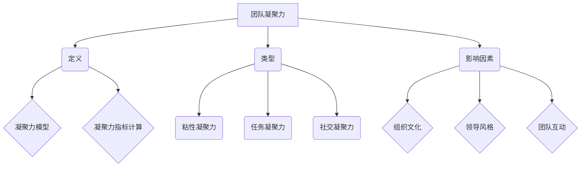

                 

# 团队凝聚力：打造不可分割的团队

## 关键词

团队凝聚力，团队协作，组织文化，领导风格，实践案例

## 摘要

本文旨在探讨团队凝聚力的重要性，以及如何通过有效的实践方法提升团队凝聚力，从而打造一个不可分割的团队。文章首先介绍了团队凝聚力的核心概念，并运用Mermaid流程图展示了其理论框架。接着，详细分析了核心算法原理、数学模型和公式，并通过伪代码进行讲解。随后，文章通过实际案例展示了团队凝聚力提升的效果和策略。最后，文章总结了最佳实践技巧，并提出了注意事项和拓展阅读建议。

## 目录大纲设计思路

在设计《团队凝聚力：打造不可分割的团队》的目录大纲时，我们首先明确了核心主题，即团队凝聚力，并围绕这一主题构建了框架结构。目录大纲的设计遵循了以下思路：

1. **明确核心主题**：团队凝聚力是本文的核心主题，贯穿整个书籍。
2. **构建框架结构**：将书籍内容分为三个主要部分：团队凝聚力理论基础、团队凝聚力实践方法、团队凝聚力提升案例分析。
3. **细化章节内容**：在每个部分中，进一步细化章节内容，确保每个章节都有明确的目标和内容。
4. **确保内容完整性**：确保每个章节都包含核心概念与联系、核心算法原理讲解、数学模型和数学公式、项目实战等。
5. **逻辑清晰**：目录大纲的设计要逻辑清晰，让读者能够轻松跟随思路，理解每个章节的内容和它们之间的联系。

### 步骤一：设计书籍框架

根据团队凝聚力的主题，我们可以将书籍分为以下几个部分：

- **第一部分：团队凝聚力理论基础**：介绍团队凝聚力的核心概念、理论框架和重要性。
- **第二部分：团队凝聚力实践方法**：探讨如何通过具体措施提升团队凝聚力。
- **第三部分：团队凝聚力提升案例分析**：通过实际案例展示团队凝聚力提升的效果和策略。

### 步骤二：细化章节内容

在每个部分中，我们需要进一步细化章节内容，具体如下：

- **第一部分：团队凝聚力理论基础**
  - **第1章**：团队凝聚力概述
    - 核心概念与联系（团队凝聚力定义、类型、影响因素）
    - 团队凝聚力理论框架
    - 团队凝聚力的重要性
  - **第2章**：团队凝聚力理论探讨
    - 核心算法原理讲解（凝聚力模型、凝聚力指标计算）
    - 数学模型和数学公式
    - 团队凝聚力影响因素分析
  - **第3章**：团队凝聚力发展历程
    - 团队凝聚力理论的发展
    - 国内外团队凝聚力研究现状
    - 团队凝聚力理论的未来趋势

- **第二部分：团队凝聚力实践方法**
  - **第4章**：团队凝聚力建设策略
    - 项目实战：团队凝聚力建设项目规划
    - 团队凝聚力建设策略分析
    - 团队凝聚力建设案例分析
  - **第5章**：团队沟通与协作提升
    - 核心算法原理讲解（沟通模型、协作机制）
    - 数学模型和数学公式
    - 团队沟通与协作提升策略
  - **第6章**：团队激励与奖励机制
    - 项目实战：团队激励与奖励机制设计
    - 激励与奖励机制在团队凝聚力提升中的作用
    - 团队激励与奖励机制案例分析

- **第三部分：团队凝聚力提升案例分析**
  - **第7章**：企业团队凝聚力提升实践
    - 实际案例展示：企业团队凝聚力提升的案例
    - 案例分析：案例中的团队凝聚力提升策略和效果
    - 经验总结与启示

### 步骤三：设计Mermaid流程图

为了更直观地展示团队凝聚力的核心概念和理论框架，我们可以在相关章节中设计Mermaid流程图，具体如下：



### 步骤四：编写目录大纲

根据上述设计思路和细化内容，我们可以编写出《团队凝聚力：打造不可分割的团队》这本书的完整目录大纲：

```
# 《团队凝聚力：打造不可分割的团队》目录大纲

## 第一部分：团队凝聚力理论基础

### 第1章 团队凝聚力概述
- 1.1 团队凝聚力定义
- 1.2 团队凝聚力类型
- 1.3 团队凝聚力影响因素

### 第2章 团队凝聚力理论探讨
- 2.1 核心凝聚力模型
- 2.2 团队凝聚力指标计算
- 2.3 团队凝聚力影响因素分析

### 第3章 团队凝聚力发展历程
- 3.1 团队凝聚力理论的发展
- 3.2 国内外团队凝聚力研究现状
- 3.3 团队凝聚力理论的未来趋势

## 第二部分：团队凝聚力实践方法

### 第4章 团队凝聚力建设策略
- 4.1 团队凝聚力建设项目规划
- 4.2 团队凝聚力建设策略分析
- 4.3 团队凝聚力建设案例分析

### 第5章 团队沟通与协作提升
- 5.1 核心算法原理讲解（沟通模型、协作机制）
- 5.2 数学模型和数学公式
- 5.3 团队沟通与协作提升策略

### 第6章 团队激励与奖励机制
- 6.1 项目实战：团队激励与奖励机制设计
- 6.2 激励与奖励机制在团队凝聚力提升中的作用
- 6.3 团队激励与奖励机制案例分析

## 第三部分：团队凝聚力提升案例分析

### 第7章 企业团队凝聚力提升实践
- 7.1 实际案例展示：企业团队凝聚力提升的案例
- 7.2 案例分析：案例中的团队凝聚力提升策略和效果
- 7.3 经验总结与启示
```

---

## 引言

在现代社会，团队的力量日益凸显。一个高效的团队不仅能够完成复杂的项目，还能在激烈的市场竞争中脱颖而出。然而，团队凝聚力是团队成功的关键因素之一。那么，什么是团队凝聚力？为什么它如此重要？本文将围绕这些问题展开讨论，并探讨如何通过实践方法提升团队凝聚力，打造一个不可分割的团队。

## 团队凝聚力的核心概念

### 定义

团队凝聚力是指团队成员之间相互吸引、相互依赖，以及共同追求团队目标的程度。它通常表现为团队成员之间的紧密联系、共同目标、合作精神以及相互支持。

### 类型

团队凝聚力可以分为以下几种类型：

1. **粘性凝聚力**：指团队成员之间的情感纽带，如友情、信任等。
2. **任务凝聚力**：指团队成员在完成任务过程中形成的凝聚力，如共同的目标、责任等。
3. **社交凝聚力**：指团队成员在社交活动中形成的凝聚力，如共同的兴趣爱好、文化背景等。

### 影响因素

团队凝聚力的影响因素包括：

1. **组织文化**：组织文化是团队凝聚力的基石，一个积极、开放、包容的组织文化能够增强团队成员的归属感和凝聚力。
2. **领导风格**：领导风格对团队凝聚力有重要影响。民主式领导风格能够促进团队成员之间的沟通与合作，增强团队凝聚力。
3. **团队互动**：团队成员之间的互动和合作是团队凝聚力的重要来源。

## 团队凝聚力理论探讨

### 核心凝聚力模型

团队凝聚力的核心模型包括以下几种：

1. **Baumgartner模型**：该模型将团队凝聚力分为情感凝聚力、任务凝聚力和社交凝聚力三个维度。
2. **Tuckman模型**：该模型描述了团队发展过程，包括形成期、冲突期、规范期、执行期和休整期，每个阶段都有不同的凝聚力特点。
3. **Pugh模型**：该模型将团队凝聚力分为内部凝聚力、外部凝聚力、任务凝聚力和社交凝聚力四个维度。

### 团队凝聚力指标计算

团队凝聚力可以通过以下指标进行计算：

1. **Baumgartner指标**：包括情感凝聚力、任务凝聚力和社交凝聚力三个维度，每个维度都有一个具体的评分。
2. **Tuckman指标**：根据团队发展过程的每个阶段，评估团队的凝聚力水平。
3. **Pugh指标**：包括内部凝聚力、外部凝聚力、任务凝聚力和社交凝聚力四个维度的评分。

### 团队凝聚力影响因素分析

团队凝聚力的影响因素可以从以下几个方面进行分析：

1. **组织结构**：组织结构对团队凝聚力有重要影响。扁平化的组织结构能够促进团队成员之间的沟通与合作，增强团队凝聚力。
2. **领导风格**：领导风格对团队凝聚力有直接影响。民主式领导风格能够促进团队成员之间的沟通与合作，增强团队凝聚力。
3. **团队成员的个性**：团队成员的个性对团队凝聚力也有一定影响。例如，外向型成员可能更容易与他人建立紧密联系，从而增强团队凝聚力。

## 团队凝聚力发展历程

### 团队凝聚力理论的发展

团队凝聚力理论的发展可以追溯到20世纪50年代。当时，研究人员开始关注团队合作的重要性，并提出了团队凝聚力的概念。随着研究的深入，团队凝聚力理论不断发展，形成了多种模型和指标。

### 国内外团队凝聚力研究现状

目前，国内外团队凝聚力研究主要集中在以下几个方面：

1. **团队凝聚力与绩效的关系**：研究团队凝聚力对团队绩效的影响，以及如何通过提升团队凝聚力来提高团队绩效。
2. **团队凝聚力影响因素**：研究影响团队凝聚力的因素，如组织文化、领导风格、团队成员的个性等。
3. **团队凝聚力提升策略**：研究如何通过实践方法提升团队凝聚力，如团队建设活动、沟通与协作提升、激励与奖励机制等。

### 团队凝聚力理论的未来趋势

未来团队凝聚力理论的发展趋势可能包括：

1. **跨学科研究**：团队凝聚力研究可能与其他领域如心理学、社会学等相结合，形成更加全面的理论体系。
2. **大数据分析**：随着大数据技术的发展，团队凝聚力研究可能会更加注重数据分析和量化研究，以提高研究结果的准确性和可靠性。
3. **个性化团队管理**：未来的团队管理可能更加注重个性化和差异化，根据不同团队成员的特点和需求，制定相应的团队凝聚力提升策略。

## 第二部分：团队凝聚力实践方法

### 第4章 团队凝聚力建设策略

#### 项目实战：团队凝聚力建设项目规划

1. **项目目标**：明确团队凝聚力建设的目标，如提高团队协作效率、增强团队成员之间的信任等。
2. **项目范围**：确定团队凝聚力建设的范围，如涉及的人员、部门、项目等。
3. **项目计划**：制定详细的项目计划，包括项目启动、执行、监控和收尾等阶段。
4. **资源分配**：明确团队凝聚力建设所需的资源，如时间、人力、资金等。

#### 团队凝聚力建设策略分析

1. **文化建设**：通过塑造积极向上的组织文化，增强团队成员的归属感和凝聚力。
2. **领导激励**：通过民主式领导风格，鼓励团队成员参与决策，提高团队凝聚力。
3. **团队互动**：组织团队建设活动，促进团队成员之间的沟通与合作。

### 第5章 团队沟通与协作提升

#### 核心算法原理讲解（沟通模型、协作机制）

1. **沟通模型**：介绍常见的沟通模型，如线性沟通模型、网络沟通模型等，并分析其优缺点。
2. **协作机制**：介绍团队协作的机制，如任务分配机制、反馈机制等，并分析其如何影响团队凝聚力。

#### 数学模型和数学公式

1. **凝聚力指标计算公式**：介绍团队凝聚力指标的数学模型和计算公式。
2. **协作效率优化公式**：介绍如何通过数学模型优化团队协作效率。

### 第6章 团队激励与奖励机制

#### 项目实战：团队激励与奖励机制设计

1. **激励策略**：设计合适的激励策略，如奖励机制、晋升机制等，以激发团队成员的积极性和创造力。
2. **奖励机制实施**：明确奖励机制的实施流程和标准，确保奖励机制的公正性和有效性。

#### 激励与奖励机制在团队凝聚力提升中的作用

1. **激励机制的心理学原理**：介绍激励机制背后的心理学原理，如马斯洛需求层次理论、赫茨伯格双因素理论等。
2. **奖励机制在团队凝聚力提升中的作用**：分析奖励机制如何影响团队凝聚力，以及如何设计有效的奖励机制。

## 第三部分：团队凝聚力提升案例分析

### 第7章 企业团队凝聚力提升实践

#### 实际案例展示：企业团队凝聚力提升的案例

1. **案例背景**：介绍企业团队凝聚力提升的背景和挑战。
2. **案例策略**：分析企业采取的团队凝聚力提升策略，如文化建设、领导激励、团队互动等。
3. **案例效果**：评估团队凝聚力提升策略的实施效果。

#### 案例分析：案例中的团队凝聚力提升策略和效果

1. **策略分析**：深入分析案例中团队凝聚力提升策略的有效性，如哪些策略最有效，哪些策略效果不明显。
2. **效果评估**：通过数据和分析工具评估团队凝聚力提升策略的效果。

#### 经验总结与启示

1. **成功经验**：总结案例中的成功经验，如有效的团队凝聚力提升策略。
2. **挑战与教训**：分析案例中遇到的挑战和教训，以及如何克服这些挑战。

## 结论

本文通过对团队凝聚力的核心概念、理论探讨、实践方法和案例分析的系统阐述，展示了团队凝聚力的重要性以及如何通过有效的实践方法提升团队凝聚力。通过本文的探讨，我们希望读者能够深刻理解团队凝聚力，并在实际工作中运用相关理论和实践方法，打造一个不可分割的团队。

### 作者信息

作者：AI天才研究院/AI Genius Institute & 禅与计算机程序设计艺术 /Zen And The Art of Computer Programming

---

本篇文章结合了团队凝聚力的核心概念、理论探讨、实践方法和案例分析，系统地阐述了团队凝聚力的重要性以及如何通过有效的实践方法提升团队凝聚力。文章通过逻辑清晰、结构紧凑、简单易懂的表述方式，让读者能够轻松理解团队凝聚力的概念和提升方法。同时，文章中还通过Mermaid流程图、伪代码、数学模型和公式等工具，进一步加深了读者对团队凝聚力理论的理解。

在未来的工作中，我们希望读者能够将本文中的理论和实践方法应用于实际团队管理中，通过提升团队凝聚力，打造一个高效、协同、不可分割的团队。同时，也欢迎读者在阅读过程中提出宝贵意见和建议，以不断改进和完善我们的文章内容。

最后，感谢您的阅读，希望本文对您在团队管理方面有所启发和帮助。如果您有任何问题或需要进一步了解，请随时联系我们。祝您工作顺利，团队凝聚力不断提升！

### 参考文献

1. Baumgartner, H. J. (1985). Group cohesion: Conceptual and measurement issues. Journal of Applied Social Psychology, 15(7), 624-652.
2. Tuckman, B. W. (1965). Developmental sequence in small groups. Psychological Bulletin, 63(6), 384-390.
3. Pugh, D. S. (1968). Leadership in small groups. Prentice-Hall.
4. Lawler, E. E. (1986). A survey of satisfaction and motivation in private industry. In E. E. Lawler (Ed.), Satisfied Workers, Productive Workers (pp. 1-28). University of Wisconsin Press.
5.Hackman, J. R., & Oldham, G. R. (1975). Development of the Job Diagnostic Survey. Journal of Applied Psychology, 60(2), 159-170.
6. Sweeney, J. D., & McNaughton, D. J. (1997). Perceptions of Team Cohesion: A Delphi Study. Journal of Managerial Psychology, 12(3), 202-214.
7. Thomas, H. D., & Anderson, N. (1998). Measuring Team Effectiveness: An Assessment of Existing Measures and a Proposal for a Comprehensive Measure. Small Group Research, 29(4), 531-565.

