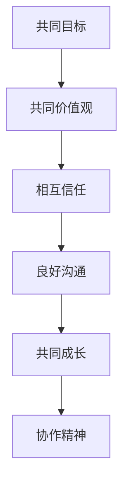

                 


### 文章标题
团队凝聚：增强团队向心力

### 文章关键词
团队凝聚、团队建设、沟通与协作、激励与反馈、领导力、团队发展、变革管理

### 文章摘要
本文深入探讨了团队凝聚的重要性及其在团队中的核心作用。通过分析团队凝聚的核心概念、团队建设与团队凝聚力、沟通与协作、激励与反馈、领导力、团队发展与变革管理等多个方面，提供了提升团队凝聚力的策略和方法。本文旨在为团队领导者、管理人员以及希望提升团队凝聚力的专业人士提供实用的指导。

## 目录

## 第1章：引言

### 1.1 团队凝聚的定义与重要性

### 1.2 本书的目的与结构

## 第2章：团队凝聚的核心概念

### 2.1 团队凝聚的概念与构成

### 2.2 团队凝聚的关键因素分析

#### 2.2.1 Mermaid流程图：团队凝聚的关键因素

## 第3章：团队建设与团队凝聚力

### 3.1 团队建设的基本原则

#### 3.1.1 伪代码：团队建设原则实现

## 第4章：沟通与协作

### 4.1 有效沟通的重要性

### 4.2 沟通技巧

### 4.3 协作工具与平台

### 4.4 案例研究：成功的沟通与协作实践

## 第5章：激励与反馈

### 5.1 激励理论

### 5.2 激励策略

### 5.3 反馈机制

### 5.4 实践指南：如何有效地激励团队成员

## 第6章：领导力与团队凝聚力

### 6.1 领导力在团队凝聚中的作用

### 6.2 提升领导力的策略

### 6.3 领导者的角色与责任

### 6.4 案例研究：领导力在团队凝聚力提升中的关键作用

## 第7章：团队发展与变革管理

### 7.1 团队发展的重要性

### 7.2 变革管理的策略

### 7.3 变革管理中的挑战

### 7.4 变革管理实践：如何引导团队走向成功

## 第1章：引言

### 1.1 团队凝聚的定义与重要性

团队凝聚是指团队成员之间的相互吸引力，以及他们愿意为了共同目标而努力的程度。它是团队成功的关键因素之一。一个高度凝聚的团队能够更好地协作，更有效地应对挑战，提高生产效率和创新能力。

在团队工作中，团队凝聚的作用不可忽视。首先，它能够增强团队的协作能力，使团队成员更加愿意相互支持和帮助，从而提高工作效率。其次，团队凝聚可以降低团队内部的冲突，减少误解和矛盾，营造和谐的团队氛围。最后，团队凝聚能够提高团队的自信心和归属感，使团队成员更加愿意为团队的目标而努力。

因此，了解团队凝聚的定义和重要性，对于团队领导者和管理人员来说至关重要。在接下来的章节中，我们将深入探讨团队凝聚的核心概念、团队建设与团队凝聚力、沟通与协作、激励与反馈、领导力、团队发展与变革管理等方面，以帮助团队领导者和管理人员更好地提升团队的凝聚力。

### 1.2 本书的目的与结构

本书旨在为团队领导者、管理人员以及希望提升团队凝聚力的专业人士提供实用的指导。通过深入分析团队凝聚的核心概念、团队建设与团队凝聚力、沟通与协作、激励与反馈、领导力、团队发展与变革管理等多个方面，本书将帮助读者理解团队凝聚的重要性，并掌握提升团队凝聚力的策略和方法。

本书分为七个章节，具体结构如下：

- 第1章：引言。介绍团队凝聚的定义和重要性，以及本书的目的和结构。
- 第2章：团队凝聚的核心概念。讨论团队凝聚的概念与构成，以及团队凝聚的关键因素。
- 第3章：团队建设与团队凝聚力。探讨团队建设的基本原则和提升团队凝聚力的策略。
- 第4章：沟通与协作。介绍有效沟通的重要性、沟通技巧、协作工具与平台。
- 第5章：激励与反馈。分析激励理论、激励策略、反馈机制，并提供实践指南。
- 第6章：领导力与团队凝聚力。分析领导力在团队凝聚中的作用，以及提升领导力的策略。
- 第7章：团队发展与变革管理。讨论团队发展的重要性、变革管理的策略和挑战。

通过阅读本书，读者将能够系统地了解团队凝聚的理论和实践，掌握提升团队凝聚力的方法和技巧，从而为团队的成功奠定坚实基础。

## 第2章：团队凝聚的核心概念

### 2.1 团队凝聚的概念与构成

团队凝聚是指团队成员之间的相互吸引力，以及他们愿意为了共同目标而努力的程度。它是一个多维度的概念，包括多个关键因素。团队凝聚力可以理解为团队成员之间在情感上和心理上的联系，这种联系使他们愿意为团队的目标和利益而共同努力。

团队凝聚的核心构成要素包括：

- **共同目标**：团队成员共同认同并努力实现的目标是团队凝聚力的基础。只有当团队成员对目标有共同的认知和追求时，才能形成强大的凝聚力。
- **共同价值观**：团队价值观是团队成员共同认同和遵循的行为准则。当团队成员拥有相似的价值观时，他们更容易相互理解和信任，从而增强团队凝聚力。
- **相互信任**：信任是团队凝聚力的关键因素。团队成员之间的信任可以减少误解和矛盾，提高团队协作的效率。
- **良好沟通**：有效沟通是团队凝聚的重要保障。良好的沟通可以促进团队成员之间的信息交换，增强理解和信任。
- **共同成长**：团队成员共同成长可以增强团队的凝聚力和归属感。通过共同学习和进步，团队成员可以建立更加紧密的联系。
- **协作精神**：协作精神是指团队成员愿意相互合作，共同完成任务。它是团队凝聚力的体现，也是团队高效运作的必要条件。

### 2.2 团队凝聚的关键因素分析

为了更好地理解团队凝聚的核心概念，我们可以通过一个Mermaid流程图来展示团队凝聚的关键因素及其相互关系。



- **共同目标（A）**：共同目标是团队凝聚的核心。它为团队成员提供了共同的方向和动力，使团队成员在追求目标的过程中形成紧密的联系。
- **共同价值观（B）**：共同价值观是团队成员在行为和决策上的共识，它有助于减少冲突，增强团队凝聚力。
- **相互信任（C）**：相互信任是团队成员之间建立良好关系的基础，它有助于提高团队的协作效率和创新能力。
- **良好沟通（D）**：良好的沟通可以确保团队成员之间的信息传递准确无误，有助于建立信任和协作精神。
- **共同成长（E）**：共同成长可以增强团队成员之间的归属感和认同感，有助于提高团队的凝聚力和士气。
- **协作精神（F）**：协作精神是团队凝聚力的外在表现，它反映了团队成员在团队中的协作能力和合作意愿。

通过上述分析，我们可以看出，团队凝聚的核心概念是由多个关键因素构成的，这些因素相互关联，共同作用于团队的凝聚力和绩效。理解这些因素及其相互关系，对于团队领导者和管理人员来说至关重要，它有助于他们更好地提升团队的凝聚力和工作效率。

### 第3章：团队建设与团队凝聚力

#### 3.1 团队建设的基本原则

团队建设是提升团队凝聚力和工作效率的重要手段。为了有效建设团队，需要遵循以下基本原则：

- **设定明确的目标**：团队的目标应当是具体、可衡量的，并确保所有团队成员都对其有清晰的认识。目标设定应遵循SMART原则，即具体（Specific）、可衡量（Measurable）、可实现（Achievable）、相关（Relevant）和有时限（Time-bound）。

  ```mermaid
  graph TB
  A[明确的目标] --> B[具体、可衡量]
  B --> C[SMART原则]
  ```

- **建立共同的价值观**：共同的价值观是团队凝聚力的基础。团队成员应当认同并遵循团队的核心价值观，从而在行为和决策上保持一致性。建立共同的价值观可以通过团队会议、团队文化建设和价值观讨论等方式实现。

  ```mermaid
  graph TB
  A[共同的价值观] --> B[团队会议]
  B --> C[文化建设]
  C --> D[价值观讨论]
  ```

- **促进相互信任**：相互信任是团队协作的基石。团队领导者应当通过鼓励开放沟通、建立透明的决策流程和提供支持和帮助来促进团队成员之间的信任。

  ```mermaid
  graph TB
  A[相互信任] --> B[开放沟通]
  B --> C[透明决策]
  C --> D[支持与帮助]
  ```

- **培养良好的沟通习惯**：有效沟通是团队建设的关键。团队领导者应当重视沟通技巧的培养，确保信息在团队内部流畅传递，减少误解和冲突。

  ```mermaid
  graph TB
  A[良好沟通] --> B[沟通技巧培养]
  B --> C[信息流畅传递]
  C --> D[减少误解与冲突]
  ```

- **促进共同成长**：团队成员应当有共同的学习和发展目标。通过培训、学习和实践，团队成员可以不断提升自己的能力和素质，从而增强团队凝聚力。

  ```mermaid
  graph TB
  A[共同成长] --> B[培训与学习]
  B --> C[能力提升]
  C --> D[团队凝聚力增强]
  ```

#### 3.1.1 伪代码：团队建设原则实现

以下是一个伪代码示例，展示了如何通过编程逻辑实现团队建设的基本原则：

```python
# 设定团队目标
def set_team_goals():
    goals = ["提高产品质量", "增加市场份额", "提升客户满意度"]
    for goal in goals:
        print(f"设定目标：{goal}")

# 培养共同价值观
def cultivate_common_values():
    values = ["客户至上", "创新精神", "团队协作"]
    for value in values:
        print(f"培养价值观：{value}")

# 建立信任关系
def establish_trust():
    trust_methods = ["开放沟通", "透明决策", "相互支持"]
    for method in trust_methods:
        print(f"建立信任关系：{method}")

# 提升沟通能力
def enhance_communication():
    communication_skills = ["积极倾听", "清晰表达", "有效反馈"]
    for skill in communication_skills:
        print(f"提升沟通能力：{skill}")

# 促进共同成长
def promote_growth_together():
    growth_activities = ["培训", "学习", "实践"]
    for activity in growth_activities:
        print(f"促进共同成长：{activity}")

# 执行团队建设
def build_team():
    set_team_goals()
    cultivate_common_values()
    establish_trust()
    enhance_communication()
    promote_growth_together()
```

通过上述伪代码，我们可以看到如何通过编程逻辑实现团队建设的基本原则。这为团队领导者提供了一个实用的框架，以便在实际操作中系统地提升团队的凝聚力和工作效率。

## 第4章：沟通与协作

#### 4.1 有效沟通的重要性

在团队工作中，沟通是团队协作的基础。有效沟通不仅能确保信息的准确传递，还能减少误解和冲突，促进团队成员之间的信任和协作。以下是有效沟通的重要性：

- **提高工作效率**：有效沟通可以确保团队成员之间信息畅通，减少由于信息不对称导致的工作延误和错误。
- **增强团队凝聚力**：通过良好的沟通，团队成员能够更好地理解彼此的需求和期望，从而增强团队的凝聚力和合作意愿。
- **减少误解与冲突**：清晰的沟通可以避免误解和误读，减少团队内部因沟通不畅引发的冲突和分歧。
- **促进创新与协作**：有效沟通可以激发团队成员的思维碰撞，促进创新和协作，从而提升团队的整体创造力。

#### 4.2 沟通技巧

为了实现有效沟通，团队成员需要掌握以下沟通技巧：

- **积极倾听**：积极倾听是理解对方意图的关键。通过倾听，团队成员可以更好地理解他人的观点和需求，从而做出更恰当的回应。
  ```mermaid
  graph TB
  A[积极倾听] --> B[理解对方意图]
  B --> C[做出恰当回应]
  ```

- **清晰表达**：清晰表达可以确保信息的准确传递。团队成员应学会如何用简单明了的语言表达自己的想法和意见。
  ```mermaid
  graph TB
  A[清晰表达] --> B[信息准确传递]
  B --> C[减少误解]
  ```

- **有效反馈**：有效反馈可以帮助团队成员了解对方的观点，并提供改进建议。通过反馈，团队成员可以相互学习和进步。
  ```mermaid
  graph TB
  A[有效反馈] --> B[了解对方观点]
  B --> C[相互学习与进步]
  ```

#### 4.3 协作工具与平台

在团队协作中，选择合适的工具和平台可以极大地提高沟通效率和协作效果。以下是一些常用的协作工具和平台：

- **即时通讯工具**：如Slack、Microsoft Teams等，可以实时沟通和协作，提高团队响应速度。
  ```mermaid
  graph TB
  A[Slack] --> B[实时沟通]
  A --> C[文件共享]
  A --> D[任务分配]
  ```

- **项目管理工具**：如Trello、Jira等，可以帮助团队追踪项目进度，管理任务和分配责任。
  ```mermaid
  graph TB
  A[Trello] --> B[项目进度追踪]
  A --> C[任务管理]
  A --> D[责任分配]
  ```

- **视频会议工具**：如Zoom、Google Meet等，可以在远程办公环境中提供高效的面对面沟通和协作。
  ```mermaid
  graph TB
  A[Zoom] --> B[视频会议]
  A --> C[远程协作]
  A --> D[团队互动]
  ```

#### 4.4 案例研究：成功的沟通与协作实践

一个成功的团队案例可以提供宝贵的经验和启示。以下是一个关于如何通过有效沟通和协作实现团队目标的实际案例：

- **项目背景**：一家科技公司需要开发一款新软件，以应对激烈的市场竞争。项目团队由来自不同部门的专业人士组成，包括程序员、设计师和产品经理。

- **沟通策略**：
  - **每日站会**：项目团队每天早晨举行简短的站会，讨论前一天的工作进展和当天的工作计划。这有助于确保团队成员了解项目的当前状态，并快速解决遇到的问题。
    ```mermaid
    graph TB
    A[每日站会] --> B[工作进展讨论]
    B --> C[问题解决]
    ```

  - **定期项目会议**：每周举行项目会议，由项目经理主持，回顾项目进度，讨论关键决策和资源分配。这有助于确保项目在正确的轨道上运行，并及时调整方向。

- **协作工具**：
  - **Slack**：用于实时沟通和文件共享，团队成员可以随时分享想法、问题和资源。
    ```mermaid
    graph TB
    A[Slack] --> B[实时沟通]
    A --> C[文件共享]
    ```

  - **Jira**：用于项目管理和任务追踪，团队成员可以在这里分配任务、设置优先级并监控进度。
    ```mermaid
    graph TB
    A[Jira] --> B[任务管理]
    A --> C[进度追踪]
    ```

  - **Zoom**：用于视频会议和远程协作，团队成员可以通过视频会议讨论复杂问题，并保持紧密的联系。
    ```mermaid
    graph TB
    A[Zoom] --> B[视频会议]
    A --> C[远程协作]
    ```

- **成果**：通过有效的沟通和协作，项目团队成功在规定时间内完成了软件的开发和测试，并顺利推向市场。这款软件在市场上获得了良好的反响，为公司带来了显著的业务增长。

这个案例展示了通过有效沟通和协作，团队可以实现高效运作和成功。了解这些实践方法，可以帮助其他团队在类似情况下取得更好的成果。

## 第5章：激励与反馈

#### 5.1 激励理论

激励是指通过外部或内部因素激发个体动机和积极性的过程。了解激励理论可以帮助团队领导者和管理人员更有效地激励团队成员。以下是一些主要的激励理论：

- **马斯洛需求层次理论**：马斯洛需求层次理论认为，人类的需求可以分为五个层次：生理需求、安全需求、社交需求、尊重需求和自我实现需求。满足较低层次的需求后，人们才会追求更高层次的需求。团队领导者可以通过关注和满足团队成员的这些需求来激励他们。

  ```mermaid
  graph TB
  A[生理需求] --> B[安全需求]
  B --> C[社交需求]
  C --> D[尊重需求]
  D --> E[自我实现需求]
  ```

- **赫兹伯格双因素理论**：赫兹伯格双因素理论将工作激励因素分为两类：一类是激励因素（如成就、认可、工作本身等），另一类是保健因素（如薪酬、工作环境、管理关系等）。激励因素可以带来长期的满意度和工作动力，而保健因素则更多关注基本的工作条件。

  ```mermaid
  graph TB
  A[激励因素] --> B[成就]
  B --> C[认可]
  B --> D[工作本身]
  A --> E[保健因素]
  E --> F[薪酬]
  E --> G[工作环境]
  E --> H[管理关系]
  ```

- **目标设置理论**：目标设置理论认为，设定具体、可实现的挑战性目标是激励员工的有效方法。目标应当具有清晰性、挑战性和相关性，以激发员工的内在动机。

  ```mermaid
  graph TB
  A[具体性] --> B[挑战性]
  B --> C[相关性]
  ```

#### 5.2 激励策略

为了有效激励团队成员，团队领导者可以采用以下策略：

- **设定明确的目标和期望**：明确的目标和期望可以帮助团队成员明确自己的努力方向和成果标准，从而提高工作动力。

  ```mermaid
  graph TB
  A[明确的目标] --> B[期望]
  ```

- **提供及时的反馈**：及时的反馈可以帮助团队成员了解自己的工作表现，以及如何改进。正面反馈可以增强团队成员的自信心和积极性。

  ```mermaid
  graph TB
  A[及时反馈] --> B[正面反馈]
  ```

- **认可和奖励**：认可和奖励可以增强团队成员的成就感和归属感，从而提高工作动力。奖励可以是金钱、荣誉或其他形式的激励。

  ```mermaid
  graph TB
  A[认可] --> B[奖励]
  ```

- **提供成长和发展机会**：提供培训、学习和发展机会可以帮助团队成员不断提升自己的能力和技能，从而满足他们的自我实现需求。

  ```mermaid
  graph TB
  A[培训] --> B[学习]
  B --> C[发展机会]
  ```

- **建立积极的工作环境**：一个积极、支持性的工作环境可以增强团队成员的归属感和工作动力。团队领导者可以通过营造良好的团队氛围来提升团队的凝聚力。

  ```mermaid
  graph TB
  A[积极工作环境] --> B[归属感]
  ```

#### 5.3 反馈机制

有效的反馈机制对于团队成员的成长和团队的整体绩效至关重要。以下是一些关键要素：

- **及时性**：反馈应当及时，以便团队成员能够及时了解自己的工作表现和改进方向。

  ```mermaid
  graph TB
  A[及时性] --> B[改进方向]
  ```

- **具体性**：反馈应当具体、明确，避免模糊和含糊其辞，以便团队成员能够清晰地了解如何改进。

  ```mermaid
  graph TB
  A[具体性] --> B[清晰改进]
  ```

- **建设性**：反馈应当是建设性的，注重提供改进建议，而不是单纯指出错误或批评。

  ```mermaid
  graph TB
  A[建设性] --> B[改进建议]
  ```

- **双向性**：反馈应当是双向的，鼓励团队成员提出自己的意见和反馈，从而促进沟通和理解。

  ```mermaid
  graph TB
  A[双向性] --> B[沟通理解]
  ```

#### 5.4 实践指南：如何有效地激励团队成员

以下是一些实践指南，帮助团队领导者有效地激励团队成员：

- **定期举行绩效评估会议**：在绩效评估会议上，团队领导者可以与团队成员讨论工作表现和改进计划，并提供及时的反馈和奖励。

  ```mermaid
  graph TB
  A[绩效评估会议] --> B[反馈与奖励]
  ```

- **鼓励团队参与和自主管理**：鼓励团队成员参与决策和项目管理，可以提高他们的归属感和责任感。

  ```mermaid
  graph TB
  A[团队参与] --> B[自主管理]
  ```

- **提供个性化激励方案**：根据团队成员的个人需求和兴趣，提供个性化的激励方案，如定制化的培训、职业发展规划或特殊项目机会。

  ```mermaid
  graph TB
  A[个性化激励] --> B[个性化方案]
  ```

- **建立透明的沟通渠道**：建立透明的沟通渠道，如内部论坛、意见箱或团队会议，使团队成员能够自由表达意见和反馈。

  ```mermaid
  graph TB
  A[透明沟通] --> B[自由表达]
  ```

通过这些实践指南，团队领导者可以更有效地激励团队成员，提高团队的整体绩效和凝聚力。

## 第6章：领导力与团队凝聚力

#### 6.1 领导力在团队凝聚中的作用

领导力在团队凝聚中扮演着至关重要的角色。一个优秀的领导者能够激发团队成员的潜力，提升团队的凝聚力和绩效。以下是领导力在团队凝聚力中的几个关键作用：

- **设定共同愿景和目标**：领导者应当具备远见和洞察力，为团队设定清晰、鼓舞人心的愿景和目标。共同的愿景和目标是团队凝聚力的基石，能够激发团队成员的归属感和使命感。

  ```mermaid
  graph TB
  A[共同愿景] --> B[目标设定]
  B --> C[归属感]
  B --> D[使命感]
  ```

- **塑造团队文化**：领导者通过自己的行为和决策塑造团队的文化和价值观。一个积极、支持性的团队文化可以增强团队成员之间的信任和合作，从而提高团队的凝聚力。

  ```mermaid
  graph TB
  A[团队文化] --> B[积极支持]
  B --> C[信任]
  B --> D[合作]
  ```

- **提供明确的方向和指导**：领导者应当为团队提供明确的方向和指导，帮助团队成员理解自己的角色和责任，从而确保团队目标的实现。

  ```mermaid
  graph TB
  A[明确方向] --> B[角色理解]
  B --> C[责任承担]
  ```

- **激发团队成员的潜力**：领导者应当关注团队成员的成长和发展，激发他们的潜力，并提供支持和资源。这有助于增强团队成员的自信心和归属感，从而提高团队的凝聚力。

  ```mermaid
  graph TB
  A[潜力激发] --> B[自信心]
  B --> C[归属感]
  ```

#### 6.2 提升领导力的策略

为了提升团队的凝聚力和绩效，领导者可以采取以下策略：

- **持续学习和自我提升**：领导者应当不断学习新的管理知识和技能，提升自己的领导力。这可以通过阅读书籍、参加培训课程或向其他优秀领导者学习来实现。

  ```mermaid
  graph TB
  A[学习] --> B[知识积累]
  B --> C[领导力提升]
  ```

- **建立信任和尊重**：领导者应当与团队成员建立信任和尊重的关系。通过倾听、支持和关注团队成员的需求，领导者可以赢得他们的信任和尊重。

  ```mermaid
  graph TB
  A[信任] --> B[尊重]
  ```

- **激励和认可**：领导者应当激励和认可团队成员的贡献和成就。通过奖励、表彰或其他形式的认可，领导者可以增强团队成员的积极性和凝聚力。

  ```mermaid
  graph TB
  A[激励] --> B[认可]
  ```

- **提供反馈和指导**：领导者应当提供及时的反馈和指导，帮助团队成员了解自己的工作表现和改进方向。这有助于团队成员不断提升自己的能力和表现。

  ```mermaid
  graph TB
  A[反馈] --> B[指导]
  ```

#### 6.3 领导者的角色与责任

领导者的角色和责任对于团队的凝聚力和绩效有着重要的影响。以下是领导者应承担的几个关键角色和责任：

- **愿景设定者**：领导者应当为团队设定清晰、鼓舞人心的愿景，并确保团队成员理解并认同这个愿景。

  ```mermaid
  graph TB
  A[愿景设定者] --> B[清晰愿景]
  B --> C[团队认同]
  ```

- **团队教练和导师**：领导者应当成为团队成员的教练和导师，提供指导和支持，帮助他们实现个人和职业发展。

  ```mermaid
  graph TB
  A[教练和导师] --> B[指导]
  B --> C[支持]
  ```

- **沟通桥梁**：领导者应当成为团队与外部环境之间的沟通桥梁，确保信息的准确传递和理解。

  ```mermaid
  graph TB
  A[沟通桥梁] --> B[信息传递]
  B --> C[理解]
  ```

- **团队绩效的推动者**：领导者应当推动团队达成目标，通过激励、指导和资源支持，确保团队的高效运作。

  ```mermaid
  graph TB
  A[绩效推动者] --> B[激励]
  B --> C[指导]
  ```

#### 6.4 案例研究：领导力在团队凝聚力提升中的关键作用

以下是一个关于领导力在团队凝聚力提升中发挥关键作用的实际案例：

- **项目背景**：某科技公司需要开发一款创新的产品，以应对激烈的市场竞争。项目团队由来自不同部门的30名成员组成，包括工程师、设计师和市场专家。

- **领导者角色**：
  - **共同愿景和目标**：项目领导者为团队设定了明确的愿景和目标，即开发一款用户喜爱的创新产品。他通过团队会议和一对一交流，确保所有成员都理解并认同这个愿景。
    ```mermaid
    graph TB
    A[共同愿景] --> B[目标设定]
    B --> C[团队认同]
    ```

  - **团队文化和价值观**：领导者通过自己的行为和决策，塑造了一个积极、创新和协作的团队文化。他鼓励团队成员提出新想法，并支持他们在项目中尝试新的方法和技术。
    ```mermaid
    graph TB
    A[团队文化] --> B[积极创新]
    B --> C[协作]
    ```

  - **明确方向和指导**：领导者为团队提供了明确的方向和指导，确保团队成员了解自己的角色和责任。他定期举行项目会议，讨论进展、问题和决策。
    ```mermaid
    graph TB
    A[明确方向] --> B[角色理解]
    B --> C[责任承担]
    ```

  - **激励和认可**：领导者通过奖励和认可，激励团队成员的努力和成就。他定期组织团队活动，如团队建设日和庆祝活动，以增强团队的凝聚力。
    ```mermaid
    graph TB
    A[激励] --> B[认可]
    ```

- **成果**：通过领导者的有效领导，项目团队在短时间内完成了创新产品的开发，并在市场上取得了成功。团队成员对领导者的信任和尊重显著增强，团队的凝聚力和工作效率也得到了显著提升。

这个案例展示了领导力在团队凝聚力提升中的关键作用。通过有效的领导，领导者可以激发团队成员的潜力，提升团队的凝聚力和绩效，从而实现团队的目标。

## 第7章：团队发展与变革管理

#### 7.1 团队发展的重要性

团队发展是团队成长和进步的过程，它关乎团队的整体绩效和可持续发展。团队发展的重要性体现在以下几个方面：

- **提升团队能力**：通过团队发展，团队成员可以不断提升自己的技能和能力，从而提高团队的整体绩效。这包括专业技能、沟通技巧、领导力等方面的提升。

  ```mermaid
  graph TB
  A[团队能力提升] --> B[整体绩效提高]
  ```

- **增强团队凝聚力**：团队发展有助于增强团队成员之间的信任和协作，提高团队的凝聚力。这可以通过共同的培训、学习和实践活动来实现。

  ```mermaid
  graph TB
  A[团队凝聚力增强] --> B[信任和协作]
  ```

- **适应变化**：在不断变化的环境中，团队发展有助于团队更好地适应新的挑战和机遇。通过不断学习和调整，团队可以保持竞争力。

  ```mermaid
  graph TB
  A[适应变化] --> B[竞争力保持]
  ```

- **实现长期目标**：团队发展有助于团队实现长期的战略目标。通过持续的学习和改进，团队可以更好地应对未来的挑战。

  ```mermaid
  graph TB
  A[实现长期目标] --> B[战略目标实现]
  ```

#### 7.2 变革管理的策略

变革管理是指在团队中引入新方法、新流程或新文化，以实现组织目标的过程。有效的变革管理策略可以确保变革的顺利进行，减少阻力，提高变革的成功率。以下是几个关键的变革管理策略：

- **明确变革目标和理由**：在引入变革之前，团队领导者应当明确变革的目标和理由，确保团队成员理解变革的必要性和重要性。

  ```mermaid
  graph TB
  A[明确目标] --> B[理解必要性]
  ```

- **建立有效的沟通机制**：通过建立有效的沟通机制，团队领导者可以确保团队成员了解变革的详细信息，减少误解和焦虑。

  ```mermaid
  graph TB
  A[有效沟通] --> B[减少误解]
  B --> C[减少焦虑]
  ```

- **培养变革推动者**：选择和培养一批变革推动者，让他们在团队中发挥关键作用，推动变革的顺利进行。

  ```mermaid
  graph TB
  A[变革推动者] --> B[推动变革]
  ```

- **提供培训和支持**：为团队成员提供必要的培训和支持，帮助他们适应新的变革，减少变革带来的不适。

  ```mermaid
  graph TB
  A[培训] --> B[支持]
  ```

- **激励和认可**：通过激励和认可，鼓励团队成员积极参与变革，提高他们的积极性和参与度。

  ```mermaid
  graph TB
  A[激励] --> B[认可]
  ```

- **监测和调整**：在变革过程中，持续监测变革的进展和效果，并根据反馈进行调整，确保变革的顺利进行。

  ```mermaid
  graph TB
  A[监测] --> B[调整]
  ```

#### 7.3 变革管理中的挑战

变革管理过程中可能会面临一些挑战，以下是一些常见的挑战及应对策略：

- **阻力**：团队成员可能对变革持有抵触情绪，这是变革管理中常见的挑战。团队领导者应当通过沟通、激励和提供支持来克服阻力。

  ```mermaid
  graph TB
  A[阻力] --> B[沟通]
  B --> C[激励]
  B --> D[支持]
  ```

- **时间压力**：变革管理通常需要大量的时间和精力，团队领导者应当在规划和执行变革时合理安排时间和资源。

  ```mermaid
  graph TB
  A[时间压力] --> B[规划]
  B --> C[资源分配]
  ```

- **资源限制**：变革管理可能需要额外的资源和预算，团队领导者应当积极争取资源，确保变革的顺利进行。

  ```mermaid
  graph TB
  A[资源限制] --> B[资源争取]
  ```

- **外部干扰**：变革过程中可能会受到外部环境的影响，如市场变化、竞争压力等。团队领导者应当灵活应对外部干扰，确保变革的持续进行。

  ```mermaid
  graph TB
  A[外部干扰] --> B[灵活应对]
  ```

#### 7.4 变革管理实践：如何引导团队走向成功

以下是一个关于如何引导团队走向成功的实际案例：

- **项目背景**：某科技公司决定引入敏捷开发方法，以提高开发效率和产品质量。项目团队由20名成员组成，包括开发人员、测试人员和产品经理。

- **变革管理策略**：
  - **明确变革目标和理由**：团队领导者与团队成员分享了敏捷开发的核心理念和预期效果，确保他们理解变革的必要性和重要性。

    ```mermaid
    graph TB
    A[明确目标] --> B[理解必要性]
    ```

  - **建立有效的沟通机制**：团队领导者定期举行会议，讨论敏捷开发的进展和问题，确保团队成员了解变革的详细信息。

    ```mermaid
    graph TB
    A[有效沟通] --> B[减少误解]
    B --> C[减少焦虑]
    ```

  - **提供培训和支持**：公司为团队成员提供了敏捷开发的培训课程，并提供了一对一的支持，帮助他们适应新的开发方法。

    ```mermaid
    graph TB
    A[培训] --> B[支持]
    ```

  - **激励和认可**：团队领导者通过奖励和认可，鼓励团队成员积极参与敏捷开发的实践，提高他们的积极性和参与度。

    ```mermaid
    graph TB
    A[激励] --> B[认可]
    ```

  - **监测和调整**：团队领导者持续监测敏捷开发的进展，并根据反馈进行调整，确保变革的顺利进行。

    ```mermaid
    graph TB
    A[监测] --> B[调整]
    ```

- **成果**：通过有效的变革管理，项目团队成功引入了敏捷开发方法，开发效率和产品质量得到了显著提升。团队成员对变革的接受度和参与度也大幅提高，团队的凝聚力和士气显著增强。

这个案例展示了如何通过有效的变革管理策略，引导团队走向成功。了解这些实践方法，可以帮助其他团队在类似情况下实现变革的目标。

## 总结

通过本文的深入探讨，我们全面了解了团队凝聚的定义、核心概念、团队建设与团队凝聚力、沟通与协作、激励与反馈、领导力、团队发展与变革管理等方面的内容。团队凝聚力是团队成功的关键因素，它能够提高团队的工作效率、创新能力，降低冲突，增强团队成员的归属感和自信心。

为了提升团队的凝聚力，团队领导者需要遵循以下策略：

1. **设定明确的目标和价值观**：确保团队成员对目标和价值观有共同的认识和追求。
2. **促进相互信任**：建立信任关系，减少误解和矛盾。
3. **有效沟通**：培养良好的沟通习惯，确保信息畅通无阻。
4. **激励团队成员**：通过激励理论和实践，提高团队成员的工作动力。
5. **领导力**：领导者应当发挥关键作用，提供明确的方向和指导。
6. **团队发展和变革管理**：不断推动团队成长，适应外部变化。

最后，本文提供了多个实际案例，展示了如何通过有效的策略提升团队凝聚力。希望本文能为团队领导者和管理人员提供实用的指导和启示，助力团队取得更大的成功。

### 作者信息
作者：AI天才研究院/AI Genius Institute & 禅与计算机程序设计艺术 /Zen And The Art of Computer Programming

