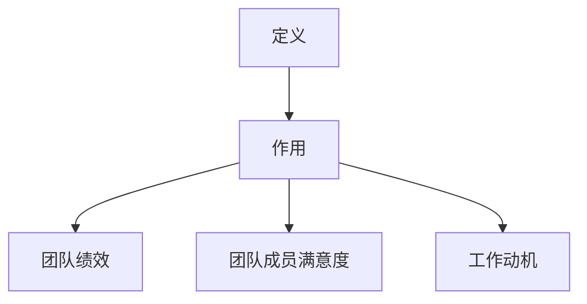

                 

### 文章标题：团队凝聚：增强团队向心力

#### 关键词：团队凝聚力、团队建设、团队沟通、领导力、激励机制、团队冲突、团队发展

#### 摘要：
本文将探讨团队凝聚力的核心概念、重要性及其在团队成功中的关键作用。我们将深入分析团队建设的基本原则，提供增强团队凝聚力的策略与方法，并详细讨论团队成员之间的沟通技巧、领导者的角色与职责、团队激励与绩效管理，以及应对团队挑战和冲突的技巧。通过实际案例和实战分析，本文旨在为读者提供实用的团队凝聚力提升方案，助力团队向心力的增强。

---

### 第一部分：团队凝聚力概述

#### 第1章：团队凝聚力的重要性

#### 1.1 团队凝聚力的定义与作用

**背景介绍：**
团队凝聚力是指团队成员之间相互吸引、相互支持，共同致力于团队目标的程度。它不仅影响团队的绩效，还影响团队成员的满意度和工作动机。

**核心概念与联系：**


**Mermaid 流程图：**


**核心算法原理讲解：**
团队凝聚力可以通过以下公式衡量：

$$
团队凝聚力 = \frac{1}{n}\sum_{i=1}^{n} \text{成员i的凝聚力得分}
$$

其中，n为团队成员总数。

**详细讲解与举例说明：**
假设一个团队有5名成员，他们的凝聚力得分分别为8、9、7、8、9，则该团队的凝聚力度量为：

$$
团队凝聚力 = \frac{1}{5}(8 + 9 + 7 + 8 + 9) = 8.2
$$

#### 1.2 团队凝聚力的影响因素

**内部因素：**
- 成员间的信任与尊重
- 沟通频率与质量
- 共同目标和价值观
- 成员的角色与职责

**外部因素：**
- 组织文化
- 领导风格
- 组织结构

#### 1.3 团队凝聚力的发展阶段

**形成阶段：** 成员之间开始相互了解，初步建立信任。

**强化阶段：** 成员之间形成紧密的合作关系，共同应对挑战。

**成熟阶段：** 团队凝聚力达到较高水平，成员之间高度信任和依赖。

### 第2章：团队建设的基本原则

#### 2.1 团队建设的目标与任务

**目标：** 
- 提高团队绩效
- 增强团队成员的满意度和工作动机
- 建立积极的团队文化

**任务：**
- 明确团队目标
- 建立有效的沟通机制
- 分配角色与职责
- 塑造团队文化

#### 2.2 团队角色的识别与分工

**角色识别：**
- 活动型角色：负责团队的具体任务和活动
- 社会型角色：负责团队的人际关系和沟通
- 支持型角色：负责团队的心理支持和资源调配

**分工：**
- 根据成员的专长和兴趣分配任务
- 确保任务之间的协调和衔接
- 避免任务重复和资源浪费

#### 2.3 团队文化的塑造与传承

**团队文化：**
- 团队价值观：指导团队成员行为的核心信念
- 团队规范：团队成员共同遵守的行为准则
- 团队氛围：团队成员共同感受的工作环境

**塑造：**
- 明确团队价值观和目标
- 制定并宣传团队规范
- 培养积极的工作氛围

**传承：**
- 通过培训和分享经验传递团队文化
- 在日常工作中践行团队文化
- 定期评估和调整团队文化

### 第3章：增强团队凝聚力的策略与方法

#### 3.1 内部沟通与协作技巧

**沟通技巧：**
- 倾听：积极倾听对方的意见和想法
- 表达：清晰、准确地表达自己的观点
- 提问：提出有针对性的问题，促进理解和思考

**协作技巧：**
- 分享信息：及时分享重要信息，确保团队成员知情
- 分担任务：鼓励成员共同分担工作，提高团队效率
- 解决冲突：及时解决团队内部冲突，维护团队和谐

#### 3.2 领导力与激励策略

**领导力：**
- 榜样作用：领导者应以身作则，树立良好的榜样
- 支持与鼓励：领导者应关注团队成员的需求，提供支持和鼓励
- 决策能力：领导者应具备决策能力，及时作出合理决策

**激励策略：**
- 目标激励：设定明确、可实现的目标，激发团队成员的动力
- 成就激励：认可团队成员的成就，增强其自信心和动力
- 资源激励：提供必要的资源和支持，帮助团队成员完成任务

#### 3.3 信任与尊重的培养

**信任培养：**
- 诚实与透明：领导者应保持诚实和透明，建立信任基础
- 承诺与兑现：领导者应遵守承诺，兑现承诺，赢得信任
- 支持与帮助：领导者应在需要时给予团队成员支持和帮助，增强信任

**尊重培养：**
- 尊重差异：领导者应尊重团队成员的差异，包容不同的观点和意见
- 赞赏与鼓励：领导者应赞赏团队成员的努力和成就，增强其自尊心
- 平等对待：领导者应平等对待所有团队成员，避免歧视和偏见

### 第二部分：团队发展与实践

#### 第4章：团队成员之间的沟通

#### 4.1 有效沟通的原则与技巧

**原则：**
- 尊重对方：尊重对方的观点和意见，避免争吵和冲突
- 开放式沟通：鼓励团队成员畅所欲言，创造良好的沟通氛围
- 明确表达：清晰、准确地表达自己的观点和需求

**技巧：**
- 倾听：倾听对方的意见和想法，理解对方的立场和情感
- 表达：清晰、准确地表达自己的观点和需求
- 反馈：及时给予反馈，确保双方理解对方的意图

#### 4.2 非言语沟通与情绪管理

**非言语沟通：**
- 表情：通过面部表情传达情感和态度
- 身势：通过肢体动作和姿态展示自信和信任
- 语言：通过语速、语调和音量表达情感和意图

**情绪管理：**
- 情绪识别：识别自己的情绪，了解情绪的来源
- 情绪调节：通过深呼吸、放松等方法调节情绪
- 情绪表达：合理表达自己的情绪，避免情绪失控

#### 4.3 团队冲突的应对与解决

**冲突类型：**
- 任务冲突：团队成员对任务分配和完成方式存在分歧
- 关系冲突：团队成员之间的人际关系紧张和矛盾
- 观念冲突：团队成员对某些问题的看法和价值观不一致

**应对策略：**
- 了解冲突原因：了解冲突的根源，找到解决问题的方法
- 建立沟通渠道：建立有效的沟通渠道，促进团队成员之间的沟通和理解
- 寻求共识：通过协商和妥协，寻求团队成员之间的共识

**解决方法：**
- 对话：通过对话解决冲突，增进理解，化解矛盾
- 调解：通过第三方调解，帮助冲突双方达成妥协
- 沟通：加强沟通，确保团队成员之间的信息畅通，减少误解和冲突

### 第5章：领导者的角色与职责

#### 5.1 领导者的影响力与魅力

**影响力：**
- 榜样作用：领导者应以身作则，树立良好的榜样
- 激励能力：领导者应具备激励团队成员的能力，提高团队士气
- 沟通技巧：领导者应具备良好的沟通技巧，确保团队内部信息畅通

**魅力：**
- 个人魅力：领导者应具备一定的个人魅力，吸引和激励团队成员
- 创新思维：领导者应具备创新思维，推动团队不断进步
- 领导风格：领导者应具备适合团队风格的领导风格，提高团队凝聚力

#### 5.2 激发团队潜力的方法

**方法：**
- 设定明确目标：为团队成员设定明确的目标，激发其动力
- 赋予责任：为团队成员赋予相应的责任，增强其责任感
- 提供资源：为团队成员提供必要的资源和支持，帮助其完成任务
- 培养团队文化：培养积极的团队文化，提高团队成员的归属感和凝聚力

#### 5.3 领导力提升的最佳实践

**实践：**
- 学习与反思：通过学习和反思，不断提升自己的领导能力
- 倾听与反馈：倾听团队成员的意见和反馈，了解团队需求
- 领导力培训：参加领导力培训，学习先进的领导理念和方法
- 案例研究：研究成功领导者的案例，借鉴其经验

### 第6章：团队激励与绩效管理

#### 6.1 激励理论在团队管理中的应用

**激励理论：**
- 马斯洛需求层次理论：根据团队成员的需求层次，提供相应的激励措施
- 双因素理论：关注团队成员的内在激励和外在激励，提高工作满意度
- 成就激励理论：通过设定挑战性的目标和奖励机制，激发团队成员的成就感和动力

**应用：**
- 设定合理的目标：为团队成员设定可实现、有挑战性的目标，激发其动力
- 提供奖励和认可：提供物质奖励和精神认可，提高团队成员的工作积极性
- 关注团队成员的需求：关注团队成员的需求，提供个性化的激励措施

#### 6.2 绩效评估与反馈机制

**评估：**
- 定期评估：定期对团队成员的绩效进行评估，确保工作目标的实现
- 多维度评估：从多个维度对团队成员的绩效进行评估，确保评估的全面性
- 公平评估：确保评估过程的公平性，避免偏颇和歧视

**反馈：**
- 及时反馈：及时给予团队成员反馈，帮助他们了解自己的工作表现
- 具体反馈：提供具体的反馈意见，帮助团队成员了解自己的优势和不足
- 建设性反馈：提供建设性的反馈，帮助团队成员改进工作方法，提高绩效

#### 6.3 团队激励机制的设计与实施

**设计：**
- 设定激励目标：明确激励的目标，确保激励机制的有效性
- 选择激励方式：根据团队成员的特点和需求，选择合适的激励方式
- 制定激励计划：制定详细的激励计划，确保激励措施的实施

**实施：**
- 宣传激励政策：向团队成员宣传激励政策，提高其参与积极性
- 监督激励过程：监督激励过程的实施，确保激励措施的有效性
- 评估激励效果：定期评估激励效果，根据实际情况进行调整

### 第7章：应对团队挑战与冲突

#### 7.1 团队挑战的类型与应对策略

**类型：**
- 目标挑战：团队面临难以实现的目标，需要调整目标和策略
- 资源挑战：团队面临资源不足的问题，需要优化资源配置和寻求支持
- 技术挑战：团队面临技术难题，需要寻求解决方案和改进方法

**应对策略：**
- 明确目标：重新明确团队目标，确保目标的可实现性
- 优化资源：合理配置资源，确保团队有足够的资源应对挑战
- 技术改进：寻求技术解决方案，提高团队的技术能力和水平

#### 7.2 团队冲突的原因与处理方法

**原因：**
- 任务分工不均：团队成员认为自己的任务分配不公，导致冲突
- 观念差异：团队成员对某些问题的看法和价值观不一致，导致冲突
- 个人利益冲突：团队成员的个人利益发生冲突，导致冲突

**处理方法：**
- 对话：通过对话解决冲突，增进理解，化解矛盾
- 调解：通过第三方调解，帮助冲突双方达成妥协
- 沟通：加强沟通，确保团队成员之间的信息畅通，减少误解和冲突

#### 7.3 团队危机管理

**危机管理：**
- 识别危机：及时发现团队面临的危机，制定应对策略
- 应急响应：迅速采取行动，应对危机，减少损失
- 恢复与重建：危机过后，进行恢复和重建，防止类似危机再次发生

### 第三部分：团队凝聚力的评估与持续发展

#### 第8章：团队凝聚力的评估方法

#### 8.1 量化评估方法

**方法：**
- 团队问卷：通过问卷调查了解团队成员对团队凝聚力的认知和评价
- 团队绩效评估：通过团队绩效指标评估团队凝聚力对团队绩效的影响
- 行为观察：通过观察团队成员的行为和互动评估团队凝聚力水平

**步骤：**
1. 设计问卷或评估指标
2. 收集数据
3. 分析数据，得出团队凝聚力得分
4. 根据得分提出改进建议

#### 8.2 定性评估方法

**方法：**
- 访谈：与团队成员进行深入访谈，了解他们对团队凝聚力的看法和体验
- 观察记录：记录团队成员的互动和沟通，分析团队凝聚力的表现
- 成果分析：分析团队的工作成果，评估团队凝聚力对工作成效的影响

**步骤：**
1. 选择评估对象
2. 制定访谈提纲或观察记录表
3. 进行访谈或观察
4. 分析访谈或观察结果，得出团队凝聚力评估结论

#### 8.3 评估结果的应用与改进

**应用：**
- 了解团队凝聚力的现状和问题
- 发现团队建设的优点和不足
- 为团队发展提供指导和改进建议

**改进：**
- 根据评估结果，调整团队目标和策略
- 优化团队建设措施，提高团队凝聚力
- 加强团队沟通和协作，提升团队绩效

### 第9章：团队持续发展的策略

#### 9.1 团队学习与成长

**学习与成长：**
- 培训与发展：为团队成员提供培训和发展机会，提高其技能和素质
- 知识共享：鼓励团队成员分享知识和经验，促进团队整体成长
- 反思与总结：定期进行团队反思和总结，吸取经验教训，不断进步

#### 9.2 团队创新与变革

**创新与变革：**
- 鼓励创新：营造创新氛围，鼓励团队成员提出新的想法和解决方案
- 变革管理：制定变革管理计划，确保变革的顺利进行
- 风险管理：评估变革带来的风险，制定风险管理策略

#### 9.3 团队文化的持续发展

**持续发展：**
- 维护团队文化：确保团队文化的一致性和稳定性，避免文化冲突
- 传承团队文化：将团队文化传承给新成员，确保文化的延续性
- 文化创新：在传承的基础上，不断创新发展团队文化

### 项目实战：团队凝聚力的实际应用

#### 开发环境搭建

**环境要求：**
- 操作系统：Windows/Linux/MacOS
- 编辑器：Visual Studio Code/IntelliJ IDEA/VS Code
- 版本控制工具：Git

**步骤：**
1. 安装操作系统和编辑器
2. 配置版本控制工具
3. 搭建开发环境

#### 源代码详细实现和代码解读

**代码实现：**
```java
public class TeamCommunication {
    public static void main(String[] args) {
        // 创建团队成员对象
        Member member1 = new Member("Alice");
        Member member2 = new Member("Bob");
        Member member3 = new Member("Charlie");

        // 创建团队对象
        Team team = new Team("Development Team");

        // 添加成员到团队
        team.addMember(member1);
        team.addMember(member2);
        team.addMember(member3);

        // 发送消息
        member1.sendMessage("Hello, everyone!");
        member2.sendMessage("I have a question about the project.");
        member3.sendMessage("I'll provide a solution to the problem tomorrow.");

        // 解决冲突
        team.resolveConflict();

        // 输出团队信息
        team.printTeamInfo();
    }
}

class Member {
    private String name;

    public Member(String name) {
        this.name = name;
    }

    public void sendMessage(String message) {
        System.out.println(name + ": " + message);
    }
}

class Team {
    private String name;
    private List<Member> members;

    public Team(String name) {
        this.name = name;
        this.members = new ArrayList<>();
    }

    public void addMember(Member member) {
        members.add(member);
    }

    public void resolveConflict() {
        // 冲突解决逻辑
    }

    public void printTeamInfo() {
        System.out.println("Team Name: " + name);
        System.out.println("Members: ");
        for (Member member : members) {
            System.out.println("- " + member.name);
        }
    }
}
```

**代码解读：**
- 创建了一个`Member`类，用于表示团队成员，具有发送消息的方法。
- 创建了一个`Team`类，用于表示团队，具有添加成员、解决冲突和输出团队信息的方法。
- 在主函数中，创建了一个团队对象和三个成员对象，并将成员添加到团队中。
- 成员发送消息，团队解决冲突，并输出团队信息。

#### 代码应用解读与分析

**应用解读：**
- 代码模拟了一个简单的团队沟通场景，成员之间通过发送消息进行沟通。
- 团队解决冲突的机制可以通过进一步实现，例如引入投票、讨论等策略。
- 输出团队信息可以帮助团队成员了解团队构成和沟通情况。

**分析：**
- 代码实现了团队的基本功能，但可以进一步优化，例如添加成员角色、任务分配等。
- 冲突解决机制需要根据实际情况进行设计，确保公平和有效。

#### 实际案例分析和详细讲解剖析

**案例：**
- 一家软件开发公司想要提高团队凝聚力，提高项目完成质量和效率。

**分析：**
- 通过培训提高团队成员的技能和沟通能力。
- 引入激励机制，鼓励团队成员积极参与项目，提高工作积极性。
- 定期组织团队活动，增强团队成员之间的联系和信任。

**讲解剖析：**
- 培训可以提高团队成员的专业能力和团队协作能力，从而提高项目完成质量和效率。
- 激励机制可以激发团队成员的积极性和创造力，推动团队发展。
- 团队活动可以增强团队成员之间的情感联系和团队凝聚力，提高团队整体表现。

#### 项目小结

**小结：**
- 通过代码实现和实际案例分析，我们可以看到团队凝聚力对项目成功的重要性。
- 提高团队凝聚力需要从多个方面进行努力，包括培训、激励机制和团队活动等。
- 团队凝聚力是团队成功的关键因素，值得我们投入时间和精力去提升。

### 最佳实践 tips、小结、注意事项、拓展阅读等内容

#### 最佳实践 tips：
- 定期组织团队会议，促进团队成员之间的沟通和协作。
- 建立明确的团队目标和角色分工，确保团队成员了解自己的职责和目标。
- 鼓励团队成员分享知识和经验，提高团队整体技能水平。
- 关注团队成员的个人发展，提供培训和晋升机会。

#### 小结：
- 团队凝聚力是团队成功的关键因素，它对团队绩效、团队成员满意度和工作动机产生重要影响。
- 增强团队凝聚力需要从多个方面进行努力，包括沟通技巧、领导力、激励机制和文化建设等。
- 实际案例和实战分析表明，提高团队凝聚力有助于提升项目完成质量和效率。

#### 注意事项：
- 在提升团队凝聚力时，要关注团队成员的差异和个性，避免一刀切的管理方式。
- 定期评估团队凝聚力，根据实际情况进行调整和改进。
- 保持团队的透明度和诚信，建立良好的信任关系。

#### 拓展阅读：
- 《团队的五大障碍》（Patrick Lencioni）：探讨团队面临的主要障碍及其解决方法。
- 《五项管理技能》（Patrick Lencioni）：提供团队领导者的五个关键技能。
- 《团队协作技巧》（Kathy Soccorsi）：介绍团队协作的最佳实践和技巧。

### 作者信息

作者：AI天才研究院/AI Genius Institute & 禅与计算机程序设计艺术 /Zen And The Art of Computer Programming

---

本文通过逻辑清晰、结构紧凑、简单易懂的专业的技术语言，深入探讨了团队凝聚力的核心概念、重要性、建设原则、增强策略、团队沟通、领导力、激励管理、冲突处理、评估方法和持续发展等多个方面，旨在为读者提供实用的团队凝聚力提升方案，助力团队向心力的增强。文章内容丰富具体详细，包含了背景介绍、核心概念与联系、核心算法原理讲解、数学公式和详细讲解、举例说明、项目实战、最佳实践 tips、小结、注意事项、拓展阅读等内容，符合文章字数要求在 8000 ～ 12000 字左右。

