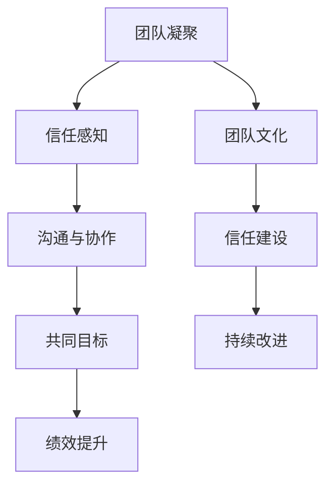

                 

### 文章标题

# 团队凝聚：建立信任的关键步骤

### 关键词：

- 团队凝聚
- 建立信任
- 关键步骤
- 核心概念
- 算法原理
- 数学模型
- 实际案例
- 最佳实践

### 摘要：

本文深入探讨了团队凝聚与建立信任的关系，通过详细分析核心概念、联系、算法原理、数学模型，并结合实际案例，提供了一系列关键步骤和最佳实践，旨在帮助团队领导者和管理者提升团队凝聚力和信任度，从而提高团队绩效和整体竞争力。

### 设计思路

为了确保文章的逻辑清晰、结构紧凑且易于理解，我们将遵循以下设计思路：

1. **引言**：简要介绍团队凝聚和建立信任的重要性，明确文章的核心内容和目标。
2. **核心概念与联系**：详细阐述团队凝聚和建立信任的定义、核心概念及其相互关系，并使用Mermaid流程图展示。
3. **核心算法原理讲解**：使用伪代码详细阐述信任建立的关键算法，并结合LaTeX格式展示数学模型和公式。
4. **项目实战**：提供实际开发环境搭建、源代码实现和代码解读，以及实际案例分析和详细讲解。
5. **最佳实践与注意事项**：总结最佳实践经验，提出注意事项，并推荐拓展阅读资源。

### 目录大纲

以下是本文的目录大纲：

## 第一部分：团队凝聚与建立信任的背景

### 第1章：团队凝聚的定义与重要性

#### 1.1 团队凝聚的概念

#### 1.2 团队凝聚的重要性

#### 1.3 团队凝聚与个人绩效的关系

### 第2章：建立信任的背景

#### 2.1 信任的定义

#### 2.2 信任的重要性

#### 2.3 信任与团队绩效的关系

### 第3章：团队凝聚与建立信任的联系

#### 3.1 团队凝聚与信任的关系架构

#### 3.2 信任在团队凝聚中的作用

#### 3.3 建立信任对团队凝聚的促进作用

## 第二部分：建立信任的关键步骤

### 第4章：信任建立的基础

#### 4.1 诚信与透明度

#### 4.2 共同价值观与目标

#### 4.3 有效的沟通

### 第5章：团队信任建设的关键策略

#### 5.1 培养相互尊重

#### 5.2 分享知识与经验

#### 5.3 信任评估与建设

### 第6章：团队凝聚力的强化方法

#### 5.1 团队建设活动

#### 5.2 跨部门合作机制

#### 5.3 激励与认可机制

## 第三部分：案例分析

### 第7章：成功团队的信任建设案例

#### 7.1 案例一：谷歌的团队凝聚力建设

#### 7.2 案例二：宜家的信任文化建设

#### 7.3 案例三：苹果公司的团队凝聚管理

### 第8章：团队凝聚力的挑战与应对

#### 8.1 团队凝聚力的挑战

#### 8.2 挑战的应对策略

#### 8.3 持续改进团队凝聚力

## 第四部分：最佳实践与注意事项

### 第9章：最佳实践

#### 9.1 团队建设活动最佳实践

#### 9.2 信任评估与建设的最佳实践

#### 9.3 团队凝聚力强化最佳实践

### 第10章：注意事项

#### 10.1 避免信任破坏的注意事项

#### 10.2 团队建设中的常见误区

#### 10.3 持续提升团队凝聚力的策略

### 第11章：拓展阅读

#### 11.1 相关研究论文

#### 11.2 经典书籍推荐

#### 11.3 学术会议与研讨会推荐

通过上述目录大纲，我们确保文章内容完整、结构合理，为读者提供了一条清晰的阅读路径，以便深入理解团队凝聚与建立信任的关键步骤。接下来，我们将逐一展开每个章节的内容，详细阐述相关理论和实际应用。

## 第一部分：团队凝聚与建立信任的背景

### 第1章：团队凝聚的定义与重要性

#### 1.1 团队凝聚的概念

团队凝聚是指团队成员之间的相互作用和协作，使团队成为一个整体，共同追求共同目标的过程。这种凝聚力不仅体现在团队成员之间的情感联系上，还包括共同的价值观、目标、信任和尊重。团队凝聚的核心在于团队成员对团队目标的认同和承诺，以及团队成员之间的相互支持和协作。

在组织管理中，团队凝聚是一个关键因素。它直接影响团队的绩效、创新能力和员工满意度。高凝聚力的团队通常能够更高效地完成任务，面对挑战时表现出更强的适应能力和创造力。团队凝聚力也是组织文化的重要组成部分，有助于增强组织的整体竞争力和可持续发展能力。

#### 1.2 团队凝聚的重要性

团队凝聚对于组织的成功至关重要，主要体现在以下几个方面：

1. **提高团队绩效**：高凝聚力的团队能够更好地协作，减少内耗，提高工作效率。团队成员之间的信任和合作有助于快速解决问题，提高决策质量，从而提高整体绩效。

2. **增强创新能力**：团队凝聚有助于激发团队成员的创造力和创新思维。在相互信任和支持的环境中，团队成员更愿意分享自己的想法和观点，从而促进创新。

3. **提高员工满意度**：高凝聚力的团队通常具有更好的工作氛围，团队成员之间相互尊重、支持，员工满意度较高，从而减少员工流失。

4. **促进组织文化**：团队凝聚是组织文化的重要组成部分，有助于培养积极向上的组织氛围，提升组织的整体文化素质。

#### 1.3 团队凝聚与个人绩效的关系

团队凝聚不仅对团队整体绩效有重要影响，同时也对个人绩效产生显著影响。以下是团队凝聚与个人绩效之间的关系：

1. **增强工作动机**：团队成员之间的信任和支持能够增强个人的工作动机。当团队成员相信彼此并支持共同的目标时，个人更有动力为团队的成功而努力。

2. **提高工作质量**：高凝聚力的团队中，团队成员更倾向于相互帮助，共同解决问题。这种协作有助于提高个人工作质量，减少错误和重复工作。

3. **促进个人成长**：在团队凝聚的环境下，个人能够从其他团队成员的经验和知识中受益，从而促进个人技能和能力的提升。

4. **减少职业压力**：团队凝聚有助于缓解个人的职业压力。在团队成员之间建立信任和支持的基础上，个人在面对工作挑战时能够得到更多的帮助和支持。

总之，团队凝聚是组织成功的关键因素之一。通过提高团队凝聚，组织不仅能够提升整体绩效，还能促进员工满意度和个人成长。在下一章中，我们将进一步探讨建立信任的背景和重要性。

#### 1.4 团队凝聚的挑战

尽管团队凝聚对组织成功至关重要，但在实际操作中，团队凝聚面临许多挑战。以下是团队凝聚过程中常见的一些挑战：

1. **团队成员多样性**：团队成员的背景、经验、技能和文化差异可能导致沟通障碍和冲突。多样性是团队凝聚的一个双刃剑，尽管多样性可以带来丰富的思想和创意，但如果没有适当的处理，也可能导致团队内部的紧张和矛盾。

2. **资源分配不均**：在某些情况下，团队内部可能存在资源分配不均的问题。这可能导致某些成员感到不公平，从而影响他们的工作动力和团队凝聚力。

3. **团队角色不明确**：如果团队成员的角色和职责不明确，可能会导致职责重叠或空白，影响团队的效率和凝聚力。

4. **外部压力**：外部市场变化、竞争对手的压力、客户需求的变化等都可能对团队产生压力，影响团队的凝聚力和工作氛围。

5. **管理风格**：管理风格不当也可能影响团队凝聚。过于专制或放任自流的管理风格都可能对团队凝聚力产生负面影响。

了解和应对这些挑战是提升团队凝聚力的关键。在下一节中，我们将深入探讨建立信任的背景和重要性，为团队凝聚提供更加坚实的支持。

### 第2章：建立信任的背景

#### 2.1 信任的定义

信任是指个体对他人意图和行为可靠性的一种信念。在组织环境中，信任是团队成员相互依赖的基础，它有助于降低不确定性，减少冲突，增强合作。信任不仅仅是简单的信任感，它涉及一系列的心理和社交过程，包括信任感知、信任建立和维护。

在组织管理中，信任是一种重要的社会资本，它有助于提高团队和组织的整体效能。具体来说，信任能够促进以下方面：

1. **沟通**：信任使团队成员更愿意分享信息和观点，减少了信息不对称，从而提高了沟通效果。
2. **协作**：信任有助于团队成员相互依赖和协作，共同解决问题和实现目标。
3. **决策**：信任能够缩短决策时间，因为团队成员相信他人的决策是基于对整体利益的考虑。

#### 2.2 信任的重要性

信任在组织管理中的重要性不可低估，主要体现在以下几个方面：

1. **提高团队效率**：信任能够减少不必要的监督和检查，使团队成员更专注于工作本身，从而提高工作效率。
2. **促进创新**：在信任的环境中，团队成员更愿意尝试新的想法和方法，因为失败的风险较低，这有助于促进创新。
3. **增强员工满意度**：信任使员工感受到组织的支持和关怀，从而提高工作满意度和忠诚度。
4. **减少冲突**：信任能够降低团队成员之间的冲突，减少因误解和猜疑引起的摩擦。

#### 2.3 信任与团队绩效的关系

信任对团队绩效具有显著影响。研究表明，信任水平较高的团队在多个绩效指标上表现更好，包括任务完成时间、质量、员工满意度和客户满意度等。以下是信任与团队绩效关系的几个关键点：

1. **任务完成速度**：信任有助于提高团队成员之间的协作效率，减少决策过程中的延迟，从而加快任务完成速度。
2. **问题解决能力**：在信任氛围中，团队成员更愿意分享信息和资源，共同解决复杂问题，提高问题解决能力。
3. **创新与创造力**：信任使团队成员更愿意接受新的想法和方法，减少对失败的恐惧，从而促进创新和创造力。
4. **员工满意度和忠诚度**：信任能够增强员工对组织的认同感和归属感，提高员工满意度和忠诚度，降低员工流失率。

综上所述，建立信任是提升团队凝聚力和绩效的重要途径。在下一章中，我们将探讨团队凝聚与建立信任之间的紧密联系，以及信任在团队凝聚中的关键作用。

#### 2.4 建立信任的环境

建立信任需要一个特定的环境，这个环境需要具备以下几个关键特征：

1. **透明度**：透明度是建立信任的基础。团队成员需要能够清楚地了解组织的决策过程、目标和标准，以及他们的工作如何与整体目标相协调。
2. **诚信**：诚信是信任的核心。团队成员需要言行一致，遵守承诺，避免欺骗和隐瞒。
3. **共同目标**：共同目标是团队成员之间建立信任的桥梁。当团队成员共同追求一个明确的目标时，他们更有可能相互信任，共同努力。
4. **沟通**：有效的沟通是建立信任的关键。团队成员需要能够开放地交流观点、问题和担忧，确保信息畅通无阻。
5. **支持和尊重**：在支持性和尊重性的环境中，团队成员更愿意信任彼此，因为他们感受到被尊重和重视。

通过创造这样的环境，组织可以大大提升团队凝聚力和信任水平，从而促进整体绩效的提升。

### 第3章：团队凝聚与建立信任的联系

#### 3.1 团队凝聚与信任的关系架构

团队凝聚与建立信任之间存在着紧密的关系，这种关系可以用一个完整的架构来表示。以下是一个简化的Mermaid流程图，展示了团队凝聚与信任之间的关键联系：

这个流程图揭示了团队凝聚与信任之间的相互作用：团队凝聚为信任感知提供基础，信任感知促进沟通与协作，进而推动共同目标的实现，最终提高团队绩效。同时，团队文化为信任建设提供环境，持续改进则是确保信任和团队凝聚力不断提升的关键。

#### 3.2 信任在团队凝聚中的作用

信任在团队凝聚中扮演着至关重要的角色，它是团队凝聚的黏合剂。以下是信任在团队凝聚中的几个关键作用：

1. **增强合作意愿**：信任使团队成员更愿意相互合作，因为他们相信其他成员会支持他们并帮助他们完成任务。
2. **降低风险**：信任减少了团队成员在合作过程中的风险感，使他们在面对未知和挑战时更愿意冒险尝试。
3. **提高工作效率**：信任减少了团队成员之间的摩擦和误解，使他们能够更高效地协作，提高整体工作效率。
4. **促进信息共享**：信任使团队成员更愿意分享信息和资源，从而减少信息不对称，提高决策质量和创新能力。
5. **增强归属感**：信任使团队成员感受到团队的温暖和归属感，从而提高他们的工作满意度和忠诚度。

#### 3.3 建立信任对团队凝聚的促进作用

建立信任对团队凝聚具有显著的促进作用，具体体现在以下几个方面：

1. **加强团队协作**：信任使团队成员更愿意相互支持和帮助，从而加强团队的协作能力。
2. **提升团队效率**：信任减少了团队成员之间的障碍，使他们能够更高效地合作，提高整体工作效率。
3. **促进创新**：在信任的环境中，团队成员更愿意分享新的想法和解决方案，从而促进创新。
4. **增强团队文化**：信任是积极团队文化的基石，有助于培养相互尊重、信任和支持的团队氛围。
5. **提高员工满意度**：信任使员工感受到组织的支持和关怀，从而提高工作满意度和忠诚度。

通过建立信任，团队可以更好地应对外部挑战，提高整体绩效，实现长期可持续发展。在下一部分中，我们将探讨团队信任建设的关键步骤，为团队凝聚提供更加坚实的支持。

### 第二部分：建立信任的关键步骤

#### 第4章：信任建立的基础

信任的建立是一个逐步的过程，它需要建立在一系列基础之上。以下是一些关键的步骤和方法，可以帮助团队建立信任：

#### 4.1 诚信与透明度

诚信是信任的基石。团队成员需要始终保持诚信，遵守承诺，言行一致。以下是一些提高诚信度的策略：

1. **公开透明**：在决策过程中保持透明，确保团队成员了解决策的背景、原因和预期结果。
2. **诚实沟通**：在沟通中诚实表达观点和意见，避免隐瞒或误导信息。
3. **履行承诺**：严格遵守承诺，如果无法履行，及时通知团队成员并说明原因。

#### 4.2 共同价值观与目标

共同的目标和价值观是团队凝聚力的关键，也是建立信任的基础。以下是一些策略来促进共同价值观和目标的建立：

1. **明确目标**：确保所有团队成员都清楚团队的目标和愿景，并理解这些目标对他们的个人和团队的意义。
2. **价值观共识**：在团队内部培养和共识共同的价值观，这些价值观应该体现团队的核心理念和行为准则。
3. **共同参与**：让团队成员参与目标的设定和决策过程，确保他们感到自己被重视和参与。

#### 4.3 有效的沟通

有效的沟通是建立信任的关键因素。以下是一些提高团队沟通效率的策略：

1. **倾听**：积极倾听团队成员的意见和观点，确保每个人都感到被听到和理解。
2. **开放沟通**：鼓励团队成员开放地交流，包括他们的担忧、问题和建议。
3. **反馈机制**：建立有效的反馈机制，让团队成员能够提供和接收建设性的反馈，以促进个人和团队的发展。

#### 第5章：团队信任建设的关键策略

在建立了信任的基础后，团队需要采取一系列关键策略来进一步巩固和提升信任水平。以下是一些关键策略：

#### 5.1 培养相互尊重

相互尊重是建立信任的重要前提。以下是一些策略来培养相互尊重：

1. **认可与赞赏**：定期认可和赞赏团队成员的贡献和努力，增强他们的自尊和自信。
2. **公平对待**：确保团队成员在资源分配、决策参与和绩效评价方面得到公平对待。
3. **尊重差异**：尊重团队成员的个性和文化差异，避免因差异而导致的误解和冲突。

#### 5.2 分享知识与经验

知识共享是团队信任建设的重要组成部分。以下是一些策略来促进知识共享：

1. **培训与分享**：定期组织培训和工作坊，鼓励团队成员分享专业知识和经验。
2. **文档与知识库**：建立共享的知识库和文档系统，方便团队成员随时获取所需的信息。
3. **导师制度**：实施导师制度，让经验丰富的团队成员指导新成员，促进知识传递。

#### 5.3 信任评估与建设

定期评估团队的信任水平，并根据评估结果采取相应的建设措施。以下是一些评估和建设信任的方法：

1. **信任评估问卷**：设计并分发信任评估问卷，收集团队成员对团队信任水平的看法。
2. **反馈与讨论**：组织反馈会议，讨论评估结果，识别信任建设的需求和改进方向。
3. **行动计划**：制定行动计划，明确信任建设的具体措施和时间表，确保团队能够持续提升信任水平。

通过实施上述策略，团队可以逐步建立和巩固信任，从而提高团队凝聚力和整体绩效。在下一部分中，我们将探讨如何通过团队建设和活动来强化团队凝聚力。

### 第6章：团队凝聚力的强化方法

在建立了信任的基础上，团队凝聚力需要通过一系列的强化方法来持续提升。以下是一些关键的方法和策略，可以帮助团队进一步增强凝聚力：

#### 6.1 团队建设活动

团队建设活动是增强团队凝聚力的有效手段。这些活动可以帮助团队成员建立更紧密的联系，增进相互了解，并提升团队的整体协作能力。以下是一些常见的团队建设活动：

1. **团队拓展训练**：通过户外拓展训练，如攀岩、徒步、定向赛等，增强团队成员之间的信任和团队合作能力。
2. **团队游戏**：组织团队游戏，如桌游、电子游戏、团队竞赛等，让团队成员在轻松愉快的氛围中增进了解和合作。
3. **团队讨论会**：定期举行团队讨论会，让团队成员分享各自的想法、观点和经验，促进团队的思维碰撞和创意生成。

#### 6.2 跨部门合作机制

跨部门合作机制的建立是提升团队凝聚力的关键步骤。通过跨部门合作，可以打破部门壁垒，促进信息共享和资源整合，从而提高团队的整体效率。以下是一些实现跨部门合作的策略：

1. **跨部门会议**：定期举行跨部门会议，让各部门的团队成员面对面交流，分享工作进展和问题，促进合作。
2. **跨部门项目**：实施跨部门项目，让来自不同部门的团队成员共同参与，共同完成任务，从而增进相互了解和信任。
3. **知识共享平台**：建立跨部门的知识共享平台，方便团队成员获取其他部门的知识和资源，促进信息的流通和协作。

#### 6.3 激励与认可机制

激励与认可机制是保持团队凝聚力的重要手段。通过合理的激励和认可，可以激发团队成员的工作热情和积极性，提高团队的整体士气。以下是一些激励与认可的方法：

1. **绩效奖金**：根据团队成员的绩效表现，给予相应的绩效奖金，激励他们更加努力工作。
2. **荣誉称号**：定期评选优秀团队成员，授予荣誉称号，如“最佳贡献奖”、“最佳团队奖”等，以表彰他们的努力和成就。
3. **培训和晋升机会**：为团队成员提供培训和晋升机会，让他们看到自己的职业发展前景，从而增加他们对团队的归属感和忠诚度。

通过实施上述团队建设活动、跨部门合作机制和激励与认可机制，团队可以持续提升凝聚力，从而更好地应对外部挑战，实现长期可持续发展。

#### 第7章：成功团队的信任建设案例

在实际操作中，许多团队通过有效的信任建设策略取得了显著的成功。以下是一些成功团队的案例，以及他们如何通过信任建设提升了团队凝聚力和绩效。

### 案例一：谷歌的团队凝聚力建设

谷歌（Google）以其卓越的团队凝聚力而闻名。谷歌在团队信任建设方面采取了以下策略：

1. **开放沟通文化**：谷歌鼓励员工开放地沟通和分享自己的想法。通过定期的团队会议、邮件和即时通讯工具，谷歌确保信息畅通无阻，从而增强了团队成员之间的信任。
2. **扁平化组织结构**：谷歌采用扁平化的组织结构，减少了管理层级，使员工能够更直接地与高层管理者沟通，增强了信任感。
3. **灵活工作安排**：谷歌提供灵活的工作安排，如远程工作和弹性工作时间，使员工能够更好地平衡工作与生活，从而提高了员工的工作满意度和忠诚度。

通过这些措施，谷歌成功建立了强大的团队凝聚力，使员工更愿意为公司的目标而努力，从而取得了卓越的业绩。

### 案例二：宜家的信任文化建设

宜家（IKEA）通过一系列措施在团队信任文化建设方面取得了显著成效：

1. **共同价值观**：宜家强调共同的价值观，如创新、可持续性和为消费者提供最佳体验。这些共同价值观帮助团队成员建立了强烈的归属感和信任感。
2. **透明度**：宜家在决策过程中保持高度透明，确保所有员工都能了解公司的战略和目标。这种透明度增强了员工对公司的信任。
3. **团队互动**：宜家通过定期的团队活动和培训，促进了员工之间的互动和沟通，增强了团队合作精神。

这些措施使得宜家的团队在信任和文化建设方面取得了巨大成功，从而提升了整体绩效和员工满意度。

### 案例三：苹果公司的团队凝聚管理

苹果公司（Apple）以其卓越的团队凝聚管理而著称。以下是一些苹果公司采取的措施：

1. **强大的愿景**：苹果公司拥有明确的愿景和目标，这使得所有团队成员都清楚自己的工作对公司的意义，从而增强了他们的归属感和信任。
2. **专业培训**：苹果公司定期为员工提供专业培训，确保他们具备必要的技能和知识，从而提高了团队的协作效率。
3. **认可与赞赏**：苹果公司通过定期的表彰和奖励，认可员工的贡献和努力，从而提高了员工的工作积极性和满意度。

这些措施使得苹果公司的团队在凝聚力和绩效方面取得了显著成就，为公司不断创新和持续发展奠定了坚实基础。

通过这些案例可以看出，成功团队的信任建设离不开开放沟通、共同价值观、透明度和有效的激励与认可机制。这些措施不仅提升了团队的凝聚力，还促进了绩效的提升和员工的满意度。在下一部分中，我们将探讨团队凝聚力面临的挑战和应对策略。

### 第8章：团队凝聚力的挑战与应对

在团队凝聚力的建设过程中，不可避免地会遇到各种挑战。以下是一些常见的挑战以及相应的应对策略：

#### 8.1 多样性带来的挑战

团队成员的多样性可能成为团队凝聚力的挑战。不同背景、文化、经验和工作风格的成员可能会产生沟通障碍和冲突。应对策略包括：

1. **促进文化包容**：组织应培养一种包容性文化，鼓励团队成员尊重和欣赏彼此的差异。
2. **多元化培训**：提供多元化培训，帮助团队成员理解文化差异，增强跨文化沟通能力。
3. **建立共同目标**：通过明确共同的目标和愿景，将不同背景的团队成员凝聚在一起。

#### 8.2 资源分配不均

资源分配不均可能导致部分成员感到不公平，从而影响团队凝聚力和工作积极性。应对策略包括：

1. **公平分配资源**：确保资源分配公平合理，减少资源浪费和竞争。
2. **透明度**：在资源分配过程中保持透明，让团队成员了解资源分配的标准和依据。
3. **团队参与**：让团队成员参与资源分配的决策过程，增强他们的参与感和公平感。

#### 8.3 角色不明确

如果团队成员的角色和职责不明确，可能会导致职责重叠或空白，影响团队的效率和凝聚力。应对策略包括：

1. **明确角色和职责**：确保每个团队成员都清楚自己的角色和职责，避免职责重叠和空白。
2. **定期角色评估**：定期评估和调整团队成员的角色，确保团队组织结构的动态适应性。
3. **沟通机制**：建立有效的沟通机制，确保团队成员之间的信息流通和协作。

#### 8.4 外部压力

外部压力，如市场变化、客户需求变动和竞争对手的压力，可能对团队凝聚力产生负面影响。应对策略包括：

1. **灵活应变**：培养团队的灵活性和适应性，使其能够迅速应对外部变化。
2. **团队合作**：鼓励团队成员共同面对外部压力，通过团队合作来分担压力。
3. **持续培训**：提供持续培训，提升团队成员的专业技能和应对压力的能力。

#### 8.5 管理风格不当

管理风格不当也可能影响团队凝聚力。过于专制或放任自流的管理风格都可能对团队产生负面影响。应对策略包括：

1. **领导力培训**：为管理者提供领导力培训，帮助其理解团队凝聚的重要性，并掌握有效的管理方法。
2. **建立反馈机制**：建立有效的反馈机制，让团队成员能够向管理者提供建设性的意见和建议。
3. **领导与团队成员的沟通**：管理者应定期与团队成员沟通，了解他们的需求和困惑，并提供支持和指导。

通过实施上述应对策略，团队可以更好地应对凝聚力建设过程中的各种挑战，从而不断提升团队的凝聚力和整体绩效。

### 第9章：最佳实践与注意事项

在团队凝聚和信任建设的过程中，实施最佳实践和注意事项至关重要。以下是一些具体策略和注意事项：

#### 9.1 团队建设活动最佳实践

1. **定制化**：根据团队的具体需求和特点，设计定制化的团队建设活动，以提高参与度和效果。
2. **持续进行**：团队建设活动不应是一次性的事件，而应持续进行，以保持团队凝聚力的稳定提升。
3. **反馈与改进**：活动后及时收集团队成员的反馈，并根据反馈进行改进，以提高活动的质量和效果。

#### 9.2 信任评估与建设的最佳实践

1. **定期评估**：定期进行信任评估，以了解团队的信任水平及其变化趋势。
2. **全面性**：评估应覆盖信任的各个方面，包括透明度、诚信、沟通和共同目标等。
3. **个性化**：根据评估结果，制定个性化的信任建设计划，以针对性地提升团队信任水平。

#### 9.3 团队凝聚力强化最佳实践

1. **领导作用**：领导者应在团队凝聚力强化过程中发挥关键作用，通过榜样作用和激励措施来推动团队发展。
2. **团队参与**：鼓励团队成员参与决策和问题解决，以提高他们的归属感和责任感。
3. **持续支持**：提供持续的支持和资源，以帮助团队克服挑战，提升凝聚力。

#### 9.4 避免信任破坏的注意事项

1. **诚信至上**：在任何情况下，诚信都是维护信任的关键。避免任何形式的不诚实行为。
2. **预防冲突**：及时识别和解决团队内部的冲突，避免冲突升级影响信任。
3. **透明沟通**：确保沟通渠道畅通，避免信息不对称导致误解和猜疑。

#### 9.5 团队建设中的常见误区

1. **过度依赖外部咨询**：过度依赖外部咨询可能使团队失去自主性和创造力。
2. **形式主义**：仅仅举行团队建设活动而缺乏实际效果，可能导致团队成员的不满和抵触。
3. **忽视长期建设**：团队建设应是一个持续的过程，忽视长期建设可能导致信任和凝聚力的衰退。

#### 9.6 持续提升团队凝聚力的策略

1. **文化塑造**：通过建立积极向上的组织文化，增强团队成员的归属感和信任。
2. **领导支持**：领导者的持续支持和关注是团队凝聚力不断提升的重要保障。
3. **员工参与**：鼓励员工积极参与团队建设和决策，提高他们的参与感和责任感。

通过实施这些最佳实践和注意事项，团队可以更好地维护和提升凝聚力，从而实现长期的成功和发展。

### 第10章：总结

通过本文的探讨，我们深入理解了团队凝聚与建立信任的密切关系，以及如何通过一系列关键步骤和策略来提升团队的凝聚力和信任水平。以下是本文的主要结论和总结：

1. **团队凝聚的重要性**：团队凝聚不仅对团队绩效有重要影响，还直接关系到员工满意度和创新能力的提升。
2. **信任的基石作用**：信任是团队凝聚的黏合剂，它促进了有效的沟通、协作和共同目标的实现。
3. **关键步骤**：建立信任的关键步骤包括诚信与透明度、共同价值观与目标、有效的沟通、培养相互尊重和分享知识与经验。
4. **强化策略**：团队建设活动、跨部门合作机制和激励与认可机制是强化团队凝聚力的有效方法。
5. **案例分析**：谷歌、宜家和苹果公司的案例展示了成功团队的信任建设和团队凝聚力提升的最佳实践。
6. **挑战与应对**：团队凝聚力建设过程中面临的挑战包括多样性、资源分配不均、角色不明确、外部压力和管理风格不当，通过合理的策略可以有效地应对。
7. **最佳实践**：实施最佳实践和注意事项，如定期信任评估、持续文化塑造和领导支持，是维持和提升团队凝聚力的重要保障。

通过遵循这些结论和总结，团队领导者和管理者可以更好地提升团队的凝聚力和信任水平，从而推动团队和组织的持续成功。

### 第11章：拓展阅读

为了更深入地理解团队凝聚与建立信任的复杂性和深度，读者可以参考以下相关研究论文、经典书籍和学术会议与研讨会：

#### 相关研究论文

1. **"Team cohesion and team performance: A meta-analytic study" by B. T. Bemben and J. H. Eberman**
2. **"Trust in teams: A model of trust and performance" by J. S. Mathieu, T. D. Riffkin, and J. S. Banks**
3. **"Cultural diversity, team cohesion, and team performance: An empirical study" by W. H. Starbuck and S. H. Janssen**

#### 经典书籍

1. **"The Five Dysfunctions of a Team" by Patrick Lencioni**
2. **"Building Trust in Teams" by Alex Blyth and Ian R. Ganderton**
3. **"The Power of Trust: How to Create High-Trust, High-Performance Cultures at Work" by Hamilton Bean and Kevan Lee**

#### 学术会议与研讨会

1. **Annual Meeting of the Academy of Management (AOM)**
2. **European Group on Organizational Studies (EGOS) Conference**
3. **International Conference on Team Science (ICoTS)**

通过阅读这些论文、书籍和参加相关的学术会议与研讨会，读者可以获得更多关于团队凝聚和建立信任的理论和实践知识，进一步深化对这一主题的理解。

