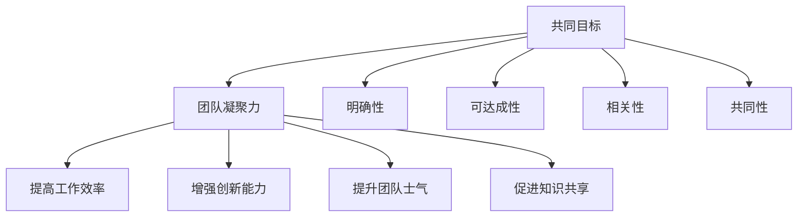
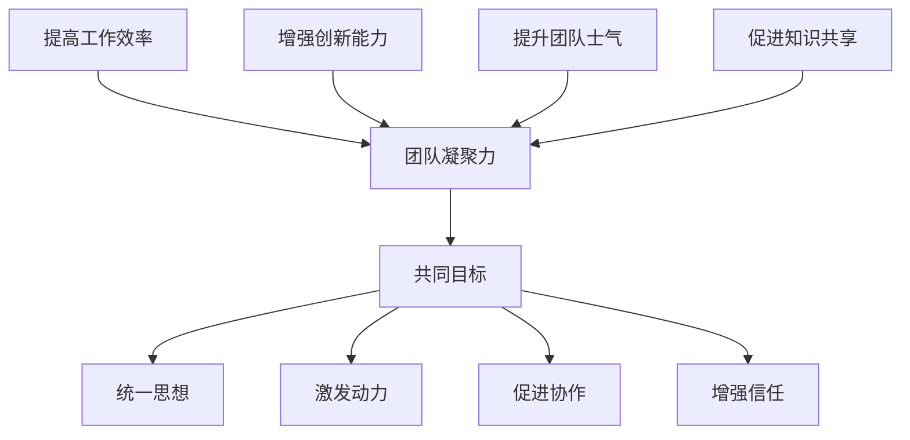
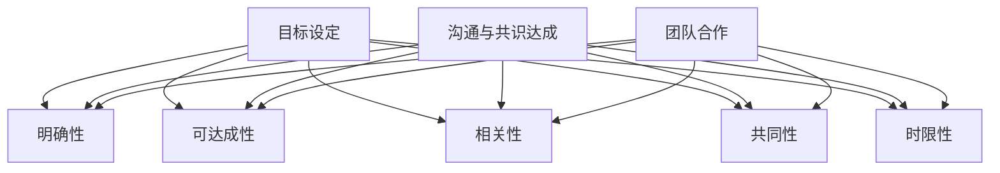
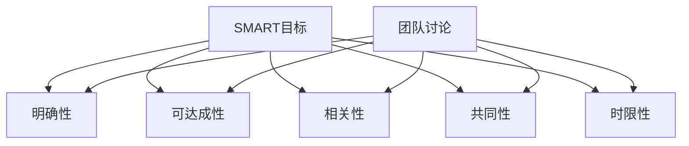
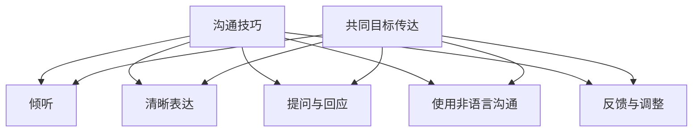
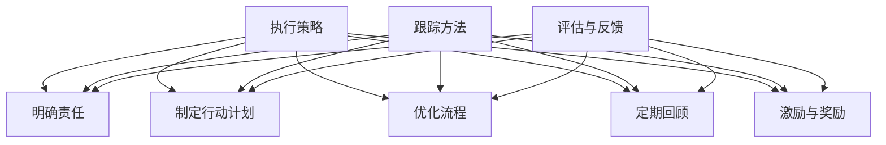
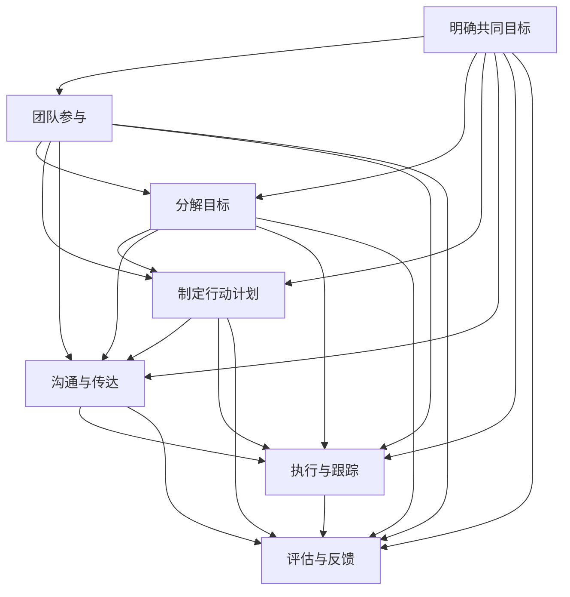

                 

### 第1章：引言与概述

#### 1.1 团队凝聚的重要性

在当今的快速发展的科技时代，团队凝聚力已成为企业成功的关键因素之一。团队凝聚力指的是团队成员之间的相互信任、协作和支持的程度。一个凝聚力强的团队，能够在面对挑战和困难时保持稳定，发挥出更大的潜能。

团队凝聚的重要性主要体现在以下几个方面：

1. **提高工作效率**：凝聚力强的团队，成员之间相互理解，协作顺畅，能够迅速达成共识，减少内部摩擦，从而提高整体工作效率。

2. **增强创新能力**：团队成员在相互信任和尊重的氛围中，更容易提出新的想法和创意，促进创新。

3. **提升团队士气**：凝聚力强的团队，成员之间互相支持，能够激发出更高的工作热情和积极性。

4. **促进知识共享**：团队成员在共同目标下，更愿意分享知识和经验，促进团队的共同成长。

#### 1.2 共同目标的概念

共同目标是指团队成员共同认同并追求的目标。它不仅是团队前进的方向，更是团队成员之间协作的动力。

共同目标具有以下几个特点：

1. **明确性**：共同目标应该是清晰、具体的，避免模糊和抽象。

2. **可达成性**：共同目标应该是可实现的，激发团队成员的信心和动力。

3. **相关性**：共同目标应该与团队成员的个人目标相结合，实现个人与团队的共同发展。

4. **共同性**：共同目标需要得到团队成员的共同认同，成为团队共同努力的方向。

#### 1.3 本书的结构

本书旨在探讨如何通过建立共同目标来提升团队凝聚力。全书分为八个章节，包括引言与概述、团队凝聚与共同目标、建立共同目标的原则、共同目标的制定方法、共同目标的沟通与传达、共同目标的执行与跟踪、案例分析以及总结与展望。

接下来，我们将详细讨论每个章节的内容，帮助读者深入理解如何通过建立共同目标来提升团队凝聚力。

### Mermaid 流程图

以下是一个简单的 Mermaid 流程图，展示共同目标与团队凝聚力之间的关系：

### 第2章：团队凝聚与共同目标

#### 2.1 团队凝聚的定义

团队凝聚力是指团队成员之间相互吸引、相互依赖、相互支持和相互信任的程度。它是一个团队内部力量，使得团队成员能够共同面对挑战、解决问题并实现共同目标。

团队凝聚力的特征包括：

1. **相互信任**：团队成员之间相互信任，能够相信对方的能力和诚信。

2. **相互依赖**：团队成员认识到彼此的重要性和依赖性，愿意为团队的整体利益付出努力。

3. **相互支持**：团队成员在遇到困难和挑战时，能够相互支持和帮助，共同克服困难。

4. **相互尊重**：团队成员之间相互尊重，尊重彼此的意见和贡献。

#### 2.2 团队凝聚的重要性

团队凝聚力对团队的成功和效率具有显著的影响，主要表现在以下几个方面：

1. **提高工作效率**：凝聚力强的团队，成员之间协作顺畅，能够迅速达成共识，减少内部摩擦，从而提高整体工作效率。

2. **增强创新能力**：团队成员在相互信任和尊重的氛围中，更容易提出新的想法和创意，促进创新。

3. **提升团队士气**：凝聚力强的团队，成员之间互相支持，能够激发出更高的工作热情和积极性。

4. **促进知识共享**：团队成员在共同目标下，更愿意分享知识和经验，促进团队的共同成长。

#### 2.3 共同目标与团队凝聚的关系

共同目标在团队凝聚力中起着关键的作用。一个明确的共同目标能够：

1. **统一思想**：共同目标有助于团队成员在思想和行动上保持一致，形成共同的方向。

2. **激发动力**：共同目标能够激发团队成员的工作热情和积极性，推动团队向前发展。

3. **促进协作**：共同目标需要团队成员共同实现，从而促进团队成员之间的协作和合作。

4. **增强信任**：共同目标的实现需要团队成员相互依赖和相互支持，从而增强团队成员之间的信任。

#### 关系架构 Mermaid 流程图

以下是一个简单的 Mermaid 流�程图，展示共同目标与团队凝聚之间的关系：

### 第3章：建立共同目标的原则

#### 3.1 目标设定的基本原则

建立共同目标需要遵循一些基本原则，以确保目标的有效性和可行性。以下是几个关键原则：

1. **明确性**：共同目标应该是清晰、具体的，避免模糊和抽象。明确的目标有助于团队成员更好地理解和追求。

2. **可达成性**：共同目标应该是可实现的，激发团队成员的信心和动力。目标过高可能会导致失望和挫败感。

3. **相关性**：共同目标应该与团队成员的个人目标相结合，实现个人与团队的共同发展。相关性强的目标能够更好地激发团队成员的积极性。

4. **共同性**：共同目标需要得到团队成员的共同认同，成为团队共同努力的方向。共同性的目标有助于增强团队的凝聚力和合作。

5. **时限性**：共同目标应该有时间限制，以激发团队成员的紧迫感和动力。目标完成的时间限制有助于提高工作效率和执行力。

#### 3.2 沟通与共识达成

建立共同目标的过程中，沟通是至关重要的。以下是几个关键点：

1. **开放的沟通**：团队成员应该开放地表达自己的观点和想法，促进信息的流通。

2. **倾听与理解**：团队成员应该倾听他人的意见，理解他人的需求和期望，从而形成共识。

3. **共同讨论**：团队成员应该共同参与目标的设定和讨论，确保目标能够得到全体成员的认同。

4. **达成共识**：通过沟通和讨论，团队成员应该达成共识，确保共同目标的实现。

#### 3.3 团队合作的重要性

团队合作是建立共同目标的关键因素。以下是几个关键点：

1. **明确角色**：团队成员应该明确自己的角色和职责，确保各自的任务能够高效完成。

2. **相互支持**：团队成员应该相互支持，帮助对方克服困难和挑战，共同实现目标。

3. **共享资源**：团队成员应该共享资源和信息，提高整体工作效率。

4. **相互信任**：团队成员之间应该建立相互信任的关系，增强团队的凝聚力。

#### 原则关系架构 Mermaid 流程图

以下是一个简单的 Mermaid 流程图，展示目标设定、沟通与共识达成、团队合作之间的关系：

### 第4章：共同目标的制定方法

#### 4.1 SMART目标

SMART目标是制定共同目标的一种有效方法，它确保目标具有明确性、可达成性、相关性、共同性和时限性。SMART目标的具体含义如下：

1. **明确性（Specific）**：目标应该是明确和具体的，避免模糊和抽象。例如，“提高销售额”不如“在下一个季度内提高10%的销售额”具体。

2. **可达成性（Measurable）**：目标应该是可度量的，能够明确判断是否实现。例如，“实现业务增长”不如“实现年营收增长20%”可衡量。

3. **相关性（Achievable）**：目标应该是可实现的，激发团队成员的信心和动力。例如，“在一年内实现月销售额突破100万”对于初创企业可能过于激进。

4. **共同性（Relevant）**：目标应该与团队成员的个人目标和团队目标相结合，实现个人与团队的共同发展。例如，“提高团队技术水平”与成员的职业发展密切相关。

5. **时限性（Time-bound）**：目标应该有时间限制，以激发团队成员的紧迫感和动力。例如，“在未来三个月内完成项目A”比没有时间限制的目标更有激励作用。

#### 4.2 团队讨论

团队讨论是制定共同目标的重要环节，它有助于团队成员共同参与、共同决策，确保目标的合理性和可行性。以下是团队讨论的几个关键步骤：

1. **明确讨论目标**：在开始讨论前，明确讨论的主题和目的，确保团队成员对讨论的内容有共同的理解。

2. **收集意见和观点**：鼓励团队成员开放地表达自己的意见和观点，收集多方面的信息，为制定目标提供依据。

3. **分析需求和挑战**：结合团队内外部环境，分析制定目标的需求和面临的挑战，确保目标具有现实性。

4. **达成共识**：通过讨论和协商，达成对目标的共识，确保团队成员对目标的理解和认同。

5. **制定具体行动计划**：在达成共识的基础上，制定具体的行动计划，明确每个成员的责任和时间表。

#### 4.3 目标评估与调整

在制定共同目标的过程中，目标评估与调整也是至关重要的。以下是一些关键步骤：

1. **定期评估**：定期对目标进行评估，检查目标的实现进度和效果。

2. **收集反馈**：收集团队成员的反馈，了解目标实现过程中遇到的问题和挑战。

3. **调整目标**：根据评估结果和反馈，对目标进行调整，确保目标的持续性和可行性。

4. **优化行动计划**：在调整目标的基础上，优化行动计划，提高目标的实现效率。

#### SMART目标示例

以下是一个SMART目标的示例：

**目标**：在未来三个月内，提高产品A的市场占有率。

- **明确性**：产品A的市场占有率从当前的10%提高到15%。
- **可达成性**：根据市场调查和竞争分析，产品A具备提升市场占有率的基础。
- **相关性**：提高产品A的市场占有率有助于公司的整体业务增长。
- **共同性**：团队成员共同参与市场推广和销售策略的制定。
- **时限性**：目标设定为未来三个月内实现。

通过SMART目标的方法，可以帮助团队制定出具体、可衡量、可实现、相关且有时限的目标，从而提高目标的执行效率和实现概率。

### Mermaid 流程图

以下是一个简单的 Mermaid 流程图，展示SMART目标与团队讨论之间的关系：

### 第5章：共同目标的沟通与传达

#### 5.1 沟通的重要性

沟通在团队中扮演着至关重要的角色，它是建立共同目标和团队凝聚力的重要手段。有效的沟通能够确保信息的准确传递，促进团队成员之间的理解和协作，从而实现共同目标。

以下是沟通在团队中的作用：

1. **信息传递**：沟通是信息传递的桥梁，确保团队成员能够及时了解团队目标和任务。

2. **协调工作**：通过有效的沟通，团队成员可以协调各自的工作，避免重复劳动和资源浪费。

3. **解决问题**：沟通有助于团队成员共同面对和解决工作中的问题，提高工作效率。

4. **增强信任**：透明的沟通能够增强团队成员之间的信任，促进团队合作。

5. **提高士气**：良好的沟通能够激励团队成员，提高团队士气和工作热情。

#### 5.2 沟通技巧

为了确保共同目标的传达和执行，团队成员需要掌握一些基本的沟通技巧：

1. **倾听**：倾听是有效沟通的关键，团队成员应该学会倾听他人的观点和意见，理解他人的需求和期望。

2. **清晰表达**：团队成员应该能够清晰、准确地表达自己的观点和意见，避免误解和冲突。

3. **提问与回应**：在沟通过程中，团队成员应该主动提问，以澄清自己的理解，并给予积极的回应。

4. **使用非语言沟通**：除了言语沟通，非语言沟通如肢体语言、面部表情等也是非常重要的，能够增强信息的传达效果。

5. **反馈与调整**：沟通是一个双向的过程，团队成员应该及时给予反馈，并根据反馈调整自己的沟通策略。

#### 5.3 共同目标的传达

传达共同目标的关键在于确保每个团队成员都能够理解和认同这些目标。以下是几个关键步骤：

1. **明确传达**：在传达共同目标时，应该明确目标的内容、意义和期望成果，避免模糊和歧义。

2. **个性化传达**：根据不同团队成员的特点和需求，采用个性化的传达方式，确保每个成员都能够接受和理解目标。

3. **反复传达**：共同目标的传达不应该是一次性的，而应该是反复的、持续的，以确保目标的深入理解和内化。

4. **共同讨论**：在传达共同目标的过程中，应该鼓励团队成员参与讨论，共同探讨如何实现目标。

5. **记录与分享**：将共同目标记录下来，并通过各种渠道（如会议纪要、邮件、公告板等）与团队成员分享，以便随时查阅和回顾。

#### 沟通技巧关系架构 Mermaid 流程图

以下是一个简单的 Mermaid 流程图，展示沟通技巧与共同目标传达之间的关系：

### 第6章：共同目标的执行与跟踪

#### 6.1 执行策略

共同目标的执行是确保目标实现的关键步骤。为了有效地执行共同目标，团队成员需要制定一系列执行策略。以下是几个关键策略：

1. **明确责任**：将共同目标分解为具体任务，明确每个团队成员的责任和任务，确保每个人都知道自己的职责和期望。

2. **制定行动计划**：根据共同目标，制定具体的行动计划，包括任务清单、时间表和资源配置，确保目标能够按时完成。

3. **优化流程**：优化团队的工作流程，减少不必要的工作环节和流程，提高工作效率。

4. **定期回顾**：定期回顾执行进度，检查任务的完成情况，及时调整执行策略，确保目标能够顺利实现。

5. **激励与奖励**：通过激励和奖励机制，鼓励团队成员积极参与目标的执行，提高工作积极性和执行力。

#### 6.2 跟踪方法

在共同目标的执行过程中，跟踪方法是非常关键的。以下是几种有效的跟踪方法：

1. **进度报告**：定期向团队成员和领导提交进度报告，详细说明任务的完成情况、遇到的困难和需要支持的地方。

2. **项目管理工具**：使用项目管理工具（如Trello、JIRA等），记录任务进度、时间表和资源使用情况，方便团队成员随时查看和更新。

3. **团队会议**：定期召开团队会议，讨论目标的执行情况，解决遇到的问题，确保团队目标的顺利推进。

4. **关键指标监测**：设定关键指标（如销售额、客户满意度等），定期监测和评估目标的实现情况，及时调整策略。

5. **员工反馈**：收集团队成员的反馈，了解他们在执行目标过程中的感受和建议，优化执行策略。

#### 6.3 评估与反馈

评估与反馈是共同目标执行过程中的重要环节。以下是一些关键步骤：

1. **目标完成评估**：在目标完成后，对目标的实现情况进行全面评估，包括任务完成情况、时间和质量等方面的评估。

2. **团队成员反馈**：收集团队成员对目标执行过程的反馈，了解他们在执行过程中的困难和挑战，以及改进的建议。

3. **持续改进**：根据评估和反馈结果，对执行策略和流程进行持续改进，以提高未来的目标执行效率。

4. **奖励与认可**：对在目标执行过程中表现突出的团队成员给予奖励和认可，激发团队成员的工作热情和积极性。

5. **总结经验**：总结目标执行过程中的成功经验和教训，形成最佳实践，为未来的目标执行提供参考。

#### 执行与跟踪关系架构 Mermaid 流程图

以下是一个简单的 Mermaid 流程图，展示执行策略、跟踪方法、评估与反馈之间的关系：

### 第7章：案例分析：成功建立共同目标的实践

#### 7.1 案例介绍

在这个案例中，我们将探讨一个虚构的科技公司——ABC科技公司，如何通过建立共同目标来提升团队凝聚力和工作效率。ABC科技公司是一家专注于软件开发和解决方案提供的企业，拥有一个多元化、跨职能的团队。

#### 7.2 实践方法

ABC科技公司采用了以下实践方法来建立共同目标：

1. **明确共同目标**：公司高层在战略规划会议中，确定了短期和长期的目标。短期目标是在未来六个月内完成三个关键项目的开发，长期目标是在未来三年内成为该领域的领导者。

2. **团队参与**：为了确保共同目标的合理性，公司邀请各部门的领导团队成员参与目标的制定。通过团队讨论，确定了具体的目标内容和执行计划。

3. **分解目标**：将共同目标分解为具体任务，明确每个团队成员的责任和任务，确保每个成员都清楚自己的职责和目标。

4. **制定行动计划**：根据分解后的目标，制定了详细的行动计划，包括时间表、资源分配和关键里程碑。

5. **沟通与传达**：通过定期会议、内部邮件和公告板，向全体员工传达共同目标和行动计划，确保每个员工都理解并认同这些目标。

6. **执行与跟踪**：在执行过程中，团队定期召开会议，检查任务进度，及时调整执行策略。同时，使用项目管理工具记录任务进度和资源使用情况。

7. **评估与反馈**：在目标完成后，对目标的实现情况进行全面评估，收集团队成员的反馈，并制定改进措施。

#### 7.3 成功经验与启示

ABC科技公司的成功实践给我们提供了以下几个启示：

1. **共同目标的设定**：明确、具体的共同目标有助于团队统一思想和行动。

2. **团队参与**：让团队成员参与目标的制定，能够提高目标的合理性和执行力。

3. **分解与分工**：将共同目标分解为具体任务，明确每个成员的责任，有助于提高工作效率。

4. **沟通与传达**：有效的沟通与传达是确保目标实现的关键。

5. **执行与跟踪**：通过定期回顾和调整，确保目标能够顺利实现。

6. **评估与反馈**：对目标的完成情况进行评估和反馈，有助于团队不断改进和成长。

#### 案例关系架构 Mermaid 流�程图

以下是一个简单的 Mermaid 流程图，展示ABC科技公司成功建立共同目标的方法：

### 第8章：总结与展望

#### 8.1 共同目标的重要性

共同目标在提升团队凝聚力和工作效率方面起着至关重要的作用。通过明确的共同目标，团队成员能够在思想和行动上保持一致，形成强大的团队合力。共同目标不仅为团队提供了前进的方向，还激发了团队成员的创造力和工作热情。

#### 8.2 未来发展展望

随着科技的发展和企业竞争的加剧，团队凝聚力和工作效率将成为企业持续发展的关键因素。未来，我们有望看到更多的企业重视共同目标的设定和实践，通过不断优化管理方法和沟通机制，提升团队凝聚力和工作效率。

以下是几个未来发展展望：

1. **智能化管理**：借助人工智能和大数据分析，企业可以更加精准地设定和调整共同目标，提高目标的执行效率和效果。

2. **跨界合作**：随着行业边界的模糊化，企业将越来越多地与其他企业、研究机构等进行跨界合作，共同实现更宏大的目标。

3. **终身学习**：团队成员将更加注重终身学习，不断提升自己的专业技能和知识水平，以适应快速变化的工作环境。

4. **人文关怀**：企业将更加注重人文关怀，通过营造良好的工作氛围和关爱员工，提高团队凝聚力和工作效率。

#### 8.3 结束语

通过本书的探讨，我们深入了解了团队凝聚与共同目标之间的关系，以及如何通过建立共同目标来提升团队凝聚力和工作效率。希望本书能够为企业管理者、团队领导者和团队成员提供有益的启示和指导。

作者：AI天才研究院/AI Genius Institute & 禅与计算机程序设计艺术/Zen And The Art of Computer Programming

---

### 附录：常用工具和资源

#### 附录1：团队建设活动

1. **团队协作游戏**：如“团队拔河”、“接力赛跑”等，有助于增强团队凝聚力和协作能力。

2. **头脑风暴会议**：鼓励团队成员自由发言，提出创新的想法和解决方案，提高团队创造力。

3. **团队拓展训练**：如“高空走钢丝”、“攀岩”等，有助于增强团队成员的信任和团队合作精神。

#### 附录2：沟通技巧指南

1. **倾听技巧**：积极倾听他人的意见，不打断对方讲话，确保理解对方的观点。

2. **表达技巧**：清晰、准确地表达自己的观点和意见，避免模糊和歧义。

3. **非语言沟通**：注重肢体语言、面部表情和眼神交流，增强沟通效果。

4. **反馈技巧**：给予积极的反馈，鼓励团队成员，同时指出改进的方向。

#### 附录3：推荐阅读

1. **《团队协作的艺术》**：提供关于团队协作的实用方法和技巧，帮助提升团队凝聚力。

2. **《敏捷开发实践指南》**：探讨敏捷开发的方法和原则，有助于提高团队的工作效率。

3. **《沟通的艺术》**：详细介绍沟通技巧和策略，提高团队沟通效果。

---

通过附录中提供的工具和资源，企业管理者、团队领导者和团队成员可以进一步学习与实践团队凝聚和共同目标的建立，提升团队的整体绩效。

