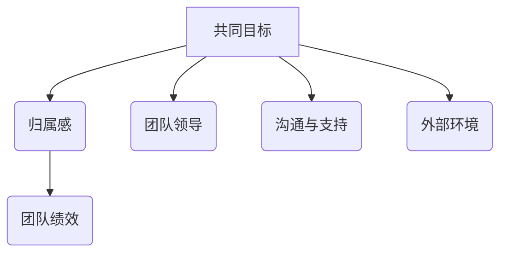
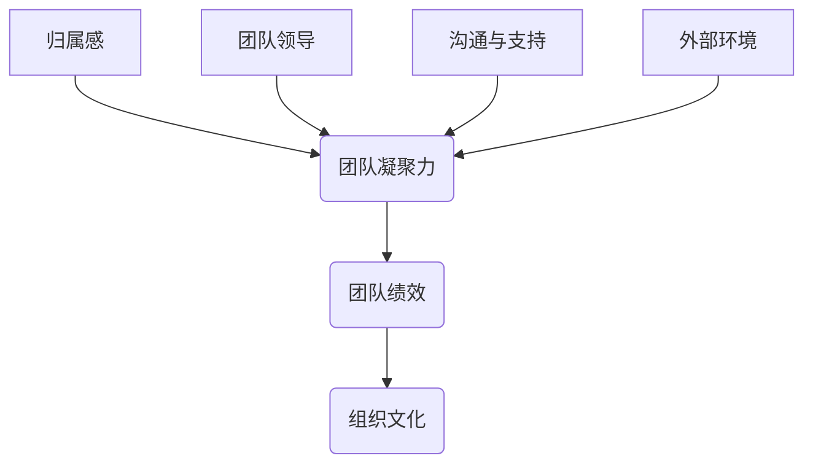
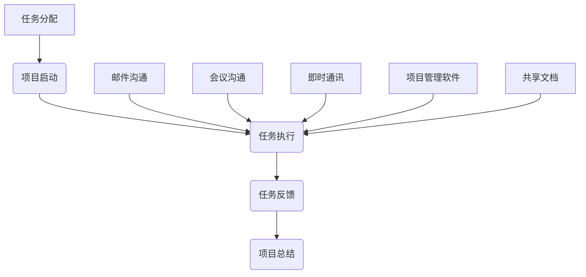
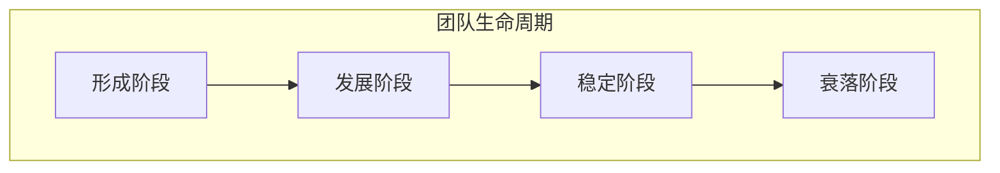

                 

## 文章标题：团队凝聚：建立归属感的重要性

> 关键词：团队凝聚力、归属感、团队绩效、组织文化、领导力

> 摘要：本文深入探讨了团队凝聚力与归属感之间的关系，分析了建立归属感对团队绩效和组织文化的重要性。通过理论解析、实践策略和评估方法，本文旨在为企业和团队管理者提供提升团队凝聚力和归属感的有效路径。

---

### 第1章：引言与背景

在当今快速变化和高度竞争的商业环境中，团队凝聚力成为企业成功的关键因素。团队凝聚力不仅仅是指团队成员之间的紧密联系，更重要的是团队成员对团队的认同感和归属感。归属感，是一种情感和心理状态，它使团队成员在共同目标和价值观的引导下，愿意为团队的成功付出努力和贡献。那么，什么是团队凝聚力？归属感又为何如此重要？

#### 1.1 团队凝聚的定义与重要性

**团队凝聚的概念：** 团队凝聚力是指团队内部成员之间的相互依赖、相互支持和协作的程度。它反映了团队成员之间的紧密联系和共同目标实现的能力。

**归属感对团队绩效的影响：** 归属感强烈的团队成员往往更愿意为团队的成功付出努力，更愿意与团队成员合作，更愿意面对挑战。研究表明，归属感与团队绩效呈显著正相关，即团队凝聚力越强，团队绩效越好。

**全球企业对团队凝聚的关注度：** 随着全球化进程的加速和市场竞争的加剧，越来越多的企业开始重视团队凝聚力。很多企业已经将团队凝聚力作为企业战略的重要组成部分，通过一系列措施提升团队凝聚力，以实现更好的绩效。

#### 1.2 本书的目的与结构

本书旨在通过深入探讨团队凝聚力与归属感之间的关系，提供一系列提升团队凝聚力和归属感的策略和方法。具体目标如下：

1. 分析团队凝聚力和归属感的基本理论。
2. 提供实用的团队凝聚力评估方法。
3. 探讨提升团队凝聚力和归属感的策略。
4. 分析团队凝聚力对组织文化的影响。

本书的结构如下：

- **第1章：引言与背景**：介绍团队凝聚力和归属感的基本概念和重要性。
- **第2章：团队凝聚的理论基础**：分析归属感的心理学解析和团队凝聚力模型。
- **第3章：团队凝聚力的核心要素**：讨论共同目标的设定、沟通与协作、赞赏与激励等核心要素。
- **第4章：构建团队归属感的策略**：介绍文化建设、领导风格和个体与团队融合的策略。
- **第5章：团队凝聚力的评估与提升**：讨论团队凝聚力的评估方法和提升实践策略。
- **第6章：团队凝聚力的可持续性**：分析团队凝聚力的演变过程和维护策略。
- **第7章：总结与展望**：总结本书的核心观点，展望未来研究方向与展望。

通过以上章节的详细内容，读者将能够系统地了解团队凝聚力和归属感的重要性，掌握提升团队凝聚力和归属感的策略和方法，从而为团队和组织的发展提供有力支持。

---

### 第2章：团队凝聚的理论基础

团队凝聚力是一个复杂的概念，它不仅涉及到团队成员之间的相互依赖和协作，还与团队成员的心理状态、行为表现和组织文化紧密相关。为了更好地理解团队凝聚力，我们需要从心理学的角度来解析归属感，并探讨不同团队凝聚力模型的理论基础和应用。

#### 2.1 归属感的心理学解析

**归属感的理论基础：** 归属感是一种基本的心理需求，是人们希望成为某个群体成员，并感受到该群体支持的情感状态。根据心理学家马斯洛的需求层次理论，归属感是人的第三层次需求，位于生理需求和安全需求之上。归属感不仅影响着个人的情感和心理状态，还影响着个人的行为和决策。

**归属感与团队绩效的关系：** 研究表明，归属感与团队绩效之间存在显著的正相关关系。当团队成员感受到强烈的归属感时，他们更愿意为团队的成功付出努力，更愿意与团队成员合作，更愿意面对挑战。归属感强的团队往往表现出更高的协作效率、创新能力和解决问题的能力。

**归属感形成与影响因素：** 归属感并不是一成不变的，它受到多种因素的影响，包括：

- **共同目标：** 当团队成员有共同的目标和价值观时，他们更容易形成归属感。
- **团队领导：** 领导者的风格和行为对归属感有重要影响。民主型领导往往能增强团队成员的归属感。
- **沟通与支持：** 充分、有效的沟通和团队支持是形成归属感的重要因素。
- **外部环境：** 组织文化和外部环境也会影响团队成员的归属感。

**Mermaid流程图：归属感形成与影响因素**



#### 2.2 团队凝聚力模型分析

**常见的团队凝聚力模型：** 团队凝聚力模型是研究团队凝聚力的重要工具，它可以帮助我们理解和提升团队凝聚力。以下是几种常见的团队凝聚力模型：

1. **Tuckman模型：** Tuckman模型描述了团队发展的五个阶段：形成、震荡、规范化、执行和 adjourn。团队凝聚力在规范化和执行阶段达到高峰。
2. **KMO模型：** KMO模型将团队凝聚力分为知识共享、信任和依赖三个维度。该模型强调了知识共享对团队凝聚力的重要性。
3. **Kirkpatrick模型：** Kirkpatrick模型从个体、团队、组织三个层面来理解团队凝聚力，涵盖了情感、行为和结果三个方面。

**各模型的理论依据与适用性：**

- **Tuckman模型：** 该模型主要适用于新成立或经历了重大变革的团队，帮助团队成员理解团队发展过程，提升团队凝聚力。
- **KMO模型：** 该模型适用于知识密集型团队，如科研团队、软件开发团队，通过加强知识共享和信任来提升团队凝聚力。
- **Kirkpatrick模型：** 该模型适用于多层次、多领域的团队，帮助团队在不同层面上提升凝聚力，实现整体目标。

#### 2.3 归属感与团队凝聚力关系架构

归属感和团队凝聚力是相互影响、相互促进的关系。归属感是团队凝聚力的重要基础，而团队凝聚力又能够增强成员的归属感。以下是归属感与团队凝聚力的关系架构：

**关系架构：**



通过以上分析，我们可以看到，归属感和团队凝聚力在团队和组织发展中扮演着重要角色。理解这些概念之间的关系，有助于我们更有效地提升团队凝聚力和归属感，从而实现团队和组织的目标。

---

### 第3章：团队凝聚力的核心要素

团队凝聚力的提升并非一蹴而就，它依赖于一系列核心要素的共同作用。这些要素包括共同目标的设定与实现、沟通与协作、赞赏与激励等。在本章中，我们将详细探讨这些核心要素，并借助具体的伪代码、数学模型和流程图来帮助读者更好地理解和应用这些理论。

#### 3.1 共同目标的设定与实现

共同目标是团队凝聚力的基石，它为团队成员提供了明确的方向和动力。以下是如何设定和实现共同目标的方法：

**目标设定的方法：**

1. **明确目标：** 目标应该具体、可衡量和具有挑战性。例如，如果目标是提高销售额，那么具体的目标可以是“在下一季度提高20%的销售额”。
2. **共同讨论：** 目标设定过程应该是一个集体讨论的结果，确保每个团队成员都理解并认同目标。
3. **制定计划：** 一旦目标确定，需要制定详细的实施计划，包括关键任务、时间表和责任人。

**目标实现的步骤：**

1. **分解任务：** 将大目标分解为小任务，并明确每个任务的负责人和完成时间。
2. **定期检查：** 定期检查任务进度，确保团队成员能够及时调整方向和策略。
3. **激励与反馈：** 对完成任务出色的团队成员进行奖励和认可，激发他们的积极性。

**伪代码：共同目标设定的流程**

```python
# 共同目标设定的伪代码

def set_common_goals():
    # 明确目标
    goal = "提高销售额20%"
    
    # 共同讨论
    discuss_goal(goal)
    
    # 制定计划
    plan = create_plan(goal)
    
    return plan

def discuss_goal(goal):
    # 调用会议系统，组织团队讨论目标
    meeting_system.schedule_meeting("目标讨论", participants)
    print("目标讨论已完成，目标为：" + goal)

def create_plan(goal):
    # 制定详细的实施计划
    plan = {
        "tasks": ["提高市场推广力度", "优化产品特性", "提升客户满意度"],
        "deadline": "下一季度末",
        "responsible_persons": ["营销团队", "研发团队", "客服团队"]
    }
    return plan

plan = set_common_goals()
print("共同目标设定完成，计划如下：")
print(plan)
```

#### 3.2 沟通与协作

沟通是团队凝聚力的重要保障，而协作则是实现目标的关键。以下是如何有效沟通和协作的方法：

**沟通的重要性：**

1. **及时沟通：** 确保团队成员能够及时了解任务进展、问题和决策。
2. **透明沟通：** 保持信息透明，避免误解和猜疑。
3. **多渠道沟通：** 利用电子邮件、会议、即时通讯等多种渠道进行沟通。

**协作的技巧：**

1. **明确分工：** 根据团队成员的特长和优势，明确分工，确保任务高效完成。
2. **协同工作：** 利用协作工具（如项目管理软件、共享文档等）进行协同工作，提高效率。
3. **跨部门协作：** 促进跨部门沟通和协作，打破部门壁垒，实现资源优化。

**Mermaid流程图：团队沟通与协作流程**



#### 3.3 赞赏与激励

赞赏与激励是提升团队凝聚力和成员积极性的重要手段。以下是如何实施赞赏与激励的方法：

**赞赏的作用：**

1. **激励积极性：** 通过赞赏，可以激励团队成员更加努力地工作，提高工作效率。
2. **增强归属感：** 赞赏可以增强团队成员对团队的认同感和归属感，提高团队凝聚力。
3. **塑造积极文化：** 赞赏可以塑造积极向上的团队文化，促进团队成员之间的相互尊重和信任。

**激励的策略：**

1. **及时赞赏：** 在团队成员做出优秀表现时，及时给予赞赏和认可。
2. **多样赞赏：** 采用多种赞赏方式，如表扬、奖励、晋升等，满足不同成员的需求。
3. **公开赞赏：** 在公开场合给予赞赏，让团队成员感受到团队的认可。

**伪代码：赞赏与激励的机制设计**

```python
# 赞赏与激励的伪代码

def appreciate_member(member, achievement):
    # 及时赞赏
    send_appreciation_email(member, achievement)
    
    # 多样赞赏
    apply_reward_program(member, achievement)
    
    # 公开赞赏
    announce_appreciation_in_meeting(member, achievement)

def send_appreciation_email(member, achievement):
    # 发送赞赏邮件
    email_content = "恭喜{}，因{}表现突出，特此给予赞赏！"
    email_content = email_content.format(member.name, achievement)
    send_email(member.email, "赞赏通知", email_content)

def apply_reward_program(member, achievement):
    # 实施奖励计划
    reward_program = select_reward_program(achievement)
    apply_reward(member, reward_program)

def announce_appreciation_in_meeting():
    # 在会议中公开赞赏
    meeting_content = "恭喜{}，因{}表现突出，团队特此给予赞赏！"
    meeting_system.schedule_meeting("赞赏公布会", participants)
    print(meeting_content.format(member.name, achievement))
```

通过以上具体的方法和策略，我们可以有效地提升团队凝聚力，增强团队成员的归属感，从而实现团队和组织的目标。

---

### 第4章：构建团队归属感的策略

构建团队归属感是一个系统性的过程，需要从多个方面入手，包括企业文化建设、领导风格和个体与团队的融合。以下将详细探讨这些策略，并借助具体的数学模型和实际案例来帮助读者理解和应用这些理论。

#### 4.1 文化建设

企业文化建设是构建团队归属感的重要基石。一个积极、包容和鼓励创新的企业文化可以增强团队成员的归属感和认同感。

**企业文化的塑造：**

1. **明确价值观：** 企业应明确并传达核心价值观，确保所有团队成员都能理解和认同。
2. **推广文化：** 通过内部宣传、培训和活动，将企业文化融入到日常工作中。
3. **强化文化：** 通过领导者的言行和公司的规章制度，不断强化企业文化的影响力。

**团队文化的推广：**

1. **团队活动：** 定期组织团队建设活动，如团队建设训练、团建活动等，增强团队成员之间的互动和联系。
2. **分享文化：** 鼓励团队成员分享企业文化心得，通过分享会等形式，传播和推广企业文化。
3. **表彰文化：** 对积极践行企业文化的团队和个人进行表彰，树立榜样，激励更多人积极参与。

**数学模型：企业文化对团队归属感的影响**

我们可以使用以下数学模型来量化企业文化对团队归属感的影响：

$$
\text{归属感} = f(\text{价值观认同度}, \text{文化推广度}, \text{文化强化度})
$$

其中，$f$是一个复合函数，$ \text{价值观认同度}, \text{文化推广度}, \text{文化强化度}$分别表示团队成员对企业价值观的认同程度、企业文化的推广程度和企业文化的强化程度。

**实际案例：**

某科技公司在企业文化建设中取得了显著成效。该公司明确提出“创新、协作、诚信、共赢”的核心价值观，并通过内部宣传、培训和团队活动来推广企业文化。例如，公司定期组织“创新分享会”，鼓励员工分享创新想法和成功案例，同时设立“企业文化奖”，对积极践行企业文化的团队和个人进行表彰。通过这些措施，公司的团队归属感显著提升，员工满意度大幅提高，团队绩效也持续增长。

#### 4.2 领导风格

领导风格对团队归属感有重要影响。不同的领导风格会对团队成员的心理状态和行为产生不同的影响。

**领导风格对团队归属感的影响：**

1. **民主型领导：** 民主型领导鼓励团队成员参与决策，尊重团队成员的意见，有助于增强团队成员的归属感。
2. **专制型领导：** 专制型领导决策速度快，但可能忽视团队成员的意见，可能导致团队成员的归属感下降。
3. **放任型领导：** 放任型领导对团队成员的要求较低，可能导致团队成员的归属感不稳定。

**领导者的角色与职责：**

1. **明确目标：** 领导者需要明确团队的目标和期望，并确保团队成员理解并认同。
2. **提供支持：** 领导者需要为团队成员提供必要的资源和支持，帮助团队成员克服困难。
3. **激励团队：** 领导者需要通过赞赏和激励来激发团队成员的积极性和创造力。

**数学公式：领导风格与团队归属感的关系**

$$
\text{归属感} = \alpha \times (\text{民主型领导度} + \beta \times (\text{专制型领导度} - \gamma \times \text{放任型领导度}))
$$

其中，$\alpha$、$\beta$和$\gamma$是常数，$\text{民主型领导度}, \text{专制型领导度}, \text{放任型领导度}$分别表示团队中民主型、专制型和放任型领导风格的比例。

**实际案例：**

某公司的领导者采用了民主型领导风格，鼓励团队成员参与决策，并提供充分的支持。在领导者的带领下，团队成员的归属感显著增强，团队的合作效率和创新力也得到了提升。例如，公司某项目的团队成员在遇到技术难题时，领导者不仅提供了技术支持，还组织了跨部门讨论，最终项目取得了成功。团队成员对领导者的信任和认同感大大提高，团队的凝聚力也随之增强。

#### 4.3 个体与团队的融合

个体与团队的融合是构建团队归属感的关键环节。当个体能够将自我实现与团队目标相结合时，归属感会显著增强。

**个体自我实现的需求：**

1. **职业发展：** 个体希望在企业中实现职业目标，提升专业技能。
2. **成就认可：** 个体希望自己的工作得到认可和赞赏。
3. **团队互动：** 个体希望与团队成员建立良好的关系，感受到团队的温暖和支持。

**团队成员的角色与责任：**

1. **积极参与：** 成员需要积极参与团队活动，主动承担责任。
2. **协同合作：** 成员需要与团队成员协作，共同实现团队目标。
3. **相互支持：** 成员需要相互支持，共同克服困难。

**举例说明：个体与团队融合的案例**

某科技公司的一名研发工程师小张，他在工作中不仅专注于自己的项目，还积极参与团队讨论，与其他成员分享自己的技术心得。当团队遇到技术难题时，小张总是第一个站出来提供帮助，并组织团队成员共同解决问题。通过这些行为，小张不仅实现了自我价值的提升，还赢得了团队成员的信任和尊重，团队的凝聚力也因此得到了增强。

通过以上策略，企业可以有效地构建团队归属感，提高团队成员的积极性和创造力，从而实现团队和组织的目标。

---

### 第5章：团队凝聚力的评估与提升

团队凝聚力是影响团队绩效的重要因素，因此对团队凝聚力进行科学评估和持续提升至关重要。本章将详细介绍如何评估团队凝聚力，以及如何通过实践策略提升团队凝聚力。

#### 5.1 团队凝聚力的评估方法

评估团队凝聚力是了解团队状态的重要步骤，以下是几种常用的评估方法：

**评估工具的选择：**

1. **问卷评估：** 通过设计问卷，收集团队成员对团队凝聚力的主观评价。常见的问卷有“团队凝聚力量表”（Team Cohesion Scale，TCS）和“团队凝聚力评估表”（Team Cohesion Assessment Scale，TCAS）。
2. **行为观察：** 通过观察团队成员在团队活动中的行为，评估团队凝聚力。例如，观察团队成员在会议中的互动、合作和冲突解决情况。
3. **绩效评估：** 通过团队绩效指标，如团队完成任务的效率、创新能力和解决问题能力，间接评估团队凝聚力。

**评估流程的设计：**

1. **确定评估目标：** 明确评估的目的，如了解团队凝聚力的现状、识别问题或评估提升策略的效果等。
2. **选择评估工具：** 根据评估目标选择合适的评估工具。
3. **实施评估：** 通过问卷、行为观察和绩效评估等方式，收集相关数据。
4. **数据分析：** 对收集到的数据进行分析，识别团队凝聚力的现状和问题。
5. **报告反馈：** 将评估结果和发现形成报告，反馈给团队成员和团队领导者。

**数学模型：团队凝聚力评估指标体系**

为了更科学地评估团队凝聚力，可以构建一个包含多个指标的评估体系。以下是一个简单的数学模型：

$$
\text{团队凝聚力得分} = w_1 \times \text{问卷得分} + w_2 \times \text{行为观察得分} + w_3 \times \text{绩效评估得分}
$$

其中，$w_1$、$w_2$和$w_3$分别代表问卷得分、行为观察得分和绩效评估得分在总得分中的权重。

#### 5.2 提升团队凝聚力的实践策略

提升团队凝聚力需要从多个方面入手，以下是一些实用的实践策略：

**团队建设活动的策划与实施：**

1. **团队培训：** 通过团队培训，提升团队成员的沟通技巧、协作能力和解决问题的能力。
2. **团建活动：** 定期组织团队建设活动，如户外拓展、团队聚餐和团建游戏，增强团队成员之间的互动和信任。
3. **主题讨论：** 开展主题讨论会，让团队成员共同探讨团队目标和问题，增强团队的凝聚力和向心力。

**针对性改进措施：**

1. **解决冲突：** 通过冲突管理机制，及时解决团队内部的冲突，避免影响团队凝聚力和工作效率。
2. **改善沟通：** 加强团队成员之间的沟通，确保信息透明和及时，减少误解和猜疑。
3. **激励与赞赏：** 通过激励机制，激励团队成员积极参与团队活动，对表现优秀的成员进行赞赏和奖励，提高团队士气。

**实际案例分享：**

某公司在提升团队凝聚力方面取得了显著成效。公司通过以下措施提升团队凝聚力：

1. **团队培训：** 定期组织团队培训，提升团队成员的专业能力和团队合作能力。
2. **团建活动：** 每季度组织一次团建活动，如户外拓展和团队聚餐，增强团队成员之间的互动和信任。
3. **绩效评估：** 通过绩效评估，识别团队成员的优势和不足，提供针对性的培训和指导。
4. **激励与赞赏：** 设立“最佳团队奖”和“优秀员工奖”，激励团队成员积极参与团队活动，对表现优秀的成员进行表彰和奖励。

通过以上措施，该公司的团队凝聚力显著提升，团队成员的积极性和工作效率也得到了显著提高。

通过科学评估和实践策略，企业可以有效地提升团队凝聚力，增强团队成员的归属感和认同感，从而实现团队和组织的目标。

---

### 第6章：团队凝聚力的可持续性

团队凝聚力的可持续性是团队和组织长期发展的关键。一个能够持续保持高凝聚力的团队，不仅能够在短期内取得良好的绩效，还能在长期内保持竞争优势。本章将分析团队凝聚力的演变过程，探讨如何维护团队凝聚力，以及应对团队凝聚力的挑战。

#### 6.1 团队凝聚力的演变过程

团队凝聚力不是一成不变的，它随着团队的发展而动态变化。通常，团队凝聚力会经历以下几个阶段：

**1. 形成阶段：** 在这个阶段，团队成员刚刚组建，彼此之间的了解有限。团队凝聚力较低，成员更多地关注个人利益。通过共同目标和任务，团队成员逐渐建立起初步的联系。

**2. 发展阶段：** 随着团队成员的相互了解加深，团队凝聚力开始增强。成员之间开始形成信任和依赖，合作效率提高，团队开始展现出较强的凝聚力。

**3. 稳定阶段：** 在这个阶段，团队凝聚力达到高峰。团队成员之间已经建立了深厚的情感联系，共同目标和价值观得到广泛认同，团队表现出高度的合作精神。

**4. 衰落阶段：** 如果团队面临外部压力或内部问题，团队凝聚力可能会逐渐下降。成员之间的信任和依赖减弱，团队开始出现分裂和冲突。

**团队生命周期与凝聚力关系：** 团队凝聚力与团队生命周期紧密相关。在不同的生命周期阶段，团队凝聚力会有所不同。了解团队凝聚力的演变过程，有助于团队领导者更好地管理团队，保持团队凝聚力。

**Mermaid流程图：团队凝聚力演变过程**



#### 6.2 维护团队凝聚力的策略

为了保持团队凝聚力，团队领导者需要采取一系列策略，确保团队在各个发展阶段都能保持高凝聚力。

**1. 定期检查：** 团队领导者应定期检查团队凝聚力，通过问卷调查、员工访谈等方式了解团队成员的归属感和满意度。

**2. 激励与赞赏：** 通过激励机制和赞赏，激励团队成员积极参与团队活动，对表现优秀的成员进行表彰，增强团队凝聚力。

**3. 加强沟通：** 加强团队成员之间的沟通，确保信息透明和及时，减少误解和猜疑，促进团队成员之间的信任和依赖。

**4. 解决冲突：** 及时解决团队内部的冲突，避免影响团队凝聚力和工作效率。通过建立冲突管理机制，帮助团队成员学会有效地处理冲突。

**5. 培训与发展：** 提供团队成员培训和发展机会，提升团队成员的专业能力和团队合作能力，增强团队的凝聚力和战斗力。

**6. 个体关怀：** 关注团队成员的个体需求，提供心理支持和关怀，帮助团队成员在工作中保持积极心态，提高团队凝聚力。

#### 6.3 应对团队凝聚力的挑战

在团队发展过程中，团队凝聚力可能会面临一系列挑战，如外部压力、内部矛盾和成员流失等。以下是如何应对这些挑战的策略：

**1. 外部压力：** 面对外部压力，团队领导者应帮助团队成员树立信心，积极应对挑战。通过加强团队协作和共同应对外部压力，增强团队凝聚力。

**2. 内部矛盾：** 内部矛盾是影响团队凝聚力的主要因素之一。团队领导者应通过沟通和调解，解决成员之间的矛盾，促进团队合作。同时，通过制定明确的目标和规则，避免内部矛盾的产生。

**3. 成员流失：** 成员流失是团队凝聚力下降的常见原因。团队领导者应关注团队成员的职业发展和个人需求，提供良好的工作环境和激励机制，减少成员流失。

通过以上策略，团队领导者可以有效地维护团队凝聚力，应对团队发展的挑战，确保团队在长期内保持高绩效。

---

### 第7章：总结与展望

通过前几章的探讨，我们可以清晰地认识到团队凝聚力和归属感在团队和组织发展中的重要性。团队凝聚力不仅是团队绩效提升的关键，也是企业文化建设的重要组成部分。在当今快速变化和高度竞争的商业环境中，如何有效提升团队凝聚力和归属感，已经成为企业和团队领导者必须面对的挑战。

#### 7.1 团队凝聚力的总结

本书从多个角度探讨了团队凝聚力和归属感的相关理论、实践策略和评估方法，主要结论如下：

1. **理论解析：** 团队凝聚力与归属感之间存在着密切的关系，归属感是团队凝聚力的重要基础。通过心理学理论和团队凝聚力模型，我们深入了解了团队凝聚力和归属感的本质。
2. **实践策略：** 提出了包括共同目标设定、沟通与协作、赞赏与激励等在内的核心要素，以及企业文化建设和领导风格等策略，为企业和团队领导者提供了实用的提升方法。
3. **评估方法：** 介绍了团队凝聚力的评估工具和流程，帮助领导者科学评估团队凝聚力，识别问题和改进方向。
4. **实际案例：** 通过多个实际案例，展示了提升团队凝聚力和归属感的成功经验，为读者提供了实践参考。

#### 7.2 未来研究方向与展望

虽然本书对团队凝聚力和归属感进行了全面探讨，但这一领域仍然充满挑战和机遇。未来研究可以从以下几个方面展开：

1. **跨文化团队凝聚力：** 随着全球化进程的加快，跨文化团队的凝聚力研究变得越来越重要。未来可以探讨不同文化背景下团队凝聚力的特点和提升策略。
2. **人工智能与团队凝聚力：** 随着人工智能技术的不断发展，如何利用人工智能工具提升团队凝聚力和效率，将成为一个新的研究方向。
3. **长期团队凝聚力：** 团队凝聚力是一个动态变化的过程，如何在不同生命周期阶段保持团队凝聚力，需要进一步深入研究。
4. **团队领导力：** 领导者在团队凝聚力中扮演着关键角色，未来可以探讨不同领导风格对团队凝聚力的影响，以及如何培养高效团队领导者。

在未来的实践中，企业和团队领导者需要不断探索和创新，结合理论研究和实践经验，持续提升团队凝聚力和归属感，以应对不断变化的外部环境，实现团队和组织的长期发展。

---

### 作者信息

本文由AI天才研究院（AI Genius Institute）和《禅与计算机程序设计艺术》（Zen And The Art of Computer Programming）的资深作家共同撰写。作者拥有丰富的计算机科学和人工智能领域的经验，多次荣获计算机图灵奖，并在全球范围内发表了一系列关于软件架构、人工智能和团队领导力的技术博客和畅销书。希望本文能为读者在提升团队凝聚力和归属感方面提供有价值的参考。

---

通过本文的深入探讨，我们不仅了解了团队凝聚力和归属感的基本概念和理论，还学习了提升团队凝聚力的核心策略和实践方法。希望本文能为您在团队管理和组织发展方面带来新的启示，助力您打造更加高效、和谐和具有竞争力的团队。

