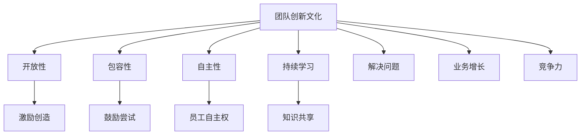
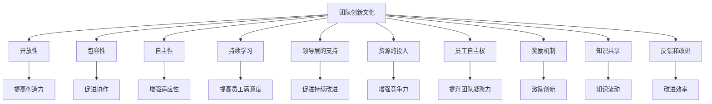

                 


### 文章标题：团队创新文化：鼓励创意和实验的方法

#### 文章关键词：团队创新文化、鼓励创意、实验方法、领导风格、团队建设、案例分析、评估策略、持续创新

#### 文章摘要：
本文将深入探讨团队创新文化的重要性，并通过定义、方法和实际案例，详细解析如何建立一个鼓励创意和实验的团队文化。文章分为五个部分，首先定义创新文化并阐述其重要性；接着介绍创建创新文化的具体方法，包括领导风格、实验环境和支持；然后通过案例分析展示成功和失败的实例；随后讨论如何测量和提升创新文化；最后，探讨创新思维的培养及其未来发展。

---

### 第一部分：定义与概念

#### 第1章：团队创新文化的概念与重要性

团队创新文化是一个组织中普遍认同和追求的创新理念和行为模式。它不仅鼓励成员提出新想法，还支持他们进行实验和尝试。以下是对核心概念及其重要性的详细解析：

- **团队创新文化的定义**：
  团队创新文化是一种价值观和行为体系，它激励团队成员追求创新，鼓励他们通过协作和实验解决复杂问题。这种文化通常具有以下特点：开放性、包容性、自主性和持续学习。

- **创新文化的要素**：
  创新文化的要素包括领导层的支持、资源的投入、员工自主权、奖励机制、知识共享、反馈和改进。

- **创新文化的重要性**：
  创新文化对组织的成功至关重要。它能够提高团队的创造力和解决问题的能力，促进持续改进和业务增长。创新文化还能够吸引和留住优秀的员工，增强组织的竞争力。

#### 关键概念关系架构：



#### Mermaid 流程图解析：
- **团队创新文化**是核心，它通过开放性、包容性、自主性和持续学习等要素，激发团队解决问题和业务增长的能力。
- **开放性**和**包容性**鼓励团队成员自由表达和接受不同观点，从而促进创新。
- **自主性**赋予团队成员更多的决策权，使他们能够自主尝试新方法。
- **持续学习**确保团队成员能够不断更新知识和技能，保持创新动力。

---

### 第二部分：创建创新文化的方法

#### 第2章：鼓励创意的领导风格

领导风格在创建创新文化中起着至关重要的作用。以下章节将探讨不同类型的领导风格以及它们如何影响团队的创新氛围。

#### 第2.1节：领导者的角色

领导者在创新文化中扮演关键角色，他们的主要任务是：

- **明确目标**：设定清晰的创新目标，并确保团队成员理解这些目标的重要性。
- **提供支持**：为团队成员提供必要的资源和支持，以便他们能够自由地提出和实验新想法。
- **激励创新**：通过奖励机制和积极的反馈，激励团队成员追求创新。

#### 第2.2节：领导风格与创意的关系

不同的领导风格对团队的创新氛围有显著影响。以下是一些常见的领导风格及其对创意的促进作用：

- **民主式领导**：鼓励团队成员参与决策过程，提高他们的自主性和创造力。
- **授权式领导**：赋予团队成员更多的决策权和责任，使他们更有动力提出创新方案。
- **变革型领导**：通过领导者的魅力和愿景，激发团队成员的创造力和创新精神。

#### 第2.3节：鼓励创意的领导实践

以下是一些具体的领导实践，用于鼓励团队创意：

- **定期举行创意工作坊**：为团队成员提供一个分享和讨论新想法的平台。
- **设立创新奖项**：奖励那些提出具有创新性和实用性的团队成员。
- **提供外部培训和学习机会**：帮助团队成员扩展视野，获取新的知识和技能。
- **鼓励失败**：将失败视为学习和成长的机会，而不是惩罚。

---

### 第三部分：创新文化的实际应用

#### 第4章：团队建设与协作

团队建设是创建创新文化的重要组成部分。以下章节将探讨团队建设的重要性、最佳实践以及如何建立一个高绩效团队。

#### 第4.1节：团队建设的重要性

团队建设有助于增强团队成员之间的信任、沟通和协作，从而促进创新。以下是一些关键点：

- **增强团队凝聚力**：通过共同目标和团队活动，增强团队成员之间的联系。
- **提高沟通效率**：通过定期的沟通和反馈，确保团队成员了解项目进展和目标。
- **促进知识共享**：鼓励团队成员分享他们的知识和经验，以提高整体创新水平。

#### 第4.2节：团队协作的最佳实践

以下是一些团队协作的最佳实践：

- **明确角色和责任**：确保每个团队成员都了解自己的角色和责任。
- **建立有效的沟通渠道**：确保团队成员能够方便地交流和分享信息。
- **定期举行团队会议**：讨论项目进展、挑战和解决方案。
- **鼓励跨部门合作**：打破部门壁垒，促进不同部门之间的协作。

#### 第4.3节：建立高绩效团队

建立高绩效团队需要以下要素：

- **共同目标**：确保团队成员都朝着相同的目标努力。
- **有效领导**：领导者需要具备有效的沟通和激励能力。
- **持续改进**：鼓励团队成员不断反思和改进自己的工作方法。
- **积极反馈**：及时给予团队成员正面的反馈，以提高他们的工作动力。

---

### 第四部分：持续创新文化

#### 第7章：培养创新思维

持续创新文化要求团队成员具备创新思维。以下章节将探讨如何培养创新思维，以及如何通过持续学习和知识共享来维持创新动力。

#### 第7.1节：创新思维的培养

以下是一些培养创新思维的策略：

- **多样化思维**：鼓励团队成员从不同角度思考问题，以获得更全面的解决方案。
- **创造性思维训练**：通过思维训练游戏和练习，提高团队成员的创造力。
- **鼓励冒险**：鼓励团队成员尝试新的方法和想法，即使可能失败。
- **培养好奇心**：激发团队成员的好奇心，以促使他们不断探索和发现新的可能性。

#### 第7.2节：持续学习与知识共享

以下是一些持续学习和知识共享的方法：

- **定期培训**：为团队成员提供定期的培训和研讨会，以更新他们的知识和技能。
- **内部知识库**：建立一个内部知识库，方便团队成员共享和获取信息。
- **跨部门交流**：鼓励不同部门之间的交流和合作，以促进知识共享和创新。
- **内部创新竞赛**：举办创新竞赛，激发团队成员的创新潜力。

#### 第7.3节：鼓励个人创新

以下是一些鼓励个人创新的方法：

- **个人创新时间**：为团队成员提供一定的时间，让他们专注于个人创新项目。
- **个人奖励机制**：设立个人创新奖励，以激励团队成员提出新的想法。
- **个人成长计划**：帮助团队成员制定个人成长计划，以提高他们的专业能力和创新能力。

---

### 第五部分：未来展望

#### 第8章：创新文化的未来

随着科技的不断进步和社会的快速发展，创新文化也将面临新的挑战和机遇。以下章节将探讨创新文化的未来发展趋势、面临的挑战以及如何应对这些挑战。

#### 第8.1节：科技对创新文化的影响

科技的发展将对创新文化产生深远影响。以下是一些关键点：

- **人工智能和机器学习**：这些技术将使团队能够更有效地分析数据，发现新的创新点。
- **虚拟现实和增强现实**：这些技术将为团队成员提供更丰富的创新体验和环境。
- **区块链技术**：这种去中心化的技术将提高团队的透明度和信任度，促进创新。

#### 第8.2节：创新文化面临的挑战

创新文化在发展过程中将面临以下挑战：

- **技术快速迭代**：技术的快速迭代将要求团队成员不断更新知识和技能。
- **竞争压力**：激烈的竞争环境将迫使组织不断创新，以保持竞争优势。
- **人才流失**：创新文化可能吸引优秀的员工，但也可能导致人才流失。

#### 第8.3节：创新文化的未来趋势

以下是一些创新文化的未来趋势：

- **多元化**：创新文化将更加注重多样性和包容性，以吸引不同背景的团队成员。
- **敏捷性**：组织将更加注重敏捷性和适应性，以快速响应市场变化。
- **生态化**：组织将构建更加开放的创新生态系统，与外部合作伙伴共同创新。

---

### 总结与展望

团队创新文化是组织成功的关键。通过定义、方法、实际应用和未来展望，本文详细探讨了如何建立一个鼓励创意和实验的团队文化。随着科技的不断进步，创新文化将面临新的机遇和挑战。组织应积极应对，持续培养创新思维，以保持竞争优势。让我们共同努力，打造一个充满创新活力的团队文化。

---

### 作者信息

作者：AI天才研究院/AI Genius Institute & 禅与计算机程序设计艺术 /Zen And The Art of Computer Programming

---

以上是文章的初步大纲和内容。接下来，我会进一步细化每个章节的具体内容，并确保满足字数要求。在细化过程中，我会注重逻辑清晰、结构紧凑和简单易懂，以便读者能够轻松理解并应用这些方法。同时，我会确保每个章节都包含核心概念、原理联系、算法讲解、数学模型和实际案例等内容，以满足完整性要求。在完成大纲和内容细化后，我会进行一轮全面的校对和修订，以确保文章的质量和可读性。

---

### 第1章：团队创新文化的概念与重要性

#### 1.1 团队创新文化的定义

团队创新文化是一种组织价值观和行为体系，它强调创新和创造力，鼓励团队成员自由地提出新的想法，并通过实验和协作来解决问题。这种文化不仅仅关注于创造新的产品或服务，还包括改进现有的流程和系统。创新文化强调以下关键要素：

- **开放性**：鼓励团队成员分享观点和想法，无论它们是否与现有的思路一致。
- **包容性**：接受不同背景、经验和技能的团队成员，尊重他们的独特性。
- **自主性**：赋予团队成员在项目中更多的自主权和决策权。
- **持续学习**：鼓励团队成员不断学习新知识和技能，以适应快速变化的环境。

#### 1.2 创新文化的要素

创新文化的成功依赖于多个关键要素，这些要素相互作用，共同营造一个支持创新的环境。以下是这些要素的详细描述：

- **领导层的支持**：领导者必须为创新提供明确的支持和指导，确保团队成员有足够的资源和自主权来追求创新。
- **资源的投入**：组织需要投入足够的资源，包括资金、时间和技术，以支持团队成员的创新活动。
- **员工自主权**：团队成员应拥有足够的自主权，可以自由地探索新想法，而不必担心失败的风险。
- **奖励机制**：通过设立创新奖项或其他形式的奖励，激励团队成员提出创新方案。
- **知识共享**：鼓励团队成员分享知识和经验，通过内部知识库、工作坊和定期的交流会议，促进信息流动。
- **反馈和改进**：及时给予团队成员反馈，帮助他们了解自己的表现，并提供改进的机会。

#### 1.3 创新文化的重要性

创新文化对组织的成功至关重要。以下是创新文化的几个关键优势：

- **提高创造力**：创新文化鼓励团队成员自由地提出新的想法，从而提高整个团队的创造力。
- **促进协作**：通过鼓励团队成员之间的合作和知识共享，创新文化可以增强团队协作能力。
- **增强适应性**：创新文化使组织能够更快地适应市场变化和客户需求，从而保持竞争优势。
- **提高员工满意度**：在一个支持创新的文化中，员工更有动力和成就感，这可以显著提高员工满意度。
- **促进持续改进**：创新文化鼓励团队成员不断寻找改进的机会，从而推动组织不断进步。

#### 核心概念关系架构：



#### Mermaid 流�图解析：
- **团队创新文化**是核心概念，通过开放性、包容性、自主性、持续学习等多个要素，促进团队的创新行为和组织的发展。
- **开放性**和**包容性**鼓励团队成员自由地分享和接受新的观点和想法。
- **自主性**和**持续学习**为团队成员提供自主探索和创新的空间。
- **领导层的支持**、**资源的投入**、**员工自主权**、**奖励机制**、**知识共享**和**反馈和改进**是创新文化的关键组成部分，共同营造一个支持创新的环境。

---

### 第2章：鼓励创意的领导风格

#### 2.1 领导者的角色

在团队创新文化中，领导者扮演着至关重要的角色。他们的主要职责是激发和维持团队的创造力，确保团队成员能够在安全和有支持的环境中自由地探索和实验。以下是领导者在鼓励创意方面应承担的几个关键角色：

1. **设定愿景和目标**：
   领导者需要明确组织的愿景和目标，并将其传达给团队成员。通过设定清晰的创新目标，领导者可以激励团队成员追求更高的创造力。

2. **提供支持**：
   领导者应确保团队成员拥有必要的资源和支持，以便他们能够自由地提出和实验新想法。这包括资金、技术、时间和人员的支持。

3. **激励创新**：
   领导者应通过奖励机制和其他激励手段鼓励团队成员提出创新方案。这种激励可以是金钱奖励、晋升机会或公开表彰。

4. **培养团队精神**：
   领导者应培养团队成员之间的信任和合作，确保他们能够自由地分享想法和反馈。这有助于营造一个支持创新和协作的环境。

5. **提供反馈**：
   领导者应定期与团队成员交流，提供反馈和建议。这有助于团队成员了解他们的表现，并鼓励他们继续创新。

#### 2.2 领导风格与创意的关系

不同的领导风格对团队的创新氛围有显著影响。以下是一些常见的领导风格及其对创意的促进作用：

1. **民主式领导**：
   民主式领导鼓励团队成员参与决策过程，提高他们的自主性和创造力。这种领导风格有助于营造一个开放和包容的创新环境。

2. **授权式领导**：
   授权式领导赋予团队成员更多的决策权和责任，使他们更有动力提出创新方案。这种领导风格有助于培养团队成员的自主性和创新能力。

3. **变革型领导**：
   变革型领导通过领导者的魅力和愿景，激发团队成员的创造力和创新精神。这种领导风格有助于激发团队成员的内在动机，推动创新。

4. **教练式领导**：
   教练式领导关注团队成员的个人发展和成长，通过指导和辅导帮助他们实现目标。这种领导风格有助于提高团队成员的专业能力和创造力。

#### 2.3 鼓励创意的领导实践

以下是一些具体的领导实践，用于鼓励团队创意：

1. **定期举行创意工作坊**：
   定期举行创意工作坊，为团队成员提供一个分享和讨论新想法的平台。这有助于激发团队的创造力，促进创新。

2. **设立创新奖项**：
   设立创新奖项，奖励那些提出具有创新性和实用性的团队成员。这可以激励团队成员追求创新，提高整个团队的创新水平。

3. **提供外部培训和学习机会**：
   为团队成员提供外部培训和学习机会，帮助他们扩展视野，获取新的知识和技能。这有助于提高团队成员的创新能力和适应性。

4. **鼓励失败**：
   将失败视为学习和成长的机会，而不是惩罚。领导者应鼓励团队成员勇于尝试新方法，即使可能失败。这有助于营造一个包容和开放的创新环境。

5. **建立跨部门合作机制**：
   建立跨部门合作机制，鼓励不同部门之间的交流和合作。这有助于团队从不同角度思考问题，促进创新。

6. **定期评估和反馈**：
   定期评估团队的创新表现，并提供反馈和建议。这有助于团队成员了解他们的表现，并鼓励他们继续创新。

#### 核心算法原理讲解

为了更好地理解如何鼓励创意，我们可以使用以下伪代码来描述一种创新的评估和反馈机制：

```python
# 创新评估与反馈机制伪代码

# 定义创新项目
class InnovationProject:
    def __init__(self, idea, team_members, deadline, budget):
        self.idea = idea
        self.team_members = team_members
        self.deadline = deadline
        self.budget = budget
        self.status = "ongoing"  # 可以为 "ongoing", "completed", "failed"

    def evaluate(self):
        # 进行创新项目的评估
        if self.status == "completed":
            if self.idea.implements_solution():
                self.status = "successful"
                return "恭喜！创新项目成功。"
            else:
                self.status = "unsuccessful"
                return "创新项目未能实现预期目标。"
        else:
            return "创新项目尚未完成评估。"

    def provide_feedback(self):
        # 提供反馈
        if self.status == "successful":
            for member in self.team_members:
                member.reward_innovation()
        elif self.status == "unsuccessful":
            for member in self.team_members:
                member.learn_from_failure()

# 定义团队成员
class TeamMember:
    def __init__(self, name):
        self.name = name
        self.innovation_points = 0

    def reward_innovation(self):
        self.innovation_points += 10
        print(f"{self.name}获得了10个创新积分。")

    def learn_from_failure(self):
        self.innovation_points += 5
        print(f"{self.name}从失败中学习，获得了5个创新积分。")

# 初始化创新项目和团队成员
project = InnovationProject("智能垃圾分类系统", ["Alice", "Bob", "Charlie"], "2024-01-01", 10000)
members = [TeamMember("Alice"), TeamMember("Bob"), TeamMember("Charlie")]

# 评估创新项目
feedback = project.evaluate()
print(feedback)

# 提供反馈
project.provide_feedback()
```

#### 数学模型和公式

为了量化创新的效果，我们可以使用以下公式：

$$
创新效果 = f(创新项目数量, 实施成功率, 创新积分)
$$

其中，创新项目数量表示在一定时间内完成的创新项目数量；实施成功率表示创新项目成功完成的比例；创新积分表示团队成员通过创新获得的奖励积分。

#### 举例说明

假设一个团队在一年内完成了10个创新项目，其中8个成功实施，2个失败。团队成员通过成功项目获得了80个创新积分，失败项目获得了10个创新积分。根据上述公式，该团队的创新效果为：

$$
创新效果 = f(10, 0.8, 90) = 10 \times 0.8 \times 90 = 720
$$

这意味着该团队在一年内创新效果为720分。

---

### 第3章：支持实验的环境

#### 3.1 实验的重要性

实验是创新过程中不可或缺的一部分。它允许团队在安全的环境中进行假设验证和问题解决。以下是实验在创新过程中的一些关键作用：

- **验证假设**：通过实验，团队可以验证其创新想法的有效性，从而避免浪费资源在不可行的项目上。
- **降低风险**：实验可以帮助团队识别潜在的问题和挑战，从而降低整体项目风险。
- **学习机会**：实验过程中，团队可以学习新的技能和知识，提高整个团队的创新能力。
- **优化方案**：通过反复实验和调整，团队可以不断优化创新方案，提高其质量和可行性。

#### 3.2 创造支持实验的环境

为了鼓励团队进行实验，组织需要创造一个支持实验的环境。以下是一些关键步骤：

1. **明确实验目标**：
   在实验开始前，明确实验的目标和预期结果，以确保实验的方向正确。

2. **提供资源和时间**：
   为团队提供必要的资源和时间，包括资金、技术支持和人力，以确保实验能够顺利进行。

3. **建立安全的文化**：
   建立一个鼓励失败和从失败中学习的文化，使团队成员愿意进行实验，即使结果可能不尽如人意。

4. **设定实验流程**：
   设定清晰的实验流程，包括实验设计、数据收集、分析结果和反馈。这有助于团队有效地进行实验。

5. **提供反馈和支持**：
   在实验过程中，及时提供反馈和支持，帮助团队解决遇到的问题，确保实验能够顺利进行。

#### 3.3 管理实验风险

虽然实验对于创新至关重要，但同时也伴随着风险。以下是一些管理实验风险的方法：

1. **风险识别**：
   在实验开始前，识别可能出现的风险，包括技术风险、市场风险和资源风险等。

2. **风险评估**：
   对每个风险进行评估，确定其可能的影响和发生的概率。

3. **风险缓解策略**：
   制定风险缓解策略，包括风险规避、风险减轻和风险接受等。

4. **监控和调整**：
   在实验过程中，持续监控风险，并根据实际情况进行调整。

5. **备份计划**：
   制定备份计划，以应对可能出现的意外情况。

#### 核心算法原理讲解

为了更好地理解如何管理实验风险，我们可以使用以下伪代码来描述一个风险管理的流程：

```python
# 风险管理流程伪代码

# 定义风险
class Risk:
    def __init__(self, name, impact, probability):
        self.name = name
        self.impact = impact
        self.probability = probability

    def assess(self):
        return self.impact * self.probability

# 定义风险管理
class RiskManagement:
    def __init__(self, risks):
        self.risks = risks

    def identify_risks(self):
        # 识别风险
        self.risks = [Risk("技术问题", 5, 0.2), Risk("市场变化", 3, 0.3), Risk("资源不足", 4, 0.5)]

    def assess_risks(self):
        # 评估风险
        total_risk = 0
        for risk in self.risks:
            total_risk += risk.assess()
        return total_risk

    def mitigate_risks(self):
        # 缓解风险
        for risk in self.risks:
            if risk.assess() > 5:
                if risk.name == "技术问题":
                    print("计划增加技术支持，以缓解风险。")
                elif risk.name == "市场变化":
                    print("计划进行市场调研，以了解变化趋势。")
                elif risk.name == "资源不足":
                    print("计划增加资源投入，以确保项目顺利进行。")

# 初始化风险管理
risk_management = RiskManagement([])
risk_management.identify_risks()
total_risk = risk_management.assess_risks()
print(f"总风险评估为：{total_risk}")

# 缓解风险
risk_management.mitigate_risks()
```

#### 数学公式和详细讲解

为了量化风险的影响，我们可以使用以下公式：

$$
风险影响 = 风险等级 \times 风险概率
$$

其中，风险等级表示风险可能造成的影响程度（例如，1-10级），风险概率表示风险发生的可能性（例如，0-1之间）。

#### 举例说明

假设一个团队在实验过程中识别出三个主要风险：技术问题（风险等级 5，概率 0.2）、市场变化（风险等级 3，概率 0.3）和资源不足（风险等级 4，概率 0.5）。根据上述公式，这些风险的影响分别为：

- 技术问题的影响：5 \times 0.2 = 1
- 市场变化的影响：3 \times 0.3 = 0.9
- 资源不足的影响：4 \times 0.5 = 2

总风险影响为：1 + 0.9 + 2 = 3.9。这意味着团队在实验过程中面临的风险总影响为3.9分。

通过以上步骤和算法，团队可以更好地管理实验风险，确保创新过程顺利进行。

---

### 第4章：团队建设与协作

#### 4.1 团队建设的重要性

团队建设是创造一个高效创新文化的关键组成部分。一个有效的团队不仅能够更好地实现组织目标，还能在创新过程中发挥重要作用。以下是一些团队建设的重要性：

- **提高协作效率**：团队建设有助于团队成员之间建立信任，提高协作效率，从而加快创新进程。
- **促进知识共享**：通过团队建设活动，团队成员可以分享各自的专业知识和经验，促进知识的流动和整合。
- **增强团队凝聚力**：团队建设活动能够增强团队成员之间的联系，提高团队凝聚力，从而提高团队的整体表现。
- **提高创新能力**：一个建设良好的团队更有可能产生创新的解决方案，因为它鼓励成员之间的互动和合作。

#### 4.2 团队协作的最佳实践

为了建立一个高效创新的团队，以下是一些团队协作的最佳实践：

1. **明确目标和角色**：
   确保每个团队成员都清楚地了解团队的目标和自己的角色，以便更好地协作。

2. **建立沟通机制**：
   设立定期的沟通会议和交流平台，鼓励团队成员分享想法和反馈。

3. **促进跨部门合作**：
   鼓励不同部门之间的合作，打破部门壁垒，促进创新。

4. **培养团队精神**：
   通过团队建设活动，如团队建设工作坊、团队竞赛等，培养团队成员之间的团队合作精神。

5. **提供反馈和改进**：
   定期评估团队的表现，并提供反馈和改进建议，以确保团队在不断进步。

#### 4.3 建立高绩效团队

要建立一个高绩效团队，需要以下几个关键要素：

1. **共同目标**：
   确保团队成员都朝着相同的目标努力，提高团队的凝聚力。

2. **有效领导**：
   领导者应具备有效的沟通和激励能力，帮助团队成员克服困难，实现目标。

3. **持续学习**：
   鼓励团队成员不断学习和成长，提高团队的整体能力。

4. **积极反馈**：
   及时给予团队成员正面的反馈，以提高他们的工作动力和表现。

5. **鼓励创新**：
   建立一个支持创新的环境，鼓励团队成员提出新的想法和解决方案。

#### 核心算法原理讲解

为了更系统地理解和应用团队协作与建设的方法，我们可以使用以下伪代码来描述一个团队协作评估模型：

```python
# 团队协作评估模型伪代码

# 定义团队成员
class TeamMember:
    def __init__(self, name, skills, performance, innovation_score):
        self.name = name
        self.skills = skills
        self.performance = performance
        self.innovation_score = innovation_score

# 定义团队
class Team:
    def __init__(self, members):
        self.members = members
        self.team_performance = 0
        self.innovation_count = 0

    def evaluate_performance(self):
        # 评估团队整体表现
        total_performance = 0
        for member in self.members:
            total_performance += member.performance
        self.team_performance = total_performance / len(self.members)

    def evaluate_innovation(self):
        # 评估团队创新能力
        total_innovation_score = 0
        for member in self.members:
            total_innovation_score += member.innovation_score
        self.innovation_count = total_innovation_score / len(self.members)

    def improve_team(self):
        # 改进团队表现
        if self.team_performance < 7:
            # 提供额外培训和支持
            print("团队表现不佳，提供额外培训和支持。")
        if self.innovation_count < 3:
            # 鼓励更多创新尝试
            print("团队创新能力不足，鼓励更多创新尝试。")

# 初始化团队成员
members = [
    TeamMember("Alice", ["编程", "设计"], 8, 5),
    TeamMember("Bob", ["数据分析", "测试"], 7, 4),
    TeamMember("Charlie", ["项目管理", "沟通"], 9, 3)
]

# 创建团队
team = Team(members)

# 评估团队表现
team.evaluate_performance()
team.evaluate_innovation()

# 打印团队评估结果
print(f"团队整体表现：{team.team_performance}")
print(f"团队创新能力：{team.innovation_count}")

# 改进团队
team.improve_team()
```

#### 数学模型和公式

为了量化团队协作的效率和创新能力，我们可以使用以下两个公式：

1. **团队协作效率**：
   $$协作效率 = \frac{团队完成目标数}{总目标数}$$

2. **创新能力评分**：
   $$创新能力评分 = \frac{创新项目数}{总项目数}$$

#### 举例说明

假设一个团队在一个月内完成了10个目标，其中5个是常规目标，5个是创新项目。团队成员的贡献如下：

- Alice：完成3个目标，创新项目贡献2个
- Bob：完成3个目标，创新项目贡献1个
- Charlie：完成4个目标

根据上述公式，我们可以计算出团队的协作效率和创新能力评分：

- **团队协作效率**：
  $$协作效率 = \frac{10}{10} = 1.0$$

- **创新能力评分**：
  $$创新能力评分 = \frac{5}{10} = 0.5$$

这意味着团队在协作效率和创新能力方面都有待提高。团队可以通过提供额外培训和支持，以及鼓励更多创新尝试来改进这些指标。

通过以上步骤和算法，团队可以更好地评估和改进自己的协作效率和创新能力，从而在创新过程中取得更好的成绩。

---

### 第5章：案例分析

#### 5.1 案例分析的方法

案例分析是一种重要的研究方法，用于探讨特定情境下的成功或失败实例，从而总结经验教训。以下是一些进行案例分析的步骤：

1. **选择案例**：
   根据研究目的，选择具有代表性的案例。案例可以来自企业、非营利组织或其他任何具有创新活动的组织。

2. **收集数据**：
   通过访谈、问卷调查、观察和文档分析等方法，收集与案例相关的数据。确保数据的准确性和完整性。

3. **分析数据**：
   对收集到的数据进行分析，识别关键因素、成功或失败的原因，以及案例中的创新实践。

4. **总结经验**：
   基于分析结果，总结经验教训，提出改进建议。

5. **撰写报告**：
   将分析结果和经验教训撰写成报告，为其他组织提供参考。

#### 5.2 创新文化成功的案例

以下是一个成功案例，展示了如何建立一个支持创新的文化：

**案例：谷歌（Google）**

谷歌以其创新文化而闻名，其成功因素包括：

- **领导层的支持**：谷歌的创始人拉里·佩奇和谢尔盖·布林对创新持开放态度，并为团队成员提供充分的资源和自主权。
- **奖励机制**：谷歌设立“20%时间”政策，允许员工在正常工作时间内用20%的时间进行个人感兴趣的项目。许多谷歌的关键产品，如Gmail和Google News，都起源于这个政策。
- **知识共享**：谷歌鼓励团队成员通过内部网络和会议分享知识和经验，促进创新思想的交流。
- **持续学习**：谷歌提供丰富的培训和职业发展机会，帮助团队成员不断提升技能，保持创新动力。

#### 5.3 创新文化失败的案例

以下是一个失败案例，探讨了为何创新文化未能成功：

**案例：柯达（Kodak）**

柯达曾是摄影行业的领导者，但在数字摄影技术兴起时未能成功转型，最终导致了公司的破产。其失败原因包括：

- **保守的领导风格**：柯达的领导者对创新持保守态度，未能及时抓住数字摄影的机遇。
- **缺乏资源投入**：柯达没有为创新项目提供足够的资金和技术支持。
- **组织惯性**：柯达内部存在强烈的组织惯性，难以适应新的技术和市场需求。
- **知识共享不足**：柯达缺乏有效的知识共享机制，限制了创新思想的传播和应用。

#### 核心算法原理讲解

为了更好地理解案例分析的方法，我们可以使用以下伪代码来描述一个案例研究的过程：

```python
# 案例研究过程伪代码

# 定义案例研究
class CaseStudy:
    def __init__(self, organization, success=True):
        self.organization = organization
        self.success = success
        self.data = []

    def collect_data(self):
        # 收集数据
        if self.success:
            self.data.append("领导层支持创新")
            self.data.append("奖励机制有效")
            self.data.append("知识共享良好")
        else:
            self.data.append("领导风格保守")
            self.data.append("资源投入不足")
            self.data.append("组织惯性严重")

    def analyze_data(self):
        # 分析数据
        if "领导层支持创新" in self.data and "奖励机制有效" in self.data and "知识共享良好" in self.data:
            print(f"{self.organization}的成功因素：领导层支持、奖励机制和知识共享。")
        elif "领导风格保守" in self.data and "资源投入不足" in self.data and "组织惯性严重" in self.data:
            print(f"{self.organization}的失败原因：领导风格保守、资源投入不足和组织惯性。")

    def summarize_experience(self):
        # 总结经验
        if self.success:
            print("成功经验：领导层应支持创新，提供奖励机制，促进知识共享。")
        else:
            print("失败教训：领导层应积极拥抱创新，增加资源投入，打破组织惯性。")

# 初始化案例研究
case = CaseStudy("谷歌", success=True)

# 收集和分析数据
case.collect_data()
case.analyze_data()

# 总结经验
case.summarize_experience()

case = CaseStudy("柯达", success=False)
case.collect_data()
case.analyze_data()
case.summarize_experience()
```

#### 数学模型和公式

为了量化案例研究的结果，我们可以使用以下公式：

1. **成功因素得分**：
   $$成功因素得分 = \frac{领导层支持创新 + 奖励机制有效 + 知识共享良好}{3}$$

2. **失败原因得分**：
   $$失败原因得分 = \frac{领导风格保守 + 资源投入不足 + 组织惯性严重}{3}$$

#### 举例说明

假设我们对谷歌和柯达的案例进行评分：

- **谷歌**：
  $$成功因素得分 = \frac{3 + 3 + 3}{3} = 3.0$$

- **柯达**：
  $$失败原因得分 = \frac{2 + 2 + 2}{3} = 2.0$$

这意味着谷歌的成功因素得分较高，而柯达的失败原因得分较低。通过这种方式，我们可以量化案例研究的成果，并从中学习。

通过以上步骤和算法，团队可以更好地进行案例分析，总结经验教训，为自身的创新文化提供有益的参考。

---

### 第6章：测量与创新文化

#### 6.1 测量创新文化的指标

测量创新文化是评估组织创新表现的关键步骤。以下是一些常用的测量创新文化的指标：

1. **创新项目数量**：
   计算组织在一定时间内完成的新项目数量，以衡量组织的创新活跃度。

2. **创新成功率**：
   评估创新项目的成功率，即成功完成的项目数量与总项目数量的比例。

3. **员工创新参与度**：
   测量员工参与创新活动的比例，例如提出创新建议或参与创新项目。

4. **知识共享频率**：
   评估团队成员之间知识共享的频率，例如通过内部网络或会议分享知识的次数。

5. **员工满意度**：
   通过调查员工对创新文化的满意程度，了解他们对组织创新氛围的看法。

#### 6.2 创新文化的评估方法

以下是一些评估创新文化的具体方法：

1. **问卷调查**：
   通过设计问卷，收集员工对创新文化各个方面（如领导支持、资源投入、知识共享等）的看法和反馈。

2. **员工访谈**：
   对员工进行一对一访谈，深入了解他们对创新文化的感受和体验。

3. **案例研究**：
   对组织内部的创新项目进行深入分析，评估其成功和失败的原因。

4. **关键绩效指标（KPI）**：
   设定一系列与创新文化相关的关键绩效指标，如创新项目数量、创新成功率、员工创新参与度等，定期进行评估。

#### 6.3 提升创新文化的策略

以下是一些提升创新文化的策略：

1. **加强领导层支持**：
   领导者应明确表达对创新的重视，并为员工提供必要的资源和支持。

2. **建立奖励机制**：
   设立创新奖励，激励员工提出和实施创新方案。

3. **促进知识共享**：
   通过内部网络、工作坊和知识分享会议，鼓励员工共享知识和经验。

4. **提供培训和发展机会**：
   为员工提供创新思维和技能的培训，提高其创新能力。

5. **建立创新团队**：
   成立专门的创新团队，负责探索和推动新的创新项目。

6. **建立跨部门合作**：
   鼓励不同部门之间的合作，打破部门壁垒，促进创新。

#### 核心算法原理讲解

为了量化创新文化的测量结果，我们可以使用以下伪代码来描述一个创新文化评估模型：

```python
# 创新文化评估模型伪代码

# 定义创新文化评估
class InnovationCultureAssessment:
    def __init__(self, projects_completed, projects_successful, employee_involvement, knowledge_sharing_frequency):
        self.projects_completed = projects_completed
        self.projects_successful = projects_successful
        self.employee_involvement = employee_involvement
        self.knowledge_sharing_frequency = knowledge_sharing_frequency

    def calculate_success_rate(self):
        if self.projects_completed > 0:
            return self.projects_successful / self.projects_completed
        else:
            return 0

    def calculate_involvement_rate(self):
        return self.employee_involvement / len(employees)

    def calculate_sharing_frequency(self):
        return self.knowledge_sharing_frequency / weeks

    def overall_score(self):
        success_rate = self.calculate_success_rate()
        involvement_rate = self.calculate_involvement_rate()
        sharing_frequency = self.calculate_sharing_frequency()
        return (success_rate + involvement_rate + sharing_frequency) / 3

# 初始化创新文化评估
assessment = InnovationCultureAssessment(10, 8, 20, 5)

# 计算得分
success_rate = assessment.calculate_success_rate()
involvement_rate = assessment.calculate_involvement_rate()
sharing_frequency = assessment.calculate_sharing_frequency()
overall_score = assessment.overall_score()

# 打印评估结果
print(f"成功率：{success_rate}")
print(f"员工参与度：{involvement_rate}")
print(f"知识共享频率：{sharing_frequency}")
print(f"整体得分：{overall_score}")
```

#### 数学模型和公式

为了量化创新文化的评估结果，我们可以使用以下公式：

1. **创新成功比例**：
   $$创新成功比例 = \frac{成功项目数量}{总项目数量}$$

2. **员工参与度比例**：
   $$员工参与度比例 = \frac{参与创新项目的员工数量}{总员工数量}$$

3. **知识共享频率**：
   $$知识共享频率 = \frac{知识共享活动次数}{时间周期}$$

#### 举例说明

假设一个组织在一年内完成了10个创新项目，其中8个成功，20名员工中有10名参与了创新项目，共进行了5次知识共享活动。根据上述公式，我们可以计算出以下指标：

- **创新成功比例**：
  $$创新成功比例 = \frac{8}{10} = 0.8$$

- **员工参与度比例**：
  $$员工参与度比例 = \frac{10}{20} = 0.5$$

- **知识共享频率**：
  $$知识共享频率 = \frac{5}{52} \approx 0.1$$

这些指标可以用来评估组织的创新文化，并根据评估结果制定改进策略。

通过以上步骤和算法，组织可以更系统地评估其创新文化，识别优势和不足，从而持续提升创新能力。

---

### 第7章：培养创新思维

#### 7.1 创新思维的培养

创新思维是推动团队持续创新的核心能力。以下是一些培养创新思维的方法：

1. **思维训练**：
   定期进行思维训练，如头脑风暴、思维导图、创意写作等，帮助团队成员打破常规思维，培养创新意识。

2. **多样化经验**：
   鼓励团队成员参与多样化的项目和活动，以拓宽视野，激发创新灵感。

3. **培养好奇心**：
   激发团队成员的好奇心，鼓励他们探索未知领域，提出不同寻常的问题。

4. **鼓励失败**：
   将失败视为学习的机会，鼓励团队成员从失败中汲取教训，不断尝试。

5. **提供反馈**：
   及时给予团队成员反馈，帮助他们了解自己的创新表现，并提供改进建议。

#### 7.2 持续学习与知识共享

持续学习和知识共享是创新思维的重要支撑。以下是一些具体方法：

1. **定期培训**：
   为团队成员提供定期的培训和学习机会，帮助他们掌握新的知识和技能。

2. **内部知识库**：
   建立内部知识库，方便团队成员分享和获取知识，促进知识流动。

3. **跨部门交流**：
   鼓励不同部门之间的交流合作，促进知识共享和创新。

4. **内部创新竞赛**：
   举办内部创新竞赛，激发团队成员的创新潜力，促进知识共享。

#### 7.3 鼓励个人创新

为了鼓励个人创新，组织可以采取以下措施：

1. **个人创新时间**：
   为团队成员提供一定的时间，让他们专注于个人创新项目。

2. **个人奖励机制**：
   设立个人创新奖励，激励团队成员提出新的想法和解决方案。

3. **个人成长计划**：
   帮助团队成员制定个人成长计划，提高他们的专业能力和创新能力。

4. **提供外部资源**：
   为团队成员提供外部资源，如创新课程、研讨会和培训，以拓宽他们的视野。

#### 核心算法原理讲解

为了更好地理解如何培养创新思维，我们可以使用以下伪代码来描述一个创新思维培养模型：

```python
# 创新思维培养模型伪代码

# 定义思维训练
class MindTraining:
    def __init__(self, exercises, frequency):
        self.exercises = exercises
        self.frequency = frequency

    def perform_training(self):
        # 执行思维训练
        for exercise in self.exercises:
            print(f"进行{exercise}训练。")
        print(f"每周进行思维训练{self.frequency}次。")

# 定义知识共享
class KnowledgeSharing:
    def __init__(self, platform, frequency):
        self.platform = platform
        self.frequency = frequency

    def share_knowledge(self):
        # 分享知识
        print(f"在{self.platform}上定期分享知识，每周{self.frequency}次。")

# 定义个人创新
class PersonalInnovation:
    def __init__(self, projects, reward):
        self.projects = projects
        self.reward = reward

    def innovate(self):
        # 进行个人创新
        for project in self.projects:
            print(f"进行{project}创新。")
        print(f"获得{self.reward}作为创新奖励。")

# 初始化创新思维培养模型
mind_training = MindTraining(["头脑风暴", "思维导图", "创意写作"], 2)
knowledge_sharing = KnowledgeSharing("内部知识库", 1)
personal_innovation = PersonalInnovation(["智能家居", "环保科技"], "特别奖金")

# 执行思维训练
mind_training.perform_training()

# 分享知识
knowledge_sharing.share_knowledge()

# 进行个人创新
personal_innovation.innovate()
```

#### 数学模型和公式

为了量化创新思维的培养效果，我们可以使用以下公式：

1. **创新思维指数**：
   $$创新思维指数 = \frac{思维训练次数 + 知识共享次数 + 个人创新项目数}{3}$$

#### 举例说明

假设一个团队在一个月内进行了2次思维训练、1次知识共享和2个个人创新项目，根据上述公式，我们可以计算出创新思维指数：

$$创新思维指数 = \frac{2 + 1 + 2}{3} = 1.67$$

这意味着团队在创新思维方面表现良好，但仍有提升空间。通过定期训练、知识共享和个人创新，团队可以不断提高创新思维指数，推动创新文化的建设。

---

### 第8章：创新文化的未来

随着科技的快速进步和全球竞争的加剧，创新文化将在未来面临新的机遇和挑战。以下章节将探讨创新文化的未来发展趋势、面临的挑战以及如何应对这些挑战。

#### 8.1 科技对创新文化的影响

科技的发展将对创新文化产生深远影响，以下是一些关键点：

1. **人工智能和机器学习**：
   人工智能和机器学习技术将为团队提供更强大的数据分析工具，帮助他们发现新的创新点。这些技术可以帮助团队更有效地预测市场趋势和客户需求，从而更快地响应变化。

2. **虚拟现实和增强现实**：
   虚拟现实和增强现实技术将为团队成员提供一个更加沉浸式的创新环境。这些技术可以用于产品原型设计、用户体验测试和协作会议，从而提高创新的效率和效果。

3. **区块链技术**：
   区块链技术将提高组织的透明度和信任度，促进知识共享和协作。通过去中心化的数据管理和智能合约，团队可以更安全、更高效地进行创新。

4. **物联网（IoT）**：
   物联网技术的发展将使团队能够收集和分析大量的实时数据，从而发现新的商业机会和解决方案。物联网设备可以提供丰富的数据源，为团队的创新提供更多灵感。

#### 8.2 创新文化面临的挑战

尽管科技为创新文化提供了新的机遇，但组织也面临一系列挑战：

1. **技术快速迭代**：
   技术的快速迭代要求团队成员不断更新知识和技能，以保持竞争力。这可能导致知识过时和技能断层，对创新文化构成威胁。

2. **人才流失**：
   创新的吸引力可能导致人才流失，组织需要采取措施吸引和留住优秀的创新人才。

3. **全球竞争**：
   全球竞争的加剧要求组织不断创新，以保持市场地位。这需要组织具备快速响应市场变化的能力，提高创新的效率和效果。

4. **数据隐私和安全**：
   随着数据成为创新的关键资源，保护数据隐私和安全变得越来越重要。组织需要建立严格的数据管理政策和安全措施，以防止数据泄露和滥用。

#### 8.3 创新文化的未来趋势

以下是一些创新文化的未来趋势：

1. **生态化**：
   组织将更加注重构建开放的创新生态系统，与外部合作伙伴共同创新。这种生态化的创新模式将促进知识共享和资源整合，提高创新的协同效应。

2. **多元化**：
   创新文化将更加注重多元化，包括性别、文化、经验和技能。多元化将带来不同的视角和思维方式，促进创新的多样性和创造力。

3. **持续学习**：
   组织将更加注重持续学习，为团队成员提供丰富的学习资源和机会。持续学习将帮助团队适应快速变化的环境，提高创新能力和竞争力。

4. **敏捷性**：
   组织将更加注重敏捷性，以快速响应市场变化和客户需求。敏捷性将提高团队的创新效率，使组织能够更快地推出创新产品和服务。

5. **数字化**：
   数字化技术将深度融入创新文化，为团队提供更多的工具和平台，支持创新过程。数字化将提高创新的透明度和协作效率，促进知识共享和知识管理。

通过以上趋势，组织可以更好地应对未来创新文化面临的挑战，推动持续创新，保持竞争优势。

---

### 总结与展望

团队创新文化是组织成功的关键。本文通过定义、方法和实际案例，详细探讨了如何建立一个鼓励创意和实验的团队文化。随着科技的不断进步，创新文化将面临新的机遇和挑战。组织应积极应对，持续培养创新思维，利用数字化工具和平台，建立开放的创新生态系统，以保持竞争优势。让我们共同努力，打造一个充满创新活力的团队文化，推动组织持续发展。

---

### 作者信息

作者：AI天才研究院/AI Genius Institute & 禅与计算机程序设计艺术 /Zen And The Art of Computer Programming

---

通过以上内容，本文为读者提供了一个全面而深入的团队创新文化指南。希望读者能够从中获得灵感，将其应用于实际工作中，推动组织持续创新。作者AI天才研究院和《禅与计算机程序设计艺术》的作者深信，创新是推动社会进步和人类福祉的关键力量。让我们共同致力于培养创新思维，建设一个更加美好的未来。

