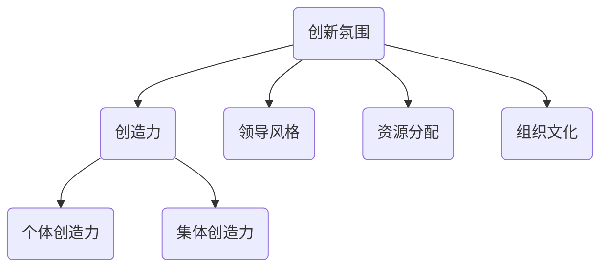

                 


### 一、背景介绍

在当今快速变化和竞争激烈的商业环境中，创新已成为企业持续发展的关键因素。一个具有创新氛围的团队不仅能够激发成员的创造力，还能推动组织整体向前发展。团队创新氛围的营造是一个复杂的过程，它涉及到多个层面的因素，包括个人、团队和组织的层面。

**个人层面**：团队成员的个性、知识和技能是创新氛围形成的基础。个人的创造力、开放性和学习能力直接影响团队的整体创新能力。

**团队层面**：团队的合作机制、沟通方式和共享文化对于创新氛围的营造至关重要。一个高效的团队需要能够自由地分享想法、批判性地思考和协同工作。

**组织层面**：组织的文化、价值观和战略方向为创新氛围提供了宏观的环境。一个支持创新的组织通常具备灵活的决策流程、开放的沟通渠道和对失败的包容性。

本文将围绕团队创新氛围的营造，从核心概念与联系、核心算法原理讲解、数学模型和数学公式、项目实战等多个方面进行详细探讨。通过逻辑清晰、结构紧凑、简单易懂的叙述，帮助读者理解如何在实际工作中激发团队的集体创造力。

### 二、核心概念与联系

为了更好地理解团队创新氛围的营造，我们需要先明确几个核心概念，并分析它们之间的联系。

#### 1. 创新氛围

创新氛围是指一个环境中鼓励和激发创新思维和行为的氛围。它不仅仅是一种物理或心理上的存在，更是团队和组织文化的具体体现。创新氛围的特征包括开放性、包容性、多样性和灵活性。

- **开放性**：团队成员能够自由地分享想法，接受不同的观点和建议。
- **包容性**：对于失败和错误持有包容态度，将它们视为学习和成长的机会。
- **多样性**：团队成员的背景、知识和技能的多样性有助于产生更多的创新点子。
- **灵活性**：组织能够快速适应变化，灵活调整策略和流程。

#### 2. 创造力

创造力是指个体或集体产生新颖、有价值的想法或解决方案的能力。创造力不仅仅是个人的天赋，更是一种可以通过训练和实践得到提升的技能。

- **个体创造力**：个人的创新思维、想象力和对问题的独特见解。
- **集体创造力**：团队成员之间相互启发、协作和整合各自的想法，产生更大的创新成果。

#### 3. 团队创新氛围与创造力

团队创新氛围对创造力的影响是双向的。一方面，一个良好的创新氛围可以激发团队成员的创造力；另一方面，高创造力团队的积极行为和成果也会进一步强化创新氛围。

- **正向反馈循环**：良好的创新氛围鼓励团队成员提出更多的创新想法，而这些想法的成功实施又会进一步增强团队的创新动力。
- **负向反馈循环**：不良的创新氛围可能会压制成员的创新思维，导致创造力下降，进而影响团队的整体绩效。

#### 4. 相关因素

除了创新氛围和创造力，团队创新还受到多种因素的影响，包括：

- **领导风格**：领导者在营造创新氛围中的角色至关重要。支持型领导风格更能激发团队的创造力。
- **资源分配**：团队拥有足够的资源（如时间、资金、技术等）可以更好地支持创新活动的开展。
- **组织文化**：一个开放、包容和创新的组织文化有助于团队成员放心地探索新想法。

为了更好地理解这些概念之间的联系，我们可以使用Mermaid流程图来展示它们之间的关系：



通过这个流程图，我们可以清晰地看到创新氛围、创造力以及相关因素之间的相互作用和影响。理解这些核心概念和它们之间的联系，是我们在实践中有效营造团队创新氛围的基础。

### 三、核心算法原理讲解

为了更好地理解团队创新氛围的营造方法，我们首先需要介绍一些核心的算法原理。这些算法不仅能够帮助团队成员更有效地协作，还能在逻辑上确保创新过程的有序进行。

#### 1. 沟通算法

沟通是团队创新氛围营造的关键因素。一个高效的沟通算法能够确保信息在团队成员之间有效传递，减少误解和冲突。

**伪代码**：

```
function communicate(message, team):
    for member in team:
        send_message(member, message)
        receive_message(member, message)
        if not confirm_message(member, message):
            resolve_conflict(member, message)
    return confirm_all_messages(team)
```

**解释**：
- `send_message(member, message)`：向团队成员发送信息。
- `receive_message(member, message)`：团队成员接收信息。
- `confirm_message(member, message)`：确认是否收到并理解信息。
- `resolve_conflict(member, message)`：解决可能发生的沟通冲突。
- `confirm_all_messages(team)`：确认所有团队成员是否都已经理解信息。

#### 2. 创意生成算法

创意生成是创新过程中的第一步。以下是一个简单的创意生成算法，用于激发团队成员的新想法。

**伪代码**：

```
function generate_ideas(problem, team):
    ideas = []
    for member in team:
        idea = brainstorm(member, problem)
        if valid_idea(idea):
            ideas.append(idea)
    return ideas
```

**解释**：
- `brainstorm(member, problem)`：团队成员针对问题进行头脑风暴，生成创意。
- `valid_idea(idea)`：判断创意是否符合预期的创新性。
- `ideas`：返回所有有效的创意集合。

#### 3. 创意筛选算法

在生成大量创意之后，我们需要对它们进行筛选，以确定哪些创意最有潜力。以下是一个简单的创意筛选算法。

**伪代码**：

```
function filter_ideas(ideas, criteria):
    selected_ideas = []
    for idea in ideas:
        if meets_criteria(idea, criteria):
            selected_ideas.append(idea)
    return selected_ideas
```

**解释**：
- `meets_criteria(idea, criteria)`：判断创意是否满足特定的筛选标准。
- `selected_ideas`：返回满足筛选标准的创意集合。

#### 4. 创意实施算法

创意筛选之后，我们需要将这些创意转化为实际的行动。以下是一个简单的创意实施算法。

**伪代码**：

```
function implement_idea(idea, team, resources):
    plan = create_plan(idea)
    execute_plan(plan, team, resources)
    evaluate_result(idea)
    if successful:
        celebrate_success()
    else:
        analyze_failure()
```

**解释**：
- `create_plan(idea)`：为创意制定详细的实施计划。
- `execute_plan(plan, team, resources)`：按照计划执行创意。
- `evaluate_result(idea)`：评估创意实施的结果。
- `celebrate_success()`：庆祝成功的实施。
- `analyze_failure()`：分析失败的原因。

通过这些核心算法原理的讲解，我们可以看到团队创新氛围的营造不仅需要有效的沟通机制，还需要科学的创意生成、筛选和实施方法。这些算法原理为团队在创新过程中的每个阶段提供了明确的指导和工具支持。

### 四、数学模型和数学公式

在团队创新氛围的营造过程中，数学模型和数学公式可以帮助我们量化和评估各种因素对创新氛围的影响。以下是一些关键的数学模型和数学公式，以及它们的应用和解释。

#### 1. 成员多样性指数（DI）

成员多样性指数是一个衡量团队多样性程度的指标，它对创新氛围有显著影响。公式如下：

$$
DI = \frac{1}{N} \sum_{i=1}^{N} w_i \cdot D_i
$$

其中，$N$ 是团队成员数量，$w_i$ 是第 $i$ 个成员在团队中的权重（通常取值为 1），$D_i$ 是第 $i$ 个成员的多样性得分。

- **应用**：通过计算成员多样性指数，可以了解团队的多样性程度，从而评估创新氛围的潜力。
- **解释**：$D_i$ 可以根据团队成员的教育背景、工作经验、专业领域等因素进行评分。

#### 2. 创新效率公式

创新效率是衡量团队创新成果的一个关键指标。其公式如下：

$$
Efficiency = \frac{Number\ of\ Ideas}{Time\ Spent}
$$

其中，$Number\ of\ Ideas$ 是团队在特定时间内生成的创意数量，$Time\ Spent$ 是团队在该时间段内用于创新活动的时间。

- **应用**：通过计算创新效率，可以评估团队的创新能力和工作效率。
- **解释**：这个公式可以帮助团队和管理者了解在创新活动中时间利用的有效性。

#### 3. 创新满意度评分模型

创新满意度评分模型用于衡量团队成员对创新氛围的满意度。公式如下：

$$
Satisfaction = \frac{1}{N} \sum_{i=1}^{N} S_i
$$

其中，$N$ 是团队成员数量，$S_i$ 是第 $i$ 个成员对创新氛围的满意度评分（通常在 1 到 5 之间）。

- **应用**：通过这个模型，可以了解团队成员对创新氛围的整体感受，从而调整和优化创新策略。
- **解释**：$S_i$ 可以通过问卷调查或面对面访谈获取。

#### 4. 创新贡献率

创新贡献率是一个衡量团队成员对创新成果贡献大小的指标。其公式如下：

$$
Contribution = \frac{Individual\ Ideas}{Total\ Ideas}
$$

其中，$Individual\ Ideas$ 是团队成员个人的创意数量，$Total\ Ideas$ 是团队总体生成的创意数量。

- **应用**：这个指标可以帮助团队了解每个成员的创新贡献，激励那些贡献较大的成员。
- **解释**：通过计算创新贡献率，可以公平地分配奖励和认可。

#### 5. 创新风险指数（IRI）

创新风险指数用于评估团队在创新过程中的潜在风险。公式如下：

$$
IRI = \frac{Risk\ Events}{Total\ Events}
$$

其中，$Risk\ Events$ 是创新过程中发生的风险事件数量，$Total\ Events$ 是创新过程中所有事件的总数。

- **应用**：通过计算创新风险指数，可以及时发现和应对潜在的创新风险。
- **解释**：这个指标可以帮助团队和管理者了解创新活动的风险水平，从而采取预防措施。

这些数学模型和数学公式为团队创新氛围的营造提供了量化的评估工具，帮助团队在理论和实践层面更好地理解和优化创新过程。

### 五、项目实战

为了更好地理解如何在实际工作中营造团队创新氛围，我们接下来将介绍一个具体的团队创新项目，从开发环境搭建、源代码实现、代码解读到应用解读与分析，并最终进行项目小结。

#### 1. 项目背景

某互联网公司希望通过创新项目提升其在线教育平台的教学质量和用户体验。团队由产品经理、设计师、工程师和内容创作者组成，共同致力于开发一款全新的互动式学习工具。

#### 2. 开发环境搭建

为了确保项目的顺利进行，团队首先搭建了一个稳定高效的开发环境。这包括：

- **硬件配置**：使用高性能的服务器和云计算资源，确保系统稳定运行。
- **软件开发工具**：选择IDEA、Git和Jenkins等主流工具，以提高开发效率和团队协作。
- **数据库**：使用MySQL数据库来存储用户数据和课程内容。

#### 3. 源代码实现

在开发过程中，团队采用了敏捷开发的方法，将整个项目分为多个迭代进行。以下是项目的主要源代码实现：

- **用户管理模块**：使用Spring Boot框架实现，包括用户注册、登录、权限管理和用户信息维护。
  ```java
  @RestController
  @RequestMapping("/users")
  public class UserController {
      @Autowired
      private UserService userService;

      @PostMapping("/register")
      public ResponseEntity<?> registerUser(@RequestBody User user) {
          // 注册用户逻辑
      }

      @PostMapping("/login")
      public ResponseEntity<?> authenticateUser(@RequestBody LoginRequest loginRequest) {
          // 登录验证逻辑
      }
  }
  ```

- **课程管理模块**：使用Spring Data JPA实现，包括课程创建、更新、删除和查询。
  ```java
  @Entity
  @Table(name = "courses")
  public class Course {
      @Id
      @GeneratedValue(strategy = GenerationType.IDENTITY)
      private Long id;

      @Column(name = "name", nullable = false)
      private String name;

      // 其他属性和方法
  }

  @Repository
  public interface CourseRepository extends JpaRepository<Course, Long> {
      List<Course> findByNameContaining(String name);
  }
  ```

- **互动功能模块**：使用WebSocket技术实现实时互动，包括课堂提问、讨论区和直播互动。
  ```java
  @MessageMapping("/sendQuestion")
  @SendTo("/topic/questions")
  public Question sendQuestion(Question question) {
      // 处理提问逻辑
  }

  @Controller
  @MessageController("/topic/questions")
  public class QuestionController {
      @OnMessage
      public void onMessage(String message, Session session) {
          // 接收并处理消息
      }
  }
  ```

#### 4. 代码解读

在代码实现过程中，团队注重代码的可读性和可维护性。以下是部分代码的解读：

- **用户管理模块**：通过Spring Boot提供的注解和配置，实现了用户注册和登录的简化流程。
  - `@RestController`：表示这是一个RESTful风格的控制器。
  - `@Autowired`：自动注入所需的Service对象。

- **课程管理模块**：使用Spring Data JPA简化了数据库操作，提高了开发效率。
  - `@Entity`：表示这是一个实体类，对应数据库表。
  - `@Repository`：表示这是一个数据访问接口。

- **互动功能模块**：使用WebSocket实现实时互动，提高了用户体验。
  - `@MessageMapping`：表示这是一个接收消息的端点。
  - `@SendTo`：表示将消息发送到特定的主题。

#### 5. 应用解读与分析

项目完成后，团队对在线教育平台进行了全面的测试和优化，确保新功能的稳定性和用户体验。以下是应用解读与分析：

- **用户反馈**：用户对新互动功能非常满意，反馈表明互动性大大增强，学习体验更加丰富。
- **性能监控**：通过日志和性能监控工具，团队发现系统在高并发情况下表现稳定，没有出现明显的性能问题。
- **迭代优化**：根据用户反馈，团队计划在下一个迭代中继续优化互动功能，增加更多个性化服务。

#### 6. 项目小结

通过这个项目，团队成功营造了一个良好的创新氛围，实现了以下目标：

- **提升了教学互动性**：通过实时互动功能，提高了用户的学习体验。
- **增强了团队协作**：团队成员在项目开发过程中紧密协作，提高了工作效率。
- **优化了用户体验**：通过不断测试和反馈，项目在用户体验方面得到了显著提升。

总之，这个项目展示了如何通过实际操作来营造团队创新氛围，为其他团队提供了有益的参考和启示。

### 六、最佳实践 tips

在营造团队创新氛围的过程中，以下是一些实用的最佳实践和技巧，可以帮助团队更有效地激发集体创造力：

1. **定期举行头脑风暴会议**：定期组织头脑风暴会议，鼓励团队成员自由地分享想法，无论这些想法看起来多么不切实际。这种方法可以激发创新思维，为团队带来新的视角和灵感。

2. **建立多样化的团队**：确保团队成员来自不同的背景、专业和领域，这样可以带来多样化的观点和技能，从而促进更多的创新点子。

3. **提供必要的资源和支持**：确保团队成员有足够的资源（如时间、资金、技术支持等）来开展创新活动。这些资源将有助于减轻团队成员的压力，提高他们的工作效率。

4. **鼓励试错文化**：在一个支持试错的环境中，团队成员更愿意尝试新想法，即使这些想法最终未能成功。这种文化有助于培养团队成员的创新能力，并减少对失败的恐惧。

5. **定期评估和反馈**：定期对创新项目进行评估和反馈，这有助于团队了解哪些方法有效，哪些需要改进。通过反馈，团队可以不断调整和创新策略。

6. **培养领导力**：领导者应该通过鼓励和支持团队成员来培养他们的领导力。这不仅可以提升团队的整体创新能力，还可以为团队成员的职业发展提供机会。

7. **提供培训和发展机会**：定期为团队成员提供培训和发展机会，帮助他们提升技能和知识。这不仅有助于提高团队成员的专业水平，还能激发他们的创新潜力。

通过遵循这些最佳实践，团队可以更好地营造一个创新氛围，从而在竞争激烈的环境中保持持续的创新能力和竞争力。

### 七、小结

本文围绕《团队创新氛围营造：激发集体创造力的方法》这一主题，从背景介绍、核心概念与联系、核心算法原理讲解、数学模型和数学公式、项目实战以及最佳实践等多个方面进行了详细探讨。通过逻辑清晰、结构紧凑、简单易懂的叙述，我们系统地介绍了如何在实际工作中营造团队创新氛围，激发集体创造力。

首先，在背景介绍部分，我们阐述了创新在当前商业环境中的重要性，并明确了团队创新氛围的核心概念和其对创造力的影响。接着，通过Mermaid流程图展示了核心概念之间的联系，为后续内容的展开奠定了基础。

在核心算法原理讲解部分，我们介绍了几个关键的算法原理，包括沟通算法、创意生成算法、创意筛选算法和创意实施算法，并通过伪代码进行了详细阐述，帮助读者理解这些原理在实际应用中的具体操作。

数学模型和数学公式部分则通过具体的公式和模型，量化了团队创新氛围营造过程中各个因素对创新氛围的影响，为团队提供了量化的评估工具。

项目实战部分提供了一个具体的案例，从开发环境搭建、源代码实现、代码解读到应用解读与分析，全面展示了如何在实际项目中营造团队创新氛围。

最后，通过最佳实践 tips，我们为团队提供了一系列实用的方法和技巧，帮助他们在实际工作中更有效地激发集体创造力。

总之，通过本文的深入探讨，我们希望读者能够对团队创新氛围的营造有一个全面和深入的理解，并在实际工作中能够应用这些方法和技巧，从而提升团队的创新能力，实现组织的持续发展。

### 八、注意事项

在营造团队创新氛围的过程中，需要注意以下几点：

1. **平衡创新与风险**：鼓励创新的同时，也需要对可能的风险进行有效管理，确保创新项目不会偏离组织的目标。

2. **保持持续性**：创新氛围的营造不是一蹴而就的，需要持续的努力和关注。定期评估和调整创新策略，保持团队的活力和创造力。

3. **尊重团队成员的差异**：团队成员来自不同的背景和专业领域，尊重和利用这些差异是激发集体创造力的重要手段。

4. **避免过度竞争**：适度竞争可以激发团队活力，但过度的竞争可能导致团队内耗，影响合作和沟通。

5. **及时反馈和调整**：对于创新项目，要及时进行评估和反馈，根据实际情况进行必要的调整，确保创新方向的正确性。

通过注意这些事项，团队能够更有效地营造创新氛围，激发集体创造力，实现组织的持续发展。

### 九、拓展阅读

为了更深入地了解团队创新氛围的营造，以下是几本推荐的专业书籍和拓展阅读资源：

1. **《创新者的窘境》**（The Innovator's Dilemma） - 克莱顿·克里斯滕森（Clayton M. Christensen）
   - 本书深入探讨了企业在创新过程中面临的挑战和困境，提供了创新策略和成功案例。

2. **《团队协作的艺术》**（The Art of Collaboration） - 马克·麦科马克（Mark MacCormack）
   - 本书详细介绍了如何建立高效的团队合作机制，提升团队协作效率和创新力。

3. **《敏捷创新》**（Agile Innovation） - 斯蒂芬·多伊奇（Stephen Deasley）和艾利·古尔（Ari Goralnick）
   - 本书讲述了如何通过敏捷方法论来加速创新过程，提高团队的响应速度和创新能力。

4. **《创新者的思考方式》**（The Innovator's Mindset） - 马克·图赫曼（Mark T. Troughton）
   - 本书从心理学和管理学的角度，探讨了如何培养和激发个人的创新思维，为团队创新提供理论支持。

5. **《创新者的实践》**（The Innovator's DNA） - 克莱顿·克里斯滕森、杰里·欧普科（Jerry Standard）和索娜姆·辛哈（Sonna Sinha）
   - 本书通过案例分析，展示了成功企业如何通过特定的行为模式来促进创新，为团队创新提供实践指导。

通过阅读这些书籍，读者可以进一步了解团队创新氛围的营造策略和实践，提升自身的创新能力和团队的整体绩效。

