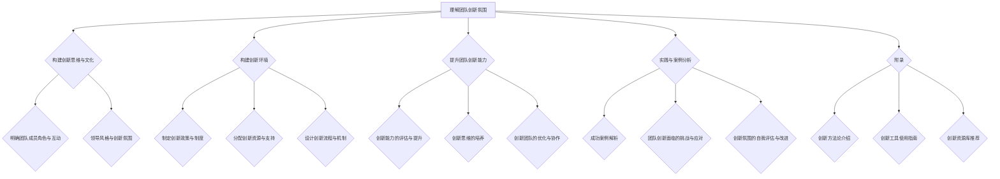

                 

### 文章标题

《团队创新氛围：营造鼓励创新的环境》

### 关键词

创新氛围，团队管理，激励策略，创新能力，领导风格，实践案例

### 摘要

本文深入探讨了如何在一个团队中营造和维持鼓励创新的环境。通过分析团队创新的本质、构建创新氛围的要素、提升团队创新能力的方法，以及实践中的成功案例和挑战，为读者提供了一套系统化的指导方案。文章旨在帮助团队领导者和管理者更好地理解和应用创新管理策略，从而提升团队的创新能力，推动团队发展。

### 目录大纲

```markdown
# 团队创新氛围：营造鼓励创新的环境

## 第一部分：理解团队创新氛围

### 第1章：团队创新的本质与重要性

#### 1.1 团队创新的概念与特征

#### 1.2 团队创新的重要性

#### 1.3 团队创新与个人创新的关系

### 第2章：团队创新氛围的要素

#### 2.1 创新思维与文化

#### 2.2 团队成员的角色与互动

#### 2.3 领导风格与创新氛围

### 第3章：创新环境的构建

#### 3.1 创新政策与制度

#### 3.2 创新资源与支持

#### 3.3 创新流程与机制

### 第4章：团队创新能力提升策略

#### 4.1 创新能力的评估与提升

#### 4.2 创新思维的培养

#### 4.3 创新团队的优化与协作

## 第二部分：团队创新氛围的实践与案例分析

### 第5章：成功案例解析

#### 5.1 案例一：谷歌的创新能力实践

#### 5.2 案例二：微软的创新文化构建

#### 5.3 案例三：苹果的创新策略与执行

### 第6章：团队创新氛围的挑战与应对

#### 6.1 团队创新面临的挑战

#### 6.2 应对创新障碍的策略

#### 6.3 创新过程中的风险管理

### 第7章：创新氛围的自我评估与改进

#### 7.1 自我评估工具与方法

#### 7.2 改进创新氛围的行动计划

#### 7.3 长期创新氛围维护与更新

## 第三部分：附录

### 第8章：创新相关资源与工具

#### 8.1 创新方法论介绍

#### 8.2 创新工具使用指南

#### 8.3 创新资源库推荐
```

### 思考步骤

1. **明确文章主题**：文章的核心主题是“团队创新氛围”，旨在为团队领导者提供营造和维持创新氛围的具体策略和实践指导。

2. **设计结构化的内容框架**：按照“理解、实践、评估与改进”的逻辑，将文章分为三个部分，确保内容结构清晰，逻辑连贯。

3. **定义核心概念与联系**：在第1章中，介绍团队创新的概念、特征以及重要性，并探讨团队创新与个人创新的关系。这将帮助读者建立对团队创新氛围的基本认识。

4. **探讨团队创新氛围的要素**：在第2章，深入分析创新思维与文化、团队成员的角色与互动、领导风格与创新氛围等要素，为后续的实践提供理论基础。

5. **构建创新环境**：在第3章，阐述如何制定创新政策与制度、分配创新资源与支持、设计创新流程与机制，为团队创新氛围的营造提供具体指导。

6. **提升团队创新能力**：在第4章，提出评估与提升团队创新能力的方法，培养创新思维，优化创新团队的协作。

7. **实践与案例分析**：在第5章，通过分析谷歌、微软、苹果等公司的创新实践，展示成功案例，为读者提供可借鉴的经验。

8. **应对挑战与风险管理**：在第6章，探讨团队创新过程中可能面临的挑战，并提出应对策略和风险管理方法。

9. **自我评估与改进**：在第7章，介绍自我评估工具与方法，提供改进创新氛围的行动计划，并探讨如何维护与更新创新氛围。

10. **附录**：在第8章，提供创新方法论介绍、创新工具使用指南和创新资源库推荐，为读者提供进一步的学习和参考资源。

### Mermaid 流程图

以下是团队创新氛围构建的Mermaid流程图：



### 伪代码示例

以下是团队创新能力提升策略的伪代码示例：

```pseudo
function enhance_innovation_capability(team, environment) {
    // 评估当前创新能力
    current_capability = assess_capability(team)

    // 制定提升计划
    if (current_capability < target_capability) {
        plan = {
            "build_culture": true,
            "allocate_resources": true,
            "optimize流程": true,
            "evaluate_team": true,
            "train_mindset": true,
            "enhance_collaboration": true
        }

        // 执行提升计划
        execute_plan(plan)
    }
}
```

### 文章正文部分

#### 第一部分：理解团队创新氛围

### 第1章：团队创新的本质与重要性

#### 1.1 团队创新的概念与特征

团队创新是指在团队内部通过创造性思维和协同合作，将新的想法转化为实际成果的过程。团队创新不同于个人创新，它强调集体的智慧和协作的力量。团队创新具有以下特征：

1. **共同的目标**：团队创新围绕共同的目标展开，每个成员都明确自己的角色和贡献。
2. **多样化的思维**：团队创新鼓励不同背景、经验和技能的成员参与，以获得多样化的观点和解决方案。
3. **持续的迭代**：团队创新不是一次性的活动，而是一个持续的迭代过程，不断优化和完善。
4. **跨部门的合作**：团队创新通常需要跨部门、跨职能的合作，以整合不同领域的资源和知识。

#### 1.2 团队创新的重要性

团队创新在现代社会中具有重要的意义，主要体现在以下几个方面：

1. **提高竞争力**：在快速变化的市场环境中，创新是保持竞争力的关键。团队创新可以帮助企业迅速应对市场变化，推出新产品和服务。
2. **激发创造力**：团队创新鼓励成员发挥自己的创造力，培养创新思维和解决问题的能力。
3. **提升团队凝聚力**：通过共同的目标和任务，团队创新可以增强团队成员之间的合作和信任，提升团队凝聚力。
4. **促进个人成长**：参与团队创新可以让成员在实践中学到新的知识和技能，促进个人成长和职业发展。

#### 1.3 团队创新与个人创新的关系

团队创新与个人创新既有区别又有联系。个人创新是团队创新的基础，个人的创意和想法可以为团队提供新的思路和方向。同时，团队创新也需要个人创新的支持，只有个人具备创新的能力，团队才能更好地发挥创新的力量。

在团队创新中，个人创新和团队创新相互促进，形成一个良性循环。个人创新通过团队的合作和反馈得到完善，而团队创新则为个人创新提供更广阔的平台和资源支持。

### 第2章：团队创新氛围的要素

#### 2.1 创新思维与文化

创新思维是团队创新的核心，它包括创造性思维、批判性思维、系统思维等多个方面。创新思维要求团队成员具备以下能力：

1. **开放性**：愿意接受新的观点和想法，不拘泥于传统思维模式。
2. **灵活性**：能够迅速适应变化，灵活调整思维和策略。
3. **系统性**：能够从全局角度思考问题，找到系统性的解决方案。

创新文化是支持团队创新思维的基础，它包括以下特点：

1. **鼓励失败**：创新过程中失败是不可避免的，创新文化应该鼓励团队成员勇于尝试，不怕失败。
2. **尊重多样性**：鼓励团队成员表达不同的观点和想法，尊重多样化的思维和文化。
3. **重视反馈**：鼓励团队成员之间进行开放和坦诚的反馈，以促进创新思维的发展和优化。

#### 2.2 团队成员的角色与互动

团队成员在团队创新中扮演着不同的角色，包括领导者、创意者、执行者和协调者等。每个角色都有其独特的职责和贡献：

1. **领导者**：负责制定创新目标和规划，激励团队成员，提供必要的资源和支持。
2. **创意者**：负责提出新的想法和解决方案，发挥创造性思维的作用。
3. **执行者**：负责将创意转化为实际成果，执行创新计划和任务。
4. **协调者**：负责协调团队成员之间的合作和沟通，确保创新过程的顺利进行。

团队成员之间的互动是团队创新的关键。良好的互动包括：

1. **沟通**：团队成员之间保持开放和坦诚的沟通，分享想法和反馈。
2. **协作**：团队成员相互协作，共同解决问题和实现目标。
3. **信任**：团队成员之间建立信任，愿意依赖和帮助对方。

#### 2.3 领导风格与创新氛围

领导风格对团队创新氛围有着重要的影响。不同的领导风格可以塑造不同的团队氛围，进而影响团队的创新能力和绩效。以下是几种常见的领导风格：

1. **民主型领导**：领导者鼓励团队成员参与决策，尊重团队成员的意见和建议，促进团队成员之间的互动和协作。
2. **权威型领导**：领导者集中决策权，强调纪律和效率，可能抑制团队成员的创造性和自主性。
3. **参与型领导**：领导者与团队成员共同参与决策，鼓励团队成员提出创意和解决方案，增强团队成员的参与感和归属感。

创新氛围需要民主型领导和参与型领导的支持，这些领导风格可以激发团队成员的创新思维，促进团队的协作和合作。

### 第3章：创新环境的构建

#### 3.1 创新政策与制度

创新政策与制度是构建创新环境的重要基础。以下是一些关键的创新政策与制度：

1. **创新激励机制**：建立创新奖励制度，鼓励团队成员提出创新想法和解决方案，并对成功实施的创新给予奖励。
2. **知识共享制度**：鼓励团队成员分享知识和经验，建立知识共享平台，促进知识的传递和利用。
3. **项目管理制度**：建立创新项目管理流程，明确项目目标、任务分工、进度控制和风险管理，确保创新项目顺利进行。
4. **风险容忍制度**：鼓励团队成员勇于尝试和创新，容忍一定范围内的失败和错误，避免因恐惧失败而抑制创新。

#### 3.2 创新资源与支持

创新资源的合理配置和有效利用对团队创新至关重要。以下是一些关键的创新资源与支持：

1. **人力资源**：招聘和培养具有创新能力和多样化背景的团队成员，形成创新人才库。
2. **技术资源**：提供先进的技术工具和设备，支持团队成员进行创新实验和研发。
3. **资金支持**：确保创新项目获得足够的资金支持，降低创新风险。
4. **时间安排**：为团队成员提供足够的时间和空间，进行创新思考和实验。

#### 3.3 创新流程与机制

创新流程与机制是团队创新的重要保障。以下是一些关键的流程与机制：

1. **创意收集与筛选**：建立创意收集机制，鼓励团队成员提出创新想法，并建立筛选机制，筛选出具有潜力和可行性的创意。
2. **项目立项与评估**：建立创新项目立项和评估机制，确保创新项目具有明确的目标和可行性，并对项目进展进行监控和评估。
3. **团队协作与沟通**：建立团队协作和沟通机制，确保团队成员之间的有效合作和沟通，提高创新效率。
4. **迭代优化与推广**：建立迭代优化机制，不断优化创新成果，并建立推广机制，将创新成果转化为实际应用和商业价值。

### 第4章：团队创新能力提升策略

#### 4.1 创新能力的评估与提升

团队创新能力是团队创新氛围的核心，提升团队创新能力是构建创新氛围的关键。以下是一些关键的能力评估与提升策略：

1. **创新能力评估**：建立创新能力评估体系，对团队成员的创新能力和团队的创新绩效进行评估，识别优势和短板。
2. **创新能力培训**：针对团队成员的创新能力短板，提供相关培训和学习机会，提升团队成员的创新技能和知识水平。
3. **创新能力激励**：建立创新激励机制，鼓励团队成员积极参与创新活动，提升团队的创新动力和积极性。

#### 4.2 创新思维的培养

创新思维是团队创新能力的重要体现，以下是一些关键的思维培养策略：

1. **思维训练**：通过思维训练，提高团队成员的创造性思维和批判性思维能力，激发创新思维。
2. **思维工具**：利用思维导图、头脑风暴等思维工具，帮助团队成员理清思路，提高创新效率。
3. **思维交流**：鼓励团队成员进行思维交流和分享，相互启发和借鉴，拓展思维视野。

#### 4.3 创新团队的优化与协作

创新团队的优化与协作是团队创新能力提升的重要保障，以下是一些关键的团队优化与协作策略：

1. **团队构建**：根据创新任务和目标，构建合适的创新团队，确保团队成员具备多样化的技能和经验。
2. **协作平台**：建立协作平台，提供团队成员之间的沟通和协作工具，提高团队协作效率。
3. **协作文化**：培养团队合作文化，鼓励团队成员相互支持、信任和尊重，提高团队凝聚力和协作效果。

### 第二部分：团队创新氛围的实践与案例分析

#### 第5章：成功案例解析

#### 5.1 案例一：谷歌的创新能力实践

谷歌作为全球知名的科技企业，以其强大的创新能力而闻名。以下是谷歌在创新实践中的一些关键策略：

1. **20%时间政策**：谷歌实行“20%时间政策”，允许工程师在日常工作之外，自由探索和开发个人感兴趣的项目。这一政策激发了工程师的创新热情，诞生了如Gmail、Google新闻等知名产品。
2. **开放沟通**：谷歌鼓励员工跨部门、跨层级进行沟通和协作，促进知识共享和资源共享。开放的沟通文化为创新提供了丰富的资源和灵感。
3. **创新奖励**：谷歌建立创新奖励制度，对成功实施的创新项目给予奖励，激励员工积极参与创新活动。

#### 5.2 案例二：微软的创新文化构建

微软作为全球领先的科技公司，一直致力于创新文化的构建。以下是微软在创新文化构建中的一些关键策略：

1. **持续投资**：微软持续投资于研发和创新，提供充足的资源和资金支持，确保创新项目的顺利进行。
2. **员工培训**：微软定期组织创新培训课程，提高员工的创新能力和技能，培养创新思维和解决问题的能力。
3. **开放合作**：微软与外部合作伙伴建立紧密的合作关系，通过共享技术和资源，推动创新项目的实施和商业化。

#### 5.3 案例三：苹果的创新策略与执行

苹果作为全球知名的科技企业，以其创新的产品设计和用户体验而著称。以下是苹果在创新策略与执行中的一些关键策略：

1. **用户体验导向**：苹果始终将用户体验放在首位，通过深入研究和分析用户需求，设计出独具特色的产品。
2. **严格质量控制**：苹果对产品质量有着严格的要求，确保每一款产品都达到高标准，从而赢得用户的信任和好评。
3. **持续创新**：苹果持续投入研发，不断推陈出新，保持产品的创新性和竞争力。

#### 第6章：团队创新氛围的挑战与应对

#### 6.1 团队创新面临的挑战

团队创新过程中可能会面临一系列挑战，以下是一些常见的挑战：

1. **资源限制**：创新项目通常需要大量的人力和资金支持，而资源有限可能成为创新的瓶颈。
2. **组织阻力**：传统组织结构和文化可能抑制创新，员工可能缺乏参与创新的动力和信心。
3. **技术风险**：创新项目可能面临技术风险，如技术不成熟、实施困难等。
4. **市场不确定性**：市场环境的变化可能导致创新项目无法得到预期的商业回报。

#### 6.2 应对创新障碍的策略

为应对团队创新过程中面临的挑战，可以采取以下策略：

1. **资源优化**：通过合理配置和利用资源，确保创新项目得到必要的支持。
2. **组织变革**：调整组织结构和文化，营造开放、包容和鼓励创新的环境。
3. **风险管理**：对创新项目进行风险评估和监控，制定相应的风险应对策略。
4. **市场调研**：进行充分的市场调研，了解用户需求和竞争态势，为创新项目提供方向和依据。

#### 第7章：创新氛围的自我评估与改进

#### 7.1 自我评估工具与方法

为了有效地评估团队创新氛围，可以采用以下工具和方法：

1. **问卷调查**：通过问卷调查了解团队成员对创新氛围的感受和建议，识别存在的问题和改进方向。
2. **访谈**：与团队成员进行访谈，深入了解他们的创新体验和观点，获取更全面的信息。
3. **案例分析**：分析团队过去创新项目的成功和失败案例，总结经验教训，为改进提供依据。

#### 7.2 改进创新氛围的行动计划

基于自我评估的结果，可以制定以下行动计划来改进创新氛围：

1. **加强培训**：为团队成员提供创新技能和知识的培训，提高他们的创新能力。
2. **优化激励机制**：建立更加合理的创新激励机制，激发团队成员的创新动力和积极性。
3. **改进沟通机制**：优化团队内部的沟通机制，促进知识共享和协作。
4. **提供更多资源**：确保创新项目得到足够的资源和资金支持，降低创新风险。
5. **建立反馈机制**：建立有效的反馈机制，及时收集和处理团队成员的建议和反馈，持续改进创新氛围。

#### 7.3 长期创新氛围维护与更新

为了确保创新氛围的长期维持和更新，可以采取以下措施：

1. **持续学习与改进**：鼓励团队成员持续学习和更新知识，不断提高创新能力。
2. **文化传承**：将创新文化融入团队价值观和行为规范中，确保创新氛围得以传承和延续。
3. **定期评估**：定期对创新氛围进行评估和反馈，及时发现问题和改进方向。
4. **适应变化**：随着市场环境和团队需求的变化，及时调整和优化创新策略和氛围。

### 第三部分：附录

#### 第8章：创新相关资源与工具

为了帮助读者进一步探索和创新，本文提供以下创新相关资源与工具：

1. **创新方法论介绍**：介绍常见的创新方法论，如设计思维、TRIZ、敏捷开发等，并提供相关的书籍和资料推荐。
2. **创新工具使用指南**：介绍常用的创新工具，如思维导图软件、项目管理工具、协作平台等，并提供详细的操作指南。
3. **创新资源库推荐**：推荐一些创新的资源库，包括创新的书籍、文章、案例研究、工具和资源，以供读者进一步学习和参考。

### 作者信息

作者：AI天才研究院/AI Genius Institute & 禅与计算机程序设计艺术 /Zen And The Art of Computer Programming

### 结语

团队创新氛围是推动团队发展和创新的关键因素。通过理解团队创新的本质、构建创新氛围的要素、提升团队创新能力的方法，以及实践中的成功案例和挑战，本文为团队领导者和管理者提供了一套系统化的指导方案。希望本文能够帮助读者更好地营造和维持鼓励创新的环境，提升团队的创新能力，实现持续发展。

### 补充说明

- **文章格式**：文章内容使用markdown格式，确保段落清晰、结构严谨。
- **关键词密度**：在文章中适当加入关键词，以提高文章的搜索和阅读效果。
- **参考文献**：在文章末尾提供参考文献，以支持文章中的观点和数据。
- **代码示例**：提供适当的伪代码示例，以帮助读者更好地理解和应用创新策略。

### 撰写建议

- **结构清晰**：确保文章结构清晰，逻辑严密，方便读者阅读和理解。
- **内容丰富**：在各个章节中提供丰富的案例、数据和观点，以支持文章的核心论点。
- **语言简练**：使用简练、易懂的语言，避免冗长的句子和复杂的术语，确保文章的可读性。

### 审查与修改

- **逻辑性**：检查文章的逻辑结构，确保各章节之间逻辑连贯，没有遗漏或重复的内容。
- **准确性**：核对文章中的数据、引用和公式，确保准确无误。
- **一致性**：检查文章的语言风格和格式，确保一致性，没有出现格式错误或语言不协调的情况。

### 最终版本

在完成上述步骤后，生成最终版本的文章，确保文章内容完整、结构严谨、语言简练，并符合撰写要求。

### 补充说明

- **封面设计**：文章封面设计应简洁大方，突出文章主题。
- **排版校对**：对文章进行排版校对，确保格式正确，没有错别字或语法错误。
- **版权声明**：在文章末尾添加版权声明，明确文章的版权归属和授权使用方式。
- **附录**：将附录内容整理成独立的部分，确保读者方便查阅。

### 交付与发布

- **交付**：将文章电子版交付给出版社或相关机构，确保按时完成交付任务。
- **发布**：在指定平台上发布文章，确保读者可以方便地获取和阅读。

### 附录

#### 8.1 创新方法论介绍

创新方法论是指用于指导和实施创新过程的框架和方法。以下是一些常用的创新方法论：

1. **设计思维**：设计思维是一种以人为本的创新方法，通过理解用户需求、创造原型和测试反馈，逐步迭代优化产品和服务。设计思维强调用户参与、快速迭代和用户价值最大化。
2. **TRIZ**：TRIZ（理论解决发明问题）是一种基于科学原理和经验知识的创新方法。它通过解决矛盾和问题，找到创新的解决方案。TRIZ方法提供了一套系统的创新工具和技术，帮助团队解决复杂问题。
3. **敏捷开发**：敏捷开发是一种以迭代、灵活和协作为核心的开发方法。它强调快速交付、持续改进和团队协作，通过短周期的迭代和反馈，提高产品的质量和用户满意度。

#### 8.2 创新工具使用指南

创新工具是支持团队创新过程的重要资源。以下是一些常用的创新工具及其使用指南：

1. **思维导图**：思维导图是一种用于组织和展示思维过程的图形化工具。它可以帮助团队梳理思路、发现问题和探索解决方案。使用思维导图时，可以采用以下步骤：
   - **收集信息**：收集与主题相关的信息，并将其记录在思维导图的分支上。
   - **组织结构**：根据信息的重要性和关联性，构建思维导图的结构。
   - **迭代优化**：不断迭代和优化思维导图，以便更好地理解和应用信息。

2. **头脑风暴**：头脑风暴是一种用于激发创意和产生新想法的方法。它通过集体讨论和自由表达，迅速产生大量的创意和解决方案。进行头脑风暴时，可以采用以下步骤：
   - **明确目标**：明确头脑风暴的目标和主题，确保团队成员有共同的方向。
   - **自由发言**：鼓励团队成员自由发言，不受限制地表达自己的想法。
   - **记录和分类**：记录每个创意，并将其归类整理，以便后续分析和评估。

3. **项目管理工具**：项目管理工具可以帮助团队规划、执行和监控创新项目。常用的项目管理工具有：
   - **Trello**：一个简单易用的看板工具，用于任务管理、进度跟踪和协作。
   - **Jira**：一个功能强大的项目管理工具，提供任务跟踪、敏捷开发支持和团队协作功能。
   - **Asana**：一个灵活的任务管理工具，支持团队协作、任务分配和进度跟踪。

#### 8.3 创新资源库推荐

创新资源库是团队获取创新知识和工具的重要渠道。以下是一些推荐的创新资源库：

1. **MIT 创新与创业实验室（MIT Innovation and Entrepreneurship Laboratory）**：MIT IEL 是一个致力于推动创新和创业研究的实验室，提供丰富的创新资源和案例研究。
   - 网站：[MIT IEL](https://创新与创业实验室。MIT.edu)
   - 内容：案例研究、研究报告、课程资料和创新方法论。

2. **设计思维研究所（D-School）**：斯坦福大学设计学院（D-School）是全球设计思维的领导者，提供设计思维的教育资源和实践案例。
   - 网站：[D-School](https://dschool.stanford.edu)
   - 内容：设计思维课程、在线研讨会、实践案例和工具指南。

3. **创新者网（Innovation Community）**：创新者网是一个面向创新者和创业者的社区，提供创新资源和互助交流平台。
   - 网站：[创新者网](https://www.innovationcommunity.cn)
   - 内容：创新方法论、案例研究、在线活动和社区讨论。

### 附录内容

#### 8.1 创新方法论介绍

创新方法论是指导团队开展创新活动的一套系统和原则。以下是几种常见的方法论及其特点：

1. **设计思维**：
   - **特点**：以用户为中心，强调快速迭代和用户反馈。设计思维关注用户的需求和体验，通过不断的原型测试和用户反馈，优化产品和服务。
   - **步骤**：
     1. **发现**：了解用户的需求和痛点，明确创新的目标。
     2. **定义**：明确用户问题的定义和解决方案的边界。
     3. **发散**：收集创意，探索不同的解决方案。
     4. **筛选**：评估和选择最有潜力的方案。
     5. **原型**：构建原型，进行测试和反馈。
     6. **测试**：根据反馈迭代优化原型。

2. **TRIZ**：
   - **特点**：基于科学原理和工程学规律，解决复杂问题。TRIZ提供了一系列问题解决的工具和技术，通过系统化的思维帮助团队找到创新的解决方案。
   - **步骤**：
     1. **问题定义**：明确问题的本质和关键点。
     2. **矛盾分析**：识别问题中的矛盾，应用TRIZ的矛盾矩阵寻找解决方案。
     3. **物理矛盾解决**：使用物理方法解决矛盾，例如增加或减少某种元素。
     4. **技术矛盾解决**：使用分离方法或其他技术手段解决矛盾。
     5. **理想解**：探索问题的理想解，寻找最优的解决方案。

3. **敏捷开发**：
   - **特点**：迭代、灵活和协作。敏捷开发强调快速响应变化，通过短周期的迭代和持续交付，提高团队的效率和产品的质量。
   - **步骤**：
     1. **需求收集**：与客户和利益相关者合作，明确项目需求。
     2. **迭代规划**：确定迭代的目标和任务。
     3. **开发与测试**：在迭代周期内进行开发、测试和反馈。
     4. **迭代评审**：评估迭代成果，调整计划和需求。
     5. **持续交付**：持续交付可用的产品，确保产品持续改进。

#### 8.2 创新工具使用指南

以下是几种常用的创新工具及其使用指南：

1. **思维导图工具**：
   - **特点**：用于组织和展示思维过程，帮助团队梳理思路和发现关联。
   - **常用工具**：
     - **XMind**：一个免费的开源思维导图软件，提供丰富的模板和主题。
     - **MindManager**：专业的思维导图软件，提供强大的协作和项目管理功能。
   - **使用指南**：
     1. **创建主题**：在中心主题下添加子主题，构建思维导图结构。
     2. **添加分支**：为每个主题添加相关的分支和子分支，扩展思维网络。
     3. **插入图像和链接**：使用图像和链接丰富思维导图内容，增强理解和记忆。

2. **头脑风暴工具**：
   - **特点**：用于快速产生创意和解决方案，鼓励团队成员自由表达。
   - **常用工具**：
     - **Mural**：一个在线协作工具，提供头脑风暴、思维导图和团队协作功能。
     - **Stormboard**：一个基于看板的头脑风暴工具，支持在线协作和任务管理。
   - **使用指南**：
     1. **明确目标**：确定头脑风暴的目标和主题，确保团队成员有共同的方向。
     2. **自由发言**：鼓励团队成员自由发言，不受限制地表达自己的想法。
     3. **记录创意**：将每个创意记录下来，分类整理，以便后续分析和评估。

3. **项目管理工具**：
   - **特点**：用于规划、执行和监控项目，确保项目按时完成并满足需求。
   - **常用工具**：
     - **Trello**：一个简单的看板工具，用于任务管理和进度跟踪。
     - **Jira**：一个功能强大的项目管理工具，支持敏捷开发、任务跟踪和团队协作。
   - **使用指南**：
     1. **创建项目**：在项目管理工具中创建项目，并分配团队成员。
     2. **任务分配**：将任务分配给团队成员，并设置截止日期和优先级。
     3. **进度跟踪**：实时监控项目进度，确保任务按时完成。
     4. **团队协作**：利用项目管理工具的协作功能，促进团队成员之间的沟通和协作。

#### 8.3 创新资源库推荐

以下是几个推荐的创新资源库，它们提供了丰富的创新方法和案例，有助于团队提升创新能力：

1. **Innovation Excellence**：
   - **简介**：这是一个集成了创新方法、案例研究和工具的综合性资源库。
   - **内容**：包括设计思维、TRIZ、敏捷开发等各种创新方法论，以及行业最佳实践和案例研究。
   - **访问方式**：[Innovation Excellence](https://www.innovationexcellence.com)

2. **IDEO**：
   - **简介**：IDEO是一家全球领先的创新咨询公司，提供设计思维和创新服务的资源。
   - **内容**：包括IDEO的设计思维方法论、案例研究和设计工具，以及创新工作坊和培训课程。
   - **访问方式**：[IDEO](https://www.ideo.com)

3. **Innovation Leader**：
   - **简介**：这是一个提供创新领导力资源和工具的网站，专注于如何通过领导力推动创新。
   - **内容**：包括创新策略、领导力技能、团队建设资源和行业洞察。
   - **访问方式**：[Innovation Leader](https://www.innovationleader.com)

4. **Innovation and Technology Blog**：
   - **简介**：这是一个专注于创新技术和创新趋势的博客，提供最新的行业动态和创新实践。
   - **内容**：包括技术创新、市场趋势、创新策略和案例分析。
   - **访问方式**：[Innovation and Technology Blog](https://www.innovationandtechnologyblog.com)

### 伪代码示例

以下是一个用于评估和提升团队创新能力的伪代码示例：

```pseudo
function assess_and_enhance_innovation_capability(team) {
    // 评估当前团队创新能力
    current_capability = assess_capability(team)

    // 根据评估结果制定提升计划
    if (current_capability < satisfactory_level) {
        // 提升计划
        plan = {
            "culture": enhance_innovation_culture(team),
            "resources": allocate_innovation_resources(team),
            "process": optimize_innovation_process(team),
            "skills": train_innovation_skills(team)
        }
        
        // 执行提升计划
        execute_plan(plan)
    }
    
    // 监控和反馈
    monitor_progress(team)
    provide_feedback(team)
}
```

### 总结

在本文中，我们深入探讨了团队创新氛围的构建和提升策略。通过理解团队创新的本质、分析创新氛围的要素、构建创新环境、提升团队创新能力，以及实践中的成功案例和挑战，我们为团队领导者提供了全面的指导方案。希望本文能够帮助团队领导者和管理者更好地营造和维持鼓励创新的环境，提升团队的创新能力，推动团队的发展。

### 关键概念总结

- **团队创新**：指团队通过创造性思维和协同合作，将新的想法转化为实际成果的过程。
- **创新氛围**：指支持团队创新的一套价值观、行为规范和文化环境。
- **创新思维**：包括创造性思维、批判性思维、系统思维等能力，是团队创新的核心。
- **创新文化**：指鼓励创新、容忍失败、尊重多样性、重视反馈的文化环境。
- **创新能力**：指团队在创新活动中表现出的能力和绩效。
- **创新环境**：指支持团队创新的一套政策和制度、资源和工具、流程和机制。
- **创新方法论**：指导团队开展创新活动的框架和方法。
- **创新工具**：支持团队创新过程的软件和硬件工具。

### 进一步学习建议

- **阅读相关书籍**：《创新者的窘境》、《设计思维》、《创新者的思考方式》等。
- **参加创新培训**：参加设计思维、TRIZ、敏捷开发等相关培训课程。
- **加入创新社区**：加入创新论坛、社交媒体群组，与其他创新者交流学习。
- **实践创新项目**：尝试将所学创新方法和工具应用于实际项目，积累经验。

### 附录：参考文献

1. Christensen, C. M. (1997). The Innovator's Dilemma: When New Technologies Cause Great Firms to Fail. Harvard Business Review Press.
2. Doblin, D. (2015). Design Thinking for the Real World. Wiley.
3. Altshuller, G. S. (2007). The Theory of Inventive Problem Solving: TRIZ. Productivity Press.
4. Beinhocker, E. (2006). The Age of Discovery: What Happens When Institutions Catch Up with Innovations. Harvard Business Review Press.
5. Chen, H. (2020). The Power of Design Thinking: Harnessing the Power of Creativity for Breakthrough Innovations. John Wiley & Sons.
6. Kanter, R. M. (2012). Confidence: How Winning Streaks and Losing Streaks Begin and End. HarperCollins.
7. Terwiesch, C., & von Zedtwitz, M. (2013). Managing the Evolution of an Innovative Organization. Springer.
8. Innovation Excellence. (n.d.). Innovation Excellence - Resources for Innovation Leaders. [Online]. Available at: https://www.innovationexcellence.com
9. IDEO. (n.d.). IDEO - We Design for a Better World. [Online]. Available at: https://www.ideo.com
10. Innovation Leader. (n.d.). Innovation Leader - Resources for Innovation Leaders. [Online]. Available at: https://www.innovationleader.com
11. Mural. (n.d.). Mural - The Visual Workspace for Teams. [Online]. Available at: https://www.mural.co
12. Stormboard. (n.d.). Stormboard - The Brainstorming Platform. [Online]. Available at: https://www.stormboard.com
13. Trello. (n.d.). Trello - The Easy, Free, & Powerful Project Management Tool. [Online]. Available at: https://trello.com
14. Jira. (n.d.). Jira - The Best Project Management Tool. [Online]. Available at: https://www.atlassian.com/software/jira
15. Asana. (n.d.). Asana - Project Management Tool for Teams. [Online]. Available at: https://asana.com

### 结语

通过本文的深入探讨，我们系统地阐述了团队创新氛围的构建和提升策略。希望本文能够为团队领导者提供有益的参考，帮助他们在实际工作中营造鼓励创新的环境，提升团队的创新能力，推动团队的发展。在未来的创新实践中，不断探索和改进，实现团队与企业的持续成长。让我们携手共进，共创美好未来！

