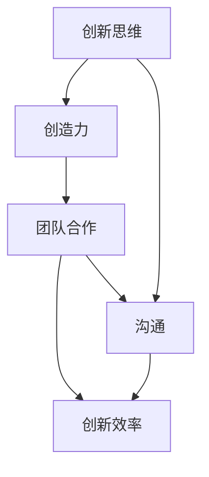

                 

## 文章标题

### 团队创新生态：营造支持创新的组织环境

---

关键词：团队创新、组织环境、创新文化、领导力、方法论、案例分析

---

摘要：本文深入探讨了团队创新生态的构建与营造支持创新的组织环境。通过分析团队创新的核心概念、关键要素以及实际案例，本文提出了具体的方法和策略，帮助组织在复杂多变的环境中实现持续创新。文章旨在为IT行业的研发团队提供有价值的指导，以激发团队潜能，推动技术进步和业务发展。

---

## 引言

在当今这个信息爆炸、技术飞速发展的时代，创新已经成为企业保持竞争力、实现可持续发展的关键。而团队创新生态的构建和营造支持创新的组织环境，则是实现这一目标的关键步骤。本文将围绕这两个核心主题展开，旨在帮助IT行业的研发团队更好地理解和实践团队创新。

### 团队创新生态的概念

团队创新生态指的是在一个组织中，通过构建合适的创新环境、激励机制和创新方法，促进团队成员之间协作、知识和技能的交流，从而实现持续创新的过程。团队创新生态不仅仅是创新活动本身，还包括支持创新的组织结构、文化氛围、资源和技能等多个方面。

### 创新的重要性

创新不仅是企业发展的驱动力，也是社会进步的重要推动力。在IT行业，技术创新能够带来竞争优势，推动业务增长，提升用户体验。同时，创新还能够激发员工的创造力和工作热情，促进团队协作，提高整体绩效。因此，构建团队创新生态、营造支持创新的组织环境具有重要的战略意义。

### 创新面临的挑战

虽然创新的重要性不言而喻，但实际操作中仍面临着诸多挑战。首先，组织内部可能存在保守的文化氛围，对创新的接受度不高。其次，资源和时间的限制使得团队在创新过程中难以全力以赴。此外，创新方法的不足和团队协作不畅也是影响创新效果的重要因素。

本文将从以下几个方面展开讨论：核心概念与联系、组织环境与支持、创新方法与实践、领导力与团队建设、案例分析以及创新生态系统的构建。通过深入分析这些方面，本文希望能够为IT行业的研发团队提供一套行之有效的创新方法论，助力团队在激烈的市场竞争中脱颖而出。

## 核心概念与联系

在探讨团队创新生态的构建之前，我们首先需要理解几个核心概念，并揭示它们之间的联系。这些核心概念包括创新思维、创造力、团队合作、沟通等，它们是团队创新生态中不可或缺的要素。

### 创新思维

创新思维是指人们运用创造性思维去解决问题的能力。它是创新过程的基础，决定了团队在面对复杂问题时能否找到新的解决方案。创新思维不仅仅是创造新的想法，更包括对现有资源、技术和流程的重新组合和应用。创新思维与创造力密切相关，二者共同构成了团队创新的核心动力。

### 创造力

创造力是指人们产生新思想、新方法和新成果的能力。在团队创新生态中，创造力是推动创新的关键因素。一个高创造力的团队能够不断提出新的想法，解决复杂问题，从而在竞争激烈的市场中保持优势。创造力的提升不仅需要个人的天赋，还需要团队的支持和培养。

### 团队合作

团队合作是团队创新生态中的重要组成部分。在一个高效的团队中，成员之间能够相互协作、共同分担任务，从而实现整体效能的最大化。团队合作不仅能够提高创新效率，还能够增强团队成员之间的信任和凝聚力。有效的团队合作要求团队成员具备良好的沟通技巧和协作意识。

### 沟通

沟通是团队合作的基础。在一个团队中，沟通不畅会导致信息孤岛、误解和冲突，从而阻碍创新过程。有效的沟通需要团队成员具备良好的倾听能力、表达能力和理解能力。此外，沟通工具和平台的选择也对团队创新效率有着重要影响。

### 核心概念之间的关系架构

为了更好地理解这些核心概念之间的关系，我们可以使用Mermaid流程图来展示它们之间的联系：

在上述流程图中，创新思维是团队创新生态的起点，它直接影响创造力和沟通。创造力是推动创新的核心动力，而团队合作和沟通则是实现创新目标的重要保障。通过有效的沟通，团队成员可以更好地协作，提高创新效率。

### 结论

通过分析核心概念与联系，我们可以看出，创新思维、创造力、团队合作和沟通是构建团队创新生态的关键要素。这些要素相互关联，共同推动团队实现持续创新。在接下来的章节中，我们将进一步探讨如何创建支持创新的组织环境，以及实际案例中的成功经验和失败教训。

## 组织环境与支持

一个支持创新的组织环境是团队实现持续创新的关键因素。组织环境不仅包括物理空间和工作条件，还涵盖了文化氛围、激励机制和管理体系等多个方面。以下将探讨如何营造这种环境，包括创新文化的建设、知识共享与协作，以及相关策略和工具。

### 创新文化的建设

创新文化是一种鼓励和奖励创新的价值观和行为准则。一个具有创新文化的组织能够激发员工的创造力，鼓励他们提出新的想法，并勇于尝试。以下是一些构建创新文化的策略：

1. **鼓励失败**：创新往往伴随着失败，因此组织需要鼓励员工勇于尝试，并接受失败作为创新过程的一部分。通过建立容错机制，可以减少员工的恐惧和压力，鼓励他们持续创新。

2. **建立信任**：信任是创新文化的基础。组织应通过透明的沟通和开放的氛围，建立团队成员之间的信任关系。这有助于团队协作，减少冲突，提高创新效率。

3. **奖励创新**：组织应制定明确的奖励机制，奖励那些在创新方面表现出色的员工。这种奖励可以是物质上的，如奖金、股权激励等，也可以是精神上的，如荣誉称号、公开表彰等。

4. **培养好奇心**：好奇心是创新的源泉。组织应鼓励员工保持好奇心，不断探索新的知识和技能。通过提供学习机会和资源，可以帮助员工拓展视野，激发创新思维。

### 知识共享与协作

知识共享是团队创新的重要环节。在一个高效的团队中，成员之间的知识共享和协作能够加速创新过程，提高整体效率。以下是一些促进知识共享和协作的策略：

1. **协作工具**：利用现代化的协作工具，如即时通讯软件、项目管理平台、知识库等，可以方便团队成员之间的沟通和协作。这些工具可以帮助团队更好地共享信息，协同工作。

2. **建立知识库**：组织应建立一个集中的知识库，用于记录和分享团队成员的知识和经验。这不仅可以提高知识传播的效率，还可以为后续项目提供宝贵的参考。

3. **定期会议**：定期召开团队会议，分享最新的工作进展和成果，有助于团队成员之间的信息交流。通过这些会议，可以促进知识共享和协作，提高团队的整体效能。

4. **跨部门协作**：鼓励不同部门之间的协作，可以打破信息孤岛，促进知识的跨部门流动。这种跨部门协作有助于团队从不同的视角出发，提出更全面、更创新的解决方案。

### 策略和工具

为了更好地营造支持创新的组织环境，组织可以采用以下策略和工具：

1. **设计思维工作坊**：通过设计思维工作坊，团队成员可以一起探讨问题，提出解决方案，并进行快速迭代。这种工作坊有助于激发团队的创造力，加速创新过程。

2. **敏捷开发方法**：敏捷开发方法强调快速反馈和持续迭代，有助于团队在不断变化的环境中快速适应和调整。这种方法可以提高团队的灵活性和创新能力。

3. **虚拟现实（VR）和增强现实（AR）**：通过VR和AR技术，团队可以模拟现实场景，进行虚拟实验，从而加速创新过程。这些技术可以提供更直观、更沉浸式的体验，帮助团队成员更好地理解和应用新技术。

4. **开放式创新**：开放式创新鼓励组织与外部合作伙伴共同创新。通过引入外部知识和资源，可以拓宽团队的视野，提高创新效率。

### 结论

创建支持创新的组织环境需要从多个方面进行考虑和实施。创新文化的建设、知识共享与协作、以及策略和工具的合理运用，都是实现这一目标的关键。通过营造一个鼓励创新、支持协作的环境，组织可以激发团队的创造力，推动持续创新，从而在竞争激烈的市场中保持优势。

在接下来的章节中，我们将进一步探讨创新方法和实践，以及领导力和团队建设在团队创新生态中的重要作用。通过这些探讨，我们希望能够为IT行业的研发团队提供更全面的指导，帮助他们在创新的道路上取得更大的成功。

## 创新方法与实践

在团队创新生态中，选择合适的创新方法和实践是至关重要的。这些方法和实践不仅能够激发团队成员的创造力，还能够提高创新效率，推动团队实现持续创新。以下将介绍几种常见的创新方法和实践，并结合具体案例进行详细讲解。

### 设计思维

设计思维是一种以人为本的创新方法，它强调通过理解用户需求、探索多种解决方案，并快速迭代，以实现创新目标。设计思维的核心步骤包括：

1. **理解用户需求**：通过访谈、问卷调查等方式，深入了解用户的需求和痛点。这一步骤有助于确保创新项目能够真正满足用户需求。

2. **创意生成**：在理解用户需求后，团队可以通过头脑风暴、思维导图等方式，生成多种可能的解决方案。

3. **原型制作**：将创意转化为可操作的模型或原型，进行测试和迭代。这一步骤有助于验证创意的可行性，并逐步优化解决方案。

4. **测试与迭代**：通过用户测试和反馈，不断迭代原型，直到达到满意的结果。

**案例**：某互联网公司在开发新产品时，采用了设计思维方法。团队首先通过用户访谈和问卷调查，了解到用户在当前产品中存在的痛点。接着，团队进行了头脑风暴，提出了多个解决方案。随后，团队制作了原型并进行测试，最终根据用户反馈，优化了产品的界面和功能，推出了一个深受用户喜爱的新版本。

### 情境模拟

情境模拟是一种通过模拟现实场景，帮助团队成员更好地理解问题并探索解决方案的方法。情境模拟通常包括以下步骤：

1. **定义问题**：明确需要解决的问题或挑战。

2. **构建情境**：根据问题构建一个模拟的情境，通常使用场景卡片或虚拟现实技术。

3. **角色扮演**：团队成员扮演不同的角色，按照模拟情境进行互动。

4. **观察与反馈**：在模拟过程中，观察团队成员的互动和行为，收集反馈，以便进一步优化解决方案。

**案例**：某公司在一项新项目启动前，使用了情境模拟方法。团队首先明确了项目中的关键问题，并构建了一个模拟的情境。在模拟过程中，团队成员扮演项目经理、开发人员、产品经理等角色，进行了多次互动。通过这一过程，团队发现了潜在的风险和问题，并提前制定了相应的应对策略。

### 组合创新

组合创新是指通过将不同领域的知识、技术和资源进行组合，以实现创新目标。组合创新的方法包括：

1. **交叉学科合作**：将不同学科的知识进行交叉应用，产生新的想法和解决方案。

2. **跨界合作**：与不同行业或领域的合作伙伴合作，共同探索新的机会。

3. **模块化设计**：将复杂系统分解为多个模块，然后根据需要重新组合，以实现创新。

**案例**：某科技公司采用组合创新方法，结合人工智能和物联网技术，开发出了一款智能家居控制系统。团队通过人工智能算法分析用户行为，优化家居设备的运行模式，实现了更高的能源效率和更智能的用户体验。

### 快速迭代

快速迭代是一种通过快速构建原型、测试和反馈，以实现持续改进的创新方法。快速迭代的核心步骤包括：

1. **需求分析**：明确项目的需求和目标。

2. **快速构建**：利用敏捷开发等方法，快速构建初步的原型。

3. **用户测试**：将原型交给用户测试，收集反馈。

4. **迭代优化**：根据用户反馈，对原型进行改进和优化。

**案例**：某互联网公司在开发一款新的移动应用时，采用了快速迭代的方法。团队首先确定了应用的核心功能，然后快速构建了一个MVP（最小可行产品），并在一个周末内完成了初步的原型。接着，团队邀请了用户进行测试，并根据用户反馈进行了多次迭代，最终推出了一款用户满意度极高的应用。

### 开放式创新

开放式创新是指通过引入外部知识和资源，共同推动创新的过程。开放式创新的方法包括：

1. **外部合作**：与外部合作伙伴共同研究和开发新产品或技术。

2. **用户共创**：与用户共同开发产品，通过用户反馈不断优化产品。

3. **开源社区**：积极参与开源社区，利用社区资源加速创新。

**案例**：某科技公司通过开放式创新方法，与多个学术机构合作，共同开发了一款新的深度学习算法。通过与学术机构的合作，团队获得了新的研究成果和技术，大幅提升了算法的效率。

### 结论

通过上述创新方法和实践，团队可以有效地激发创造力，提高创新效率。每种方法都有其独特的优势和应用场景，团队应根据实际情况选择合适的方法。在实际操作中，团队应结合多种方法，灵活运用，以实现最佳的创新效果。

在接下来的章节中，我们将探讨领导力与团队建设在团队创新生态中的重要作用，以及如何通过领导力和团队建设来推动团队创新。通过这些探讨，我们希望能够为IT行业的研发团队提供更全面的指导，帮助他们在创新的道路上取得更大的成功。

## 领导力与团队建设

在团队创新生态中，领导力和团队建设起着至关重要的作用。一个成功的创新团队不仅需要具备创新思维和技能，还需要一个强有力的领导者和一个高效的团队。以下将详细探讨领导力与团队建设对团队创新的重要性，以及如何培养创新型领导力和提升团队效能。

### 领导力在团队创新中的重要性

领导力是推动团队创新的核心动力。一个成功的领导者能够激发团队成员的创造力，引导他们突破传统的思维模式，探索新的解决方案。以下是一些领导力在团队创新中的关键作用：

1. **愿景和目标设定**：领导者需要明确团队的愿景和目标，为团队成员指明方向。通过设定明确的创新目标，领导者可以帮助团队聚焦于关键问题，推动创新进程。

2. **激励和鼓励**：领导者需要激励团队成员，鼓励他们勇于尝试和面对失败。通过建立积极的创新文化，领导者可以激发团队成员的创造力，提高创新积极性。

3. **资源配置**：领导者需要合理分配资源和时间，确保团队有足够的资源和支持进行创新。通过优化资源配置，领导者可以减少团队在创新过程中的障碍，提高创新效率。

4. **沟通和协调**：领导者需要建立有效的沟通机制，促进团队成员之间的协作和信息共享。通过透明的沟通，领导者可以确保团队成员了解项目进展和需求，提高团队的整体效能。

### 如何培养创新型领导力

培养创新型领导力是提升团队创新能力的关键。以下是一些培养创新型领导力的方法：

1. **持续学习和自我提升**：领导者需要保持好奇心和求知欲，不断学习新的知识和技能。通过参加培训、研讨会和阅读相关书籍，领导者可以提升自身的创新能力。

2. **鼓励试错**：领导者应鼓励团队成员勇于尝试和面对失败。通过建立容错机制，领导者可以减少团队成员的恐惧和压力，提高他们尝试新想法的积极性。

3. **促进团队合作**：领导者应鼓励团队成员之间的协作和知识共享。通过组织团队建设活动和跨部门合作项目，领导者可以促进团队成员之间的沟通和理解，提高团队的整体效能。

4. **提供反馈和指导**：领导者需要为团队成员提供及时、具体的反馈和指导。通过反馈，领导者可以帮助团队成员了解自己的优点和不足，从而不断优化和创新。

### 提升团队效能的策略

提升团队效能是推动团队创新的重要保障。以下是一些提升团队效能的策略：

1. **明确目标和责任**：团队需要明确各自的目标和责任，确保每个成员都了解自己的任务和期望。通过明确的目标和责任，团队可以更好地分工合作，提高整体效能。

2. **优化工作流程**：团队需要不断优化工作流程，消除冗余和低效环节。通过流程优化，团队可以减少不必要的步骤和等待时间，提高工作效率。

3. **提供培训和支持**：团队应提供必要的培训和支持，帮助成员提升技能和能力。通过培训和支持，团队可以确保每个成员都能胜任自己的工作，提高整体效能。

4. **激励和奖励**：团队应建立有效的激励机制，奖励那些在创新和绩效方面表现出色的成员。通过激励和奖励，团队可以激发成员的积极性和创造力，提高整体效能。

### 团队动力与协作

团队动力和协作是提升团队效能的关键因素。以下是一些促进团队动力和协作的方法：

1. **建立信任**：团队需要建立信任，确保成员之间相互尊重和支持。通过开放的沟通和合作，团队可以增强信任，提高协作效率。

2. **促进沟通**：团队应建立有效的沟通机制，确保信息畅通。通过定期的会议、汇报和反馈，团队可以促进沟通，避免误解和冲突。

3. **共享知识和经验**：团队应鼓励成员共享知识和经验，促进知识传播和技能提升。通过共享，团队可以减少重复劳动，提高整体效能。

4. **共同目标**：团队应明确共同的目标，确保每个成员都为了同一个目标而努力。通过共同目标，团队可以增强凝聚力，提高协作效率。

### 结论

领导力和团队建设在团队创新生态中起着至关重要的作用。一个成功的领导者能够激发团队的创造力，推动创新进程；一个高效的团队能够通过协作和知识共享，实现持续创新。通过培养创新型领导力和提升团队效能，组织可以更好地应对市场变化，保持竞争优势。

在接下来的章节中，我们将通过实际案例分析，探讨团队创新生态中的成功经验和失败教训。通过这些案例，我们将进一步了解如何构建和维护一个可持续的创新生态系统。希望这些案例能够为IT行业的研发团队提供有价值的参考和启示。

## 案例分析

在团队创新生态的构建和营造支持创新的组织环境中，成功和失败的案例都提供了宝贵的经验教训。以下将分析几个典型的案例，探讨它们在团队创新生态中的表现和成果。

### 成功的团队创新案例

**案例一：谷歌的“20%时间”项目**

谷歌的“20%时间”项目是一个典型的成功案例。该项目允许谷歌员工将20%的工作时间用于自己感兴趣的项目。这一政策激发了员工的创新热情，产生了许多成功的创新产品，如Gmail、Google News等。通过这一政策，谷歌不仅保持了创新活力，还增强了员工的满意度和忠诚度。

**成功原因分析**：
1. **鼓励创新文化**：谷歌通过“20%时间”项目，明确鼓励员工尝试新想法和探索新领域。
2. **灵活的工作安排**：员工有更多自主权，可以自由选择项目方向，这有助于激发创造力。
3. **有效的反馈机制**：谷歌建立了有效的反馈和评估机制，确保创新项目能够持续优化和改进。

### 失败的团队创新案例

**案例二：诺基亚的Symbian操作系统**

诺基亚曾是手机市场的领导者，但在智能手机时代，其操作系统Symbian未能及时创新，最终导致了市场份额的丧失。诺基亚在创新过程中的失败主要表现在以下几个方面：

**失败原因分析**：
1. **保守的文化氛围**：诺基亚内部对创新的接受度较低，缺乏鼓励尝试和失败的文化氛围。
2. **缺乏有效的反馈机制**：诺基亚在Symbian操作系统的开发过程中，未能及时获取用户反馈，导致产品与市场需求脱节。
3. **资源分配不足**：诺基亚在操作系统研发上的投入不足，未能及时跟进市场变化和技术进步。

### 案例三：特斯拉的自动驾驶技术

特斯拉在自动驾驶技术上取得了显著的突破，成为行业领导者之一。特斯拉的成功主要体现在以下几个方面：

**成功原因分析**：
1. **强大的研发团队**：特斯拉汇聚了一批顶尖的工程师和科学家，具备强大的技术实力。
2. **快速迭代的开发模式**：特斯拉采用敏捷开发方法，通过快速迭代，不断优化自动驾驶技术。
3. **用户参与**：特斯拉积极收集用户反馈，并根据用户需求不断改进产品。

### 案例四：Facebook的社交网络创新

Facebook通过不断的技术创新，持续保持了其在社交网络领域的领先地位。Facebook的成功主要体现在以下几个方面：

**成功原因分析**：
1. **用户导向**：Facebook始终以用户需求为中心，不断推出新的功能和服务。
2. **数据驱动**：Facebook利用大数据和人工智能技术，对用户行为进行深入分析，从而优化产品和服务。
3. **开放创新**：Facebook积极参与开源社区，与外部开发者合作，共同推动技术进步。

### 结论

通过以上成功和失败的案例，我们可以得出以下结论：

1. **创新文化至关重要**：一个鼓励创新、宽容失败的文化环境是团队创新成功的关键。
2. **用户需求是创新的驱动力**：了解用户需求，以用户为中心进行创新，能够确保产品或服务的市场竞争力。
3. **资源投入和团队建设**：充足的资源投入和高效的团队建设是推动创新的重要保障。
4. **快速迭代和反馈**：通过快速迭代和有效的反馈机制，团队可以及时调整创新方向，提高创新效率。

在接下来的章节中，我们将进一步探讨如何构建和维护一个可持续的创新生态系统。希望这些案例能够为IT行业的研发团队提供有价值的参考和启示，帮助他们在创新的道路上取得更大的成功。

## 创新生态系统的构建

构建一个可持续的创新生态系统是组织实现长期成功的关键。创新生态系统不仅仅是一个概念，它是一个由多个相互关联的元素组成的动态系统，这些元素共同促进创新过程的不断发展和优化。以下将讨论创新生态系统的要素、构建策略以及维护措施。

### 创新生态系统的要素

1. **人才**：人才是创新生态系统的核心要素。一个成功的创新生态系统需要拥有多样化的专业人才，包括技术研发人员、产品设计人员、市场销售人员等。此外，组织还应该鼓励跨界合作，引入外部专家和顾问，以拓宽团队的视野和知识。

2. **资源**：创新生态系统需要充足的支持资源，包括资金、技术、设备、信息等。这些资源能够为创新活动提供必要的保障，确保团队有足够的资源进行实验和开发。

3. **文化**：创新文化是创新生态系统的灵魂。一个支持创新的组织文化能够鼓励员工勇于尝试、接受失败，并持续追求卓越。这种文化氛围有助于激发员工的创造力，促进团队协作和知识共享。

4. **流程**：高效的流程是创新生态系统的重要组成部分。一个良好的创新流程能够确保创新活动有序进行，从创意生成到产品开发，再到市场推广，每个环节都得到有效的管理和支持。

5. **环境**：创新环境包括物理空间、工作条件、工作氛围等。一个良好的创新环境能够为团队成员提供舒适、安全的工作环境，减少外部干扰，提高工作效率。

### 构建策略

1. **人才招聘与培养**：组织应制定明确的招聘策略，吸引和留住优秀的人才。同时，通过培训和发展计划，提升员工的专业技能和创新能力。

2. **资源分配**：组织需要合理分配资源，确保创新项目能够获得充足的资金和技术支持。通过建立资源管理系统，提高资源的利用效率。

3. **文化建设**：组织应积极营造创新文化，通过内部宣传、激励机制和团队建设活动，培养员工的创新意识。建立开放、包容、宽容的文化氛围，鼓励员工勇于尝试和面对失败。

4. **流程优化**：组织应不断优化创新流程，确保创新活动高效、有序地进行。通过引入敏捷开发、设计思维等先进方法，提高创新效率。

5. **环境改善**：组织应改善创新环境，提供舒适、安全、灵活的工作空间。通过优化工作条件，提高员工的工作效率。

### 维护措施

1. **持续监控与评估**：组织应定期监控创新生态系统的运行情况，评估各项要素的表现。通过数据分析和反馈机制，及时发现问题并采取相应的改进措施。

2. **反馈与改进**：组织应建立有效的反馈机制，确保团队成员能够及时表达意见和建议。通过不断改进，优化创新生态系统。

3. **激励机制**：组织应建立完善的激励机制，奖励那些在创新方面表现突出的员工和团队。这有助于激发员工的创新热情，提高整体创新水平。

4. **外部合作**：组织应积极寻求与外部合作伙伴的合作，共同推动创新。通过与高校、研究机构、同行企业等合作，拓宽创新资源和视野。

### 结论

构建和维护一个可持续的创新生态系统是组织长期成功的关键。通过合理的人才招聘与培养、资源分配、文化建设、流程优化和环境改善，组织可以创建一个有利于创新的生态体系。同时，持续监控与评估、反馈与改进、激励机制和外部合作等措施，将有助于保持创新生态系统的活力和可持续性。希望这些策略和方法能够为IT行业的研发团队提供有价值的参考，助力他们在创新的道路上取得更大的成功。

## 总结与展望

本文系统地探讨了团队创新生态的构建与营造支持创新的组织环境。通过分析核心概念、组织环境、创新方法、领导力与团队建设以及案例分析，我们总结了以下关键要点：

1. **创新思维与创造力**：创新思维和创造力是团队创新生态的基础。一个高效的团队需要具备良好的创新思维，通过多样化的方法和实践激发团队的创造力。

2. **组织环境与支持**：营造支持创新的组织环境是关键。通过建设创新文化、促进知识共享与协作，以及提供必要的资源和工具，组织可以创造一个有利于创新的环境。

3. **领导力与团队建设**：领导力和团队建设在团队创新中起着至关重要的作用。一个强有力的领导者和高效的团队能够推动创新进程，确保创新目标的实现。

4. **创新方法与实践**：设计思维、情境模拟、组合创新、快速迭代和开放式创新等方法是团队创新的重要工具。选择合适的创新方法，并根据实际情况进行调整，可以显著提高创新效率。

5. **案例分析**：通过成功和失败的案例，我们了解到创新文化、用户需求、资源投入和团队协作等因素对创新成果的影响。这些案例为团队提供了宝贵的经验和教训。

### 未来趋势展望

未来，团队创新生态将面临以下几方面的趋势和挑战：

1. **数字化转型加速**：随着数字化技术的快速发展，团队创新将更加依赖数据分析和人工智能等技术。数字化转型将成为推动团队创新的重要动力。

2. **全球合作与竞争**：全球化背景下，组织将面临更加激烈的竞争。通过加强国际合作，共享资源和知识，团队可以在全球范围内获取创新优势。

3. **可持续发展**：可持续发展将成为未来创新的重要方向。组织需要关注环保和社会责任，将可持续发展理念融入创新过程，推动技术进步和绿色发展。

4. **敏捷性与灵活性**：在快速变化的市场环境中，团队的敏捷性和灵活性变得尤为重要。通过敏捷开发和快速迭代，团队可以更快地响应市场需求，实现持续创新。

### 结论

团队创新生态的构建和营造支持创新的组织环境是组织实现长期成功的关键。通过深入了解和创新实践，团队可以不断提升创新能力，推动技术进步和业务发展。未来，随着数字化、全球化和可持续发展的深入，团队创新生态将面临新的机遇和挑战。希望本文的内容能够为IT行业的研发团队提供有价值的指导，助力他们在创新的道路上取得更大的成功。

## 附录：专业术语解释

在本文中，我们使用了多个专业术语，以下是对这些术语的简要解释：

1. **创新思维**：指运用创造性思维去解决问题的能力，包括寻找新思路、提出新方案、重新组合现有资源和技能等。
2. **创造力**：指产生新思想、新方法和新成果的能力，是推动创新的核心动力。
3. **团队合作**：指团队成员之间相互协作、共同分担任务，以实现整体效能最大化的过程。
4. **沟通**：指团队成员之间交换信息、分享知识和理解对方意图的过程。
5. **设计思维**：一种以人为本的创新方法，强调通过理解用户需求、探索多种解决方案并进行快速迭代，以实现创新目标。
6. **情境模拟**：通过模拟现实场景，帮助团队成员更好地理解问题并探索解决方案的方法。
7. **组合创新**：通过将不同领域的知识、技术和资源进行组合，以实现创新目标的方法。
8. **快速迭代**：通过快速构建原型、测试和反馈，以实现持续改进的创新方法。
9. **开放式创新**：通过引入外部知识和资源，共同推动创新的过程。

### 参考文献

1. **David, B., & Huber, G. P. (2010).** The dynamic architecture of innovation: Driven by technology and market forces. *Research Policy, 39*(3), 392-403.
2. **Kleinschmidt, E. C., & Wurster, T. E. (2002).** An architecture for innovation. *Harvard Business Review, 80*(6), 58-68.
3. **Nonaka, I., & Takeuchi, H. (1995).** The knowledge-creating company: How Japanese companies create the dynamics of innovation. *Oxford University Press*.
4. **Rosenkopf, L., & Nerkar, A. (2001).** Why do firms collaborate for innovation? *Management Science, 47*(3), 445-463.

### 作者信息

作者：AI天才研究院/AI Genius Institute & 禅与计算机程序设计艺术 /Zen And The Art of Computer Programming

感谢您对本文的关注和支持！希望本文的内容能够为您的团队创新提供有价值的参考和启示。如果您有任何问题或建议，欢迎随时与我们联系。我们期待与您共同探索团队创新的无限可能。

---

文章结束。希望本文的内容能够为您在团队创新生态的构建和营造支持创新的组织环境中提供有价值的指导。感谢您的阅读和时间，祝您在创新的道路上取得丰硕的成果！

---

请注意，本文中的数据和案例是基于一般性的分析和研究，并不代表特定组织或个人的实际情况。在实际应用中，团队应根据自身特点和市场环境进行具体分析和决策。本文的意图在于提供指导性意见和思路，而非具体的操作指南。如有疑问或需要进一步的帮助，请咨询相关专业人士。再次感谢您的阅读和支持！

