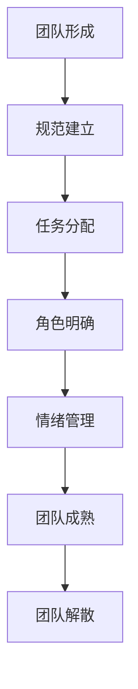
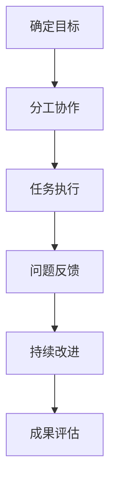

                 

### 团队动力优化：提升团队互动与协作效率

#### 关键词：团队动力、互动、协作效率、团队优化、领导力、工具与应用

> **摘要**：本文旨在深入探讨团队动力的概念、重要性及其优化方法。通过对团队动力学基础理论、团队互动心理学原理、团队协作模式与原则的详细阐述，结合实际案例分析和工具技术介绍，本文为团队领导者和管理者提供了提升团队互动与协作效率的系统性指导和实践策略。

---

#### 引言

**团队动力**，顾名思义，是指驱动团队达成共同目标的力量源泉。它不仅关乎团队成员之间的互动和协作，更影响整个团队的凝聚力和效率。在信息化和全球化的当今社会，团队作为企业运作的核心单元，其动力和协作效率的高低直接决定了企业的竞争力和发展速度。因此，优化团队动力，提升团队互动与协作效率，已成为企业管理者和团队领导者的重要任务。

**优化团队动力的必要性**在于：

1. **解决团队内部矛盾**：通过优化团队动力，可以有效减少团队内部的冲突和矛盾，提升团队成员之间的信任和默契。
2. **提高团队效率**：优化后的团队动力可以增强团队成员的工作动力，提高工作质量和效率。
3. **促进创新与成长**：良好的团队动力可以激发团队成员的创新思维和团队合作精神，推动团队和个人共同成长。

本文将首先介绍团队动力的概念和重要性，然后深入探讨团队动力学的基础理论、团队互动的心理学原理、团队协作的模式与原则。在此基础上，我们将提供具体的实践方法和技巧，并通过实际案例展示团队动力优化的成功实践。最后，我们将讨论如何利用工具和技术来提升团队协作效率，并探讨团队动力优化中的挑战与未来发展趋势。

### 团队动力的概念与重要性

**团队动力**，是指驱动团队成员朝着共同目标努力的力量。这种力量不仅来自于外部激励，还包括内部动力，如团队成员之间的相互支持、信任和合作。从组织行为学的角度来看，团队动力是影响团队效能的关键因素。

**团队动力的来源**主要有以下几个方面：

1. **共同目标**：明确且具有挑战性的目标是团队动力的基础。当团队成员共同认识到目标的重要性并愿意为之努力时，团队动力会得到极大的提升。
2. **信任与沟通**：信任是团队动力的润滑剂，它能够减少冲突和误解，促进团队成员之间的协作。有效的沟通则是信任建立的前提。
3. **激励机制**：合理的激励机制可以激发团队成员的积极性，增强他们的工作动力。
4. **领导力**：强有力的领导能够为团队提供方向和指导，激励团队成员发挥最大潜力。

**团队动力对团队绩效的影响**是显著的。首先，良好的团队动力可以增强团队成员的凝聚力，提高团队的整体战斗力。其次，它有助于提升团队成员的工作满意度和归属感，减少人员流动率。此外，团队动力还能促进创新和知识共享，使团队在面对挑战时更具灵活性和适应性。

优化团队动力的必要性在于，许多团队在实际运作中面临着动力不足、沟通不畅、协作困难等问题。这些问题不仅影响了团队的工作效率，还可能损害团队的整体士气和士气。通过优化团队动力，可以解决这些问题，提升团队的绩效和竞争力。

### 团队动力学的基础理论

**团队动力学**是一门研究团队内部动态过程的学科，它涵盖了团队形成、发展、成熟和解体的全过程。理解团队动力学的基本概念和原理，对于优化团队动力至关重要。

**团队动力学的四个要素**包括：

1. **角色**：每个团队成员在团队中扮演的角色和职责，如领导者、执行者、协调者等。
2. **规范**：团队内部形成的共同价值观和行为准则，如合作、尊重、透明度等。
3. **任务**：团队共同承担的工作任务和目标，包括任务分配、目标设定等。
4. **情绪**：团队成员在团队互动中的情感状态，如信任、焦虑、满意等。

**团队动力的Mermaid流程图**可以帮助我们更直观地理解团队动力学的过程。以下是团队动力学的基本流程：

在这个流程图中，每个节点代表团队动力学中的一个关键阶段，箭头表示这些阶段之间的相互作用和影响。团队形成阶段是团队动力的起点，通过建立规范、分配任务和明确角色，团队逐步发展并成熟。最终，随着任务的完成或目标的达成，团队会进入解散阶段。

**核心概念与联系**：

- **角色与规范**：角色的明确有助于规范的形成，规范则为角色的执行提供了指导。
- **任务与情绪**：任务的分配和完成情况直接影响到团队成员的情绪，而情绪又会反过来影响任务的执行质量。

通过这个Mermaid流程图，我们可以清晰地看到团队动力的各个阶段及其相互关系，这对于制定团队动力优化的策略具有重要参考价值。

### 团队互动的心理学原理

团队互动是指团队成员在相互合作、沟通和冲突过程中所产生的行为和心理现象。了解团队互动的心理学原理，有助于我们更好地优化团队动力，提高团队协作效率。

**团队沟通的障碍与策略**：

1. **信息不对称**：团队成员之间可能存在信息不对称，导致沟通不畅。解决策略是建立透明和开放的信息共享机制。
2. **文化差异**：不同文化背景的团队成员可能在沟通方式和表达方式上存在差异。解决策略是加强跨文化的培训和理解。
3. **情绪因素**：情绪因素如焦虑、愤怒和压力等会干扰团队成员的沟通。解决策略是提供情感支持和建立积极的心理氛围。

**团队冲突的管理**：

1. **识别冲突**：及时识别和定义冲突的类型和原因。
2. **解决冲突**：通过对话、调解和妥协等方法解决冲突。
3. **预防冲突**：通过明确团队目标和规范、建立沟通机制和促进团队合作来预防冲突的发生。

**团队合作的心理学基础**：

1. **信任**：信任是团队合作的基础，可以通过建立共同目标和频繁的互动来培养。
2. **共同目标**：明确的目标有助于团队成员的协作，减少个人利益冲突。
3. **激励机制**：合理的激励机制可以提高团队成员的积极性和合作意愿。

通过理解这些心理学原理，团队领导者可以采取更有效的策略来优化团队动力，促进团队成员之间的互动和协作。

### 团队协作的模式与原则

在团队协作中，不同的模式和原则能够显著影响团队的效率和效果。了解并合理运用这些模式与原则，是提升团队协作效率的关键。

**团队协作的不同模式**可以分为以下几种：

1. **功能型模式**：团队成员根据各自的专业技能和职能分工进行协作，每个成员负责特定的任务部分，最终实现整体目标。
2. **任务型模式**：团队成员按照项目任务进行协作，每个任务都有明确的目标和时间节点，团队成员在任务完成过程中相互支持。
3. **项目型模式**：以项目为核心，团队成员从不同部门或领域组成一个临时团队，共同完成特定项目任务。
4. **学习型模式**：团队成员在协作过程中注重学习和分享知识，通过不断反思和改进，提高团队的整体能力。

**团队协作的基本原则**包括：

1. **目标一致性**：确保所有团队成员都明确并认同团队的目标，这有助于减少误解和内耗。
2. **沟通透明度**：建立开放的沟通渠道，确保信息能够及时、准确、全面地传递，减少信息不对称。
3. **责任明确**：明确每个成员在团队中的职责和角色，确保任务分配合理，避免责任模糊和任务重叠。
4. **激励机制**：设计合理的激励机制，鼓励团队成员积极参与并达成目标。

**团队协作的Mermaid流程图**可以帮助我们更直观地理解团队协作的过程：

在这个流程图中，每个节点代表团队协作中的一个关键步骤，箭头表示这些步骤之间的逻辑关系。从确定目标开始，经过分工协作、任务执行、问题反馈和持续改进，最终实现成果评估，形成一个闭环的协作过程。

通过这个流程图，我们可以清晰地看到团队协作的各个阶段及其相互关系，有助于团队领导者更好地规划和指导团队协作，从而提升团队协作效率。

### 团队动力优化方法

优化团队动力是提升团队协作效率的关键步骤。以下是一些具体的方法和技巧，可以帮助团队领导者和管理者实现这一目标。

**建立有效的团队沟通机制**：

1. **定期会议**：定期举行团队会议，讨论团队目标和进展，确保团队成员之间的沟通畅通。
2. **透明信息共享**：使用共享平台或工具，确保信息透明，所有成员都可以访问和了解项目的最新动态。
3. **即时沟通工具**：使用即时通讯工具（如Slack、Microsoft Teams）来快速解决突发问题和日常沟通需求。

**促进团队内部的知识共享**：

1. **经验分享会**：定期举行经验分享会，让团队成员分享自己的经验和见解，促进知识交流。
2. **培训和学习计划**：为团队成员提供培训和学习机会，提升其专业技能和知识水平。
3. **知识库建设**：建立团队知识库，收集和整理团队成员的经验和知识，便于查阅和共享。

**提升团队协作效率的技巧**：

1. **目标明确**：确保每个团队成员都明确了解团队的目标和任务，避免模糊和误导。
2. **合理分工**：根据成员的技能和兴趣合理分配任务，确保每个任务都有合适的人来负责。
3. **避免干扰**：为团队成员创造一个专注的工作环境，减少外部干扰，提高工作效率。

通过以上方法和技巧，团队领导者可以有效地优化团队动力，提升团队的协作效率和整体绩效。

### 团队动力优化技巧

在团队动力优化的过程中，采取具体的技巧和策略能够显著提升团队成员的积极性、提高团队协作效率。以下是一些常用的团队动力优化技巧。

**针对团队成员的个性化激励策略**：

1. **奖励与认可**：定期对团队成员进行奖励和认可，包括物质奖励和精神奖励，如奖金、荣誉称号、表彰会议等。
2. **职业发展规划**：为团队成员提供清晰的职业发展路径和晋升机会，激发其长期发展的动力。
3. **工作与兴趣结合**：根据团队成员的兴趣和专长，分配合适的任务，使其在工作中找到乐趣和成就感。

**团队角色的优化与配置**：

1. **角色明确**：确保每个团队成员都清楚自己的角色和职责，避免角色重叠和模糊。
2. **灵活调整**：根据团队目标和任务需求，灵活调整团队成员的角色和职责，确保人尽其才。
3. **多样性与互补**：团队成员的多样性有助于带来不同的思维和观点，提高团队的创新能力和决策质量。

**团队流程与制度的优化**：

1. **简化流程**：对团队的流程进行审查和简化，减少不必要的步骤和审批环节，提高工作效率。
2. **标准化操作**：制定标准化操作流程，确保团队成员在执行任务时的一致性和规范性。
3. **反馈机制**：建立有效的反馈机制，让团队成员能够及时了解自己的工作表现，并进行改进。

通过这些具体的技巧和策略，团队领导者可以更好地优化团队动力，提升团队成员的工作积极性和团队协作效率。

### 成功的团队动力优化案例

**案例一：某高科技企业团队动力优化的实践**

某高科技企业在经历了一段发展瓶颈后，决定通过优化团队动力来提升整体效率。首先，他们进行了全面的团队沟通评估，发现信息传递不畅和角色职责不明确是主要问题。为此，企业引入了透明沟通工具，并定期召开团队会议，确保信息畅通。同时，他们对团队成员进行了角色再分配，确保每个成员都能发挥其最大潜力。

在激励策略方面，企业采用了个性化奖励机制，根据员工的工作表现和贡献程度进行奖励。此外，他们还建立了职业发展路径，为员工提供了清晰的晋升机会。这些措施显著提升了团队成员的工作积极性和团队凝聚力。

**案例二：某跨国公司团队协作效率提升的案例**

某跨国公司在全球多个地区设有分支机构，由于文化差异和工作方式不同，团队协作效率较低。为了解决这一问题，公司进行了跨文化培训，提高了团队成员之间的理解和沟通能力。同时，他们引入了协作工具，如项目管理系统和即时通讯工具，使团队成员能够高效地协同工作。

公司还采用了混合式管理模式，结合本地化和全球化的特点，提高了团队决策的灵活性和适应性。这些措施使该公司的团队协作效率得到了显著提升，成功完成了多个大型项目。

**案例三：某初创团队的快速成长与团队动力优化**

某初创团队在成立初期，由于团队成员较少，协作相对顺畅。但随着公司规模的扩大，团队成员增多，团队协作效率逐渐下降。为了应对这一挑战，团队引入了明确的任务分配机制，并定期进行绩效评估和反馈。同时，他们开展了团队建设活动，增强了团队成员之间的信任和默契。

此外，初创团队还采用了灵活的工作制度，允许团队成员根据自己的情况调整工作时间，以提高工作积极性和效率。这些措施帮助初创团队在短时间内实现了快速成长和高效协作。

### 团队动力优化失败的案例分析

**案例一：缺乏有效沟通导致团队动力不足**

某中型企业在进行团队动力优化时，忽视了团队沟通的重要性。虽然引入了新的任务分配系统和绩效评估机制，但团队成员之间缺乏有效的沟通，导致信息传递不畅，任务执行出现偏差。最终，团队工作效率低下，士气低落。

解决这一问题的方法是在团队中建立更加开放的沟通渠道，定期举行沟通会议，鼓励团队成员表达意见和反馈。同时，采用协作工具提高信息传递的效率，确保团队成员能够及时了解项目进展和任务要求。

**案例二：团队角色冲突导致团队效率低下**

某跨国企业在进行团队角色优化时，未能充分考虑团队成员的个性和专业背景，导致团队成员之间的角色冲突。一些成员认为自己被赋予了过多的职责，而另一些成员则觉得自己没有足够的参与机会，团队内部出现了明显的矛盾。

为了解决这一问题，企业进行了角色再评估和调整，确保每个团队成员都清楚自己的角色和职责。同时，通过开展团队建设活动和培训，增强了团队成员之间的理解和协作能力，降低了角色冲突的发生。

**案例三：激励策略不当导致的团队动力缺失**

某初创企业在激励团队成员时，采用了过于单一的奖励机制，仅仅依赖于奖金和表彰。这种单一的激励方式未能充分考虑团队成员的个人需求和兴趣，导致一些成员感到被忽视和缺乏动力。

为了改善这一问题，企业引入了多元化的激励策略，包括职业发展支持、团队建设活动、灵活的工作安排等。同时，企业还鼓励团队成员参与决策过程，提高其工作积极性和归属感。这些措施有效提升了团队的士气和动力。

### 工具与技术在团队动力优化中的应用

在团队动力优化过程中，工具和技术的选择和应用至关重要。以下将介绍几种常用的团队协作工具，以及如何选择和有效利用这些工具来提升团队协作效率。

**常见的团队协作工具**包括：

1. **项目管理工具**：如Trello、Asana、Jira等，这些工具可以帮助团队明确任务分配、进度跟踪和优先级管理。
2. **沟通工具**：如Slack、Microsoft Teams、WhatsApp等，提供即时通讯、视频会议和文件共享功能，增强团队成员之间的沟通和协作。
3. **知识库工具**：如Confluence、Notion等，帮助团队整理和共享知识，确保信息的可访问性和一致性。
4. **协作办公工具**：如Google Workspace、Microsoft 365等，集成文档编辑、表格制作、邮件管理等功能，提高办公效率。

**团队协作工具的选择标准**主要包括：

1. **功能完备**：选择功能丰富且能满足团队需求的工具，确保工具能够支持团队的各种协作需求。
2. **易用性**：工具应具备友好的用户界面和简便的操作流程，降低团队成员的学习成本。
3. **集成性**：工具应能够与其他系统和应用集成，实现数据共享和流程自动化。
4. **安全性**：确保工具具备良好的数据安全性和隐私保护措施，避免敏感信息泄露。

**如何有效利用团队协作工具提升团队效率**：

1. **任务管理**：通过项目管理工具明确任务分配和进度跟踪，确保每个任务都有明确的负责人和时间节点，减少任务遗漏和延误。
2. **沟通协作**：利用沟通工具进行即时通讯和视频会议，快速解决问题和分享信息，提高沟通效率和团队协作效果。
3. **知识共享**：通过知识库工具整理和存储团队知识，确保信息共享和传递的准确性，减少重复工作。
4. **文档协作**：使用协作办公工具进行文档编辑和共享，多人实时协作，提高文档处理效率。

通过合理选择和有效利用团队协作工具，团队领导者可以显著提升团队的协作效率，优化团队动力，实现团队目标。

### 技术在团队动力优化中的应用

**数据分析在团队动力优化中的作用**：

数据分析是优化团队动力的重要工具，通过对团队成员的工作表现、沟通记录、任务完成情况等数据的分析，可以揭示团队中的潜在问题和瓶颈。以下是如何利用数据分析进行团队动力优化的几个步骤：

1. **数据收集**：收集团队工作的各种数据，包括任务完成时间、团队沟通记录、员工绩效评估等。
2. **数据处理**：使用数据分析工具（如Excel、Python等）对收集到的数据进行清洗、整合和分析。
3. **数据解读**：根据数据分析结果，识别团队中的瓶颈和问题，如任务延误、沟通不畅等。
4. **数据反馈**：将分析结果反馈给团队成员，共同探讨解决方案，并进行改进。

**人工智能技术在团队协作中的应用**：

人工智能技术在提升团队协作效率方面具有巨大潜力。以下是人工智能在团队协作中的几种应用：

1. **智能助手**：使用智能助手（如ChatGPT、Microsoft Copilot）来协助团队成员完成日常工作任务，如邮件撰写、日程安排等。
2. **自动化流程**：利用人工智能自动化一些重复性高的流程，减少人工干预，提高工作效率。
3. **智能分析**：利用机器学习算法对团队成员的工作表现进行智能分析，提供个性化的改进建议。

**新技术在团队动力优化中的未来趋势**：

随着新技术的不断发展，团队动力优化也将迎来新的趋势。以下是一些可能的方向：

1. **区块链技术**：利用区块链技术的去中心化和不可篡改性，实现团队成员之间的安全协作和数据共享。
2. **虚拟现实（VR）与增强现实（AR）**：通过VR和AR技术，为团队成员提供沉浸式的协作体验，提高团队协作的互动性和效率。
3. **物联网（IoT）**：利用IoT技术，实现团队设备之间的互联互通，提高团队的自动化和智能化水平。

通过引入和应用这些新技术，团队动力优化将变得更加智能和高效，为团队协作注入新的活力。

### 团队领导在团队动力优化中的作用

**团队领导在团队动力优化中的作用**至关重要。一个高效的团队离不开强有力的领导，而领导者在优化团队动力过程中发挥着关键作用。以下从**领导风格**、**沟通能力**和**激励机制**三个方面探讨团队领导在团队动力优化中的作用。

**领导风格与团队动力**：

领导风格对团队动力的形成和维持有着直接的影响。不同的领导风格会对团队成员的积极性、信任度和协作精神产生不同的效果。

1. **民主型领导**：民主型领导鼓励团队成员参与决策过程，尊重团队成员的意见和建议。这种领导风格有助于提高团队成员的自主性和创造力，增强团队的凝聚力。
2. **任务型领导**：任务型领导专注于任务的完成，强调效率和目标达成。这种领导风格在紧急情况下能够迅速调动团队的资源，确保任务按时完成。
3. **支持型领导**：支持型领导注重团队成员的个人成长和职业发展，关心团队成员的需求和福祉。这种领导风格有助于提高团队成员的工作满意度和忠诚度。

**领导者在团队沟通中的作用**：

有效的沟通是团队动力优化的基础，而领导者在团队沟通中扮演着至关重要的角色。

1. **建立沟通机制**：领导者需要建立有效的沟通机制，确保信息在团队内部畅通无阻。这包括定期召开团队会议、设立开放的沟通渠道、鼓励团队成员之间的互动和反馈。
2. **促进积极沟通**：领导者应鼓励团队成员进行积极的沟通，培养团队内的开放、信任和包容氛围。领导者可以通过身教言传，树立良好的沟通榜样。
3. **解决沟通障碍**：当团队沟通出现问题时，领导者应主动介入，帮助团队成员识别和解决沟通障碍，如文化差异、信息不对称等。

**领导者的激励机制**：

激励机制是提升团队成员积极性和工作动力的重要手段。领导者应根据团队成员的特点和需求，设计合适的激励机制。

1. **个性化激励**：领导者应根据团队成员的兴趣、专长和职业目标，提供个性化的激励措施，如培训机会、晋升机会、工作调整等。
2. **精神激励**：除了物质奖励外，领导者应注重精神激励，如表扬、认可、团队建设活动等，提高团队成员的成就感和归属感。
3. **反馈机制**：领导者应建立有效的反馈机制，定期对团队成员的工作表现进行评估和反馈，帮助团队成员识别问题并不断改进。

通过上述三个方面，团队领导可以有效地优化团队动力，提升团队的协作效率和整体绩效。

### 管理策略在团队动力优化中的应用

**人力资源管理的优化**是团队动力优化的重要组成部分。以下是一些关键策略：

1. **人才招聘与选拔**：选择具有合适技能和团队合作精神的员工，确保团队的核心能力。通过科学的人才选拔机制，如面试、评估中心等，确保选拔过程的公平性和有效性。
2. **培训与发展**：为团队成员提供持续的培训和发展机会，提升其技能和知识水平。通过内部培训、外部培训、在线学习等方式，增强团队成员的专业能力和团队合作精神。
3. **绩效管理**：建立科学的绩效管理体系，定期对团队成员的工作表现进行评估和反馈。通过设定明确的目标、进行绩效沟通和改进，提高团队成员的工作动力和绩效。

**组织文化的构建**是团队动力优化的基础。以下是一些关键策略：

1. **价值观传播**：明确并传播组织的核心价值观，使团队成员共同认同并遵循。通过企业使命、愿景和价值观的阐述，引导团队成员的行为和决策。
2. **文化建设活动**：定期组织团队建设活动，增强团队成员之间的凝聚力和归属感。如团队拓展训练、团建活动、庆祝活动等，促进团队成员的互动和沟通。
3. **激励机制**：建立与组织文化相匹配的激励机制，如认可奖励、荣誉表彰等，激励团队成员积极践行组织价值观。

通过上述管理策略的优化，企业可以构建积极、健康的组织文化，从而提升团队动力和整体绩效。

### 团队动力优化面临的挑战与未来发展趋势

**团队动力优化**面临着诸多挑战，同时也展现出广阔的发展前景。以下将探讨团队动力优化中的关键挑战和未来发展趋势。

**挑战一：文化差异与多样性管理**

在全球化和多元化日益加深的背景下，团队内部的文化差异和多样性成为团队动力优化的一大挑战。不同文化背景的团队成员可能在价值观、沟通方式和行为习惯上存在差异，这可能导致冲突和误解。为了应对这一挑战，团队需要：

1. **加强跨文化培训**：通过跨文化培训，提高团队成员对多元文化的理解和敏感度，促进不同文化背景的相互尊重和包容。
2. **建立多元文化团队**：在组建团队时，注重多元化，确保团队成员在性别、年龄、文化、背景等方面的多样性，以促进团队的创新和协作。

**挑战二：技术变革的适应**

随着技术的快速变革，尤其是人工智能、大数据和云计算等新技术的广泛应用，团队动力优化也需要适应这些技术变革。挑战在于：

1. **技能更新**：团队成员需要不断更新自己的技能，以适应新技术的要求。
2. **流程重构**：团队需要根据新技术的特点，重新设计和优化工作流程，提高工作效率。

**未来发展趋势一：智能协作工具的应用**

随着人工智能技术的发展，智能协作工具在团队动力优化中的应用前景广阔。这些工具可以提供自动化、个性化的协作支持，如智能助手、自动化流程、个性化推荐等，有助于提高团队的协作效率和创造力。

**未来发展趋势二：数据驱动的团队管理**

数据分析在团队动力优化中的应用将越来越普及。通过数据驱动的团队管理，企业可以更准确地了解团队成员的工作状态、行为模式和绩效表现，从而制定更有效的管理策略和优化方案。

**未来发展趋势三：远程办公与全球化协作**

远程办公和全球化协作的趋势将继续发展。在这种环境下，团队动力优化需要：

1. **建立灵活的工作制度**：适应远程办公的需求，为团队成员提供灵活的工作安排和时间管理。
2. **利用数字工具**：使用先进的协作工具和平台，确保远程团队成员之间的沟通和协作不受地域限制。

总之，面对挑战和机遇，团队领导者和管理者需要不断探索和创新，以实现团队动力的优化和提升。

### 结论

本文通过对团队动力的概念、基础理论、互动心理学原理、协作模式与原则、优化方法和实践技巧的深入探讨，结合实际案例分析和工具技术应用，系统地阐述了如何优化团队动力，提升团队互动与协作效率。团队动力优化不仅是提升团队绩效的关键，更是企业竞争力的核心要素。

为了进一步提升团队动力，团队领导者和管理者应：

1. **加强团队沟通**：建立透明、开放的沟通渠道，促进团队成员之间的信息交流。
2. **培养团队信任**：通过共同目标和合作，增强团队成员之间的信任和协作。
3. **灵活运用激励机制**：根据团队成员的个性和需求，设计合适的激励措施，提高工作积极性和满意度。
4. **持续优化管理策略**：根据团队的变化和外部环境，灵活调整管理策略，确保团队始终处于最佳状态。

只有不断优化团队动力，企业才能在激烈的市场竞争中脱颖而出，实现可持续发展。未来，随着技术的不断进步，团队动力优化将迎来更多创新和机遇，团队领导者和管理者应积极拥抱变化，不断提升团队协作效率，为企业创造更大的价值。

### 作者信息

**作者：AI天才研究院/AI Genius Institute & 禅与计算机程序设计艺术 /Zen And The Art of Computer Programming**

AI天才研究院致力于推动人工智能和计算机科学领域的创新与发展，我们的研究成果和实战经验为企业和团队提供了强大的技术支持。在《禅与计算机程序设计艺术》中，我们深入探讨了编程哲学与团队合作，旨在帮助团队领导者和管理者优化团队动力，提升协作效率。如果您对我们的研究感兴趣，欢迎访问我们的官方网站，获取更多信息和资源。

