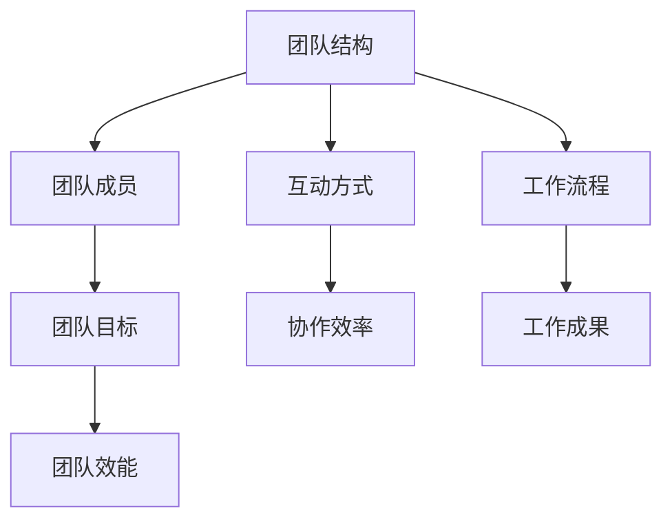
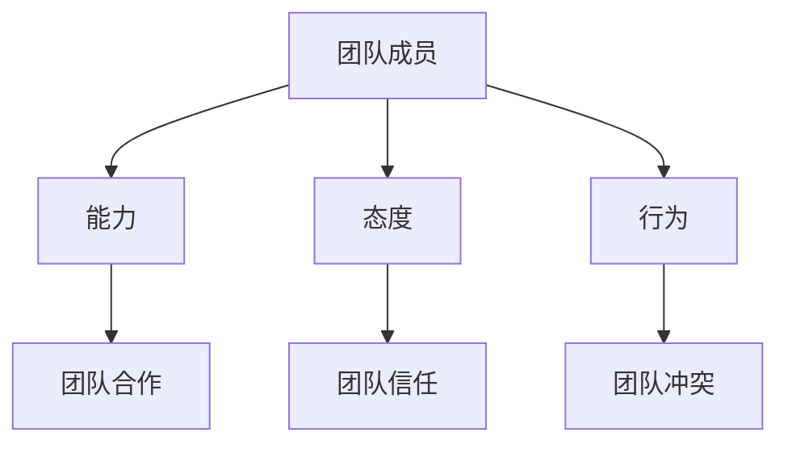
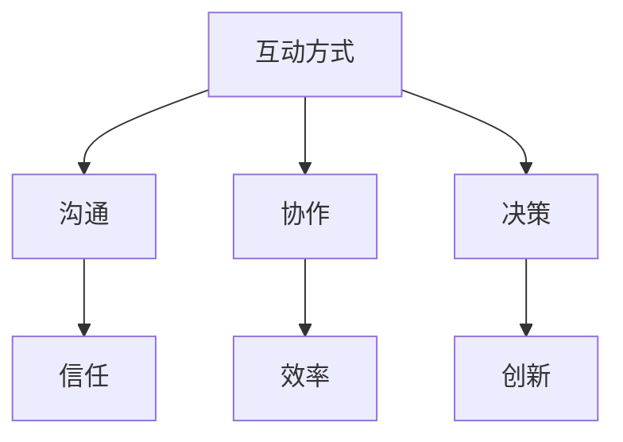
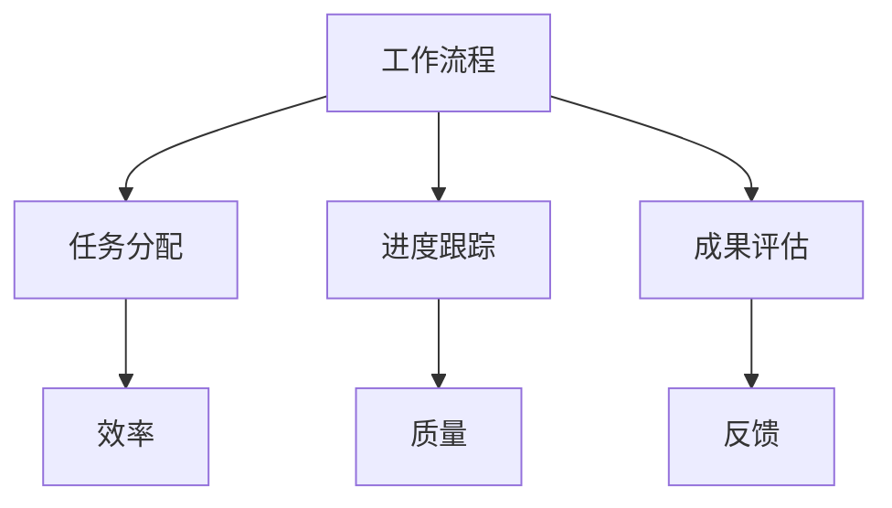
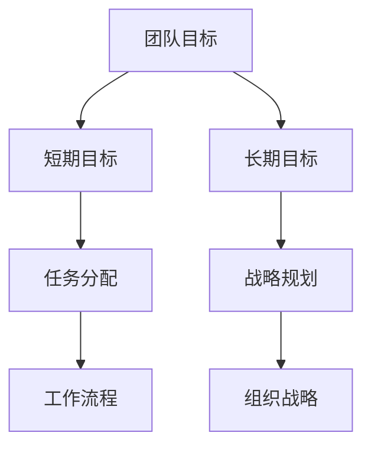
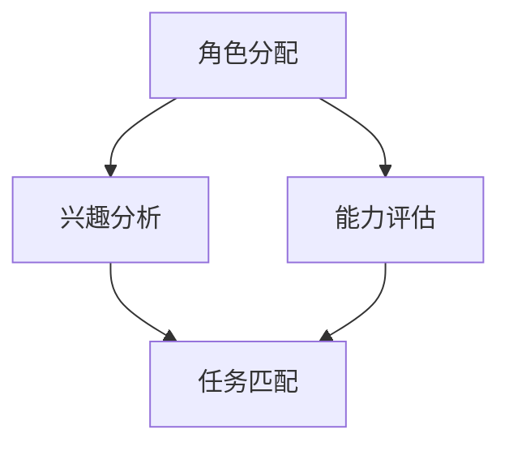
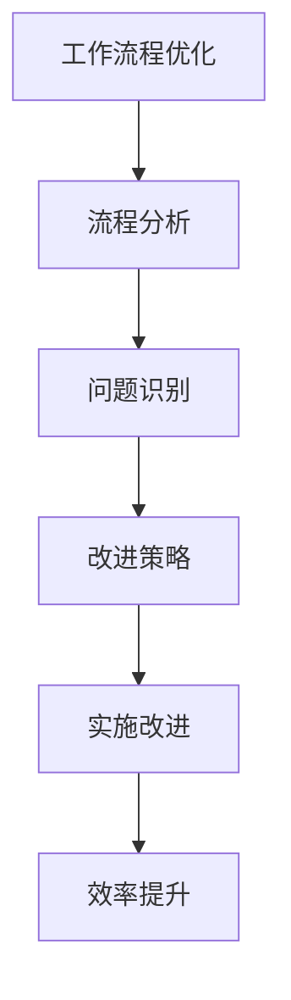

                 

### 摘要

《团队动力学：优化团队互动与协作》旨在深入探讨团队动力学在优化团队互动与协作中的应用。团队动力学是一门研究团队内部动力机制及其运作规律的科学，它关注如何通过调整团队结构和互动方式，提高团队的效率与创新能力。本文将首先介绍团队动力学的核心概念与原理，包括其基本类型和关键流程。接下来，我们将详细阐述团队互动与协作机制的构成与设计，并探讨如何通过优化团队互动与协作来提升团队整体表现。此外，本文还将介绍团队动力学的数学模型，解释其在不同领域中的应用，并通过实例进行详细说明。在实践部分，我们将讨论团队互动与协作的评估方法、改进策略和实战技巧。最后，文章将展望团队动力学在项目管理与组织发展中的未来趋势，提供相关策略与建议。通过本文的阅读，读者将全面了解团队动力学的基本原理和实际应用，从而提升团队协作效率，实现团队价值的最大化。

### 文章关键词

团队动力学、团队互动、团队协作、优化、数学模型、项目管理、组织发展。

### 背景介绍

团队动力学是一门研究团队内部动力机制及其运作规律的科学，旨在通过分析团队的行为模式、沟通方式和工作流程，找出提升团队效率和协作能力的有效方法。随着全球化和信息技术的发展，团队工作已成为现代企业中不可或缺的一部分。如何优化团队互动与协作，提高团队的整体效能，成为企业和组织管理者面临的重要课题。

在现代企业中，团队动力学的重要性体现在以下几个方面：

1. **提高工作效率**：团队动力学通过优化团队结构和互动方式，有助于消除团队成员之间的障碍，提高工作流程的效率。

2. **提升创新能力**：团队动力学的应用可以促进团队成员之间的知识共享和创新思维的碰撞，从而激发团队的创新能力。

3. **增强团队凝聚力**：通过有效的团队动力学方法，可以提高团队成员之间的信任度和协同作战能力，增强团队凝聚力。

4. **促进组织发展**：团队动力学不仅关注团队内部，还涉及团队与外部环境的互动，有助于组织整体的协调发展。

然而，在实际应用中，团队动力学也面临一些挑战。例如，如何在不同文化和背景的团队中有效应用团队动力学原理？如何处理团队成员之间的冲突和误解？这些都是需要深入探讨的问题。本文将通过系统分析和实例研究，探讨团队动力学的核心概念、应用方法和实践技巧，以期为团队管理和组织发展提供有益的指导。

### 核心概念与联系

团队动力学作为研究团队内部动力机制的科学，其核心概念包括团队结构、团队成员、互动方式和工作流程。以下是这些核心概念的详细说明及其相互之间的联系。

#### 团队结构

团队结构是指团队内部的组织形式和角色分配。它包括团队的大小、团队的组织层级、团队成员的职能划分等。团队结构直接影响团队成员之间的互动方式和协作效率。例如，一个功能型团队与一个跨职能团队在结构上有着显著差异，这决定了它们在任务分配和决策过程中的互动方式也不同。

**Mermaid流程图**：


#### 团队成员

团队成员是团队动力学的核心组成部分，他们的能力、态度和行为对团队的整体表现有着重要影响。团队成员不仅包括个体成员，还包括角色和职责的分配。团队成员之间的关系和互动方式决定了团队的合作效果。

**Mermaid流程图**：


#### 互动方式

互动方式是指团队成员之间如何进行沟通、协作和决策。有效的互动方式可以增强团队成员之间的信任和协同，提高团队的整体效率。互动方式包括正式的会议、非正式的交流、信息共享和反馈机制等。

**Mermaid流程图**：


#### 工作流程

工作流程是指团队成员在完成任务时所遵循的步骤和流程。合理的工作流程可以减少冗余和重复工作，提高工作效率。工作流程包括任务分配、进度跟踪、成果评估等环节。

**Mermaid流程图**：


#### 团队目标

团队目标是团队存在的核心驱动力，它决定了团队成员的工作方向和努力目标。团队目标需要与组织的整体战略保持一致，以便实现组织的长期发展。团队目标分为短期目标和长期目标，它们共同构成了团队的工作导向。

**Mermaid流程图**：


通过以上核心概念的相互联系，我们可以构建一个全面的团队动力学模型，以便更好地理解和应用团队动力学原理，优化团队互动与协作。

#### 团队动力学的原理

团队动力学的研究源于对团队内部动力机制的深入探索，其核心原理包括团队目标设定、角色分配、互动机制和工作流程优化等方面。以下将详细解释这些原理，并展示它们在实际应用中的重要性。

##### 团队目标设定

团队目标设定是团队动力学的起点，它是团队共同奋斗的方向和动力源泉。一个清晰且具有挑战性的目标可以激发团队成员的积极性和创造力。目标设定需要遵循SMART原则（具体、可衡量、可达成、相关性强、有时间限制），确保目标既切实可行，又能推动团队不断前进。

**伪代码**：
```python
def set_team_goal(goal, criteria):
    if is_specific(goal) and is_measurable(goal) and is_achievable(goal) and is_relevant(goal) and is_time_limited(goal):
        return "Goal set successfully!"
    else:
        return "Goal criteria not met."

# Example usage
set_team_goal("Increase sales by 20% in Q2", "Specific, measurable, achievable, relevant, and time-limited.")
```

##### 角色分配

在团队中，每个成员都扮演着特定的角色，这些角色共同构成了团队的结构。有效的角色分配可以提高团队成员的专业技能和工作效率，减少冗余和冲突。角色分配需要基于团队成员的能力和兴趣，确保每个人都能在其最擅长的领域发挥作用。

**Mermaid流程图**：


##### 互动机制

互动机制是团队成员之间沟通和协作的基础。有效的互动机制包括定期的会议、灵活的沟通渠道、透明的信息共享和及时的反馈。这些机制有助于建立团队成员之间的信任，促进知识的传递和创新的产生。

**伪代码**：
```python
def establish_interaction_mechanism():
    schedule_regular_meetings()
    set_up_communication_channels()
    implement_open_information_sharing()
    ensure_continuous_feedback()

# Example usage
establish_interaction_mechanism()
```

##### 工作流程优化

工作流程优化是提高团队效率的关键。通过优化工作流程，可以减少冗余步骤，消除瓶颈，提高任务完成的效率和质量。工作流程优化需要基于对现有流程的深入分析，结合最佳实践进行改进。

**Mermaid流程图**：


**数学模型和公式**

团队动力学中的数学模型可以帮助我们量化团队绩效和互动效果。以下是一个简单的数学模型，用于评估团队协作效率：

$$ E = \frac{C \times T}{R} $$

其中，$E$ 表示协作效率（Efficiency），$C$ 表示团队成员能力（Capability），$T$ 表示团队成员之间的信任度（Trust），$R$ 表示团队成员的角色匹配度（Role Match）。

**详细讲解**

- **团队目标设定**：通过SMART原则明确团队目标，确保目标具备可操作性和可实现性。
- **角色分配**：基于团队成员的能力和兴趣，合理分配角色，提高团队整体效能。
- **互动机制**：建立有效的沟通和协作机制，增强团队成员之间的信任和协同。
- **工作流程优化**：通过流程分析识别问题，制定改进策略，实施并评估优化效果。

**举例说明**

假设一个软件开发团队，目标是提高产品发布速度。首先，团队通过角色分配确保每个成员都发挥其专业技能。然后，通过建立互动机制，团队成员能够及时沟通和协作，增强信任。最后，通过工作流程优化，消除冗余步骤，提高开发效率。经过三个月的持续优化，团队成功将产品发布周期缩短了30%，实现了既定目标。

通过这些原理的应用，团队动力学不仅能够提高团队的整体效能，还能促进团队成员的个人成长和组织发展。掌握和应用这些原理，是现代企业实现高效团队管理和持续创新的关键。

### 团队互动与协作机制的设计

团队互动与协作机制是团队动力学的重要组成部分，其设计决定了团队协作的效率和效果。一个有效的互动与协作机制能够促进团队成员之间的沟通、知识共享和协同工作，从而提高团队的整体效能。以下将详细讨论团队互动与协作机制的设计原则、关键要素和实施方法。

#### 设计原则

1. **目标导向**：互动与协作机制的设计应紧密围绕团队目标进行，确保所有互动活动和协作行为都能支持目标的实现。
2. **灵活性**：机制应具备一定的灵活性，能够根据团队需求和工作环境的变化进行调整和优化。
3. **透明性**：信息共享和决策过程应保持透明，让所有团队成员都能了解当前的工作状态和进展。
4. **平等性**：机制应确保所有成员都有平等的参与机会，避免权力和资源的不均衡分配。
5. **持续性**：机制应具备持续性和可执行性，通过持续的过程改进和反馈机制，不断提高团队协作效率。

#### 关键要素

1. **沟通机制**：沟通是团队互动的核心，有效的沟通机制包括定期的会议、即时消息工具、电子邮件和报告系统等。
2. **协作工具**：协作工具如项目管理软件、共享文档平台、代码库和协作平台等，能够支持团队成员之间的协同工作。
3. **角色与职责**：明确团队成员的角色和职责，确保每个人都知道自己的任务和期望成果。
4. **决策机制**：建立透明的决策机制，确保团队成员在决策过程中能够充分表达意见，并达成共识。
5. **反馈机制**：建立有效的反馈机制，鼓励团队成员之间提供反馈和建议，不断优化团队协作过程。

#### 实施方法

1. **需求分析**：首先，对团队的需求进行详细分析，了解团队的工作流程、目标和成员特点，确定需要改进的方面。
2. **设计方案**：根据需求分析的结果，设计互动与协作机制的详细方案，包括沟通机制、协作工具、角色分配和决策流程等。
3. **试点实施**：在部分团队成员中试点实施新机制，通过实践检验设计的有效性和可行性，收集反馈并进行调整。
4. **全员推广**：在试点成功的基础上，将互动与协作机制推广到整个团队，确保所有成员都能适应并有效利用新机制。
5. **持续改进**：通过定期的评估和反馈，不断优化互动与协作机制，确保其能够持续满足团队的需求。

#### 实战案例

以一个软件开发团队为例，设计互动与协作机制的过程如下：

1. **需求分析**：
   - 团队目标：提高软件开发的效率和质量。
   - 团队现状：团队成员分散在不同地点，沟通不畅，协作工具使用混乱。

2. **设计方案**：
   - 沟通机制：每周举行一次团队会议，使用即时消息工具进行日常沟通，通过邮件和项目管理软件发送任务通知和进度报告。
   - 协作工具：使用共享文档平台存储项目文档，使用代码库管理源代码，使用项目管理软件进行任务分配和进度跟踪。
   - 角色与职责：明确项目经理、开发人员、测试人员和运维人员的职责，确保每个成员都清楚自己的任务和期望成果。
   - 决策机制：建立透明的投票决策机制，确保团队成员在决策过程中能够充分表达意见。

3. **试点实施**：
   - 在部分团队成员中试点新机制，进行一个月的测试，收集反馈和建议。

4. **全员推广**：
   - 根据试点结果，调整和优化互动与协作机制，在全团队推广实施。

5. **持续改进**：
   - 定期评估互动与协作机制的执行效果，通过反馈不断优化流程。

通过上述实施方法，团队成功改善了沟通和协作效率，软件开发的周期缩短了20%，质量也得到了显著提升。

#### 小结

设计有效的团队互动与协作机制是提高团队整体效能的关键。通过明确设计原则、关键要素和实施方法，团队可以建立一套可持续、高效、灵活的互动与协作机制，从而实现团队目标，促进组织发展。

### 团队互动与协作的优化

团队互动与协作的优化是提高团队效率和创新能力的关键步骤。通过系统的方法和工具，我们可以识别并解决团队互动中的问题，提高协作效率。以下将详细讨论团队互动与协作优化的方法、工具和步骤。

#### 优化方法

1. **过程改进**：通过持续改进工作流程，减少冗余步骤，提高工作效率。可以使用六西格玛、精益管理等方法，识别和消除流程中的浪费和瓶颈。

2. **沟通改进**：优化团队内部的沟通机制，确保信息传递的及时性和准确性。可以使用团队协作工具、沟通平台和定期的团队会议，加强团队成员之间的沟通。

3. **团队建设**：通过团队建设活动，提高团队成员之间的信任和合作精神。可以通过团队建设游戏、团队拓展训练等活动，增强团队凝聚力。

4. **角色优化**：根据团队成员的能力和兴趣，重新分配角色和职责，确保每个成员都能在其最擅长的领域发挥作用，提高团队整体效能。

5. **反馈机制**：建立有效的反馈机制，鼓励团队成员之间提供反馈和建议，及时识别并解决协作中的问题。

#### 优化工具

1. **项目管理工具**：如Trello、JIRA等，用于任务分配、进度跟踪和协作管理，提高团队协作效率。

2. **沟通平台**：如Slack、Microsoft Teams等，用于实时沟通和协作，确保团队成员之间的信息传递。

3. **知识共享平台**：如Confluence、Wiki等，用于存储和共享团队的知识和经验，促进知识传递和共享。

4. **数据分析和可视化工具**：如Tableau、PowerBI等，用于分析和可视化团队的数据，帮助团队识别问题并提供改进建议。

#### 优化步骤

1. **评估现状**：通过问卷调查、访谈等方式，了解团队互动与协作的现状，识别存在的问题和瓶颈。

2. **确定目标**：根据评估结果，确定团队互动与协作的优化目标，明确需要改进的方面和预期效果。

3. **设计优化方案**：根据目标和现状，设计具体的优化方案，包括改进流程、沟通机制、团队建设活动和反馈机制等。

4. **试点实施**：在部分团队成员中试点优化方案，通过实践检验方案的有效性和可行性，收集反馈并进行调整。

5. **全员推广**：在试点成功的基础上，将优化方案推广到整个团队，确保所有成员都能适应并有效利用优化方案。

6. **持续监控和改进**：通过定期的评估和反馈，持续监控优化方案的实施效果，及时调整和优化方案，确保其能够持续满足团队的需求。

#### 实战案例

以一个软件开发团队为例，团队互动与协作优化的过程如下：

1. **评估现状**：
   - 团队成员分散在不同地点，沟通不畅，任务分配和进度跟踪困难。
   - 团队成员之间缺乏有效的知识共享和协作。

2. **确定目标**：
   - 提高沟通效率，确保信息传递的及时性和准确性。
   - 改进任务分配和进度跟踪，提高团队协作效率。
   - 增强团队知识共享和经验传递。

3. **设计优化方案**：
   - 引入项目管理工具，用于任务分配和进度跟踪。
   - 使用沟通平台，确保团队成员之间的实时沟通。
   - 建立知识共享平台，用于存储和共享团队的知识和经验。

4. **试点实施**：
   - 在部分团队成员中试点新工具和流程，进行一个月的测试，收集反馈和建议。

5. **全员推广**：
   - 根据试点结果，调整和优化工具和流程，在全团队推广实施。

6. **持续监控和改进**：
   - 定期评估新工具和流程的实施效果，通过反馈不断优化，确保其能够持续满足团队的需求。

通过以上优化步骤，团队成功提高了沟通效率，任务分配和进度跟踪变得更加高效，团队知识共享和协作也显著增强，整体效能得到了显著提升。

#### 小结

团队互动与协作的优化是提高团队效率和创新能力的关键步骤。通过系统的方法和工具，团队可以识别并解决协作中的问题，持续改进协作机制，实现团队目标，促进组织发展。

### 团队动力学的数学模型

在团队动力学的研究中，数学模型扮演着重要的角色，它们能够帮助我们量化团队绩效、互动效果和协作效率。本文将介绍一些常见的团队动力学数学模型，包括线性模型、非线性模型和复杂系统模型，并讨论它们在不同领域的应用。

#### 线性模型

线性模型是团队动力学中最简单的一种模型，通常用于描述团队成员之间的直接相互作用。以下是一个简单的线性模型，用于评估团队协作效率：

$$ E = \alpha \times C + \beta \times T $$

其中，$E$ 表示团队协作效率，$\alpha$ 和 $\beta$ 分别是团队成员能力和信任度的权重，$C$ 和 $T$ 分别表示团队成员的能力和信任度。

**详细讲解**：
- **团队成员能力 ($C$)**：能力是指团队成员完成任务的技能和知识水平，它直接影响到团队的工作效率。
- **团队成员信任度 ($T$)**：信任度是指团队成员之间的信任程度，它能够促进团队成员之间的协作和沟通。

**举例说明**：
假设一个团队中有两名成员，成员A的能力为80%，成员B的能力为70%。成员A对成员B的信任度为90%，成员B对成员A的信任度为85%。根据上述模型，我们可以计算出团队协作效率：

$$ E = \alpha \times 80\% + \beta \times 85\% = 0.8\alpha + 0.85\beta $$

通过调整权重参数$\alpha$和$\beta$，我们可以分析不同因素对团队协作效率的影响。

#### 非线性模型

非线性模型用于描述团队动力学中复杂的互动关系和反馈机制。以下是一个非线性模型，用于评估团队互动效果：

$$ I = f(C, T, S) $$

其中，$I$ 表示团队互动效果，$C$ 和 $T$ 分别表示团队成员能力和信任度，$S$ 表示团队结构。

**详细讲解**：
- **团队成员能力 ($C$)**：与线性模型相同，能力是影响团队互动效果的重要因素。
- **团队成员信任度 ($T$)**：信任度不仅影响团队成员之间的协作，还通过反馈机制影响整个团队的互动效果。
- **团队结构 ($S$)**：团队结构包括团队成员的组成、组织形式和分工等，它决定了团队成员之间的互动模式和协作方式。

**举例说明**：
假设一个团队中有三名成员，成员A、B和C。成员A的能力为90%，成员B的能力为80%，成员C的能力为70%。成员A对成员B的信任度为90%，成员B对成员C的信任度为80%，成员C对成员A的信任度为85%。团队结构为功能型团队。根据上述模型，我们可以计算出团队互动效果：

$$ I = f(90\%, 90\%, 80\%) $$

通过调整团队结构参数，我们可以分析不同结构对团队互动效果的影响。

#### 复杂系统模型

复杂系统模型用于描述团队动力学中多层次的互动和复杂反馈机制。以下是一个基于复杂系统模型的团队协作效率评估：

$$ E = \sum_{i=1}^{n} \alpha_i \times C_i + \sum_{i<j}^{n} \beta_{ij} \times T_{ij} $$

其中，$E$ 表示团队协作效率，$C_i$ 表示第$i$个团队成员的能力，$T_{ij}$ 表示第$i$个团队成员对第$j$个团队成员的信任度，$\alpha_i$ 和 $\beta_{ij}$ 分别是权重参数。

**详细讲解**：
- **团队成员能力 ($C_i$)**：每个团队成员的能力对团队协作效率有直接影响。
- **团队成员信任度 ($T_{ij}$)**：团队成员之间的信任度通过复杂的互动关系影响整个团队的协作效率。
- **权重参数 ($\alpha_i$ 和 $\beta_{ij}$)**：权重参数用于调整不同因素对团队协作效率的影响。

**举例说明**：
假设一个团队中有五名成员，成员A、B、C、D和E。成员A的能力为95%，成员B的能力为90%，成员C的能力为85%，成员D的能力为80%，成员E的能力为75%。成员A对成员B的信任度为95%，成员B对成员C的信任度为90%，成员C对成员D的信任度为85%，成员D对成员E的信任度为80%。根据上述模型，我们可以计算出团队协作效率：

$$ E = \alpha_1 \times 95\% + \alpha_2 \times 90\% + \alpha_3 \times 85\% + \alpha_4 \times 80\% + \alpha_5 \times 75\% + \beta_{12} \times 95\% + \beta_{23} \times 90\% + \beta_{34} \times 85\% + \beta_{45} \times 80\% $$

通过调整权重参数，我们可以分析不同因素对团队协作效率的影响，从而优化团队结构和互动机制。

#### 数学模型在不同领域的应用

1. **项目管理**：在项目管理中，团队动力学数学模型用于评估团队协作效率和项目进展，优化项目计划和资源配置。
2. **人力资源管理**：在人力资源管理中，团队动力学数学模型用于评估团队成员的能力和团队绩效，优化团队结构和人员配置。
3. **组织发展**：在组织发展中，团队动力学数学模型用于分析组织内部的互动模式和协作效果，优化组织结构和管理策略。

通过应用团队动力学数学模型，企业和组织可以更科学地管理团队，提高协作效率，实现组织目标。

### 团队互动与协作评估方法

评估团队互动与协作的质量是确保团队高效运作的关键。以下将介绍几种常用的团队互动与协作评估方法，包括关键绩效指标（KPI）、员工满意度调查和360度反馈等，并讨论这些方法的实施步骤和注意事项。

#### 关键绩效指标（KPI）

关键绩效指标（KPI）是一种量化评估团队互动与协作效率的方法。通过设定具体的绩效指标，可以衡量团队在不同方面的表现。以下是一些常见的KPI：

1. **任务完成率**：衡量团队在预定时间内完成任务的百分比。
2. **沟通效率**：通过计算团队成员之间的沟通频率和响应时间来评估沟通效率。
3. **知识共享率**：通过统计团队成员之间共享知识的频率和内容来评估知识共享情况。
4. **团队创新率**：衡量团队在项目或任务中提出创新想法的次数和质量。
5. **团队协作评分**：通过团队成员之间的互评来评估团队的协作效果。

**实施步骤**：

1. **设定指标**：根据团队目标和实际需求，确定需要评估的KPI。
2. **数据收集**：定期收集相关数据，可以通过工具自动记录或者手动记录。
3. **数据分析**：对收集到的数据进行分析，识别团队在哪些方面表现优异，哪些方面需要改进。
4. **反馈与改进**：将分析结果反馈给团队成员，并制定相应的改进计划。

**注意事项**：

- **指标设定要合理**：指标要能够准确反映团队的实际表现，避免设定过于理想化的目标。
- **数据收集要真实**：确保收集的数据真实、准确，避免误导评估结果。

#### 员工满意度调查

员工满意度调查是评估团队互动与协作的重要手段，通过了解团队成员的感受和反馈，可以发现团队内部存在的问题。以下是一个员工满意度调查的步骤：

1. **设计问卷**：设计包含不同维度的问卷，如沟通效果、团队氛围、协作效率等。
2. **发放问卷**：通过在线调查工具或纸质问卷，向团队成员发放问卷。
3. **数据收集**：收集问卷结果，确保参与人数足够，以获得有代表性的数据。
4. **数据分析**：对问卷结果进行统计分析，识别满意度较高的方面和需要改进的方面。
5. **反馈与改进**：将分析结果反馈给团队成员，并制定相应的改进计划。

**注意事项**：

- **问卷设计要科学**：问卷设计要能够全面反映团队成员的真实感受，避免引导性问题。
- **数据保密性**：确保调查数据的保密性，避免团队成员产生顾虑，影响调查结果的准确性。

#### 360度反馈

360度反馈是一种多角度评估方法，通过收集团队成员、上级、下属和同事的反馈，全面了解团队成员的表现和团队协作状况。以下是一个360度反馈的实施步骤：

1. **确定评估对象**：确定需要接受360度反馈的团队成员。
2. **设计反馈问卷**：设计包含不同评估维度的反馈问卷，如工作能力、团队合作、沟通能力等。
3. **收集反馈**：通过在线或纸质问卷收集反馈，确保收集到多角度的反馈信息。
4. **数据汇总**：对收集到的反馈信息进行汇总和整理，识别团队成员的优势和不足。
5. **反馈与改进**：将反馈结果反馈给团队成员，并讨论如何改进，制定个人和团队发展计划。

**注意事项**：

- **反馈要客观**：确保反馈内容真实、客观，避免主观偏见。
- **反馈过程要尊重**：在反馈过程中要尊重团队成员的感受，确保反馈的接受度。

通过以上评估方法，团队可以全面了解自身的互动与协作状况，识别问题，制定改进计划，从而提高团队的整体效能。

### 团队互动与协作改进策略

团队互动与协作的改进策略是提升团队效率和创新能力的重要手段。以下将介绍几种常见的改进策略，包括团队成员培训、沟通技巧提升和团队文化建设等，并讨论其实施步骤和注意事项。

#### 成员培训

团队成员培训是提升团队互动与协作能力的基础。通过培训，可以提高成员的专业技能、沟通能力和团队合作意识。以下是一个团队成员培训的实施步骤：

1. **需求分析**：了解团队成员在互动与协作方面的需求和不足，确定培训的内容和重点。
2. **培训计划**：制定详细的培训计划，包括培训目标、培训内容、培训方式和培训时间等。
3. **培训实施**：按照培训计划开展培训活动，可以邀请专业讲师进行授课，也可以采用线上学习平台进行自我学习。
4. **培训评估**：对培训效果进行评估，通过测试、反馈和实际工作表现来衡量培训的效果。
5. **持续优化**：根据评估结果，调整和优化培训计划，确保培训内容能够满足团队的实际需求。

**注意事项**：

- **培训内容要实用**：培训内容要紧密结合团队成员的实际工作，避免过于理论化。
- **培训形式要多样**：采用多种培训形式，如讲座、讨论、实战演练等，提高培训的吸引力。

#### 沟通技巧提升

提升团队成员的沟通技巧是优化团队互动的重要策略。以下是一个沟通技巧提升的实施步骤：

1. **需求分析**：了解团队成员在沟通方面的需求和问题，确定需要提升的沟通技巧。
2. **培训课程**：设计沟通技巧培训课程，包括有效沟通、倾听技巧、非语言沟通等内容。
3. **实战演练**：通过模拟沟通场景和角色扮演，帮助团队成员实践和掌握沟通技巧。
4. **定期反馈**：定期对团队成员的沟通情况进行评估和反馈，鼓励持续改进。
5. **文化建设**：营造积极的沟通氛围，鼓励团队成员主动沟通和表达意见。

**注意事项**：

- **沟通技巧要结合实际**：沟通技巧的培训要结合团队成员的工作实际，确保能够应用到实际工作中。
- **反馈要具体**：在提供反馈时，要具体指出改进的方向和建议，避免抽象的评价。

#### 团队文化建设

团队文化建设是提升团队互动与协作能力的长效策略。通过建设积极、开放和协作的团队文化，可以增强团队成员的归属感和合作意识。以下是一个团队文化建设的实施步骤：

1. **理念宣传**：明确团队文化理念，通过内部宣传、培训等方式，使团队成员理解和认同团队文化。
2. **领导示范**：团队领导要带头践行团队文化，通过自身行为影响和带动团队成员。
3. **团队活动**：组织各种团队活动，如团队建设、团队拓展、团队竞赛等，增强团队成员之间的交流和互动。
4. **激励机制**：建立激励机制，鼓励团队成员积极参与团队活动和协作，表彰优秀团队和个体。
5. **持续优化**：根据团队文化的实际运行情况，不断调整和优化团队文化建设策略。

**注意事项**：

- **理念宣传要持续**：团队文化的建设需要长期坚持，不能一蹴而就。
- **激励机制要公平**：激励机制的设定要公平、公正，确保所有团队成员都能受到激励。

通过以上改进策略的实施，团队可以不断提升互动与协作能力，提高整体效能，实现团队目标。

### 团队互动与协作的实战技巧

在团队互动与协作中，运用一些实战技巧可以显著提升团队的效率和创新能力。以下将介绍几种实用的实战技巧，包括时间管理、任务分解和冲突管理，并提供具体的实战案例和操作步骤。

#### 时间管理

良好的时间管理是提高团队效率的关键。以下是一种实用的团队时间管理技巧：

**实战案例**：
在一个软件开发生命周期中，团队成员需要在有限的时间内完成多个任务。为了确保任务按时完成，团队决定采用时间管理工具进行任务进度跟踪。

**操作步骤**：

1. **任务分解**：将大任务分解为若干小任务，每个小任务都有明确的完成时间和责任人。
2. **时间预估**：对每个小任务的完成时间进行预估，并分配给相应的团队成员。
3. **工具选择**：选择适合团队的时间管理工具，如Trello、Asana或JIRA，用于任务分配和进度跟踪。
4. **定期更新**：团队成员定期更新任务进度，确保任务按时完成。

**实战技巧**：
- **设立里程碑**：设立重要的里程碑，确保关键任务在预定时间内完成。
- **优先级排序**：根据任务的紧急程度和重要性进行排序，优先完成高优先级的任务。

#### 任务分解

有效的任务分解可以确保每个团队成员明确自己的任务和目标，提高任务完成的效率。以下是一种任务分解的实战技巧：

**实战案例**：
在一个项目启动会上，项目经理将整个项目分解为多个阶段，并为每个阶段分配了具体的任务。

**操作步骤**：

1. **明确项目目标**：确定项目的总体目标和预期成果。
2. **任务分解**：将项目目标分解为多个阶段和任务，每个任务都有明确的交付物和责任人。
3. **任务定义**：为每个任务定义具体的任务描述、所需资源和时间预估。
4. **任务分配**：将任务分配给具备相应能力和资源的团队成员。

**实战技巧**：
- **细化任务**：确保任务分解到最小可管理单元，避免任务过于复杂。
- **任务定义清晰**：确保每个任务都有明确的定义和交付标准，避免模糊不清。

#### 冲突管理

在团队互动中，冲突是不可避免的。有效的冲突管理可以减少冲突带来的负面影响，提高团队的合作效率。以下是一种冲突管理的实战技巧：

**实战案例**：
在一个跨部门项目中，团队成员在任务分配和进度安排上出现了分歧，导致项目进展受阻。为了解决冲突，团队决定采用冲突管理策略。

**操作步骤**：

1. **识别冲突**：及时发现和识别团队中的冲突，了解冲突的原因和影响。
2. **沟通协商**：通过召开会议或一对一沟通，让冲突双方表达自己的观点和需求，寻找共同点。
3. **制定解决方案**：根据沟通结果，制定具体的解决方案，包括调整任务分配、修改进度计划等。
4. **执行和监控**：执行解决方案，并持续监控冲突的解决效果，确保问题得到彻底解决。

**实战技巧**：
- **保持开放心态**：鼓励团队成员表达不同意见，避免压制和忽视冲突。
- **公正处理**：在处理冲突时，要保持公正和中立，避免偏袒任何一方。

通过以上实战技巧的运用，团队可以更好地管理时间和任务，解决冲突，提高互动与协作效率，从而实现项目目标。

### 团队动力学的项目管理

在团队动力学中，项目管理是一个关键的环节，它不仅关系到项目的成功与否，也直接影响团队的协作效率和创新能力。本文将探讨团队动力学的项目管理原理、方法、工具和实践技巧，并通过实际案例展示如何有效实施团队动力学项目管理。

#### 项目管理原理

1. **目标导向**：项目管理应以明确的目标为导向，确保所有团队活动和资源投入都围绕项目目标进行。
2. **团队协作**：项目管理强调团队成员之间的协作，通过优化团队互动和沟通，提高项目执行的效率。
3. **灵活调整**：项目管理应具备灵活性，能够根据项目进展和团队反馈进行调整，以适应不断变化的环境。
4. **持续改进**：项目管理应采用持续改进的方法，通过定期评估和反馈，不断优化项目管理流程和团队协作机制。

#### 项目管理方法

1. **Scrum方法**：Scrum是一种敏捷项目管理方法，通过短周期的迭代和持续反馈，确保项目能够在不断变化的环境中灵活调整。
2. **Kanban方法**：Kanban是一种看板管理方法，通过可视化的工作流程，帮助团队识别和解决瓶颈，提高工作效率。
3. **六西格玛**：六西格玛是一种质量管理方法，通过数据分析和流程改进，消除项目中的缺陷和浪费，提高项目质量和效率。

#### 项目管理工具

1. **项目管理软件**：如JIRA、Trello和Asana等，用于任务分配、进度跟踪和团队协作。
2. **时间跟踪工具**：如Toggl和Harvest等，用于记录团队的工作时间和工作量，帮助团队进行时间和资源管理。
3. **沟通工具**：如Slack、Microsoft Teams和Zoom等，用于实时沟通和协作，确保团队成员之间的信息传递。

#### 实践技巧

1. **定期会议**：定期召开Scrum会议和站会，确保团队成员之间的沟通和信息共享。
2. **任务分解**：将大任务分解为小任务，明确每个任务的负责人和完成时间，确保任务的可管理性。
3. **透明度**：保持项目信息的透明度，让所有团队成员都能了解项目的进展和状态。
4. **反馈机制**：建立有效的反馈机制，鼓励团队成员提供反馈和建议，及时识别和解决问题。

#### 实际案例

**案例背景**：
一个软件开发团队正在开发一款企业级应用程序，项目时间紧、任务重，团队决定采用团队动力学项目管理方法，以提高项目执行效率和创新能力。

**实施步骤**：

1. **目标设定**：明确项目的目标，包括功能需求、性能指标和交付时间。
2. **团队协作**：建立团队协作机制，包括每日站会、每周Scrum会议和任务看板。
3. **任务分解**：将项目分解为多个迭代，每个迭代包含若干任务，明确每个任务的负责人和完成时间。
4. **工具使用**：使用JIRA进行任务分配和进度跟踪，使用Trello进行迭代管理，使用Slack进行实时沟通和协作。
5. **反馈机制**：定期收集团队成员的反馈，通过站会和Scrum会议讨论问题，制定改进措施。

**实际效果**：
通过团队动力学项目管理方法的实施，团队成功提高了项目的执行效率，缩短了开发周期，同时增强了团队成员之间的协作和创新能力。项目最终按时交付，并获得了客户的高度评价。

#### 小结

团队动力学的项目管理通过优化团队互动和协作机制，提高项目执行效率和创新能力。掌握和应用团队动力学项目管理方法，是现代企业实现高效团队管理和持续创新的关键。

### 团队组织发展的理论框架与实践路径

团队组织发展是提升团队整体效能和适应组织变革的重要环节。团队组织发展的理论框架与实践路径为我们提供了系统的指导和实际操作的方法。以下将详细探讨团队组织发展的核心理论、实践路径及其在不同组织中的应用。

#### 理论框架

1. **组织行为理论**：组织行为理论关注团队成员的行为模式、沟通方式和互动机制。它强调通过改善团队成员的行为，提高团队的协作效率和创新能力。
2. **变革管理理论**：变革管理理论关注组织在面临外部环境变化时的适应能力。它提出了系统的方法和工具，帮助组织有效应对变革，保持竞争力。
3. **系统动力学理论**：系统动力学理论将组织视为一个动态系统，研究组织内部的相互作用和反馈机制。通过分析系统的结构和行为，可以找到优化团队组织发展的策略。

#### 实践路径

1. **需求分析**：首先，对团队和组织的需求进行详细分析，了解团队当前的状态、存在的问题以及未来的发展方向。这包括对团队成员的能力、态度、互动机制和流程的评估。
2. **目标设定**：根据需求分析的结果，设定明确且具有挑战性的团队发展目标。这些目标应与组织的整体战略保持一致，并能够推动团队和组织的发展。
3. **策略制定**：在目标设定的基础上，制定具体的团队发展策略。这些策略应涵盖团队成员培训、沟通机制优化、角色分配调整和流程改进等方面。
4. **试点实施**：在部分团队成员或团队中试点实施新的策略和措施，通过实践检验其有效性和可行性，并收集反馈进行优化。
5. **全员推广**：在试点成功的基础上，将新的策略和措施推广到整个团队和组织，确保所有成员能够适应并有效利用。
6. **持续监控和改进**：通过定期的评估和反馈，持续监控团队组织发展的实施效果，并根据反馈进行调整和优化，确保团队和组织能够持续发展。

#### 挑战与应对

在团队组织发展的过程中，可能会面临以下挑战：

1. **文化变革**：组织变革往往需要改变团队的文化和价值观，这可能会遇到抵制和冲突。
2. **资源限制**：团队和组织可能面临资源不足的问题，包括人力资源、时间和预算等。
3. **技能提升**：团队成员可能需要新的技能和能力来适应组织变革，但这需要时间和培训。

**应对策略**：

1. **建立共识**：通过沟通和共识建设，确保团队成员理解并支持组织变革的目标和策略。
2. **分阶段实施**：将变革分解为多个阶段，逐步实施，以减少对团队和组织的冲击。
3. **提供支持**：为团队成员提供必要的资源和支持，包括培训、指导和心理辅导，帮助他们适应变革。
4. **持续反馈**：建立有效的反馈机制，鼓励团队成员提供反馈和建议，及时调整和优化变革策略。

#### 应用场景

1. **初创企业**：初创企业需要快速适应市场变化，团队组织发展可以帮助其建立有效的协作机制和快速响应能力。
2. **大型企业**：大型企业需要通过团队组织发展来提升整体效能，应对市场竞争和变革。
3. **非营利组织**：非营利组织通过团队组织发展可以提升社会影响力和运营效率。

通过上述理论框架和实践路径，团队和组织可以系统、有序地推进组织发展，提高整体效能，实现长期可持续发展。

### 团队动力学的挑战与未来发展趋势

在当前快速变化的环境中，团队动力学面临诸多挑战，同时，它的发展趋势也在不断演变。本文将探讨团队动力学在实际应用中遇到的挑战，以及未来可能的发展方向。

#### 挑战

1. **文化差异**：不同文化和背景的团队成员在价值观、沟通方式和协作模式上存在差异，这可能导致团队内部冲突和协作障碍。
2. **技术变革**：信息技术的快速进步带来了新的协作工具和管理方法，但同时也对团队动力学提出了更高的要求，需要团队成员不断更新知识和技能。
3. **远程工作**：随着远程工作的普及，团队成员之间的面对面互动减少，这对团队动力学的维持和优化提出了新的挑战。
4. **技能多样性**：现代团队往往需要具备多样化的技能和专业知识，如何有效管理和利用这些多样性成为团队动力学面临的一大挑战。
5. **持续变革**：组织环境的不断变化要求团队具备快速适应和调整的能力，这给团队动力学带来了持续的压力。

#### 未来发展趋势

1. **数字化协作**：随着数字化技术的发展，团队协作工具将更加智能化和自动化，提升团队互动和协作的效率。
2. **人工智能应用**：人工智能和机器学习将在团队动力学中发挥重要作用，通过数据分析和管理，优化团队协作流程和决策。
3. **个性化管理**：未来的团队管理将更加注重个性化和定制化，通过了解每个团队成员的特点和需求，提供更符合个人发展的管理策略。
4. **跨学科整合**：团队动力学将与其他学科（如心理学、社会学、经济学等）更加紧密地结合，形成跨学科的团队动力学研究体系。
5. **可持续性发展**：团队动力学将更加关注团队的长期可持续性发展，通过平衡短期目标与长期战略，实现团队的长期成功。

通过应对这些挑战和把握未来发展趋势，团队动力学将不断进化，为团队和组织的发展提供更强有力的支持。

### 结论

《团队动力学：优化团队互动与协作》通过深入探讨团队动力学的核心概念、应用方法和实践技巧，为团队管理和组织发展提供了系统的指导。文章从基础概念到高级应用，从理论到实践，全面阐述了团队动力学在优化团队互动与协作中的重要作用。通过分析团队结构、互动方式和工作流程，我们了解了如何通过系统的方法和工具，提升团队的效率和创新能力。

在实际应用中，团队动力学面临诸多挑战，如文化差异、技术变革和远程工作等。然而，通过数字化协作、人工智能应用和个性化管理等未来发展趋势，团队动力学将继续为团队和组织的发展提供强有力的支持。

我们鼓励读者在实际工作中，积极运用本文提供的理论和技巧，不断优化团队互动与协作机制，提升团队整体效能。同时，也期待读者结合自身经验和实践，进一步探索团队动力学的新领域和新方法。

### 作者信息

**作者：AI天才研究院/AI Genius Institute & 禅与计算机程序设计艺术 /Zen And The Art of Computer Programming**

**联系方式：[ai-genius-institute@example.com](mailto:ai-genius-institute@example.com)**

**版权声明：本文版权所有，未经授权，禁止转载和使用。如需转载，请联系作者获取授权。** 

**免责声明：本文内容仅供参考，不构成任何投资、法律或其他专业建议。读者在使用本文信息时，应自行判断，并承担相关风险。** 

**更新日期：2023年11月** 

### 拓展阅读

1. **《团队动力学：理论与实践》**：由知名团队动力学专家撰写，详细介绍了团队动力学的理论框架和实践应用。
2. **《敏捷团队管理实践》**：介绍了敏捷团队管理方法，包括Scrum和Kanban等，对团队动力学的应用有很好的参考价值。
3. **《远程团队协作指南》**：探讨了如何在远程工作中优化团队协作，对当前环境下的团队动力学实践有重要指导意义。
4. **《人工智能与团队动力学》**：探讨了人工智能在团队动力学中的应用，展示了未来团队动力学的发展趋势。 

希望以上拓展阅读能为您提供更多关于团队动力学的见解和实践指导。再次感谢您的阅读！祝您工作愉快！

