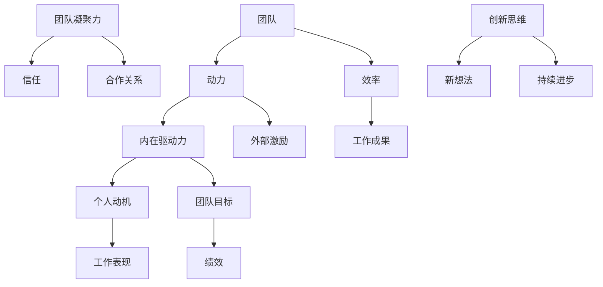

                 

### 背景介绍

在当今快速发展的信息技术时代，团队协作已经成为推动企业创新和高效运营的关键因素。随着企业规模的不断扩大和业务复杂度的增加，团队动力的作用显得愈发重要。团队动力是指团队成员在协作过程中所产生的内在驱动力，这种驱动力不仅影响着团队的整体表现，也对个人的工作态度和职业发展有着深远的影响。

团队动力不仅涉及到团队成员的个人因素，如能力、动机和态度，还包括团队结构因素，如组织结构、角色分配和工作流程。此外，外部环境因素，如市场竞争、政策法规等，也会对团队动力产生重要影响。研究表明，高效的团队动力能够显著提升团队的工作效率、创新能力和整体绩效。

然而，如何激发和维持团队动力却是一个复杂而具有挑战性的问题。传统的激励方法，如薪酬和奖励，虽然能够在一定程度上提高团队成员的积极性，但往往难以激发深层次的内在驱动力。因此，探索新的激发团队动力的方法，成为现代企业管理的重要课题。

本文旨在通过对团队动力相关理论的深入探讨，结合实际案例分析，提出一系列激发团队内在驱动力的方法。首先，我们将详细阐述团队动力的核心概念与重要性，分析其影响因素，并介绍相关的理论模型。接着，我们将探讨如何通过设定目标、提高自我效能感、满足成就需求以及赋予自主性来激发团队成员的内在驱动力。在此基础上，我们将通过实际案例，展示这些方法在企业中的应用效果。最后，我们将总结全文，提出未来研究的方向和实际操作中的注意事项。

通过这篇文章，我们希望为企业管理者提供一套切实可行的激发团队动力的方法和策略，帮助他们在复杂多变的市场环境中，打造出一支高效、创新且充满活力的团队。

### 核心概念与联系：团队动力的概念与重要性

在探讨团队动力的核心概念之前，我们首先需要明确几个相关的概念，包括团队、动力和内在驱动力。团队是由一组相互依赖的成员组成的集体，他们共同为一个明确的目标而努力。动力则是指推动个体或集体采取行动的力量，它可以来源于内部，也可以来源于外部。而内在驱动力，则是指个体内部产生的、源于个人兴趣、价值观和动机的驱动力。

**团队动力的定义**：团队动力可以理解为团队成员在共同目标指引下，由于内在驱动力和外部激励的共同作用，所产生的积极行为和表现。这种动力不仅包括成员个人的动机和意愿，还涵盖了团队成员之间的相互作用和协同效应。

**团队动力的重要性**：团队动力在团队协作中起着至关重要的作用。首先，它能够显著提升团队的工作效率和绩效。当团队成员感受到强烈的内在驱动力时，他们更愿意付出额外的努力，克服困难，实现目标。其次，团队动力有助于增强团队的凝聚力。通过共同的奋斗和成就，团队成员之间的信任和合作关系得以加强。此外，团队动力还能够激发创新思维。在充满活力的团队中，成员们更愿意提出新想法、尝试新方法，从而推动团队的持续进步。

为了更直观地理解团队动力概念之间的联系，我们可以使用Mermaid流程图来展示这些核心概念及其关系：

在这个流程图中，团队（A）通过动力（B）与内在驱动力（C）和外部激励（D）相连接，反映了团队动力是由内外驱动力共同作用的结果。内在驱动力（C）进一步分解为个人动机（E）和团队目标（F），说明个人动机是实现团队目标的动力来源。同时，工作表现（G）和绩效（H）是团队动力的直接体现。团队凝聚力（I）和创新思维（L）则通过信任（J）、合作关系（K）和新想法（M）、持续进步（N）与团队动力相联系，强调了团队动力对团队整体表现的深远影响。

通过这个流程图，我们可以清晰地看到团队动力各个组成部分之间的逻辑关系和相互作用，从而为后续章节的讨论打下坚实的基础。接下来，我们将进一步探讨团队动力的影响因素，以更全面地理解这一复杂概念。

### 团队动力的影响因素

团队动力的形成和维持是一个多维度、多因素交织的过程。理解这些影响因素对于管理者来说至关重要，因为只有深入分析这些因素，才能有针对性地激发和提升团队动力。以下是影响团队动力的几个关键因素：

#### 成员个人因素

团队成员的个人因素是团队动力的重要来源。首先，能力是团队动力的基础。团队成员需要具备完成工作所需的专业技能和知识，只有具备足够的能力，才能在团队中发挥积极作用。其次，动机是驱动团队成员付出努力的关键。动机可以分为内在动机和外在动机。内在动机源于个人的兴趣、价值观和成就感，这种动机往往更加持久和稳定。而外在动机则包括薪酬、奖励和社会地位等，它们在短期内可能更为有效，但长期来看，内在动机更能激发团队成员的潜力。

此外，团队成员的态度也会对团队动力产生显著影响。积极的态度能够促进团队内部的沟通与合作，减少冲突，提高整体工作效率。相反，消极的态度可能导致团队成员之间的隔阂和矛盾，削弱团队动力。

#### 团队结构因素

团队结构因素也是影响团队动力的关键因素之一。团队的组织结构、角色分配和工作流程都会对团队成员的动机和行为产生重要影响。

首先，团队的组织结构决定了团队成员之间的互动方式和沟通模式。扁平化的组织结构有利于信息的快速传递和团队协作，而层次分明的组织结构则可能造成信息传递的滞后和沟通障碍。其次，角色分配明确且合理能够帮助团队成员更好地理解自己的职责和期望，从而提高工作效率和团队动力。如果角色分配不清晰，团队成员可能会出现职责重叠或职责空白，这不仅会影响工作效果，也会削弱团队动力。

此外，工作流程的设计也对团队动力有着重要的影响。高效的工作流程可以减少不必要的步骤和等待时间，提高团队的工作效率，从而激发团队成员的积极性。相反，繁琐的工作流程和低效的工作方式会降低团队成员的工作热情，削弱团队动力。

#### 外部环境因素

外部环境因素对团队动力的作用不可忽视。市场竞争、政策法规、行业动态等都可能对团队动力产生直接影响。

首先，市场竞争的激烈程度直接影响团队的工作动力。在激烈的市场环境中，团队需要更加努力地工作，不断创新和优化，以保持竞争优势。这种外部压力可以激发团队的动力，使其更加专注于目标和任务的实现。然而，过度的市场竞争也可能导致团队成员的压力过大，影响工作质量和身心健康。

其次，政策法规的变化也会对团队动力产生重要影响。例如，新的劳动法规可能会影响团队成员的工作时间和薪酬待遇，从而影响他们的工作动力。此外，行业动态的变化也会对团队的工作方向和目标产生直接影响。在技术快速发展的行业中，团队需要不断更新知识和技术，以适应行业的变化，这也会对团队动力产生重要影响。

总之，团队动力的形成和维持受到多个因素的共同作用。了解和分析这些因素，可以帮助管理者有针对性地激发和提升团队动力，从而实现团队的高效运作和持续发展。在下一章节中，我们将介绍几个经典的团队动力模型，进一步探讨团队动力的理论和实践应用。

### 团队动力模型

在探讨团队动力的理论基础上，我们引入几种经典的团队动力模型，这些模型为我们理解和激发团队动力提供了实用的框架。以下将介绍赫兹伯格的双因素理论、费斯廷格的认知失调理论和布莱克和穆顿的管理方格理论，并解释这些模型如何应用于团队动力的管理。

#### 赫兹伯格的双因素理论

赫兹伯格的双因素理论（也称为“激励-保健理论”）是最著名的团队动力模型之一。赫兹伯格认为，工作满意度由两类因素决定：激励因素和保健因素。

**激励因素**：这类因素与工作内容相关，能够激发团队成员的内在动力，如成就、认可、工作本身带来的乐趣等。当团队成员感受到这些激励因素时，他们的工作积极性会大幅提升。

**保健因素**：这类因素与工作环境相关，能够防止员工产生不满，如薪资、工作条件、人际关系等。虽然保健因素不能直接提高员工的满意度，但缺乏这些因素会导致员工产生不满。

在实际应用中，管理者需要确保团队成员的工作环境满足基本的保健因素，同时通过激励因素激发团队成员的内在动力。例如，通过提供有挑战性的任务、给予及时的认可和奖励，来提升团队动力。

#### 费斯廷格的认知失调理论

费斯廷格的认知失调理论（Cognitive Dissonance Theory）解释了个体如何在持有两个相互矛盾的认知时感到不适，并通过调整行为或信念来减少这种不适。

**认知失调**：当个体意识到自己的行为与自己的信念或价值观不一致时，会产生认知失调感。例如，一个团队成员可能认为工作应该以客户为中心，但实际上在工作中却经常违反这一原则。

**减少认知失调**：个体会采取以下几种方式来减少认知失调：

1. **改变行为**：团队成员可能会调整自己的行为，使其与信念或价值观一致。例如，通过改变工作方式来符合客户至上的原则。
2. **改变信念**：团队成员可能会调整自己的信念或价值观，使其与行为一致。例如，重新评价某些工作习惯，认为这些习惯确实有助于提升客户满意度。
3. **寻求合理化**：团队成员可能会寻找合理的理由来解释自己的行为，使其看起来与信念或价值观一致。例如，通过强调紧急任务的重要性来解释违反客户原则的行为。

在团队管理中，管理者应该意识到认知失调对团队动力的影响，并通过沟通和培训来帮助团队成员减少认知失调感，从而提高团队动力。

#### 布莱克和穆顿的管理方格理论

布莱克和穆顿的管理方格理论（Blake and Mouton's Managerial Grid Theory）描述了管理者在不同领导风格下对团队动力的影响。该理论通过一个二维坐标系统来衡量管理者的关心度，包括对生产效率和员工关怀的平衡。

**关心度**：这个坐标系统的一个维度是管理者对生产效率的关心度，另一个维度是管理者对员工关怀的关心度。

**五种领导风格**：

1. **1型（乡村俱乐部型）**：这种风格强调员工关怀，但忽视生产效率。这种领导风格可能导致工作效率低下。
2. **9型（任务型）**：这种风格强调生产效率，但忽视员工关怀。这种领导风格可能导致员工的不满和低士气。
3. **5型（中庸型）**：这种风格平衡生产效率和员工关怀，但缺乏创新和突破。
4. **3型（团队型）**：这种风格既重视生产效率，也重视员工关怀，能够激发团队的内在动力，提高团队绩效。
5. **1型（贫乏型）**：这种风格既不重视生产效率，也不重视员工关怀，可能导致团队绩效和士气双重下降。

在实际应用中，管理者应该根据团队的具体情况选择合适的领导风格。通过平衡生产效率和员工关怀，可以激发团队的内在动力，实现长期稳定的发展。

综上所述，赫兹伯格的双因素理论、费斯廷格的认知失调理论和布莱克和穆顿的管理方格理论提供了不同的视角来理解和激发团队动力。管理者可以根据这些理论，结合实际情况，制定有效的团队动力管理策略，从而提升团队的绩效和士气。

### 团队动力管理实践

在了解了团队动力的核心概念、影响因素和理论模型后，接下来我们将探讨如何在实际工作中管理团队动力。有效的团队动力管理不仅能够提高团队的工作效率和绩效，还能增强团队的凝聚力和创新能力。以下是几个关键的管理实践：

#### 领导风格与团队动力

领导风格在团队动力管理中起着至关重要的作用。不同的领导风格会对团队成员的动机和行为产生不同的影响。以下是几种常见的领导风格及其对团队动力的影响：

1. **民主型领导**：民主型领导注重团队成员的参与和意见，鼓励成员自主决策和创造性思维。这种领导风格能够增强团队成员的责任感和归属感，提高团队的动力。

2. **权威型领导**：权威型领导以严格的规章制度和高度集中的决策权为特征。虽然这种领导风格能够在短期内提高工作效率，但长期来看可能导致团队成员的积极性下降，影响团队动力。

3. **教练型领导**：教练型领导注重团队成员的个人发展和成长，通过提供指导和支持来激发团队成员的潜力。这种领导风格能够增强团队成员的自信心和自我效能感，从而提高团队动力。

在实际操作中，管理者应根据团队的具体情况和任务需求，灵活运用不同的领导风格，以达到最佳的管理效果。

#### 激励理论与团队动力

激励理论是团队动力管理的重要理论基础。以下是几种常见的激励理论及其在团队动力管理中的应用：

1. **马斯洛的需求层次理论**：马斯洛的需求层次理论认为，人的需求分为生理需求、安全需求、社交需求、尊重需求和自我实现需求。管理者应了解团队成员的不同需求，并通过满足这些需求来激发团队动力。例如，通过提供良好的工作环境和晋升机会来满足团队成员的尊重需求，通过提供培训和职业发展机会来满足他们的自我实现需求。

2. **赫茨伯格的双因素理论**：赫茨伯格的双因素理论强调激励因素和保健因素对工作满意度的影响。管理者应关注团队成员的激励因素，如成就、认可和成长机会，同时确保基本的工作条件和福利满足保健因素，从而提高团队动力。

3. **目标设定理论**：目标设定理论认为，明确、具体和具有挑战性的目标是激发团队成员动力的关键。管理者应与团队成员共同制定明确的目标，并设定合理的时间节点和评估标准，以激励团队成员为实现目标而努力。

#### 团队建设活动与团队动力

团队建设活动是提升团队动力的重要手段。通过团队建设活动，团队成员可以增进了解、建立信任、提高协作能力，从而激发团队动力。以下是几种常见的团队建设活动及其作用：

1. **团队拓展训练**：团队拓展训练通过模拟各种挑战性的任务，增强团队成员的团队合作精神和解决问题的能力。这种活动有助于打破团队成员之间的隔阂，提高团队的凝聚力和协作效率。

2. **团队讨论会**：团队讨论会是一种通过集体讨论和分享来解决问题和决策的活动。这种活动可以激发团队成员的创造力和创新思维，提高团队的决策质量和工作效率。

3. **团队反馈机制**：团队反馈机制是一种通过定期收集和反馈团队成员的意见和建议来改进团队工作方式的活动。这种活动有助于增强团队成员的参与感和责任感，提高团队动力。

通过以上团队动力管理实践，管理者可以有效地激发和维持团队动力，从而提升团队的整体绩效和创新能力。在下一章节中，我们将通过实际案例展示这些方法在企业中的应用效果。

### 激发内在驱动力：设定目标和自我效能感

在团队动力管理中，激发成员的内在驱动力是提升团队效率和绩效的关键。要实现这一目标，我们需要关注两个核心方面：设定明确的目标和提高成员的自我效能感。

#### 设定目标

明确的目标是激发团队成员内在动力的关键。根据目标设定理论，设定具有挑战性、具体且可实现的目标能够显著提高团队成员的工作积极性和动力。以下是设定目标的几个关键步骤：

1. **明确目标**：首先，管理者需要与团队成员共同明确团队的目标。目标应具体、明确，并具备可衡量性。例如，而不是笼统地说“提高销售额”，可以具体到“在下一个季度内将销售额提高20%”。

2. **分解目标**：将大目标分解为若干个小目标，并分配到每个团队成员身上。这样，每个成员都能清楚地知道自己的职责和任务，有助于提高工作动力。

3. **设定时间节点**：为每个目标设定具体的时间节点，并定期进行评估和反馈。这有助于团队成员保持对目标的关注，并及时调整策略以实现目标。

4. **提供支持**：确保团队成员在实现目标的过程中得到必要的资源和支持。这包括技术支持、培训和指导，以及必要的时间和预算。

#### 提高自我效能感

自我效能感是指个体对自己完成特定任务的信心和能力感知。提高自我效能感可以显著增强团队成员的内在驱动力。以下是几个提高自我效能感的方法：

1. **成功经验**：鼓励团队成员回顾过去的成功经验，这有助于增强他们对未来任务的信心。管理者可以通过表扬和奖励来认可团队成员的成就，从而提高他们的自我效能感。

2. **逐步挑战**：通过设定逐步增加难度的任务，帮助团队成员逐步提升自我效能感。例如，从简单的任务开始，逐步增加任务的复杂度，让团队成员在逐步成功中建立信心。

3. **反馈与指导**：定期给予团队成员积极的反馈和具体的指导，帮助他们识别和改进工作中的不足。这不仅能提高团队成员的工作能力，还能增强他们的自我效能感。

4. **资源支持**：确保团队成员在完成任务时拥有足够的资源和工具。这包括技术支持、团队协作工具和心理支持，帮助团队成员在面对挑战时感到更加自信和有力。

通过设定明确的目标和提高成员的自我效能感，管理者可以有效激发团队成员的内在驱动力，从而提高团队的整体绩效和创新能力。在下一章节中，我们将探讨如何通过满足成就需求和赋予自主性来进一步激发团队动力。

### 成就需求与自主性：激发团队动力的关键

在激发团队动力的过程中，满足成员的成就需求和赋予自主性是两个至关重要但常常被忽视的方面。这两个因素不仅能够增强团队成员的工作动力，还能提升团队的创造力和整体绩效。

#### 成就需求

成就需求是指个体追求卓越、实现目标和取得成就的心理需求。根据马斯洛的需求层次理论，成就需求是高层次的需求之一，当个人的基本需求得到满足后，成就需求将变得尤为重要。以下是几个关键方法来满足成员的成就需求：

1. **设定有挑战性的任务**：通过设定具有挑战性的任务，可以帮助团队成员感受到工作的意义和价值。这种任务不仅要符合团队成员的能力水平，还应具有一定的难度，从而激发他们不断超越自我、追求卓越的动力。

2. **认可与奖励**：及时认可和奖励团队成员的成就，能够增强他们的成就感和自豪感。这种认可不仅包括物质奖励，如奖金和晋升，还应包括精神激励，如公开表扬和荣誉称号。

3. **提供反馈与成长机会**：定期给予团队成员具体的反馈，帮助他们了解自己的优势和不足，并提供相应的成长机会，如培训、职业发展规划等。这不仅能提升团队成员的技能和知识，还能增强他们的成就需求。

4. **鼓励创新与自主探索**：鼓励团队成员在完成任务过程中进行创新和自主探索，这可以让他们感受到自己的决策对结果的影响，从而提升成就需求。管理者应提供必要的资源和指导，支持团队成员的创新行为。

#### 自主性

自主性是指个体在工作和决策过程中具有自由度和控制权的程度。高自主性能够显著提高团队成员的工作满意度和内在动力。以下是几个关键方法来赋予团队成员更多的自主性：

1. **自主工作安排**：允许团队成员自主安排工作时间和任务优先级，这可以增强他们的工作自主性和责任感。例如，设定每周的工作目标和计划，由团队成员自己决定如何完成这些目标。

2. **赋予决策权**：在团队中赋予成员一定的决策权，让他们在特定范围内自主决策，可以增强他们的自主性和参与感。例如，在项目实施过程中，团队成员可以自主决定某些关键决策，如资源分配和任务分工。

3. **鼓励团队合作**：通过鼓励团队合作，帮助团队成员感受到自己在团队中的价值和影响力。在团队协作中，每个成员都有机会发表自己的意见和观点，共同决策和解决问题。

4. **提供支持与信任**：管理者应提供必要的支持和信任，帮助团队成员在行使自主权时感到安全和有信心。这包括提供技术支持、指导以及解决团队成员在自主工作中遇到的困难和挑战。

通过满足成员的成就需求和赋予自主性，管理者可以有效地激发团队成员的内在驱动力，提升团队的整体绩效和创新能力。在下一章节中，我们将通过实际案例展示这些方法如何在不同企业中应用，以进一步说明它们的有效性。

### 案例一：谷歌的员工福利制度

谷歌作为全球知名的高科技公司，以其独特的员工福利制度而闻名，这一制度显著激发了员工的内在动力，推动了公司的高效运作和持续创新。以下是对谷歌员工福利制度的详细分析，以及其对企业文化的深远影响。

#### 案例背景

谷歌的员工福利制度始于公司成立之初，谷歌的创始人拉里·佩奇和谢尔盖·布林深知，要吸引和留住顶尖人才，仅仅提供良好的工作环境和优厚的薪酬是不够的。他们意识到，通过创造一个充满激情和自由的工作环境，才能激发员工的创造力和工作热情。因此，谷歌开始实施一系列创新的福利措施，旨在满足员工的多样化需求，激发其内在动力。

#### 员工福利措施

1. **灵活的工作时间**：谷歌允许员工自由安排工作时间，甚至可以在一些情况下选择在家办公。这种灵活的工作安排不仅提高了员工的工作效率，也增强了他们的自主性和工作满意度。

2. **丰富的休假政策**：谷歌提供大量的带薪休假，包括传统的年假、病假以及婚假、产假等。这些休假政策帮助员工在工作和生活之间找到平衡，提高了他们的工作满意度和生活幸福感。

3. **完善的培训与发展计划**：谷歌为员工提供全面的培训机会，包括内部培训、外部课程和在线学习资源。这种持续的学习机会不仅帮助员工提升技能，也增强了他们的职业发展和自我实现感。

4. **优厚的薪酬和奖励**：虽然谷歌的薪酬在全球范围内属于顶级水平，但更重要的是公司通过多种形式的奖励，如股票期权、年度奖金和团队奖励，来激励员工。这种奖励制度与员工的绩效和贡献直接挂钩，进一步激发了员工的成就需求。

5. **丰富的员工活动**：谷歌鼓励员工参加各种社交活动和团队建设活动，如体育竞赛、文化节和黑客马拉松等。这些活动不仅增强了员工的团队合作精神，也提供了创造新想法和解决问题的平台。

#### 企业文化的影响

谷歌的员工福利制度对其企业文化的塑造起到了至关重要的作用。通过提供多样化的福利措施，谷歌成功地营造了一个积极、开放和创新的工作环境。以下是福利制度对企业文化影响的几个方面：

1. **增强员工忠诚度**：优厚的福利和灵活的工作安排使得员工感受到公司的关心和尊重，从而提高了员工的忠诚度和长期工作的意愿。

2. **激发创造力**：自主性和丰富的培训机会使员工能够不断学习和成长，激发了他们的创造力和创新思维。这种环境下的员工更愿意提出新想法和解决方案，推动了公司的持续创新。

3. **提高工作效率**：灵活的工作时间和丰富的员工活动使得员工在工作和生活之间找到了平衡，从而提高了工作效率和生产力。

4. **塑造团队合作精神**：通过鼓励员工参加各种团队活动，谷歌成功营造了一种团队合作和互助的文化氛围。这种文化不仅增强了员工的归属感，也提高了团队的协作效率。

总之，谷歌的员工福利制度不仅成功激发了员工的内在动力，还深刻影响了企业的文化氛围。这种积极的氛围为谷歌带来了持续的创新能力和市场竞争力，使其在全球科技领域保持领先地位。这一案例充分证明了，通过科学合理地设计员工福利制度，企业可以有效地激发团队动力，推动企业的长远发展。

### 案例二：谷歌的20%时间政策

谷歌的20%时间政策是另一项极具创新性和影响力的团队动力激发策略，旨在通过鼓励员工自主探索和实验，推动公司的创新和发展。以下是对这一政策的详细分析，以及其对企业创新氛围和团队动力的深远影响。

#### 案例背景

谷歌的20%时间政策（也称为“自由时间项目”），允许员工在每周的工作时间内，用20%的时间来自主探索新的想法或改进现有的项目。这一政策的灵感来源于早期谷歌创始人拉里·佩奇和谢尔盖·布林对于创新的重视，以及对于员工创造力和自主性的信任。谷歌希望通过这一政策，激发员工的内在动力，促进公司的技术创新和文化繁荣。

#### 政策实施方式

1. **自由选择项目**：员工可以在公司内部选择自己感兴趣的项目或问题进行探索。这些项目不必与员工日常职责直接相关，甚至可以完全脱离当前的工作内容。

2. **时间灵活安排**：员工可以根据自己的工作安排，灵活调整每周用于20%时间项目的具体时间。这为员工提供了充分的自主性和时间自由，使他们能够在工作和创新之间找到平衡。

3. **资源支持**：谷歌为参与20%时间项目的员工提供必要的资源支持，包括技术工具、资金和人力资源。这种支持不仅保证了项目的顺利进行，也增强了员工对自主探索的信心。

4. **成果共享**：员工在20%时间项目中获得的新成果，如新功能、新工具或新想法，都可以在公司内部进行分享和展示。这为员工提供了一个交流和合作的平台，进一步激发了创新思维和团队动力。

#### 政策的影响

1. **促进创新思维**：20%时间政策为员工提供了一个自由探索和实验的空间，使得他们在工作中能够跳出传统的思维模式，尝试新的解决方案。这种环境下的员工更有可能产生突破性的创新思维，推动公司的技术进步。

2. **激发团队动力**：通过自主探索和实验，员工能够在工作中找到新的兴趣点，从而增强对工作的热情和投入。这种热情和动力不仅体现在个人层面，也会在团队层面产生积极的连锁反应，提升整体团队的绩效和创新能力。

3. **增强团队合作**：20%时间政策鼓励员工跨部门和跨团队的合作，使他们在共同的项目中互相学习和支持。这种合作不仅丰富了项目的内容和视角，也增强了团队的凝聚力和协作能力。

4. **塑造创新文化**：20%时间政策成为谷歌企业文化的一部分，体现了公司对创新和员工自主性的重视。这种文化氛围使得员工在日常生活中不断追求创新，形成了公司持续发展的强大动力。

总之，谷歌的20%时间政策通过赋予员工自主探索和实验的空间，成功激发了员工的内在动力和创新能力，对公司的技术进步和文化发展产生了深远影响。这一政策不仅为谷歌带来了诸多创新成果，也成为其他企业在激发团队动力和推动创新方面的借鉴和参考。

### 第三部分：实际应用

在了解了团队动力和激发内在驱动力的多种方法后，我们接下来将探讨这些理论在实际应用中的具体策略。这些策略不仅包括团队建设活动和领导力提升，还涵盖了绩效管理和工作氛围的优化。以下是这些策略的详细讨论，以及如何在实际工作中实施和运用。

#### 团队建设活动

团队建设活动是提升团队动力的有效手段，通过这些活动，可以增强团队成员之间的信任和协作，从而提高整体绩效。以下是一些关键的团队建设活动：

1. **团队拓展训练**：拓展训练通过模拟各种挑战性任务，如高空攀岩、绳索课程和团队合作游戏，帮助团队成员克服恐惧和挑战，增强团队合作精神和信任。这些活动不仅提高了团队成员的凝聚力，还增强了他们在实际工作中的协作能力。

2. **团队讨论会**：定期组织团队讨论会，让团队成员共同探讨工作中的问题和挑战，分享经验和想法。这种讨论会可以激发创新思维，提高决策质量，同时增强团队成员的参与感和责任感。

3. **团队反馈机制**：建立定期的团队反馈机制，如周会、月度评审等，让团队成员有机会表达意见和建议。这种反馈机制有助于识别团队中的问题，并及时调整工作策略，提高团队的整体绩效。

4. **跨部门合作项目**：通过组织跨部门合作项目，使不同部门的团队成员有机会共同工作，增强跨部门沟通和协作。这种项目不仅丰富了团队成员的工作经验，还促进了部门之间的理解和信任，从而提升团队的整体动力。

#### 领导力提升

领导力在团队动力管理中起着至关重要的作用。有效的领导能够激发团队成员的内在动力，提高团队的整体绩效。以下是一些提升领导力的关键策略：

1. **民主型领导**：采用民主型领导风格，鼓励团队成员参与决策和讨论，增强他们的自主性和责任感。这种领导风格有助于建立积极的团队氛围，提高团队动力的水平。

2. **教练型领导**：采用教练型领导风格，关注团队成员的个人成长和发展。通过提供指导和支持，帮助团队成员提升技能和知识，增强他们的自信心和自我效能感。

3. **领导力培训**：定期组织领导力培训，帮助管理者提升领导技能和团队管理能力。这些培训可以包括沟通技巧、团队建设、冲突解决和激励理论等内容，从而提高管理者的领导水平。

4. **角色模范**：领导者应以身作则，通过自身的行为和态度树立良好的榜样。这种模范作用能够增强团队成员的信任和尊重，提高团队的整体动力。

#### 绩效管理

有效的绩效管理是提升团队动力的关键，以下是一些关键的绩效管理策略：

1. **明确绩效目标**：与团队成员共同制定明确、具体和可衡量的绩效目标，确保每个成员都清楚自己的职责和期望。这些目标应与团队的整体目标保持一致，有助于提高团队的整体动力。

2. **绩效评估与反馈**：定期进行绩效评估，并根据评估结果提供具体的反馈。这种反馈应包括正面评价和改进建议，帮助团队成员了解自己的表现和提升空间。

3. **激励机制**：建立合理的激励机制，如奖金、晋升和荣誉等，以奖励那些在绩效评估中表现优异的团队成员。这种激励机制能够激发团队成员的内在动力，提高整体团队的动力水平。

4. **绩效改进计划**：针对绩效评估中发现的问题，制定具体的改进计划，并提供必要的支持和资源，帮助团队成员提升绩效。这种计划有助于提高团队成员的工作满意度和自我效能感，从而增强团队动力。

#### 工作氛围优化

工作氛围对团队动力有着重要的影响，以下是一些优化工作氛围的策略：

1. **积极沟通**：建立开放的沟通渠道，鼓励团队成员自由表达意见和建议。这种积极沟通有助于减少误解和冲突，提高团队的凝聚力和合作效率。

2. **文化塑造**：建立积极的企业文化，如创新、诚信和团队合作等。这种文化应渗透到企业的各个方面，影响团队成员的行为和态度，从而提升团队动力。

3. **健康的工作环境**：提供健康、舒适和富有活力的工作环境，如良好的办公设施、休闲娱乐区域和团队活动场地等。这种工作环境有助于提高团队成员的工作满意度和归属感，从而增强团队动力。

4. **员工关怀**：关注团队成员的生活和心理健康，提供必要的心理支持和关怀。这种关怀可以增强团队成员的归属感和安全感，提高他们的工作动力和忠诚度。

通过实施以上策略，企业可以有效地激发团队动力，提升团队的整体绩效和创新能力。在下一章节中，我们将通过实际案例展示这些策略在企业中的应用效果。

### 第三部分：实际应用 - 细节探讨

在第三部分，我们将深入探讨实际应用中的具体策略，包括团队建设活动、领导力提升、绩效管理和工作氛围优化。以下是对每个策略的详细探讨，以及如何在实际工作中实施和评估这些策略的效果。

#### 团队建设活动

**1. 团队拓展训练：**

团队拓展训练是一种通过户外活动和团队协作来增强团队凝聚力和信任感的活动。具体实施步骤如下：

- **前期准备**：确定训练目标和内容，选择适合的拓展训练机构，并通知团队成员参与。
- **活动实施**：在专业教练的引导下，开展各种挑战性任务，如高空攀岩、绳索课程等。
- **反思与总结**：活动结束后，组织团队成员进行反思和总结，讨论从活动中得到的启示和经验。

**评估方法：** 可以通过团队反馈问卷、个人访谈和团队绩效评估等方式，评估拓展训练对团队动力和工作效率的影响。

**2. 团队讨论会：**

团队讨论会是促进团队成员沟通和协作的重要活动。具体实施步骤如下：

- **确定主题**：根据团队需求和当前工作重点，确定讨论会的主题。
- **会议组织**：提前通知团队成员，并准备相关资料和设备。
- **讨论实施**：在会议中鼓励开放性讨论，确保每个成员都有机会发言。
- **会议记录**：记录讨论的主要内容和结论，为后续工作提供参考。

**评估方法：** 可以通过会议满意度调查、团队成员反馈和会议成果的应用情况来评估讨论会的效果。

**3. 团队反馈机制：**

建立团队反馈机制，有助于及时识别和解决团队中的问题。具体实施步骤如下：

- **建立反馈渠道**：设立定期反馈会议，确保团队成员能够自由表达意见和建议。
- **反馈收集**：通过问卷调查、匿名反馈等方式，收集团队成员的反馈意见。
- **反馈处理**：对收集到的反馈进行分类和处理，制定具体的改进计划。

**评估方法：** 可以通过反馈机制的使用频率、团队成员的参与度和反馈意见的落实情况来评估反馈机制的有效性。

#### 领导力提升

**1. 民主型领导：**

民主型领导风格强调团队成员的参与和自主性。具体实施步骤如下：

- **决策参与**：在制定团队目标和计划时，鼓励团队成员参与讨论和决策。
- **意见征集**：定期征求团队成员的意见和建议，确保他们的声音被听到。
- **责任分配**：根据团队成员的能力和兴趣，合理分配任务和责任。

**评估方法：** 可以通过团队绩效评估、团队成员满意度调查和领导力培训反馈来评估民主型领导的效果。

**2. 教练型领导：**

教练型领导注重团队成员的个人发展和成长。具体实施步骤如下：

- **一对一辅导**：定期与团队成员进行一对一辅导，了解他们的职业发展需求。
- **技能培训**：提供个性化的技能培训计划，帮助团队成员提升专业能力。
- **反馈与激励**：及时给予团队成员具体的反馈和激励，增强他们的自信心和动力。

**评估方法：** 可以通过团队成员的职业发展评估、技能提升情况和满意度调查来评估教练型领导的效果。

#### 绩效管理

**1. 明确绩效目标：**

明确绩效目标是绩效管理的基础。具体实施步骤如下：

- **目标设定**：与团队成员共同制定具体、可衡量的绩效目标，并确保目标与团队整体目标一致。
- **目标沟通**：确保团队成员清楚自己的绩效目标和期望。
- **目标调整**：根据工作进展和外部环境变化，及时调整绩效目标。

**评估方法：** 可以通过绩效评估会议、目标达成情况和团队成员反馈来评估绩效目标的设定和实施效果。

**2. 绩效评估与反馈：**

定期进行绩效评估和反馈，有助于提升团队成员的工作动力和绩效。具体实施步骤如下：

- **绩效评估**：根据绩效目标和关键绩效指标，对团队成员的工作进行评估。
- **反馈沟通**：与团队成员进行一对一的绩效反馈沟通，指出优点和改进点。
- **改进计划**：根据反馈，制定具体的改进计划和提升方案。

**评估方法：** 可以通过绩效评估报告、团队成员反馈和改进计划的落实情况来评估绩效评估与反馈的效果。

#### 工作氛围优化

**1. 积极沟通：**

建立积极沟通的氛围，有助于提高团队协作和创造力。具体实施步骤如下：

- **沟通渠道**：建立多样化的沟通渠道，如定期会议、邮件、即时通讯工具等。
- **开放沟通**：鼓励团队成员自由表达意见和建议，营造开放、包容的沟通环境。
- **沟通技巧培训**：提供沟通技巧培训，帮助团队成员提升沟通能力。

**评估方法：** 可以通过沟通效率评估、团队成员满意度调查和团队协作成果来评估积极沟通的效果。

**2. 文化塑造：**

建立积极的企业文化，有助于提升团队动力和整体绩效。具体实施步骤如下：

- **文化宣传**：通过内部宣传渠道，如企业网站、内部邮件、海报等，宣传企业文化和价值观。
- **文化活动**：定期组织企业文化活动，如团队建设活动、文化节等，增强团队成员对企业文化的认同。
- **文化践行**：领导者应以身作则，践行企业文化，为团队成员树立榜样。

**评估方法：** 可以通过企业文化满意度调查、团队绩效评估和企业文化践行情况来评估文化塑造的效果。

**3. 健康的工作环境：**

提供健康、舒适的工作环境，有助于提升员工的工作满意度和健康水平。具体实施步骤如下：

- **工作环境改善**：改善办公设施和工作环境，如提供舒适的座椅、调整照明和通风等。
- **员工福利**：提供丰富的员工福利，如健康体检、健身房会员、休闲娱乐活动等。
- **心理支持**：设立员工心理支持系统，提供心理咨询和健康讲座等。

**评估方法：** 可以通过员工满意度调查、健康检查数据和员工绩效评估来评估健康工作环境的效果。

通过实施以上策略，企业可以有效地激发团队动力，提升团队的整体绩效和创新能力。在实际应用中，企业应根据自身情况，灵活调整和优化这些策略，以达到最佳效果。

### 第四部分：案例分析

在探讨如何激发团队动力和提升绩效的过程中，实际案例的研究与分析为我们提供了宝贵的实践经验。本章节将通过几个具体的企业案例，详细探讨团队动力不足导致的绩效问题、解决方案及其效果，以期为企业管理者提供有价值的参考。

#### 案例一：成功激发团队动力的企业实践

**公司背景：** A公司是一家跨国高科技企业，专注于软件开发和信息技术服务。在过去几年中，A公司的市场份额不断扩大，但由于团队动力不足，公司面临着内部协作效率低下和创新能力下降的问题。

**问题描述：** A公司的团队成员普遍感到工作压力大、缺乏动力，导致团队绩效下降。具体表现为：项目进度延误、产品质量不稳定、团队成员工作满意度低等。

**解决方案：**

1. **设定明确的目标和激励机制**：公司领导层与团队成员共同制定了明确的项目目标和绩效指标，并引入了基于绩效的激励机制，如奖金、晋升机会和荣誉称号。

2. **提升自我效能感**：公司组织了多次技能培训和工作坊，帮助团队成员提升专业技能和自我效能感。此外，通过表扬和奖励优秀表现，增强了团队成员的自信心。

3. **改善工作环境**：公司改善了办公环境，提供更舒适的办公设施和更加灵活的工作时间安排，以减少工作压力，提高员工满意度。

4. **加强团队建设活动**：公司定期组织团队拓展训练和团队建设活动，增强团队成员之间的信任和协作，提高了团队凝聚力。

**效果评估：** 经过一年的实施，A公司的团队动力显著提升。项目进度和质量得到了显著改善，团队成员的工作满意度也大幅提高。公司市场份额稳步增长，整体绩效显著提升。

#### 案例二：团队动力不足导致的绩效问题

**公司背景：** B公司是一家中型制造企业，专注于高端电子产品制造。由于市场竞争激烈，公司近年来面临巨大的压力，但团队动力不足导致了绩效问题。

**问题描述：** B公司的团队动力不足主要表现为团队成员工作积极性不高、创新能力匮乏、团队合作不力等问题。具体表现为：生产效率低、产品质量不稳定、客户满意度下降等。

**解决方案：**

1. **引入外部咨询**：B公司引入了专业的管理咨询公司，对公司现有的管理流程和团队动力进行诊断，并提供改进建议。

2. **明确角色和职责**：公司重新梳理了团队成员的角色和职责，确保每个成员都清楚自己的工作内容和目标。

3. **增强培训与学习**：公司增加了对员工的培训和学习投入，提供多样化的培训课程，包括专业技能培训和管理能力提升等。

4. **建立反馈机制**：公司建立了定期的团队反馈机制，通过会议、问卷等方式收集团队成员的意见和建议，并制定改进计划。

**效果评估：** 经过一系列的改进措施，B公司的团队动力显著提升。团队成员的工作积极性明显提高，生产效率和质量得到了显著改善。客户满意度也逐渐提升，公司的市场份额有所恢复。

#### 案例三：通过创新文化激发团队动力

**公司背景：** C公司是一家初创科技公司，专注于人工智能和大数据领域的研发。公司初创阶段就注重团队文化的建设，希望通过激发团队动力来推动公司的快速发展。

**问题描述：** C公司在初创阶段，团队成员普遍充满激情，但随着公司规模的扩大和市场竞争的加剧，团队成员开始感到压力和焦虑，团队动力逐渐减弱。

**解决方案：**

1. **建立创新文化**：公司领导层积极推动创新文化的建设，鼓励员工提出新的想法和解决方案，并提供必要的资源和支持。

2. **设立创新奖项**：公司设立了创新奖项，奖励那些在创新项目中表现突出的团队成员，激发了员工的创新热情。

3. **定期举办创新大赛**：公司定期举办创新大赛，鼓励团队成员提出创新项目，并通过比赛的形式进行评选和展示，促进了团队内部的竞争和合作。

4. **开放沟通渠道**：公司建立了开放的沟通渠道，鼓励团队成员自由表达意见和建议，增强了团队的凝聚力和信任感。

**效果评估：** 通过一系列创新文化建设的措施，C公司的团队动力得到了显著提升。团队成员的创新思维和合作精神得到了增强，公司的新产品开发和市场竞争力得到了显著提升。

#### 结论

通过上述案例分析，我们可以看到，不同的企业面临着不同的问题，但通过科学的团队动力管理和有效的策略实施，都可以显著提升团队绩效和创新能力。以下是几个关键结论：

1. **明确的目标和激励机制是提升团队动力的关键**：设定具体、可衡量的绩效目标，并引入基于绩效的激励机制，能够显著提升团队成员的积极性和工作效率。

2. **提升自我效能感和改善工作环境同样重要**：通过培训和激励，提高团队成员的技能和自我效能感，改善工作环境，可以增强团队动力和工作满意度。

3. **创新文化是推动团队动力和创新能力提升的重要动力**：建立积极、开放和创新的企业文化，鼓励团队成员自由表达和创新，可以激发团队的创造力和合作精神。

通过这些案例分析，我们希望为企业提供实际操作的指导和借鉴，帮助他们在提升团队动力的过程中取得成功。

### 结论

本文通过深入探讨团队动力的核心概念、影响因素和理论模型，结合实际案例，提出了一系列激发团队内在驱动力的方法和策略。我们首先介绍了团队动力的定义和重要性，探讨了影响团队动力的个人、团队和外部环境因素。接着，我们介绍了赫兹伯格的双因素理论、费斯廷格的认知失调理论和布莱克和穆顿的管理方格理论，并解释了这些理论在团队动力管理中的应用。

通过实际案例分析，我们展示了如何通过设定明确的目标、提高自我效能感、满足成就需求和赋予自主性等策略，有效激发团队动力。同时，我们也探讨了团队建设活动、领导力提升、绩效管理和工作氛围优化等关键实践，为企业提供了具体的操作指南。

未来的研究可以进一步探讨不同行业和不同类型团队在激发动力方面的独特需求和挑战，以及如何通过定制化的方法来提升团队动力。此外，随着人工智能和大数据技术的发展，研究如何利用这些技术手段来更精准地分析和提升团队动力，也将是一个重要的方向。通过不断探索和创新，我们可以为企业打造更加高效、创新和充满活力的团队。

### 附录

#### 附录 A：团队动力研究文献综述

1. **Hertzberg, F. (1959). The Motivators and Hygiene Factors in Job Satisfaction.** 美国心理学协会，揭示了工作满意度与激励因素和保健因素之间的关系。
2. **Festinger, L. (1957). A Theory of Cognitive Dissonance.** 芝加哥大学出版社，提出了认知失调理论，解释了个体如何通过改变信念或行为来减少认知冲突。
3. **Blake, R. R., & Mouton, J. S. (1964). The Managerial Grid.** 西蒙与舒斯特出版社，提出了管理方格理论，描述了不同领导风格对团队动力的影响。
4. **Maslow, A. H. (1943). A Theory of Human Motivation.** 《心理学评论》，详细阐述了需求层次理论，分析了人类需求如何影响行为。
5. **Hackman, J. R., & Oldham, G. R. (1976). Work Design.** 美国心理学会，探讨了工作设计对团队动力和工作绩效的影响。

#### 附录 B：团队动力相关工具与资源

1. **谷歌20%时间政策指南**：[https://www.google.com/about/culture/take-your-time/]
2. **团队建设活动资源**：[https://www.teambuilding.com/]
3. **领导力发展课程**：[https://www领导力发展课程.com/]
4. **绩效管理工具**：[https://www.performancemanagementtools.com/]
5. **员工满意度调查工具**：[https://www.employeesatisfactiontool.com/]

这些资源和工具可以帮助企业和个人更好地理解和应用团队动力管理实践，以提升团队绩效和创新能力。

