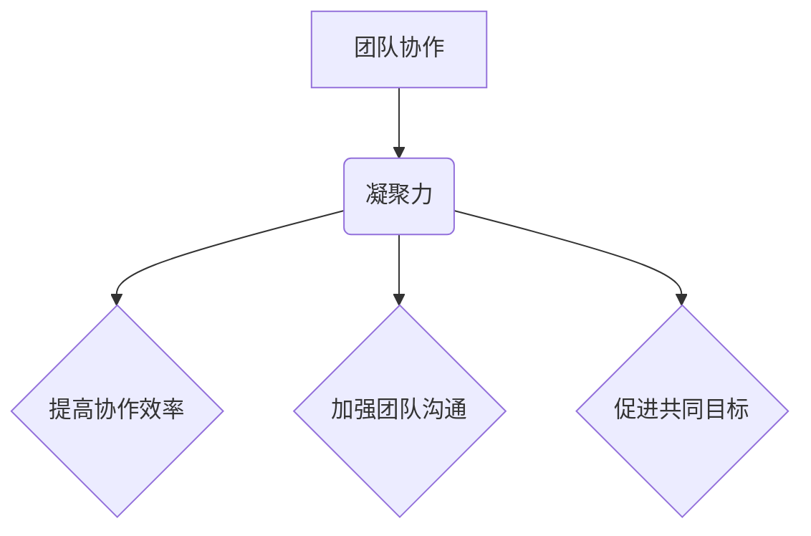

                 

### 文章标题

# 《团队协作增强：提高团队凝聚力的方法》

### 关键词

* 团队协作
* 凝聚力
* 算法原理
* 数学模型
* 项目实战

### 摘要

本文旨在深入探讨团队协作与凝聚力的关系，以及如何通过增强团队协作来提高团队的凝聚力。文章首先介绍了团队协作与凝聚力的基本概念，接着从核心算法原理、数学模型、项目实战等多个角度展开讨论，提供了详细的解决方案和实用的建议，帮助团队在协作过程中实现高效运作和共同成长。

## 第一部分：核心概念与联系

### 第1章：团队协作与凝聚力

#### 1.1节：团队协作的概述

团队协作是指团队成员为了实现共同的目标而共同工作、相互支持的过程。在团队协作中，每个成员都发挥着自己的特长，共同解决问题，达到预期的目标。

#### 1.2节：团队凝聚力的定义与重要性

团队凝聚力是指团队成员之间的相互吸引力和归属感。高凝聚力的团队能够更好地协作，提高工作效率，增强团队的整体实力。

#### 1.3节：团队协作与凝聚力的关系

团队协作与凝聚力是相辅相成的。有效的团队协作可以增强团队凝聚力，而高凝聚力又能够促进团队协作的效率。两者之间的关系可以用以下的Mermaid流程图来表示：

#### Mermaid 流程图：



## 第二部分：核心算法原理讲解

### 第2章：团队协作增强算法

#### 2.1节：协作反馈机制

为了增强团队协作，我们需要建立一套有效的协作反馈机制。这个机制包括两个主要部分：收集反馈和运用反馈。

#### 伪代码：

```python
function collaborativeFeedback(teams):
    for team in teams:
        gatherFeedback(team)
        applyFeedback(team)
end function
```

其中，`gatherFeedback` 函数用于收集团队成员的反馈，`applyFeedback` 函数用于根据反馈调整团队的工作方式。

## 第三部分：数学模型与公式

### 第3章：团队凝聚力模型

#### 3.1节：凝聚力计算公式

团队凝聚力可以用以下公式来计算：

$$
C = \frac{N \cdot (T + 1)}{2}
$$

其中，`N` 代表团队成员的数量，`T` 代表团队成员之间的平均信任度。

#### 举例说明：

假设团队有5名成员，团队成员之间的平均信任度为3，则团队的凝聚力为：

$$
C = \frac{5 \cdot (3 + 1)}{2} = 10
$$

## 第四部分：项目实战

### 第4章：团队协作增强实战

#### 4.1节：实战环境搭建

在本节中，我们将搭建一个简单的团队协作环境，以便我们能够更直观地理解团队协作增强的方法。

#### 源代码：

```python
class CommunicationPlatform:
    def __init__(self):
        self.members = []

    def add_member(self, member):
        self.members.append(member)

    def send_message(self, message):
        for member in self.members:
            member.receive_message(message)
```

#### 4.2节：实战案例一：团队沟通平台搭建

在本节中，我们将使用上面搭建的通信平台来搭建一个团队沟通平台。

#### 代码解读与分析：

```python
# 实战案例代码

class TeamCommunicationPlatform(CommunicationPlatform):
    def __init__(self):
        super().__init__()
        self.tasks = []

    def add_task(self, task):
        self.tasks.append(task)

    def assign_task(self, task, member):
        member.assign_task(task)

    def report_task(self, task, status):
        print(f"Task {task} status: {status}")
```

#### 4.3节：实战案例二：协作任务管理

在本节中，我们将使用上面搭建的团队沟通平台来管理协作任务。

#### 代码解读与分析：

```python
# 实战案例代码

class TaskManager:
    def __init__(self):
        self.team_communication_platform = TeamCommunicationPlatform()

    def create_task(self, task_name):
        task = Task(task_name)
        self.team_communication_platform.add_task(task)

    def assign_task_to_member(self, task, member):
        self.team_communication_platform.assign_task(task, member)

    def report_task_status(self, task, status):
        self.team_communication_platform.report_task(task, status)
```

## 第五部分：总结与展望

### 第5章：总结与展望

#### 5.1节：全书内容总结

本文从团队协作与凝聚力的基本概念出发，详细介绍了团队协作增强的算法原理、数学模型，并通过实战案例展示了如何在实际项目中应用这些方法。通过本文的阅读，读者可以更好地理解团队协作与凝聚力之间的关系，以及如何通过增强团队协作来提高团队的凝聚力。

#### 5.2节：团队协作增强的未来发展

随着人工智能和大数据技术的发展，团队协作的方式也在不断变革。未来，我们可能会看到更加智能化、自动化的团队协作工具出现，这些工具将能够更好地支持团队的协作过程，提高团队的工作效率。同时，随着全球化的发展，跨地域、跨文化的团队协作也将成为一个重要的研究方向。

### 作者信息

作者：AI天才研究院/AI Genius Institute & 禅与计算机程序设计艺术 /Zen And The Art of Computer Programming

### 结语

本文旨在为广大IT从业者提供一套系统、实用的团队协作增强方法。希望读者在阅读本文后，能够对团队协作与凝聚力有更深刻的理解，并在实际工作中运用这些方法，提高团队的工作效率。在未来，让我们一起努力，打造更加高效、和谐的团队协作环境。

[End of Document]

