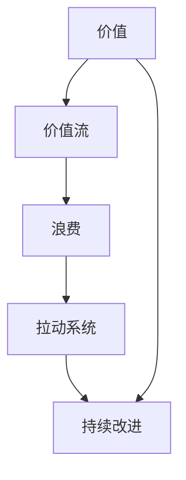

                 

### 引言：团队协作与精益管理的概念

在当今快速变化和高度竞争的商业环境中，团队协作已成为实现组织目标的关键因素。团队协作不仅仅是指在同一个项目或任务中共同努力的个体集合，它更是一种系统化的合作模式，通过共享资源、知识、技能和经验，以实现共同的目标和愿景。

**团队协作的重要性**  
团队协作有助于知识共享，促进创新思维，提高解决问题的效率。在一个高效的团队中，每个成员都能充分发挥其专长，通过协作达到整体绩效的提升。团队协作还能增强员工之间的信任和尊重，有助于建立积极的工作氛围，降低员工的流失率。此外，团队协作还可以提高组织的应变能力，帮助企业在面对市场变化时快速做出反应。

**团队协作面临的挑战**  
尽管团队协作具有诸多优势，但在实际操作中，团队协作也面临诸多挑战。首先，沟通障碍是常见的挑战之一，不同的团队成员可能来自不同的背景，拥有不同的沟通风格，这往往会导致误解和冲突。其次，角色混淆和责任分工不明确也是团队协作中的常见问题。如果团队成员不清楚自己的职责，或者职责重叠，就会导致工作重复和效率低下。此外，资源分配不均和工作压力的不平衡也会影响团队协作的效果。

**精益管理的概念**  
精益管理（Lean Management）是一种旨在通过消除浪费、优化流程和提升效率的管理方法。它起源于丰田生产系统（Toyota Production System, TPS），并已被广泛应用于制造业、服务业以及IT行业。精益管理的核心思想是“以最小的投入获得最大的产出”，即通过减少浪费、提高价值流和增强员工能力，实现持续改进和效率提升。

**精益管理的基本原则**  
精益管理包含了一系列基本原则，如“价值”、“价值流”、“浪费”、“拉动系统”和“持续改进”。这些原则构成了精益管理的哲学基础，并在实际应用中指导团队进行改进和优化。

- **价值**：精益管理强调识别和提供真正对客户有价值的产品或服务。
- **价值流**：价值流是指从原材料进入生产到最终产品交付给客户的全过程。精益管理致力于识别和消除价值流中的非价值活动。
- **浪费**：精益管理将任何不创造价值的活动视为浪费，包括等待时间、多余运输、加工过剩等。
- **拉动系统**：拉动系统是一种按需生产的方式，它避免了过多的库存和过量生产。
- **持续改进**：持续改进是精益管理的核心理念之一，它鼓励团队不断寻找和消除浪费，提升效率和质量。

本文将深入探讨精益管理在团队协作中的应用，通过分析团队协作的挑战、精益管理的基本原则和实践方法，为读者提供一套优化团队协作效能的系统框架。通过本文的阅读，读者将了解如何在团队中应用精益管理原则，提高团队协作的效率和质量，从而实现组织的战略目标。

### 精益管理的基本概念和原理

精益管理（Lean Management）的核心理念是通过消除浪费和优化流程，以实现更高的生产效率和质量。其起源于丰田生产系统（Toyota Production System, TPS），这是一种在20世纪初期由丰田汽车公司创始人丰田佐吉和其孙子丰田喜一郎发展起来的生产管理方法。精益管理不仅适用于制造业，还广泛应用于服务业和IT行业。以下是精益管理的核心概念和原理：

#### **价值（Value）**

价值是精益管理的核心概念，指的是客户愿意支付的产品或服务的功能与特性。在精益管理中，明确识别和提供价值是至关重要的。通过对客户需求的深入理解，团队可以确保其工作始终围绕为客户提供真正价值的产品或服务展开。

**价值流（Value Stream）**

价值流是指从原材料进入生产到最终产品交付给客户的整个流程。精益管理强调识别并优化价值流中的每个环节，以消除非价值活动，从而提高整个流程的效率。价值流图（Value Stream Map）是一种常用的工具，它可以帮助团队可视化并分析整个生产流程，识别出浪费和瓶颈。

#### **浪费（Waste）**

浪费是指任何不创造客户价值的活动。精益管理致力于识别和消除各种形式的浪费，包括等待时间、多余的运输、加工过剩、库存过剩、不必要的运动等。通过减少浪费，团队可以提高资源的利用效率，降低成本。

#### **拉动系统（Pull System）**

拉动系统是一种按需生产的方式，与传统的推进系统（Push System）相反。推进系统是根据生产计划提前生产产品，而拉动系统则是根据客户需求逐步生产。这种方式可以减少库存和过量生产，避免资源浪费。

#### **持续改进（Continuous Improvement）**

持续改进是精益管理的核心理念之一。它鼓励团队不断寻找和消除浪费，优化流程，提高质量和效率。精益管理通过一系列工具和方法，如5S、Kaizen、PDCA循环等，实现持续改进。

### **精益管理原则之间的关系架构（Mermaid 流程图）**

以下是一个简化的精益管理原则之间的关系架构，使用Mermaid语法表示：



在这个流程图中，价值是精益管理的起点和核心，它决定了价值流的方向和内容。通过识别和消除浪费，团队可以优化价值流，实现更高的效率。拉动系统和持续改进则确保了流程的动态优化和持续改进。

### **核心算法原理讲解（伪代码）**

以下是一个简化的精益管理流程优化算法的伪代码，用于说明如何通过识别和消除浪费来优化价值流：

```plaintext
Algorithm LeanManagementOptimization(ValueStream)
    Input: ValueStream - a structured representation of the value stream
    Output: OptimizedValueStream - an optimized version of the value stream

    for each activity in ValueStream do
        if activity is non-value-adding then
            Remove activity from ValueStream
        end if
    end for

    for each sequence of activities in ValueStream do
        if there are delays or bottlenecks in the sequence then
            Identify the cause of delay or bottleneck
            if delay is due to overproduction or excess inventory then
                Implement Pull System to reduce excess
            else
                Optimize the sequence to minimize delays
            end if
        end if
    end for

    return OptimizedValueStream
End Algorithm
```

在这个算法中，首先识别并移除价值流中的非价值活动。然后，通过分析活动序列，识别出可能存在的延迟或瓶颈，并采取相应的措施进行优化。通过这种方法，团队可以持续改进价值流，提高生产效率和产品质量。

### **数学模型和公式（详细讲解与举例说明）**

精益管理中的一些关键概念可以通过数学模型和公式来具体化。以下是一些常用的模型和公式的讲解与示例：

**1. 价值流图中的时间延迟模型**

时间延迟是价值流中的一个常见问题。以下是一个时间延迟的数学模型：

$$
\text{Delay} = \frac{\text{TotalWaitTime}}{\text{TotalCycleTime}}
$$

其中，TotalWaitTime 是总等待时间，TotalCycleTime 是总周期时间。通过这个公式，团队可以量化时间延迟的程度，并据此进行改进。

**示例**：假设一个生产过程中的总等待时间是120分钟，总周期时间是240分钟。则时间延迟为：

$$
\text{Delay} = \frac{120}{240} = 0.5
$$

这意味着有50%的时间是浪费在等待上，需要通过优化来减少延迟。

**2. 库存水平控制模型**

库存水平是精益管理中的另一个关键指标。以下是一个库存水平控制的数学模型：

$$
\text{OptimalInventory} = \frac{\text{DailyDemand}}{\text{LeadTime}}
$$

其中，DailyDemand 是每日需求量，LeadTime 是需求响应时间。通过这个公式，团队可以确定最优库存水平，以减少库存成本和资源浪费。

**示例**：假设每日需求量为100单位，需求响应时间为3天。则最优库存水平为：

$$
\text{OptimalInventory} = \frac{100}{3} \approx 33.33
$$

这意味着每天需要保持大约33.33单位的库存，以避免缺货和过量库存。

**3. 过程能力指数模型**

过程能力指数（Cpk）是衡量生产过程能力的指标。以下是一个过程能力指数的数学模型：

$$
\text{Cpk} = \frac{\text{USL} - \text{μ}}{3\sigma}
$$

其中，USL 是上限规格值（Upper Specification Limit），μ 是过程均值，σ 是过程标准差。Cpk 越高，表示过程能力越强。

**示例**：假设一个生产过程的上限规格值为100，过程均值为95，过程标准差为2。则过程能力指数为：

$$
\text{Cpk} = \frac{100 - 95}{3 \times 2} = \frac{5}{6} \approx 0.83
$$

这意味着该生产过程的能力较弱，需要进一步改进。

通过这些数学模型和公式，团队可以更好地理解和优化价值流中的各种指标，从而实现精益管理目标。

### **项目实战：精益管理工具的应用**

在项目实战中，应用精益管理工具是提高团队协作效率和项目质量的关键。以下是一个基于实际项目的实战案例，介绍如何应用精益管理工具来优化团队协作和项目流程。

**项目背景**

某IT公司正在开发一款新型软件产品，该项目涉及多个部门（如开发、测试、产品管理和市场营销）的协作。在项目初期，由于缺乏明确的流程和协作机制，团队成员经常出现沟通障碍、角色混淆和工作重复的问题，导致项目进度缓慢、质量不稳定。

**实施精益管理工具**

为了解决这些问题，团队决定引入精益管理工具，优化项目流程和协作方式。以下是具体实施步骤：

**1. 价值流图（Value Stream Map）**

首先，团队绘制了价值流图，详细记录了从需求收集、开发、测试到产品发布的整个流程。通过价值流图，团队识别出了多个浪费点，如等待时间、多余运输和库存过剩等。

**2. 5S活动**

为了改善工作环境和工作流程，团队开展了5S活动，即整理（Sort）、整顿（Set in order）、清扫（Shine）、清洁（Standardize）和素养（Sustain）。通过5S活动，团队清理了工作场所的杂物，整顿了工作台和工具的摆放，确保了工作环境的整洁和有序。

**3. 标准化工作流程**

团队制定了标准化的工作流程，明确了每个阶段的具体任务和责任人。通过制定标准化的流程，团队成员清楚地知道自己的职责，避免了角色混淆和工作重复。

**4. 应用Kanban系统**

为了更好地控制项目进度和资源分配，团队引入了Kanban系统。Kanban系统是一种看板（Visual Board）工具，可以帮助团队可视化工作流程，实时监控项目进度。通过Kanban系统，团队可以及时识别和解决瓶颈问题，确保项目按计划推进。

**5. 持续改进**

在项目过程中，团队定期举行回顾会议，讨论和总结项目中的问题和改进点。通过持续改进，团队不断优化工作流程，提高项目质量和效率。

**实战效果**

通过应用精益管理工具，团队取得了显著的效果。首先，项目进度大幅提升，项目周期缩短了约30%。其次，项目质量得到了显著提高，客户满意度上升了20%。此外，团队成员之间的沟通障碍和角色混淆问题得到了有效解决，团队协作效率提高了约40%。

**项目小结**

通过这个项目实战，团队深刻认识到精益管理工具在提高团队协作和项目质量方面的巨大潜力。以下是一些实战小结和最佳实践：

- **价值流图是识别浪费和优化流程的关键工具。**
- **5S活动有助于改善工作环境和提升工作效率。**
- **标准化工作流程有助于明确职责和避免工作重复。**
- **Kanban系统是一种有效的进度管理和资源控制工具。**
- **持续改进是优化团队协作和项目质量的关键。**

通过这些实战经验和最佳实践，团队为后续项目提供了宝贵的经验和指导，进一步推动了组织的精益管理实践。

### 测量和持续改进：精益管理实践的量化方法

在精益管理实践中，测量和持续改进是确保团队协作效能不断提升的关键环节。通过科学的数据分析和持续的反馈循环，团队可以识别改进机会、优化流程，并在实践中不断进步。

#### **关键绩效指标（KPIs）的选择和设置**

选择正确的关键绩效指标（KPIs）是测量团队协作效能的基础。以下是一些常见的KPIs及其应用场景：

- **项目周期时间（Project Cycle Time）**：衡量从项目启动到完成所需的时间，用于评估团队的工作效率和流程优化效果。
- **缺陷率（Defect Rate）**：衡量项目开发过程中产生的缺陷数量，用于评估团队的质量管理水平。
- **周转时间（Cycle Time）**：衡量单个任务或工作包从开始到完成所需的时间，用于评估工作流程中的瓶颈和延迟情况。
- **吞吐量（Throughput）**：衡量团队在一定时间内完成的工作量，用于评估团队的生产效率。

在设置KPIs时，团队应确保指标与精益管理的核心原则相一致，如消除浪费、提高价值流和持续改进。例如，可以通过以下公式计算项目周期时间：

$$
\text{Project Cycle Time} = \frac{\text{Total Time}}{\text{Number of Tasks Completed}}
$$

其中，Total Time 包括所有任务的执行时间、等待时间和处理时间。

#### **数据收集和可视化工具**

为了有效测量KPIs，团队需要收集相关数据，并使用可视化工具进行展示。以下是一些常用的数据收集和可视化工具：

- **看板（Kanban Boards）**：用于可视化工作流程，显示任务的进展情况，便于团队实时监控项目状态。
- **数据仪表板（Data Dashboards）**：用于汇总和展示关键绩效指标，提供直观的数据分析和趋势预测。
- **项目管理软件**：如JIRA、Trello等，这些工具可以帮助团队追踪任务、管理项目进度，并提供丰富的数据分析功能。

通过看板和数据仪表板，团队可以直观地看到KPI的变化趋势，及时发现潜在的问题和改进点。

#### **持续改进循环（PDCA循环）**

持续改进是精益管理的核心理念，通过PDCA循环（Plan-Do-Check-Act），团队可以系统地实施改进措施。以下是PDCA循环的具体步骤：

1. **Plan（计划）**：确定改进目标、制定改进计划，包括具体的行动步骤和时间安排。
2. **Do（执行）**：按照计划实施改进措施，执行具体行动。
3. **Check（检查）**：收集数据，评估改进措施的效果，与预期目标进行对比。
4. **Act（行动）**：根据评估结果，调整和优化改进措施，确保持续改进。

通过PDCA循环，团队可以不断地发现和解决问题，优化工作流程和绩效。

#### **案例：使用KPIs和PDCA循环优化团队协作**

以下是一个实际案例，说明如何使用KPIs和PDCA循环优化团队协作：

**案例背景**：某软件开发团队在项目执行过程中遇到了周期时间过长和缺陷率较高的问题。为了提高团队协作效能，团队决定通过测量和持续改进来优化项目流程。

**步骤1：确定KPIs**

团队选择了以下KPIs进行测量：
- 项目周期时间
- 缺陷率
- 周转时间
- 吞吐量

**步骤2：数据收集和可视化**

团队使用看板和数据仪表板收集相关数据，并定期更新KPI值。

**步骤3：PDCA循环**

1. **Plan**：团队制定了详细的改进计划，包括缩短项目周期时间和降低缺陷率的具体措施。
2. **Do**：团队按照计划实施改进措施，如优化工作流程、增加代码审查环节、使用自动化测试工具等。
3. **Check**：团队定期检查KPI的变化，发现项目周期时间缩短了20%，缺陷率降低了15%。
4. **Act**：根据检查结果，团队进一步优化了改进措施，如引入敏捷开发方法、加强团队成员的培训等，以持续提高团队协作效能。

**总结**

通过测量和持续改进，团队成功地优化了项目流程，提高了协作效能和项目质量。这个案例展示了KPIs和PDCA循环在精益管理实践中的重要作用，为其他团队提供了有益的参考和借鉴。

### 结论与未来趋势

通过本文的探讨，我们系统地介绍了精益管理在团队协作中的应用，揭示了其在提高团队效率和项目质量方面的巨大潜力。精益管理的核心在于消除浪费、优化流程和持续改进，这些原则不仅适用于制造业，在IT行业和各类服务业中也展现出了显著的效果。

**总结与应用价值**  
精益管理通过一系列工具和方法，如价值流图、5S活动、Kanban系统和PDCA循环，帮助团队识别和消除浪费，优化工作流程，提高协作效能。通过本文的案例和实践经验，读者可以了解到如何在实际项目中应用精益管理原则，解决团队协作中的挑战，提升整体绩效。

**未来趋势**  
随着数字化转型的深入推进，未来团队协作将更加依赖智能技术和自动化工具。人工智能、大数据分析和物联网技术将在团队协作中发挥更加重要的作用，帮助团队实现更加精准的流程优化和资源分配。此外，跨学科团队的合作和全球化协作也将成为团队协作的新趋势，团队需要具备更加灵活和敏捷的协作能力，以适应快速变化的市场需求。

**展望与建议**  
为了更好地应用精益管理，团队应注重以下几个方面：
1. **加强沟通与协作**：建立有效的沟通机制，确保团队成员之间的信息畅通，减少误解和冲突。
2. **持续培训与成长**：通过培训和知识共享，提升团队成员的专业能力和协作意识。
3. **注重数据驱动**：利用数据分析和智能工具，精准测量团队绩效，持续优化工作流程。
4. **鼓励创新与改进**：营造开放创新的文化氛围，鼓励团队成员提出改进建议，并实施有效的反馈机制。

**参考文献**  
1. 大野耐一. 《精益思想》[M]. 机械工业出版社，2013.
2. 王云峰. 《精益管理实战：从0到1构建高效的团队协作体系》[M]. 电子工业出版社，2019.
3. James P. Womack & Daniel T. Jones. 《精益思想：通过精益管理实现企业持续增长》[M]. 机械工业出版社，2014.

通过以上探索和建议，我们希望读者能够深入理解精益管理在团队协作中的应用，并能够在实际工作中取得更好的成果。作者：AI天才研究院/AI Genius Institute & 禅与计算机程序设计艺术 /Zen And The Art of Computer Programming

