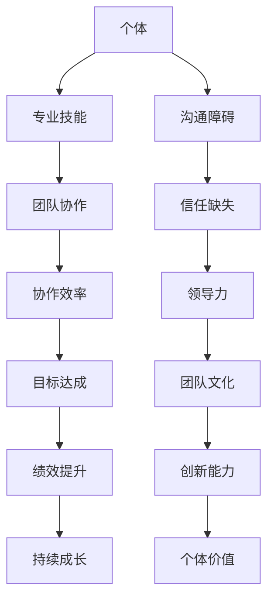

                 

# 团队协作的艺术：从个体到集体的蜕变

## 关键词
团队协作、集体蜕变、个体与团队关系、团队协作原则、团队协作实践、团队协作问题与挑战、团队协作案例分析、团队协作未来展望

## 摘要
本文深入探讨了团队协作的艺术，从个体到集体的蜕变。首先，阐述了团队协作的基本概念，包括个体与团队的关系、团队的分类以及团队协作的目标。接着，讨论了团队协作的核心原则，如信任与尊重、沟通与反馈、协作与共享。随后，分析了团队协作的关键因素，如团队文化、团队领导力和团队成员素质。文章接着介绍了团队协作的实践方法，包括团队建设策略、团队协作工具与技术。然后，探讨了团队协作中的常见问题与挑战，并提出了相应的解决策略。通过案例分析，本文展示了团队协作的成功与问题。最后，展望了团队协作的未来趋势，并探讨了团队协作的艺术与哲学。

### 第1章：团队协作的艺术：从个体到集体的蜕变

#### 1.1 团队协作的基本概念

#### 1.1.1 个体与团队的关系

在现代社会中，个体与团队的关系日益紧密。个体作为团队中的基本单元，发挥着不可或缺的作用。然而，个体在团队中也存在着一定的局限性。个体拥有独特的技能和知识，但受限于个人能力，往往难以应对复杂的任务和挑战。团队协作则能够充分发挥个体的优势，同时弥补个体的不足，实现资源的有效整合。

个体在团队中的作用主要包括以下几个方面：

1. **专业技能贡献**：个体通过专业技能的发挥，为团队完成特定的任务提供支持。
2. **创新思维**：个体独特的视角和思维方式，能够为团队带来新的思路和创意。
3. **团队动力**：个体的积极性和工作热情，能够影响整个团队的士气和工作效率。

个体在团队中的局限性主要表现在以下几个方面：

1. **资源有限**：个体的时间和精力有限，难以同时处理多项任务。
2. **视野局限**：个体受限于个人的经验和知识，难以全面了解问题。
3. **协作难度**：个体在沟通和协作方面可能存在障碍，影响工作效率。

团队对于个体成长的意义在于：

1. **能力提升**：个体在团队中能够学习新的技能和知识，提升自身能力。
2. **视野拓展**：个体通过与团队成员的交流和合作，能够拓展视野，获得更多视角。
3. **角色认知**：个体在团队中能够更好地认识自己的角色和责任，实现个人价值。

#### 1.1.2 团队的定义与分类

团队（Team）是指一组人为了共同的目标而协同工作的群体。团队不仅仅是一个简单的集合体，而是一个有机的整体，通过有效的协作和沟通，实现共同的目标。

团队可以分为以下几种类型：

1. **功能型团队**：根据不同的职能和任务，由各类专业人员组成的团队，如研发团队、市场团队等。
2. **项目型团队**：为完成特定项目而组建的临时团队，项目结束后团队解散。
3. **跨职能团队**：由来自不同部门或领域的成员组成的团队，以实现跨部门协作和资源整合。
4. **自我管理型团队**：成员具备自我管理能力，自主决策和协调工作的团队。

传统团队与现代团队的区别在于：

1. **目标导向**：传统团队更多关注于任务的完成，而现代团队更注重目标的实现。
2. **协作方式**：传统团队依靠线性管理结构，而现代团队强调扁平化和协同工作。
3. **团队角色**：传统团队有明确的主导者，而现代团队鼓励平等和共同参与。

#### 1.1.3 团队协作的目标

团队协作的核心目标是实现团队成员的协同合作，共同完成团队任务，实现团队目标。具体来说，团队协作的目标包括：

1. **共同目标**：明确团队的目标，确保团队成员对目标的共识。
2. **有效沟通**：通过有效的沟通，确保信息的准确传递和团队共识的形成。
3. **资源整合**：整合团队成员的技能、知识和资源，实现资源的最大化利用。
4. **协同合作**：通过协作，实现团队成员之间的互补和协同，提高工作效率。
5. **持续改进**：不断反思和改进团队协作过程，提高团队绩效。

如何实现团队协作的目标？

1. **明确目标**：通过共同讨论和明确团队的目标，确保团队成员对目标有清晰的认识。
2. **建立信任**：通过建立信任，促进团队成员之间的协作和合作。
3. **有效沟通**：通过多种沟通方式，确保信息的及时传递和团队成员之间的共识。
4. **分工合作**：明确团队成员的职责和任务，确保团队成员各司其职，协同合作。
5. **持续改进**：通过定期的团队会议和反馈机制，不断改进团队协作过程，提高团队绩效。

### 第2章：团队协作的核心原则

#### 2.1 信任与尊重

#### 2.1.1 信任在团队协作中的重要性

信任是团队协作的基石，没有信任，团队协作将难以有效进行。信任在团队协作中的重要性体现在以下几个方面：

1. **促进协作**：信任能够促进团队成员之间的协作，降低沟通成本和协作难度。
2. **提升效率**：信任能够提高团队成员的工作效率，减少内耗和冲突。
3. **增强凝聚力**：信任能够增强团队的凝聚力，使团队成员更加团结一致。
4. **激发创新**：信任能够激发团队成员的创新思维和创造力，推动团队不断进步。

#### 2.1.2 尊重多样性的实践

团队是由不同背景、不同性格、不同专业领域的成员组成的，多样性是团队的一大优势。尊重多样性意味着：

1. **接纳差异**：接纳团队成员之间的差异，包括文化、观点和技能等。
2. **平等对待**：平等对待每一位团队成员，不论其背景和地位。
3. **包容差异**：包容团队成员之间的差异，促进团队成员之间的相互理解和尊重。

在实践中，尊重多样性的方法包括：

1. **文化培训**：组织文化培训，提高团队成员对多样性的认识和接纳程度。
2. **沟通技巧**：通过有效的沟通技巧，促进团队成员之间的理解和尊重。
3. **建立多元化团队**：建立多元化团队，使团队成员能够从不同角度思考问题，提高团队的创新能力。

#### 2.2 沟通与反馈

#### 2.2.1 有效沟通的技巧

有效沟通是团队协作的关键，良好的沟通能够确保信息的准确传递和团队成员之间的共识。有效沟通的技巧包括：

1. **明确目标**：在沟通前明确沟通的目标和内容，确保沟通的针对性和有效性。
2. **倾听**：倾听对方的意见和观点，理解对方的意图和需求。
3. **表达清晰**：用简洁明了的语言表达自己的想法和意见，避免产生歧义。
4. **积极反馈**：给予积极的反馈，鼓励团队成员的表达和沟通。
5. **适时沟通**：选择合适的时机和方式，确保沟通的效果。

#### 2.2.2 正面反馈与建设性反馈

在团队协作中，反馈是不可或缺的一环。正面反馈和建设性反馈都是有效的反馈方式，但两者的目的和方式不同。

1. **正面反馈**：正面反馈是指对团队成员的工作表现给予肯定和赞赏。正面反馈能够提高团队成员的自信心和积极性，促进团队成员的持续进步。

2. **建设性反馈**：建设性反馈是指对团队成员的工作提出改进意见和建议。建设性反馈能够帮助团队成员认识到自身的问题和不足，并提供改进的方向。

在实践中，正面反馈和建设性反馈的结合使用，能够更好地促进团队成员的成长和团队协作的进步。

#### 2.3 协作与共享

#### 2.3.1 如何实现团队协作

团队协作的实现需要一系列的制度和机制来支持，以下是一些实现团队协作的方法：

1. **明确分工**：明确团队成员的职责和任务，确保团队成员各司其职，协同合作。
2. **共同目标**：明确团队的目标，确保团队成员对目标有清晰的认识，共同努力。
3. **有效沟通**：通过多种沟通方式，确保信息的准确传递和团队成员之间的共识。
4. **协作平台**：建立协作平台，如在线会议、协作工具等，提高团队协作的效率和效果。
5. **团队文化**：建立积极向上的团队文化，促进团队成员之间的信任和合作。

#### 2.3.2 知识共享与资源整合

知识共享和资源整合是团队协作的重要方面，能够提高团队的整体能力和效率。以下是一些实现知识共享和资源整合的方法：

1. **共享平台**：建立共享平台，如知识库、文档库等，方便团队成员访问和共享知识。
2. **培训与交流**：组织培训和交流活动，促进团队成员之间的知识交流和学习。
3. **资源整合**：整合团队成员的技能、知识和资源，实现资源的最大化利用。
4. **开放心态**：鼓励团队成员开放心态，接纳和分享他人的知识和资源。
5. **激励机制**：建立激励机制，鼓励团队成员积极参与知识共享和资源整合。

### 第3章：团队协作的关键因素

#### 3.1 团队文化

#### 3.1.1 健康团队文化的塑造

团队文化是团队协作的基石，健康的团队文化能够促进团队成员之间的协作和团队的长期发展。以下是一些塑造健康团队文化的方法：

1. **价值观共识**：建立共同的价值观，确保团队成员对团队文化的认同。
2. **领导示范**：领导者通过自身的言行，树立良好的团队文化榜样。
3. **团队建设**：组织团队建设活动，增强团队成员之间的信任和协作。
4. **持续改进**：不断反思和改进团队文化，适应团队的发展和变化。
5. **公平正义**：建立公平正义的机制，确保团队成员的权益和利益。

#### 3.1.2 团队文化对协作的影响

团队文化对团队协作有着深远的影响，健康的文化能够促进协作，而消极的文化则可能阻碍协作。以下是一些团队文化对协作的影响：

1. **信任与尊重**：健康的团队文化能够促进团队成员之间的信任和尊重，提高协作效率。
2. **开放与包容**：健康的团队文化鼓励开放和包容，促进团队成员之间的知识共享和资源整合。
3. **创新与进步**：健康的团队文化鼓励创新和进步，激发团队成员的积极性和创造力。
4. **稳定与持续**：健康的团队文化能够为团队的长期发展提供稳定的基础，促进团队协作的持续进步。

#### 3.2 团队领导力

#### 3.2.1 团队领导者的角色与职责

团队领导者在团队协作中扮演着重要的角色，他们的职责和角色包括：

1. **设定目标**：明确团队的目标和方向，确保团队成员对目标的认同和努力。
2. **分配任务**：根据团队成员的能力和特长，合理分配任务，确保任务的顺利完成。
3. **沟通协调**：促进团队成员之间的沟通和协作，解决协作中的问题和冲突。
4. **激励团队**：激发团队成员的积极性和创造力，提升团队的工作效率和绩效。
5. **反思与改进**：通过定期的反思和改进，提高团队协作的效果和绩效。

#### 3.2.2 领导力对团队协作的影响

领导力对团队协作有着重要的影响，优秀的领导者能够促进团队协作，提高团队绩效。以下是一些领导力对团队协作的影响：

1. **引导方向**：领导者通过明确的指导和激励，帮助团队成员找到正确的方向和目标。
2. **建立信任**：领导者通过自身的言行和决策，建立团队成员之间的信任，促进协作。
3. **解决冲突**：领导者通过有效的沟通和协调，解决团队协作中的冲突和问题。
4. **激励创新**：领导者鼓励团队成员的创新思维和创造力，推动团队的持续进步。
5. **优化资源**：领导者通过合理的资源和任务分配，提高团队的效率和绩效。

#### 3.3 团队成员素质

#### 3.3.1 团队成员的必备素质

团队成员的素质对团队协作有着重要的影响，以下是一些团队成员的必备素质：

1. **专业技能**：具备相应的专业技能和知识，能够胜任团队的任务和职责。
2. **沟通能力**：具备良好的沟通能力，能够有效地表达自己的观点和意见，理解他人的需求。
3. **团队合作精神**：具备团队合作精神，能够与团队成员协作，共同实现团队的目标。
4. **解决问题的能力**：具备解决问题的能力，能够面对挑战和困难，寻找有效的解决方案。
5. **自我管理能力**：具备自我管理能力，能够自我激励，自我调整，保持高效的工作状态。

#### 3.3.2 如何提升团队成员的能力

提升团队成员的能力是团队协作的重要任务，以下是一些提升团队成员能力的方法：

1. **培训与学习**：组织定期的培训和学习活动，提高团队成员的专业技能和知识。
2. **实践与锻炼**：通过实际项目和任务，锻炼团队成员的实践能力和解决问题的能力。
3. **反馈与指导**：给予团队成员及时的反馈和指导，帮助他们认识到自身的问题和不足，进行改进。
4. **激励与鼓励**：给予团队成员激励和鼓励，提高他们的工作积极性和自我管理能力。
5. **团队文化建设**：建立积极的团队文化，营造良好的学习和成长氛围，激发团队成员的潜力。

### 第4章：团队协作的实践方法

#### 4.1 团队建设策略

#### 4.1.1 团队成立与角色分配

团队建设的首要任务是团队的成立和角色分配。以下是一些团队成立和角色分配的方法：

1. **明确目标**：在团队成立之初，明确团队的目标和任务，确保团队成员对目标有清晰的认识。
2. **评估能力**：对团队成员进行能力评估，了解他们的技能和特长，为角色分配提供依据。
3. **角色分配**：根据团队成员的能力和特长，合理分配角色和任务，确保每个成员都能发挥自己的优势。
4. **沟通协调**：在角色分配过程中，注重团队成员之间的沟通和协调，确保角色的合理性和协作性。

#### 4.1.2 团队目标设定

团队目标的设定是团队建设的重要环节，以下是一些设定团队目标的方法：

1. **明确具体**：设定明确具体的团队目标，避免模糊和抽象的目标，使团队成员能够清晰地理解和努力。
2. **SMART原则**：遵循SMART原则（具体、可衡量、可实现、相关性、时间限制），确保团队目标的科学性和可行性。
3. **共同讨论**：通过团队成员的共同讨论和参与，确保团队目标的合理性和共识。
4. **动态调整**：根据团队的发展和变化，及时调整团队目标，确保目标的适应性和有效性。

#### 4.1.3 团队激励与反馈机制

团队激励和反馈机制是团队建设的重要组成部分，以下是一些团队激励和反馈机制的方法：

1. **激励措施**：设定合理的激励措施，如奖励、晋升、培训等，激励团队成员的努力和贡献。
2. **绩效评估**：建立科学的绩效评估体系，对团队成员的工作表现进行客观评估。
3. **反馈机制**：建立有效的反馈机制，及时给予团队成员正面反馈和建设性反馈，促进团队成员的成长和改进。
4. **沟通渠道**：建立开放的沟通渠道，确保团队成员能够及时反映问题和意见，促进团队协作的顺畅。

#### 4.2 团队协作工具与技术

#### 4.2.1 团队协作软件

团队协作软件是团队协作的重要工具，以下是一些常用的团队协作软件：

1. **Slack**：Slack 是一款流行的即时通讯和协作工具，支持团队聊天、文件共享和任务管理等功能。
2. **Trello**：Trello 是一款基于看板的项目管理工具，适用于团队任务的管理和跟踪。
3. **Asana**：Asana 是一款功能强大的任务管理工具，支持团队任务分配、进度跟踪和协作。
4. **Zoom**：Zoom 是一款视频会议和远程协作工具，支持多人在线会议和视频通话。
5. **Google Workspace**：Google Workspace 包括 Google Docs、Google Sheets、Google Drive 等工具，提供在线文档编辑、共享和协作功能。

#### 4.2.2 沟通与协作技巧

有效的沟通与协作技巧是团队协作的关键，以下是一些沟通与协作技巧：

1. **明确目标**：在沟通前明确目标，确保沟通的针对性和有效性。
2. **倾听与理解**：倾听对方的观点和意见，理解对方的意图和需求。
3. **表达清晰**：用简洁明了的语言表达自己的想法和意见，避免产生歧义。
4. **积极反馈**：给予积极的反馈，鼓励团队成员的表达和沟通。
5. **建立共识**：通过讨论和协商，建立团队成员之间的共识。
6. **分工合作**：明确团队成员的职责和任务，确保团队成员各司其职，协同合作。

#### 4.2.3 项目管理与进度跟踪

项目管理和进度跟踪是团队协作的重要任务，以下是一些项目管理和进度跟踪的方法：

1. **项目计划**：制定详细的项目计划，明确项目的目标、任务、时间节点和资源需求。
2. **任务分配**：根据项目计划，合理分配任务给团队成员，确保每个成员都能按时完成自己的任务。
3. **进度跟踪**：建立进度跟踪机制，实时监控项目的进展情况，确保项目按计划进行。
4. **定期汇报**：定期召开项目会议，汇报项目的进展情况，解决项目中出现的问题和困难。
5. **风险控制**：识别和评估项目中的风险，制定风险应对策略，确保项目能够顺利进行。

### 第5章：团队协作中的问题与挑战

#### 5.1 团队协作中的常见问题

#### 5.1.1 沟通不畅

沟通不畅是团队协作中常见的问题，以下是一些导致沟通不畅的原因和解决策略：

1. **原因**：
   - 没有明确的沟通目标和计划。
   - 信息传递过程中的误解和歧义。
   - 沟通渠道不畅，信息传递不及时。
   - 团队成员之间缺乏有效的沟通技巧。

2. **解决策略**：
   - 设定明确的沟通目标和计划，确保沟通的针对性和有效性。
   - 建立多元化的沟通渠道，如会议、邮件、即时通讯等，提高信息传递的效率。
   - 加强团队成员的沟通技巧培训，提高沟通的效果。
   - 定期进行沟通评估，及时发现问题并采取改进措施。

#### 5.1.2 权力斗争

权力斗争是团队协作中的另一个常见问题，以下是一些权力斗争的表现和解决策略：

1. **表现**：
   - 团队成员之间争权夺利，缺乏合作精神。
   - 团队成员对决策过程不满，产生抵触情绪。
   - 团队成员之间的沟通不畅，导致冲突和误解。

2. **解决策略**：
   - 建立明确的决策权和职责分工，确保团队成员对决策过程有清晰的认识。
   - 提高团队成员的合作意识和团队精神，鼓励团队合作。
   - 建立有效的沟通机制，促进团队成员之间的沟通和协作。
   - 及时解决团队成员之间的冲突和误解，避免问题激化。

#### 5.1.3 激励不足

激励不足是团队协作中的常见问题，以下是一些导致激励不足的原因和解决策略：

1. **原因**：
   - 缺乏明确的激励机制和奖励制度。
   - 团队成员对工作目标和成果缺乏认同。
   - 团队成员之间的沟通不畅，导致工作氛围不融洽。
   - 团队成员的个人需求和期望未能得到满足。

2. **解决策略**：
   - 设定明确的激励机制和奖励制度，确保团队成员对激励机制有清晰的认识。
   - 提高团队成员对工作目标和成果的认同，增强团队凝聚力。
   - 加强团队成员之间的沟通和协作，营造积极的工作氛围。
   - 了解和满足团队成员的个人需求和期望，提高他们的工作积极性和满意度。

#### 5.2 团队协作的挑战

#### 5.2.1 团队规模扩大

随着团队规模的扩大，团队协作面临着一系列的挑战，以下是一些团队规模扩大的影响和管理策略：

1. **影响**：
   - 沟通成本增加，信息传递效率降低。
   - 协作难度加大，团队成员之间的协作和协调变得更加复杂。
   - 管理成本增加，需要更多的时间和资源进行团队管理。

2. **管理策略**：
   - 建立有效的沟通机制，确保信息的及时传递和团队成员之间的共识。
   - 精简团队结构，减少不必要的层级和冗余，提高团队的效率。
   - 引入项目管理工具，如看板、敏捷管理等，提高团队协作的效率和效果。
   - 定期进行团队评估和反馈，及时发现和解决问题。

#### 5.2.2 多元文化团队

多元文化团队是团队协作中的一个重要挑战，以下是一些多元文化团队的挑战和应对策略：

1. **挑战**：
   - 文化差异导致的沟通障碍和冲突。
   - 文化差异导致的价值观和期望差异。
   - 文化差异导致的团队成员之间的信任问题。

2. **应对策略**：
   - 建立文化包容的团队氛围，鼓励团队成员之间的相互理解和尊重。
   - 提供跨文化培训，提高团队成员的跨文化沟通和协作能力。
   - 建立多元化的沟通渠道，促进团队成员之间的沟通和交流。
   - 建立公平公正的决策和激励机制，确保多元文化团队的稳定和发展。

#### 5.2.3 频繁变更与迭代

频繁变更与迭代是现代项目开发中的一个常见现象，以下是一些变更与迭代对团队协作的影响和应对策略：

1. **影响**：
   - 变更和迭代可能导致项目计划的频繁调整，影响团队的工作效率和进度。
   - 变更和迭代可能带来新的挑战和风险，增加团队的工作负担。
   - 变更和迭代可能影响团队成员的工作状态和士气。

2. **应对策略**：
   - 建立灵活的项目管理机制，能够快速响应变更和迭代。
   - 提高团队成员的适应能力和应变能力，应对变更和迭代带来的挑战。
   - 加强团队沟通和协作，确保团队成员对变更和迭代的理解和共识。
   - 定期评估变更和迭代的影响，及时调整项目计划和策略。

### 第6章：团队协作的案例分析

#### 6.1 案例一：高效团队协作的典范

#### 6.1.1 案例背景

该案例是一家全球知名的互联网公司，其研发团队在项目开发过程中展现了高效团队协作的能力。

#### 6.1.2 团队建设与协作

该团队在建设过程中采取了以下措施：

1. **明确目标**：团队在项目启动之初，明确项目的目标和任务，确保团队成员对目标有清晰的认识。
2. **角色分配**：根据团队成员的能力和特长，合理分配角色和任务，确保每个成员都能发挥自己的优势。
3. **有效沟通**：建立了多种沟通渠道，如每日站会、周报、邮件等，确保信息的及时传递和团队成员之间的共识。
4. **协作平台**：使用了Trello和Slack等团队协作工具，提高了团队的协作效率和效果。

#### 6.1.3 项目成果与经验

该团队在项目开发过程中取得了以下成果：

1. **高质量的项目交付**：团队按时交付了高质量的项目成果，获得了客户的高度认可。
2. **团队成员的成长**：团队成员在项目过程中学习到了新的技能和知识，提升了个人能力。
3. **团队协作经验的积累**：团队在项目过程中积累了丰富的协作经验，为后续项目提供了宝贵的借鉴。

#### 6.2 案例二：团队协作中的挑战与应对

#### 6.2.1 案例背景

该案例是一家传统制造企业的研发团队，在项目开发过程中遇到了一系列的挑战。

#### 6.2.2 团队协作中的问题

团队在协作过程中遇到了以下问题：

1. **沟通不畅**：团队成员之间的沟通不畅，导致信息传递不及时，影响了项目的进展。
2. **角色冲突**：团队成员之间的角色冲突，导致任务分配不合理，影响了团队的协作效率。
3. **激励不足**：团队成员的激励不足，导致工作积极性不高，影响了项目的质量。

#### 6.2.3 应对策略与成果

团队采取了以下策略来应对问题：

1. **沟通改善**：建立了定期的沟通机制，如每日站会、周报等，确保信息的及时传递和团队成员之间的共识。
2. **角色调整**：根据团队成员的能力和特长，重新分配角色和任务，确保任务分配合理，提高团队的协作效率。
3. **激励提升**：设立了激励机制，如绩效奖金、晋升机会等，提高团队成员的工作积极性和满意度。

通过这些策略，团队取得了以下成果：

1. **沟通效率提升**：团队成员之间的沟通变得更加顺畅，信息传递及时，项目的进展得到了有效推动。
2. **协作效率提高**：角色冲突得到有效解决，任务分配更加合理，团队的协作效率得到了显著提升。
3. **项目质量改善**：团队成员的工作积极性提高，项目质量得到了明显改善，客户满意度提升。

### 第7章：团队协作的未来展望

#### 7.1 技术趋势对团队协作的影响

随着科技的快速发展，技术趋势对团队协作产生了深远的影响。以下是一些技术趋势对团队协作的影响：

1. **数字化转型**：数字化转型使得团队协作更加便捷和高效，团队成员可以通过云平台和在线工具实现远程协作，提高工作效率。
2. **人工智能与自动化**：人工智能和自动化技术的发展，使得团队协作更加智能化和自动化，减少重复性工作，提高团队的工作效率。
3. **分布式团队协作**：分布式团队协作成为趋势，团队成员可以跨越地域限制，实现远程协作，提高团队的创新能力和灵活性。

#### 7.2 团队协作的未来趋势

团队协作的未来趋势体现在以下几个方面：

1. **智能化协作**：随着人工智能技术的发展，团队协作将更加智能化，自动化工具将协助团队成员完成重复性工作，提高工作效率。
2. **敏捷性协作**：敏捷性协作将成为团队协作的主流，团队将更加注重灵活性、响应速度和客户满意度。
3. **跨界协作**：跨界协作将成为团队协作的重要趋势，团队成员将来自不同的领域和背景，通过跨界合作，实现创新和突破。
4. **终身学习**：团队协作将更加注重终身学习，团队成员将不断提升自己的技能和知识，以适应快速变化的工作环境。

#### 7.3 持续学习与创新能力

持续学习和创新能力是团队协作的关键。以下是一些提升团队持续学习和创新能力的方法：

1. **培训与学习**：定期组织培训和学习活动，提升团队成员的专业技能和知识水平。
2. **创新思维**：鼓励团队成员发挥创新思维，提出新的想法和解决方案，推动团队的持续创新。
3. **跨学科合作**：促进团队成员之间的跨学科合作，通过多角度、多学科的思考，提高团队的创新能力。
4. **知识共享**：建立知识共享机制，鼓励团队成员分享知识和经验，提高团队的整体能力。

### 第8章：团队协作的艺术与哲学

#### 8.1 视觉艺术与团队协作

视觉艺术在团队协作中的应用，不仅可以提升团队的创造力，还能增强团队凝聚力和协作效率。以下是一些视觉艺术在团队协作中的应用：

1. **思维导图**：通过绘制思维导图，帮助团队成员梳理思路，明确项目目标和任务。
2. **图表与图形**：使用图表和图形，展示项目进度、任务分配和团队绩效，提高团队对项目的理解和共识。
3. **创意工作坊**：组织创意工作坊，通过绘画、手工等活动，激发团队成员的创意思维和团队合作精神。

#### 8.2 音乐艺术与团队协作

音乐艺术在团队协作中有着独特的价值，可以调节团队氛围，提高团队协作的效率。以下是一些音乐艺术在团队协作中的应用：

1. **背景音乐**：在团队工作环境中播放轻松愉快的背景音乐，有助于提升团队成员的工作积极性和专注力。
2. **团队合唱**：组织团队合唱活动，增强团队成员之间的情感联系和团队凝聚力。
3. **音乐创作**：鼓励团队成员参与音乐创作，通过音乐表达自己的情感和创意，提高团队的创造力和协作精神。

#### 8.3 文学艺术与团队协作

文学艺术在团队协作中的应用，可以丰富团队的文化氛围，提升团队成员的人文素养和团队意识。以下是一些文学艺术在团队协作中的应用：

1. **读书会**：定期组织读书会，分享阅读心得，提升团队成员的阅读能力和思维能力。
2. **文学创作**：鼓励团队成员进行文学创作，通过写作表达自己的情感和思考，提高团队的创新能力和表达力。
3. **文学讨论**：组织文学讨论活动，促进团队成员之间的交流和思想碰撞，激发团队的创造力和协作精神。

### 结语

团队协作是现代组织中不可或缺的一部分，它不仅关系到团队绩效和项目成功，更影响着团队成员的个人成长和发展。通过本文的探讨，我们了解了团队协作的基本概念、核心原则、关键因素和实践方法，也看到了团队协作中的问题和挑战。展望未来，随着技术的不断进步和社会的不断发展，团队协作将迎来新的机遇和挑战。让我们以开放的心态和创新的思维，共同探索团队协作的艺术与哲学，为团队的持续发展和组织的成功贡献自己的力量。

### 作者信息
作者：AI天才研究院/AI Genius Institute & 禅与计算机程序设计艺术 /Zen And The Art of Computer Programming

### 附录

#### 背景介绍

团队协作在现代社会中发挥着越来越重要的作用，无论是在企业、政府机构还是非营利组织中，团队协作都是实现共同目标、提高工作效率的重要手段。随着全球化的发展和信息化进程的加快，团队协作的形式和方式也在不断演变。本文旨在探讨团队协作的艺术，从个体到集体的蜕变，为读者提供系统、实用的团队协作方法和策略。

#### 核心概念与联系

为了更好地理解团队协作的核心概念和它们之间的联系，我们可以使用Mermaid流程图来展示。以下是一个简化的流程图示例，展示了个体与团队之间的关系以及团队协作的核心原则：



在这个流程图中，我们可以看到个体与团队之间的关系，以及团队协作的核心原则是如何相互影响、共同促进团队成长的。

#### 核心算法原理讲解

在团队协作中，算法原理的应用可以帮助我们优化团队协作流程，提高协作效率。以下是一个简单的协作算法原理讲解，使用伪代码来阐述：

```plaintext
算法名称：协作优化算法

输入：
- 团队成员列表（团队成员的技能、任务、可用时间等）
- 项目任务列表（任务的目标、难度、优先级等）
- 团队资源（如预算、设备等）

输出：
- 优化后的团队成员任务分配
- 优化后的项目进度计划

伪代码：

协作优化算法（团队成员列表，项目任务列表，团队资源）：
1. 初始化任务分配列表和进度计划
2. 对每个项目任务，按照优先级进行排序
3. 对每个团队成员，按照技能和可用时间进行排序
4. 对于每个任务，从高优先级开始，选择最合适的团队成员进行分配
5. 如果团队成员的技能和任务匹配度不高，则调整团队成员的技能培训计划
6. 如果任务完成时间超过预期，则调整进度计划，确保任务按时完成
7. 如果团队资源不足，则重新评估任务分配和进度计划，确保资源的最大化利用
8. 输出优化后的任务分配列表和进度计划
```

通过这个算法，我们可以根据团队成员的技能、任务的目标和难度、团队的资源状况等，进行优化分配，确保团队成员的协作效率和项目的顺利推进。

#### 数学模型和公式

在团队协作中，我们经常需要使用数学模型和公式来分析和优化协作过程。以下是一个简单的数学模型和公式的示例：

**1.协作效率公式**：

协作效率（E）可以通过以下公式计算：

\[ E = \frac{（团队完成任务的总时间）}{（各成员单独完成任务所需的总时间）} \]

**2.团队绩效评估公式**：

团队绩效（P）可以通过以下公式评估：

\[ P = \frac{（团队完成的项目数量 × 项目质量得分）}{（团队总项目数）} \]

**3.团队成员贡献评估公式**：

团队成员的贡献（C_i）可以通过以下公式计算：

\[ C_i = \frac{（成员完成任务的时间 × 任务难度得分）}{（团队成员总数）} \]

这些公式可以帮助团队领导者和成员了解团队协作的效率、绩效以及个体的贡献，为团队决策和个体发展提供依据。

#### 详细讲解与举例说明

为了更好地理解这些数学模型和公式，我们可以通过具体的例子来说明：

**例子**：一个团队由5名成员组成，他们分别负责不同的任务。假设团队成员A负责的任务完成时间为10天，任务难度得分为3分；团队成员B负责的任务完成时间为15天，任务难度得分为2分；其他成员的任务完成时间和难度得分类似。该团队完成了一个包含3个项目的任务。

1. **协作效率计算**：

\[ E = \frac{（5 × 10 + 5 × 15 + 5 × 20）}{（10 + 15 + 20）} = \frac{150}{45} ≈ 3.33 \]

2. **团队绩效评估**：

假设每个项目的质量得分都为90分，团队总项目数为3个，则：

\[ P = \frac{（3 × 90）}{3} = 90 \]

3. **团队成员贡献评估**：

团队成员A的贡献为：

\[ C_A = \frac{（10 × 3）}{5} = 6 \]

同理，可以计算出其他团队成员的贡献。

通过这个例子，我们可以看到如何使用数学模型和公式来评估团队协作的效率和绩效，以及个体成员的贡献。

#### 项目实战

在实际的团队协作中，我们需要通过具体的项目实战来验证和应用这些理论和公式。以下是一个简单的项目实战示例：

**项目名称**：开发一款移动应用

**项目背景**：为了满足用户对移动应用的需求，一个团队被组建起来，负责开发和维护这款移动应用。

**团队成员**：团队成员包括前端开发人员、后端开发人员、UI设计师和测试工程师。

**项目任务**：开发一款功能完整的移动应用，包括用户注册、登录、个人信息管理、消息推送等功能。

**项目时间**：3个月

**项目预算**：50,000美元

**项目环境**：使用React Native作为开发框架，MySQL作为后端数据库，Docker用于容器化部署。

**项目步骤**：

1. **需求分析**：团队召开会议，明确移动应用的功能需求，制定详细的需求文档。
2. **任务分配**：根据团队成员的技能和经验，将任务合理分配给各个成员，确保每个成员都能发挥自己的优势。
3. **编码开发**：团队成员按照任务分配，开始编码开发，每周进行一次代码评审和进度汇报。
4. **UI设计**：UI设计师根据需求文档，设计应用界面，并与前端开发人员协作，确保界面设计和开发的一致性。
5. **测试与调试**：测试工程师对应用进行功能测试、性能测试和安全测试，确保应用的稳定性和安全性。
6. **部署与上线**：将应用部署到应用商店，并进行上线准备，发布新版本。

**项目小结**：

通过这个项目实战，我们可以看到团队协作的过程是如何具体实施的。团队成员通过明确的任务分配、有效的沟通和协作，完成了项目的开发和上线。项目完成后，团队进行了总结和反思，针对项目中出现的问题和挑战，制定了改进措施，为后续项目提供了宝贵的经验。

#### 最佳实践 Tips

为了提高团队协作的效果，以下是一些最佳实践Tips：

1. **定期召开团队会议**：定期召开团队会议，讨论项目进展、问题和解决方案，确保团队成员之间的信息同步和共识。
2. **明确任务和目标**：在项目启动之初，明确任务和目标，确保每个团队成员对任务和目标有清晰的认识。
3. **建立沟通渠道**：建立多种沟通渠道，如邮件、即时通讯工具、视频会议等，确保团队成员之间的沟通顺畅。
4. **鼓励知识共享**：鼓励团队成员分享知识和经验，提高团队的整体能力和创新能力。
5. **合理分配任务**：根据团队成员的技能和经验，合理分配任务，确保任务分配的合理性和公平性。
6. **建立反馈机制**：建立有效的反馈机制，及时给予团队成员正面反馈和建设性反馈，促进团队成员的成长和改进。
7. **关注团队成员的身心健康**：关注团队成员的身心健康，提供必要的支持和帮助，确保团队成员能够保持高效的工作状态。

#### 小结、注意事项与拓展阅读

在团队协作中，团队协作的艺术与哲学至关重要。通过本文的探讨，我们了解了团队协作的基本概念、核心原则、关键因素和实践方法，也看到了团队协作中的问题和挑战。团队协作不仅仅是一种工作方式，更是一种艺术和哲学。通过持续的学习和实践，我们可以不断提升团队协作的能力，为团队的持续发展和组织的成功贡献自己的力量。

在后续的学习和实践中，读者可以关注以下几个方面的内容：

1. **深度学习团队协作理论**：深入学习和理解团队协作的理论，如心理学、管理学、沟通学等，为团队协作提供理论支持。
2. **实践团队协作技巧**：通过实际项目，应用团队协作技巧，不断总结和反思，提升团队协作的效果。
3. **关注团队文化建设**：团队文化是团队协作的重要基石，关注团队文化的建设，营造积极向上的团队氛围。
4. **探讨新技术在团队协作中的应用**：随着技术的发展，新技术在团队协作中的应用越来越广泛，关注新技术在团队协作中的应用，提高团队的协作效率和效果。

拓展阅读：

1. “团队的五项修炼：打造卓越团队的关键法则” - [斯蒂芬·罗宾斯](https://book.douban.com/subject/10670239/)
2. “敏捷团队实践指南” - [杰夫·萨瑟兰](https://book.douban.com/subject/24760737/)
3. “有效沟通：团队沟通与协作技巧” - [罗纳德·海菲兹](https://book.douban.com/subject/23792014/)
4. “团队协作的艺术” - [詹姆斯·麦格雷戈·伯恩斯](https://book.douban.com/subject/26982060/)

