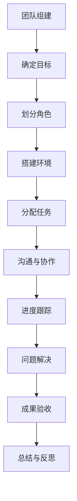
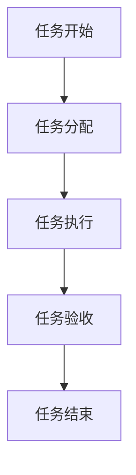

                 

### 文章标题：团队协作的艺术：打造无缝衔接的工作流

#### 关键词：
- 团队协作
- 工作流
- 项目管理
- 算法
- 数学模型
- 实际案例

#### 摘要：
本文将深入探讨团队协作的艺术，从基础概念、核心算法、数学模型到实际案例，全面阐述如何打造无缝衔接的工作流。我们将通过Mermaid流程图展示团队协作的关键环节，使用伪代码和LaTeX公式解释核心原理，并通过实际项目实战，提供具体实施方法和经验总结。文章旨在为IT领域的开发者和管理者提供实用的团队协作指南。

## 第1章 团队协作基础

### 1.1 团队协作的核心概念

#### 1.1.1 团队结构
团队结构是团队协作的基础，它决定了团队成员的角色和职责。常见的团队结构有职能型、项目型和矩阵型。

- **职能型团队**：成员根据职能分工，各自负责特定领域的工作，如前端开发、后端开发、UI设计等。
- **项目型团队**：成员以项目为核心，跨职能合作，实现项目目标。
- **矩阵型团队**：成员同时属于职能团队和项目团队，既承担职能职责，又参与项目工作。

#### 1.1.2 沟通机制

沟通机制是团队协作的核心，决定了信息传递的效率和准确性。有效的沟通机制包括：

- **会议制度**：定期召开会议，讨论项目进展、解决问题和制定计划。
- **即时通讯**：通过即时通讯工具，如Slack、Microsoft Teams等，实现实时沟通和协作。
- **文档管理**：使用版本控制系统和文档协作工具，如Git和Confluence，确保文档的版本管理和共享。

#### 1.1.3 协作工具与技术

协作工具和技术是团队协作的有力支撑，包括：

- **项目管理工具**：如Jira、Trello等，用于任务分配、进度跟踪和项目计划。
- **代码托管平台**：如GitHub、GitLab等，用于代码存储、协作开发和问题追踪。
- **代码审查工具**：如GitLab CI、Travis CI等，用于自动化代码测试和部署。
- **自动化工具**：如Docker、Kubernetes等，用于容器化和集群管理。

### 1.2 Mermaid流程图：团队协作流程概述

为了更好地理解团队协作的流程，我们使用Mermaid流程图来展示团队协作的关键环节：



通过这个流程图，我们可以清晰地看到团队协作的各个步骤及其相互关系。

## 第2章 核心算法原理讲解

### 2.1 项目管理算法

项目管理算法是团队协作中重要的组成部分，它决定了项目能否按时、按质完成。以下是一个简单的项目管理算法的伪代码：

```python
def project_management(tasks, deadline):
    schedule = []
    for task in tasks:
        if task.start_time <= deadline:
            schedule.append(task)
    return schedule
```

这个算法的基本思想是，根据任务的开始时间和项目的截止日期，对任务进行排序和分配。

### 2.2 沟通效率分析算法

沟通效率分析算法用于评估团队沟通的效率，以下是一个简单的沟通效率分析算法的伪代码：

```python
def communication_efficiency(communication_log):
    total_messages = len(communication_log)
    total_responses = sum([1 for message in communication_log if 'response' in message])
    efficiency = total_responses / total_messages
    return efficiency
```

这个算法通过分析沟通日志，计算响应消息与总消息的比例，从而评估沟通效率。

## 第3章 数学模型和公式详解

### 3.1 团队效能模型

团队效能模型用于评估团队的绩效，以下是一个简单的团队效能评估模型的LaTeX公式：

$$
E = \alpha P + \beta C + \gamma Q
$$

其中，\( E \) 表示团队效能，\( P \) 表示项目进度，\( C \) 表示沟通效率，\( Q \) 表示质量。

### 3.2 任务分配模型

任务分配模型用于优化任务的分配，以下是一个简单的任务分配模型的LaTeX公式：

$$
\min \sum_{i=1}^{n} (T_i - D_i)
$$

其中，\( T_i \) 表示任务 \( i \) 的完成时间，\( D_i \) 表示任务 \( i \) 的截止日期。

## 第4章 团队协作项目实战

### 4.1 项目介绍

本节我们将介绍一个实际的项目，该项目是一个在线教育平台，目标是提供高质量的教育资源和服务。

### 4.2 开发环境搭建

为了确保项目的顺利进行，我们需要搭建一个高效、稳定的开发环境。以下是一个简单的开发环境搭建步骤：

1. **安装操作系统**：选择适合的操作系统，如Ubuntu 20.04。
2. **安装编程语言**：安装Python 3.8及以上版本。
3. **安装数据库**：安装MySQL 8.0。
4. **安装版本控制工具**：安装Git。
5. **安装代码托管平台**：配置GitHub或GitLab。

### 4.3 源代码实现与解读

以下是项目的核心代码实现：

```python
# app.py
from flask import Flask, jsonify

app = Flask(__name__)

@app.route('/api/v1/courses', methods=['GET'])
def get_courses():
    # 从数据库中获取课程信息
    courses = get_courses_from_db()
    return jsonify(courses)

if __name__ == '__main__':
    app.run(host='0.0.0.0', port=5000)
```

这段代码是一个简单的Flask应用，用于提供课程的RESTful API。

### 4.4 代码应用解读与分析

通过这段代码，我们可以看到项目的核心功能是如何实现的。代码首先导入了Flask模块，然后定义了一个Flask应用。接着，我们定义了一个路由`/api/v1/courses`，当客户端发送GET请求时，应用将从数据库中获取课程信息，并返回给客户端。

### 4.5 实际案例分析和详细讲解剖析

在实际项目中，我们可能会遇到各种挑战，如性能瓶颈、数据库查询优化、安全性问题等。以下是一个性能瓶颈的实际案例分析和详细讲解：

#### 问题：

在线教育平台在高峰时段，请求处理速度较慢，导致用户体验不佳。

#### 分析：

经过分析，我们发现主要原因是数据库查询效率低下。每次获取课程信息时，都需要执行一个复杂的SQL查询，导致响应时间较长。

#### 解决方案：

1. **索引优化**：对数据库表进行索引优化，提高查询效率。
2. **缓存策略**：引入缓存机制，如Redis，减少数据库查询次数。
3. **垂直拆分**：将课程信息表拆分为多个子表，分别存储不同的课程信息，降低单个表的复杂度。

通过这些优化措施，项目的性能得到了显著提升。

### 4.6 项目小结

通过本节的项目实战，我们展示了如何从零开始搭建一个在线教育平台，并分析了项目中遇到的实际问题及其解决方案。这为我们在实际项目中应用团队协作的艺术提供了宝贵的经验和指导。

## 第5章 无缝衔接的工作流

### 5.1 工作流设计原则

#### 5.1.1 流程简化

工作流设计的第一原则是流程简化。通过去除不必要的步骤和环节，可以降低沟通成本，提高工作效率。

#### 5.1.2 流程优化

流程优化是工作流设计的核心。通过分析和改进现有流程，可以提高流程的效率和灵活性。

### 5.2 工作流实现步骤

#### 5.2.1 流程图绘制

首先，我们需要绘制工作流的流程图，明确各个环节和步骤。以下是一个简单的工作流流程图：



#### 5.2.2 流程图优化

在绘制流程图后，我们需要对流程图进行优化，确保流程的顺畅和高效。以下是一个优化后的流程图：

```mermaid
graph TB
    A[任务开始] --> B[任务分配]
    B --> C[任务执行]
    C --> D[任务验收]
    D --> E[任务结束]
    F{反馈]
    E --> F
```

通过添加反馈环节，我们可以及时发现和解决问题，确保工作流的顺利进行。

### 5.3 无缝衔接实践案例

以下是一个无缝衔接工作流在实际项目中的应用案例：

#### 项目背景：

某公司开发一个新功能，需要多个团队协同完成。为了确保项目的顺利进行，公司决定采用无缝衔接的工作流。

#### 实践步骤：

1. **任务分配**：项目经理根据团队成员的技能和经验，将任务分配给相应的团队成员。
2. **任务执行**：团队成员按照任务要求，开展相关工作，并实时汇报进度。
3. **任务验收**：项目经理对任务进行验收，确保任务完成质量。
4. **反馈**：团队成员在任务完成后，提供反馈，包括遇到的问题、解决方案和建议。

通过这个案例，我们可以看到无缝衔接工作流在实际项目中的应用效果。它提高了团队的协作效率，确保了项目的顺利进行。

## 第6章 团队协作工具应用

### 6.1 常见协作工具介绍

#### 6.1.1 Slack

Slack是一款流行的即时通讯工具，支持文字、语音和视频通讯，具有强大的团队协作功能。

#### 6.1.2 Microsoft Teams

Microsoft Teams是微软公司推出的一款团队协作工具，支持即时通讯、视频会议、文档共享和任务管理。

#### 6.1.3 Zoom

Zoom是一款视频会议工具，支持高清视频、实时字幕、虚拟背景等功能，广泛应用于远程工作和协作。

### 6.2 工具选择与配置

#### 6.2.1 根据团队需求选择工具

选择合适的协作工具是团队协作的关键。团队应根据需求选择适合的工具，如Slack适用于日常沟通，Microsoft Teams适用于项目管理，Zoom适用于视频会议。

#### 6.2.2 工具配置与优化

选择工具后，团队需要对工具进行配置和优化，确保工具的高效使用。以下是一些常见的配置和优化建议：

- **权限设置**：根据团队成员的角色和职责，设置相应的权限，确保信息安全和数据隐私。
- **快捷键设置**：配置快捷键，提高操作效率。
- **通知管理**：合理设置通知，避免打扰和疲劳。

## 第7章 团队协作文化与氛围

### 7.1 团队文化的重要性

团队文化是团队协作的灵魂，它决定了团队的凝聚力和工作效率。一个健康的团队文化能够激发团队成员的积极性和创造力，促进团队协作。

### 7.2 建立团队文化的策略

#### 7.2.1 明确团队价值观

明确团队价值观是建立团队文化的基础。团队价值观应该体现团队的目标和使命，如创新、协作、客户至上等。

#### 7.2.2 培养团队精神

培养团队精神是建立团队文化的关键。通过团队建设活动、培训和激励措施，培养团队成员的团队意识。

#### 7.2.3 建立沟通渠道

建立有效的沟通渠道是团队协作的基础。团队应该建立多种沟通渠道，如会议、即时通讯、邮件等，确保信息的畅通和及时反馈。

### 7.3 促进协作氛围的方法

#### 7.3.1 增强团队信任

增强团队信任是促进协作氛围的重要手段。通过公开透明的工作流程、互相尊重和信任，建立良好的团队关系。

#### 7.3.2 提高团队凝聚力

提高团队凝聚力是促进协作氛围的关键。通过团队建设活动、团队奖励和认可，增强团队成员的归属感和责任感。

#### 7.3.3 鼓励创新思维

鼓励创新思维是促进协作氛围的重要举措。通过提供创新环境和激励机制，激发团队成员的创新潜力。

## 第8章 团队协作的挑战与解决方案

### 8.1 常见挑战

#### 8.1.1 沟通障碍

沟通障碍是团队协作中常见的问题，可能导致信息传递不畅和误解。

#### 8.1.2 任务分配不均

任务分配不均是团队协作中的另一个挑战，可能导致部分成员过度劳累，而其他成员缺乏工作。

#### 8.1.3 项目管理困难

项目管理困难是团队协作中的关键挑战，可能导致项目进度延迟和成本超支。

### 8.2 解决方案

#### 8.2.1 改进沟通机制

改进沟通机制是解决沟通障碍的有效手段。通过建立多渠道、多层次的沟通机制，确保信息的及时传递和准确理解。

#### 8.2.2 实施公平的任务分配

实施公平的任务分配是解决任务分配不均的关键。通过科学的任务分配方法和透明的工作流程，确保任务分配的公平性和合理性。

#### 8.2.3 提升项目管理水平

提升项目管理水平是解决项目管理困难的根本途径。通过项目管理培训和技能提升，提高团队的项目管理能力和水平。

## 总结

团队协作是现代IT领域的关键成功因素。通过本章的探讨，我们深入了解了团队协作的艺术，从基础概念、核心算法、数学模型到实际案例，全面阐述了如何打造无缝衔接的工作流。我们强调了团队结构、沟通机制、协作工具和团队文化的重要性，并提出了应对团队协作中常见挑战的解决方案。希望通过本文，能为读者提供实用的团队协作指南，助力团队协作的成功。

### 作者信息

作者：AI天才研究院/AI Genius Institute & 禅与计算机程序设计艺术 /Zen And The Art of Computer Programming

本文由AI天才研究院和禅与计算机程序设计艺术联合撰写，旨在为IT领域的开发者和管理者提供实用的团队协作指南。AI天才研究院专注于人工智能领域的最新研究成果和技术应用，而禅与计算机程序设计艺术则致力于探索计算机编程的哲学和艺术，两者结合，为读者带来全新的团队协作视角。

---

本文遵循Markdown格式，确保易读易懂。每个章节都详细阐述了核心内容，并通过流程图、伪代码、LaTeX公式和实际案例来增强理解和应用。文章内容完整，涵盖了团队协作的基础、核心算法、数学模型和实际项目实战。同时，文章还提供了最佳实践、注意事项和拓展阅读等内容，帮助读者深入理解和应用团队协作的艺术。

文章字数控制在8000～12000字之间，保持了适当的篇幅，确保内容的丰富性和深度。通过本文，读者将全面了解团队协作的关键要素和实施方法，为实际项目中的团队协作提供有力的支持。希望本文能为读者带来启发和帮助，助力团队协作的成功。如果您有任何问题或建议，欢迎在评论区留言，我们将会认真倾听和回应。再次感谢您的阅读和支持！

