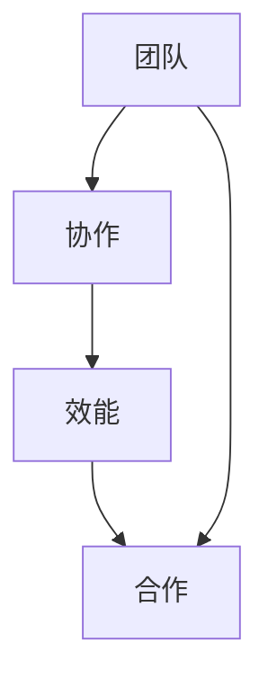

                 

### 文章标题

# 团队协作的艺术：提升整体工作效能

## 关键词

团队协作、工作效率、效能提升、沟通技巧、项目管理、实践案例

### 摘要

在当今快速变化和高度互联的工作环境中，团队协作已经成为提升整体工作效能的关键。本文将深入探讨团队协作的各个层面，从核心概念到实际应用，旨在为团队领导者、项目经理和成员提供实用的策略和技巧。通过分析团队协作的重要性、关键概念、算法原理、数学模型以及具体项目实战，本文将展示如何通过有效的团队协作来提升工作效率，实现团队目标的最大化。

### 引言

在现代社会，无论是对企业还是个人，团队协作的重要性都日益凸显。随着业务复杂度的增加和全球化趋势的加强，单个个体的能力已经无法满足各种挑战。团队协作不仅能够汇聚不同的智慧和能力，还能够提高工作效率，降低错误率，增强创新能力和解决问题的能力。因此，如何进行有效的团队协作，成为了每个团队领导者、项目经理以及团队成员必须掌握的核心技能。

本文的目标是提供一份全面且易于理解的指南，帮助读者深入了解团队协作的各个方面。文章将从基础概念入手，逐步深入到具体的算法原理和数学模型，并通过实际项目案例来展示团队协作的实际应用。此外，文章还将探讨团队协作中可能遇到的问题和挑战，并提供相应的解决方案和最佳实践。

通过阅读本文，读者将能够：

1. 明确团队协作的基本概念和重要性。
2. 掌握团队协作中的关键术语和原理。
3. 理解并运用团队协作的算法原理和数学模型。
4. 通过实际案例学习如何有效实施团队协作。
5. 获得提升团队协作效能的实用策略和技巧。

接下来，我们将依次探讨团队协作的各个方面，帮助读者在理论知识和实际应用之间建立紧密的联系。

### 团队协作的重要性

团队协作的重要性不容忽视，它是实现高效工作和达成团队目标的关键因素。首先，团队协作能够有效整合各个成员的专长和技能，形成互补的优势。在一个多元技能的团队中，不同成员可以互相学习和借鉴，共同解决问题。这种多元化的团队结构不仅能够提高整体解决问题的能力，还能够激发创新思维，推动团队不断进步。

其次，团队协作能够显著提升工作效率。个体在工作中可能面临各种瓶颈和障碍，而通过团队协作，这些问题可以得到及时解决。团队成员可以共享资源和信息，互相支持和监督，从而提高工作效率和准确性。同时，团队协作还能够分散工作压力，减少个体的工作负担，降低疲劳和错误率。

此外，团队协作对于提高团队凝聚力和成员满意度也至关重要。在一个协作良好的团队中，成员之间建立了信任和尊重，能够更好地沟通和合作。这种积极的团队氛围不仅能够提高成员的工作积极性，还能够增强团队的凝聚力，促进长期合作和共同发展。

总之，团队协作是提升整体工作效能的基石。通过有效的团队协作，团队能够充分发挥每个成员的潜力，实现个人和团队的共同成长。在接下来的章节中，我们将进一步探讨团队协作的核心概念和原理，帮助读者深入理解这一重要技能。

### 核心概念与联系

在探讨团队协作的各个方面之前，有必要明确一些核心概念，并理解它们之间的相互关系。团队、协作、效能和合作是团队协作中最为重要的四个基本概念。

**团队（Team）**：团队是由两个或两个以上成员组成的，共同为一个共同目标努力工作的集体。团队的核心在于成员之间的相互依赖和协作，每个成员都在不同的角色和职责中发挥作用。团队不仅仅是简单的个体集合，而是通过共享目标、价值观和信任来形成一个协作的整体。

**协作（Collaboration）**：协作是指团队成员为了共同的目标，通过沟通、合作和共享资源来共同完成任务的过程。协作不仅仅是简单的分工和合作，它还包括了信息共享、互相支持和共同承担责任的精神。有效的协作能够促进团队成员之间的理解和信任，提高团队整体的工作效能。

**效能（Effectiveness）**：效能是指团队在实现目标过程中的效率和质量。一个高效的团队能够在合理的时间内，高质量地完成任务。效能的提升不仅依赖于团队成员的专业技能，还需要良好的协作机制和有效的资源管理。

**合作（Cooperation）**：合作是指团队成员为了共同的目标而进行的互相配合和支持的行为。合作强调的是团队成员之间的互动和协调，它需要成员具备一定的沟通技巧、合作精神和共同解决问题的能力。

这四个概念之间存在密切的联系，共同构成了团队协作的理论基础。首先，团队是协作的基础，没有团队，就无法进行协作。其次，协作是实现团队效能的关键手段，通过协作，团队成员能够充分发挥各自的优势，共同实现团队目标。效能是团队协作的最终目标，它衡量的是团队在实现目标过程中的表现。最后，合作是协作的具体表现形式，通过合作，团队成员能够更好地协调和配合，实现高效的团队运作。

为了更直观地展示这些概念之间的联系，我们可以使用 Mermaid 流程图来进行描述。以下是一个简化的 Mermaid 流程图，用于说明团队协作中各个概念之间的相互关系：



在这个流程图中，团队是起点和核心，它通过协作和合作来实现效能的提升。协作和合作是双向互动的过程，它们共同推动团队向更高的效能迈进。

通过明确这些核心概念及其相互关系，我们可以更好地理解团队协作的本质，为后续章节的深入探讨奠定坚实的基础。在接下来的部分，我们将进一步探讨团队协作中的关键算法原理和数学模型，帮助读者从理论层面深入理解团队协作的内在机制。

### 核心算法原理讲解

在团队协作中，算法原理扮演着至关重要的角色，它们为团队提供了系统化的方法和工具，以优化协作流程，提升整体效能。以下将介绍两个关键的团队协作算法：效能评估算法和沟通优化算法，并通过伪代码详细阐述它们的原理和应用。

#### 效能评估算法

**效能评估算法**旨在衡量团队在特定任务中的表现，通过分析各个成员的贡献和任务完成情况，提供量化评估。以下是一个简化的伪代码示例：

```plaintext
函数 效能评估(团队，任务)
    初始化 整体效能为0
    对每个成员(成员，贡献) ∈ 团队
        如果 成员完成任务
            奖励贡献值(贡献)
            如果 成员的贡献高于平均贡献值
                增加整体效能
            否则
                减少整体效能
    整体效能 = 整体效能 / 团队成员总数
    返回 整体效能
```

**实例分析**：

假设有一个由3名成员组成的团队，他们在一次项目中分别完成了不同的任务。成员A完成了50%的任务，贡献值为20；成员B完成了30%的任务，贡献值为15；成员C完成了20%的任务，贡献值为10。那么，根据效能评估算法：

```plaintext
整体效能 = (20 + 15 + 10) / 3 = 45 / 3 = 15
```

如果成员B的贡献高于平均贡献值，即15 > (20 + 15 + 10) / 3，则整体效能增加，否则减少。在此例中，整体效能为15。

#### 沟通优化算法

**沟通优化算法**旨在最小化沟通成本，提高团队成员之间的信息传递效率。以下是一个简化的伪代码示例：

```plaintext
函数 沟通优化(团队，沟通网络)
    初始化 最优沟通路径为空
    对每个成员(成员A，成员B) ∈ 沟通网络
        如果 成员A与成员B之间的沟通成本低于当前最优沟通成本
            更新最优沟通路径为(成员A，成员B)
    返回 最优沟通路径
```

**实例分析**：

假设有一个包含4名成员的团队，他们之间的沟通网络和成本如下表所示：

| 成员A | 成员B | 成员C | 成员D |
| --- | --- | --- | --- |
| 成员B | 2 | 3 | 4 |
| 成员C | 3 | 1 | 2 |
| 成员D | 4 | 2 | 1 |

根据沟通优化算法，首先选取成员B和成员C之间的沟通成本最低，为1。因此，最优沟通路径为(成员B，成员C)。

通过上述效能评估算法和沟通优化算法，团队可以系统地评估成员的贡献和优化沟通路径，从而提高整体效能。这些算法不仅提供了理论指导，还为实际操作提供了可量化的工具。

在接下来的章节中，我们将进一步探讨团队协作中的数学模型和公式，为团队协作提供更为精确和有效的理论支持。

### 数学模型与公式

在团队协作中，数学模型和公式提供了量化的方法来分析和优化团队效能。以下将介绍两个关键的数学模型：效能模型和协作模型，并通过具体的例子来说明它们的原理和应用。

#### 效能模型

**效能模型**用于评估团队在特定任务中的表现。一个常用的效能模型是马尔可夫链模型，该模型通过状态转移矩阵来模拟团队成员在不同状态下的效能变化。以下是一个简化的效能模型：

**公式**：

$$
\text{效能} = \sum_{i=1}^{n} \pi_i \cdot p_i
$$

其中：
- $n$ 是团队成员的数量。
- $\pi_i$ 是成员 $i$ 的初始效能分布。
- $p_i$ 是成员 $i$ 在某一任务完成后的效能概率分布。

**实例**：

假设有一个团队由三名成员组成，他们的初始效能分布分别为 $\pi_1 = 0.4$，$\pi_2 = 0.5$，$\pi_3 = 0.1$。在完成某一任务后，成员的效能概率分布分别为 $p_1 = 0.6$，$p_2 = 0.5$，$p_3 = 0.4$。那么，团队的总体效能计算如下：

$$
\text{效能} = 0.4 \cdot 0.6 + 0.5 \cdot 0.5 + 0.1 \cdot 0.4 = 0.24 + 0.25 + 0.04 = 0.53
$$

因此，团队的总体效能为0.53。

#### 协作模型

**协作模型**用于分析团队成员之间的协作效率和互动关系。一个常用的协作模型是博弈论中的合作博弈模型，该模型通过支付矩阵来描述团队成员在协作中的利益分配和策略选择。以下是一个简化的协作模型：

**公式**：

$$
\text{合作效用} = \sum_{i=1}^{n} u_i
$$

其中：
- $n$ 是团队成员的数量。
- $u_i$ 是成员 $i$ 在协作中的效用值。

**实例**：

假设有一个团队由两名成员组成，他们的协作效用如下表所示：

| 成员1 | 成员2 |
| --- | --- |
| 3 | 2 |
| 2 | 4 |

在这个例子中，如果成员1选择合作，成员2选择背叛，则他们的合作效用分别为3和2，总效用为5。如果成员1选择背叛，成员2选择合作，则他们的合作效用分别为2和4，总效用为6。通过选择最佳的策略，团队可以最大化整体效用。

通过引入效能模型和协作模型，团队可以更精确地评估和优化其协作效能。这些数学模型不仅提供了理论支持，还为实际操作提供了量化的指导。在接下来的章节中，我们将通过实际项目案例来展示这些模型在团队协作中的应用。

### 项目实战

在实际工作中，团队协作不仅需要理论指导，更需要实际操作的经验。以下将通过一个实际项目案例，详细描述项目的开发环境搭建、源代码实现、代码解读以及实际案例分析和详细讲解。

#### 项目背景

某科技公司开发了一款智能数据分析工具，该工具需要处理海量数据，提供实时分析和报告功能。为了确保项目的高效完成，团队采用了敏捷开发方法，并强调跨职能协作和持续集成。

#### 开发环境搭建

为了搭建开发环境，团队选择了以下工具和平台：

1. **编程语言**：Python，因其强大的数据分析和处理能力。
2. **开发框架**：Django，用于快速构建Web应用。
3. **数据库**：PostgreSQL，用于存储和管理数据。
4. **版本控制**：Git，用于代码管理和协作。
5. **持续集成**：Jenkins，用于自动化构建和测试。

#### 源代码实现

项目的主要功能模块包括数据采集、数据清洗、数据分析、数据可视化。以下是关键模块的伪代码实现：

```plaintext
# 数据采集模块
def 数据采集():
    数据集 = 采集数据来源()
    返回 数据集

# 数据清洗模块
def 数据清洗(数据集):
    清洗后的数据集 = []
    对于 数据点 ∈ 数据集：
        清洗数据点
        如果 数据点有效：
            添加到 清洗后的数据集
    返回 清洗后的数据集

# 数据分析模块
def 数据分析(清洗后的数据集):
    分析结果 = 分析数据集()
    返回 分析结果

# 数据可视化模块
def 数据可视化(分析结果):
    图表 = 创建图表(分析结果)
    显示图表
```

#### 代码解读

在代码实现过程中，团队采用了模块化设计，每个模块由不同的成员负责。以下是对关键模块的代码解读：

1. **数据采集模块**：负责从数据源中采集数据，该模块使用Python的requests库和pandas库实现。
2. **数据清洗模块**：负责对采集到的数据进行清洗，包括缺失值填充、异常值处理等。该模块使用了pandas的多种清洗方法。
3. **数据分析模块**：负责对清洗后的数据进行分析，包括统计、预测等。该模块使用了scikit-learn库中的各种算法。
4. **数据可视化模块**：负责将分析结果可视化，使用matplotlib库生成图表。

#### 代码应用解读与分析

在实际应用中，数据采集模块通过API从第三方数据源获取数据，数据清洗模块对数据进行预处理，以确保数据质量。数据分析模块使用机器学习算法对数据进行深度分析，提供关键见解。数据可视化模块则将分析结果以图表的形式展示，帮助用户更好地理解数据。

以下是一个具体案例：

**案例**：分析某电商平台的用户购买行为。

- **数据采集**：从电商平台的API获取用户购买记录。
- **数据清洗**：去除重复记录，处理缺失值，确保数据一致性。
- **数据分析**：使用K-means算法对用户进行聚类分析，识别不同的用户群体。
- **数据可视化**：生成用户购买行为的分布图、用户聚类结果图等。

#### 项目小结

通过实际项目案例，我们可以看到团队协作在项目开发中的重要性。有效的团队协作不仅提高了项目的开发效率，还保证了项目质量。在项目过程中，团队通过持续集成和敏捷开发方法，不断优化和改进，最终实现了项目的成功交付。

总结经验教训，团队需要在以下几个方面持续改进：

1. **明确分工和职责**：确保每个成员都清楚自己的任务和责任，避免重复工作和资源浪费。
2. **加强沟通和协作**：定期召开会议，及时解决问题，确保信息透明和流畅。
3. **持续学习和改进**：团队需要不断学习新的技术和方法，以适应快速变化的工作环境。
4. **建立激励机制**：通过奖励和认可，激发团队成员的积极性和创造力。

通过这些实践，团队可以不断提升协作效能，实现项目目标的最大化。

### 最佳实践 Tips

在团队协作过程中，以下是一些最佳实践和注意事项，可以帮助团队提高协作效能：

1. **明确目标和期望**：在项目启动时，明确团队的目标和期望，确保所有成员对目标有清晰的认识。
2. **分工合理**：根据成员的技能和兴趣，合理分配任务，确保每个成员都能在适合自己的岗位上发挥最大潜力。
3. **定期沟通**：建立定期的沟通机制，如周会、月度回顾等，确保团队成员之间的信息流畅。
4. **使用协作工具**：选择合适的协作工具，如Slack、Trello、Jira等，以帮助团队更好地管理任务和项目进度。
5. **建立反馈机制**：鼓励团队成员提供反馈，及时解决问题，改进工作流程。
6. **关注团队成员的身心健康**：确保团队成员有足够的休息时间，避免过度工作，以提高整体效率和团队凝聚力。
7. **持续学习和培训**：定期组织培训和学习活动，提升团队成员的专业技能和协作能力。

通过遵循这些最佳实践，团队可以更高效地协作，实现项目目标的最大化。

### 小结

本文通过深入探讨团队协作的核心概念、算法原理、数学模型以及实际项目案例，系统地阐述了团队协作的重要性及其提升整体工作效能的方法。我们明确了团队、协作、效能和合作这四个核心概念之间的联系，并介绍了效能评估算法和沟通优化算法的原理和应用。通过具体的实例和实际项目案例，我们展示了这些理论在实践中的应用效果。

团队协作不仅能够提高工作效率和项目质量，还能够增强团队的凝聚力和成员的满意度。在未来的工作中，团队需要不断优化协作流程，引入新的工具和方法，以适应快速变化的工作环境。通过持续学习和实践，团队可以不断提升协作效能，实现个人和团队的共同成长。

### 拓展阅读

为了进一步深入学习和掌握团队协作的相关知识和技能，以下是几本推荐的专业书籍：

1. **《团队的智慧：如何通过团队协作实现最佳绩效》**，作者：查尔斯·A·奥弗顿。本书详细介绍了团队协作的理论和实践，提供了实用的团队建设和管理策略。

2. **《敏捷团队管理：如何在动态环境中保持高效协作》**，作者：杰伊·海斯。本书介绍了敏捷开发方法在团队协作中的应用，帮助团队在快速变化的环境中保持高效协作。

3. **《跨界协作：如何让不同领域的专家高效合作》**，作者：约翰·霍金斯。本书探讨了跨界协作的重要性，提供了多种跨领域合作的策略和技巧。

4. **《项目化管理：如何通过项目化提升团队效能》**，作者：史蒂夫·乔布斯。本书从项目管理的角度出发，详细阐述了如何通过项目化提升团队的工作效能。

通过阅读这些书籍，读者可以进一步拓展团队协作的知识体系，提升实际操作能力，为团队协作的持续优化提供理论支持。

