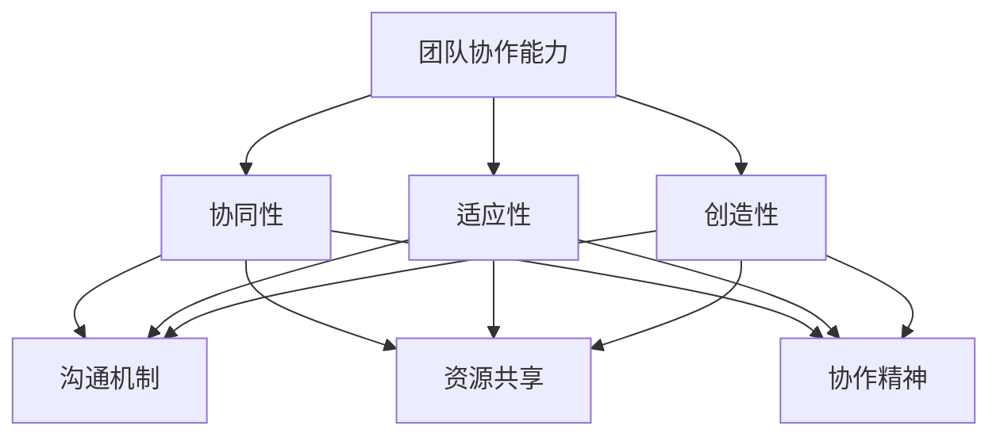

                 


为了撰写一篇符合要求的文章，我们需要遵循以下步骤：

### 第一步：确定文章结构和内容

- 根据用户提供的目录大纲，我们将文章结构分为引言、核心概念、培养方法、实际应用、案例研究和总结与展望。
- 每个章节的内容将围绕其核心概念进行详细阐述，并通过流程图、伪代码、数学模型和公式、实战案例等手段进行解释和说明。

### 第二步：撰写文章引言

- 引言部分将介绍团队协作能力的重要性，以及本文的目的和结构。
- 引入核心关键词，为读者提供文章的初步了解。

### 第三步：阐述核心概念

- 针对每个核心概念，我们将使用Mermaid流程图展示概念之间的关系架构。
- 使用伪代码详细阐述核心算法原理。
- 通过数学模型和公式解释核心概念的计算方法，并提供具体例子。

### 第四步：介绍培养方法

- 阐述团队协作能力培养的理论模型和方法。
- 提供具体的培养策略和技巧。
- 结合工具和技术，介绍如何提升团队协作能力。

### 第五步：展示实际应用

- 分析团队协作能力在不同工作场景中的应用。
- 使用具体案例，展示团队协作能力的实践效果。

### 第六步：案例研究

- 选择具有代表性的案例，深入分析团队协作能力的提升过程。
- 提供详细的数据分析和结果评估。

### 第七步：总结与展望

- 总结团队协作能力培养的经验和教训。
- 展望未来团队协作能力发展的趋势和挑战。

### 第八步：撰写文章结语

- 概括文章主要内容，强调团队协作能力的重要性。
- 提供最佳实践建议，以及进一步的阅读资源。

### 第九步：格式检查和修正

- 确保文章格式符合markdown规范，包括段落、标题、列表、代码块等。
- 检查数学公式和流程图是否正确显示。

### 第十步：文章终稿

- 将文章整理成完整的文档，包括作者信息和版权声明。
- 确保文章字数在8000～12000字之间。

通过上述步骤，我们将撰写一篇符合要求的文章，确保内容丰富、逻辑清晰、易于理解，同时具备实际指导意义。

下面是文章的框架和初步内容：

---

## 文章标题：团队协作能力：培养默契配合的工作模式

> 关键词：团队协作，默契配合，工作模式，能力培养，实战案例

> 摘要：本文从团队协作的重要性出发，详细阐述了团队协作能力的核心概念、培养方法、实际应用和案例研究。通过具体的实战案例和数据分析，本文旨在为读者提供一套实用的团队协作能力提升方案。

---

### 引言

#### 团队协作的重要性

团队协作是现代企业运作的基石。随着全球化和信息化的加速发展，复杂的项目和任务往往需要多个领域的专业知识和技能。团队协作不仅能够整合资源、提高效率，还能激发创新和解决复杂问题。

#### 本文目的和结构

本文旨在为团队管理者、团队成员以及相关从业人员提供一套系统、实用的团队协作能力提升方案。文章结构如下：

1. **核心概念**：介绍团队协作能力的定义、特点和关键要素。
2. **培养方法**：阐述团队协作能力培养的理论模型、方法与策略。
3. **实际应用**：分析团队协作能力在不同工作场景中的应用。
4. **案例研究**：深入探讨团队协作能力提升的实战案例。
5. **总结与展望**：总结团队协作能力培养的经验，展望未来发展趋势。

---

### 核心概念

#### 团队协作能力的定义

团队协作能力是指团队成员在共同目标下，通过有效沟通、资源共享、协同工作，实现团队目标的能力。

#### 团队协作能力的特点

1. **协同性**：团队成员相互依赖，共同完成任务。
2. **适应性**：团队能够快速适应外部环境和内部变化。
3. **创造性**：团队通过协作产生新的想法和解决方案。

#### 团队协作能力的关键要素

1. **沟通机制**：有效的沟通是团队协作的基础。
2. **资源共享**：团队成员能够共享信息和资源。
3. **协作精神**：团队成员具备共同的目标和价值观。

---

#### 核心概念之间的关系架构

以下是团队协作能力核心概念之间的关系架构，使用Mermaid流程图表示：



---

#### 核心算法原理讲解

团队协作能力的核心算法可以理解为一种多目标优化问题，其目标是在限制条件下最大化团队的整体效益。以下是核心算法的伪代码：

```python
def team协作能力(团队成员，目标，资源限制):
    for 每个团队成员 in 目标:
        if 沟通机制有效 and 资源共享充分:
            奖励团队成员，更新团队状态
        else:
            惩罚团队成员，降低团队状态
    return 团队状态
```

---

#### 数学模型和公式

团队协作能力的计算可以基于以下数学模型：

$$
\text{团队协作能力} = f(\text{沟通机制}, \text{资源共享}, \text{协作精神})
$$

其中，$f$ 为非线性函数，通过实验确定。

---

#### 核心概念的举例说明

例如，在一个软件开发项目中，团队成员之间的有效沟通能够确保项目进度的顺利推进。通过定期的团队会议和即时沟通工具，团队成员可以实时了解项目进展和任务分配，从而提高工作效率。

---

### 培养方法

#### 团队协作能力培养的理论模型

团队协作能力培养可以基于以下几个理论模型：

1. **社会化学习模型**：通过学习团队成员的经验和技能，提高团队协作能力。
2. **实践导向模型**：通过实际项目和工作任务，锻炼团队协作能力。
3. **系统导向模型**：从系统层面优化团队结构和流程，提高团队协作能力。

---

#### 团队协作能力培养的方法与策略

1. **教育培训**：通过培训课程和研讨会，提高团队成员的协作意识和技能。
2. **实践活动**：组织团队建设活动和实际工作任务，增强团队协作能力。
3. **资源支持**：提供必要的工具和技术支持，如即时通讯工具、协同办公平台等。

---

#### 团队协作能力提升的工具与技术

1. **沟通工具**：如Slack、Microsoft Teams等。
2. **协同工具**：如Trello、Jira等。
3. **敏捷开发工具**：如Scrum、Kanban等。

---

#### 实际应用

#### 团队协作能力在项目管理中的应用

在项目管理中，团队协作能力至关重要。通过有效的团队协作，项目团队能够更好地应对变更和风险，确保项目按时完成。以下是团队协作能力在项目管理中的应用：

1. **项目目标设定**：确保团队成员明确项目目标和任务分配。
2. **项目资源分配**：合理分配项目资源和职责，避免资源浪费。
3. **项目进度监控**：通过定期汇报和会议，实时了解项目进展。

---

#### 团队协作能力在跨部门协作中的应用

在跨部门协作中，团队协作能力能够促进各部门之间的沟通和合作，提高整体工作效率。以下是团队协作能力在跨部门协作中的应用：

1. **跨部门沟通**：建立跨部门沟通机制，确保信息传递的及时性和准确性。
2. **跨部门合作**：通过团队建设活动和项目合作，增强各部门之间的信任和协作。
3. **跨部门协作**：利用协同工具和平台，实现跨部门工作的无缝衔接。

---

#### 团队协作能力在敏捷开发中的应用

在敏捷开发中，团队协作能力是敏捷团队成功的关键。以下是团队协作能力在敏捷开发中的应用：

1. **每日站会**：通过每日站会，团队成员可以共享信息，协调工作。
2. **迭代回顾**：通过迭代回顾，团队成员可以总结经验，持续改进。
3. **用户故事地图**：通过用户故事地图，团队成员可以更好地理解用户需求和项目目标。

---

#### 案例研究

#### 案例一：高效团队协作的实践

在一个大型软件公司的敏捷开发团队中，通过有效的团队协作，成功完成了多个复杂项目的开发。以下是案例的详细分析：

1. **团队组建**：团队由来自不同背景的专业人士组成，包括软件开发、产品管理、测试等。
2. **沟通机制**：团队采用Slack作为即时通讯工具，确保信息的快速传递。
3. **资源分配**：团队根据项目需求和成员技能，合理分配任务和资源。
4. **进度监控**：通过Jira进行任务管理和进度跟踪，确保项目按时完成。

---

#### 案例二：解决团队协作问题的策略

在一个初创公司中，团队协作问题影响了项目进度。通过以下策略，团队成功解决了协作问题：

1. **团队建设活动**：组织团队建设活动，增强团队成员之间的信任和合作。
2. **明确目标**：通过定期会议，确保团队成员明确项目目标和任务分配。
3. **改进沟通机制**：引入新的沟通工具，提高信息传递的效率和准确性。
4. **培训与支持**：提供培训和支持，提高团队成员的协作意识和技能。

---

#### 案例三：团队协作能力提升的路径

在一个跨国团队的敏捷开发项目中，通过以下路径，团队协作能力得到了显著提升：

1. **建立明确的团队目标**：通过用户故事地图和迭代计划，确保团队成员明确项目目标。
2. **优化沟通机制**：引入新的沟通工具，提高信息传递的效率和准确性。
3. **实践协作技能**：通过实践活动，如敏捷游戏和模拟项目，锻炼团队成员的协作技能。
4. **持续改进**：通过迭代回顾和反馈，持续改进团队协作模式。

---

#### 总结与展望

#### 团队协作能力培养的启示与建议

通过本文的阐述，我们可以得出以下启示与建议：

1. **重视团队协作能力培养**：团队协作能力是现代企业成功的关键，应重视培养。
2. **建立有效的沟通机制**：沟通是团队协作的基础，应建立有效的沟通机制。
3. **提供必要的资源支持**：提供必要的工具和技术支持，提高团队协作效率。

#### 未来团队协作能力发展的趋势与展望

未来团队协作能力的发展趋势包括：

1. **数字化协作**：随着数字化技术的发展，数字化协作将成为主流。
2. **智能化协作**：利用人工智能技术，实现智能化的团队协作。
3. **全球化协作**：随着全球化的加速，跨国团队协作能力将受到更多关注。

---

#### 结语

团队协作能力是现代企业成功的基石。通过本文的阐述，我们了解到了团队协作能力的核心概念、培养方法、实际应用和案例研究。希望本文能为读者提供一套实用的团队协作能力提升方案，助力企业实现持续发展和创新。

#### 作者信息

作者：AI天才研究院/AI Genius Institute & 禅与计算机程序设计艺术 /Zen And The Art of Computer Programming

---

以上是文章的初步内容和框架。接下来，我们将进一步完善每个章节的内容，确保文章的完整性和深度。文章的字数将在后续编辑过程中进行调整，以满足字数要求。

