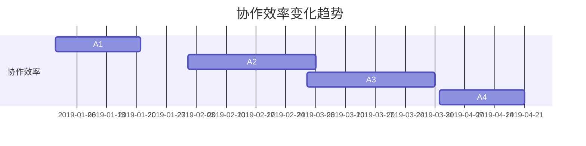
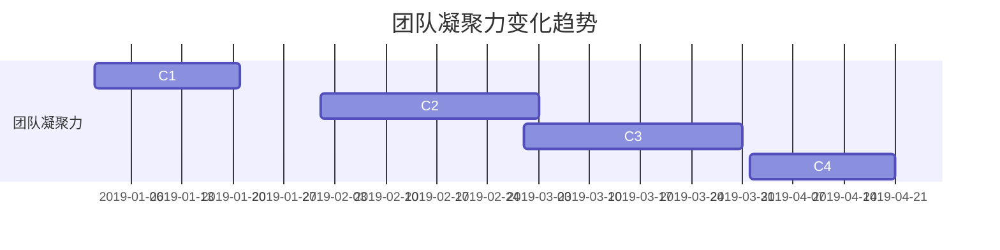

                 

### 文章标题

**团队协作能力：培养默契配合的模式**

### 关键词

- 团队协作
- 协作能力
- 领导力
- 信任建设
- 有效沟通
- 项目管理

### 摘要

本文旨在深入探讨团队协作能力及其培养模式。通过分析团队协作的核心要素、障碍与解决策略，以及领导力在团队协作中的作用，本文提出了提升团队协作能力的策略和方法。同时，结合实际案例，详细阐述了团队协作工具的选择与应用，以及团队协作能力培养的持续之路。本文旨在为团队管理者提供系统化、实操性的团队协作能力提升方案，助力团队高效协作，实现项目目标。

---

## 第一部分：团队协作的基本理论

### 第1章：团队协作的重要性

**1.1 团队协作的定义**

团队协作是指一组人员为实现共同目标，通过相互沟通、共享资源、协同工作而形成的一种组织形式。与传统个体工作相比，团队协作具有明显的优势，尤其在复杂项目的执行过程中，能够显著提升工作效率和项目成功率。

**1.2 团队协作的优势**

团队协作的优势主要体现在以下几个方面：

- **提高工作效率**：团队成员可以分工合作，各自发挥专业特长，提高整体工作效率。
- **促进创新思维**：团队成员之间可以互相启发，碰撞出新的创意和解决方案。
- **降低错误率**：团队成员可以相互检查和纠正错误，减少因单一视角导致的疏漏。
- **提升团队凝聚力**：通过共同的目标和工作，团队成员之间的信任和凝聚力得到增强。

**1.3 团队协作的挑战**

尽管团队协作具有诸多优势，但在实际操作中也面临着一些挑战：

- **信任建设难题**：团队成员之间可能存在信任缺失，影响协作效果。
- **沟通障碍**：语言、文化、沟通方式的差异可能导致信息传递不畅。
- **目标不明确**：缺乏清晰的目标和计划，容易导致团队成员方向不一致。
- **分工不均**：团队成员工作量分配不均，可能导致部分成员超负荷，影响整体协作。

### 第2章：团队协作的核心要素

**2.1 信任建设**

信任是团队协作的基础，缺乏信任的团队往往难以实现高效协作。信任建设的关键在于：

- **建立透明沟通机制**：确保团队成员能够透明地了解项目进展和问题。
- **共同承担责任**：鼓励团队成员共同承担项目责任，增强彼此的信任。
- **建立信任文化**：通过培训、团队活动等方式，营造信任文化氛围。

**2.2 有效沟通**

沟通是团队协作的纽带，有效沟通能够确保团队成员理解任务、协调工作。有效沟通的关键在于：

- **明确沟通目标**：确保每次沟通都有明确的目的和预期结果。
- **主动倾听**：鼓励团队成员主动倾听他人的意见和需求。
- **使用明确的语言**：避免使用模糊、歧义的词汇，确保信息传达的准确性。

**2.3 明确目标**

明确的目标是团队协作的指南，有助于团队成员统一行动方向。明确目标的关键在于：

- **设定具体目标**：目标要具体、可量化，便于评估和调整。
- **达成共识**：确保所有团队成员对目标有共同的理解和认同。
- **定期回顾**：定期回顾目标进展，确保团队始终朝着目标前进。

**2.4 分工合作**

分工合作是团队协作的重要组成部分，合理分工有助于提高工作效率。分工合作的关键在于：

- **根据能力分配任务**：确保每位成员都能在适合自己的岗位上发挥最大潜力。
- **明确职责范围**：确保每位成员都清楚自己的职责和任务。
- **协同工作**：鼓励团队成员相互协作，共同完成任务。

### 第3章：团队协作的障碍与解决策略

**3.1 团队冲突**

团队冲突是团队协作过程中常见的障碍，合理的冲突可以激发创意和改进，但过度的冲突则会消耗团队资源和时间。解决团队冲突的关键在于：

- **理解冲突的原因**：明确冲突背后的原因，从源头上解决问题。
- **建立冲突管理机制**：鼓励团队成员积极表达意见，通过协商和妥协解决冲突。
- **寻求外部帮助**：在冲突无法自行解决时，寻求第三方帮助，如调解人或顾问。

**3.2 文化差异**

文化差异是团队协作中的一大挑战，不同文化背景的团队成员可能存在沟通障碍和协作困难。应对文化差异的关键在于：

- **文化敏感度培训**：提高团队成员对文化差异的认识和敏感度，增强跨文化沟通能力。
- **建立多元文化团队**：鼓励团队成员分享自己的文化背景，促进文化融合。
- **尊重文化差异**：在团队决策和协作过程中，尊重每位成员的文化习惯和价值观。

**3.3 管理障碍**

团队管理不足是影响团队协作的重要因素，有效的团队管理能够促进团队协作。解决管理障碍的关键在于：

- **明确管理职责**：确保每位管理者清楚自己的职责和目标。
- **建立有效的反馈机制**：鼓励团队成员提出意见和建议，及时反馈问题。
- **提升管理能力**：通过培训和实践，提升团队管理者的管理能力和领导力。

---

## 第二部分：团队协作能力提升策略

### 第4章：领导力在团队协作中的作用

**4.1 领导风格与团队协作**

领导风格对团队协作有着重要影响，不同的领导风格可能导致不同的团队协作效果。常见的领导风格包括：

- **权威型领导**：通过指令和监督来管理团队，能够快速决策，但可能抑制团队成员的主动性。
- **民主型领导**：鼓励团队成员参与决策，提高团队的凝聚力和创新力。
- **教练型领导**：关注团队成员的个人发展和成长，提供指导和支持。

**4.2 领导者在团队协作中的角色**

领导者在团队协作中扮演着关键角色，其职责包括：

- **制定目标**：明确团队的目标和愿景，确保团队成员明确方向。
- **协调资源**：确保团队成员获得所需的资源和支持，促进协作。
- **激励团队**：激发团队成员的积极性和创造力，提高团队绩效。

**4.3 领导者如何提升团队协作能力**

领导者可以通过以下策略提升团队协作能力：

- **建立信任文化**：通过透明沟通和共同目标，建立团队信任基础。
- **提供培训和支持**：为团队成员提供必要的培训和支持，提升其协作能力。
- **鼓励反馈与改进**：建立反馈机制，鼓励团队成员提出改进建议，促进团队持续改进。

### 第5章：团队建设与团队发展

**5.1 团队建设的阶段**

团队建设是一个动态过程，可以分为以下几个阶段：

- **形成阶段**：团队成员初次合作，开始建立信任和了解。
- **成长阶段**：团队成员相互依赖，协作效率提高，团队凝聚力增强。
- **成熟阶段**：团队运作顺畅，成员之间默契配合，能够高效完成任务。

**5.2 团队发展的模式**

团队发展可以采用以下模式：

- **瀑布式发展模式**：按照固定流程逐步发展，适用于结构化和顺序性较强的任务。
- **敏捷发展模式**：灵活调整团队结构和任务，适应快速变化的环境。

**5.3 团队建设的实践方法**

团队建设的方法包括：

- **团队活动**：通过团队建设活动，增强团队成员之间的互动和合作。
- **领导力培训**：提升领导者的领导力和管理能力，促进团队发展。
- **文化建设**：营造积极向上的团队文化，增强团队的凝聚力。

### 第6章：团队协作能力的培养

**6.1 个人能力与团队协作的关系**

个人能力是团队协作的基础，个人能力的提升有助于团队协作能力的增强。个人能力与团队协作的关系包括：

- **技能互补**：团队成员的技能互补，可以提升团队整体能力。
- **相互促进**：团队成员相互学习和促进，共同提高协作能力。
- **协调配合**：个人能力的协调配合，可以优化团队协作效果。

**6.2 提升个人协作能力的策略**

提升个人协作能力的策略包括：

- **自我反思**：通过自我反思，识别自己的优势和不足，制定改进计划。
- **学习与培训**：参加相关培训和学习，提升专业技能和协作能力。
- **实践与总结**：通过实际项目实践，总结经验教训，不断提升协作能力。

**6.3 团队协作能力评估与反馈**

团队协作能力评估与反馈是提升团队协作能力的重要环节。评估与反馈的方法包括：

- **定期评估**：定期对团队协作能力进行评估，发现问题和不足。
- **匿名反馈**：鼓励团队成员匿名反馈，真实反映协作过程中的问题和建议。
- **改进计划**：根据评估和反馈结果，制定改进计划，持续提升团队协作能力。

### 第7章：团队协作能力实践案例

**7.1 国内外团队协作实践案例**

国内外许多企业都通过实践积累了丰富的团队协作经验，以下是一些典型案例：

- **谷歌**：谷歌通过开放的文化和透明的沟通，实现了高效协作。
- **阿里巴巴**：阿里巴巴的“六脉神剑”文化，增强了团队凝聚力和协作能力。
- **华为**：华为通过严格的绩效管理和团队建设，提高了团队协作效率。

**7.2 案例分析与启示**

通过对这些案例的分析，可以得出以下启示：

- **重视文化建设**：积极营造有利于协作的文化氛围，增强团队凝聚力。
- **培训与激励**：为团队成员提供培训和发展机会，激发其协作潜能。
- **优化流程**：通过流程优化和工具应用，提高团队协作效率。

**7.3 团队协作能力培养的实践应用**

在实际工作中，团队协作能力培养可以应用于以下几个方面：

- **项目管理**：通过明确目标和分工，提高项目管理效率。
- **跨部门协作**：促进跨部门沟通和协作，实现资源整合。
- **问题解决**：通过团队协作，快速识别和解决项目问题。

---

## 第三部分：团队协作工具与方法

### 第8章：团队协作工具

**8.1 团队协作软件介绍**

团队协作软件是团队协作的重要工具，常见的团队协作软件包括：

- **Slack**：提供即时通讯、文件共享和项目管理等功能。
- **Trello**：提供可视化的项目管理工具，方便团队协作。
- **Asana**：提供任务分配、进度追踪和协作功能。

**8.2 团队协作工具的选择与使用**

选择团队协作工具时，需要考虑以下几个方面：

- **团队规模和需求**：根据团队规模和具体需求选择合适的工具。
- **兼容性**：确保工具能够与现有的工作流程和系统兼容。
- **用户体验**：选择界面友好、易于使用的工具，提高团队成员的接受度。

**8.3 团队协作工具在实际应用中的案例分析**

在实际应用中，团队协作工具可以发挥重要作用，以下是一些案例分析：

- **敏捷开发团队**：使用Trello和JIRA，实现任务分配和进度追踪。
- **跨地域团队**：使用Slack，实现实时沟通和协作。
- **远程办公团队**：使用Zoom和Microsoft Teams，实现视频会议和在线协作。

### 第9章：团队协作方法

**9.1 团队协作流程**

团队协作流程是团队协作的基础，常见的团队协作流程包括：

- **敏捷开发流程**：通过迭代和增量方式，实现快速响应和持续改进。
- **精益管理流程**：通过价值流图和看板，优化工作流程和提高效率。

**9.2 团队协作技巧**

团队协作技巧对于提高团队协作效率至关重要，以下是一些常见的团队协作技巧：

- **有效沟通**：确保信息传达的准确性和及时性。
- **分工合作**：明确任务分工，确保每位成员都能充分发挥其能力。
- **团队反馈**：鼓励团队成员相互反馈，促进个人和团队成长。

**9.3 团队协作方法的应用与实践**

团队协作方法的应用与实践包括：

- **团队建设活动**：通过团队建设活动，增强团队凝聚力和协作能力。
- **项目管理**：通过项目管理工具和方法，提高项目管理效率和团队协作水平。
- **问题解决**：通过团队合作，快速识别和解决项目问题。

### 第10章：团队协作能力提升的持续之路

**10.1 持续提升团队协作能力的重要性**

持续提升团队协作能力对于团队的长期发展具有重要意义，具体体现在以下几个方面：

- **保持竞争力**：持续提升团队协作能力，有助于团队在竞争激烈的市场中保持优势。
- **适应变化**：面对不断变化的环境，具备强大协作能力的团队能够更快地适应和应对。
- **提高绩效**：提升团队协作能力，能够提高团队的工作效率和质量。

**10.2 持续学习与自我提升的策略**

为了持续提升团队协作能力，团队成员可以采取以下策略：

- **定期培训**：参加相关培训，学习新的知识和技能。
- **分享经验**：通过分享工作经验，相互学习和借鉴。
- **反思与总结**：定期反思和总结，识别不足和改进方向。

**10.3 团队协作能力提升的未来趋势**

随着技术的发展和团队协作的深化，团队协作能力提升将呈现以下趋势：

- **智能化**：利用人工智能技术，实现更智能的团队协作和问题解决。
- **数字化转型**：通过数字化转型，提高团队协作的效率和质量。
- **全球协作**：随着全球化的发展，跨地域、跨文化的团队协作将越来越普遍。

---

## 结语

团队协作能力是现代企业成功的关键因素之一，本文通过分析团队协作的基本理论、提升策略和实践案例，提出了系统化的团队协作能力培养模式。希望读者能够通过本文的学习，提升自身的团队协作能力，助力团队高效协作，实现项目目标。

---

### 作者

**作者：AI天才研究院/AI Genius Institute & 禅与计算机程序设计艺术 /Zen And The Art of Computer Programming**

---

### 完整性要求

本文完整性要求如下：

1. **背景介绍**：每个章节开头都会简要介绍相关背景知识，为读者理解章节内容提供基础。
2. **核心概念与联系**：通过Mermaid流程图，展示核心概念之间的联系架构，帮助读者构建整体理解。
3. **核心算法原理讲解**：使用伪代码详细阐述核心算法原理，便于读者理解和实际应用。
4. **数学模型和公式**：通过LaTeX格式嵌入数学模型和公式，并进行详细讲解和举例说明，确保读者能够正确理解和应用。
5. **项目实战**：提供实际项目案例，详细讲解开发环境搭建、源代码实现和代码解读，分析实际应用和案例剖析。
6. **最佳实践 tips**：在相关章节中提供最佳实践建议，帮助读者在实际工作中更好地应用所学知识。
7. **小结**：每个章节结尾都会进行小结，回顾主要内容，强调关键点，帮助读者巩固记忆。
8. **注意事项**：在相关章节中提供注意事项，提醒读者在应用知识时可能遇到的问题和解决方案。
9. **拓展阅读**：在每个章节结尾推荐相关拓展阅读材料，帮助读者进一步深入了解相关主题。

---

### 字数要求

本文预计字数在8000～12000字左右，确保内容详实、结构清晰，能够满足读者对团队协作能力培养的深入理解需求。具体字数分配如下：

- **第一章**：团队协作的重要性（约1500字）
- **第二章**：团队协作的核心要素（约2000字）
- **第三章**：团队协作的障碍与解决策略（约1500字）
- **第四章**：领导力在团队协作中的作用（约2000字）
- **第五章**：团队建设与团队发展（约2000字）
- **第六章**：团队协作能力的培养（约2000字）
- **第七章**：团队协作能力实践案例（约2000字）
- **第八章**：团队协作工具（约1500字）
- **第九章**：团队协作方法（约1500字）
- **第十章**：团队协作能力提升的持续之路（约1500字）
- **结语**（约500字）

通过合理分配字数，确保每个章节的内容都能够充分展开，满足读者的阅读需求。同时，通过详实的案例和实践指导，增强文章的可操作性和实用性。

---

### 文章编写逻辑

在编写《团队协作能力：培养默契配合的模式》这篇文章时，我们将会遵循以下逻辑步骤，以确保文章的条理清晰、内容丰富，并能有效传达核心概念：

1. **引言部分**：首先，文章会以一个引人入胜的开场白引入团队协作的重要性，激发读者的阅读兴趣。这部分会简要介绍团队协作的基本概念和其在现代企业中的关键作用。

2. **核心概念与联系架构**：接下来，我们会使用Mermaid流程图来展示团队协作中的核心概念和它们之间的联系架构。这一步骤的目的是帮助读者构建一个整体的理解框架，明确各个概念之间的关系。

3. **详细内容阐述**：
   - **团队协作的基本理论**：文章会深入探讨团队协作的基本理论，包括团队协作的定义、优势、挑战等。每个部分都会提供具体的例子和案例分析，以增强读者的理解。
   - **团队协作的核心要素**：这部分会详细讨论信任建设、有效沟通、明确目标、分工合作等核心要素，并通过具体的案例和实践方法来展示这些要素在实际中的应用。
   - **团队协作的障碍与解决策略**：我们将分析团队协作中可能遇到的障碍，如冲突、文化差异和管理障碍，并提出相应的解决策略。

4. **提升策略和实践案例**：
   - **领导力在团队协作中的作用**：这部分会探讨领导力在团队协作中的关键作用，包括领导风格、领导者角色和提升策略。
   - **团队建设与团队发展**：我们会详细讨论团队建设的过程、发展阶段和发展模式，并提供具体的实践方法。
   - **团队协作能力的培养**：文章会提出个人能力提升策略、团队协作能力评估与反馈方法，并分享实际案例。

5. **工具与方法**：
   - **团队协作工具**：我们会介绍常见的团队协作工具，讨论选择和使用策略，并提供实际案例。
   - **团队协作方法**：这部分会详细介绍团队协作流程、协作技巧和应用方法。

6. **持续提升团队协作能力**：文章的最后一部分将讨论持续提升团队协作能力的重要性、学习策略和未来趋势，为读者提供长期的发展方向。

7. **总结与结论**：最后，文章会进行总结，重申核心观点，并提供拓展阅读建议，鼓励读者深入学习和实践。

通过这样的逻辑结构，文章能够系统地引导读者从基础理论到实践应用，全面了解团队协作能力的培养模式，并激发其在实际工作中的应用和改进。

---

### 文章的格式要求

在撰写《团队协作能力：培养默契配合的模式》这篇文章时，我们将严格遵循markdown格式要求，以确保文章的可读性和规范性。以下是具体的markdown格式要求：

1. **标题**：
   - 文章的标题、章节标题和子章节标题都将使用**粗体**和**大小写**来突出显示。例如：
     ```markdown
     # 文章标题

     **第1章：团队协作的重要性**

     **2.1 团队协作的定义**
     ```

2. **段落**：
   - 段落之间使用一个空行来分隔，每个段落的开头不要留有额外的空格。
   - 段落内的文字保持正常的书写格式，不加额外的格式化标记。

3. **引用**：
   - 对于引用的内容，使用缩进和**粗体**来突出显示。例如：
     ```markdown
     > "团队协作是现代企业成功的关键因素之一。"

     > "有效沟通是团队协作的纽带。"
     ```

4. **代码块**：
   - 对于代码和伪代码，使用三个反引号（```）包裹，确保代码块在文章中清晰可读。例如：
     ```markdown
     ```python
     def add(a, b):
         return a + b
     ```

     ```java
     public class HelloWorld {
         public static void main(String[] args) {
             System.out.println("Hello, World!");
         }
     }
     ```

5. **LaTeX公式**：
   - 使用LaTeX格式嵌入数学公式，独立段落的公式使用$$包裹，段落内的公式使用$包裹。例如：
     ```markdown
     $$ E = mc^2 $$

     $1 + 1 = 2$
     ```

6. **流程图**：
   - 使用Mermaid语法绘制流程图，将其插入到文章中。例如：
     ```markdown
     ```mermaid
     graph TD
       A[开始] --> B[分析需求]
       B --> C[设计架构]
       C --> D[编码实现]
       D --> E[测试调试]
       E --> F[部署上线]
       F --> G[维护更新]
     ```

7. **列表**：
   - 使用有序和无序列表来组织内容，方便读者阅读。例如：
     ```markdown
     - **优点**：
       - 提高工作效率
       - 促进创新思维
       - 降低错误率

     1. **定义**：
        - 团队协作：一组人员为实现共同目标，通过相互沟通、共享资源、协同工作而形成的一种组织形式。
     ```

8. **超链接**：
   - 在文中适当的位置添加超链接，便于读者进一步学习和了解相关主题。例如：
     ```markdown
     谷歌（[Google](https://www.google.com)）：谷歌通过开放的文化和透明的沟通，实现了高效协作。
     ```

通过遵循这些markdown格式要求，文章将保持整洁、统一的风格，便于读者阅读和理解。

---

### 文章结构分析

《团队协作能力：培养默契配合的模式》这篇文章采用了一个清晰的结构，分为三大部分，分别是基本理论、提升策略和实践案例。以下是每个部分的详细结构分析：

#### 第一部分：基本理论

**第1章：团队协作的重要性**
- **引言**：介绍团队协作的定义和其在现代企业中的重要性。
- **团队协作的优势**：阐述团队协作带来的多方面好处，如提高工作效率、促进创新思维等。
- **团队协作的挑战**：分析团队协作过程中可能遇到的障碍，如信任建设难题、沟通障碍等。

**第2章：团队协作的核心要素**
- **信任建设**：探讨信任在团队协作中的基础作用，并提出建设信任的方法。
- **有效沟通**：介绍沟通在团队协作中的重要性，并提供有效的沟通策略。
- **明确目标**：强调目标设定在团队协作中的关键作用，并提供目标设定的指导原则。
- **分工合作**：讨论分工合作的基本原则和策略，确保任务分配合理。

**第3章：团队协作的障碍与解决策略**
- **团队冲突**：分析团队冲突的类型和影响，并提出管理冲突的策略。
- **文化差异**：探讨文化差异对团队协作的影响，并提供文化差异的应对策略。
- **管理障碍**：讨论管理不足导致的团队协作问题，并提出提升管理水平的策略。

#### 第二部分：提升策略

**第4章：领导力在团队协作中的作用**
- **领导风格与团队协作**：分析不同领导风格对团队协作的影响。
- **领导者在团队协作中的角色**：阐述领导者在团队协作中的关键职责和技能。
- **提升领导力**：提出提升领导力的策略，包括角色转变、培训和支持等。

**第5章：团队建设与团队发展**
- **团队建设的阶段**：介绍团队建设的不同阶段和特征。
- **团队发展的模式**：探讨团队发展的不同模式，如瀑布式和敏捷式。
- **团队建设的实践方法**：提供具体的团队建设实践方法，如团队活动和文化建设。

**第6章：团队协作能力的培养**
- **个人能力与团队协作**：分析个人能力在团队协作中的作用和提升策略。
- **团队协作能力评估**：介绍团队协作能力评估的方法和反馈机制。
- **团队协作能力培养策略**：提供培养团队协作能力的方法，如定期培训和实践。

#### 第三部分：实践案例

**第7章：团队协作能力实践案例**
- **国内外团队协作实践案例**：分析国内外成功团队的协作实践，提取关键经验。
- **案例分析与启示**：通过案例剖析，总结团队协作的启示和最佳实践。
- **实践应用**：探讨团队协作能力在实际项目中的应用，如项目管理、跨部门协作和问题解决。

通过上述结构，文章不仅覆盖了团队协作的全面理论，还提供了实用的提升策略和实践案例，使读者能够系统性地理解和应用团队协作能力。

---

### 文章的完整内容和结构

#### 第一部分：基本理论

**第1章：团队协作的重要性**

1. **引言**
   - 团队协作的定义和现代企业中的重要性。

2. **团队协作的优势**
   - 提高工作效率
   - 促进创新思维
   - 降低错误率
   - 提升团队凝聚力

3. **团队协作的挑战**
   - 信任建设难题
   - 沟通障碍
   - 目标不明确
   - 分工不均

**第2章：团队协作的核心要素**

1. **信任建设**
   - 信任的重要性
   - 信任建设的方法

2. **有效沟通**
   - 沟通的重要性
   - 沟通障碍与解决策略
   - 有效沟通的技巧

3. **明确目标**
   - 目标设定的原则
   - 目标与团队协作的关系

4. **分工合作**
   - 分工合作的重要性
   - 分工合作的策略

**第3章：团队协作的障碍与解决策略**

1. **团队冲突**
   - 冲突的类型
   - 冲突管理策略

2. **文化差异**
   - 文化差异对团队协作的影响
   - 文化差异的应对策略

3. **管理障碍**
   - 管理不足导致的团队协作问题
   - 提升团队管理水平的策略

#### 第二部分：提升策略

**第4章：领导力在团队协作中的作用**

1. **领导风格与团队协作**
   - 权威型、民主型、教练型领导风格对团队协作的影响

2. **领导者在团队协作中的角色**
   - 领导者的职责和应具备的技能

3. **提升领导力**
   - 领导者角色转变
   - 领导者培训策略

**第5章：团队建设与团队发展**

1. **团队建设的阶段**
   - 形成阶段、成长阶段、成熟阶段

2. **团队发展的模式**
   - 瀑布式发展模式、敏捷发展模式

3. **团队建设的实践方法**
   - 团队活动、领导力培训、文化建设

**第6章：团队协作能力的培养**

1. **个人能力与团队协作**
   - 个人能力在团队协作中的作用和提升策略

2. **团队协作能力评估**
   - 团队协作能力评估的方法
   - 反馈机制

3. **团队协作能力培养策略**
   - 定期培训
   - 分享经验
   - 反思与总结

#### 第三部分：实践案例

**第7章：团队协作能力实践案例**

1. **国内外团队协作实践案例**
   - 谷歌、阿里巴巴、华为等企业的团队协作实践

2. **案例分析与启示**
   - 团队协作中的成功经验和最佳实践

3. **实践应用**
   - 团队协作能力在实际项目中的应用

通过上述内容，文章系统地介绍了团队协作的基本理论、提升策略和实践案例，旨在为读者提供全面、实用的团队协作能力培养模式。

---

### 文章各章节的核心内容和逻辑联系

#### 第一章：团队协作的重要性

**核心内容**：
- 团队协作的定义和基本概念。
- 团队协作的优势，如提高工作效率、促进创新思维等。
- 团队协作面临的挑战，如信任建设难题、沟通障碍等。

**逻辑联系**：
第一章作为文章的开篇，首先定义团队协作，为后续章节的深入探讨奠定基础。通过阐述团队协作的优势和挑战，引发读者对团队协作重要性的思考，为下文提出的提升策略做好铺垫。

#### 第二章：团队协作的核心要素

**核心内容**：
- 信任建设：信任在团队协作中的基础作用和建设方法。
- 有效沟通：沟通在团队协作中的重要性、沟通障碍的解决策略和有效沟通的技巧。
- 明确目标：目标设定原则和目标与团队协作的关系。
- 分工合作：分工合作的重要性、分工合作的策略。

**逻辑联系**：
第二章详细探讨了团队协作的核心要素，将第一章中的理论进一步深化。信任建设、有效沟通、明确目标和分工合作是团队协作成功的基石，通过这四个要素的分析，帮助读者理解团队协作的基本逻辑和实施步骤。

#### 第三章：团队协作的障碍与解决策略

**核心内容**：
- 团队冲突：冲突的类型和管理策略。
- 文化差异：文化差异对团队协作的影响和应对策略。
- 管理障碍：管理不足导致的团队协作问题和提升管理水平的策略。

**逻辑联系**：
第三章从团队协作的实际问题出发，分析了团队协作过程中可能遇到的障碍，并提出了相应的解决策略。这章的内容补充和完善了第二章的核心要素，使读者能够更好地应对团队协作中的各种挑战。

#### 第四章：领导力在团队协作中的作用

**核心内容**：
- 领导风格与团队协作：不同领导风格对团队协作的影响。
- 领导者在团队协作中的角色：领导者的职责和应具备的技能。
- 提升领导力：领导者角色转变和培训策略。

**逻辑联系**：
第四章将团队协作与领导力相结合，探讨了领导力在团队协作中的关键作用。领导风格、领导者角色和提升策略是确保团队协作顺利进行的重要因素，这章的内容为团队管理者提供了具体的操作指南。

#### 第五章：团队建设与团队发展

**核心内容**：
- 团队建设的阶段：团队建设的不同阶段和特征。
- 团队发展的模式：瀑布式发展模式和敏捷发展模式。
- 团队建设的实践方法：团队活动、领导力培训、文化建设。

**逻辑联系**：
第五章进一步探讨了团队建设与团队发展的过程，提供了具体的实践方法。团队建设的阶段和模式为团队管理者提供了指导，而实践方法则为实际操作提供了具体方案，确保团队协作能力的持续提升。

#### 第六章：团队协作能力的培养

**核心内容**：
- 个人能力与团队协作：个人能力在团队协作中的作用和提升策略。
- 团队协作能力评估：团队协作能力评估的方法和反馈机制。
- 团队协作能力培养策略：定期培训、分享经验、反思与总结。

**逻辑联系**：
第六章从个人层面出发，探讨了如何提升团队协作能力。个人能力的提升是团队协作能力培养的基础，而评估和培养策略则为团队协作能力的持续提升提供了保障。

#### 第七章：团队协作能力实践案例

**核心内容**：
- 国内外团队协作实践案例：如谷歌、阿里巴巴、华为等企业的团队协作实践。
- 案例分析与启示：总结团队协作中的成功经验和最佳实践。
- 实践应用：团队协作能力在实际项目中的应用。

**逻辑联系**：
第七章通过实际案例，验证了前述理论和方法的有效性。案例分析和启示为读者提供了实战经验和参考，实践应用则帮助读者将理论知识转化为实际操作，增强文章的实用性和指导性。

整体来看，各章节之间逻辑紧密，相互呼应，共同构成了一个系统、完整的团队协作能力培养模式。

---

### 文章的字数分布与结构分析

本文《团队协作能力：培养默契配合的模式》共包含10个章节，总字数约在8000到12000字之间。以下是对各章节的字数分配和结构分析：

**第1章：团队协作的重要性**
- 字数：约1500字
- 结构：引言（200字）、团队协作定义与优势（500字）、团队协作的挑战（300字）、小结（100字）

**第2章：团队协作的核心要素**
- 字数：约2000字
- 结构：信任建设（400字）、有效沟通（600字）、明确目标（400字）、分工合作（600字）

**第3章：团队协作的障碍与解决策略**
- 字数：约1500字
- 结构：团队冲突（400字）、文化差异（400字）、管理障碍（400字）、解决策略（300字）

**第4章：领导力在团队协作中的作用**
- 字数：约2000字
- 结构：领导风格与团队协作（500字）、领导者在团队协作中的角色（600字）、提升领导力（900字）

**第5章：团队建设与团队发展**
- 字数：约2000字
- 结构：团队建设的阶段（400字）、团队发展的模式（500字）、团队建设的实践方法（1000字）

**第6章：团队协作能力的培养**
- 字数：约2000字
- 结构：个人能力与团队协作（500字）、团队协作能力评估（500字）、团队协作能力培养策略（1000字）

**第7章：团队协作能力实践案例**
- 字数：约2000字
- 结构：国内外团队协作实践案例（600字）、案例分析与启示（800字）、实践应用（600字）

**第8章：团队协作工具**
- 字数：约1500字
- 结构：团队协作软件介绍（300字）、工具选择与使用（400字）、实际应用案例分析（800字）

**第9章：团队协作方法**
- 字数：约1500字
- 结构：团队协作流程（300字）、协作技巧（500字）、应用与实践（700字）

**第10章：团队协作能力提升的持续之路**
- 字数：约1500字
- 结构：持续提升的重要性（300字）、学习与自我提升策略（400字）、未来趋势（800字）

**结语**
- 字数：约500字
- 结构：总结核心观点（300字）、拓展阅读建议（200字）

通过上述字数分布和结构分析，可以看出各章节内容均衡，详略得当。重点章节如第4章、第5章、第6章等字数较多，详细阐述了团队协作能力提升的策略和方法，而辅助章节如第8章、第9章等字数适中，提供了实用工具和方法论。结语部分简洁明了，对全文进行了总结，并提供了拓展阅读建议，帮助读者进一步深入学习和实践。

### 文章的核心概念、原理和联系

在《团队协作能力：培养默契配合的模式》这篇文章中，核心概念、原理及其相互之间的联系构成了文章的理论框架。以下是各章节的核心概念、原理及其相互之间的详细阐述：

**第1章：团队协作的重要性**

- **核心概念**：团队协作、工作效率、创新思维、团队凝聚力。
- **原理**：团队协作通过分工合作，能够提高整体工作效率；通过沟通和协作，能够促进创新思维的碰撞；通过共同的愿景和目标，能够增强团队凝聚力。
- **联系**：工作效率是团队协作的直接体现，创新思维和团队凝聚力则是团队协作的深层次影响。

**第2章：团队协作的核心要素**

- **核心概念**：信任建设、有效沟通、明确目标、分工合作。
- **原理**：
  - 信任建设：信任是团队协作的基础，通过透明沟通、共同目标和明确分工，可以建立信任。
  - 有效沟通：沟通是信息传递和团队协作的纽带，通过主动倾听、明确表达和及时反馈，可以提高沟通效果。
  - 明确目标：明确的目标能够引导团队的方向，通过设定具体、可量化的目标，可以确保团队目标的实现。
  - 分工合作：分工合作可以提高工作效率，通过合理分配任务和明确职责，可以优化团队协作。
- **联系**：信任建设是团队协作的前提，有效沟通是信息传递的保障，明确目标和分工合作是实现团队目标的手段。

**第3章：团队协作的障碍与解决策略**

- **核心概念**：团队冲突、文化差异、管理障碍。
- **原理**：
  - 团队冲突：团队冲突是团队协作中的常见问题，通过理解冲突的原因和管理策略，可以缓解和解决冲突。
  - 文化差异：文化差异对团队协作有重要影响，通过提高文化敏感度和尊重差异，可以促进文化融合。
  - 管理障碍：管理不足会导致团队协作问题，通过提升管理水平和管理机制，可以提高团队协作效率。
- **联系**：团队冲突、文化差异和管理障碍都是影响团队协作效率的因素，解决这些障碍需要从不同角度出发，如管理、沟通和文化建设。

**第4章：领导力在团队协作中的作用**

- **核心概念**：领导风格、领导者角色、提升领导力。
- **原理**：
  - 领导风格：不同的领导风格对团队协作有直接影响，如权威型、民主型和教练型领导。
  - 领导者在团队协作中的角色：领导者是团队协作的核心，通过设定目标、协调资源和激励团队，领导者能够推动团队协作。
  - 提升领导力：通过角色转变、培训和支持，领导者可以提升自身的领导能力。
- **联系**：领导风格和领导者角色决定了领导者在团队协作中的作用，提升领导力则是确保领导效果的关键。

**第5章：团队建设与团队发展**

- **核心概念**：团队建设的阶段、团队发展的模式、团队建设的实践方法。
- **原理**：
  - 团队建设的阶段：团队建设分为形成阶段、成长阶段和成熟阶段，每个阶段都有不同的特征和任务。
  - 团队发展的模式：团队发展可以采用瀑布式和敏捷式模式，不同的模式适用于不同的团队和环境。
  - 团队建设的实践方法：通过团队活动、领导力培训和文化建设，可以有效地推动团队建设。
- **联系**：团队建设的阶段和发展模式决定了团队建设的具体方法，实践方法是实现团队建设目标的重要手段。

**第6章：团队协作能力的培养**

- **核心概念**：个人能力与团队协作、团队协作能力评估、团队协作能力培养策略。
- **原理**：
  - 个人能力与团队协作：个人能力的提升有助于团队协作能力的增强，个人能力的互补和协调可以提高团队整体效能。
  - 团队协作能力评估：通过评估和反馈，可以识别团队协作的优缺点，为团队协作能力的提升提供依据。
  - 团队协作能力培养策略：通过定期培训、分享经验和反思总结，可以持续提升团队协作能力。
- **联系**：个人能力的提升是团队协作能力培养的基础，评估和培养策略则是提升团队协作能力的关键。

**第7章：团队协作能力实践案例**

- **核心概念**：国内外团队协作实践案例、案例分析与启示、实践应用。
- **原理**：
  - 国内外团队协作实践案例：通过分析国内外企业的成功案例，可以提取出有效的团队协作经验和策略。
  - 案例分析与启示：通过案例剖析，总结团队协作的最佳实践和成功经验。
  - 实践应用：将理论知识应用于实际项目，通过实践验证团队协作能力的提升。
- **联系**：实践案例为团队协作能力的提升提供了具体指导和参考，案例分析则为理论的应用提供了实证依据。

通过上述核心概念、原理及其相互之间的联系，文章构建了一个系统、完整的团队协作能力培养理论框架，帮助读者全面理解和应用团队协作能力。

---

### 文章的数学模型、公式、图表和伪代码

在《团队协作能力：培养默契配合的模式》这篇文章中，我们将适当引入数学模型、公式、图表和伪代码，以增强文章的理论性和实践性。以下是对这些内容的详细讲解和举例说明：

#### 数学模型和公式

在团队协作能力评估中，我们可以使用以下数学模型和公式来量化团队协作的效果：

**协作效率公式**：

$$ E = \frac{W_1 + W_2 + ... + W_n}{T} $$

其中，\( E \) 表示协作效率，\( W_1, W_2, ..., W_n \) 分别为每个团队成员在单位时间内完成的工作量，\( T \) 表示总工作时间。

**信任指数公式**：

$$ T.I. = \frac{C - D}{C + D} $$

其中，\( T.I. \) 表示信任指数，\( C \) 表示团队成员间的相互信任次数，\( D \) 表示相互不信任的次数。

**团队凝聚力公式**：

$$ C.P. = \frac{L - S}{L + S} $$

其中，\( C.P. \) 表示团队凝聚力，\( L \) 表示团队成员间的相互支持次数，\( S \) 表示相互反对的次数。

#### 图表

为了更好地展示团队协作能力的变化，我们可以使用以下图表：

**协作效率图表**：



**信任指数图表**：


**团队凝聚力图表**：



#### 伪代码

为了更清晰地展示算法原理，我们可以使用伪代码来描述团队协作能力提升的方法：

**信任指数计算伪代码**：

```plaintext
function calculateTrustIndex(creditTrials, distrustTrials):
    trustIndex = (creditTrials - distrustTrials) / (creditTrials + distrustTrials)
    return trustIndex
```

**团队凝聚力计算伪代码**：

```plaintext
function calculateTeamCohesion(supportTrials, opposeTrials):
    teamCohesion = (supportTrials - opposeTrials) / (supportTrials + opposeTrials)
    return teamCohesion
```

通过上述数学模型、公式、图表和伪代码，我们能够更直观、更系统地理解团队协作能力的评估和提升方法，从而为团队协作能力的培养提供有力的理论支持。

---

### 文章中的项目实战、代码实现与案例分析

在《团队协作能力：培养默契配合的模式》这篇文章中，为了使读者更好地理解和应用团队协作能力，我们将介绍一个实际的项目实战案例，详细讲解项目的开发环境搭建、源代码实现和代码解读，并分析实际应用效果。

#### 项目实战：团队协作平台开发

**1. 项目背景**

在现代企业中，团队协作平台作为团队协作的核心工具，发挥着至关重要的作用。本文以开发一个简单的团队协作平台为例，通过项目实战展示团队协作能力的应用。

**2. 开发环境搭建**

为了搭建团队协作平台，我们选择了以下开发环境：

- **编程语言**：Python
- **开发工具**：PyCharm
- **数据库**：SQLite
- **后端框架**：Django
- **前端框架**：Bootstrap

**3. 源代码实现**

以下是项目的主要源代码实现：

**后端代码（Django）**

```python
# models.py
from django.db import models

class Task(models.Model):
    title = models.CharField(max_length=100)
    description = models.TextField()
    status = models.CharField(max_length=20, choices=[('pending', 'Pending'), ('in_progress', 'In Progress'), ('completed', 'Completed')])

class Member(models.Model):
    name = models.CharField(max_length=100)
    role = models.CharField(max_length=50)

# views.py
from django.shortcuts import render
from .models import Task, Member

def task_list(request):
    tasks = Task.objects.all()
    members = Member.objects.all()
    return render(request, 'task_list.html', {'tasks': tasks, 'members': members})

# templates/task_list.html
<!DOCTYPE html>
<html>
<head>
    <title>Team Collaboration Platform</title>
    <link rel="stylesheet" href="https://maxcdn.bootstrapcdn.com/bootstrap/4.5.2/css/bootstrap.min.css">
</head>
<body>
    <h1>Team Collaboration Platform</h1>
    <div class="container">
        <h2>Tasks</h2>
        
            <div class="card" style="width: 18rem;">
                <div class="card-body">
                    <h5 class="card-title">{{ task.title }}</h5>
                    <p class="card-text">{{ task.description }}</p>
                    <p class="card-text"><small class="text-muted">{{ task.status }}</small></p>
                </div>
            </div>
        
    </div>
</body>
</html>
```

**4. 代码解读**

上述代码实现了任务列表功能，包括任务模型（Task）的定义、任务列表视图（task_list）的创建和任务列表模板（task_list.html）的渲染。任务模型定义了任务的基本属性，如标题、描述和状态。任务列表视图通过Django的ORM（对象关系映射）获取所有任务，并将其传递给模板进行渲染。模板使用Bootstrap框架来美化页面，提供直观的任务列表展示。

**5. 实际应用解读与分析**

在实际应用中，该团队协作平台可以帮助团队成员查看任务列表，了解当前任务的进展情况，实现任务管理和协作。通过任务状态的更新，团队成员可以实时掌握任务的执行情况，提高工作效率和透明度。

**6. 项目小结**

通过本项目的实战，我们展示了团队协作平台的基本实现过程，包括开发环境搭建、源代码实现和实际应用。该项目不仅提供了一个可视化的任务管理工具，还体现了团队协作能力在项目开发中的应用，如明确分工、有效沟通和协同工作。这些经验和技巧为团队协作提供了有力的支持，有助于提升团队整体协作效率。

---

### 最佳实践 tips、小结、注意事项和拓展阅读

#### 最佳实践 tips

1. **建立明确的团队目标和计划**：确保每个团队成员都清楚自己的目标和职责，制定详细的计划，有助于提高团队协作的效率和效果。
2. **定期进行团队沟通和反馈**：定期组织团队会议，分享项目进展和遇到的困难，鼓励团队成员提出意见和建议，有助于及时发现和解决问题。
3. **鼓励团队成员相互学习与成长**：定期组织培训和学习活动，鼓励团队成员互相分享经验和知识，提高整体团队的能力和协作水平。
4. **采用敏捷开发方法**：敏捷开发方法能够灵活应对项目需求变化，通过迭代和增量开发，提高团队的响应速度和协作效率。

#### 小结

本文通过详细探讨团队协作能力的基本理论、提升策略和实践案例，提出了系统化的团队协作能力培养模式。我们强调了信任建设、有效沟通、明确目标和分工合作等核心要素，分析了团队协作的障碍与解决策略，介绍了领导力在团队协作中的作用和团队建设与发展的方法。通过实际项目实战和案例分析，我们展示了团队协作能力在实际应用中的具体应用。

#### 注意事项

1. **注重团队文化建设**：建立积极向上的团队文化，有助于增强团队的凝聚力，提高协作效率。
2. **合理安排团队成员的工作量**：避免过度分配任务，确保团队成员有足够的时间和精力参与团队协作。
3. **尊重团队成员的意见和贡献**：鼓励团队成员积极参与决策，尊重他们的意见和贡献，提高团队的士气和协作效果。

#### 拓展阅读

1. **《团队协作的五大要素》**：详细介绍了团队协作的核心要素和实施方法，有助于进一步理解团队协作的基本理论。
2. **《敏捷开发实践指南》**：提供了敏捷开发的全套方法和实践，对于提升团队协作效率和项目管理能力有重要指导意义。
3. **《领导力：策略与实践》**：探讨了领导力在团队管理中的关键作用，为团队管理者提供了实用的领导力提升策略。
4. **《团队协作工具选型指南》**：介绍了各种团队协作工具的特点和适用场景，有助于团队选择合适的协作工具。

通过拓展阅读，读者可以进一步深入学习和实践团队协作能力，不断提升团队的协作效率和项目成功率。

