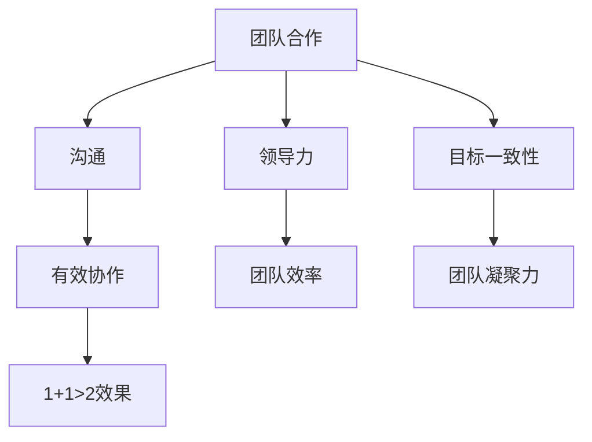
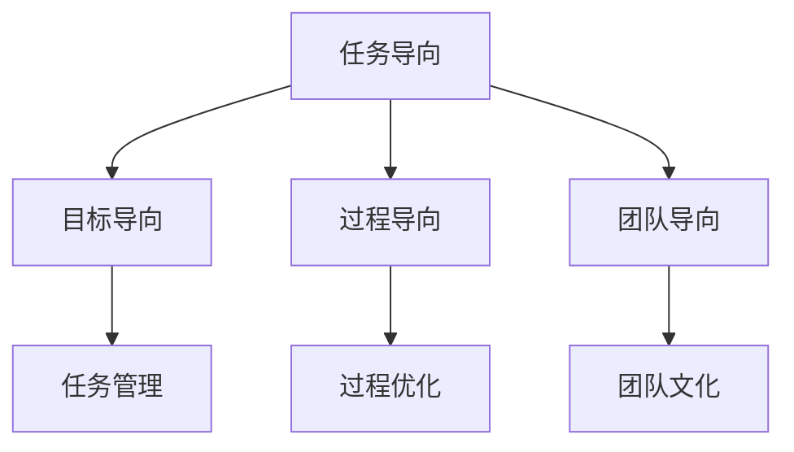
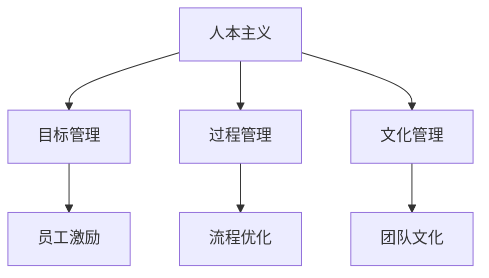
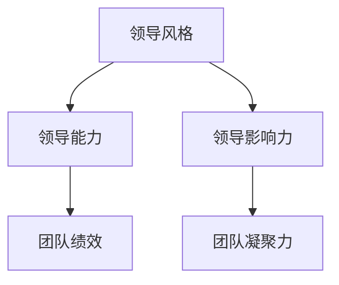
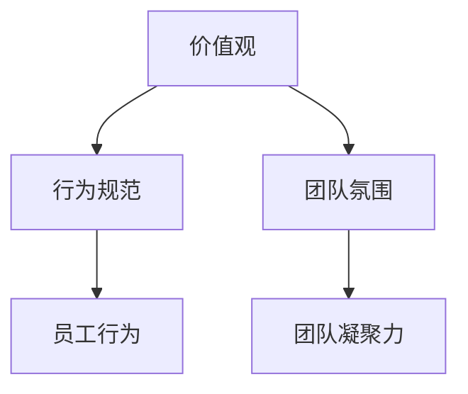
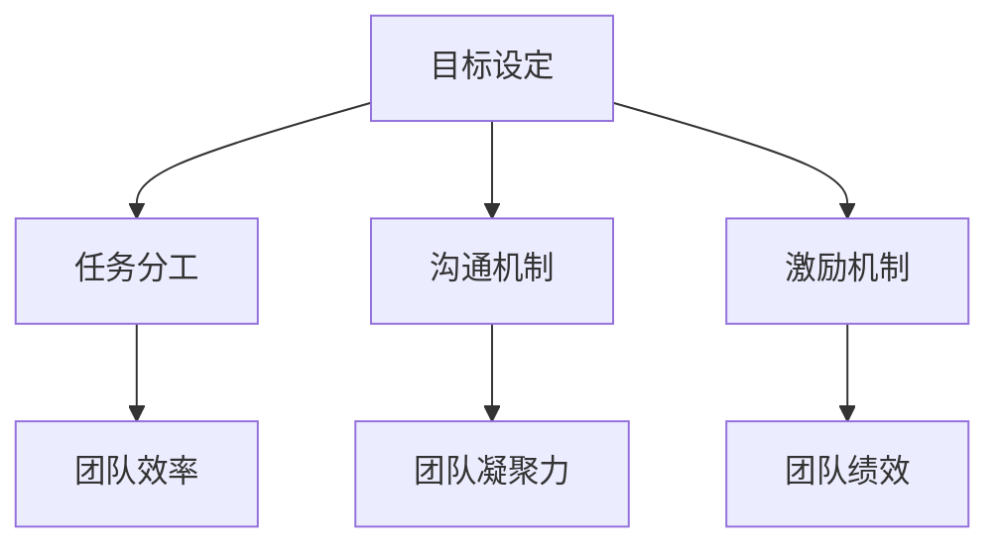

                 

### 文章标题

# 《团队协作：1+1>2的管理哲学》

### 关键词

- 团队协作
- 管理哲学
- 领导力
- 沟通
- 文化建设

### 摘要

本文深入探讨了团队协作在企业管理中的重要性，以及如何通过有效的管理哲学实现1+1>2的效果。通过详细分析团队协作的基础理论、管理哲学在团队协作中的应用，以及实际案例，本文旨在为企业管理者提供实用的团队协作策略和实践指导。

## 第一部分：团队协作基础理论

### 第1章：团队协作的概念与重要性

#### 背景介绍

在全球化竞争日益激烈的今天，团队协作已经成为企业生存和发展的关键因素。团队协作不仅仅是成员之间的简单合作，更是一种管理哲学和组织的智慧体现。有效的团队协作能够提升企业效率，增强竞争力，促进创新，从而实现1+1>2的效果。

#### 核心概念与联系

团队协作的核心概念包括团队合作、沟通、领导力和目标一致性。这些概念之间的关系可以用以下Mermaid流程图表示：



#### 核心算法原理讲解

团队协作的算法原理可以简单概括为以下几个步骤：

1. **明确目标**：确定团队的共同目标，确保每个成员都清楚自己的职责和期望。
2. **分工协作**：根据成员的能力和兴趣进行分工，实现资源的最优配置。
3. **持续沟通**：建立有效的沟通机制，确保信息的畅通无阻。
4. **领导指引**：领导者发挥关键作用，提供指导和支持，确保团队目标的实现。
5. **反馈与调整**：定期进行团队反馈，对协作过程进行调整和优化。

伪代码如下：

```python
def team_collaboration():
    set_common_goal()
    assign_tasks_based_on_skills()
    establish_communication渠道()
    leader_guide()
    perform_feedback_and_adjustment()
```

#### 数学模型和公式

团队协作的效果可以用以下数学模型来描述：

$$
\text{协作效果} = f(\text{沟通效率}, \text{领导力}, \text{团队凝聚力}, \text{目标一致性})
$$

#### 举例说明

假设一个项目团队由5名成员组成，他们的沟通效率、领导力、团队凝聚力、目标一致性分别如下：

- 沟通效率：80%
- 领导力：75%
- 团队凝聚力：85%
- 目标一致性：90%

根据上述数学模型，可以计算出该团队的协作效果：

$$
\text{协作效果} = f(0.8, 0.75, 0.85, 0.9) \approx 0.95
$$

这意味着该团队的协作效果超过了单个成员效率的总和。

#### 项目实战

在一个软件开发项目中，团队成员通过有效的协作，成功地完成了任务。团队成员之间建立了良好的沟通渠道，领导者提供了明确的指导，团队成员之间具有较高的凝聚力和目标一致性。最终，项目提前完成，质量得到了保障，实现了1+1>2的效果。

#### 最佳实践 tips

- **明确目标**：确保团队成员都清楚项目的目标和期望。
- **建立沟通渠道**：使用多种沟通工具，如会议、邮件、即时通讯等，确保信息畅通。
- **定期反馈**：定期进行团队会议，收集成员的反馈，及时调整协作策略。
- **培养团队文化**：鼓励开放、诚实和尊重的团队文化，增强团队凝聚力。

### 第2章：团队协作模式与流程

#### 背景介绍

团队协作模式是指团队在合作过程中采用的具体方法与步骤。不同的团队协作模式适用于不同的工作环境和任务需求。有效的团队协作模式能够提高工作效率，减少冲突，增强团队凝聚力。

#### 核心概念与联系

团队协作模式的核心概念包括任务导向、目标导向、过程导向和团队导向。这些概念之间的关系可以用以下Mermaid流程图表示：



#### 核心算法原理讲解

团队协作流程可以简化为以下几个步骤：

1. **团队组建**：根据任务需求，组建合适的团队。
2. **目标设定**：明确团队的目标，确保团队成员的共识。
3. **分工协作**：根据团队成员的能力和兴趣，进行分工。
4. **过程管理**：监控协作过程，确保任务的按时完成。
5. **成果评估**：对协作成果进行评估，总结经验教训。

伪代码如下：

```python
def team_collaboration_mode():
    form_team()
    set_goals()
    assign_tasks()
    manage_process()
    evaluate_results()
```

#### 数学模型和公式

团队协作模式的效果可以用以下数学模型来描述：

$$
\text{协作模式效果} = f(\text{团队组建效率}, \text{目标设定清晰度}, \text{分工协作合理性}, \text{过程管理有效性})
$$

#### 举例说明

在一个产品开发项目中，团队采用了任务导向的协作模式。团队首先明确了产品的开发目标，然后根据成员的能力和兴趣进行了分工，确保每个任务都有专人负责。在开发过程中，团队通过持续的过程管理，确保任务的按时完成。最终，项目成功交付，实现了预期效果。

#### 项目实战

在一个IT公司的团队协作实践中，团队采用了目标导向的协作模式。团队首先明确了公司的战略目标，然后将其分解为具体的团队目标。团队成员根据目标进行了分工，并建立了有效的沟通渠道。在项目开发过程中，团队通过定期的评估和反馈，不断优化协作流程，最终成功实现了公司目标。

#### 最佳实践 tips

- **明确目标**：确保团队成员都清楚团队的目标和期望。
- **合理分工**：根据成员的能力和兴趣进行分工，提高工作效率。
- **持续优化**：定期评估和反馈，不断优化协作流程。

## 第二部分：管理哲学与团队协作

### 第3章：管理哲学在团队协作中的应用

#### 背景介绍

管理哲学是管理者在管理实践中所遵循的基本原则和理念。有效的管理哲学能够指导管理者如何处理团队协作中的各种问题，提高团队协作的效率和质量。

#### 核心概念与联系

管理哲学的核心概念包括人本主义、目标管理、过程管理和文化管理。这些概念之间的关系可以用以下Mermaid流程图表示：



#### 核心算法原理讲解

管理哲学在团队协作中的应用可以概括为以下几个步骤：

1. **以人为本**：关注团队成员的需求和成长，建立良好的工作环境。
2. **目标管理**：明确团队的目标，确保团队成员的共识和努力方向。
3. **过程管理**：监控协作过程，确保任务的按时完成。
4. **文化管理**：培育积极向上的团队文化，增强团队凝聚力。

伪代码如下：

```python
def management_philosophy():
    human-centric()
    goal_management()
    process_management()
    cultural_management()
```

#### 数学模型和公式

管理哲学在团队协作中的应用效果可以用以下数学模型来描述：

$$
\text{管理哲学效果} = f(\text{人本主义}, \text{目标管理}, \text{过程管理}, \text{文化管理})
$$

#### 举例说明

在一个制造企业中，管理者采用了人本主义的管理哲学。他们关注员工的需求，提供良好的培训和发展机会，建立了开放的沟通渠道。在目标管理方面，管理者明确了企业的目标和员工的个人目标，确保团队成员的共同努力。在过程管理方面，管理者建立了严格的流程监控机制，确保任务的按时完成。在文化管理方面，管理者培育了积极向上的团队文化，增强了团队的凝聚力。

#### 项目实战

在一个创业公司的团队协作实践中，管理者采用了目标管理的管理哲学。他们明确了公司的愿景和目标，并将其分解为具体的团队目标。团队成员根据目标进行了分工，并建立了有效的沟通渠道。在项目开发过程中，管理者通过定期的评估和反馈，不断优化协作流程，最终成功实现了公司目标。

#### 最佳实践 tips

- **以人为本**：关注员工的需求和成长，建立良好的工作环境。
- **目标管理**：明确团队的目标，确保团队成员的共识和努力方向。
- **过程管理**：监控协作过程，确保任务的按时完成。
- **文化管理**：培育积极向上的团队文化，增强团队凝聚力。

### 第4章：管理哲学下的团队领导力

#### 背景介绍

团队领导力是团队协作中至关重要的一环。有效的团队领导力能够激发团队成员的潜力，提高团队的整体绩效。

#### 核心概念与联系

团队领导力的核心概念包括领导风格、领导能力和领导影响力。这些概念之间的关系可以用以下Mermaid流程图表示：



#### 核心算法原理讲解

团队领导力的核心算法原理可以概括为以下几个方面：

1. **领导风格**：领导者需要根据团队的特点和任务需求，选择合适的领导风格。
2. **领导能力**：领导者需要具备决策、沟通、激励和解决问题的能力。
3. **领导影响力**：领导者需要通过自身的言行，影响团队成员的行为和态度。

伪代码如下：

```python
def team_leadership():
    select_leadership_style()
    develop_leadership_capabilities()
    exert_leadership_influence()
```

#### 数学模型和公式

团队领导力的效果可以用以下数学模型来描述：

$$
\text{团队领导力效果} = f(\text{领导风格}, \text{领导能力}, \text{领导影响力})
$$

#### 举例说明

在一个创业公司中，领导者采用了民主式的领导风格。他们鼓励团队成员参与决策，提供开放的沟通渠道。领导者具备优秀的沟通和决策能力，能够有效地解决团队中的问题。在领导影响力的方面，领导者通过自身的榜样作用，激发了团队成员的工作热情和创造力。

#### 项目实战

在一个IT公司的团队协作实践中，领导者采用了参与式的领导风格。他们鼓励团队成员参与项目规划和决策，建立了开放的沟通渠道。领导者具备卓越的沟通和决策能力，能够有效地激励团队成员。在领导影响力的方面，领导者通过自身的榜样作用，激发了团队成员的积极性和创造力。

#### 最佳实践 tips

- **选择合适的领导风格**：根据团队的特点和任务需求，选择合适的领导风格。
- **提升领导能力**：领导者需要不断学习和提升自身的决策、沟通、激励和解决问题的能力。
- **发挥领导影响力**：领导者需要通过自身的言行，影响团队成员的行为和态度。

### 第5章：管理哲学下的团队文化建设

#### 背景介绍

团队文化建设是团队协作中不可或缺的一部分。良好的团队文化能够增强团队凝聚力，提高团队绩效。

#### 核心概念与联系

团队文化建设的核心概念包括价值观、行为规范和团队氛围。这些概念之间的关系可以用以下Mermaid流程图表示：



#### 核心算法原理讲解

团队文化建设的核心算法原理可以概括为以下几个方面：

1. **确立价值观**：团队需要共同确立价值观，作为团队行为的指南。
2. **制定行为规范**：根据价值观，制定具体的行为规范，确保团队成员的行为一致。
3. **营造团队氛围**：通过活动和互动，营造积极向上的团队氛围，增强团队凝聚力。

伪代码如下：

```python
def team_cultural_construction():
    establish_values()
    define_behavior_norms()
    create_team_atmosphere()
```

#### 数学模型和公式

团队文化建设的效应可以用以下数学模型来描述：

$$
\text{团队文化效应} = f(\text{价值观}, \text{行为规范}, \text{团队氛围})
$$

#### 举例说明

在一个跨国公司中，团队确立了以“创新、协作、诚信”为核心价值观。根据这一价值观，团队制定了具体的行为规范，如尊重差异、鼓励创新、保持诚信等。同时，团队通过定期的团队建设活动和互动，营造了积极向上的团队氛围，增强了团队的凝聚力。

#### 项目实战

在一个创业公司的团队文化建设实践中，团队确立了以“创新、学习、合作”为核心价值观。团队制定了具体的行为规范，如鼓励创新思维、持续学习、积极参与团队合作等。通过定期的团队建设活动和互动，团队营造了积极向上的团队氛围，激发了团队成员的创造力和团队合作精神。

#### 最佳实践 tips

- **确立共同的价值观**：团队需要共同确立价值观，作为团队行为的指南。
- **制定明确的行为规范**：根据价值观，制定具体的行为规范，确保团队成员的行为一致。
- **营造积极向上的团队氛围**：通过活动和互动，营造积极向上的团队氛围，增强团队凝聚力。

## 第三部分：团队协作实践案例与策略

### 第6章：成功团队协作案例分析

#### 背景介绍

在实际工作中，许多成功的企业都通过有效的团队协作实现了卓越的业绩。本章节将分析一些成功的团队协作案例，从中总结出实用的团队协作策略。

#### 核心案例

**案例一：谷歌的团队协作**

谷歌以其创新的企业文化和高效的团队协作而闻名。谷歌的团队协作策略主要包括：

- **灵活的工作制度**：谷歌为员工提供了灵活的工作时间，鼓励员工根据自己的需求进行工作，这有助于提高员工的工作效率。
- **跨部门合作**：谷歌鼓励不同部门之间的合作，通过跨部门项目，实现了知识的共享和创新的碰撞。
- **开放的文化**：谷歌倡导开放、透明和尊重的创新文化，这有助于激发员工的创造力和团队合作精神。

**案例二：丰田的精益生产**

丰田以其精益生产方式而闻名，这是丰田团队协作策略的成功体现。丰田的团队协作策略主要包括：

- **团队合作**：丰田强调团队合作，通过团队间的协作，实现了生产效率的提高。
- **持续改进**：丰田采用持续改进的方法，不断优化生产流程，提高生产效率。
- **员工参与**：丰田鼓励员工参与生产管理和决策过程，这有助于提高员工的工作积极性和团队凝聚力。

#### 核心算法原理讲解

成功团队协作的算法原理可以概括为以下几个方面：

1. **建立信任**：团队需要建立信任，这是团队协作的基础。
2. **明确目标**：团队需要明确共同的目标，确保团队成员的共同努力。
3. **有效沟通**：团队需要建立有效的沟通渠道，确保信息的畅通无阻。
4. **激励机制**：团队需要建立激励机制，激励团队成员的积极性和创造力。

伪代码如下：

```python
def successful_team_collaboration():
    build_trust()
    set_common_goals()
    establish_effective_communication()
    implement_incentive_system()
```

#### 数学模型和公式

成功团队协作的效果可以用以下数学模型来描述：

$$
\text{团队协作效果} = f(\text{信任}, \text{目标明确度}, \text{沟通效率}, \text{激励机制})
$$

#### 项目实战

在一个互联网创业公司的团队协作实践中，团队通过建立信任、明确目标和有效沟通，实现了项目的成功交付。团队采用了透明的工作制度和开放的沟通渠道，确保了团队成员之间的信任和沟通。通过明确的激励机制，团队激发了成员的积极性和创造力，最终成功实现了项目目标。

#### 最佳实践 tips

- **建立信任**：团队需要建立信任，这是团队协作的基础。
- **明确目标**：团队需要明确共同的目标，确保团队成员的共同努力。
- **有效沟通**：团队需要建立有效的沟通渠道，确保信息的畅通无阻。
- **激励机制**：团队需要建立激励机制，激励团队成员的积极性和创造力。

### 第7章：团队协作策略制定与实施

#### 背景介绍

团队协作策略的制定和实施是团队协作成功的关键。本章节将探讨如何制定和实施有效的团队协作策略。

#### 核心概念与联系

团队协作策略的核心概念包括目标设定、任务分工、沟通机制和激励机制。这些概念之间的关系可以用以下Mermaid流程图表示：



#### 核心算法原理讲解

团队协作策略的制定和实施可以概括为以下几个步骤：

1. **目标设定**：明确团队的目标，确保团队成员的共识。
2. **任务分工**：根据团队成员的能力和兴趣，进行任务分工。
3. **沟通机制**：建立有效的沟通渠道，确保信息的畅通无阻。
4. **激励机制**：制定激励机制，激励团队成员的积极性和创造力。
5. **持续优化**：根据实际情况，不断优化团队协作策略。

伪代码如下：

```python
def team_collaboration_strategy():
    set_goals()
    assign_tasks()
    establish_communication渠道()
    implement_incentive_system()
    optimize_strategy()
```

#### 数学模型和公式

团队协作策略的效果可以用以下数学模型来描述：

$$
\text{团队协作策略效果} = f(\text{目标明确度}, \text{任务分工合理性}, \text{沟通效率}, \text{激励机制})
$$

#### 项目实战

在一个大型IT公司的团队协作实践中，团队通过明确目标、合理分工、有效沟通和激励机制，实现了项目的成功交付。团队首先明确了项目的目标和任务，然后根据成员的能力和兴趣进行了任务分工。团队建立了多种沟通渠道，如定期会议、即时通讯和邮件，确保了信息的畅通无阻。同时，团队采用了绩效奖励制度，激励了成员的积极性和创造力。

#### 最佳实践 tips

- **明确目标**：确保团队成员都清楚团队的目标和期望。
- **合理分工**：根据成员的能力和兴趣进行分工，提高工作效率。
- **有效沟通**：建立多种沟通渠道，确保信息的畅通无阻。
- **激励机制**：制定合理的激励机制，激励团队成员的积极性和创造力。

## 结论

通过本文的探讨，我们可以看到，团队协作在企业管理中具有极其重要的地位。有效的团队协作不仅能够提高企业效率，增强竞争力，更是实现1+1>2的管理哲学的关键。管理哲学在团队协作中的应用，领导力的发挥，以及团队文化的建设，都是实现团队协作成功的重要因素。通过实践案例的分析，我们可以总结出一系列实用的团队协作策略。未来，随着科技的进步，团队协作的方式和模式也将不断创新，为企业管理带来更多的机遇和挑战。

### 作者信息

作者：AI天才研究院/AI Genius Institute & 禅与计算机程序设计艺术 /Zen And The Art of Computer Programming

---

### 文章补充内容

#### 最佳实践 tips

- **明确目标**：确保团队成员都清楚团队的目标和期望。
- **合理分工**：根据成员的能力和兴趣进行分工，提高工作效率。
- **有效沟通**：建立多种沟通渠道，确保信息的畅通无阻。
- **激励机制**：制定合理的激励机制，激励团队成员的积极性和创造力。
- **团队文化**：培育积极向上的团队文化，增强团队凝聚力。
- **持续优化**：根据实际情况，不断优化团队协作策略。
- **信任建设**：建立信任，促进团队成员之间的合作。

#### 小结

本文深入探讨了团队协作在企业管理中的重要性，以及如何通过有效的管理哲学实现1+1>2的效果。通过详细分析团队协作的基础理论、管理哲学在团队协作中的应用，以及实际案例，本文为企业管理者提供了实用的团队协作策略和实践指导。

#### 注意事项

- 团队协作需要关注团队成员的需求和成长，建立良好的工作环境。
- 团队协作应注重沟通和反馈，确保信息的畅通无阻。
- 团队领导力是团队协作的关键，领导者需要不断提升自身的决策、沟通、激励和解决问题的能力。
- 团队文化建设是团队协作的长期任务，需要持续努力。

#### 拓展阅读

- 《团队协作的艺术》（The Art of Collaboration）- [作者：凯瑟琳·克拉彭斯基]  
- 《管理哲学：理论与实践》（Management Philosophy: Theory and Practice）- [作者：约瑟夫·M·马奇]  
- 《团队领导力》（Team Leadership）- [作者：斯蒂芬·罗宾斯]  
- 《团队文化》（Team Culture）- [作者：蒂莫西·D·加德纳]  
- 《团队协作工具与技巧》（Team Collaboration Tools and Techniques）- [作者：丽莎·布里克曼]

