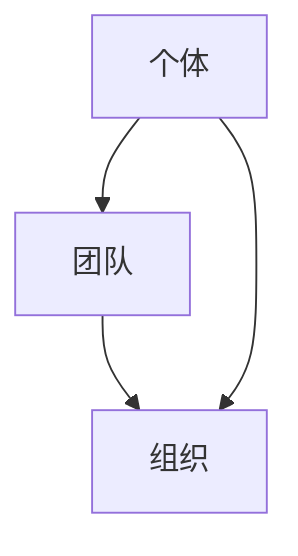

                 


# 文章标题：团队协作：从个体到整体的转变

## 关键词：
- 团队协作
- 沟通
- 领导力
- 团队文化
- 效率提升
- 项目管理

## 摘要：
本文旨在探讨团队协作从个体到整体的转变，分析其在现代企业环境中的重要性。文章首先介绍了团队协作的概念和核心概念之间的关系，通过Mermaid流程图展示了个体、团队、组织之间的协作关系。接着，详细讲解了团队协作模型及其优化方法，介绍了个体和团队的角色定位，以及沟通与协作的重要性。文章还探讨了领导力在团队协作中的应用，团队文化的建立和影响，并通过案例研究展示了团队协作的实践应用。最后，对团队协作的未来趋势进行了展望。

# 目录大纲设计与讲解

## 1. 总体构思

设计《团队协作：从个体到整体的转变》这本书的目录大纲时，我们首先明确了几个关键点：

- **核心概念与联系**：我们要详细介绍团队协作中的核心概念，如团队合作、沟通、领导力、团队文化等，并展示它们之间的相互关系。
- **核心算法原理讲解**：虽然团队协作主要涉及人际交往而非算法，但我们可以引入一些心理学和社会学原理，来帮助读者理解团队协作中的行为模式。
- **数学模型和数学公式**：在讨论某些量化评估团队协作效果时，可能会用到一些数学模型，比如团队绩效评估的指标计算等。
- **项目实战**：通过真实案例来展示团队协作的实践应用，帮助读者理解和应用团队协作的原则。

## 2. 目录大纲结构

接下来，我们将设计一个包含7个章节的目录大纲，确保每个章节都有明确的主题和目标，以保证内容完整且逻辑清晰。

### 第1章：团队协作概述
- **1.1 团队协作的重要性
- **1.2 团队协作的发展历程
- **1.3 团队协作的核心概念

### 第2章：团队协作模型
- **2.1 团队协作模型的类型
- **2.2 常见的团队协作模型
- **2.3 团队协作模型的优化

### 第3章：个体与团队的角色
- **3.1 个体在团队中的角色
- **3.2 团队领导者的角色
- **3.3 团队成员的角色定位

### 第4章：沟通与协作
- **4.1 沟通的重要性
- **4.2 沟通障碍及解决方法
- **4.3 团队协作工具

### 第5章：领导力与团队协作
- **5.1 领导力与团队协作的关系
- **5.2 领导力在团队协作中的应用
- **5.3 领导者的角色转变

### 第6章：团队文化
- **6.1 团队文化的定义
- **6.2 建立积极团队文化的策略
- **6.3 团队文化对团队协作的影响

### 第7章：案例研究
- **7.1 成功团队协作案例
- **7.2 团队协作的挑战与解决方案
- **7.3 团队协作的未来趋势

## 3. 详细讲解

### 第1章：团队协作概述
**1.1 团队协作的重要性**
- **核心概念与联系**
  - 团队协作是现代企业成功的关键因素，它涉及到多个领域的协作。
  - Mermaid流程图：展示个体、团队、组织之间的协作关系。



**1.2 团队协作的发展历程**
- **核心算法原理讲解**
  - 伪代码：演示团队协作模式从传统分工到现代协同的转变。

```plaintext
传统分工模式:
for (each task in project) {
    assign_task_to_individual();
    individual_performs_task();
}

现代协同模式:
create_team();
for (each task in project) {
    assign_task_to_team_member();
    team_member_performs_task();
    team_communicates_and_collaborates();
}
```

**1.3 团队协作的核心概念**
- **数学模型和数学公式**
  - 团队绩效评估指标的计算公式：$$TPA = \frac{KPI_1 + KPI_2 + ... + KPI_n}{n}$$

## 2. 团队协作模型

**2.1 团队协作模型的类型**
- **核心概念与联系**
  - 团队协作模型分类及特点。

**2.2 常见的团队协作模型**
- **核心算法原理讲解**
  - 伪代码：展示不同模型在团队协作中的实现方式。

```plaintext
功能型团队模型:
create_functional_teams();
assign_tasks_to_functional_teams();
functional_teams_perform_tasks();

跨职能团队模型:
create_cross-functional_teams();
assign_tasks_to_cross-functional_teams();
cross-functional_teams_perform_tasks();
cross-functional_teams_communicate();
```

**2.3 团队协作模型的优化**
- **数学模型和数学公式**
  - 优化团队协作效率的数学模型。

```plaintext
协作效率指标:
EF = (完成任务的团队总数 / 团队总数) * 100%
协作优化模型:
maximize(EF) subject to constraints of team size, task complexity, and communication channels
```

## 3. 个体与团队的角色

**3.1 个体在团队中的角色**
- **项目实战**
  - 个体角色在团队协作中的案例应用。

**3.2 团队领导者的角色**
- **核心概念与联系**
  - 团队领导者与团队成员的角色关系。

**3.3 团队成员的角色定位**
- **数学模型和数学公式**
  - 团队角色分配的优化模型。

```plaintext
角色分配模型:
minimize(role_conflicts) subject to constraints of team member skills, task requirements, and team dynamics
```

## 4. 沟通与协作

**4.1 沟通的重要性**
- **核心概念与联系**
  - 沟通在团队协作中的重要性。

**4.2 沟通障碍及解决方法**
- **核心算法原理讲解**
  - 伪代码：解决沟通障碍的策略。

```plaintext
解决沟通障碍策略:
1. Establish clear communication channels();
2. Use consistent communication tools();
3. Encourage active listening();
4. Provide feedback and clarification();
5. Foster a culture of open communication();
```

**4.3 团队协作工具**
- **项目实战**
  - 团队协作工具的实际应用案例。

## 5. 领导力与团队协作

**5.1 领导力与团队协作的关系**
- **核心概念与联系**
  - 领导力在团队协作中的作用。

**5.2 领导力在团队协作中的应用**
- **核心算法原理讲解**
  - 伪代码：领导力在团队协作中的实现策略。

```plaintext
领导力实现策略:
1. Set clear goals and expectations();
2. Provide guidance and support();
3. Foster a collaborative environment();
4. Encourage team member development();
5. Resolve conflicts and facilitate decision-making();
```

**5.3 领导者的角色转变**
- **数学模型和数学公式**
  - 领导者角色转变的模型。

```plaintext
领导者角色转变模型:
L = f(G, S, C)
where L is the leader's role, G is the group's goals, S is the social context, and C is the communication style.
```

## 6. 团队文化

**6.1 团队文化的定义**
- **核心概念与联系**
  - 团队文化的概念及其内涵。

**6.2 建立积极团队文化的策略**
- **核心算法原理讲解**
  - 伪代码：建立积极团队文化的策略。

```plaintext
建立积极团队文化策略:
1. Define core values and principles();
2. Foster a sense of belonging();
3. Encourage open communication();
4. Recognize and reward achievements();
5. Support continuous learning();
```

**6.3 团队文化对团队协作的影响**
- **核心概念与联系**
  - 团队文化对团队协作的正面影响。

## 7. 案例研究

**7.1 成功团队协作案例**
- **项目实战**
  - 成功团队协作的实际案例剖析。

**7.2 团队协作的挑战与解决方案**
- **项目实战**
  - 团队协作中面临的挑战及其解决方法。

**7.3 团队协作的未来趋势**
- **核心概念与联系**
  - 团队协作的未来发展趋势和可能面临的挑战。

# 结束

通过以上章节的详细讲解，我们探讨了团队协作从个体到整体的转变。团队协作不仅是现代企业成功的关键因素，也是个体发展和职业成长的助力。希望通过本文的探讨，读者能够更好地理解和应用团队协作的原则，提升团队效率和项目成功概率。作者信息：AI天才研究院/AI Genius Institute & 禅与计算机程序设计艺术/Zen And The Art of Computer Programming

