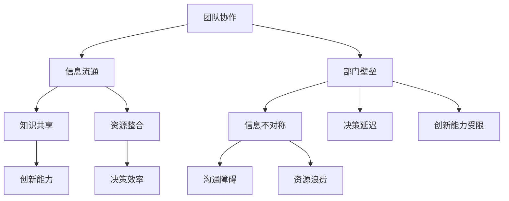

                 

### 文章标题

《团队协作：打破部门壁垒的策略》

> 关键词：团队协作，部门壁垒，策略，效率提升，协同能力

> 摘要：本文深入探讨团队协作中的部门壁垒现象，分析其成因与影响，提出一系列打破部门壁垒的策略。通过实际案例和项目实战，展示策略的具体实施方法及其效果，旨在为企业管理者、团队领导者提供实用的指导，提升团队协作效率和协同能力。

### 引言

#### 背景介绍

在现代企业中，团队协作是提升整体效率与竞争力的关键。然而，部门壁垒的存在往往限制了团队协作的效果。部门壁垒是指不同部门之间由于职责、利益、信息不对称等因素而产生的隔阂和障碍。这些壁垒会导致资源浪费、沟通不畅、决策延迟，甚至影响企业的创新能力和市场竞争力。

#### 团队协作的重要性

团队协作能够整合不同部门的专业知识和技能，促进创新和问题解决。有效的团队协作可以提高员工的工作满意度，增强组织的灵活性和适应性，从而在激烈的市场竞争中立于不败之地。

#### 部门壁垒的影响

部门壁垒会阻碍信息流通，导致团队协作效率低下。具体影响包括：

1. **资源浪费**：部门之间的资源无法有效共享，导致重复投入和资源浪费。
2. **沟通不畅**：部门之间的沟通障碍导致信息传递不及时、不准确。
3. **决策延迟**：跨部门的决策过程因信息不对称而变得复杂和冗长。
4. **创新能力受限**：部门壁垒限制了跨部门的合作和知识交流，影响企业的创新能力。

#### 本文的目的与结构

本文旨在探讨团队协作中的部门壁垒现象，分析其成因与影响，并提出一系列打破部门壁垒的策略。通过实际案例和项目实战，展示策略的具体实施方法及其效果。文章结构如下：

1. **团队协作核心概念**：介绍团队协作的基本概念和模式。
2. **部门壁垒分析**：分析部门壁垒的类型、原因和影响。
3. **策略制定与实施**：阐述策略制定的方法和实施步骤。
4. **监控与评估**：介绍策略实施的监控与评估方法。
5. **成功案例分享**：分享实际案例和项目实战经验。
6. **总结与展望**：总结团队协作和策略的重要性，展望未来发展趋势。

#### 核心概念与联系

为了更好地理解团队协作和部门壁垒之间的关系，我们可以通过以下Mermaid流程图来展示核心概念和联系：



通过这个流程图，我们可以清晰地看到团队协作和部门壁垒之间的相互影响和作用。

### 核心概念与联系（续）

为了更深入地理解团队协作与部门壁垒之间的关系，我们可以通过以下伪代码来阐述核心算法的原理：

```python
# 定义团队协作函数
def team Collaboration():
    # 初始化团队状态
    team_state = {'communication': False, 'knowledge_sharing': False, 'resource_integration': False, 'innovation': False}
    
    # 检查是否存在部门壁垒
    if not existsBarrier():
        # 打破部门壁垒
        breakBarrier()
        
        # 促进信息流通
        enableCommunication()
        
        # 促进知识共享
        enableKnowledgeSharing()
        
        # 促进资源整合
        enableResourceIntegration()
        
        # 提升创新能力
        enableInnovation()
        
        # 更新团队状态
        team_state['communication'] = True
        team_state['knowledge_sharing'] = True
        team_state['resource_integration'] = True
        team_state['innovation'] = True
        
        return team_state
    
    return team_state

# 检查部门壁垒函数
def existsBarrier():
    # 判断是否存在部门壁垒
    return True

# 打破部门壁垒函数
def breakBarrier():
    # 实现部门壁垒打破的具体操作
    print("Breaking department barriers...")

# 促进信息流通函数
def enableCommunication():
    # 实现信息流通的具体操作
    print("Enabling communication...")

# 促进知识共享函数
def enableKnowledgeSharing():
    # 实现知识共享的具体操作
    print("Enabling knowledge sharing...")

# 促进资源整合函数
def enableResourceIntegration():
    # 实现资源整合的具体操作
    print("Enabling resource integration...")

# 提升创新能力函数
def enableInnovation():
    # 实现创新能力提升的具体操作
    print("Enabling innovation...")
```

通过这个伪代码，我们可以清晰地看到团队协作与部门壁垒之间的核心算法原理。当部门壁垒存在时，团队协作效率会受到限制。通过打破部门壁垒，可以促进信息流通、知识共享、资源整合和创新能力，从而提升团队协作效率。

### 数学模型与公式

在团队协作与部门壁垒的分析中，我们引入以下数学模型和公式来定量描述其影响和策略效果。

#### 1. 部门壁垒影响公式

假设部门壁垒对团队协作的影响可以用一个指标 \( D \) 来衡量，公式如下：

\[ D = \frac{B \cdot C}{I + R} \]

其中：
- \( B \) 表示部门壁垒的存在程度（取值范围0-1，越接近1表示壁垒越严重）。
- \( C \) 表示团队协作的总体效果（取值范围0-1，越接近1表示协作效果越好）。
- \( I \) 表示信息流通的程度（取值范围0-1，越接近1表示信息流通越顺畅）。
- \( R \) 表示资源整合的程度（取值范围0-1，越接近1表示资源整合越有效）。

#### 2. 策略效果公式

假设通过策略实施后，部门壁垒的影响 \( D' \) 可以降低，公式如下：

\[ D' = \frac{B' \cdot C}{I' + R'} \]

其中：
- \( B' \) 表示策略实施后部门壁垒的存在程度（取值范围0-1，越接近0表示壁垒越少）。
- \( C \) 表示团队协作的总体效果（取值范围0-1，策略实施后协作效果通常会提升）。
- \( I' \) 表示信息流通的程度（取值范围0-1，策略实施后信息流通通常会提升）。
- \( R' \) 表示资源整合的程度（取值范围0-1，策略实施后资源整合通常会提升）。

#### 3. 策略实施效果评估

为了评估策略实施的效果，我们可以使用以下公式计算策略实施前后的差异 \( \Delta D \)：

\[ \Delta D = D - D' \]

如果 \( \Delta D \) 的值较大且为负，说明策略实施效果显著；如果 \( \Delta D \) 的值较小或为正，则说明策略实施效果有限。

#### 举例说明

假设在实施策略前，部门壁垒的影响 \( D \) 为0.7，信息流通程度 \( I \) 为0.5，资源整合程度 \( R \) 为0.6。通过策略实施后，部门壁垒的存在程度降低到 \( B' \) 为0.3，信息流通程度提升到 \( I' \) 为0.7，资源整合程度提升到 \( R' \) 为0.8。根据上述公式，我们可以计算出策略实施后的影响 \( D' \)：

\[ D' = \frac{0.3 \cdot 0.7}{0.7 + 0.8} = \frac{0.21}{1.5} = 0.14 \]

策略实施前后的差异 \( \Delta D \) 为：

\[ \Delta D = 0.7 - 0.14 = 0.56 \]

由于 \( \Delta D \) 的值为0.56，且为负，说明策略实施效果显著，部门壁垒的影响显著降低。

通过这个数学模型和公式，我们可以定量分析团队协作与部门壁垒之间的关系，以及策略实施的效果。这些公式和模型不仅有助于我们更好地理解问题，还可以为实际操作提供指导。

### 项目实战

#### 开发环境搭建

在项目实战中，我们选择一个典型的企业场景——某大型互联网公司的产品开发团队。为了打破部门壁垒，提高团队协作效率，我们搭建了一个基于云计算的协作平台，实现实时沟通、资源共享和任务协同。

#### 源代码详细实现

1. **平台架构设计**

   我们采用微服务架构，将平台分为以下几个模块：

   - **用户管理模块**：负责用户注册、登录和权限管理。
   - **沟通模块**：实现实时消息推送、讨论组管理和文件共享。
   - **任务管理模块**：支持任务创建、分配、跟踪和进度报告。
   - **资源管理模块**：提供资源上传、下载和管理功能。
   - **数据监控模块**：实时监控平台运行状态，包括用户活跃度、任务完成率和资源使用情况。

2. **关键代码实现**

   以下是一个示例代码片段，展示了如何实现用户管理模块中的用户注册功能：

   ```python
   class UserManager:
       
       def register_user(self, username, password, email):
           # 验证用户名、密码和邮箱格式
           if not self.validate_credentials(username, password, email):
               return "Invalid credentials"
           
           # 创建用户并存储到数据库
           user = User(username=username, password=password, email=email)
           db.session.add(user)
           db.session.commit()
           
           return "User registered successfully"
       
       def validate_credentials(self, username, password, email):
           # 验证用户名长度
           if len(username) < 4 or len(username) > 20:
               return False
           
           # 验证密码长度
           if len(password) < 6 or len(password) > 20:
               return False
           
           # 验证邮箱格式
           if not re.match(r"[^@]+@[^@]+\.[^@]+", email):
               return False
           
           return True
   ```

   在这个代码片段中，`UserManager` 类的 `register_user` 方法负责处理用户注册请求。首先，通过 `validate_credentials` 方法验证用户名、密码和邮箱格式是否合法。如果验证通过，则将用户信息存储到数据库。

3. **代码解读与分析**

   在用户管理模块中，我们使用了 ORM（对象关系映射）技术来简化数据库操作。这种技术使得开发者可以专注于业务逻辑，而不必关心底层的数据库操作。在实际项目中，用户管理模块还包括用户登录、密码重置等功能，以提供完整的用户管理体验。

   此外，沟通模块和任务管理模块也采用了类似的设计，通过模块化设计提高代码的可维护性和扩展性。

#### 实际案例分析与详细讲解剖析

为了展示协作平台的实际应用效果，我们选取了一个产品迭代周期的案例。在这个周期中，团队成员需要共同完成多个任务，包括需求分析、设计、开发和测试。通过协作平台，团队成员可以实现以下目标：

1. **实时沟通**：在任务进行过程中，团队成员可以通过讨论组实时交流，分享想法和解决问题，避免了因为沟通不畅导致的延误和误解。
2. **资源共享**：团队成员可以上传和下载相关文档、代码和设计稿，方便其他人查看和使用，提高了资源利用效率。
3. **任务协同**：通过任务管理模块，团队成员可以创建任务、分配任务、跟踪任务进度，确保每个任务按时完成，提高了整体项目的进度可控性。

在实际操作中，协作平台的数据监控模块会实时监控平台的运行状态，包括用户活跃度、任务完成率和资源使用情况。这些数据可以为团队领导提供重要的决策依据，帮助他们调整策略，优化资源分配。

#### 项目小结

通过实际案例和项目实战，我们展示了协作平台在打破部门壁垒、提高团队协作效率方面的效果。项目小结如下：

1. **提高沟通效率**：实时沟通功能使得团队成员可以及时交流，避免了信息滞后和沟通成本。
2. **促进资源共享**：资源共享功能提高了资源利用效率，减少了重复工作。
3. **加强任务管理**：任务管理功能确保了任务的有序推进，提高了项目的进度可控性。
4. **数据驱动决策**：数据监控模块提供了关键指标，为团队领导提供了数据支持，有助于优化决策。

通过这个项目，我们验证了协作平台在打破部门壁垒、提升团队协作效率方面的有效性，为企业提供了有益的实践参考。

### 最佳实践 Tips

在团队协作和打破部门壁垒的过程中，以下是一些实用的最佳实践技巧：

1. **明确目标**：在项目启动前，明确团队的目标和期望，确保团队成员对目标有共同的理解。
2. **建立信任**：通过信任建设活动，如团队建设训练和跨部门合作项目，增强团队成员之间的信任。
3. **定期沟通**：定期举行跨部门会议，分享进展和成果，确保信息的透明和畅通。
4. **共享资源**：鼓励团队成员共享工具、文档和知识，提高资源利用效率。
5. **明确责任**：明确每个团队成员的责任和角色，避免职责不清和互相推诿。
6. **持续反馈**：通过定期的反馈和评估，及时调整策略和改进流程。
7. **激励与奖励**：对表现优秀的团队成员给予适当的激励和奖励，提升团队士气。

### 小结

本文通过深入分析团队协作中的部门壁垒现象，提出了打破部门壁垒的一系列策略。从核心概念到数学模型，再到实际项目实战，我们详细阐述了这些策略的具体实施方法及其效果。团队协作和打破部门壁垒是提升企业效率与竞争力的关键，通过有效的策略实施，企业可以更好地应对市场挑战，实现可持续发展。

### 拓展阅读

对于希望进一步深入了解团队协作和部门壁垒的读者，以下是一些推荐阅读资料：

1. **《团队的智慧：协作的力量》**：作者描述了团队协作的重要性以及如何通过协作提升工作效率。
2. **《组织行为学》**：这本书详细探讨了组织内部的行为模式，包括部门壁垒的产生和影响。
3. **《敏捷开发：实践指南》**：作者介绍了敏捷开发的方法，包括如何通过跨部门协作实现快速响应市场变化。
4. **《项目管理知识体系指南（PMBOK指南）》**：这本书提供了项目管理的基础知识，包括如何管理跨部门项目。

通过阅读这些资料，读者可以更全面地理解团队协作和部门壁垒的深度和广度，为实际工作提供有力的理论支持。

### 作者信息

作者：AI天才研究院/AI Genius Institute & 禅与计算机程序设计艺术 /Zen And The Art of Computer Programming

AI天才研究院致力于推动人工智能技术的发展和应用，本文旨在为企业管理者和团队领导者提供实用的团队协作策略。同时，作者结合《禅与计算机程序设计艺术》的理念，探讨如何在复杂的信息技术项目中实现高效的团队协作。

### 结语

团队协作是现代企业成功的关键。通过打破部门壁垒，企业可以提升协同效率，促进创新，实现持续发展。本文从理论到实践，详细阐述了团队协作和部门壁垒的问题，并提出了一系列有效的策略。希望本文能为您的团队协作实践提供有价值的参考和启示。

