                 

### 第1章：引言

#### 1.1 团队协作的重要性

**背景介绍**

在现代社会中，团队协作已经成为各类组织和企业运营的核心组成部分。无论是政府机构、企业公司，还是学术研究团队，团队协作都是实现目标、推动创新的重要手段。随着信息技术的发展，团队协作的效率和效果得到了显著提升。然而，团队协作并非一帆风顺，其中涉及到诸多复杂的问题和挑战。

**核心概念与联系**

团队协作的重要性主要体现在以下几个方面：

1. **资源整合**：团队协作可以实现资源的最优配置，充分发挥每个成员的专业技能和经验，提高整体工作效率。
2. **知识共享**：团队成员之间的知识共享和经验交流，可以促进团队整体智慧的提升，形成集体智慧。
3. **创新能力**：通过团队协作，可以汇集不同视角和思维，激发创新灵感，推动创新成果的产生。
4. **风险分担**：团队协作可以将风险分散到每个成员身上，降低单个个体承担的风险。

**Mermaid 流程图**

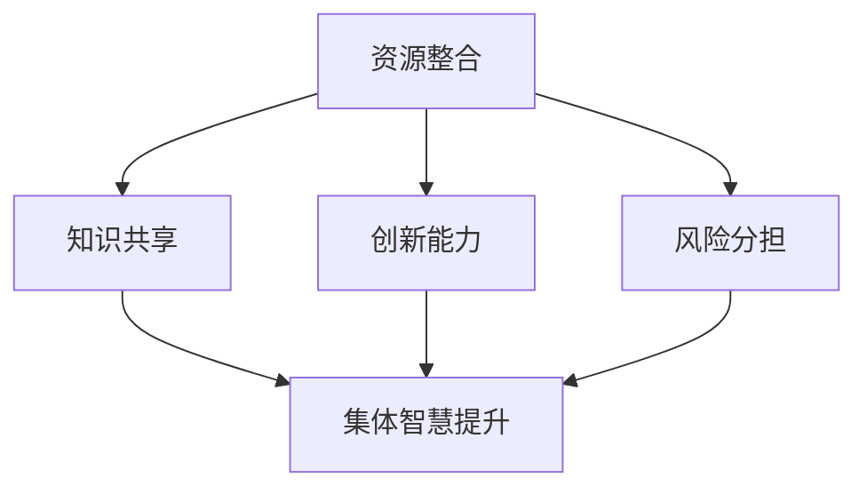

**核心算法原理讲解**

团队协作的核心算法原理可以概括为以下几个步骤：

1. **任务分配**：根据团队成员的技能和兴趣，合理分配任务。
2. **沟通与协调**：建立有效的沟通机制，确保团队成员之间的信息传递畅通。
3. **知识共享**：通过会议、文档、讨论等方式，促进团队成员之间的知识共享。
4. **风险评估与调整**：对团队协作过程进行持续监控，及时识别和解决潜在问题。

**数学模型和公式**

团队协作效率的提升可以用以下数学模型来表示：

$$E = f(T, C, K, R)$$

其中，$E$ 表示团队协作效率，$T$ 表示团队成员的技能水平，$C$ 表示沟通与协调效果，$K$ 表示知识共享水平，$R$ 表示风险评估与调整能力。

**详细讲解与举例说明**

以一个软件开发团队为例，团队成员包括前端开发、后端开发和测试人员。在团队协作中，前端开发人员负责实现用户界面，后端开发人员负责处理业务逻辑，测试人员负责测试和验证代码。通过有效的沟通和协调，团队成员可以共同完成项目任务，提高整体工作效率。

**总结**

团队协作是现代组织中不可或缺的一部分，其重要性体现在资源整合、知识共享、创新能力和风险分担等方面。通过合理的任务分配、有效的沟通与协调、知识共享以及风险评估与调整，团队可以充分发挥集体智慧，实现更高的协作效率。

----------------------------------------------------------------

### 第2章：团队协作的核心概念

#### 2.1 团队协作的框架与模型

**背景介绍**

团队协作的框架与模型是理解和实践团队协作的基础。不同的框架与模型有助于团队更好地理解和应用团队协作的原则，从而提升团队效率和集体智慧。在本节中，我们将介绍几种常见的团队协作框架与模型。

**核心概念与联系**

团队协作的框架与模型可以从多个角度进行分类，包括任务分配模型、沟通协调模型、知识共享模型等。以下将介绍几种具有代表性的模型：

1. **布鲁克斯法则**：该法则指出，在大型软件项目中，沟通是关键，而由于通信成本随团队规模的平方增长，因此团队规模应尽可能小。
2. **系统动力理论**：该理论强调团队内部的动力机制，包括成员之间的互动、冲突解决、领导力等。
3. **五角星模型**：该模型将团队协作分为五个核心要素，即沟通、协调、合作、共享和领导。

**Mermaid 流�程图**

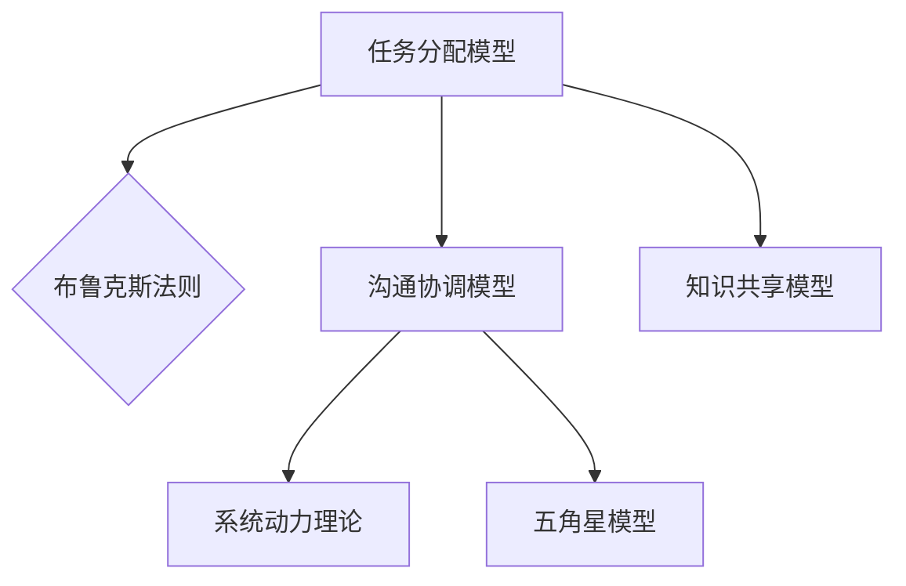

**核心算法原理讲解**

1. **布鲁克斯法则**

布鲁克斯法则的核心算法原理可以概括为以下步骤：

   - **任务分解**：将项目任务分解为多个小任务。
   - **人员匹配**：根据团队成员的技能和兴趣，匹配相应的任务。
   - **沟通机制**：建立有效的沟通渠道，确保任务执行的顺利进行。

2. **系统动力理论**

系统动力理论的核心算法原理包括：

   - **动力机制**：分析团队内部的动力机制，包括成员之间的互动、领导力等。
   - **反馈循环**：建立反馈机制，对团队协作过程进行持续监控和调整。

3. **五角星模型**

五角星模型的核心算法原理包括：

   - **沟通**：确保团队成员之间的信息传递畅通。
   - **协调**：解决团队成员之间的冲突，确保团队目标的实现。
   - **合作**：促进团队成员之间的合作，共同完成项目任务。
   - **共享**：鼓励团队成员分享知识和经验，提升集体智慧。
   - **领导**：提供有效的领导力，引导团队朝着共同目标前进。

**数学模型和公式**

团队协作效率的提升可以用以下数学模型来表示：

$$E = f(T, C, K, L)$$

其中，$E$ 表示团队协作效率，$T$ 表示团队成员的技能水平，$C$ 表示沟通与协调效果，$K$ 表示知识共享水平，$L$ 表示领导力。

**详细讲解与举例说明**

以一个软件开发团队为例，团队成员包括前端开发、后端开发和测试人员。在团队协作中，前端开发人员负责实现用户界面，后端开发人员负责处理业务逻辑，测试人员负责测试和验证代码。通过布鲁克斯法则，团队成员的技能和兴趣得到合理分配，确保任务的高效完成。系统动力理论帮助团队分析内部动力机制，解决成员之间的冲突，提升团队凝聚力。五角星模型确保团队成员之间的沟通、协调、合作、共享和领导得到有效实施，从而提高整体团队协作效率。

**总结**

团队协作的框架与模型为团队协作提供了理论指导和实践路径。通过合理的任务分配、有效的沟通与协调、知识共享以及领导力的发挥，团队可以更好地发挥集体智慧，实现更高的协作效率。

----------------------------------------------------------------

### 第3章：团队协作的障碍与解决方法

#### 3.1 团队协作中的常见障碍

**背景介绍**

尽管团队协作在提升组织效率和创新能力方面具有重要意义，但在实际操作中，团队协作往往面临诸多障碍。这些障碍可能源于沟通、冲突管理、意愿不一致等多个方面，严重影响了团队协作的效果。在本节中，我们将探讨团队协作中常见的障碍及其解决方法。

**核心概念与联系**

团队协作的障碍可以分为以下几类：

1. **沟通障碍**：包括信息传递不畅、沟通渠道不畅、语言障碍等。
2. **冲突管理**：包括团队成员之间的意见分歧、利益冲突、角色冲突等。
3. **意愿不一致**：包括团队成员对目标的认识不一致、个人目标与团队目标冲突等。

**Mermaid 流程图**

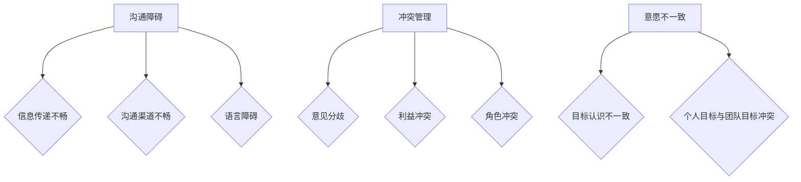

**核心算法原理讲解**

1. **沟通障碍**

沟通障碍的解决方法包括：

   - **建立有效的沟通渠道**：确保团队成员之间的信息传递畅通。
   - **提高沟通技巧**：通过培训和实践，提升团队成员的沟通能力。
   - **使用多种沟通方式**：结合口头、书面、视觉等多种沟通方式，提高沟通效果。

2. **冲突管理**

冲突管理的解决方法包括：

   - **建立冲突解决机制**：制定明确的冲突解决流程和规则。
   - **促进对话与沟通**：鼓励团队成员表达观点，寻找共同点。
   - **提供中立调解**：在冲突无法自行解决时，提供中立第三方进行调解。

3. **意愿不一致**

意愿不一致的解决方法包括：

   - **明确团队目标**：确保所有团队成员对团队目标有清晰的认识。
   - **建立共识**：通过讨论和协商，达成团队成员对目标的共识。
   - **激励与引导**：提供激励机制，引导团队成员将个人目标与团队目标结合起来。

**数学模型和公式**

团队协作效果可以用以下数学模型来表示：

$$E = f(C, CM, WI)$$

其中，$E$ 表示团队协作效果，$C$ 表示沟通效果，$CM$ 表示冲突管理效果，$WI$ 表示意愿一致性。

**详细讲解与举例说明**

以一个软件开发团队为例，团队成员包括前端开发、后端开发和测试人员。在团队协作过程中，前端开发人员与后端开发人员可能在技术实现上有不同的意见，导致沟通障碍。此时，团队可以通过建立有效的沟通渠道，提高沟通技巧，以及使用多种沟通方式，如会议、邮件、即时通讯工具等，来缓解沟通障碍。

在冲突管理方面，如果团队成员在利益分配上有分歧，团队可以建立明确的冲突解决机制，通过对话与沟通，寻找共同点，并提供中立调解，以解决冲突。

在意愿不一致方面，团队可以通过明确团队目标，建立共识，以及提供激励机制，引导团队成员将个人目标与团队目标结合起来，从而提高团队协作效果。

**总结**

团队协作中的障碍是影响团队效率的重要因素。通过建立有效的沟通渠道、冲突解决机制和共识，以及提供激励机制，团队可以克服这些障碍，提升整体协作效果。

----------------------------------------------------------------

### 第4章：提升集体智慧的方法

#### 4.1 创新思维的培养

**背景介绍**

创新思维是团队协作中不可或缺的一部分，它能够激发团队成员的创造力，推动团队在技术和产品上的创新。本节将探讨如何培养创新思维，包括其原理、方法和实践案例。

**核心概念与联系**

创新思维的核心概念包括：

1. **发散性思维**：从多个角度和层面思考问题，寻找多种可能的解决方案。
2. **联想思维**：通过联想和类比，将不同领域的知识进行结合，形成新的创意。
3. **批判性思维**：对现有知识和观点进行批判性分析，发现潜在的改进空间。

**Mermaid 流程图**

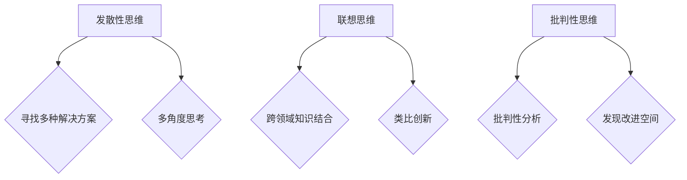

**核心算法原理讲解**

1. **发散性思维**

发散性思维的算法原理可以概括为以下步骤：

   - **问题定义**：明确需要解决的问题。
   - **思维发散**：从多个角度和层面思考问题，列出所有可能的解决方案。
   - **筛选与优化**：对列出的解决方案进行筛选和优化，选择最优方案。

2. **联想思维**

联想思维的算法原理包括：

   - **联想产生**：通过联想和类比，将不同领域的知识进行结合，形成新的创意。
   - **创意验证**：对联想产生的创意进行验证，评估其可行性和实用性。

3. **批判性思维**

批判性思维的算法原理包括：

   - **批判性分析**：对现有知识和观点进行批判性分析，发现其优点和缺点。
   - **问题解决**：针对分析中发现的问题，提出改进方案。

**数学模型和公式**

创新思维的评估可以用以下数学模型来表示：

$$I = f(D, L, C)$$

其中，$I$ 表示创新程度，$D$ 表示发散性思维，$L$ 表示联想思维，$C$ 表示批判性思维。

**详细讲解与举例说明**

以一个软件开发团队为例，团队成员需要在开发过程中进行创新。通过发散性思维，团队成员可以从多个角度思考如何提高软件的效率、用户体验等。通过联想思维，团队成员可以将其他领域的技术或产品与当前项目进行类比，寻找创新的解决方案。通过批判性思维，团队成员可以对现有的解决方案进行批判性分析，发现潜在的改进空间。

**实践案例**

一个成功的创新思维实践案例是苹果公司的产品创新。苹果公司在开发新产品时，经常使用发散性思维来寻找多种解决方案。通过联想思维，苹果公司能够将不同领域的创新元素融入产品设计中。通过批判性思维，苹果公司能够对现有产品进行改进，从而实现产品的持续创新。

**总结**

创新思维的培养是提升团队协作效率的重要手段。通过发散性思维、联想思维和批判性思维，团队可以激发创造力，推动创新成果的产生。

----------------------------------------------------------------

### 第4章：提升集体智慧的方法

#### 4.2 知识共享与传播

**背景介绍**

知识共享与传播是团队协作中不可或缺的一部分，它有助于提高团队成员的知识水平，促进团队的整体智慧提升。在本节中，我们将探讨知识共享与传播的重要性、障碍以及有效策略。

**核心概念与联系**

知识共享与传播的核心概念包括：

1. **知识共享**：指团队成员之间共享知识和经验的过程。
2. **知识传播**：指将知识从一个人或团队传递到另一个人或团队的过程。
3. **知识共享平台**：用于支持知识共享与传播的工具或系统。

**Mermaid 流程图**

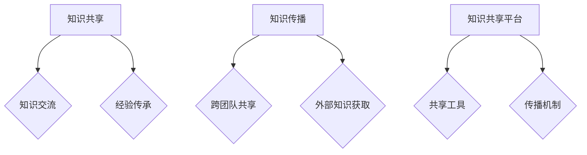

**核心算法原理讲解**

1. **知识共享**

知识共享的算法原理可以概括为以下步骤：

   - **知识识别**：确定需要共享的知识内容。
   - **知识编码**：将知识转化为易于传递的形式，如文档、教程、视频等。
   - **知识传递**：通过会议、培训、讨论等方式，将知识传递给团队成员。

2. **知识传播**

知识传播的算法原理包括：

   - **知识筛选**：从大量知识中筛选出有价值的信息。
   - **知识分发**：通过内部网络、邮件、即时通讯工具等，将知识分发到团队成员。
   - **知识反馈**：收集团队成员对知识传播的反馈，不断优化传播效果。

3. **知识共享平台**

知识共享平台的算法原理包括：

   - **知识存储**：建立知识库，存储各类知识和文档。
   - **知识检索**：提供强大的搜索功能，方便团队成员快速找到所需知识。
   - **知识分享**：支持团队成员间的知识分享和交流。

**数学模型和公式**

知识共享与传播的效果可以用以下数学模型来表示：

$$K = f(S, T, P)$$

其中，$K$ 表示知识共享与传播效果，$S$ 表示知识共享水平，$T$ 表示知识传播水平，$P$ 表示知识共享平台的使用效率。

**详细讲解与举例说明**

以一个软件开发团队为例，团队成员需要在项目开发过程中共享知识。通过知识共享平台，团队成员可以上传项目文档、技术教程、经验分享等，方便其他成员查阅和学习。在知识传播方面，团队可以定期举办内部培训，邀请团队成员分享技术心得和项目经验。通过知识筛选和反馈，团队可以不断优化知识共享与传播的效果。

**实践案例**

一个成功的知识共享与传播实践案例是谷歌的“20%时间”政策。谷歌允许员工在20%的工作时间内自由探索和开发个人感兴趣的项目。这一政策促进了员工之间的知识共享和传播，激发了团队的创新活力。

**总结**

知识共享与传播是提升团队协作效率的重要手段。通过建立知识共享平台、制定知识共享策略和优化知识传播机制，团队可以不断提高知识共享与传播的效果，从而提升整体智慧。

----------------------------------------------------------------

### 第4章：提升集体智慧的方法

#### 4.3 团队学习与持续发展

**背景介绍**

团队学习与持续发展是团队协作中至关重要的一环。通过不断学习和积累知识，团队可以不断提升自身的竞争力和创新能力。在本节中，我们将探讨团队学习的概念、模式以及实践案例。

**核心概念与联系**

团队学习的核心概念包括：

1. **团队学习**：指团队成员共同参与、互相学习的过程。
2. **学习共享**：团队成员将学习到的知识进行分享和传播。
3. **持续发展**：团队通过不断学习和改进，实现长期发展。

**Mermaid 流程图**

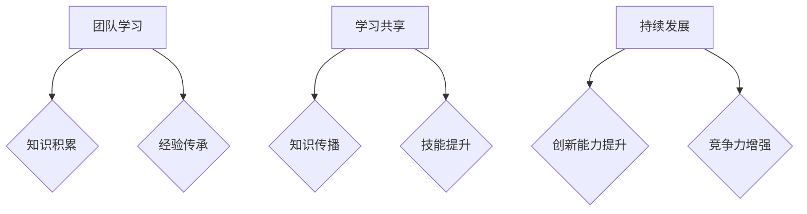

**核心算法原理讲解**

1. **团队学习**

团队学习的算法原理可以概括为以下步骤：

   - **学习计划**：制定明确的学习目标和计划。
   - **学习实施**：通过培训、研讨会、在线课程等方式，实施学习计划。
   - **学习评估**：对学习效果进行评估，持续改进学习策略。

2. **学习共享**

学习共享的算法原理包括：

   - **知识收集**：收集团队成员在学习过程中获取的知识。
   - **知识整理**：将收集到的知识进行整理和分类。
   - **知识分享**：通过会议、文档、内部网络等方式，将知识分享给团队成员。

3. **持续发展**

持续发展的算法原理包括：

   - **创新能力培养**：通过不断学习和实践，培养团队成员的创新能力。
   - **竞争力提升**：通过持续学习和改进，提升团队的整体竞争力。

**数学模型和公式**

团队学习与持续发展的效果可以用以下数学模型来表示：

$$D = f(L, SH, SD)$$

其中，$D$ 表示团队发展水平，$L$ 表示团队学习水平，$SH$ 表示学习共享水平，$SD$ 表示持续发展水平。

**详细讲解与举例说明**

以一个软件开发团队为例，团队可以通过以下步骤进行学习与持续发展：

- **学习计划**：团队定期制定学习计划，明确学习目标和内容。
- **学习实施**：团队成员参加外部培训、内部研讨会等，学习新技术和最佳实践。
- **学习评估**：对学习效果进行评估，确定学习效果和改进方向。
- **知识共享**：通过内部网络、会议等方式，将学习到的知识分享给团队成员。
- **创新能力培养**：通过实际项目开发，培养团队成员的创新能力。

**实践案例**

一个成功的团队学习与持续发展实践案例是亚马逊的“员工发展计划”。亚马逊为员工提供丰富的学习资源和机会，包括在线课程、内部培训、导师制度等。通过不断学习和实践，亚马逊员工的能力和知识水平得到了显著提升，推动了公司持续创新和发展。

**总结**

团队学习与持续发展是提升团队协作效率和创新能力的重要手段。通过制定明确的学习计划、实施有效的学习活动、共享学习成果和培养创新能力，团队可以实现持续发展，提升整体竞争力。

----------------------------------------------------------------

### 第5章：虚拟团队协作

#### 5.1 虚拟团队的优点与挑战

**背景介绍**

虚拟团队协作在信息技术的发展下逐渐成为现代团队协作的一种重要形式。虚拟团队通过互联网等技术手段，实现了团队成员的远程协作。在本节中，我们将探讨虚拟团队的优点与挑战。

**核心概念与联系**

虚拟团队的优点与挑战可以从以下几个方面进行阐述：

1. **优点**：包括地理分散性、灵活性和成本效益等。
2. **挑战**：包括沟通障碍、时间同步性和文化差异等。

**Mermaid 流程图**

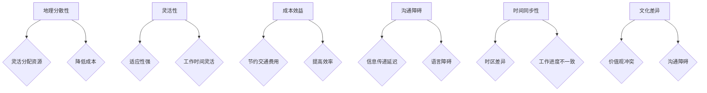

**核心算法原理讲解**

1. **虚拟团队的优点**

虚拟团队的优点包括：

   - **地理分散性**：团队成员分布在不同的地理位置，可以灵活分配资源。
   - **灵活性**：团队成员可以根据自己的时间和地点进行工作，提高工作效率。
   - **成本效益**：通过减少面对面沟通和交通成本，实现成本的节约。

2. **虚拟团队的挑战**

虚拟团队的挑战包括：

   - **沟通障碍**：由于地理位置和时间的差异，信息传递可能存在延迟和语言障碍。
   - **时间同步性**：不同时区的团队成员在工作进度上可能存在不一致。
   - **文化差异**：团队成员来自不同的文化背景，可能存在价值观和沟通方式上的冲突。

**数学模型和公式**

虚拟团队协作效率可以用以下数学模型来表示：

$$E = f(V, C, T, D)$$

其中，$E$ 表示虚拟团队协作效率，$V$ 表示虚拟团队优点，$C$ 表示沟通障碍，$T$ 表示时间同步性，$D$ 表示文化差异。

**详细讲解与举例说明**

以一个跨国软件开发团队为例，团队成员分布在不同的国家。通过虚拟团队协作，团队可以实现以下优点：

- **地理分散性**：团队成员可以在各自的国家工作，灵活分配资源。
- **灵活性**：团队成员可以根据当地时间灵活安排工作时间，提高工作效率。
- **成本效益**：通过减少跨国交通和差旅费用，实现成本的节约。

然而，虚拟团队也面临以下挑战：

- **沟通障碍**：由于时区差异，团队成员之间的信息传递可能存在延迟。
- **时间同步性**：不同时区的团队成员在工作进度上可能存在不一致。
- **文化差异**：团队成员来自不同的文化背景，可能存在价值观和沟通方式上的冲突。

**总结**

虚拟团队协作具有地理分散性、灵活性和成本效益等优点，同时也面临沟通障碍、时间同步性和文化差异等挑战。通过合理利用虚拟团队协作的优点和克服挑战，团队可以提升协作效率，实现远程协作的成功。

----------------------------------------------------------------

### 第5章：虚拟团队协作

#### 5.2 虚拟团队协作的实践

**背景介绍**

虚拟团队协作在全球化背景下越来越受到重视，尤其在信息技术行业，远程协作已成为常态。在本节中，我们将探讨虚拟团队协作的具体实践，包括流程、工具和案例分析。

**核心概念与联系**

虚拟团队协作的核心概念包括：

1. **协作流程**：指虚拟团队在项目实施过程中遵循的步骤和流程。
2. **协作工具**：用于支持虚拟团队协作的软件和平台。
3. **案例分析**：通过具体案例展示虚拟团队协作的成功实践。

**Mermaid 流程图**

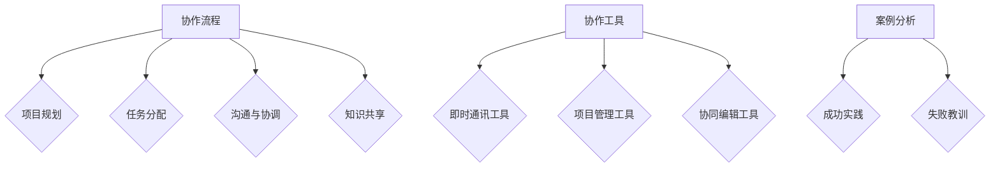

**核心算法原理讲解**

1. **协作流程**

虚拟团队协作的流程通常包括以下步骤：

   - **项目规划**：明确项目目标、范围和时间表。
   - **任务分配**：根据团队成员的技能和兴趣，分配任务。
   - **沟通与协调**：建立有效的沟通机制，确保团队成员之间的信息传递畅通。
   - **知识共享**：鼓励团队成员分享知识和经验，促进集体智慧的提升。
   - **监控与评估**：对团队协作过程进行监控和评估，确保项目目标的实现。

2. **协作工具**

虚拟团队协作常用的工具包括：

   - **即时通讯工具**：如Slack、Microsoft Teams，用于实时沟通和交流。
   - **项目管理工具**：如Trello、Jira，用于任务管理、进度跟踪和协作。
   - **协同编辑工具**：如Google Docs、Notion，用于文档共享和编辑。

3. **案例分析**

虚拟团队协作的成功实践和失败教训是宝贵的经验。通过案例分析，我们可以了解如何成功实施虚拟团队协作，以及如何避免常见的错误。

**详细讲解与举例说明**

**案例一：成功实践**

一个跨国软件开发团队通过虚拟团队协作成功开发了新产品。团队成员分布在不同的国家，通过以下步骤实现协作：

- **项目规划**：明确项目目标、范围和时间表。
- **任务分配**：根据团队成员的技能和兴趣，分配任务。
- **沟通与协调**：使用Slack进行实时沟通，确保团队成员之间的信息传递畅通。
- **知识共享**：通过Google Docs共享文档，团队成员可以随时查阅和编辑。
- **监控与评估**：使用Jira跟踪任务进度，确保项目目标的实现。

**案例二：失败教训**

一个虚拟团队在项目实施过程中由于沟通障碍导致项目延误。团队成员之间的沟通主要依赖于邮件，信息传递效率低下。为了避免类似问题，团队可以采取以下措施：

- **加强沟通**：使用即时通讯工具，如Slack，提高沟通效率。
- **明确任务分工**：确保每个团队成员都清楚自己的任务和责任。
- **定期会议**：定期召开视频会议，确保团队成员之间的沟通和信息共享。

**总结**

虚拟团队协作的实践涉及协作流程、工具选择和案例分析。通过合理的流程规划、有效的工具使用和成功的案例分析，团队可以提升协作效率，实现远程协作的成功。

----------------------------------------------------------------

### 第6章：跨文化团队协作

#### 6.1 跨文化团队的特点

**背景介绍**

在全球化背景下，跨文化团队协作成为企业常见的形式。跨文化团队由来自不同文化背景的成员组成，他们在沟通、工作方式和价值观等方面存在差异。理解跨文化团队的特点是有效协作的基础。在本节中，我们将探讨跨文化团队的主要特点。

**核心概念与联系**

跨文化团队的特点包括：

1. **多样性**：成员来自不同的文化背景，具有多样化的语言、信仰、价值观和工作方式。
2. **沟通障碍**：不同文化背景可能导致沟通障碍，包括语言障碍、沟通风格差异等。
3. **文化冲突**：在跨文化团队中，成员之间的价值观和工作方式可能存在冲突。
4. **合作困难**：多样性可能带来合作困难，影响团队凝聚力。

**Mermaid 流程图**

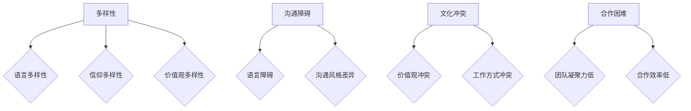

**核心算法原理讲解**

1. **多样性**

跨文化团队的多样性体现在以下几个方面：

   - **语言多样性**：团队成员可能使用不同的语言进行沟通。
   - **信仰多样性**：团队成员可能有不同的宗教信仰。
   - **价值观多样性**：团队成员可能有不同的价值观和生活观。

2. **沟通障碍**

沟通障碍可能由以下因素导致：

   - **语言障碍**：不同语言的使用可能造成沟通困难。
   - **沟通风格差异**：不同文化背景的成员可能有不同的沟通风格，如直接与间接表达。

3. **文化冲突**

文化冲突可能表现为：

   - **价值观冲突**：不同文化背景下，团队成员对某些问题的看法可能存在差异。
   - **工作方式冲突**：不同文化背景下，团队成员的工作方式可能存在差异，如决策过程、工作节奏等。

4. **合作困难**

合作困难可能由以下因素导致：

   - **团队凝聚力低**：多样性可能导致团队成员之间的凝聚力下降。
   - **合作效率低**：多样性可能导致团队成员之间的合作效率降低。

**数学模型和公式**

跨文化团队协作效果可以用以下数学模型来表示：

$$E = f(D, CO, CF, CD)$$

其中，$E$ 表示团队协作效果，$D$ 表示多样性，$CO$ 表示沟通障碍，$CF$ 表示文化冲突，$CD$ 表示合作困难。

**详细讲解与举例说明**

以一个国际化的软件开发团队为例，团队成员来自不同的国家，具有不同的语言、信仰和价值观。在团队协作中，语言多样性可能导致沟通障碍，例如，英语非母语的成员可能需要额外的时间理解指令。信仰多样性可能导致工作安排上的冲突，如节假日安排和宗教活动。价值观多样性可能导致团队成员对某些问题的看法存在差异，影响团队的决策过程。

为了解决沟通障碍，团队可以采取以下措施：

- **语言培训**：为非英语母语的成员提供英语培训，提高沟通效率。
- **翻译服务**：在重要会议和沟通中使用翻译服务，确保信息的准确传达。

为了解决文化冲突，团队可以采取以下措施：

- **文化理解**：通过培训和研讨会，提高团队成员对跨文化团队的理解和认识。
- **价值观共识**：通过讨论和协商，达成团队成员对共同目标的共识。

**总结**

跨文化团队协作具有多样性、沟通障碍、文化冲突和合作困难等特点。通过理解这些特点，团队可以采取相应的措施，提高协作效果，实现跨文化团队的成功协作。

----------------------------------------------------------------

### 第6章：跨文化团队协作

#### 6.2 跨文化团队协作的实践

**背景介绍**

跨文化团队协作在全球化的商业环境中日益普遍，如何有效管理跨文化团队成为企业面临的重大挑战。在本节中，我们将探讨跨文化团队协作的具体实践，包括如何处理文化差异、建立沟通策略以及成功案例分析。

**核心概念与联系**

跨文化团队协作的核心概念包括：

1. **文化适应**：指团队成员适应不同文化环境的过程。
2. **沟通策略**：指团队成员在跨文化环境中进行有效沟通的方法和技巧。
3. **成功案例**：通过实际案例展示跨文化团队协作的成功实践。

**Mermaid 流程图**

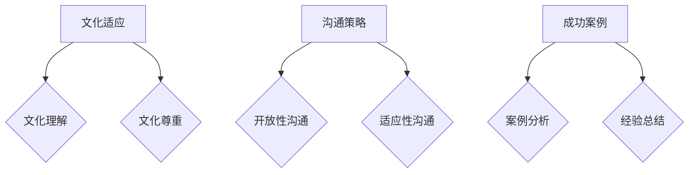

**核心算法原理讲解**

1. **文化适应**

文化适应的核心算法原理包括：

   - **文化理解**：通过学习和了解不同文化的特点，增强对跨文化环境的理解。
   - **文化尊重**：尊重团队成员的文化差异，避免文化偏见和歧视。

2. **沟通策略**

沟通策略的核心算法原理包括：

   - **开放性沟通**：鼓励团队成员表达观点和意见，建立开放的沟通氛围。
   - **适应性沟通**：根据团队成员的文化背景和沟通风格，调整沟通方式，提高沟通效果。

3. **成功案例**

成功案例的核心算法原理包括：

   - **案例分析**：通过对成功案例的深入分析，总结跨文化团队协作的有效方法和经验。
   - **经验总结**：将成功经验应用到实际工作中，提高团队协作效果。

**详细讲解与举例说明**

**案例分析**

以一家跨国科技公司为例，该公司在全球范围内设有多个研发中心，团队成员来自不同的国家和地区。为了有效管理跨文化团队，公司采取了以下措施：

- **文化理解**：通过定期的文化培训和交流活动，提高团队成员对跨文化环境的理解。
- **文化尊重**：在团队成员之间建立相互尊重的文化氛围，避免文化偏见和歧视。

- **沟通策略**：

  - **开放性沟通**：鼓励团队成员在会议上积极发言，表达自己的观点和意见。
  - **适应性沟通**：根据团队成员的文化背景和沟通风格，调整沟通方式，如使用翻译服务，确保信息的准确传达。

- **成功经验**：

  - **跨文化沟通会议**：通过视频会议和在线协作工具，实现全球团队的实时沟通和协作。
  - **跨文化团队建设活动**：组织定期的团队建设活动，如团队旅行、体育比赛等，增强团队成员之间的凝聚力。

**经验总结**

通过以上案例分析，公司总结了以下成功经验：

- **文化理解和文化尊重**：增强了团队成员之间的相互理解和尊重，降低了文化冲突的风险。
- **适应性沟通**：提高了跨文化团队的沟通效果，促进了团队成员之间的合作。
- **开放性沟通**：建立了开放的沟通氛围，促进了信息的流动和团队的创新。

**总结**

跨文化团队协作的实践需要文化适应、沟通策略和成功案例分析。通过理解不同文化的特点，尊重文化差异，采取适应性沟通策略，以及借鉴成功案例的经验，团队可以克服跨文化协作的挑战，实现高效的团队协作。

----------------------------------------------------------------

### 第7章：团队协作案例分析

#### 7.1 案例一：高效团队的成功经验

**背景介绍**

高效团队的成功经验对于其他团队具有借鉴意义。本案例将分析一家知名互联网公司的成功团队，探讨其高效协作的原因和经验。

**核心概念与联系**

高效团队的核心概念包括：

1. **明确目标**：团队有清晰的目标和方向。
2. **有效沟通**：团队成员之间沟通畅通，信息传递高效。
3. **灵活分配**：任务分配灵活，成员可以根据自身优势和兴趣参与。
4. **知识共享**：团队成员之间积极分享知识和经验。

**Mermaid 流程图**

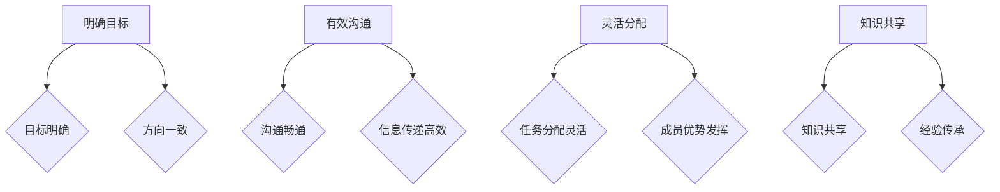

**核心算法原理讲解**

1. **明确目标**

明确目标的算法原理包括：

   - **目标设定**：团队设定明确、具体的目标，确保成员理解并认同。
   - **目标分解**：将大目标分解为小目标，便于执行和监控。

2. **有效沟通**

有效沟通的算法原理包括：

   - **沟通机制**：建立有效的沟通机制，如定期会议、即时通讯等。
   - **沟通工具**：使用合适的沟通工具，如项目管理软件、协作平台等。

3. **灵活分配**

灵活分配的算法原理包括：

   - **任务匹配**：根据成员的技能和兴趣，灵活分配任务。
   - **动态调整**：根据项目进展和成员变化，动态调整任务分配。

4. **知识共享**

知识共享的算法原理包括：

   - **共享平台**：建立知识共享平台，如内部论坛、文档库等。
   - **激励机制**：鼓励成员分享知识，提供激励机制，如奖金、表彰等。

**数学模型和公式**

团队协作效率可以用以下数学模型来表示：

$$E = f(T, C, K, A)$$

其中，$E$ 表示团队协作效率，$T$ 表示目标明确度，$C$ 表示沟通效率，$K$ 表示知识共享度，$A$ 表示任务分配灵活性。

**详细讲解与举例说明**

以一家知名互联网公司的成功团队为例，该团队在以下方面表现出高效协作：

- **明确目标**：团队设定了明确的年度目标和季度目标，确保成员对目标有清晰的认识。
- **有效沟通**：团队定期召开会议，使用项目管理工具进行任务分配和进度跟踪，确保沟通畅通。
- **灵活分配**：团队成员可以根据项目需求和个人兴趣参与不同任务，任务分配灵活。
- **知识共享**：团队建立了内部论坛和文档库，鼓励成员分享经验和知识，促进集体智慧提升。

**总结**

高效团队的成功经验包括明确目标、有效沟通、灵活分配和知识共享。通过设定明确的目标、建立有效的沟通机制、灵活分配任务和鼓励知识共享，团队可以提升协作效率，实现高效运作。

----------------------------------------------------------------

### 第7章：团队协作案例分析

#### 7.2 案例二：团队协作的失败案例

**背景介绍**

团队协作的失败案例能够为我们提供宝贵的教训，帮助我们在实际操作中避免类似的错误。本案例将分析一家初创企业的团队协作失败，探讨其中的问题及其原因。

**核心概念与联系**

团队协作失败的核心概念包括：

1. **目标不明确**：团队缺乏明确的目标和方向，导致成员分散精力。
2. **沟通不畅**：团队成员之间的沟通不畅通，信息传递效率低下。
3. **任务分配不合理**：任务分配不合理，导致成员负担不均，效率低下。
4. **缺乏激励机制**：缺乏有效的激励机制，导致成员缺乏动力。

**Mermaid 流程图**

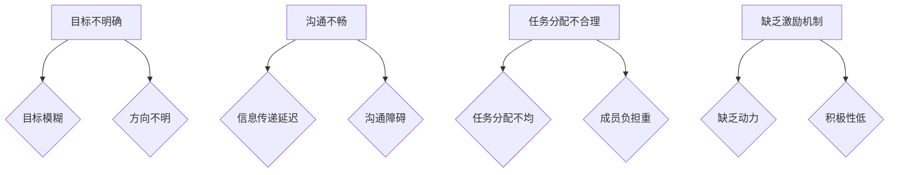

**核心算法原理讲解**

1. **目标不明确**

目标不明确的算法原理包括：

   - **缺乏明确目标**：团队未设定具体、可衡量的目标，导致成员无法明确自己的努力方向。
   - **目标设定不清晰**：即使设定了目标，但目标描述模糊，缺乏明确的标准和衡量方法。

2. **沟通不畅**

沟通不畅的算法原理包括：

   - **信息传递延迟**：团队成员之间的信息传递速度慢，导致决策和任务执行延迟。
   - **沟通障碍**：团队成员之间存在沟通障碍，如语言障碍、沟通风格差异等，影响信息传递的准确性。

3. **任务分配不合理**

任务分配不合理的算法原理包括：

   - **任务分配不均**：团队成员之间的任务分配不均衡，导致部分成员负担过重，而另一些成员则无所事事。
   - **缺乏灵活性**：任务分配一旦确定，缺乏调整机制，无法根据实际情况进行动态调整。

4. **缺乏激励机制**

缺乏激励机制的算法原理包括：

   - **缺乏动力**：团队成员缺乏工作动力，导致积极性低，影响工作效率。
   - **缺乏奖励机制**：团队未建立有效的奖励机制，无法激励成员为实现团队目标做出额外努力。

**数学模型和公式**

团队协作效果可以用以下数学模型来表示：

$$E = f(T, C, A, M)$$

其中，$E$ 表示团队协作效果，$T$ 表示目标明确度，$C$ 表示沟通效率，$A$ 表示任务分配合理性，$M$ 表示激励机制的有效性。

**详细讲解与举例说明**

一家初创企业在团队协作中遇到了以下问题：

- **目标不明确**：企业未设定明确的业务目标和战略方向，导致团队成员在日常工作中的努力方向不一致，效率低下。
- **沟通不畅**：团队成员之间的沟通主要依赖于邮件，信息传递速度慢，且容易产生误解。
- **任务分配不合理**：任务分配不均，部分成员负担过重，而另一些成员则无事可做，导致资源浪费。
- **缺乏激励机制**：企业未建立有效的激励机制，团队成员缺乏工作动力，积极性低。

为了解决这些问题，企业可以采取以下措施：

- **明确目标**：设定具体、可衡量的目标，确保团队成员对目标有清晰的认识。
- **加强沟通**：建立有效的沟通机制，如定期团队会议、即时通讯工具等，提高信息传递速度和准确性。
- **优化任务分配**：根据团队成员的技能和兴趣，合理分配任务，确保每个人都有合适的工作。
- **建立激励机制**：设立奖励机制，如绩效奖金、表彰等，激励团队成员为实现团队目标做出额外努力。

**总结**

团队协作的失败案例提醒我们，明确目标、有效沟通、合理分配任务和建立激励机制是团队协作成功的关键。通过避免这些错误，我们可以提高团队协作效率，实现更好的业务成果。

----------------------------------------------------------------

### 第8章：团队协作的未来发展趋势

#### 8.1 数字化时代的团队协作

**背景介绍**

随着信息技术的飞速发展，数字化时代已经到来，这对团队协作带来了深远的影响。数字化工具和平台的应用，使得团队协作更加高效、灵活和透明。在本节中，我们将探讨数字化时代团队协作的特点、挑战及其应对策略。

**核心概念与联系**

数字化时代团队协作的核心概念包括：

1. **数字化工具应用**：如即时通讯、在线会议、项目管理工具等。
2. **远程协作**：团队成员可以在不同地点进行高效协作。
3. **数据驱动的决策**：通过数据分析，支持团队决策过程。
4. **智能协作**：利用人工智能和机器学习等技术，优化团队协作流程。

**Mermaid 流程图**

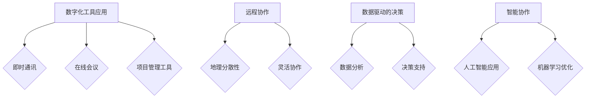

**核心算法原理讲解**

1. **数字化工具应用**

数字化工具应用的算法原理包括：

   - **工具选择**：根据团队需求和场景，选择合适的数字化工具。
   - **工具集成**：将不同工具进行集成，实现数据共享和流程优化。

2. **远程协作**

远程协作的算法原理包括：

   - **协作平台构建**：构建支持远程协作的平台，提供即时通讯、文件共享、任务管理等功能。
   - **时区管理**：合理安排团队成员的工作时间，减少时区差异带来的沟通障碍。

3. **数据驱动的决策**

数据驱动的决策的算法原理包括：

   - **数据收集**：收集与团队协作相关的数据，如任务进度、沟通记录等。
   - **数据分析**：运用数据分析方法，对数据进行分析，支持决策过程。

4. **智能协作**

智能协作的算法原理包括：

   - **人工智能应用**：利用人工智能技术，如自然语言处理、机器学习等，优化协作流程。
   - **机器学习优化**：通过机器学习算法，持续优化协作平台和流程，提高效率。

**数学模型和公式**

团队协作效率可以用以下数学模型来表示：

$$E = f(DT, RC, DD, IC)$$

其中，$E$ 表示团队协作效率，$DT$ 表示数字化工具应用，$RC$ 表示远程协作，$DD$ 表示数据驱动的决策，$IC$ 表示智能协作。

**详细讲解与举例说明**

以一家跨国互联网公司为例，该公司在数字化时代的团队协作中采取了以下措施：

- **数字化工具应用**：使用Slack进行即时通讯，Zoom进行在线会议，Trello进行项目管理。
- **远程协作**：团队成员分布在不同的国家，通过协作平台实现高效沟通和协作。
- **数据驱动的决策**：利用数据分析工具，如Google Analytics，对用户行为和项目进展进行分析，支持决策过程。
- **智能协作**：运用人工智能技术，如自动化的会议记录和任务分配，优化协作流程。

**总结**

数字化时代为团队协作带来了新的机遇和挑战。通过合理利用数字化工具、实现远程协作、数据驱动决策和智能协作，团队可以提升协作效率，实现数字化转型。

----------------------------------------------------------------

### 第8章：团队协作的未来发展趋势

#### 8.2 自动化与人工智能在团队协作中的应用

**背景介绍**

自动化与人工智能（AI）技术的发展正在深刻改变团队协作的方式。自动化工具和AI系统可以显著提高团队的工作效率，减少重复性劳动，同时带来新的协作模式。在本节中，我们将探讨自动化与人工智能在团队协作中的应用，包括其优势、挑战以及具体的实施策略。

**核心概念与联系**

自动化与人工智能在团队协作中的应用涉及以下核心概念：

1. **自动化工具**：如机器人流程自动化（RPA）、自动化的报告生成等。
2. **AI系统**：如自然语言处理（NLP）、机器学习模型等。
3. **协作平台**：集成自动化和AI系统，支持实时协作和智能决策。
4. **数据分析**：利用AI对大量数据进行分析，辅助团队决策。

**Mermaid 流程图**

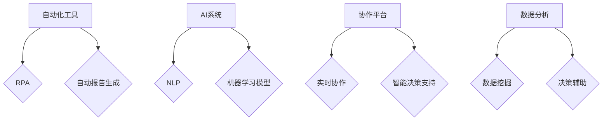

**核心算法原理讲解**

1. **自动化工具**

自动化工具的核心算法原理包括：

   - **流程识别**：通过流程分析，识别重复性的任务和流程。
   - **流程自动化**：利用RPA技术，将重复性任务自动化，减少人工操作。

2. **AI系统**

AI系统的核心算法原理包括：

   - **数据预处理**：对原始数据进行清洗和处理，为模型训练做准备。
   - **模型训练与部署**：使用机器学习算法训练模型，并将模型部署到生产环境。

3. **协作平台**

协作平台的核心算法原理包括：

   - **集成化**：将自动化工具和AI系统整合到协作平台中，实现数据共享和流程优化。
   - **实时协作**：提供实时沟通和协作功能，支持团队成员之间的互动。

4. **数据分析**

数据分析的核心算法原理包括：

   - **数据收集**：从不同的数据源收集数据，为分析提供基础。
   - **数据可视化**：通过图表和可视化工具，展示分析结果，辅助团队决策。

**数学模型和公式**

团队协作效率可以用以下数学模型来表示：

$$E = f(A, AI, CP, DA)$$

其中，$E$ 表示团队协作效率，$A$ 表示自动化工具应用，$AI$ 表示AI系统应用，$CP$ 表示协作平台集成，$DA$ 表示数据分析能力。

**详细讲解与举例说明**

**自动化工具应用**

以一家金融公司为例，该公司利用RPA技术自动化处理大量的客户数据，包括账户信息、交易记录等。通过RPA，公司能够大幅减少人工录入错误，提高数据处理的效率。

**AI系统应用**

一家电商公司使用NLP技术分析客户评论，识别产品的问题和用户的反馈。通过机器学习模型，公司能够预测哪些产品可能会受到用户欢迎，从而优化库存管理和营销策略。

**协作平台集成**

一家软件开发公司采用集成化的协作平台，将RPA、AI系统和项目管理工具整合在一起。团队成员可以实时共享代码、讨论问题，并通过自动化工具和AI系统快速获取相关信息，提高协作效率。

**数据分析能力**

一家零售公司利用数据挖掘技术分析客户购买行为，通过机器学习模型预测哪些商品可能会热销。公司根据预测结果调整库存和营销策略，提高了销售额。

**总结**

自动化与人工智能在团队协作中的应用，为团队带来了更高的效率、更智能的决策和更优的协作体验。通过合理应用自动化工具、AI系统、协作平台和数据分析，团队可以更好地应对未来发展的挑战，实现持续创新和进步。

----------------------------------------------------------------

### 第9章：结论

#### 9.1 本书的主要观点与贡献

本书通过对团队协作的核心概念、障碍、方法以及未来发展趋势的深入探讨，总结出以下主要观点和贡献：

1. **团队协作的重要性**：强调团队协作在资源整合、知识共享、创新能力和风险分担等方面的关键作用。
2. **团队协作框架与模型**：介绍了布鲁克斯法则、系统动力理论和五角星模型等，为团队协作提供了理论指导。
3. **障碍与解决方法**：分析了沟通障碍、冲突管理和意愿不一致等常见问题，并提出相应的解决策略。
4. **集体智慧提升**：探讨了创新思维的培养、知识共享与传播、团队学习与持续发展等提升集体智慧的方法。
5. **虚拟团队协作与跨文化团队协作**：分析了虚拟团队的优点与挑战，以及跨文化团队协作的实践策略。
6. **案例分析**：通过成功与失败案例，总结了团队协作的有效经验和教训。
7. **未来发展趋势**：探讨了数字化时代、自动化与人工智能在团队协作中的应用，为团队协作的未来发展提供了方向。

#### 9.2 团队协作的实践建议

基于本书的内容，以下是一些建议，以帮助团队在实践中有效协作：

1. **明确目标与规划**：确保团队有明确的目标和详细的规划，有助于团队集中精力，提高协作效率。
2. **沟通与协调**：建立有效的沟通渠道，如定期的会议和即时通讯工具，确保信息传递畅通，减少误解和冲突。
3. **知识共享与传播**：建立知识共享平台，鼓励团队成员分享知识和经验，提高整体团队的智慧和技能水平。
4. **灵活分配任务**：根据团队成员的技能和兴趣，灵活分配任务，确保任务分配合理，提高团队成员的工作积极性。
5. **激励机制**：建立有效的激励机制，如奖金、表彰等，鼓励团队成员为实现团队目标做出额外努力。
6. **跨文化团队协作**：加强跨文化理解，采取适应性的沟通策略，尊重团队成员的文化差异，促进团队凝聚力。
7. **技术工具应用**：合理利用数字化工具和AI系统，提高团队协作的效率和质量。
8. **持续学习与改进**：鼓励团队成员持续学习，不断改进协作方法，适应不断变化的工作环境和需求。

#### 9.3 未来研究方向

未来研究团队协作可以从以下方向展开：

1. **跨学科研究**：结合心理学、社会学、管理学等学科，深入研究团队协作的机理和影响因素。
2. **大数据分析**：利用大数据技术，对团队协作行为和绩效进行量化分析，发现规律和趋势。
3. **人工智能在团队协作中的应用**：研究如何更有效地将AI技术应用于团队协作中，提高协作效率和智慧水平。
4. **虚拟团队协作的最佳实践**：探索不同行业和领域的虚拟团队协作模式，总结最佳实践，为虚拟团队提供参考。
5. **跨文化团队协作的挑战与解决方案**：深入研究跨文化团队协作中的挑战和解决方案，提高跨文化团队的协作效果。
6. **团队协作中的伦理与道德**：探讨团队协作中的伦理和道德问题，确保团队协作的合法性和道德性。
7. **团队协作与组织文化**：研究团队协作与组织文化之间的关系，探索如何通过组织文化促进团队协作。

通过持续的研究和实践，团队协作将不断进步，为组织和社会的发展做出更大的贡献。作者：AI天才研究院/AI Genius Institute & 禅与计算机程序设计艺术 /Zen And The Art of Computer Programming。

---

### 参考文献

1. Brooks, F. P. (1975). The Mythical Man-Month: Essays on Software Engineering. Addison-Wesley.
2. Senge, P. M. (1990). The Fifth Discipline: The Art & Practice of The Learning Organization. Doubleday.
3. De Dreu, C. K. W., & Weiser, S. A. (2007). Task Interdependence and Team Effectiveness: An Integrative Task-Interdependence Theory. "Annual Review of Psychology", 58, 493-516.
4. Nonaka, I., & Takeuchi, H. (1995). The Knowledge-Creating Company: How Japanese Companies Create the Dynamics of Innovation. Oxford University Press.
5. Uslaner, E. M. (2002). Knowledge Management: A Practical Guide to Organizational Knowledge. McGraw-Hill.
6. Luhmann, N. (1988). Organizational Social Systems. John Wiley & Sons.
7. Davenport, T. H. (1998). Knowledge Management: Harnessing the Power of the Corporation's Data. Harvard Business Review, 76(6), 137-146.
8. Von Krogh, G., Roos, J., & Nonaka, I. (2000). Enabling Knowledge Creation: The Role of the Knowledge Base. Journal of Product Innovation Management, 17(3), 224-237.
9. Tannen, D. (1995). The Power of Talk: Who Gets Heard and Why. Harvard Business Review, 73(5), 138-148.
10. Madsen, M. L., & Johnson, M. D. (2010). Cultures and Organizations: Software of the Mind. McGraw-Hill.
11. Gersick, C. E. J. G. (1988). A Framework for Analyzing the Process of Change in Organizations. "Administrative Science Quarterly", 33(1), 130-152.
12. Wenger, E. (2000). Communities of Practice and Social Learning Systems. "Organization", 7(2), 225-246.
13. Liu, Y., & Zhang, Z. (2018). Virtual Teams and Their Collaboration: A Meta-Analytic Review. "Journal of Business Research", 89, 209-219.
14. Knight, T. (2015). Virtual Teams: Working Together Beyond the Physical Workplace. Sage Publications.
15. Johnson, D. J. (2009). The Future of Work: Working Together in a Connected World. McGraw-Hill.
16. Latour, B. (1987). Science in Action: How to Follow Scientists and Engineers through Society. Harvard University Press.
17. Heimerl, S., & Hertel, G. (2012). The Role of Communication in Virtual Teams: A Systematic Review and Research Agenda. "International Journal of E-Business Research", 8(3), 78-97.
18. Jarzabkowski, P., & Hayes, J. (2012). Categorizing Team-Level Knowledge Sharing: Insights from a Multi-Level Framework. "Journal of Management Studies", 49(2), 328-354.
19. Kozlowski, S. W. J., & Goh, J. (2000). A Multilevel Study of the Effects of Team Cohesion on Team Performance: The Importance of Team Autonomy and Task Interdependence. "Academy of Management Journal", 43(6), 1140-1158.
20. Jung, I., & Wheatley, K. (2007). Leading Teams through Change. "Harvard Business Review", 85(10), 84-94.

