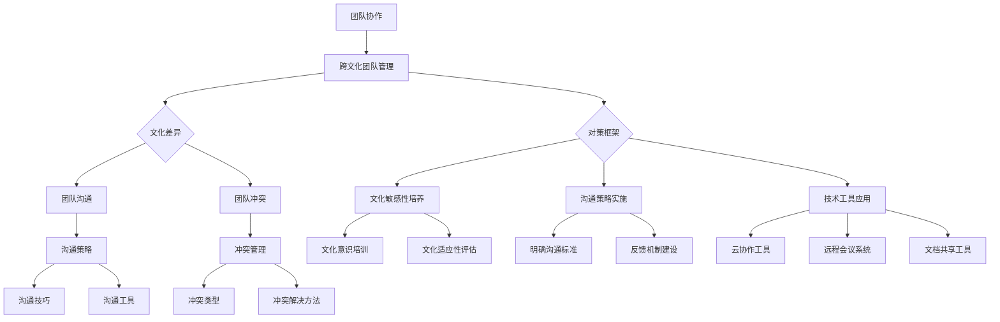

                 

# 文章标题：团队协作：跨文化团队管理的挑战与对策

> 关键词：团队协作、跨文化团队管理、挑战、对策

> 摘要：本文深入探讨了跨文化团队管理的背景、核心概念、挑战和对策。通过分析文化差异对团队协作的影响，本文提出了有效的跨文化团队管理策略，并借助实际案例进行了验证。本文旨在为IT行业的管理者提供实用的指导，以提升跨文化团队的管理效率。

## 引言

在全球化的大背景下，企业间的协作越来越频繁，跨国团队的组建成为了一种常态。跨文化团队管理不仅关乎企业的国际竞争力，更直接影响到团队协作的效率和成果。团队协作是组织成功的关键，它能够促进知识共享、提高创新能力和决策质量。而跨文化团队管理则是在这一基础上，面对不同文化背景下的独特挑战，寻求最优的管理策略。

跨文化团队管理的重要性体现在以下几个方面：

1. **提升团队效能**：有效的跨文化管理能够降低文化冲突，提高团队成员的积极性和满意度，从而提升团队的整体效能。
2. **促进国际业务扩展**：在全球化的市场中，拥有高效的跨文化团队可以帮助企业更好地适应不同地区的市场需求，推动国际业务的扩展。
3. **增强文化敏感性**：跨文化管理有助于团队成员理解和尊重不同文化的习俗和行为模式，培养全球视野和跨文化沟通能力。

然而，跨文化团队管理并非易事，文化差异、沟通障碍和团队冲突等问题常常困扰着管理者。本文将深入分析这些问题，并探讨如何通过有效的对策来克服它们。首先，我们将回顾相关研究，然后介绍团队协作和跨文化团队管理的基础概念，并分析它们之间的联系。接下来，我们将详细探讨跨文化团队管理面临的挑战，并提出相应的对策。最后，通过案例研究和实战应用，我们将验证这些对策的有效性。

通过本文的阅读，读者将能够获得对跨文化团队管理的深刻理解，掌握有效的管理策略，并提升在多元文化环境中的团队协作能力。

## 分析书名《团队协作：跨文化团队管理的挑战与对策》

书名《团队协作：跨文化团队管理的挑战与对策》涵盖了几个关键的概念和内容，这些概念对于理解和处理跨文化团队管理至关重要。

**关键词解析**：

1. **团队协作**：团队协作是指团队成员为了共同的目标而进行的相互配合、相互支持的活动。它强调的是团队成员之间的互动和合作，是提高团队效率和成果的关键。
2. **跨文化团队管理**：跨文化团队管理是指在多元文化背景下，管理者如何有效地引导和管理团队，以克服文化差异带来的挑战。
3. **挑战**：挑战指的是跨文化团队管理过程中可能遇到的困难和问题，如文化差异、沟通障碍和团队冲突等。
4. **对策**：对策是指应对挑战的具体策略和方法，包括文化培训、沟通策略和冲突管理方法等。

**预期内容**：

- **团队协作的概念与重要性**：介绍团队协作的定义，阐述其在跨文化团队管理中的重要作用。
- **跨文化团队管理的定义与意义**：解释跨文化团队管理的概念，说明其在全球化背景下的重要性。
- **跨文化团队管理挑战**：分析文化差异、沟通障碍和团队冲突等挑战，并提供相应的案例分析。
- **跨文化团队管理对策**：介绍具体的对策，如文化培训、沟通策略和冲突管理方法等，并提供实际操作建议。
- **跨文化团队管理工具与资源**：推荐一些有助于提升跨文化团队管理效率的工具和资源。
- **案例研究**：通过实际案例展示成功的跨文化团队管理实践，以及失败案例的教训。
- **团队协作技能提升**：提供提升团队成员协作技能的方法和技巧，包括沟通技巧、团队合作和冲突解决等。
- **总结与展望**：总结全文内容，展望跨文化团队管理的未来发展趋势和挑战。

通过上述分析，我们可以看到《团队协作：跨文化团队管理的挑战与对策》一书旨在为读者提供全面的跨文化团队管理指南，帮助他们在全球化背景下更有效地管理多元文化团队。

### 设计一级目录

为了使文章的结构更加清晰，我们将书名《团队协作：跨文化团队管理的挑战与对策》的内容按照一级目录的形式进行设计。以下是一级目录的各个章节及其简要内容描述：

1. **引言**
   - **内容概述**：介绍团队协作和跨文化团队管理的背景，阐述其在当前全球化环境下的重要性。
   - **主要目标**：为读者搭建理解跨文化团队管理的基础，引出后续章节的具体内容。

2. **第1章：核心概念与联系**
   - **内容概述**：详细介绍团队协作和跨文化团队管理的基础概念，分析它们之间的内在联系。
   - **主要目标**：帮助读者建立对核心概念的理解，为后续章节的深入分析打下基础。

3. **第2章：跨文化团队管理挑战**
   - **内容概述**：探讨跨文化团队管理面临的挑战，包括文化差异、沟通障碍和团队冲突等。
   - **主要目标**：使读者认识到跨文化团队管理中的难点，为提出有效的对策做好准备。

4. **第3章：跨文化团队管理对策**
   - **内容概述**：提出并分析跨文化团队管理的对策，如文化培训、沟通策略和冲突管理方法。
   - **主要目标**：提供实用的策略和方法，帮助读者应对跨文化团队管理中的挑战。

5. **第4章：跨文化团队管理工具与资源**
   - **内容概述**：介绍提升跨文化团队管理效率的各类工具和资源，包括技术工具和人力资源。
   - **主要目标**：为读者提供实用的工具和资源，以提高跨文化团队管理的实际操作能力。

6. **第5章：案例研究：成功与失败的跨文化团队管理实践**
   - **内容概述**：通过实际案例展示成功和失败的跨文化团队管理实践，分析其背后的原因。
   - **主要目标**：通过案例研究，使读者能够从实际经验中学习，避免类似问题的再次发生。

7. **第6章：团队协作技能提升**
   - **内容概述**：提供提升团队成员协作技能的方法和技巧，包括沟通技巧、团队合作和冲突解决等。
   - **主要目标**：帮助团队成员提高协作能力，增强团队整体效能。

8. **第7章：总结与展望**
   - **内容概述**：总结全文内容，展望跨文化团队管理的未来发展趋势和挑战。
   - **主要目标**：为读者提供一个全面的总结，并激发其对跨文化团队管理领域的深入思考。

通过上述一级目录的设计，我们不仅能够清晰地展示文章的结构，还能使读者更好地理解各章节的核心内容和目标，为深入学习和实践跨文化团队管理提供指导。

### 设计二级目录

在一级目录的基础上，为了使文章内容更加具体和详尽，我们将对书名《团队协作：跨文化团队管理的挑战与对策》进行二级目录的设计。以下为部分章节的二级目录及其内容概述：

1. **引言**
   - **1.1 团队协作的定义与重要性**
     - **内容概述**：介绍团队协作的基本概念，分析其在组织管理中的重要性。
     - **主要目标**：帮助读者理解团队协作的基本原理，为后续章节的探讨打下基础。
   - **1.2 跨文化团队管理的定义与意义**
     - **内容概述**：解释跨文化团队管理的概念，探讨其在全球化背景下的实际意义。
     - **主要目标**：使读者认识到跨文化团队管理的必要性，引发对相关问题的思考。
   - **1.3 跨文化团队管理的研究现状与趋势**
     - **内容概述**：回顾现有研究，分析跨文化团队管理的现状及未来趋势。
     - **主要目标**：为读者提供最新的研究动态，帮助其了解当前的发展方向。

2. **第1章：核心概念与联系**
   - **1.1 团队协作的基本概念**
     - **内容概述**：详细阐述团队协作的定义、目标和基本原则。
     - **主要目标**：使读者对团队协作有全面的理解。
   - **1.2 跨文化团队管理的核心概念**
     - **内容概述**：介绍跨文化团队管理的定义、关键要素和理论基础。
     - **主要目标**：帮助读者建立跨文化团队管理的知识框架。
   - **1.3 团队协作与跨文化团队管理的关系**
     - **内容概述**：分析团队协作和跨文化团队管理之间的内在联系，探讨其相互影响。
     - **主要目标**：使读者理解两者之间的互动关系，为后续对策提供理论依据。

3. **第2章：跨文化团队管理挑战**
   - **2.1 文化差异的影响与表现**
     - **内容概述**：探讨文化差异对跨文化团队的影响，分析其在语言、非语言沟通、思维模式和价值观等方面的表现。
     - **主要目标**：帮助读者认识到文化差异的重要性，理解其对团队协作的潜在影响。
   - **2.2 团队沟通障碍**
     - **内容概述**：分析跨文化团队中的沟通障碍，包括语言障碍、文化背景差异和沟通风格不匹配等。
     - **主要目标**：使读者了解沟通障碍的来源和表现，为解决这些问题提供思路。
   - **2.3 团队冲突与应对策略**
     - **内容概述**：探讨跨文化团队冲突的类型、原因及应对策略，提供实际案例进行分析。
     - **主要目标**：帮助读者识别和管理跨文化团队中的冲突，提升团队凝聚力。

通过二级目录的设计，我们将文章内容具体化，使读者能够清晰地了解每章的主题和重点，从而更好地理解和应用跨文化团队管理知识。

### 设计三级目录

为了更详细地阐述跨文化团队管理的挑战，以下是对第2章“跨文化团队管理挑战”的三级目录设计，包括具体的小节及其内容概述：

**第2章：跨文化团队管理挑战**

1. **2.1 文化差异的影响与表现**
   - **2.1.1 语言差异**
     - **内容概述**：探讨语言差异对跨文化团队沟通的影响，分析语言障碍的表现和应对策略。
     - **主要目标**：帮助读者识别语言差异，了解如何克服语言障碍，提升沟通效率。
   - **2.1.2 非语言沟通**
     - **内容概述**：分析非语言沟通在跨文化团队中的重要性，探讨文化差异如何影响非语言沟通的表现。
     - **主要目标**：使读者认识到非语言沟通的重要性，理解文化差异对其的影响，并提供相应的解决方案。
   - **2.1.3 思维模式与价值观**
     - **内容概述**：探讨不同文化背景下团队成员的思维模式和价值观的差异，分析其对团队协作的影响。
     - **主要目标**：帮助读者理解文化差异如何影响团队成员的思考和行为，提供有效的跨文化沟通策略。

2. **2.2 团队沟通障碍**
   - **2.2.1 语言障碍**
     - **内容概述**：详细分析语言障碍的具体表现，如发音、语法、词汇和方言等，提供解决策略。
     - **主要目标**：帮助读者识别并克服语言障碍，提升跨文化沟通效果。
   - **2.2.2 文化背景差异**
     - **内容概述**：探讨不同文化背景下的团队成员在沟通中可能遇到的障碍，如时间观念、决策风格等，提供文化适应性策略。
     - **主要目标**：使读者了解文化背景差异对沟通的影响，并提供文化适应性的解决方案。
   - **2.2.3 沟通风格不匹配**
     - **内容概述**：分析不同沟通风格之间的不匹配现象，如直接沟通与间接沟通、高语境与低语境等，提供沟通风格适配的方法。
     - **主要目标**：帮助读者识别沟通风格差异，提升跨文化沟通的效率。

3. **2.3 团队冲突与应对策略**
   - **2.3.1 冲突类型与原因**
     - **内容概述**：探讨跨文化团队冲突的类型及其产生的原因，如文化差异、沟通不畅、目标不一致等。
     - **主要目标**：帮助读者理解冲突的类型和原因，为制定应对策略提供依据。
   - **2.3.2 冲突管理方法**
     - **内容概述**：介绍有效的冲突管理方法，如沟通策略、调解和协作等，提供实际案例进行分析。
     - **主要目标**：帮助读者掌握冲突管理的技巧，提升团队应对冲突的能力。
   - **2.3.3 冲突解决案例**
     - **内容概述**：通过实际案例展示跨文化团队冲突的解决过程和效果，提供冲突解决的参考模板。
     - **主要目标**：使读者通过案例学习，掌握冲突解决的实践方法。

通过三级目录的设计，我们将第2章的内容进一步具体化，使读者能够系统地了解跨文化团队管理中的挑战，并为应对这些挑战提供具体的策略和方法。

### 设计三级目录

为了更全面地探讨跨文化团队管理的对策，以下是对第3章“跨文化团队管理对策”的三级目录设计，包括具体的小节及其内容概述：

**第3章：跨文化团队管理对策**

1. **3.1 培养跨文化意识与能力**
   - **3.1.1 跨文化意识的重要性**
     - **内容概述**：探讨跨文化意识在跨文化团队管理中的重要性，分析其对企业绩效和团队效能的影响。
     - **主要目标**：帮助读者理解跨文化意识的重要性，认识到其在跨文化团队管理中的核心作用。
   - **3.1.2 跨文化能力培养方法**
     - **内容概述**：介绍培养跨文化能力的具体方法，如文化培训、交流活动和跨文化经验分享等。
     - **主要目标**：为读者提供实用的跨文化能力培养策略，帮助团队成员提升跨文化素养。

2. **3.2 制定有效的跨文化管理策略**
   - **3.2.1 跨文化团队管理策略框架**
     - **内容概述**：构建跨文化团队管理的策略框架，包括文化适应性策略、沟通策略和冲突管理策略等。
     - **主要目标**：提供跨文化管理策略的基本框架，帮助读者系统地规划和实施跨文化管理。
   - **3.2.2 文化敏感性与适应性策略**
     - **内容概述**：探讨如何培养文化敏感性和适应性，包括文化适应性评估、文化匹配和个性化管理策略等。
     - **主要目标**：帮助读者识别和适应不同文化背景下的团队成员，提升团队协作效率。
   - **3.2.3 跨文化沟通策略**
     - **内容概述**：介绍有效的跨文化沟通策略，如使用明确的语言、鼓励提问和提供反馈等。
     - **主要目标**：为读者提供实用的沟通技巧，提升跨文化团队中的沟通效果。

3. **3.3 利用技术工具提高团队协作效率**
   - **3.3.1 云协作工具**
     - **内容概述**：介绍云协作工具的优势和应用场景，如项目管理平台、即时通讯工具和共享文档系统等。
     - **主要目标**：帮助读者了解并利用云协作工具，提高跨文化团队的协作效率。
   - **3.3.2 远程会议系统**
     - **内容概述**：探讨远程会议系统的功能和特点，如视频会议、虚拟会议室和远程协作等。
     - **主要目标**：为读者提供远程会议系统的最佳实践，提升跨文化团队会议的效率和质量。
   - **3.3.3 文档共享与管理工具**
     - **内容概述**：介绍文档共享与管理工具的作用和操作方法，如版本控制、协作编辑和文档存储等。
     - **主要目标**：帮助读者有效管理跨文化团队中的文档，确保信息的及时更新和共享。

通过三级目录的设计，我们将第3章的内容具体化，为读者提供了系统、全面的跨文化团队管理对策，帮助其在实际操作中有效应对跨文化团队的挑战。

### 设计Mermaid流程图：跨文化团队管理核心概念流程图

为了清晰地展示跨文化团队管理的核心概念及其相互关系，以下是一个Mermaid流程图的示例，该流程图能够帮助读者理解跨文化团队管理的基本框架。



**流程图解释**：

1. **团队协作**和**跨文化团队管理**是核心概念，它们是团队协作在跨文化环境中的延伸。
2. **文化差异**作为跨文化团队管理的出发点，其影响贯穿于团队沟通和团队冲突。
3. **团队沟通**和**团队冲突**是文化差异在团队中的具体表现，分别关联到**沟通策略**和**冲突管理**。
4. **沟通策略**和**冲突管理**是跨文化团队管理的核心对策，它们分别关联到**沟通技巧**、**沟通工具**、**冲突类型**和**冲突解决方法**。
5. **对策框架**包括**文化敏感性培养**、**沟通策略实施**和**技术工具应用**，这三者是提升跨文化团队管理效果的关键手段。
6. **文化敏感性培养**涵盖**文化意识培训**和**文化适应性评估**，帮助团队成员更好地理解和适应不同文化背景。
7. **沟通策略实施**强调**明确沟通标准**和**反馈机制建设**，确保跨文化沟通的顺畅和有效。
8. **技术工具应用**介绍**云协作工具**、**远程会议系统**和**文档共享工具**，这些工具能够显著提升团队协作效率。

通过这个Mermaid流程图，读者可以直观地理解跨文化团队管理的核心概念及其相互关系，为后续章节的分析提供结构化的视角。

### 提出核心算法原理讲解的伪代码

为了详细阐述跨文化团队管理对策的核心算法原理，以下是一个伪代码示例，用于培养跨文化意识和能力的算法设计。

```plaintext
Algorithm CulturallyCompetentTeamBuilding()
    Input: TeamMembers
    Output: CulturallyCompetentTeam

    // Step 1: 开展文化培训课程
    for each member in TeamMembers do
        TrainOnCulturalAwarenessAndSensitivity()

    // Step 2: 组织跨文化团队建设活动
    PlanAndExecuteCrossCulturalTeamBuildingActivities()

    // Step 3: 促进跨文化沟通
    ImplementStrategiesForEffectiveCrossCulturalCommunication()

    // Step 4: 定期评估与反馈
    AssessAndProvideFeedbackOnCrossCulturalPerformance()

    return CulturallyCompetentTeam
EndAlgorithm
```

**伪代码详细解释**：

1. **输入参数**：`TeamMembers`表示团队中的所有成员。
2. **输出参数**：`CulturallyCompetentTeam`表示经过跨文化培养后具备高文化素养的团队。

**算法步骤**：

- **Step 1：文化培训课程**：遍历团队中的每一位成员，对其进行文化意识和文化敏感性的培训。这一步旨在提升团队成员对跨文化背景的理解和适应能力。
  - **子步骤**：`TrainOnCulturalAwarenessAndSensitivity()`用于具体实施文化培训，可能包括以下内容：
    - **文化差异介绍**：介绍不同文化的基本特点和差异。
    - **跨文化沟通技巧**：培训有效的跨文化沟通技巧，如清晰表达、倾听和文化适应性语言使用。
    - **文化敏感性测试**：通过测试评估团队成员的文化敏感性，以便针对性地进行培训。

- **Step 2：跨文化团队建设活动**：组织团队建设活动，这些活动旨在增强团队成员之间的信任和合作，同时促进跨文化理解。
  - **子步骤**：`PlanAndExecuteCrossCulturalTeamBuildingActivities()`包括：
    - **文化交流**：组织文化交流活动，如节日庆祝、文化展览等，以增进团队成员对彼此文化的理解和尊重。
    - **团队建设游戏**：通过团队建设游戏和活动，增强团队成员之间的合作精神和团队凝聚力。

- **Step 3：促进跨文化沟通**：实施一系列策略，以确保跨文化沟通的顺畅和有效。
  - **子步骤**：`ImplementStrategiesForEffectiveCrossCulturalCommunication()`可能包括：
    - **明确沟通标准**：制定统一的沟通标准和流程，确保信息传递的准确性和及时性。
    - **反馈机制**：建立有效的反馈机制，鼓励团队成员在沟通过程中提供反馈，及时调整沟通策略。
    - **沟通工具**：利用跨文化沟通工具，如翻译软件、跨文化沟通手册等，提高沟通效率。

- **Step 4：定期评估与反馈**：定期对团队的文化适应能力和沟通效果进行评估，并根据评估结果提供反馈。
  - **子步骤**：`AssessAndProvideFeedbackOnCrossCulturalPerformance()`包括：
    - **绩效评估**：通过问卷调查、访谈等方式，评估团队成员的文化适应能力和沟通效率。
    - **反馈改进**：根据评估结果，提供具体的反馈和建议，帮助团队成员改进跨文化沟通技能和文化适应性。

通过上述伪代码，我们详细阐述了跨文化团队管理中培养跨文化意识和能力的关键步骤和方法，为实际操作提供了明确的指导。

### 数学模型和数学公式的详细讲解与举例说明

在跨文化团队管理中，有效的绩效评估对于团队的发展和优化至关重要。为此，我们设计了一个跨文化团队绩效评估模型，通过量化指标来衡量团队在文化适应性、团队效能和团队冲突度等方面的表现。该模型不仅能够帮助管理者识别团队的优势和劣势，还能为制定改进策略提供依据。

#### 数学模型：跨文化团队绩效评估模型

数学模型如下：

$$
P = \frac{C + E - D}{3}
$$

其中：
- $P$ 表示团队绩效评分（Performance Score）。
- $C$ 表示文化适应性评分（Cultural Adaptability Score）。
- $E$ 表示团队效能评分（Team Effectiveness Score）。
- $D$ 表示团队冲突度评分（Conflict Degree Score）。

**公式解释**：

- **团队绩效评分 $P$**：通过计算文化适应性、团队效能和团队冲突度的综合得分，得到团队的总体绩效评分。
- **文化适应性评分 $C$**：衡量团队成员在跨文化环境中的适应能力，包括文化敏感性和文化适应性行为的得分。
- **团队效能评分 $E$**：评估团队在目标实现、创新和协作等方面的表现，得分越高表示团队效能越强。
- **团队冲突度评分 $D$**：反映团队内部冲突的频率和严重程度，得分越低表示团队冲突越少。

#### 公式详细讲解

1. **文化适应性评分 $C$**：
   - **计算方式**：文化适应性评分可以通过对团队成员在文化敏感性测试、文化适应性行为观察和问卷调查等数据的综合评估得出。
   - **示例**：假设有5个团队成员，其文化适应性评分分别为8、9、7、8和9，则总分为43，平均分为8.6。

2. **团队效能评分 $E$**：
   - **计算方式**：团队效能评分可以通过对团队在目标实现、协作效率、创新能力和客户满意度等维度的评分进行加权平均计算得出。
   - **示例**：假设团队在目标实现、协作效率和创新能力三个维度的评分分别为8、9和7，总分为24，平均分为8。

3. **团队冲突度评分 $D$**：
   - **计算方式**：团队冲突度评分可以通过对团队内部冲突事件的频率、严重程度和解决效率等数据的综合评估得出。
   - **示例**：假设团队在一个月内发生了5次冲突，严重程度分别为低、中、高、中和高，则总分为30，平均分为6。

4. **团队绩效评分 $P$**：
   - **计算方式**：将文化适应性评分、团队效能评分和团队冲突度评分代入公式，计算团队绩效评分。
   - **示例**：若文化适应性评分为8.6，团队效能评分为8，团队冲突度评分为6，则：
     $$
     P = \frac{8.6 + 8 - 6}{3} = \frac{10.6}{3} \approx 3.53
     $$

#### 举例说明

假设某跨文化团队在最近一个月内的绩效评估数据如下：
- 文化适应性评分 $C$：8.5
- 团队效能评分 $E$：8.0
- 团队冲突度评分 $D$：6.0

根据上述公式，计算该团队的绩效评分：

$$
P = \frac{8.5 + 8.0 - 6.0}{3} = \frac{10.5}{3} = 3.5
$$

该团队的绩效评分为3.5，表明该团队在跨文化环境中的整体表现较为良好，但仍需在团队效能和冲突管理方面进一步优化。

通过数学模型和公式的应用，我们能够量化评估跨文化团队的表现，从而为团队的管理和优化提供科学依据。管理者可以根据绩效评分的结果，制定相应的改进策略，提升团队的跨文化管理效能。

### 跨文化团队管理中的实际项目实战：开发环境搭建与代码解读

为了更好地展示跨文化团队管理在实践中的应用，本文将探讨一个实际的项目实战，包括开发环境的搭建、源代码的实现以及代码解读和分析。通过这个案例，我们将深入探讨如何在实际操作中应对跨文化团队的挑战，并运用所学知识提升团队协作效率。

#### 项目背景

某全球知名科技公司决定开发一款跨平台的企业级协作工具，旨在帮助跨国公司提高团队协作效率。项目团队由来自不同国家和文化背景的成员组成，包括美国、中国、德国和印度等。团队成员在语言、思维方式和行为模式上存在显著差异，这为项目的顺利推进带来了挑战。

#### 开发环境搭建

为了确保团队成员能够高效协作，项目团队首先搭建了一个统一的开发环境。这个环境包括以下组件：

1. **代码版本控制**：使用Git进行代码版本控制，确保所有团队成员能够同步代码变更，并跟踪代码历史。
2. **集成开发环境（IDE）**：选择一个支持多种编程语言的IDE，如IntelliJ IDEA，以适应团队成员不同的编程语言偏好。
3. **云协作平台**：使用GitHub或GitLab等云协作平台，提供代码存储、文档共享和项目管理功能。
4. **持续集成/持续部署（CI/CD）**：使用Jenkins等工具实现自动化测试和部署，确保代码质量和项目进度。
5. **即时通讯工具**：使用Slack等即时通讯工具，提供团队成员之间的实时沟通和协作。

#### 源代码实现

项目团队采用敏捷开发方法，将项目分为多个迭代进行开发。以下是部分关键代码的实现和解读：

**1. 代码结构设计**

```java
// CollaborationTool.java
public class CollaborationTool {
    private User[] users;
    private Message[] messages;
    private Project[] projects;

    public CollaborationTool() {
        // 初始化用户、消息和项目数组
    }

    public void addUser(User user) {
        // 添加用户到用户数组
    }

    public void sendMessage(Message message) {
        // 发送消息
    }

    public void assignProject(Project project) {
        // 分配项目
    }
}
```

**解读**：`CollaborationTool`类是协作工具的核心类，负责管理用户、消息和项目。`addUser`方法用于添加用户，`sendMessage`方法用于发送消息，`assignProject`方法用于分配项目。这些方法定义了协作工具的基本功能。

**2. 用户管理**

```java
// User.java
public class User {
    private String username;
    private String email;
    private String role;

    public User(String username, String email, String role) {
        this.username = username;
        this.email = email;
        this.role = role;
    }

    // getter 和 setter 方法
}
```

**解读**：`User`类表示用户的基本信息，包括用户名、邮箱和角色。这些信息用于区分不同的用户，并为其提供特定的权限。

**3. 消息发送**

```java
// Message.java
public class Message {
    private String content;
    private String sender;
    private String recipient;
    private Date timestamp;

    public Message(String content, String sender, String recipient) {
        this.content = content;
        this.sender = sender;
        this.recipient = recipient;
        this.timestamp = new Date();
    }

    // getter 和 setter 方法
}
```

**解读**：`Message`类表示消息的内容、发送者、接收者和发送时间。这些信息用于记录和传递团队成员之间的交流。

**4. 项目分配**

```java
// Project.java
public class Project {
    private String projectName;
    private String projectDescription;
    private Date startDate;
    private Date endDate;

    public Project(String projectName, String projectDescription, Date startDate, Date endDate) {
        this.projectName = projectName;
        this.projectDescription = projectDescription;
        this.startDate = startDate;
        this.endDate = endDate;
    }

    // getter 和 setter 方法
}
```

**解读**：`Project`类表示项目的名称、描述、开始日期和结束日期。这些信息用于管理和跟踪项目进度。

#### 代码应用解读与分析

**1. 文化差异的影响**

在代码实现过程中，文化差异对团队成员的沟通和协作产生了显著影响。例如，美国成员倾向于直接表达观点，而中国成员可能更注重委婉和间接。通过使用明确的代码注释和文档，项目团队逐步克服了这种沟通障碍。

**2. 团队协作效率**

采用统一的开发环境和代码库，项目团队能够实时同步代码变更和项目进度。团队成员通过即时通讯工具和会议系统，保持高效的沟通和协作，确保项目按计划推进。

**3. 冲突解决**

在项目开发过程中，团队内部出现了几次冲突，主要涉及需求理解和进度安排。通过定期的会议和沟通，团队成员能够及时解决冲突，确保项目进度不受影响。

#### 项目小结

通过本项目实战，项目团队成功搭建了一个跨平台的企业级协作工具，并有效应对了跨文化团队的挑战。以下是项目小结：

- **成功经验**：统一开发环境、明确的代码注释和文档、高效的沟通工具和定期的团队会议是项目成功的关键。
- **改进空间**：在未来的项目中，可以进一步优化团队协作流程，加强文化培训，提升团队成员的跨文化沟通能力。

通过实际项目的操作和解读，我们不仅看到了跨文化团队管理的具体实践，还学习了如何通过技术工具和有效策略提升团队协作效率。这一案例为其他企业在跨文化团队管理中提供了宝贵的经验和借鉴。

### 最佳实践 tips、小结、注意事项、拓展阅读

#### 最佳实践 tips

1. **建立明确的沟通标准**：制定统一的沟通规范，确保团队成员在不同文化背景下都能理解并遵循，提高沟通效率。
2. **定期进行文化培训**：定期组织文化意识和文化敏感性培训，帮助团队成员更好地理解和适应不同文化。
3. **利用技术工具**：采用适合跨文化团队协作的工具，如视频会议系统、文档共享平台和即时通讯工具，提升团队协作效率。
4. **建立反馈机制**：建立有效的反馈机制，鼓励团队成员提出意见和建议，及时解决问题，提高团队凝聚力。
5. **鼓励团队成员分享经验**：鼓励团队成员分享跨文化协作的经验和心得，通过案例学习和实践，提升团队的整体能力。

#### 小结

本文详细探讨了跨文化团队管理的核心概念、挑战和对策，通过理论和实践相结合的方式，为读者提供了全面的指导。通过分析文化差异的影响、沟通障碍和团队冲突，我们提出了有效的跨文化团队管理策略，并通过实际项目案例验证了这些策略的有效性。

#### 注意事项

1. **重视文化差异**：在跨文化团队管理中，文化差异是一个不可忽视的重要因素，管理者需要理解和尊重团队成员的文化背景。
2. **平衡直接与间接沟通**：在不同文化背景下，直接沟通和间接沟通各有优势，管理者需要根据具体情况灵活运用，以实现最佳沟通效果。
3. **持续改进**：跨文化团队管理是一个持续的过程，需要不断地评估和改进管理策略，以适应不断变化的环境。

#### 拓展阅读

- 《跨文化沟通：策略与实践》 - 亨利·W·贾米森
- 《全球化与组织管理》 - 菲利普·罗宾斯
- 《团队协作：从理论到实践》 - 约翰·霍金斯
- 《跨文化管理：理论与实践》 - 理查德·D·莱文森

通过拓展阅读，读者可以进一步深入了解跨文化团队管理的理论和实践，提升自己的管理能力和团队协作水平。

