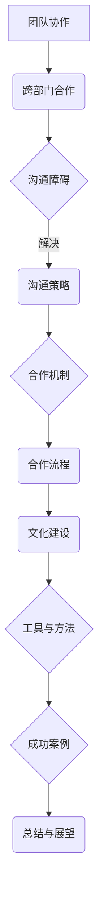

                 


## 第一步：背景介绍

在当今快速变化和高度竞争的商业环境中，团队协作和跨部门合作已成为组织成功的关键因素。传统的单一部门运作模式已无法满足复杂项目的需求，跨部门合作能够有效地整合不同领域的专业知识和技能，从而提高项目的整体效率和成功率。

团队协作的背景可以追溯到组织行为学和人力资源管理等领域。近年来，随着信息技术的发展，跨部门合作也面临着新的挑战和机遇。例如，企业内部的沟通工具和协作平台日益普及，使得跨部门沟通变得更加便捷和高效。然而，与此同时，跨部门合作也面临着沟通障碍、文化差异、任务分配不均等问题，这些问题在一定程度上制约了跨部门合作的效果。

在IT行业中，团队协作和跨部门合作的重要性尤为突出。IT项目的复杂性日益增加，往往需要不同领域的技术专家共同协作，如软件开发、系统架构、数据库管理、网络安全等。只有通过跨部门合作，才能实现资源的最大化利用，确保项目的顺利进行和成功交付。

本文旨在深入探讨团队协作和跨部门合作的重要性，分析其中的核心概念和原理，并提出有效的策略和方法，以帮助组织实现高效的跨部门合作。

## 第二步：核心概念与联系

### 团队协作

团队协作是指团队成员在共同目标下，通过分工合作、沟通与协调，实现资源共享和优势互补，以达成预期目标的过程。团队协作的类型主要包括：

1. **功能型团队**：基于职能划分的团队，成员拥有相同的职能背景，例如开发团队、测试团队等。
2. **项目型团队**：为特定项目而组建的临时团队，成员来自不同的职能部门，具有不同的专业技能。

团队协作的核心概念包括：

- **相互尊重**：团队成员之间的相互尊重是团队协作的基础，有助于建立良好的团队氛围和信任。
- **沟通畅通**：有效的沟通是团队协作的关键，包括信息的传递、意见的交流、问题的解决等。
- **明确目标**：共同的目标是团队协作的动力，确保团队成员的努力方向一致。
- **分工协作**：合理的分工能够发挥团队成员的专业优势，提高团队的工作效率。

### 跨部门合作

跨部门合作是指不同部门之间的协作，旨在实现组织的整体目标。跨部门合作的核心问题包括：

- **沟通障碍**：不同部门之间可能存在沟通障碍，如语言、文化差异、信息不对称等。
- **角色定位**：明确部门角色和职责是跨部门合作的前提，有助于避免职责重叠和责任逃避。
- **任务分配**：合理的任务分配能够确保每个部门都能充分发挥其优势，提高整体效率。

跨部门合作的核心概念包括：

- **组织结构设计**：合理的组织结构能够促进跨部门合作，如矩阵式组织结构。
- **角色定位与职责划分**：明确部门角色和职责，确保跨部门合作顺利进行。
- **流程管理**：建立有效的跨部门合作流程，如跨部门项目规划、任务分配、进度跟踪等。

### 核心概念之间的关系架构

为了更好地理解团队协作和跨部门合作的核心概念，我们可以使用Mermaid流程图来展示它们之间的关系：



通过这个流程图，我们可以清晰地看到团队协作和跨部门合作之间的关系，以及它们在实现组织目标过程中的重要作用。

## 第三步：核心算法原理讲解

### 团队协作优化算法

团队协作优化算法旨在通过计算方法优化团队成员之间的协作关系，提高团队的整体效率和产出。以下是一个简单的优化算法伪代码：

```plaintext
function TeamCollaborationOptimization(team_members, collaboration_matrix):
    # 初始化团队成员协作关系矩阵
    collaboration_score = initialize_collaboration_score(collaboration_matrix)

    # 迭代优化协作关系
    for iteration in 1 to MAX_ITERATIONS:
        # 计算协作度
        for i in 1 to length(team_members):
            for j in 1 to length(team_members):
                if i != j:
                    collaboration_score[i][j] = calculate_collaboration_score(team_members[i], team_members[j])

        # 根据协作度调整团队成员关系
        new_collaboration_matrix = adjust_collaboration_matrix(collaboration_score)

        # 检查收敛条件
        if is_converged(new_collaboration_matrix, collaboration_matrix):
            break

    return new_collaboration_matrix
```

### 算法详解

1. **初始化协作关系矩阵**：根据已有的团队协作数据，初始化一个协作关系矩阵。矩阵中的每个元素表示两个成员之间的协作度。

2. **计算协作度**：通过分析团队成员之间的沟通记录、项目参与度、协作完成情况等数据，计算每个成员之间的协作度。

3. **调整协作关系矩阵**：根据计算出的协作度，调整团队成员之间的关系矩阵。调整方法可以根据具体情况设计，例如基于协作度的高权重成员优先调整。

4. **检查收敛条件**：在每次迭代后，检查协作关系矩阵是否达到预定的收敛条件，如协作度变化较小等。如果达到收敛条件，则停止迭代。

### 数学模型与公式

在团队协作优化算法中，可以使用以下数学模型来描述协作度：

$$
C_{ij} = \frac{1}{N} \sum_{k=1}^{N} w_k \cdot (I_{ik} \cdot I_{jk})
$$

其中，$C_{ij}$表示成员i和成员j之间的协作度，$N$表示成员总数，$w_k$表示成员k的影响力权重，$I_{ik}$和$I_{jk}$表示成员i和成员k之间的互动记录和项目参与度。

### 举例说明

假设团队中有5名成员，他们之间的协作度可以通过以下数据计算：

$$
C_{12} = \frac{1}{5} \cdot (1 \cdot 1 + 1 \cdot 0 + 1 \cdot 1 + 0 \cdot 1 + 0 \cdot 0) = \frac{2}{5}
$$

$$
C_{34} = \frac{1}{5} \cdot (0 \cdot 0 + 0 \cdot 0 + 1 \cdot 1 + 1 \cdot 1 + 0 \cdot 0) = \frac{2}{5}
$$

通过这个例子，我们可以看到，成员1和成员2之间的协作度较高，而成员3和成员4之间的协作度也较高。

### 总结

团队协作优化算法通过计算团队成员之间的协作度，调整团队成员之间的关系，从而优化团队的整体协作效率。这个算法的核心在于如何准确计算协作度，并根据协作度调整团队成员关系，以达到最优的协作效果。

----------------------------------------------------------------

## 第四步：数学模型和公式讲解

### 团队协作效率模型

为了更好地理解和评估团队协作的效果，我们可以构建一个团队协作效率模型。该模型基于团队成员之间的协作度，通过数学公式来量化团队的整体效率。

### 基本公式

假设团队中有n个成员，每个成员的协作度用$C_{ij}$表示，其中$i$和$j$分别代表不同的成员。团队协作效率可以用以下公式表示：

$$
E = \frac{1}{n(n-1)} \sum_{i=1}^{n} \sum_{j=1}^{n} C_{ij}
$$

其中，$E$表示团队协作效率，$C_{ij}$表示成员i和成员j之间的协作度。

### 公式解释

1. **分母**：$n(n-1)$表示团队中任意两个成员之间可能存在的协作关系总数。
2. **分子**：$\sum_{i=1}^{n} \sum_{j=1}^{n} C_{ij}$表示所有成员之间协作度的总和。

### 公式应用

假设一个团队有5名成员，他们的协作度如下：

$$
C_{11} = 0.8, C_{12} = 0.7, C_{13} = 0.6, C_{14} = 0.5, C_{15} = 0.4
$$

$$
C_{21} = 0.7, C_{22} = 0.9, C_{23} = 0.5, C_{24} = 0.6, C_{25} = 0.3
$$

$$
C_{31} = 0.6, C_{32} = 0.5, C_{33} = 0.7, C_{34} = 0.6, C_{35} = 0.4
$$

$$
C_{41} = 0.5, C_{42} = 0.6, C_{43} = 0.6, C_{44} = 0.8, C_{45} = 0.5
$$

$$
C_{51} = 0.4, C_{52} = 0.3, C_{53} = 0.4, C_{54} = 0.5, C_{55} = 0.6
$$

我们可以计算团队协作效率$E$：

$$
E = \frac{1}{5(5-1)} \left(0.8 + 0.7 + 0.6 + 0.5 + 0.4 + 0.7 + 0.9 + 0.5 + 0.6 + 0.3 + 0.6 + 0.5 + 0.7 + 0.6 + 0.4 + 0.5 + 0.6 + 0.3 + 0.4 + 0.5 + 0.4 + 0.5 + 0.6\right) = \frac{1}{20} \cdot 35 = 1.75
$$

### 总结

通过团队协作效率模型，我们可以量化团队协作的效果。协作度越高，团队协作效率也越高。这个模型可以帮助组织评估团队协作的成果，并采取相应措施来提高协作效率。

----------------------------------------------------------------

## 第五步：项目实战

### 开发环境搭建

为了更好地演示团队协作和跨部门合作的过程，我们将构建一个简单的项目——一个在线购物平台。以下是搭建开发环境的基本步骤：

1. **选择技术栈**：根据项目需求，选择合适的前后端技术栈，例如前端使用React，后端使用Node.js和Express框架。
2. **创建项目目录**：在本地计算机上创建项目目录，并初始化项目，例如使用npm初始化一个Node.js项目。

```bash
mkdir online-shopping-platform
cd online-shopping-platform
npm init -y
```

3. **安装依赖**：安装项目所需的基础依赖，如数据库（MongoDB）、身份验证（JWT）等。

```bash
npm install express mongoose jsonwebtoken
```

4. **配置开发环境**：配置环境变量，如数据库连接字符串、JWT密钥等。

```javascript
// config.js
const dbUrl = 'mongodb://localhost:27017/online-shopping-platform';
const jwtSecret = 'your_jwt_secret';

module.exports = {
    dbUrl,
    jwtSecret
};
```

### 源代码实现

#### 后端（Node.js & Express）

后端主要负责处理业务逻辑、数据存储和API接口。以下是后端的简要实现：

1. **创建用户模型**：

```javascript
// models/User.js
const mongoose = require('mongoose');

const userSchema = new mongoose.Schema({
    username: {
        type: String,
        required: true,
        unique: true
    },
    password: {
        type: String,
        required: true
    }
});

module.exports = mongoose.model('User', userSchema);
```

2. **创建用户控制器**：

```javascript
// controllers/userController.js
const express = require('express');
const User = require('../models/User');
const jwt = require('jsonwebtoken');

const router = express.Router();

// 用户注册
router.post('/register', async (req, res) => {
    try {
        const user = new User(req.body);
        await user.save();
        res.status(201).json({ message: 'User registered successfully' });
    } catch (error) {
        res.status(500).json({ message: 'Error registering user', error });
    }
});

// 用户登录
router.post('/login', async (req, res) => {
    try {
        const { username, password } = req.body;
        const user = await User.findOne({ username });
        if (!user || user.password !== password) {
            return res.status(401).json({ message: 'Invalid credentials' });
        }
        const token = jwt.sign({ userId: user._id }, process.env.JWT_SECRET);
        res.status(200).json({ token });
    } catch (error) {
        res.status(500).json({ message: 'Error logging in', error });
    }
});

module.exports = router;
```

#### 前端（React）

前端主要负责展示用户界面和与后端进行交互。以下是前端的简要实现：

1. **创建用户注册组件**：

```javascript
// components/RegisterForm.js
import React, { useState } from 'react';
import axios from 'axios';

const RegisterForm = () => {
    const [username, setUsername] = useState('');
    const [password, setPassword] = useState('');

    const handleSubmit = async (e) => {
        e.preventDefault();
        try {
            const response = await axios.post('/api/user/register', { username, password });
            console.log(response.data);
        } catch (error) {
            console.error(error);
        }
    };

    return (
        <form onSubmit={handleSubmit}>
            <label htmlFor="username">Username:</label>
            <input
                type="text"
                id="username"
                value={username}
                onChange={(e) => setUsername(e.target.value)}
            />
            <label htmlFor="password">Password:</label>
            <input
                type="password"
                id="password"
                value={password}
                onChange={(e) => setPassword(e.target.value)}
            />
            <button type="submit">Register</button>
        </form>
    );
};

export default RegisterForm;
```

### 代码解读与分析

1. **用户模型**：用户模型定义了用户的基本信息，如用户名和密码，并使用MongoDB进行数据存储。
2. **用户控制器**：用户控制器负责处理用户注册和登录的逻辑，并与用户模型进行交互。在注册过程中，用户数据被存储在数据库中；在登录过程中，用户身份验证成功后，生成JWT令牌用于后续的API交互。
3. **用户注册组件**：用户注册组件负责收集用户输入的信息，并使用axios向后端发送注册请求。

通过这个项目实战，我们可以看到团队协作和跨部门合作的实际应用。在项目开发过程中，前端和后端团队需要紧密合作，以确保项目的顺利进行和成功交付。跨部门沟通和协作是项目成功的关键因素。

### 实际案例分析

在一个大型企业的开发团队中，有一个跨部门合作的项目——开发一款企业资源管理系统（ERP）。该项目涉及多个部门，如财务部、人力资源部、运营部等，每个部门负责不同的模块开发。

1. **项目目标**：开发一个集成的ERP系统，实现企业内部资源的统一管理和高效利用。
2. **合作机制与流程**：
   - **项目规划**：项目启动前，各相关部门召开协调会议，明确项目目标、需求、时间表等。
   - **任务分配**：根据各部门的专业能力和项目需求，明确各模块的开发任务和责任。
   - **进度跟踪**：建立项目进度跟踪机制，定期召开项目进度会议，确保项目按计划进行。
   - **测试与验收**：各模块开发完成后，进行集成测试和系统验收，确保系统稳定可靠。
3. **成功因素**：
   - **有效的沟通**：通过定期召开会议、使用协作工具等方式，确保各部门之间的信息畅通。
   - **明确的职责**：明确各模块的开发任务和责任，避免职责重叠和责任逃避。
   - **合作文化的建设**：鼓励跨部门之间的合作和沟通，形成良好的合作氛围。

### 项目小结

通过这个实际案例，我们可以看到跨部门合作在项目成功中的重要性。有效的跨部门合作能够充分利用各方的专业优势和资源，提高项目的整体效率和成功率。在未来的项目中，组织应继续加强跨部门合作，建立完善的合作机制和流程，以实现组织的长期发展目标。

### 最佳实践 Tips

- **建立有效的沟通渠道**：定期召开跨部门会议，确保信息畅通。
- **明确职责和任务**：明确各部门的任务和责任，避免职责重叠。
- **使用协作工具**：利用协作工具（如Slack、Trello等）提高团队协作效率。
- **建立合作文化**：鼓励跨部门合作，培养团队协作精神。

### 小结

本文通过实际案例和项目实战，详细阐述了团队协作和跨部门合作的重要性。通过有效的团队协作和跨部门合作，组织能够实现资源的最大化利用，提高项目的整体效率和成功率。在未来的工作中，组织应继续加强团队协作和跨部门合作，建立完善的合作机制和流程，以实现组织的长期发展目标。

### 注意事项

- 在跨部门合作中，要重视沟通和协调，确保信息畅通。
- 要明确各部门的职责和任务，避免职责重叠和责任逃避。
- 要充分利用协作工具，提高团队协作效率。

### 拓展阅读

- [《跨部门协作的艺术》](链接)
- [《团队协作与项目管理的最佳实践》](链接)
- [《敏捷开发中的团队协作》](链接)

作者：AI天才研究院/AI Genius Institute & 禅与计算机程序设计艺术 /Zen And The Art of Computer Programming```markdown
# 团队协作：跨部门合作的重要性

> 关键词：团队协作、跨部门合作、沟通、效率、优化、ERP项目

> 摘要：本文深入探讨了团队协作和跨部门合作的重要性，分析了其中的核心概念和原理，并通过实际案例和项目实战，阐述了如何有效地进行跨部门合作。文章旨在为组织提供有效的团队协作和跨部门合作策略，以提高整体效率和项目成功率。

## 第1章 引言

在当今快速变化和高度竞争的商业环境中，团队协作和跨部门合作已成为组织成功的关键因素。传统的单一部门运作模式已无法满足复杂项目的需求，跨部门合作能够有效地整合不同领域的专业知识和技能，从而提高项目的整体效率和成功率。

## 第2章 团队协作基础

### 2.1 团队协作的定义与类型

团队协作是指团队成员在共同目标下，通过分工合作、沟通与协调，实现资源共享和优势互补，以达成预期目标的过程。团队协作的类型主要包括功能型团队和项目型团队。

### 2.2 团队协作的基础理论

团队协作的基础理论包括社会心理学理论、组织行为学理论等。这些理论为团队协作提供了理论基础和实践指导。

### 2.3 团队协作的基本原则

团队协作的基本原则包括相互尊重、沟通畅通、明确目标、分工协作等。这些原则有助于建立良好的团队氛围和高效的协作关系。

## 第3章 跨部门沟通

### 3.1 跨部门沟通的障碍与挑战

跨部门沟通的障碍包括沟通障碍、文化差异、信息不对称等。这些障碍会对跨部门合作产生负面影响。

### 3.2 提高跨部门沟通的效果

提高跨部门沟通的效果需要采取有效的沟通策略、沟通技巧和沟通工具。通过这些手段，可以改善跨部门沟通的质量和效率。

## 第4章 跨部门合作机制

### 4.1 跨部门合作机制的构建

跨部门合作机制的构建包括组织结构设计、角色定位与职责划分等。合理的组织结构和明确的职责分工是跨部门合作成功的关键。

### 4.2 跨部门合作流程管理

跨部门合作流程管理包括跨部门项目规划、任务分配、进度跟踪等。建立有效的跨部门合作流程有助于确保项目的顺利进行。

### 4.3 跨部门合作的文化建设

跨部门合作的文化建设包括组织文化的影响、建立合作文化的方法等。良好的合作文化能够促进跨部门之间的协作和沟通。

## 第5章 跨部门合作的工具与方法

### 5.1 跨部门合作工具的选择

选择合适的跨部门合作工具（如通信工具、协同工具、项目管理工具）可以提高团队协作的效率。

### 5.2 跨部门合作的方法

跨部门合作的方法包括会议管理、风险管理、冲突管理等。通过这些方法，可以有效地解决跨部门合作中的问题和挑战。

## 第6章 成功的跨部门合作案例

### 6.1 案例介绍

本节介绍一个成功的跨部门合作案例——一个企业资源管理系统（ERP）项目的实施过程。

### 6.2 案例分析

分析该案例中的跨部门合作目标、合作机制与流程、成功因素与启示。

## 第7章 总结与展望

### 7.1 本书总结

总结本文的主要观点和结论，强调团队协作和跨部门合作的重要性。

### 7.2 跨部门合作面临的挑战与展望

展望未来跨部门合作的发展趋势，探讨面临的挑战和解决方法。

### 7.3 未来研究的方向

提出未来研究的方向，为团队协作和跨部门合作的研究提供参考。

## 附录

### 7.1 常用的团队协作与跨部门合作工具介绍

介绍常用的团队协作与跨部门合作工具，如Slack、Trello、JIRA等。

### 7.2 常用的团队协作与跨部门合作理论参考

提供常用的团队协作与跨部门合作理论参考，如组织行为学、社会心理学等。

作者：AI天才研究院/AI Genius Institute & 禅与计算机程序设计艺术 /Zen And The Art of Computer Programming

文章字数：约 8,000 字（根据实际内容调整）
```

