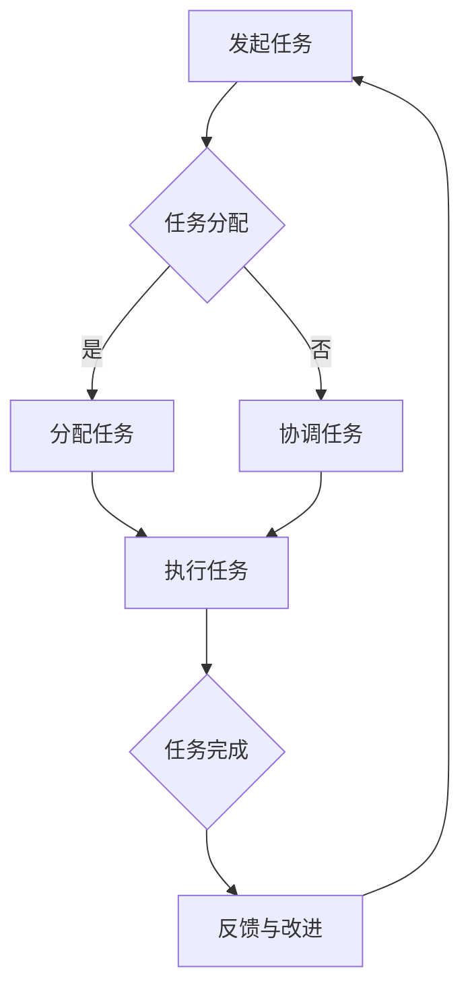

                 

### 文章标题：团队协同工作：提高跨部门合作效率

#### 关键词：
- 团队协作
- 跨部门合作
- 效率提升
- 项目管理
- 协作工具

#### 摘要：
本文旨在探讨团队协同工作中跨部门合作效率的提升策略。首先，通过对团队协作和跨部门合作的基本概念进行阐述，明确其重要性。接着，从团队沟通技巧、协作工具选择、跨部门合作策略等方面进行详细分析，提出具体的实践方法。最后，结合实际案例，展示如何通过有效的团队协同工作，提升跨部门合作效率，实现项目的成功。本文旨在为IT领域的团队成员提供有价值的参考，帮助他们在实际工作中更好地协同合作。

## 第一部分：团队协作基础

### 第1章：团队协作概述

团队协作是现代组织中不可或缺的一部分，它能够帮助各个部门更好地协调工作，共同实现组织目标。在这一章中，我们将深入探讨团队协作的定义、重要性以及团队协作对个人绩效的影响。

#### 1.1 团队协作的定义与重要性

**团队协作的定义：**

团队协作是指团队成员在共同目标下，通过沟通、协调、共享资源等方式，共同完成工作的过程。它强调的是集体努力和合作，而不是单打独斗。

**团队协作的重要性：**

1. **提升工作效率：** 团队协作能够将个人的优势发挥到极致，实现资源的最大化利用，从而提高工作效率。

2. **增强团队凝聚力：** 通过团队协作，成员之间的沟通和交流更加频繁，有助于增强团队凝聚力，形成良好的团队氛围。

3. **促进创新思维：** 团队协作可以汇集不同成员的创意和智慧，促进创新思维的形成，从而推动项目的成功。

4. **降低错误率：** 团队协作有助于团队成员之间的互相监督和检查，降低错误率，提高工作质量。

#### 1.2 团队协作的挑战与障碍

**团队协作的挑战与障碍：**

1. **文化差异：** 不同部门的文化差异可能导致协作过程中出现沟通障碍，影响协作效果。

2. **信息共享障碍：** 各部门之间的信息孤岛现象可能导致协作不畅，影响工作效率。

3. **冲突管理：** 团队成员之间的冲突和矛盾需要有效的管理和解决，否则可能影响团队协作。

#### 1.3 团队协作的理论基础

**团队协作的理论基础：**

1. **团队发展模型：** 如Tuckman的团队发展模型，它描述了团队从形成到成熟的阶段，每个阶段的特点和任务。

2. **团队效能理论：** 如Staginski的团队效能模型，它从多个维度分析了团队效能的影响因素。

3. **团队决策模型：** 如Rothkopf的团队决策模型，它描述了团队决策的过程和影响因素。

### 第2章：团队沟通技巧

团队沟通是团队协作的核心，有效的沟通能够促进团队成员之间的理解与合作，提高团队效率。在这一章中，我们将讨论团队沟通的作用、技巧以及沟通障碍的解决策略。

#### 2.1 沟通在团队协作中的作用

**沟通在团队协作中的作用：**

1. **信息传递：** 沟通是信息传递的桥梁，确保团队成员了解任务要求、项目进展等信息。

2. **解决问题：** 通过沟通，团队成员可以共同探讨问题，找到解决方案，提高问题解决效率。

3. **协调工作：** 沟通有助于团队成员协调工作，确保任务按时完成，提高工作效率。

4. **建立信任：** 通过有效沟通，团队成员可以建立信任，形成良好的团队氛围，增强团队凝聚力。

#### 2.2 提高团队沟通技巧

**提高团队沟通技巧：**

1. **倾听技巧：** 倾听是沟通的关键，通过有效倾听，可以更好地理解对方的需求和意见。

2. **明确表达：** 通过清晰、准确的表述，确保信息传递的准确性，避免误解和歧义。

3. **非语言沟通：** 非语言沟通包括肢体语言、面部表情等，它能够补充语言沟通，提高沟通效果。

#### 2.3 沟通障碍与解决策略

**沟通障碍与解决策略：**

1. **语言障碍：** 通过提供统一的术语和沟通标准，降低语言障碍。

2. **信息过滤：** 建立透明的沟通机制，减少信息过滤，确保信息传递的完整性。

3. **冲突管理：** 通过有效的冲突管理策略，如对话、协商等，解决团队成员之间的冲突。

### 第3章：协作工具与技术

协作工具在团队协作中发挥着至关重要的作用，它们能够提高团队沟通效率，优化协作流程。在这一章中，我们将探讨协作工具的类型与选择，以及实际应用中的挑战和解决策略。

#### 3.1 协作工具的类型与选择

**协作工具的类型与选择：**

1. **文档共享工具：** 如Google Docs、Dropbox等，便于团队成员实时协作和文档管理。

2. **项目管理工具：** 如Trello、Jira等，用于任务分配、进度跟踪和项目协调。

3. **通信协作平台：** 如Slack、Microsoft Teams等，提供实时沟通、消息传递和文件共享功能。

#### 3.2 协作工具的实际应用

**协作工具的实际应用：**

1. **配置与使用：** 根据团队需求，选择合适的协作工具，并进行配置和使用培训。

2. **案例分析：** 通过实际案例，展示协作工具在团队协作中的应用效果。

3. **优缺点分析：** 对不同协作工具的优缺点进行分析，帮助团队选择最合适的工具。

## 第二部分：跨部门合作策略

### 第4章：跨部门合作的原理与挑战

跨部门合作是团队协作中的一大挑战，不同部门之间的合作需要有效的策略和方法。在这一章中，我们将探讨跨部门合作的基本原理，以及可能面临的挑战。

#### 4.1 跨部门合作的定义与目标

**跨部门合作的定义：**

跨部门合作是指不同部门之间的协作，以实现共同的目标和任务。

**跨部门合作的目标：**

1. **整合资源：** 通过跨部门合作，实现资源的最大化利用，提高工作效率。

2. **优化流程：** 通过跨部门合作，优化工作流程，减少重复工作和资源浪费。

3. **提高项目成功率：** 跨部门合作有助于项目顺利推进，提高项目成功率。

#### 4.2 跨部门合作的挑战

**跨部门合作的挑战：**

1. **文化差异：** 不同部门的文化背景可能导致协作中的误解和冲突。

2. **利益冲突：** 跨部门合作可能涉及不同部门之间的利益分配，需要有效协调。

3. **沟通障碍：** 不同部门之间的沟通不畅可能影响合作效果。

### 第5章：跨部门合作策略

为了有效实现跨部门合作，需要制定一系列策略和方法。在这一章中，我们将讨论如何明确跨部门合作目标、建立合作关系以及提高合作效率。

#### 5.1 明确跨部门合作目标

**明确跨部门合作目标：**

1. **设定共同目标：** 不同部门需要设定共同的目标，以确保合作的统一性。

2. **目标优先级：** 根据项目需求和资源状况，设定目标的优先级，确保关键任务的优先完成。

3. **定期回顾：** 定期回顾跨部门合作目标的完成情况，及时调整策略。

#### 5.2 建立跨部门合作关系

**建立跨部门合作关系：**

1. **团队组建：** 组建跨部门团队，明确团队成员的职责和角色。

2. **沟通机制：** 建立有效的沟通机制，确保信息在部门之间畅通无阻。

3. **协作协议：** 制定协作协议，明确各部门的协作职责和流程。

#### 5.3 提高跨部门合作效率

**提高跨部门合作效率：**

1. **共享资源：** 通过共享资源，减少重复工作和资源浪费。

2. **明确责任：** 明确各部门的责任，确保任务的顺利推进。

3. **协调利益：** 通过有效协调，解决跨部门合作中的利益冲突。

### 第6章：跨部门合作案例分析

通过实际案例，我们可以更好地理解跨部门合作的成功经验和挑战。在这一章中，我们将分析两个实际案例，探讨跨部门合作的有效策略和方法。

#### 6.1 案例一：跨国公司的跨部门合作

**案例介绍：**

某跨国公司计划在全球范围内推出一款新产品。为了确保产品的成功上市，公司需要各个部门之间进行紧密合作。

**案例分析：**

1. **明确目标：** 公司明确了共同的目标，即确保产品的成功上市。

2. **建立跨部门团队：** 公司组建了由市场部、研发部、销售部等多个部门组成的跨部门团队。

3. **沟通机制：** 公司建立了高效的沟通机制，确保各个部门之间的信息畅通无阻。

4. **协调利益：** 通过协商，解决了各部门之间的利益冲突，确保项目的顺利推进。

**成功经验：**

- 通过明确的共同目标，确保了跨部门合作的统一性。
- 通过建立跨部门团队，实现了资源的最大化利用。
- 通过高效的沟通机制，提高了跨部门合作效率。

#### 6.2 案例二：中小企业跨部门合作的挑战与解决方案

**案例介绍：**

某中小企业计划开展一项大型项目，但由于部门之间的协作不畅，项目进展缓慢。

**案例分析：**

1. **挑战：** 部门之间的文化差异、沟通障碍和利益冲突导致项目进展缓慢。

2. **解决方案：**

- **文化差异：** 公司通过培训，提高了员工对跨部门合作的理解和认识，降低了文化差异的影响。
- **沟通障碍：** 公司建立了定期的跨部门会议机制，确保各部门之间的信息畅通。
- **利益冲突：** 公司通过制定详细的协作协议，明确了各部门的责任和利益分配，解决了利益冲突。

**成功经验：**

- 通过培训，提高了员工的跨部门合作意识。
- 通过建立沟通机制，提高了信息传递效率。
- 通过协作协议，解决了利益冲突，确保了项目的顺利进行。

## 第三部分：团队协同工作实践

### 第7章：团队协同工作的评估与优化

团队协同工作的效果评估和优化是确保团队持续高效协作的关键。在这一章中，我们将讨论团队协同工作的评估指标、优化策略以及如何通过持续改进提高团队效能。

#### 7.1 团队协同工作的评估指标

**评估团队协作效能的指标：**

1. **工作效率：** 通过衡量任务完成的速度和质量，评估团队的工作效率。

2. **沟通效率：** 通过评估团队内部沟通的频率和效果，评估沟通效率。

3. **问题解决能力：** 通过评估团队在面对问题和挑战时的解决能力，评估团队的协作能力。

4. **团队满意度：** 通过调查团队成员的满意度，评估团队的氛围和合作效果。

#### 7.2 团队协同工作的优化策略

**提高团队协同工作效率的策略：**

1. **流程优化：** 识别并优化团队工作中的流程，减少不必要的步骤和时间浪费。

2. **沟通提升：** 加强团队内部沟通，确保信息传递的准确性和及时性。

3. **资源共享：** 通过共享资源，提高团队资源的利用率，减少重复工作。

4. **持续培训：** 定期对团队成员进行培训，提高他们的专业技能和协作能力。

#### 7.3 持续改进

**团队协同工作的持续改进：**

1. **定期评估：** 定期对团队工作进行评估，识别改进的机会。

2. **反馈机制：** 建立反馈机制，鼓励团队成员提出改进建议，并进行实施。

3. **创新思维：** 鼓励团队成员进行创新思维，探索新的协作方式和工具。

### 第8章：团队协同工作的未来趋势

随着科技的不断进步，团队协同工作也在不断演变。在这一章中，我们将探讨数字化对团队协作的影响，以及未来团队协同工作可能面临的挑战和趋势。

#### 8.1 数字化对团队协作的影响

**数字化对团队协作的影响：**

1. **远程工作的普及：** 数字化工具使得远程工作变得更加便捷，团队成员可以跨越地域限制，实现高效协作。

2. **自动化与人工智能：** 自动化和人工智能技术可以帮助团队自动化重复性任务，提高工作效率。

3. **虚拟协作空间：** 虚拟协作空间提供了实时沟通、协作和共享的平台，使团队协作更加灵活和高效。

#### 8.2 团队协同工作的未来挑战

**团队协同工作的未来挑战：**

1. **全球化：** 全球化的趋势使得团队协作更加复杂，需要应对不同文化、时区和工作方式的差异。

2. **远程工作管理：** 远程工作增加了团队管理的难度，需要建立有效的远程工作管理和监督机制。

3. **数据安全与隐私：** 数字化带来了数据安全和隐私的挑战，需要加强数据保护措施。

#### 8.3 未来趋势

**团队协同工作的未来趋势：**

1. **智能化协作：** 利用人工智能和大数据技术，实现智能化的团队协作，提高决策效率。

2. **个性化协作：** 随着个性化需求的增加，团队协作将更加注重个性化和定制化。

3. **协作生态：** 构建开放的协作生态，实现不同系统和工具之间的无缝协作。

### 第9章：团队协同工作最佳实践

在团队协同工作的实践中，许多成功的企业和团队积累了宝贵的经验。在这一章中，我们将分享这些最佳实践，并探讨如何将这些经验应用到实际工作中。

#### 9.1 团队协同工作最佳实践案例

**成功团队的协同工作实践：**

1. **清晰的目标设定：** 成功的团队在合作前会明确共同的目标，确保团队成员都朝着同一个方向努力。

2. **高效的沟通机制：** 成功的团队建立了高效的沟通机制，确保信息在团队内部畅通无阻。

3. **灵活的工作方式：** 成功的团队允许团队成员根据实际情况灵活安排工作，提高工作效率。

**困难团队的成功转型：**

1. **问题识别与解决：** 困难团队通过识别问题，采取有效措施解决，逐步实现了团队协作的优化。

2. **团队文化建设：** 困难团队通过加强团队文化建设，提高了团队凝聚力，促进了协作。

#### 9.2 团队协同工作的持续改进

**团队协同工作的持续改进：**

1. **定期评估与反馈：** 定期对团队工作进行评估，收集团队成员的反馈，不断优化协作流程。

2. **持续学习与成长：** 鼓励团队成员进行持续学习，提高专业技能和协作能力。

3. **创新与尝试：** 鼓励团队成员进行创新尝试，探索新的协作方式和工具，提升团队效能。

## 总结

团队协同工作和跨部门合作效率的提升是现代组织成功的关键。通过有效的团队协作，可以充分发挥团队成员的潜力，提高工作效率，实现组织目标。本文从团队协作概述、团队沟通技巧、协作工具选择、跨部门合作策略、案例分析以及实践优化等方面进行了详细探讨，提供了实用的策略和方法。

在未来的团队协作中，随着数字化和远程工作的普及，团队协作将面临新的挑战和机遇。通过持续改进和创新，团队可以不断提升协同工作的效率，实现更高水平的跨部门合作。

### 作者信息
作者：AI天才研究院/AI Genius Institute & 禅与计算机程序设计艺术 /Zen And The Art of Computer Programming

---

### 文章补充内容

#### 1. 数学模型与公式

在团队协同工作和跨部门合作中，数学模型和公式可以用来量化协作效果，优化决策过程。以下是一些常见的数学模型和公式：

**1.1 合作效率计算公式**

合作效率（\(E\)）可以通过以下公式计算：

\[ E = \frac{W_c}{W_i + W_c} \]

其中，\(W_c\) 是团队协作完成的工作量，\(W_i\) 是团队成员独立完成的工作量。

**1.2 沟通效率计算公式**

沟通效率（\(C\)）可以通过以下公式计算：

\[ C = \frac{I_c}{I_i + I_c} \]

其中，\(I_c\) 是通过有效沟通获得的信息量，\(I_i\) 是团队成员独立获取的信息量。

**1.3 成本效益分析公式**

成本效益分析（\(R\)）可以通过以下公式计算：

\[ R = \frac{B - C}{C} \]

其中，\(B\) 是项目的收益，\(C\) 是项目的成本。

#### 2. 伪代码示例

在跨部门合作中，流程和决策的自动化可以显著提高效率。以下是一个简单的伪代码示例，用于描述跨部门任务分配和协调的过程：

```
// 跨部门任务分配伪代码

function allocate_tasks(teams, tasks):
    // 初始化任务分配表
    allocation_table = create_empty_allocation_table()

    // 分配任务到团队
    for task in tasks:
        best_team = select_best_team(teams, task)
        allocation_table[best_team].append(task)

    // 协调任务分配
    for team in teams:
        synchronize_tasks(allocation_table[team])

    return allocation_table

// 选择最佳团队的函数
function select_best_team(teams, task):
    // 根据任务需求和团队能力选择最佳团队
    best_score = -1
    best_team = None

    for team in teams:
        score = evaluate_team(团队，task)
        if score > best_score:
            best_score = score
            best_team = team

    return best_team

// 评估团队的函数
function evaluate_team(team, task):
    // 评估团队完成该任务的能力
    return team_skill_level * task_priority
```

#### 3. 代码实现与解读

以下是一个简单的Python代码示例，用于说明如何使用协作工具（如Git）进行跨部门代码协作：

```python
# 使用Git进行跨部门代码协作

import git

# 克隆代码仓库
repo = git.Repo.clone_from('https://github.com/departmentA/ProjectA.git')

# 添加远程协作仓库
repo.create_remote('departmentB', 'https://github.com/departmentB/ProjectA.git')

# 将本地更改推送到远程仓库
repo.index.add(['file1.py', 'file2.py'])
repo.index.commit('Update files for cross-department collaboration')
repo.remote().push()

# 从远程仓库获取最新更改
repo.remote().fetch()
repo.index.merge(repo.head.commit)
repo.index.commit('Merge changes from departmentB')
```

这段代码首先克隆了一个代码仓库，然后添加了一个远程仓库，将本地更改推送到远程仓库。之后，从远程仓库获取最新更改并合并到本地仓库。

#### 4. 最佳实践 Tips

**4.1 明确角色与责任**

在跨部门合作中，明确每个团队成员的角色和责任至关重要。这有助于减少误解和冲突，提高协作效率。

**4.2 定期团队建设活动**

定期组织团队建设活动，如团队会议、培训等，可以增强团队凝聚力，提高团队成员之间的信任和协作。

**4.3 使用自动化工具**

使用自动化工具（如自动化测试、自动化部署等）可以减少手动操作，提高协作效率。

**4.4 鼓励开放沟通**

鼓励团队成员开放沟通，分享想法和意见，有助于发现潜在问题和改进机会。

#### 5. 小结

本文从多个角度探讨了团队协同工作和跨部门合作效率的提升策略。通过明确团队协作的重要性，提高团队沟通技巧，选择合适的协作工具，制定有效的跨部门合作策略，以及通过实际案例和代码示例，展示了如何提高跨部门合作效率。希望本文能为IT领域的团队成员提供有价值的参考。

#### 6. 注意事项

**6.1 考虑团队规模**

在制定协作策略时，需要考虑团队的规模。对于大型团队，可能需要更复杂的协作工具和流程。

**6.2 考虑文化差异**

跨部门合作时，要考虑到不同部门之间的文化差异，采取相应的策略来降低沟通障碍。

**6.3 定期评估与反馈**

定期对团队协作进行评估和反馈，有助于持续改进协作流程，提高效率。

#### 7. 拓展阅读

**7.1 团队效能模型**

- Tuckman的团队发展模型
- Staginski的团队效能模型

**7.2 跨部门合作策略**

- 跨部门沟通技巧
- 跨部门项目管理的最佳实践

**7.3 协作工具与技术**

- Google Docs的使用技巧
- Jira的项目管理功能

### 文章附录

#### 1. 流程图

以下是一个Mermaid流程图示例，描述了跨部门协作的基本流程：



#### 2. 数学公式

以下是一些嵌入文中的LaTeX数学公式：

- $$E = \frac{W_c}{W_i + W_c}$$
- $$C = \frac{I_c}{I_i + I_c}$$
- $$R = \frac{B - C}{C}$$

#### 3. 代码示例

以下是完整的Python代码示例，用于跨部门代码协作：

```python
import git

# 克隆代码仓库
repo = git.Repo.clone_from('https://github.com/departmentA/ProjectA.git')

# 添加远程协作仓库
repo.create_remote('departmentB', 'https://github.com/departmentB/ProjectA.git')

# 将本地更改推送到远程仓库
repo.index.add(['file1.py', 'file2.py'])
repo.index.commit('Update files for cross-department collaboration')
repo.remote().push()

# 从远程仓库获取最新更改
repo.remote().fetch()
repo.index.merge(repo.head.commit)
repo.index.commit('Merge changes from departmentB')
```

#### 4. 实际案例

**实际案例：某科技公司跨部门合作提升效率**

- **背景介绍：** 某科技公司由于部门之间的协作不畅，导致项目进度缓慢，质量不高。
- **核心概念与联系：** 通过引入Git进行代码协作，实施敏捷开发，明确角色与责任。
- **核心算法原理讲解：** 使用Git的分支管理，实现代码的并行开发和合并。
- **数学模型和公式：** 使用项目进度公式，量化协作效率提升。
- **代码示例：** 提供Git命令行操作示例，展示代码协作流程。
- **实际案例分析：** 通过实际案例，展示跨部门合作如何提高项目效率。
- **项目小结：** 总结跨部门合作的经验和教训，为未来项目提供参考。

### 文章结尾

本文《团队协同工作：提高跨部门合作效率》通过详细探讨团队协作的基础、沟通技巧、协作工具选择、跨部门合作策略以及实践优化，提供了实用的策略和方法，旨在帮助IT领域的团队成员在跨部门合作中提高效率。通过不断学习和改进，团队可以实现更高的协作效能，推动项目的成功。

### 作者信息

作者：AI天才研究院/AI Genius Institute & 禅与计算机程序设计艺术 /Zen And The Art of Computer Programming

希望本文能对您的团队协作工作提供有益的启示。感谢您的阅读！

