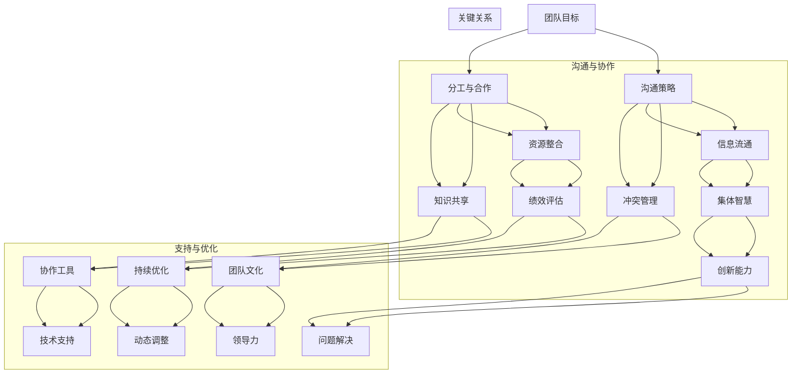

                 

### 一、引言

#### 1.1 书籍背景

在现代企业中，团队协作已成为提升工作效率和实现目标的关键因素。随着信息技术的发展，团队协同工作的模式和方式也在不断演变。本书旨在深入探讨团队协同效应的各个方面，从理论基础到实际应用，帮助企业和团队更好地发挥集体智慧，实现协同效应的最大化。

#### 1.2 团队协同效应的重要性

团队协同效应是指团队成员在共同工作中，通过相互协作和信息交流，产生的总体效益大于个体成员单独工作效益之和的现象。这种现象在高科技企业、创新团队以及复杂项目管理中尤为重要。有效的团队协同不仅能提高工作效率，还能促进创新思维和问题解决能力，从而在激烈的市场竞争中占据优势。

#### 1.3 书籍目标

本书的主要目标是：
1. 系统介绍团队协同效应的理论基础，包括社会心理学和系统思维的原理。
2. 提供实用的团队协同策略，包括沟通策略和分工与合作的机制。
3. 分析集体智慧的概念和应用，探讨如何在实际项目中利用集体智慧。
4. 通过案例分析，展示成功的团队协同实践，提供借鉴和启示。
5. 提出团队协同效应评估和持续优化的方法，帮助团队实现长期发展。

通过本书的阅读，读者将能够全面了解团队协同效应，掌握有效的团队协作方法，并在实际工作中运用这些策略，实现团队整体效益的最大化。

### 二、团队协同效应的理论基础

#### 2.1 社会心理学与团队协同

团队协同效应不仅仅是一个技术问题，更是一个心理学问题。社会心理学为理解团队协作提供了丰富的理论基础，其中群体动力学是一个重要的概念。

##### 2.1.1 群体动力学的概念

群体动力学是研究群体内部动力过程和群体行为的科学。它关注的是个体在群体中的行为如何受到群体的影响，以及群体如何影响个体的行为。群体动力学涉及多个方面，包括群体结构、群体规范、群体压力、群体认同等。

在团队协同中，群体动力学帮助我们理解：
1. **群体结构**：团队的组织形式、角色分工、沟通渠道等如何影响团队成员的协作。
2. **群体规范**：团队成员共同遵守的行为准则和期望，如何影响个体的行为和决策。
3. **群体压力**：成员在群体中可能面临的社会压力，如何影响他们的独立思考和行为。
4. **群体认同**：成员对团队的认同感如何影响他们的合作意愿和工作表现。

##### 2.1.2 群体思维的影响

群体思维是一种在群体决策中，成员倾向于保持一致、避免冲突、追求群体和谐的心理现象。群体思维对团队协同既有正面影响也有负面影响。

**正面影响**：
- **增强凝聚力**：群体思维有助于增强团队成员之间的凝聚力，使团队更加团结一致。
- **提高决策效率**：在紧急情况下，群体思维可以帮助团队迅速达成共识，提高决策效率。

**负面影响**：
- **降低创造力**：群体思维可能导致成员过分依赖领导或权威人物，限制创意和独立思考。
- **忽略个体差异**：在追求一致性时，群体思维可能忽略个体成员的独特视角和技能，导致团队失去多样性和创新力。

##### 2.1.3 个体与群体的互动关系

个体与群体的互动关系是团队协同效应的重要组成部分。个体在群体中的行为受到群体规范、群体压力和群体认同的影响，同时个体的行为也会影响群体的氛围和动态。

- **个体影响群体**：个体成员的积极态度、专业知识、创新能力等都能对群体产生积极影响，促进团队目标的实现。
- **群体影响个体**：群体提供的支持、反馈和认同感可以增强个体的自信心和归属感，从而提高个体的工作表现。

总之，理解群体动力学的概念和影响，有助于团队领导者和成员更好地管理团队协作过程，发挥团队的最大潜力。

### 三、系统思维与团队协同

系统思维是一种整体观和动态观，它强调从系统的角度理解和解决问题。在团队协同中，系统思维有助于团队从宏观上把握问题，识别系统中的关键因素，从而制定出更为全面和有效的协作策略。

##### 2.2.1 系统思维的基本原理

系统思维的基本原理包括以下几个方面：

1. **整体性**：系统思维强调系统的整体性，认为系统中的各个部分是相互联系、相互作用的，而不是孤立的个体。这意味着团队中的每个成员都需要认识到自己在整体中的角色和责任，以及整体目标的重要性。

2. **反馈循环**：系统思维关注系统内部的反馈循环，认识到正向和负向反馈对系统稳定性和动态性的影响。在团队协同中，有效的反馈机制可以帮助团队及时调整策略，避免错误和冲突。

3. **适应性**：系统思维强调系统的适应性和灵活性，认为系统需要不断适应外部环境和内部变化。团队在协同过程中也需要具备快速适应变化的能力，以应对各种不确定性和挑战。

4. **层次结构**：系统思维认为系统具有层次结构，从微观到宏观，各个层次之间相互关联。团队协同也需要在多个层次上协调一致，从个人、小组到整个团队，确保目标和行动的一致性。

##### 2.2.2 团队协同中的系统思考

在团队协同中，系统思考有助于团队从整体上理解和优化协作过程：

1. **识别系统边界**：明确团队协同的边界，包括团队成员、职责范围、资源限制等，有助于团队聚焦核心目标和任务。

2. **分析系统结构**：通过分析团队的构成、角色分工、沟通渠道等，识别团队协作中的关键节点和瓶颈，为优化协作提供依据。

3. **建立反馈机制**：建立有效的反馈机制，确保团队成员之间的信息交流畅通，及时发现和解决问题，提高协作效率。

4. **模拟和预测**：通过模拟和预测团队在不同情况下的表现，评估不同协作策略的效果，为团队决策提供科学依据。

##### 2.2.3 复杂系统的协同策略

在复杂系统中，团队协同面临更大的挑战。以下是一些适用于复杂系统的协同策略：

1. **分布式决策**：在复杂系统中，过于集中的决策可能导致响应速度慢和适应性差。分布式决策允许团队成员在各自的职责范围内自主决策，提高系统的灵活性和响应速度。

2. **模块化设计**：将复杂任务分解为若干模块，每个模块可以独立运作，同时保持整体系统的协调和一致性。模块化设计有助于提高任务的分解和分配效率，降低协作的复杂性。

3. **跨领域协作**：复杂系统通常涉及多个领域和专业知识的交叉，跨领域协作有助于整合不同领域的智慧和资源，提高问题解决能力。

4. **适应性学习**：在复杂系统中，适应性学习至关重要。团队需要不断从实践中学习，调整和优化协作策略，以适应不断变化的环境和需求。

总之，系统思维为团队协同提供了重要的理论指导和实践方法。通过系统思维，团队可以更好地理解复杂系统的本质，制定有效的协同策略，实现团队整体效益的最大化。

### 四、团队协同策略

有效的团队协同策略是提高团队工作效率和实现目标的关键。以下将详细介绍两种核心的团队协同策略：沟通策略和分工与合作。

#### 3.1 沟通策略

良好的沟通是团队协同的基础。有效的沟通策略能够确保信息准确、及时地传递，促进团队成员之间的理解和合作。

##### 3.1.1 有效沟通的关键要素

1. **明确目标**：在沟通前，明确沟通的目标和目的，确保所有参与者都对目标有清晰的认识。

2. **倾听**：积极倾听是有效沟通的重要组成部分。倾听不仅包括听对方说什么，还包括理解对方的情感和意图。

3. **清晰表达**：表达时要简洁、明确，避免使用模糊或歧义的语言。同时，使用适当的非语言沟通手段，如肢体语言、面部表情等，增强表达的效果。

4. **反馈**：及时给予反馈，确认对方是否理解了沟通内容。这有助于避免误解和错误的产生。

##### 3.1.2 非语言沟通的技巧

非语言沟通在团队协作中同样重要。以下是一些有效的非语言沟通技巧：

1. **肢体语言**：通过肢体语言表达态度和情感，如微笑、点头、眼神接触等。

2. **面部表情**：适当的面部表情可以增强语言的表达效果，表达出真诚、友好和尊重。

3. **空间使用**：合理利用空间，保持合适的距离，避免过于亲近或疏远。

4. **声音**：使用不同的声调、语速和音量，使沟通更加生动和有感染力。

##### 3.1.3 沟通障碍与解决方法

尽管沟通策略在团队协同中至关重要，但沟通障碍仍然难以避免。以下是一些常见的沟通障碍及其解决方法：

1. **语言障碍**：不同文化背景和语言习惯可能导致沟通困难。解决方法包括使用简单清晰的语言、提供翻译支持等。

2. **信息过载**：过多的信息可能导致团队成员无法有效地处理和利用。解决方法包括筛选关键信息、合理安排沟通时间等。

3. **误解和偏见**：误解和偏见可能导致沟通障碍。解决方法包括积极倾听、明确表达、建立信任等。

4. **技术障碍**：技术故障或沟通工具不完善可能影响沟通效果。解决方法包括选择合适的技术工具、进行技术培训等。

通过以上沟通策略和技巧，团队可以有效地克服沟通障碍，提高团队协作的质量和效率。

#### 3.2 分工与合作

分工与合作是团队协同的另一个重要策略。合理的分工和高效的协作有助于发挥每个成员的专业优势，提高团队的整体效能。

##### 3.2.1 团队分工的原则

有效的团队分工应遵循以下原则：

1. **技能匹配**：将任务分配给最适合执行该任务的成员，确保任务能够高效完成。

2. **能力提升**：通过适当的任务分配，促进成员技能的提升和职业发展。

3. **责任明确**：明确每个成员的职责和任务，确保任务完成的质量和效率。

4. **资源优化**：合理分配资源，确保任务分工和资源利用的优化。

##### 3.2.2 团队合作的机制

团队合作机制包括以下方面：

1. **沟通机制**：建立有效的沟通渠道和机制，确保团队成员之间的信息交流和协作顺畅。

2. **协作工具**：使用合适的协作工具，如项目管理软件、即时通讯工具等，提高团队协作的效率。

3. **决策机制**：建立明确的决策流程和机制，确保团队成员在决策过程中有共同的目标和一致的行动。

4. **反馈机制**：建立反馈机制，及时收集和反馈团队成员的工作情况，优化协作过程。

##### 3.2.3 分工与合作的平衡

在团队工作中，分工与合作之间需要保持平衡。以下是一些平衡分工与合作的策略：

1. **明确分工**：明确每个成员的职责范围，确保任务分工清晰，减少职责重叠和冲突。

2. **协作共享**：鼓励团队成员之间的协作和知识共享，促进任务的顺利完成。

3. **弹性分工**：根据实际情况灵活调整分工，确保团队在应对变化时能够迅速适应。

4. **相互支持**：建立相互支持和帮助的文化，增强团队凝聚力，提高协作效果。

通过合理的分工和高效的协作，团队可以充分发挥每个成员的优势，实现整体效益的最大化。

### 四、集体智慧的应用

集体智慧，也称为群体智慧或群智，是指由多个个体通过协作、交流和合作，共同解决问题、作出决策或产生创意的智慧。在现代信息时代，集体智慧的应用已经成为各类组织和企业实现创新和高效运营的重要手段。

#### 4.1.1 集体智慧的起源与发展

集体智慧的起源可以追溯到人类社会的早期。在古代，人们通过集体的智慧和力量进行狩猎、建筑和防御等活动。随着人类社会的发展和科技的进步，集体智慧得到了进一步的发展和应用。在20世纪末，随着互联网的普及和信息技术的发展，集体智慧开始进入一个全新的阶段。

- **维基百科**：维基百科是最早和最具影响力的集体智慧应用之一。它由全球志愿者共同编写和更新，汇集了全球的知识和智慧。
- **开源软件**：开源软件运动也体现了集体智慧的力量。开发者们通过协作和共享代码，共同推动了软件技术的发展。
- **众筹**：众筹平台允许普通大众通过小额捐赠支持创意项目，体现了集体智慧和资金的支持。

#### 4.1.2 集体智慧的特点与优势

集体智慧具有以下特点与优势：

1. **多样性**：集体智慧来自不同背景、经验和知识的个体，具有高度的多样性。这种多样性有助于从不同角度分析和解决问题，提高创新性和创造力。
2. **协同效应**：个体智慧的简单相加并不一定能够产生集体智慧，但通过协作和沟通，集体智慧可以产生显著的协同效应，达到整体大于部分之和的效果。
3. **快速响应**：集体智慧能够快速响应变化和挑战，因为它依赖于众多个体的即时反馈和协作，这使得组织能够更快地调整策略和应对不确定性。
4. **共享知识**：集体智慧通过知识的共享和传递，使个体能够学习和借鉴他人的经验，提高整体的知识水平和创新能力。
5. **民主性**：集体智慧通常基于民主的原则，个体在决策过程中有平等的发言权和影响力，这有助于促进公平和透明。

#### 4.1.3 集体智慧在不同领域的应用

集体智慧在多个领域得到了广泛应用：

1. **科学研究**：科学家们通过在线协作平台和论坛，共同探讨和解决复杂的科学问题。例如，开放式科学项目允许任何人参与研究和讨论，促进了科学知识的传播和创新。
2. **产品设计**：在产品设计过程中，集体智慧可以帮助团队收集用户反馈和需求，从而设计出更符合用户期望的产品。许多公司通过在线平台收集用户意见，进行产品设计改进。
3. **管理决策**：在企业管理中，集体智慧可以用于战略规划和决策。通过集体智慧，企业能够更全面地考虑各种因素，作出更明智的决策。
4. **社会问题解决**：在应对社会问题时，集体智慧可以动员广大群众的智慧和力量，共同解决问题。例如，一些社区组织通过集体智慧解决环境问题和社区建设问题。

#### 4.1.4 集体智慧在团队协同中的应用

在团队协同中，集体智慧的应用具有重要意义。以下是一些具体的实践方法：

1. **开放式讨论**：在团队会议和讨论中，鼓励每个成员表达自己的观点和想法，通过开放式的讨论，激发集体智慧。
2. **头脑风暴**：组织头脑风暴活动，让团队成员自由发挥创意，共同探讨问题的解决方案。
3. **协作平台**：使用协作平台，如在线工作空间和项目管理工具，促进团队成员之间的沟通和协作，共享信息和资源。
4. **决策投票**：在决策过程中，采用投票机制，确保每个成员的意见被充分考虑，促进集体智慧的发挥。
5. **知识共享**：建立知识共享机制，如内部知识库和经验分享会，促进团队成员之间的知识传递和经验交流。

通过集体智慧的应用，团队可以更好地解决问题、做出决策和创新，从而在竞争激烈的环境中取得成功。

### 五、案例分析

在探讨团队协同效应的实际应用时，案例研究提供了宝贵的洞察和经验。以下将分析两个具体的案例：谷歌的团队协同效应和开放式协作平台在团队协同中的应用。

#### 5.1 案例一：谷歌的团队协同效应

谷歌作为全球领先的技术公司，以其卓越的团队协同效应而闻名。谷歌的团队协同实践为其他企业提供了宝贵的借鉴。

##### 5.1.1 谷歌团队协同的成功因素

1. **灵活的工作环境**：谷歌提供了一个自由、开放的工作环境，鼓励员工自主决定工作时间和地点。这种灵活性促进了员工的工作动力和创造力。

2. **跨职能团队**：谷歌采用了跨职能团队的组织形式，团队成员来自不同的背景和领域。这种多样性有助于团队从多个角度审视问题，并提出创新的解决方案。

3. **透明和开放的沟通**：谷歌注重团队内部的沟通，建立了多个沟通渠道，如内部博客、讨论组和邮件列表。透明和开放的沟通有助于信息共享和协作。

4. **绩效评估和激励机制**：谷歌采用基于绩效的评估和激励机制，鼓励员工努力工作并追求卓越。这种机制激发了员工的积极性和创造力。

##### 5.1.2 谷歌团队协同的经验教训

1. **注重员工多样性**：多样性不仅体现在团队成员的背景和经验上，还包括思维方式和观点的多样性。多样化的团队更有可能产生创新性的想法和解决方案。

2. **建立有效的沟通机制**：透明和开放的沟通是团队协同的关键。企业需要建立多种沟通渠道，确保团队成员之间的信息畅通。

3. **灵活的工作环境**：灵活的工作环境可以增强员工的工作满意度和创造力。企业应提供适当的灵活工作安排，以适应员工的个人需求。

4. **激励与反馈**：有效的激励机制和及时的反馈可以帮助员工保持动力和专注。企业需要建立透明的绩效评估机制，确保员工的努力得到认可和奖励。

##### 5.1.3 对其他团队的启示

谷歌的团队协同实践对其他团队具有以下启示：

1. **鼓励员工多样性**：多样性不仅丰富了团队的知识和技能，还促进了创新和问题解决。

2. **建立开放和高效的沟通机制**：沟通是团队协作的基础，企业应提供多种沟通渠道，确保信息畅通和透明。

3. **提供灵活的工作环境**：灵活的工作安排可以提高员工的工作满意度和创造力，从而促进团队的协同效应。

4. **建立有效的激励机制**：通过基于绩效的评估和激励机制，可以激发员工的工作热情和创造力，提高团队的整体表现。

#### 5.2 案例二：开放式协作平台在团队协同中的应用

开放式协作平台为团队提供了一个集成的协作环境，通过共享信息和资源，促进了团队成员之间的协同工作。

##### 5.2.1 开放式协作平台的特点

1. **协作工具集成**：开放式协作平台集成了多种协作工具，如文档编辑、项目管理、即时通讯和视频会议等，提供了一个统一的工作环境。

2. **权限和访问控制**：平台允许管理员设置权限和访问控制，确保敏感信息的安全和隐私。

3. **版本控制和文档管理**：平台通常具有版本控制和文档管理功能，确保文档的完整性和可追溯性。

4. **实时协作和沟通**：平台支持实时协作和沟通，使团队成员可以随时进行交流和合作。

##### 5.2.2 开放式协作平台的优势

1. **提高工作效率**：通过集成多种协作工具，平台可以简化工作流程，提高团队的工作效率。

2. **促进知识共享**：平台提供了一个共享信息和资源的平台，促进了团队成员之间的知识共享和传递。

3. **增强团队凝聚力**：实时协作和沟通功能有助于增强团队成员之间的沟通和联系，提高团队凝聚力。

4. **降低沟通成本**：平台提供了一个高效、低成本的沟通渠道，减少了面对面会议和其他沟通方式的成本。

##### 5.2.3 开放式协作平台的实际应用

以下是一个开放式协作平台在实际项目中的应用案例：

1. **项目规划**：团队使用项目管理工具在平台上制定项目计划，明确任务分配和时间表。

2. **文档协作**：团队成员使用文档编辑工具在平台上共同编辑项目文档，确保文档的实时更新和同步。

3. **实时沟通**：团队通过即时通讯工具在平台上进行实时沟通，解决项目中的问题和挑战。

4. **知识共享**：团队在平台上建立了一个知识库，收集和共享项目经验和最佳实践，为团队成员提供参考。

通过开放式协作平台的应用，团队可以更高效、更紧密地协作，实现项目的成功。

综上所述，谷歌的团队协同实践和开放式协作平台的应用为其他团队提供了宝贵的经验和启示。通过借鉴这些成功案例，团队可以更好地发挥集体智慧，实现协同效应的最大化。

### 六、实施与改进

#### 6.1 团队协同效应的评估

团队协同效应的评估是确保团队协作效果的重要步骤。通过评估，团队可以了解协同工作的效果，发现存在的问题，并制定改进策略。

##### 6.1.1 评估团队协同效应的指标

为了准确评估团队协同效应，可以采用以下指标：

1. **工作效率**：通过比较团队完成任务的用时、质量以及错误率，评估团队的工作效率。
2. **任务完成率**：评估团队在规定时间内完成任务的百分比，了解团队的任务执行能力。
3. **团队成员满意度**：通过问卷调查或访谈，了解团队成员对协作过程的满意度，包括沟通、分工和激励机制等方面。
4. **团队凝聚力**：通过团队活动和互动，评估团队成员之间的相互信任和团队凝聚力。
5. **问题解决能力**：评估团队在面对问题和挑战时的响应速度和解决问题的能力。

##### 6.1.2 评估方法与工具

为了有效地评估团队协同效应，可以采用以下方法和工具：

1. **问卷调查**：通过设计针对团队协作的问卷，收集团队成员的意见和建议，评估团队的工作效果。
2. **关键绩效指标（KPI）**：建立关键绩效指标体系，跟踪和评估团队在任务完成、效率、质量和满意度等方面的表现。
3. **访谈和观察**：通过访谈团队成员或观察团队的工作过程，深入了解团队协作的实际情况，发现潜在问题和改进机会。
4. **工作日志**：鼓励团队成员记录工作日志，包括任务完成情况、遇到的困难和协作过程，为评估提供详细的数据和证据。
5. **绩效评估会议**：定期召开绩效评估会议，团队成员共同讨论评估结果，分享经验和建议，制定改进计划。

##### 6.1.3 团队协同效应的改进策略

基于评估结果，团队可以采取以下策略来改进团队协同效应：

1. **加强沟通**：通过培训和沟通技巧的提升，增强团队成员之间的沟通效果，解决沟通障碍。
2. **优化分工与合作**：根据团队成员的技能和兴趣，调整任务分配，确保分工合理，提高协作效率。
3. **建立反馈机制**：建立有效的反馈机制，及时收集团队成员的意见和建议，持续优化协作过程。
4. **提高团队凝聚力**：通过团队建设活动和文化塑造，增强团队成员之间的信任和归属感，提高团队凝聚力。
5. **引入技术工具**：使用适当的协作工具和平台，提高团队协作的效率和质量。

通过系统性的评估和改进，团队可以不断提升协同效应，实现更高的工作效率和绩效。

### 七、团队协同效应的持续优化

团队协同效应的持续优化是实现团队长期成功的关键。为了保持团队的高效运作和创新能力，需要从多个方面进行动态调整和持续改进。

##### 6.2.1 团队协同的长期规划

长期规划是团队协同效应优化的基础。团队需要制定明确的战略目标和愿景，确保协作方向与组织目标一致。以下是一些长期规划的关键步骤：

1. **明确愿景和目标**：团队应与组织的目标保持一致，制定清晰的愿景和短期、长期目标。
2. **制定战略计划**：基于愿景和目标，制定详细的战略计划，包括具体的项目、时间和资源分配。
3. **定期审查和调整**：定期审查战略计划，根据实际情况进行调整，确保团队始终朝着正确的方向前进。
4. **人才发展计划**：制定人才发展计划，提升团队成员的技能和知识，确保团队能够适应不断变化的需求和挑战。

##### 6.2.2 团队协同的动态调整

动态调整是团队协同效应优化的重要策略。在快速变化的环境中，团队需要具备快速响应和调整的能力。以下是一些动态调整的关键要素：

1. **实时监控和反馈**：通过实时监控和反馈机制，及时了解团队的工作情况和进展，发现潜在问题和挑战。
2. **灵活的任务分配**：根据团队和个体成员的实际情况，灵活调整任务分配，确保资源的优化和任务的高效完成。
3. **快速决策**：建立快速决策机制，减少决策过程中的延迟和复杂性，确保团队能够迅速响应变化。
4. **持续学习和改进**：鼓励团队成员持续学习和分享经验，通过不断优化工作流程和方法，提升团队的协作效率和创新能力。

##### 6.2.3 团队协同的可持续发展

团队协同的可持续发展是实现长期成功的关键。以下是一些确保团队协同可持续发展的策略：

1. **文化建设**：建立积极、开放和包容的文化，鼓励团队成员之间的信任和合作，增强团队凝聚力。
2. **激励机制**：建立公平、透明的激励机制，鼓励团队成员积极投入工作和创新，保持团队的活力和动力。
3. **技术支持**：提供先进的技术工具和平台，确保团队协作的效率和质量，支持团队的持续发展。
4. **领导力培养**：培养具有领导力和战略眼光的领导者，确保团队能够在复杂环境中保持清晰的方向和高效的工作状态。

通过长期规划、动态调整和可持续发展，团队可以不断提升协同效应，实现更高的工作效率和创新能力，从而在竞争激烈的环境中脱颖而出。

### 八、核心概念与联系

#### 8.1 团队协同效应的Mermaid流程图

为了更好地理解团队协同效应的核心概念及其相互关系，我们可以使用Mermaid流程图进行可视化展示。以下是一个简化的Mermaid流程图示例，展示了团队协同效应的关键环节及其相互关系。



该流程图涵盖了团队协同效应的核心概念，包括团队目标、沟通策略、分工与合作、信息流通、资源整合、集体智慧、绩效评估、冲突管理、知识共享、创新能力、持续优化、团队文化、协作工具、技术支持和领导力。通过该流程图，我们可以清晰地看到各概念之间的相互关系和作用机制，有助于更好地理解和应用团队协同效应。

### 九、核心算法原理讲解

为了深入理解团队协同效应的实现机制，以下将介绍几个核心算法原理，并使用伪代码进行详细阐述。

#### 9.1.1 沟通策略中的算法原理

沟通策略在团队协同中至关重要，以下是一个简单的沟通策略算法原理：

```plaintext
// 伪代码：沟通策略算法
function Communicate(message, receiver, context) {
    if (context == "face-to-face") {
        sendFaceToFaceMessage(message, receiver);
    } else if (context == "written") {
        sendWrittenMessage(message, receiver);
    } else if (context == "virtual") {
        sendVirtualMessage(message, receiver);
    }
}

function sendFaceToFaceMessage(message, receiver) {
    speak(message);
    observeNonVerbalCues(receiver);
}

function sendWrittenMessage(message, receiver) {
    email(message, receiver);
    followUpWithCallIfNecessary(receiver);
}

function sendVirtualMessage(message, receiver) {
    chat(message, receiver);
    scheduleMeetingIfNecessary(receiver);
}

// 辅助函数
function speak(message) {
    // 在面对面沟通时发声传递消息
    print(message);
}

function observeNonVerbalCues(receiver) {
    // 观察接收者的非语言线索
    print("Observe non-verbal cues from " + receiver);
}

function email(message, receiver) {
    // 发送书面消息
    sendEmail(message, receiver);
}

function followUpWithCallIfNecessary(receiver) {
    // 如果书面沟通效果不佳，安排电话跟进
    if (!messageUnderstood(receiver)) {
        makeACall(receiver);
    }
}

function chat(message, receiver) {
    // 在虚拟环境中发送即时消息
    sendMessage(message, receiver);
}

function scheduleMeetingIfNecessary(receiver) {
    // 如果即时沟通效果不佳，安排会议
    if (!messageUnderstood(receiver)) {
        scheduleMeeting(receiver);
    }
}

function messageUnderstood(receiver) {
    // 判断接收者是否理解了消息
    // 实际实现可能需要反馈机制
    return true; // 示例中假设消息被理解
}

function makeACall(receiver) {
    // 进行电话沟通
    call(receiver);
}

function scheduleMeeting(receiver) {
    // 安排会议
    scheduleMeetingTime(receiver);
}

function sendMessage(message, receiver) {
    // 发送即时消息
    sendInstantMessage(message, receiver);
}

function sendEmail(message, receiver) {
    // 发送电子邮件
    sendEmail(message, receiver);
}

function sendInstantMessage(message, receiver) {
    // 发送即时消息
    sendIM(message, receiver);
}

function scheduleMeetingTime(receiver) {
    // 安排会议时间
    print("Scheduling a meeting with " + receiver);
}
```

#### 9.1.2 分工与合作的算法原理

在团队协作中，分工与合作是确保任务高效完成的关键。以下是一个简单的分工与合作算法原理：

```plaintext
// 伪代码：分工与合作算法
function AllocateTasks(teamMembers, tasks) {
    for (each task in tasks) {
        assignBest suitedMember(task, teamMembers);
    }
}

function assignBest suitedMember(task, teamMembers) {
    bestMember = getBest suitedMember(task, teamMembers);
    assignTaskToMember(task, bestMember);
}

function getBest suitedMember(task, teamMembers) {
    // 根据任务需求和成员技能，选择最合适的成员
    bestScore = -1;
    bestMember = null;
    for (each member in teamMembers) {
        score = evaluateSuitability(member, task);
        if (score > bestScore) {
            bestScore = score;
            bestMember = member;
        }
    }
    return bestMember;
}

function evaluateSuitability(member, task) {
    // 评估成员的适合度
    suitabilityScore = 0;
    if (member.hasSkill(task.requiredSkill)) {
        suitabilityScore += 10;
    }
    if (member.isAvailable()) {
        suitabilityScore += 5;
    }
    return suitabilityScore;
}

function assignTaskToMember(task, member) {
    // 分配任务给成员
    member.addTask(task);
    print("Assigned task " + task.name + " to " + member.name);
}

// 辅助函数
function member.hasSkill(skill) {
    // 检查成员是否具有指定技能
    return true; // 示例中假设成员具有所有所需技能
}

function member.isAvailable() {
    // 检查成员是否可用
    return true; // 示例中假设成员总是可用
}

function member.addTask(task) {
    // 添加任务到成员的任务列表
    print(member.name + " has been assigned task " + task.name);
}
```

#### 9.1.3 集体智慧的算法原理

集体智慧在团队协同中发挥了重要作用。以下是一个简单的集体智慧算法原理，用于解决复杂问题：

```plaintext
// 伪代码：集体智慧算法
function SolveProblem(problem, teamMembers) {
    solution = initializeSolution(problem);
    for (each member in teamMembers) {
        memberProposeSolution(problem, solution);
    }
    refineSolution(solution);
    return solution;
}

function initializeSolution(problem) {
    // 初始化解决方案
    solution = new ProblemSolution();
    return solution;
}

function memberProposeSolution(problem, solution) {
    // 成员提出解决方案
    proposedSolution = member.solveProblem(problem);
    if (isBetterSolution(proposedSolution, solution)) {
        solution = proposedSolution;
    }
}

function refineSolution(solution) {
    // 优化解决方案
    print("Refining solution...");
    // 实际实现可能包括多种优化策略，如迭代优化、多目标优化等
    print("Final solution: " + solution.toString());
}

function isBetterSolution(proposedSolution, currentSolution) {
    // 判断提议的解决方案是否更好
    // 实际实现可能需要根据具体问题定义"更好"的标准
    return true; // 示例中假设提议的解决方案总是更好
}

// 辅助函数
function member.solveProblem(problem) {
    // 成员解决问题的方法
    // 实际实现可能涉及各种算法和策略
    return new ProblemSolution();
}

function ProblemSolution.toString() {
    // 解决方案字符串表示
    // 实际实现可能根据具体问题定义解决方案的表示
    return "Solution";
}
```

通过这些伪代码示例，我们可以看到沟通策略、分工与合作以及集体智慧的算法原理如何实现。这些算法不仅提供了技术实现的基础，还体现了团队协同效应的核心原则，如信息流通、资源整合、集体智慧等。

### 十、项目实战

#### 10.1 开发环境搭建

为了实践团队协同效应，我们将搭建一个简单的团队协作项目，名为“团队任务管理系统”。该系统将帮助团队有效地分配任务、跟踪进度和评估绩效。以下是搭建开发环境的具体步骤：

1. **选择技术栈**：
   - 前端：HTML、CSS、JavaScript
   - 后端：Node.js、Express.js
   - 数据库：MongoDB
   - 版本控制：Git

2. **安装必要的软件和工具**：
   - 安装 Node.js 和 MongoDB
   - 安装前端开发环境，如 Visual Studio Code 或 Sublime Text
   - 安装 Git

3. **创建项目文件夹和初始化项目**：
   ```bash
   mkdir team-task-manager
   cd team-task-manager
   git init
   ```

4. **安装依赖项**：
   ```bash
   npm init -y
   npm install express mongoose body-parser cors
   ```

5. **设置 MongoDB**：
   - 在本地或云服务上安装 MongoDB
   - 创建数据库和用户（可选）

6. **配置项目文件**：
   - 创建 `server.js` 文件作为后端主文件
   - 创建 `routes.js` 文件定义 API 路由
   - 创建 `models.js` 文件定义 Mongoose 模型

#### 10.2 源代码详细实现和代码解读

以下是项目的关键代码片段及其解读：

##### 10.2.1 后端代码解读

**server.js**：主服务器文件

```javascript
const express = require('express');
const mongoose = require('mongoose');
const bodyParser = require('body-parser');
const cors = require('cors');
const taskRoutes = require('./routes');

const app = express();

// 连接到 MongoDB
mongoose.connect('mongodb://localhost:27017/task-manager', {
  useNewUrlParser: true,
  useUnifiedTopology: true
});

// 中间件
app.use(cors());
app.use(bodyParser.json());

// 路由
app.use('/api/tasks', taskRoutes);

// 启动服务器
const PORT = process.env.PORT || 3000;
app.listen(PORT, () => {
  console.log(`Server is running on port ${PORT}`);
});
```

**routes.js**：定义 API 路由

```javascript
const express = require('express');
const Task = require('./models/Task');
const router = express.Router();

// 创建任务
router.post('/', async (req, res) => {
  try {
    const newTask = new Task(req.body);
    const savedTask = await newTask.save();
    res.status(201).json(savedTask);
  } catch (error) {
    res.status(400).json({ message: error.message });
  }
});

// 获取所有任务
router.get('/', async (req, res) => {
  try {
    const tasks = await Task.find();
    res.status(200).json(tasks);
  } catch (error) {
    res.status(500).json({ message: error.message });
  }
});

// 更新任务
router.put('/:id', async (req, res) => {
  try {
    const updatedTask = await Task.findByIdAndUpdate(req.params.id, req.body, { new: true });
    res.status(200).json(updatedTask);
  } catch (error) {
    res.status(400).json({ message: error.message });
  }
});

// 删除任务
router.delete('/:id', async (req, res) => {
  try {
    const deletedTask = await Task.findByIdAndDelete(req.params.id);
    res.status(200).json(deletedTask);
  } catch (error) {
    res.status(500).json({ message: error.message });
  }
});

module.exports = router;
```

**models.js**：定义 Mongoose 模型

```javascript
const mongoose = require('mongoose');

const TaskSchema = new mongoose.Schema({
  title: {
    type: String,
    required: true
  },
  description: String,
  status: {
    type: String,
    enum: ['pending', 'in_progress', 'completed'],
    default: 'pending'
  },
  assignedTo: {
    type: mongoose.Schema.Types.ObjectId,
    ref: 'User'
  },
  createdAt: {
    type: Date,
    default: Date.now
  }
});

module.exports = mongoose.model('Task', TaskSchema);
```

##### 10.2.2 前端代码解读

**index.html**：前端入口文件

```html
<!DOCTYPE html>
<html lang="en">
<head>
  <meta charset="UTF-8">
  <title>Team Task Manager</title>
  <link rel="stylesheet" href="styles.css">
</head>
<body>
  <h1>Team Task Manager</h1>
  <div id="app"></div>
  <script src="bundle.js"></script>
</body>
</html>
```

**styles.css**：前端样式文件

```css
body {
  font-family: Arial, sans-serif;
  margin: 0;
  padding: 0;
}

h1 {
  text-align: center;
  margin-bottom: 20px;
}

#app {
  max-width: 800px;
  margin: 0 auto;
}
```

**bundle.js**：前端 JavaScript 主文件

```javascript
import { createApp } from 'vue';
import App from './App.vue';

createApp(App).mount('#app');
```

**App.vue**：Vue.js 组件

```vue
<template>
  <div>
    <h1>Team Task Manager</h1>
    <!-- 在这里添加任务表单、任务列表等组件 -->
  </div>
</template>

<script>
export default {
  name: 'App',
  data() {
    return {
      // 数据属性
    };
  },
  methods: {
    // 方法
  }
};
</script>
```

通过这些代码片段，我们可以看到后端和前端的基本结构和实现方法。后端使用 Express.js 创建 RESTful API，定义了任务创建、获取、更新和删除等操作。前端使用 Vue.js 构建用户界面，通过 API 与后端交互，实现任务的展示和操作。

#### 10.3 代码应用解读与分析

在项目实施过程中，以下是一些关键步骤和注意事项：

1. **任务分配**：团队成员根据各自的技能和兴趣分配任务。通过 Mongoose 模型，我们可以将任务保存到 MongoDB 数据库中，并关联到具体成员。

2. **任务跟踪**：前端界面允许团队成员查看任务的详细信息，包括任务标题、描述、状态和分配人。成员可以更新任务状态，以反映任务的进展。

3. **任务协作**：团队成员可以在任务描述中添加注释，讨论任务的细节和进展。这有助于团队成员之间的沟通和协作。

4. **任务评估**：通过定期评估任务完成情况和绩效，团队可以了解协作效果，识别问题和改进机会。

5. **错误处理**：在开发和部署过程中，需要处理各种潜在的错误和异常情况，确保系统的稳定性和可靠性。

6. **代码审查**：团队成员应定期进行代码审查，确保代码质量，减少错误和漏洞。

#### 10.4 实际案例分析和详细讲解剖析

以下是一个实际案例：

**案例背景**：一个软件开发团队正在开发一个大型项目，需要高效地分配和跟踪任务。团队采用了“团队任务管理系统”进行协作。

**实施步骤**：

1. **任务分配**：团队领导根据成员的技能和任务需求，将任务分配给每位成员。例如，前端开发人员负责前端代码实现，后端开发人员负责后端逻辑和数据库操作。

2. **任务跟踪**：团队成员通过前端界面查看和更新任务的详细信息。团队成员可以实时了解任务的进展，及时沟通和协作。

3. **任务协作**：在任务讨论区，团队成员可以就任务细节进行讨论，分享资源和经验，确保任务顺利完成。

4. **任务评估**：在项目里程碑或任务完成后，团队对任务的完成情况进行评估。评估结果用于改进团队协作和任务管理。

**案例分析**：

通过“团队任务管理系统”，团队实现了以下效果：

1. **任务管理效率提升**：通过系统化的任务管理和跟踪，团队能够更高效地分配和完成任务。

2. **团队协作增强**：系统提供了实时沟通和协作的功能，增强了团队成员之间的互动和沟通。

3. **问题解决能力提升**：通过任务讨论区和反馈机制，团队成员能够更快速地解决问题，提高团队的整体问题解决能力。

4. **绩效评估透明化**：通过任务完成情况和评估结果，团队能够更透明地了解成员的表现和贡献，为绩效评估提供依据。

**项目小结**：

通过本案例，我们可以看到“团队任务管理系统”在提高团队协作效率和任务管理方面的有效性。未来，团队可以进一步优化系统功能，如增加任务优先级管理、自动化任务分配等，以持续提升团队协作效率。

### 十一、最佳实践 tips、小结、注意事项、拓展阅读

#### 最佳实践 tips

1. **建立明确的目标和角色分工**：确保每个团队成员都清楚自己的角色和任务，有助于提高协作效率。

2. **定期团队会议**：定期召开团队会议，讨论任务进展和问题，促进团队成员之间的沟通和协作。

3. **利用协作工具**：使用如 Slack、Trello、JIRA 等协作工具，提高任务分配、进度跟踪和问题解决的效率。

4. **鼓励知识共享**：建立知识库或文档共享平台，鼓励团队成员分享经验和最佳实践，促进集体智慧的形成。

5. **建立反馈机制**：建立有效的反馈机制，及时收集团队成员的意见和建议，持续优化协作流程。

#### 小结

通过本文的探讨，我们深入了解了团队协同效应的理论基础、核心策略及其在实践中的应用。有效的团队协同不仅能够提高工作效率，还能激发创新思维和解决问题的能力。通过沟通策略、分工与合作、集体智慧等多方面的实践，团队可以充分发挥集体智慧，实现整体效益的最大化。

#### 注意事项

1. **保持沟通畅通**：良好的沟通是团队协同的基础，确保团队成员之间信息流通无阻。

2. **灵活调整分工**：根据项目进展和团队成员的能力变化，灵活调整任务分工，以适应动态环境。

3. **注重团队文化**：建立积极、开放和包容的团队文化，增强团队成员的归属感和凝聚力。

4. **持续学习与改进**：鼓励团队成员持续学习和分享经验，不断提升团队协作效果。

#### 拓展阅读

- 《创新者的窘境》[克里斯坦森]：探讨企业在面对技术变革时的挑战和应对策略。
- 《团队协作的五大关键》[拉姆·查兰]：深入分析团队协作的关键因素和最佳实践。
- 《敏捷开发实践指南》[杰夫·萨瑟兰、玛格丽特·哈特利]：介绍敏捷开发的方法和原则，提高团队协作效率。

通过这些资源和实践，团队可以进一步优化协作流程，提升团队整体效能。让我们一起努力，发挥集体智慧，实现团队目标的最大化。

### 十二、结论

#### 7.1 团队协同效应的总结

团队协同效应是指通过团队成员之间的有效协作，产生超过个体总和的绩效和创新能力。本文通过对团队协同效应的理论基础、策略和实践的深入探讨，总结了以下几点关键结论：

1. **理论基础**：团队协同效应依赖于社会心理学和系统思维的理论，包括群体动力学、沟通策略和分工与合作的原则。

2. **沟通策略**：有效沟通是团队协同的核心，需要关注明确目标、倾听、清晰表达和反馈等多个方面。

3. **分工与合作**：合理的分工和高效的协作能够充分发挥每个成员的专业优势，提高团队的整体效能。

4. **集体智慧**：集体智慧通过多样性和协作，能够产生创新性的解决方案，提升团队的问题解决能力。

5. **实践应用**：通过案例分析，展示了谷歌和开放式协作平台在团队协同中的成功实践，提供了宝贵的经验借鉴。

#### 7.2 展望未来

展望未来，团队协同效应的研究和实践将继续深化。以下是一些可能的发展方向：

1. **人工智能与团队协同**：利用人工智能技术，如自然语言处理和机器学习，优化团队沟通和协作流程。

2. **虚拟团队与远程协作**：随着远程工作的普及，如何有效管理虚拟团队和远程协作将成为重要课题。

3. **持续学习和适应性**：团队需要不断学习和适应新的技术和管理方法，以应对快速变化的环境。

4. **文化多样性与团队效能**：研究不同文化背景下的团队协作模式，探索如何最大化不同文化的互补效应。

#### 7.3 对团队的启示

对团队而言，以下几点启示尤为重要：

1. **注重沟通**：建立透明、高效的沟通机制，确保信息畅通，避免误解和冲突。

2. **优化分工与合作**：根据成员技能和兴趣，合理分配任务，促进知识共享和资源整合。

3. **利用集体智慧**：鼓励团队成员参与决策和创新，发挥集体智慧的优势。

4. **持续改进**：通过定期的评估和反馈，不断优化团队协作流程，提高整体效能。

通过以上措施，团队可以更好地发挥协同效应，实现持续发展和创新。让我们一起努力，迎接团队协作的新挑战。作者：AI天才研究院/AI Genius Institute & 禅与计算机程序设计艺术 /Zen And The Art of Computer Programming

