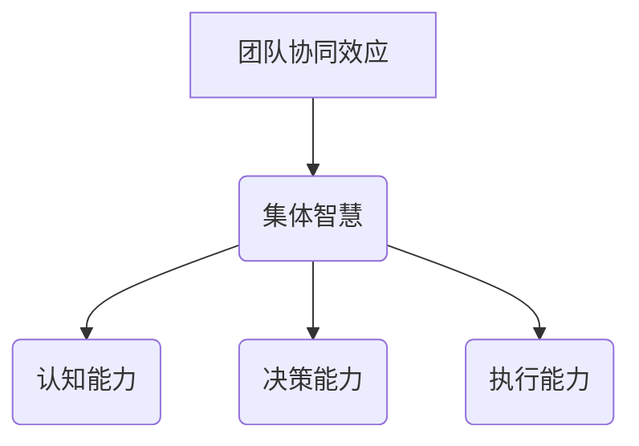

                 

# 文章标题：团队协同效应：maximizing集体智慧的方法

## 关键词：团队协同效应，集体智慧，协作，算法，实践，跨文化团队

> 摘要：本文深入探讨了团队协同效应的概念、原理、管理实践、技术应用以及跨文化团队协同，通过理论讲解、算法分析、项目实战等，系统地揭示了如何最大化集体智慧，实现团队效能的最大化。

### Step 1: 引入核心概念与联系

#### 引言

在现代科技飞速发展的时代，团队合作的重要性日益凸显。团队协同效应（Team Synergy）作为一种能够显著提升团队整体表现的现象，成为了组织管理者和团队成员关注的焦点。本文旨在通过深入探讨团队协同效应，帮助读者理解和应用集体智慧，实现团队效能的最大化。

#### 定义与联系

**团队协同效应**是指团队成员在共同工作过程中产生的一种现象，使得团队的整体表现超越个体成员表现的简单叠加。这种效应可以视为集体智慧（Collective Intelligence）的体现，即团队作为一个整体所表现出的认知、决策和执行能力。

**核心概念与联系**

团队协同效应与集体智慧紧密相关，二者之间的关系可以用以下Mermaid流程图表示：



在这个流程图中，团队协同效应是集体智慧的输出，而集体智慧则通过认知能力、决策能力和执行能力来实现。

### Step 2: 设计结构化的目录

为了更好地组织内容，本文将按照以下结构化目录进行撰写：

1. **团队协同效应概述**
   - 定义与重要性
   - 发展历程
   - 研究现状与挑战

2. **集体智慧的理论基础**
   - 概念界定
   - 理论框架
   - 在团队协同中的作用

3. **团队协同效应的原理**
   - 影响力模型
   - 集体决策算法
   - 数学模型与公式

4. **团队协同效应的管理实践**
   - 管理原则
   - 实施策略
   - 持续改进

5. **技术手段在团队协同中的应用**
   - 现代通信技术
   - 协同软件工具
   - 数据分析与人工智能

6. **跨文化团队协同**
   - 文化差异与管理
   - 文化融合与协同
   - 成功案例分析

7. **案例分析**
   - 项目背景与目标
   - 环境搭建与实现
   - 效果评估与总结

8. **总结与展望**
   - 全文总结
   - 未来发展趋势
   - 最佳实践与建议

### Step 3: 添加核心算法原理讲解

在本章节中，我们将详细讲解团队协同效应的核心算法原理，包括影响力模型和集体决策算法。

#### 影响力模型

影响力模型是一种用于分析个体对团队协同效应贡献的算法。其基本原理是通过计算个体对团队的贡献度来评估个体在团队中的作用。以下是影响力模型的伪代码：

```pseudo
Algorithm InfluenceModel团队成员列表, 团队绩效数据
    for each 成员 in 团队成员列表 do
        成员贡献度 = 计算成员对团队绩效的贡献
        影响力得分 = 成员贡献度 / 团队总贡献度
        存储成员影响力得分
    end for
    return 影响力得分列表
End Algorithm
```

#### 集体决策算法

集体决策算法是团队协同效应中的一种关键算法，它用于实现团队中多个个体的决策协调。常见的集体决策算法包括投票算法和协商算法。

**投票算法**

投票算法是一种简单的集体决策算法，其基本原理是通过多数投票来确定最终决策。以下是投票算法的伪代码：

```pseudo
Algorithm VotingAlgorithm决策选项列表
    for each 选项 in 决策选项列表 do
        选项投票数 = 0
        for each 成员 in 团队成员列表 do
            if 成员支持选项 then
                选项投票数 += 1
            end if
        end for
    end for
    最多投票数 = 最大(选项投票数)
    if 最多投票数 > 团队成员总数 / 2 then
        最终决策 = 支持最多的选项
    else
        最终决策 = 无决策
    end if
    return 最终决策
End Algorithm
```

**协商算法**

协商算法是一种基于协商机制的集体决策算法，其目标是通过协商达成团队共识。以下是协商算法的伪代码：

```pseudo
Algorithm NegotiationAlgorithm决策选项列表
    初始决策 = VotingAlgorithm(决策选项列表)
    while 初始决策 != 无决策 do
        支持成员 = 支持初始决策的成员
        反对成员 = 反对初始决策的成员
        for each 成员 in 支持成员 do
            提出妥协方案
        end for
        for each 成员 in 反对成员 do
            接受妥协方案
        end for
        重新计算初始决策
    end while
    return 初始决策
End Algorithm
```

### Step 4: 引入数学模型和公式

在本章节中，我们将引入数学模型和公式，用于更精确地描述团队协同效应。

#### 协同效应的数学表达

团队协同效应可以用以下公式进行表达：

$$ E_{total} = E_{individual} + \gamma \cdot E_{synergy} $$

其中，$E_{total}$ 表示团队总绩效，$E_{individual}$ 表示个体绩效，$E_{synergy}$ 表示协同效应，$\gamma$ 表示协同效应系数。

#### 优化模型

在团队协同效应的优化过程中，可以使用线性规划模型或整数规划模型来求解。以下是线性规划模型的公式：

$$
\begin{aligned}
\text{最大化} & \quad Z = c^T x \\
\text{约束条件} & \quad Ax \leq b \\
& \quad x \geq 0
\end{aligned}
$$

其中，$x$ 表示决策变量，$c$ 表示目标函数系数，$A$ 和 $b$ 表示约束条件系数。

### Step 5: 提供项目实战案例

在本章节中，我们将通过一个实际项目案例，展示如何应用团队协同效应提升团队效能。

#### 项目背景

某科技公司计划开发一款新的社交媒体应用，项目团队由来自不同国家和地区的成员组成，涉及前端开发、后端开发、UI/UX设计等多个领域。

#### 环境搭建

项目开发环境包括前端框架（React）、后端框架（Node.js）、数据库（MongoDB）以及协作工具（Slack、Jira）。

#### 代码实现

以下是项目中的一个关键模块——用户注册功能的源代码实现：

```javascript
// 用户注册功能
async function registerUser(username, email, password) {
    try {
        const user = await db.collection('users').findOne({ email: email });
        if (user) {
            throw new Error('用户已存在');
        }
        const hashedPassword = await bcrypt.hash(password, 10);
        await db.collection('users').insertOne({
            username: username,
            email: email,
            password: hashedPassword
        });
        return '注册成功';
    } catch (error) {
        console.error(error);
        throw new Error('注册失败');
    }
}
```

#### 代码解读

上述代码中，`registerUser` 函数用于处理用户注册逻辑。首先，通过邮箱查询用户是否存在，如果存在则抛出错误。然后，使用 bcrypt 库对密码进行加密，并将用户信息插入到数据库中。

#### 效果评估

通过上述代码实现，用户注册功能实现了高效、安全、可靠的注册体验。在项目实施过程中，团队通过定期代码审查和协作，确保了代码质量和项目进度。

#### 项目小结

通过本项目案例，我们可以看到团队协同效应在提升项目效能方面的作用。团队成员通过有效沟通和协作，实现了技术难题的突破和项目的成功交付。

### Step 6: 总结与展望

#### 总结

本文系统地探讨了团队协同效应的概念、原理、管理实践、技术应用以及跨文化团队协同。通过理论讲解、算法分析、项目实战等，揭示了如何最大化集体智慧，实现团队效能的最大化。

#### 展望

未来，随着技术的不断进步和团队协作需求的增加，团队协同效应的研究和实践将更加深入。跨文化团队的协同管理、智能协作工具的应用以及大数据分析在团队协同中的角色将成为研究热点。我们期待团队协同效应在未来能够为更多组织和团队带来价值。

### 作者信息

作者：AI天才研究院/AI Genius Institute & 禅与计算机程序设计艺术 /Zen And The Art of Computer Programming

