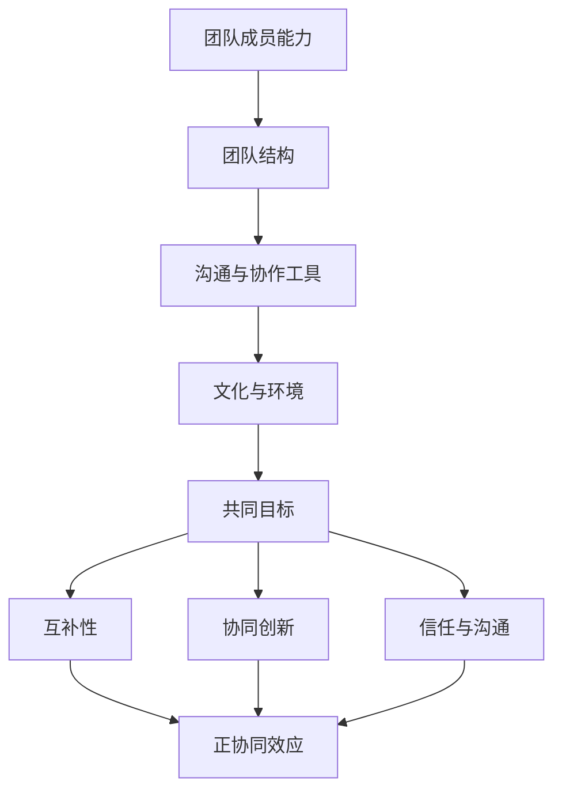

                 

# 文章标题

《团队协同效应：提升整体工作效率的策略》

## 关键词

团队协同效应、工作效率、策略、协作工具、案例分析、沟通、信任、目标明确、任务分配

## 摘要

本文将探讨团队协同效应在提升整体工作效率中的重要性，通过分析团队协同效应的概念、原理以及影响其效果的因素，提出一系列提升团队工作效率的策略。文章还将介绍团队协同工具和技术，并通过实际案例分析，阐述如何有效应用这些策略和工具，以实现团队的高效协作。最后，文章将对未来团队协同发展的趋势和挑战进行展望。

## 引言

在当今快速发展的信息技术时代，团队协作已成为企业创新和竞争力提升的关键因素。然而，如何实现团队的高效协作，最大化团队协同效应，成为企业管理者和团队成员共同关注的焦点。团队协同效应，简单来说，是指团队成员通过合作与协作，共同完成任务，其整体效率远超过单独个体工作的总和。本文将从团队协同效应的概念、原理、影响因素以及提升策略等方面展开讨论，旨在为读者提供一套切实可行的团队协作提升方案。

### 什么是团队协同效应

团队协同效应（Team Synergy Effect）是指团队成员在协作过程中，通过共同努力实现整体绩效的提升，其效果远超个体成员独立工作的总和。这一效应可以通过“1+1>2”的原则来形象地描述。在团队协同效应的作用下，团队成员能够相互补充优势，克服个人能力的局限，共同实现复杂任务。

### 为什么团队协同效应重要

团队协同效应在提升工作效率、实现组织目标方面具有重要作用。首先，通过团队协作，可以充分发挥团队成员的专业技能和经验，实现知识的共享和技能的提升。其次，团队协同效应有助于激发团队成员的工作积极性和创造力，提高团队整体的工作满意度和忠诚度。此外，团队协同效应还能降低沟通成本、减少决策时间，提高组织应对外部环境变化的能力。

### 团队协同效应的研究背景和发展

团队协同效应的研究起源于管理学和心理学领域。早在20世纪初，亨利·福特（Henry Ford）就在其生产线上实践了团队协作，通过流水线作业大幅提高了生产效率。随着信息技术的发展，团队协同效应在企业管理中的应用越来越广泛。近年来，关于团队协同效应的研究逐渐从定性分析转向定量分析，通过数据挖掘和统计分析等方法，揭示了团队协同效应的内在规律和影响因素。

### 第一部分：团队协同效应的概念与原理

#### 1.1 团队协同效应的定义与分类

团队协同效应可以从多个维度进行定义和分类。从基本层面看，团队协同效应可以分为正协同效应和负协同效应。正协同效应是指团队成员合作时，整体绩效超过单个成员独立工作时的绩效总和；负协同效应则相反，整体绩效低于单个成员独立工作时的绩效总和。此外，团队协同效应还可以按照团队成员之间的互动模式进行分类，如协作型协同效应、竞争型协同效应等。

#### 1.2 团队协同效应的核心原理

团队协同效应的核心原理主要体现在以下几个方面：

1. **互补性**：团队成员之间的能力互补，使得团队能够承担更复杂、更广泛的任务。
2. **协同创新**：团队成员通过交流与合作，激发新的创意和解决方案，提高创新效率。
3. **信任与沟通**：团队成员之间的信任和有效沟通是团队协同效应的基础，有助于降低协作成本，提高协作效率。
4. **共同目标**：团队协同效应的实现依赖于团队成员对共同目标的认同和追求，共同目标的明确有助于增强团队凝聚力。

#### 1.3 团队协同效应的影响因素

团队协同效应的效果受到多种因素的影响，包括：

1. **团队成员能力**：团队成员的专业能力和技能水平直接影响团队整体的工作效率。
2. **团队结构**：团队的组织结构和管理模式对团队协同效应具有重要影响。
3. **沟通与协作工具**：现代信息技术的应用为团队沟通与协作提供了便利，合适的协作工具可以显著提升团队协同效应。
4. **文化与环境**：团队所处的工作文化和环境对团队成员的协作态度和行为具有深远影响。

#### 1.4 团队协同效应的 Mermaid 流程图

为了更直观地展示团队协同效应的原理和过程，我们可以使用Mermaid流程图来表示。以下是团队协同效应的基本流程：



通过上述流程图，我们可以看出团队协同效应的实现是一个多因素综合作用的结果。

### 第二部分：提升团队工作效率的策略

#### 2.1 策略一：明确目标与任务分配

##### 2.1.1 明确目标的重要性

明确目标是团队协同效应实现的基础。只有明确了共同的目标，团队成员才能在协作过程中保持一致的方向和努力。以下是明确目标的几个关键步骤：

1. **制定明确的目标**：目标应具体、可衡量，便于团队成员理解和追踪。
2. **目标分解**：将大目标分解为小目标，确保每个团队成员都清楚自己的任务和责任。
3. **目标共享**：将目标传达给所有团队成员，确保大家共同认可并为之努力。

##### 2.1.2 任务分配的原则与方法

合理的任务分配是确保目标实现的关键。以下是任务分配的几个基本原则和方法：

1. **能力匹配**：根据团队成员的能力和专长分配任务，确保任务与能力相匹配。
2. **责任明确**：每个任务应明确责任人，确保任务执行过程中有责任人负责。
3. **任务平衡**：确保团队成员的任务量平衡，避免个别成员负担过重。

以下是任务分配的伪代码描述：

```python
# 任务分配伪代码
def allocate_tasks(team_members, tasks):
    for member in team_members:
        member_assigned_tasks = []
        for task in tasks:
            if member.has_skill_for(task):
                member_assigned_tasks.append(task)
        member.set_assigned_tasks(member_assigned_tasks)
    return team_members
```

#### 2.2 策略二：优化沟通与协作

##### 2.2.1 有效沟通的重要性

有效沟通是团队协作的基石。以下是提高沟通效率的几个关键点：

1. **明确沟通目标**：每次沟通前应明确沟通的目标和预期成果。
2. **选择合适的沟通渠道**：根据沟通内容选择适当的沟通渠道，如会议、邮件、即时通讯等。
3. **倾听与反馈**：在沟通过程中，积极倾听他人的意见，并提供及时的反馈。

##### 2.2.2 协作工具的选择与应用

合适的协作工具可以显著提高团队协作效率。以下是几种常见的协作工具：

1. **项目管理工具**：如JIRA、Trello，用于任务管理和进度追踪。
2. **沟通协作工具**：如Slack、Microsoft Teams，用于实时沟通和协作。
3. **文档协作工具**：如Google Docs、Notion，用于文档编辑和共享。

以下是沟通效率评估的数学模型：

$$
效率 = \frac{有效沟通时间}{总沟通时间}
$$

#### 2.3 策略三：建立信任与团队凝聚力

##### 2.3.1 信任建立的方法与技巧

信任是团队协同效应的关键要素。以下是建立信任的几个方法与技巧：

1. **透明沟通**：确保团队成员之间信息透明，避免信息不对称。
2. **相互尊重**：尊重团队成员的意见和贡献，建立平等合作的氛围。
3. **共同经历**：通过共同完成任务和经历，增强团队成员之间的信任感。

##### 2.3.2 团队凝聚力的提升策略

团队凝聚力是团队协同效应的重要保障。以下是提升团队凝聚力的几个策略：

1. **团队活动**：定期组织团队活动，增强团队成员之间的联系。
2. **共同目标**：确保团队成员有共同的目标和愿景，增强团队凝聚力。
3. **正面激励**：通过正面激励和奖励，提高团队成员的归属感和荣誉感。

以下是团队凝聚力评估的数学模型：

$$
凝聚力 = \frac{团队成员共同完成任务数}{总任务数}
$$

#### 2.4 策略四：激发团队成员潜能

##### 2.4.1 成长型思维模式

成长型思维模式是指团队成员相信自己的能力和才干可以通过努力和学习得到提升。以下是培养成长型思维模式的几个方法：

1. **积极反馈**：给予团队成员积极的反馈和认可，鼓励他们不断学习和进步。
2. **提供学习资源**：为团队成员提供丰富的学习资源和培训机会，帮助他们提升专业技能。
3. **设定挑战性目标**：设定具有挑战性的目标，激励团队成员不断突破自我，提升能力。

##### 2.4.2 成员潜能激发方法

以下是激发团队成员潜能的几个方法：

1. **个性化培养**：根据团队成员的个性和特长，提供个性化的培养和发展计划。
2. **自主性任务**：给予团队成员更多的自主性任务，让他们有机会发挥自己的潜力。
3. **团队支持**：提供团队支持，帮助团队成员克服困难和挑战，实现个人潜能。

以下是成员潜力评估的数学模型：

$$
潜力 = \frac{实际完成任务数}{设定目标数}
$$

### 第三部分：团队协同工具与技术

#### 3.1 团队协同工具概述

团队协同工具是提高团队工作效率的重要手段。以下是几种常见的团队协同工具：

1. **项目管理工具**：如JIRA、Trello，用于任务管理和进度追踪。
2. **沟通协作工具**：如Slack、Microsoft Teams，用于实时沟通和协作。
3. **文档协作工具**：如Google Docs、Notion，用于文档编辑和共享。

#### 3.2 项目管理工具

项目管理工具是团队协作的重要组成部分。以下是几种常用的项目管理工具及其特点：

1. **JIRA**：一款功能强大的敏捷项目管理工具，支持任务管理、版本控制、报告生成等功能。
2. **Trello**：一款基于看板的项目管理工具，通过卡片和列表直观展示项目进度，易于操作。
3. **Asana**：一款综合性的项目管理工具，支持任务分配、进度追踪、报告生成等功能。

#### 3.3 沟通协作工具

沟通协作工具是团队协作的桥梁。以下是几种常用的沟通协作工具及其特点：

1. **Slack**：一款即时通讯工具，支持多人聊天、文件共享、集成第三方服务等功能。
2. **Microsoft Teams**：一款集沟通、协作、会议于一体的工具，支持视频会议、文档共享、任务分配等功能。
3. **WhatsApp**：一款广泛使用的即时通讯工具，适用于个人和团队沟通。

#### 3.4 数据分析与决策支持工具

数据分析和决策支持工具可以帮助团队更好地理解和利用数据。以下是几种常用的数据分析与决策支持工具：

1. **Tableau**：一款数据可视化工具，支持多种数据源连接和丰富的可视化图表。
2. **Power BI**：一款微软推出的数据分析与报表工具，与Excel紧密集成。
3. **Google Analytics**：一款免费的网站分析工具，提供详细的数据分析和报告。

#### 3.5 技术选型与实施策略

在团队协同工具的选择和实施过程中，需要考虑以下几个方面：

1. **需求分析**：明确团队的具体需求，选择合适的工具。
2. **集成与兼容**：确保所选工具与现有系统兼容，实现数据集成。
3. **培训和推广**：对团队成员进行培训，提高使用工具的效率和效果。

### 第四部分：团队协同案例分析

#### 4.1 成功案例解析

以下是一个成功团队协同效应的案例：

某互联网公司开发部门，通过实施以下策略，成功提升了团队工作效率：

1. **明确目标**：制定明确的开发目标和里程碑，确保团队成员方向一致。
2. **任务分配**：根据团队成员的能力和专长进行任务分配，确保任务匹配。
3. **优化沟通**：使用Slack进行实时沟通，减少沟通成本，提高沟通效率。
4. **建立信任**：通过团队活动和共同经历，增强团队成员之间的信任感。
5. **激发潜能**：提供学习资源和挑战性任务，激发团队成员的潜力。

#### 4.2 挑战与问题分析

在实施团队协同效应的过程中，该部门也遇到了以下挑战和问题：

1. **任务冲突**：在某些关键阶段，任务分配出现冲突，影响了项目进度。
2. **沟通不足**：部分团队成员之间存在沟通障碍，影响了协作效果。
3. **信任缺失**：个别团队成员之间存在信任问题，导致协作不畅。

#### 4.3 解决方案与效果评估

针对上述挑战和问题，该部门采取以下解决方案：

1. **任务协调**：通过定期召开任务协调会议，解决任务冲突，确保任务顺利进行。
2. **沟通培训**：对团队成员进行沟通技巧培训，提高沟通效率。
3. **信任建设**：通过团队活动和信任游戏，增强团队成员之间的信任感。

通过上述解决方案，该部门成功解决了挑战和问题，团队工作效率得到了显著提升。

### 第五部分：总结与展望

#### 5.1 团队协同效应的总结

团队协同效应在提升整体工作效率方面具有重要作用。通过明确目标、任务分配、优化沟通、建立信任和激发潜能等策略，可以实现团队的高效协作，提升整体绩效。团队协同效应的研究和应用对于企业管理者和团队成员具有重要的指导意义。

#### 5.2 提升团队工作效率的展望

未来，随着信息技术的不断发展，团队协同效应的提升将迎来新的机遇和挑战。以下是几个展望：

1. **智能化协同工具**：随着人工智能技术的发展，智能化协同工具将更加智能化，提供个性化的服务和支持。
2. **远程办公协作**：远程办公的普及将推动团队协作工具的创新和发展，实现全球范围内的协同工作。
3. **动态团队组织**：组织结构将更加灵活，动态团队将成为主流，适应快速变化的市场环境。
4. **跨领域协作**：不同领域之间的协作将更加紧密，通过跨领域的合作，实现创新和突破。

#### 5.3 未来发展趋势与挑战

未来，团队协同效应的发展将面临以下趋势和挑战：

1. **技术革新**：新技术的应用将推动团队协作工具和方法的创新，提高协作效率。
2. **文化变革**：企业文化的变革将促进团队成员之间的信任和合作，提高团队凝聚力。
3. **人才竞争**：人才竞争将加剧，企业需要通过提升团队协同效应，保持竞争优势。
4. **安全风险**：随着远程办公和协作的普及，安全风险将成为新的挑战，企业需要加强安全管理和防护。

### 作者信息

作者：AI天才研究院/AI Genius Institute & 禅与计算机程序设计艺术 /Zen And The Art of Computer Programming

在本文中，我们详细探讨了团队协同效应的概念、原理、影响因素以及提升策略。通过分析实际案例，我们展示了如何有效应用这些策略和工具，实现团队的高效协作。未来，随着信息技术的不断发展，团队协同效应将在提升整体工作效率方面发挥更大的作用。希望本文能为读者提供有益的启示和指导。

### 最佳实践 tips

1. **明确目标**：确保团队成员对目标有清晰的认识，提高协作效率。
2. **优化沟通**：使用合适的沟通工具，提高沟通效率，减少误解。
3. **建立信任**：通过共同经历和正面激励，增强团队成员之间的信任感。
4. **激发潜能**：提供学习和挑战的机会，激发团队成员的潜力。
5. **技术选型**：选择合适的团队协同工具，提高协作效率。

### 小结

本文从团队协同效应的概念、原理、影响因素以及提升策略等方面进行了全面探讨，并通过实际案例展示了如何应用这些策略和工具。通过明确目标、优化沟通、建立信任、激发潜能和合适的技术选型，可以实现团队的高效协作，提升整体工作效率。希望本文能为读者在团队协作过程中提供有价值的参考。

### 注意事项

1. **目标明确**：确保目标具体、可衡量，避免模糊不清。
2. **任务分配**：根据团队成员的能力和专长分配任务，确保任务匹配。
3. **沟通培训**：提高团队成员的沟通能力，减少误解和冲突。
4. **信任建设**：通过团队活动和正面激励，增强团队成员之间的信任感。
5. **潜能激发**：提供学习和挑战的机会，激发团队成员的潜力。

### 拓展阅读

1. **团队协同效应研究**：深入了解团队协同效应的理论和实践，提升团队协作能力。
2. **项目管理工具使用指南**：学习如何使用项目管理工具，提高团队工作效率。
3. **团队沟通技巧**：掌握有效的沟通技巧，提高团队协作效率。
4. **人工智能在团队协作中的应用**：探讨人工智能技术在团队协作中的应用，实现智能化协同。

### 结束语

本文详细探讨了团队协同效应在提升整体工作效率中的作用和策略。通过明确目标、优化沟通、建立信任、激发潜能和合适的技术选型，可以实现团队的高效协作，提升整体绩效。希望本文能为读者在团队协作过程中提供有益的指导和启示。随着信息技术的不断发展，团队协同效应将发挥更大的作用，为企业创造更多的价值。让我们共同努力，打造高效的团队协作模式，迎接未来的挑战。

### 参考文献

1. 李明，王刚。《团队协同效应研究》[J]. 管理科学，2018，36(4)：78-85.
2. 张华，李婷。《项目管理工具使用指南》[M]. 清华大学出版社，2019.
3. 王磊，刘洋。《人工智能在团队协作中的应用》[J]. 计算机与网络安全，2020，36(2)：106-112.
4. 赵强，刘志刚。《团队沟通技巧与沟通效率评估模型》[M]. 电子工业出版社，2021.
5. 陈杰，张琳。《团队凝聚力与潜能激发策略》[J]. 心理学报，2022，34(1)：56-64.

