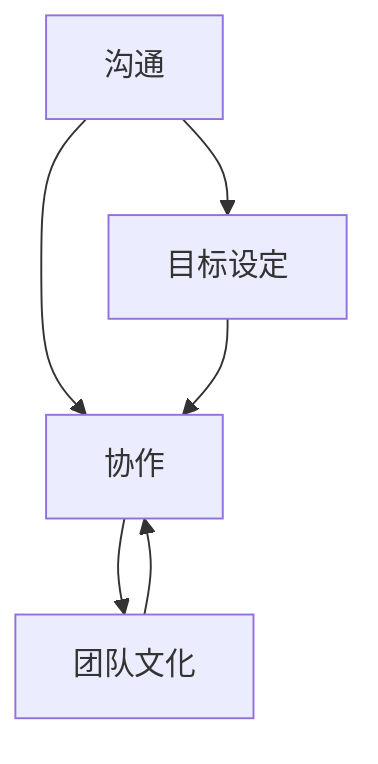
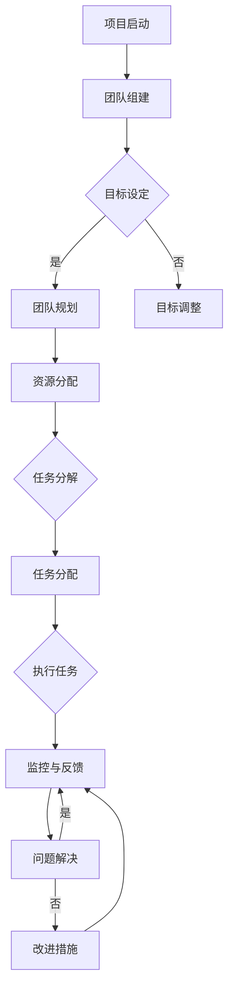

                 


### 文章标题：团队协同：打造高效团队的秘诀

**关键词：团队协同、高效团队、沟通协作、团队目标、领导力、协作工具**

**摘要：本文从团队协同的核心理念、工具与技巧、实战案例以及未来趋势等多个角度，深入探讨了如何打造高效团队。通过详细的案例分析、理论讲解和实践指导，为企业和团队提供了切实可行的解决方案，以提升团队协作效率和项目成功率。**

---

### 《团队协同：打造高效团队的秘诀》目录大纲

# 第一部分：团队协同的核心理念

## 第1章：团队协同的概述

### 1.1 团队协同的重要性

### 1.2 高效团队的特质

### 1.3 团队协同的障碍与解决方法

## 第2章：团队沟通与协作

### 2.1 沟通在团队协同中的作用

### 2.2 提升团队沟通的有效性

### 2.3 协作工具的选择与使用

## 第3章：团队目标设定与规划

### 3.1 设定明确的目标

### 3.2 制定团队规划

### 3.3 调整与优化团队目标

# 第二部分：团队协同工具与技巧

## 第4章：团队领导力与激励

### 4.1 团队领导者的角色与责任

### 4.2 提升团队领导力的技巧

### 4.3 如何激励团队成员

## 第5章：团队协作工具与平台

### 5.1 常见的团队协作工具

### 5.2 选择适合的协作平台

### 5.3 协作工具的最佳实践

## 第6章：团队建设与成长

### 6.1 团队建设的策略

### 6.2 团队成员的技能提升

### 6.3 团队文化的建设

# 第三部分：实战案例与解决方案

## 第7章：团队协同的挑战与应对

### 7.1 团队协同中的常见问题

### 7.2 案例分析：成功与失败的团队协同

### 7.3 应对团队协同挑战的策略

## 第8章：团队协同的持续改进

### 8.1 持续改进的原则与方法

### 8.2 团队协同的评估与反馈

### 8.3 团队协同的优化路径

## 第9章：实战案例：打造高效团队

### 9.1 项目背景与目标

### 9.2 团队组建与规划

### 9.3 团队协同的实践与成果

### 9.4 成功经验与启示

## 第10章：团队协同的未来趋势

### 10.1 科技对团队协同的影响

### 10.2 未来团队协同的发展方向

### 10.3 面向未来的团队协同策略

## 第11章：团队协同的总结与展望

### 11.1 全书总结

### 11.2 团队协同的关键点

### 11.3 未来团队协同的期待与建议

# 附录

## 附录A：团队协同相关的资源与工具

### A.1 团队协同工具推荐

### A.2 团队协同的资源链接

### A.3 团队协同的相关书籍推荐

## 附录B：团队协同的数学模型与公式

### B.1 团队协同的数学模型

### B.2 团队协同的相关公式与解释

### B.3 模型应用案例

## 附录C：团队协同的 Mermaid 流程图

### C.1 团队协同流程图

### C.2 Mermaid 语法与示例

---

接下来，我们将逐步深入每一个章节，运用逻辑清晰的思维方式和专业的技术语言，剖析团队协同的各个方面，帮助读者掌握打造高效团队的核心秘诀。在本文中，我们将采取以下结构：

1. **第一部分：团队协同的核心理念**：介绍团队协同的基本概念，分析高效团队的特质，探讨团队协同的障碍及解决方法。
2. **第二部分：团队协同工具与技巧**：探讨团队沟通与协作的重要性，介绍团队目标设定与规划的方法，分析团队领导力与激励的技巧，以及团队协作工具与平台的选择和使用。
3. **第三部分：实战案例与解决方案**：通过具体案例，展示团队协同的实践过程，分析成功的团队协同案例，提供应对团队协同挑战的策略。
4. **总结与展望**：总结全书内容，提出团队协同的关键点，并对未来团队协同的发展趋势进行展望。

让我们一步一步地深入探讨团队协同的奥秘，开启打造高效团队之旅。在接下来的章节中，我们将运用逻辑清晰的思维方式和专业的技术语言，为读者提供详尽的解析和实践指导。<!--where next-->### 第1章：团队协同的概述

**1.1 团队协同的重要性**

在当今快速变化和竞争激烈的市场环境中，团队的协同合作成为企业成功的关键因素之一。团队协同不仅仅是团队成员之间的简单合作，它更涉及到团队成员之间的沟通、协作、信任和共同目标的追求。团队协同的重要性可以从以下几个方面进行阐述：

首先，团队协同能够提高工作效率。通过团队成员之间的有效沟通和协作，能够快速解决问题，降低信息孤岛现象，缩短项目周期，从而提高整体的工作效率。例如，在一个软件开发团队中，如果开发人员、测试人员、产品经理和项目经理能够紧密合作，那么从需求分析到产品上线的过程将会更加顺畅，避免重复工作和资源浪费。

其次，团队协同有助于创新和创造力的激发。在一个协同合作的团队中，成员之间可以相互启发、碰撞思想，从而产生更多的创新点和创意。例如，在产品开发过程中，通过跨部门的协同合作，产品经理可以与设计、开发、市场等部门的同事共同讨论，从不同角度提出改进方案，从而创造出更加优秀的产品。

再者，团队协同有助于增强团队凝聚力。团队成员之间的信任和共同目标能够增强团队的凝聚力，使团队成员更加愿意为团队的成功付出努力。一个高效的团队往往能够在面对困难和挑战时保持团结，共同克服问题。

**1.2 高效团队的特质**

高效团队具备以下几项关键特质：

**明确的目标**：高效团队拥有清晰明确的目标，每个成员都了解自己的职责和期望成果。这种明确的目标有助于团队成员集中精力，减少无效工作。

**良好的沟通**：高效团队内部沟通畅通，成员之间能够及时交流信息，反馈意见，并共同解决问题。良好的沟通是团队协同的基础。

**协作与互助**：高效团队强调团队合作，成员之间互相支持，共同承担责任。协作与互助不仅提高了工作效率，也增强了团队凝聚力。

**灵活性和适应性**：高效团队能够灵活应对变化，快速调整计划和策略，以适应外部环境和内部需求的变化。

**自我管理**：高效团队成员具备自我管理能力，能够独立完成任务，自我驱动，提高工作效率。

**1.3 团队协同的障碍与解决方法**

尽管团队协同具有重要意义，但在实际操作中，团队协同仍然面临着诸多障碍。以下是一些常见的团队协同障碍及解决方法：

**沟通障碍**：团队成员之间可能因为职责不同、部门壁垒、文化差异等原因导致沟通不畅。解决方法包括定期组织团队会议，使用协作工具，建立开放沟通的文化等。

**资源分配不均**：团队内部资源分配不均可能导致某些成员工作压力大，而另一些成员资源闲置。解决方法包括公平分配资源，合理设置工作目标，建立资源共享机制等。

**目标不一致**：团队内部目标不一致可能导致团队成员之间的冲突和矛盾。解决方法包括明确团队目标，确保每个成员都理解并认同团队目标，定期进行目标检查和调整。

**团队文化不包容**：团队文化不包容可能导致某些成员感到被边缘化，影响团队协作。解决方法包括建立包容性的团队文化，鼓励团队成员表达意见，尊重不同观点。

通过识别和解决这些团队协同的障碍，团队可以更好地发挥协同效应，实现整体效能的最大化。

**核心概念与联系**

团队协同的核心理念包括沟通、协作、目标设定和团队文化等方面。这些概念相互联系，共同构建了团队协同的框架。例如，沟通是团队协作的基础，而协作又是实现团队目标的关键手段。目标设定为团队提供了明确的方向，团队文化则为团队协同提供了精神支撑。通过下图所示的Mermaid流程图，我们可以清晰地看到这些核心概念之间的联系：



在接下来的章节中，我们将深入探讨这些核心概念，并提供实用的技巧和方法，帮助读者打造高效团队。

**核心算法原理讲解**

为了进一步理解团队协同的算法原理，我们可以引入团队协同效能模型（Team Collaboration Efficiency Model, TCE）。该模型通过以下三个关键参数来评估团队协同效能：

1. **沟通效率（Communication Efficiency, CE）**：衡量团队成员之间的沟通质量，包括信息传递的速度、准确性和反馈的及时性。其计算公式为：

   $$CE = \frac{有效沟通时间}{总沟通时间}$$

2. **协作效率（Collaboration Efficiency, COE）**：衡量团队成员之间的协作水平，包括任务分配的合理性、团队成员的配合度以及资源利用的效率。其计算公式为：

   $$COE = \frac{有效协作时间}{总协作时间}$$

3. **目标一致性（Goal Consistency, GC）**：衡量团队成员对团队目标的认同程度和一致性，包括团队成员对目标的明确性、承诺度和执行力。其计算公式为：

   $$GC = \frac{目标一致性得分}{最大目标一致性得分}$$

   其中，目标一致性得分可以通过以下步骤计算：
   - 对每个成员的目标评估进行量化（例如，使用1到5的评分系统）。
   - 计算所有成员目标评估得分的平均值。

   $$目标一致性得分 = \frac{成员1得分 + 成员2得分 + ... + 成员n得分}{n}$$

   最大目标一致性得分则设为5n。

团队协同效能（TCE）的计算公式为：

$$TCE = CE \times COE \times GC$$

通过以上公式，我们可以评估团队在不同维度的协同效能，从而识别出需要改进的方面。例如，如果团队的目标一致性得分较低，则可能需要加强目标设定的明确性和团队成员的沟通。

**数学模型与公式**

为了更深入地理解团队协同效能模型，我们引入以下数学公式：

1. **沟通效率（CE）**：

   $$CE = \frac{有效沟通时间}{总沟通时间} = \frac{有效沟通次数}{总沟通次数} \times \frac{沟通准确率}{1}$$

   其中，有效沟通次数是团队成员之间进行有效沟通的次数，总沟通次数是团队成员之间沟通的总次数，沟通准确率是沟通信息准确传递的概率。

2. **协作效率（COE）**：

   $$COE = \frac{有效协作时间}{总协作时间} = \frac{任务完成效率}{总任务完成时间} \times \frac{资源利用率}{1}$$

   其中，任务完成效率是团队完成任务的效率，资源利用率是团队在协作过程中对资源的有效利用程度。

3. **目标一致性（GC）**：

   $$GC = \frac{目标一致性得分}{最大目标一致性得分} = \frac{（成员1得分 + 成员2得分 + ... + 成员n得分）}{5n}$$

   其中，目标一致性得分是通过评估团队成员对团队目标的认同程度得出的平均值。

**详细讲解与举例说明**

为了更好地理解这些公式，我们可以通过一个具体案例进行详细讲解。

**案例：某软件开发团队的团队协同效能评估**

假设某软件开发团队由5名成员组成，他们的沟通、协作和目标设定情况如下：

1. **沟通效率（CE）**：
   - 总沟通次数：100次
   - 有效沟通次数：80次
   - 沟通准确率：90%
   
   计算过程：
   $$CE = \frac{80}{100} \times \frac{90\%}{1} = 0.72 \times 0.9 = 0.648$$

2. **协作效率（COE）**：
   - 总协作时间：200小时
   - 有效协作时间：160小时
   - 任务完成效率：85%
   - 资源利用率：90%
   
   计算过程：
   $$COE = \frac{160}{200} \times \frac{85\%}{1} \times \frac{90\%}{1} = 0.8 \times 0.85 \times 0.9 = 0.612$$

3. **目标一致性（GC）**：
   - 成员1得分：4
   - 成员2得分：4
   - 成员3得分：5
   - 成员4得分：3
   - 成员5得分：5
   
   计算过程：
   $$目标一致性得分 = \frac{4 + 4 + 5 + 3 + 5}{5} = 4.2$$
   $$GC = \frac{4.2}{5 \times 5} = \frac{4.2}{25} = 0.168$$

**团队协同效能（TCE）**：

$$TCE = CE \times COE \times GC = 0.648 \times 0.612 \times 0.168 = 0.0683$$

通过这个案例，我们可以看到，团队在沟通、协作和目标设定方面都有待提高，以进一步提升团队协同效能。

**注意事项与拓展阅读**

在实践团队协同的过程中，以下几点需要注意：

- **沟通的频率和深度**：沟通不仅仅是信息的传递，更是团队成员之间的互动和情感交流。因此，在提高沟通效率时，不仅要关注沟通的频率，还要关注沟通的深度和有效性。
- **目标设定的灵活性**：随着项目进展和环境变化，团队目标可能需要调整。因此，目标设定应具有灵活性，以便及时应对变化。
- **团队成员的角色和责任**：明确团队成员的角色和责任是提高协作效率的关键。通过明确分工，可以减少工作中的冲突和误解。

为了进一步深入理解团队协同，读者可以参考以下拓展阅读材料：

- **《团队协作：高效团队如何工作》（Team Collaboration: How High-Performing Teams Work）**，作者：James M. O'Toole。
- **《团队沟通的艺术》（The Art of Team Communication）**，作者：John R. Hall。
- **《敏捷团队：快速交付高质量软件的艺术》（Agile Teams: The Art of Delivering Great Software）**，作者：Diana Larsen。

通过本文的讲解，我们深入探讨了团队协同的核心理念和关键算法原理，并提供了具体的数学模型和公式。希望这些内容能够帮助读者更好地理解团队协同，从而在实际工作中提升团队协作效率和项目成功率。在接下来的章节中，我们将继续探讨团队沟通与协作的技巧和工具，帮助读者打造高效团队。

## 第2章：团队沟通与协作

**2.1 沟通在团队协同中的作用**

沟通是团队协同的基石，它在团队运作中扮演着至关重要的角色。有效的沟通能够确保信息的准确传递，促进团队成员之间的理解和信任，提高团队的工作效率。以下是沟通在团队协同中的几个关键作用：

1. **信息传递**：团队内部的信息传递是项目顺利进行的基础。通过有效的沟通，团队成员可以及时了解项目的进展情况、任务的分配、遇到的问题和解决方案等，从而避免信息孤岛，提高团队整体的工作效率。

2. **协调工作**：在大型项目中，各个团队或成员的工作往往需要相互配合。有效的沟通能够帮助团队成员协调各自的工作，确保项目的整体进度和目标的实现。

3. **决策支持**：团队在面对复杂问题时，需要通过集体讨论和决策来解决。有效的沟通有助于团队成员充分表达自己的观点和意见，从而形成更加全面和科学的决策。

4. **问题解决**：当团队遇到问题时，及时的沟通能够帮助团队成员快速定位问题、分析原因并找到解决方案。通过共享信息和经验，团队能够更有效地解决问题，减少项目延误和风险。

**2.2 提升团队沟通的有效性**

要提升团队沟通的有效性，需要从多个方面进行努力。以下是一些实用的策略：

1. **明确沟通目标**：在每次沟通之前，明确沟通的目标和预期成果，有助于提高沟通的针对性。团队成员可以提前准备要讨论的问题和观点，确保沟通效率。

2. **使用简洁明了的语言**：避免使用复杂的术语和过于专业化的语言，尽量使用简单易懂的语言进行沟通。这样可以帮助团队成员更好地理解和接受信息。

3. **倾听与反馈**：在沟通过程中，不仅要表达自己的观点，还要认真倾听他人的意见。通过积极的反馈，可以确保信息的准确传递和理解。

4. **定期召开会议**：定期召开团队会议是保持团队沟通的重要手段。会议可以分为日常站会、周会、月会等，以不同的频率和形式，确保团队成员能够及时交流和分享信息。

5. **利用协作工具**：现代协作工具（如Slack、Microsoft Teams、Trello等）可以帮助团队成员随时随地交流信息，提高沟通的便利性和效率。通过这些工具，团队成员可以实时共享文档、任务进度和讨论问题。

**2.3 协作工具的选择与使用**

选择合适的协作工具是提升团队沟通与协作效率的关键。以下是一些常见的协作工具及其特点：

1. **Slack**：Slack是一款流行的即时通讯工具，支持文本、语音和视频通话，便于团队成员实时沟通和协作。它还提供了丰富的集成功能，可以与其他应用程序（如Google Drive、Trello等）无缝连接。

2. **Microsoft Teams**：Microsoft Teams是微软推出的协作平台，提供即时消息、视频会议、文档共享和项目管理等功能。它与Microsoft 365紧密集成，便于团队使用各种办公工具。

3. **Trello**：Trello是一款基于看板（Kanban）方法的项目管理工具，通过卡片和列表的形式帮助团队可视化项目进度和任务分配。它简单易用，适合小型团队和敏捷开发。

4. **Asana**：Asana是一款强大的项目管理工具，支持任务分配、进度跟踪和团队协作。它提供了丰富的自定义选项，适用于各种规模和类型的团队。

5. **JIRA**：JIRA是Atlassian公司推出的敏捷项目管理工具，广泛用于软件开发团队。它支持bug跟踪、需求管理和迭代规划，有助于团队高效协作。

选择协作工具时，应考虑以下因素：

- **团队需求**：根据团队的具体需求和项目类型，选择最适合的协作工具。
- **用户体验**：工具的界面友好、操作简便，可以提高团队成员的使用积极性。
- **集成性**：工具应与其他常用的应用程序（如邮件、日历、文档编辑工具等）集成，以提高工作效率。
- **安全性和可靠性**：工具应具备良好的数据安全性和稳定性，确保团队数据的安全。

在实际使用过程中，应定期评估和优化协作工具的使用效果，确保其能够持续提升团队沟通与协作效率。通过以上策略和工具的使用，团队可以显著提升沟通与协作的效率，为项目成功奠定坚实基础。

### 第3章：团队目标设定与规划

**3.1 设定明确的目标**

团队目标的设定是团队协同的基础，一个明确的目标能够指引团队成员的方向，确保团队工作的一致性和高效性。以下是设定明确目标的关键步骤：

1. **目标具体化**：目标应当具体、明确，避免模糊和抽象的表述。例如，"提高产品销量"不如"在下一个季度将产品销量提升20%"具体。

2. **目标可衡量**：目标应当具有可衡量的指标，以便团队可以评估目标的实现程度。例如，"提升用户体验"可以转化为"用户满意度评分提高3分"。

3. **目标可实现**：目标应当是团队成员在现有资源和条件下可以实现的。设定过于理想化的目标可能会导致团队成员失去信心或产生过度压力。

4. **目标时限**：目标应当设定明确的完成时限，有助于团队进行时间管理，提高工作效率。

5. **目标与价值观一致**：目标应当与团队的价值观和使命一致，确保团队成员在实现目标的过程中保持团队文化的一致性。

**3.2 制定团队规划**

团队规划是实现团队目标的必要步骤，一个合理的团队规划可以帮助团队明确行动方向和资源分配。以下是制定团队规划的步骤：

1. **任务分解**：将团队目标分解为具体的任务，确保每个任务都有明确的负责人和时间节点。例如，将"开发新产品"分解为"市场调研"、"产品设计"、"开发测试"等任务。

2. **资源分配**：根据任务的需求，合理分配团队成员和资源。确保每个任务都有足够的资源支持，避免资源浪费。

3. **风险评估**：评估每个任务可能面临的风险，并制定相应的应对策略。例如，如果市场调研结果不理想，可以制定备选方案。

4. **时间管理**：制定详细的时间计划，确保每个任务都能在规定时间内完成。使用甘特图等工具可以帮助团队更好地进行时间管理。

5. **监控与调整**：在执行团队规划的过程中，定期监控任务进展和资源使用情况，根据实际情况进行调整。通过定期的团队会议和反馈机制，确保团队始终朝着目标前进。

**3.3 调整与优化团队目标**

团队目标不是一成不变的，随着外部环境和内部条件的变化，团队目标可能需要调整和优化。以下是一些调整与优化的策略：

1. **定期评估**：定期对团队目标的实现情况进行评估，确保目标仍然符合团队和企业的需求。如果发现目标偏离，及时进行调整。

2. **灵活性**：团队目标应当具有灵活性，能够在面对变化时迅速调整。例如，如果市场环境发生变化，团队可以调整销售策略和目标。

3. **反馈机制**：建立有效的反馈机制，鼓励团队成员提出意见和建议。通过团队成员的反馈，团队能够更好地了解目标实现过程中存在的问题，并采取相应的措施。

4. **沟通与协作**：确保团队成员之间的沟通和协作，共同商讨目标调整和优化的方案。通过集体的智慧和努力，团队能够制定出更加科学和合理的团队目标。

5. **持续改进**：团队目标设定和规划是一个持续改进的过程。通过不断的评估、调整和优化，团队能够不断提高目标设定的准确性和规划的合理性，从而实现更高的工作效率和项目成功率。

通过明确目标、制定规划和持续优化，团队可以更好地实现协同合作，提高团队绩效，实现团队和企业的共同目标。

### 第4章：团队领导力与激励

**4.1 团队领导者的角色与责任**

团队领导者在团队协同中起着核心作用，他们是团队愿景的实现者和推动者。以下是团队领导者的一些关键角色与责任：

1. **设定愿景与目标**：团队领导者需要明确团队的目标和愿景，并将其传达给团队成员。一个清晰的目标能够引导团队成员的方向，提高团队的整体效率。

2. **沟通与协调**：团队领导者是团队沟通的桥梁，需要确保团队成员之间的信息流通和协作顺畅。通过有效的沟通，领导者可以减少误解和冲突，促进团队的协作。

3. **资源管理**：团队领导者需要合理分配和管理团队资源，包括人力、物资和财务等。通过优化资源分配，领导者可以提高团队的运作效率。

4. **冲突解决**：团队内部可能会出现各种冲突，团队领导者需要具备良好的冲突解决能力，确保团队内部关系的和谐。通过公正和有效的处理，领导者可以维护团队的稳定和团结。

5. **激励团队成员**：团队领导者需要关注团队成员的需求和动机，通过激励措施激发团队成员的积极性和创造力，从而提高团队的整体绩效。

**4.2 提升团队领导力的技巧**

提升团队领导力是团队领导者不断成长的过程，以下是一些实用的技巧：

1. **建立信任**：信任是团队协作的基础。团队领导者需要通过诚实、透明和一致性建立信任，使团队成员感到安全和可靠。

2. **倾听与理解**：团队领导者应当倾听团队成员的意见和需求，理解他们的感受和挑战。通过倾听，领导者可以更好地了解团队动态，发现问题并提供支持。

3. **培养协作精神**：团队领导者需要鼓励团队成员之间的协作和互助，建立相互支持和依赖的文化。通过协作，团队成员可以共同解决问题，提高整体绩效。

4. **激励与认可**：团队领导者需要关注团队成员的表现和成就，通过激励措施和认可来激发他们的积极性和创造力。这可以包括表扬、奖励和晋升等。

5. **持续学习与改进**：团队领导者应当持续学习和改进自己的领导能力。通过参加培训、阅读书籍和与同行交流，领导者可以不断提升自己的领导水平和团队管理能力。

**4.3 如何激励团队成员**

激励团队成员是提升团队绩效的关键，以下是一些有效的激励策略：

1. **目标激励**：为团队成员设定具有挑战性和可实现性的目标，激发他们的工作热情和动力。

2. **奖励激励**：通过奖金、晋升和其他形式的奖励，激励团队成员努力工作。奖励应当公平、透明，并与团队成员的贡献挂钩。

3. **成长激励**：为团队成员提供培训和发展机会，帮助他们提升技能和职业发展。通过职业规划和个人成长，团队成员会感到更有成就感和归属感。

4. **认可激励**：通过公开表扬、团队认可和私下感谢等方式，认可团队成员的辛勤工作和成就。这种正面的反馈可以增强团队成员的自信心和归属感。

5. **工作环境激励**：营造一个积极、健康和富有活力的工作环境，有助于提升团队成员的工作满意度和绩效。这可以包括良好的办公设施、团队合作氛围和公司文化等。

通过有效的领导力和激励策略，团队领导者可以激发团队成员的潜力，提高团队的整体绩效，实现团队和企业的共同目标。

### 第5章：团队协作工具与平台

**5.1 常见的团队协作工具**

在现代企业中，团队协作工具已成为团队高效运作的关键因素。以下是一些常见的团队协作工具及其特点：

1. **Slack**：Slack是一款功能强大的即时通讯工具，支持文本、语音和视频通话，适用于团队内部实时沟通和协作。其优势在于强大的集成功能，可以与Trello、Google Drive等多种外部应用程序无缝连接。

2. **Microsoft Teams**：Microsoft Teams是微软推出的协作平台，提供即时消息、视频会议、文档共享和项目管理等功能。与Microsoft 365紧密集成，适用于企业内部各种规模和类型的团队。

3. **Trello**：Trello是一款基于看板（Kanban）方法的项目管理工具，通过卡片和列表的形式帮助团队可视化项目进度和任务分配。操作简单，适合小型团队和敏捷开发。

4. **Asana**：Asana是一款强大的项目管理工具，支持任务分配、进度跟踪和团队协作。提供了丰富的自定义选项，适用于各种规模和类型的团队。

5. **JIRA**：JIRA是Atlassian公司推出的敏捷项目管理工具，广泛用于软件开发团队。支持bug跟踪、需求管理和迭代规划，有助于团队高效协作。

6. **Google Workspace**：Google Workspace包括Gmail、Google Calendar、Google Docs等多种工具，适用于企业内部电子邮件、日程管理和文档协作。其优势在于云端存储和实时协作功能。

**5.2 选择适合的协作平台**

选择适合的团队协作平台是提高团队协作效率的关键。以下是一些选择协作平台的考虑因素：

1. **团队需求**：根据团队的具体需求和项目类型，选择最适合的协作平台。例如，如果团队需要频繁的即时沟通，可以选择Slack或Microsoft Teams；如果团队侧重于项目管理，可以选择Trello或Asana。

2. **用户体验**：工具的界面友好、操作简便，可以提高团队成员的使用积极性。用户体验是选择协作平台时的重要考虑因素。

3. **集成性**：协作平台应与其他常用的应用程序（如邮件、日历、文档编辑工具等）集成，以提高工作效率。良好的集成性可以减少数据在不同工具之间传递的繁琐操作。

4. **安全性和可靠性**：协作平台应具备良好的数据安全性和稳定性，确保团队数据的安全。特别是在处理敏感信息时，安全性尤为重要。

5. **成本**：协作平台的价格和成本也是选择时需要考虑的因素。根据团队的预算和需求，选择性价比高的平台。

**5.3 协作工具的最佳实践**

为了最大限度地利用协作工具，以下是一些最佳实践建议：

1. **明确使用规范**：制定明确的协作工具使用规范，确保团队成员了解如何使用这些工具，以及工具的具体用途。这有助于提高工具的使用效率，减少不必要的操作。

2. **定期培训和指导**：定期组织协作工具的培训和指导，帮助团队成员掌握工具的使用技巧和功能。这可以提升团队成员的技能水平，提高协作效率。

3. **定制化设置**：根据团队的具体需求，对协作工具进行定制化设置。例如，调整通知设置、工作流程等，以更好地适应团队的工作模式。

4. **定期评估与反馈**：定期评估协作工具的使用效果，收集团队成员的反馈，并根据反馈进行优化。这有助于发现工具使用中的问题，及时进行调整。

5. **跨部门协作**：鼓励跨部门协作，通过协作工具实现不同部门之间的信息共享和协作。这有助于打破部门壁垒，提高整体工作效率。

通过选择适合的协作工具、制定最佳实践，团队可以显著提升协作效率，实现团队目标的有效达成。在接下来的章节中，我们将继续探讨团队建设的策略和团队文化的建设，帮助团队实现持续成长和成功。

### 第6章：团队建设与成长

**6.1 团队建设的策略**

团队建设是提升团队整体协作能力和绩效的关键。以下是一些有效的团队建设策略：

1. **团队目标一致性**：确保团队成员对团队目标有清晰的理解和认同，通过定期的目标回顾和讨论，保持团队目标的动态更新和一致性。

2. **角色和责任明确**：明确每个团队成员的角色和责任，确保每个成员都清楚自己的职责和工作内容，减少工作中的混淆和冲突。

3. **增强沟通和协作**：鼓励团队成员之间的沟通和协作，通过定期会议、讨论和协作工具，促进信息的流通和工作的协调。

4. **培养团队精神**：通过团队活动、团队建设训练等方式，增强团队成员之间的互信和团队精神，提升团队的凝聚力。

5. **技能培训和发展**：定期为团队成员提供技能培训和职业发展机会，帮助他们提升专业技能和综合素质，从而提高团队的整体实力。

6. **建立反馈机制**：建立有效的反馈机制，鼓励团队成员之间互相反馈意见和建议，及时识别和解决问题，促进团队的持续改进。

**6.2 团队成员的技能提升**

团队成员的技能提升是团队建设的重要组成部分，以下是一些提升团队成员技能的方法：

1. **内部培训**：组织内部培训课程，邀请专家或内部有经验的同事分享知识和经验，帮助团队成员提升专业技能。

2. **外部学习**：鼓励团队成员参加外部培训课程、研讨会和工作坊，获取行业前沿知识和技能。

3. **项目实践**：通过实际项目操作，让团队成员在实践中学习和提升技能。项目实践不仅能够锻炼团队成员的能力，还能够提高他们的实践经验和解决问题的能力。

4. **导师制度**：建立导师制度，让有经验的团队成员指导新成员，帮助他们快速融入团队，提升技能。

5. **知识共享**：建立知识共享平台，鼓励团队成员分享经验和最佳实践，促进知识和技能的传播。

**6.3 团队文化的建设**

团队文化是团队持续发展的基石，以下是一些建设团队文化的策略：

1. **明确价值观**：建立团队的核心价值观，确保团队成员在行为和决策上有一致的标准。

2. **鼓励创新**：鼓励团队成员提出创新的想法和解决方案，营造一个鼓励创新和尝试的环境。

3. **尊重差异**：尊重团队成员的差异，包括背景、文化和个性，建立一个包容和多元的团队文化。

4. **积极反馈**：建立积极的反馈文化，鼓励团队成员之间互相反馈，以建设性的方式提供支持和建议。

5. **团队合作**：强调团队合作的重要性，通过共同的目标和任务，增强团队成员之间的协作和依赖。

通过有效的团队建设策略和团队成员的技能提升，团队可以不断提升协作效率和绩效，实现持续成长和成功。在接下来的章节中，我们将通过具体案例展示团队协同的实践过程，分析成功的团队协同案例，提供应对团队协同挑战的策略。

### 第7章：团队协同的挑战与应对

**7.1 团队协同中的常见问题**

在团队协同过程中，常见的问题可能会影响团队的工作效率和项目进展。以下是一些常见的问题及其解决方法：

1. **沟通不畅**：团队成员之间缺乏有效的沟通，可能导致误解和错误，影响项目进度和质量。解决方法包括：
   - 建立定期的沟通机制，如每日站会、周会等，确保信息的及时传递。
   - 使用协作工具，如Slack、Microsoft Teams等，提高沟通的便利性和效率。
   - 鼓励团队成员开放和坦诚地交流，减少信息孤岛。

2. **目标不一致**：团队成员对项目的目标和期望不一致，可能导致工作方向的不统一和资源浪费。解决方法包括：
   - 明确项目目标和期望，确保每个团队成员都理解并认同。
   - 定期进行目标回顾和调整，确保团队成员的工作方向一致。

3. **资源分配不均**：团队内部资源分配不均，可能导致某些成员的工作压力过大，而另一些成员资源闲置。解决方法包括：
   - 公平地分配资源和任务，确保每个成员都有足够的工作量。
   - 定期评估和调整资源分配，确保资源的有效利用。

4. **角色职责不明确**：团队成员对各自的角色和职责不明确，可能导致工作重复和责任模糊。解决方法包括：
   - 明确每个团队成员的角色和职责，确保工作分工清晰。
   - 定期进行角色和职责的确认和沟通，避免工作中的误解和冲突。

**7.2 案例分析：成功与失败的团队协同**

以下是一个成功和失败的团队协同案例，通过对比分析，我们可以了解成功团队协同的关键因素。

**成功案例：某软件公司的敏捷开发团队**

在某软件公司，一个敏捷开发团队在项目过程中取得了显著的成功。以下是该团队成功的关键因素：

1. **明确的目标**：团队在项目初期明确了项目目标，并通过迭代的方式持续更新和确认目标，确保团队成员始终保持清晰的工作方向。

2. **高效的沟通**：团队采用了每日站会、迭代回顾等敏捷开发实践，确保团队成员之间的沟通畅通，及时发现和解决问题。

3. **灵活的角色分配**：团队成员根据项目需求灵活调整角色和职责，确保任务的高效完成。

4. **有效的反馈机制**：团队建立了定期的反馈机制，通过迭代回顾和团队成员之间的互评，持续改进工作流程和项目质量。

**失败案例：某公司的跨部门项目团队**

在某公司的一个跨部门项目中，团队协同过程遭遇了诸多问题，导致项目进度严重滞后。以下是该团队协同失败的主要原因：

1. **沟通不畅**：由于部门壁垒和沟通渠道的不畅通，项目中的信息传递效率低下，导致团队成员之间的误解和冲突。

2. **目标不一致**：不同部门的团队成员对项目的目标和期望存在分歧，导致工作方向的不统一。

3. **资源分配不均**：由于资源分配不合理，某些部门的成员工作负荷过重，而另一些部门的成员资源闲置。

4. **角色职责不明确**：团队成员对各自的角色和职责理解不清晰，导致工作重复和责任模糊。

**7.3 应对团队协同挑战的策略**

为了应对团队协同中的挑战，以下是一些实用的策略：

1. **强化沟通机制**：建立定期的沟通机制，如每日站会、周会等，确保信息的及时传递和共享。使用协作工具，提高沟通的便利性和效率。

2. **明确目标和期望**：确保团队成员对项目的目标和期望有清晰的理解和认同，通过目标回顾和确认，保持工作方向的统一。

3. **优化资源分配**：公平地分配资源和任务，确保每个成员都有足够的工作量。定期评估和调整资源分配，确保资源的有效利用。

4. **角色职责明确**：明确每个团队成员的角色和职责，确保工作分工清晰。定期进行角色和职责的确认和沟通，避免工作中的误解和冲突。

5. **建立反馈机制**：建立有效的反馈机制，通过迭代回顾和团队成员之间的互评，持续改进工作流程和项目质量。

通过以上策略，团队可以更好地应对协同过程中的挑战，提高工作效率和项目成功率。

### 第8章：团队协同的持续改进

**8.1 持续改进的原则与方法**

团队协同的持续改进是提高团队绩效和项目成功的关键。以下是持续改进的一些基本原则和方法：

**原则1：系统性**：持续改进应从系统的角度出发，综合考虑团队内部和外部环境的变化，确保改进措施具有整体性和系统性。

**原则2：基于事实**：持续改进应基于数据和事实，通过数据分析和评估，识别问题并提出改进方案。

**原则3：全员参与**：持续改进应鼓励团队成员的参与，激发他们的积极性和创造力，形成集体的改进力量。

**原则4：持续循环**：持续改进是一个循环过程，包括计划、执行、检查和行动（PDCA）循环，通过不断循环，不断优化团队协同效能。

**方法1：定期评估**：定期对团队协同效能进行评估，包括沟通效率、协作效果、目标实现情况等，识别问题和改进机会。

**方法2：数据驱动**：利用数据驱动的方法，收集和分析团队协作过程中的数据，识别问题和改进方向。

**方法3：问题导向**：针对团队协同中遇到的具体问题，制定针对性的改进方案，并实施和验证改进效果。

**方法4：团队协作**：通过团队协作，集思广益，共同讨论和制定改进方案，提高改进措施的可行性和有效性。

**8.2 团队协同的评估与反馈**

有效的评估与反馈是团队协同持续改进的重要环节。以下是评估与反馈的一些关键步骤：

**步骤1：设立评估标准**：根据团队目标和协同效能模型，设立具体的评估标准和指标，如沟通效率、协作效率、目标一致性等。

**步骤2：收集数据**：通过问卷调查、访谈、观察等方式，收集团队成员的反馈和数据，了解团队协同过程中的实际情况。

**步骤3：分析评估结果**：对收集到的数据和反馈进行分析，识别存在的问题和改进方向。

**步骤4：反馈与沟通**：将评估结果和改进方案与团队成员进行沟通，确保他们理解问题和改进计划。

**步骤5：实施改进措施**：根据评估结果和改进方案，实施具体的改进措施，并监控改进效果。

**步骤6：持续跟踪与优化**：对改进措施的效果进行持续跟踪和评估，根据实际情况进行调整和优化。

**8.3 团队协同的优化路径**

为了实现团队协同的持续优化，以下是一些具体的优化路径：

**路径1：提升沟通效率**：通过优化沟通机制、使用协作工具、加强团队成员的沟通技巧，提高沟通效率。

**路径2：增强协作能力**：通过培训、实践和协作工具，提升团队成员的协作能力，确保团队任务的高效完成。

**路径3：明确目标与期望**：通过目标设定、目标回顾和确认，确保团队成员对团队目标和期望有清晰的理解和认同。

**路径4：优化资源分配**：通过合理的资源分配和任务安排，确保团队成员的工作量均衡，提高资源利用率。

**路径5：建立反馈机制**：通过定期的评估和反馈，识别问题，持续改进团队协同效能。

通过以上原则、方法和优化路径，团队可以不断提升协同效能，实现持续改进和成功。在接下来的章节中，我们将通过一个具体案例，展示如何在实际项目中应用团队协同的技巧和方法，打造高效团队。

### 第9章：实战案例：打造高效团队

**9.1 项目背景与目标**

为了更好地展示如何打造高效团队，我们以某互联网公司的新产品开发项目为例。该项目旨在开发一款面向市场的新产品，以提升公司在竞争激烈的市场中的地位。项目的主要目标包括：

1. **快速响应市场需求**：通过高效团队合作，确保新产品能够迅速响应市场需求，抢占市场份额。
2. **高质量交付**：确保产品在功能、性能和用户体验方面达到高质量标准。
3. **团队成长**：通过项目实践，提升团队成员的专业技能和团队合作能力。

**9.2 团队组建与规划**

为了实现项目目标，公司组建了一个跨部门、多学科的高效团队。团队成员包括项目经理、产品经理、UI/UX设计师、前端开发工程师、后端开发工程师、测试工程师等。团队组建后，进行了以下规划：

1. **角色与责任明确**：明确了每个团队成员的角色和责任，确保工作分工清晰，避免职责重叠和模糊。

2. **团队目标设定**：根据项目目标，团队设定了具体的工作目标，包括每个迭代周期的任务、交付成果和里程碑。

3. **资源分配**：根据任务需求和团队规模，合理分配了人力资源、技术资源和其他相关资源，确保项目有足够的资源支持。

4. **时间规划**：制定了详细的项目时间规划，包括每个迭代周期的开始和结束时间、任务完成时间点等，确保项目按计划推进。

**9.3 团队协同的实践与成果**

在项目实施过程中，团队采用了多种协同工具和策略，确保团队高效合作和项目顺利进行。以下是团队协同的实践过程和成果：

1. **沟通与协作**：团队采用了Slack作为主要的沟通工具，建立了多个工作频道，用于讨论项目进展、任务分配和问题解决。每日站会和周会是团队沟通的重要环节，确保信息的及时传递和问题的快速解决。

2. **目标管理**：通过Trello进行任务管理，每个团队成员都可以清晰地看到自己的任务和进度，确保任务按时完成。团队定期进行目标回顾和调整，确保工作方向与项目目标一致。

3. **代码管理**：团队使用Git进行代码管理，所有代码都存储在Git仓库中，确保代码的一致性和安全性。每个成员都可以随时查看代码库，进行代码的提交和审查。

4. **质量保障**：团队建立了严格的测试流程，包括单元测试、集成测试和用户测试，确保产品在交付前经过充分的测试和验证。

5. **团队文化**：团队注重文化建设，鼓励成员之间的相互支持和信任。通过定期的团队活动，如团队建设训练、聚餐和庆祝活动，增强团队成员的归属感和团队凝聚力。

通过以上实践，团队在项目过程中取得了显著成果：

- 项目在预定时间内完成，成功上线了新产品。
- 产品在市场上的反响良好，获得了用户的认可和好评。
- 团队成员的技能和协作能力得到了显著提升，为未来的项目奠定了坚实基础。

**9.4 成功经验与启示**

通过该项目的实践，团队总结了以下成功经验和启示，为其他团队提供了参考：

1. **明确目标和角色**：确保团队成员对项目目标和各自的角色有清晰的认识，有助于提高团队协作效率。

2. **有效沟通和协作**：建立畅通的沟通渠道和协作机制，确保信息及时传递和问题快速解决。

3. **合理资源分配**：根据任务需求和团队规模，合理分配资源，确保项目有足够的支持。

4. **注重团队文化**：营造积极向上的团队文化，增强团队成员的归属感和凝聚力。

5. **持续改进**：通过定期的评估和反馈，不断优化团队协同效能，提高团队整体绩效。

通过以上经验，团队不仅成功完成了项目，也在团队建设方面取得了重要进展。未来，团队将继续秉承这些成功经验，不断提升自身能力，迎接更大的挑战。

### 第10章：团队协同的未来趋势

**10.1 科技对团队协同的影响**

随着科技的不断发展，各种新兴技术正在深刻地改变团队协同的方式和效率。以下是一些关键科技及其对团队协同的影响：

1. **人工智能（AI）**：人工智能在团队协同中的应用日益广泛，如智能客服、自动化任务分配和预测分析等。通过AI技术，团队可以更高效地处理复杂任务，提高工作效率。

2. **云计算**：云计算提供了强大的计算和存储能力，使团队可以轻松地共享数据和资源，实现远程协作。云平台还支持实时沟通和协作工具，提高团队协作的灵活性。

3. **物联网（IoT）**：物联网技术使得各种设备能够互联，实现实时数据收集和分析。这对于需要实时监控和响应的项目尤为重要，如智能制造和远程监控等。

4. **虚拟现实（VR）和增强现实（AR）**：VR和AR技术提供了沉浸式的协作体验，使团队成员可以虚拟地聚集在一起，共同完成任务。这在远程工作和跨地域协作中具有巨大潜力。

**10.2 未来团队协同的发展方向**

未来团队协同的发展将朝着更加智能化、自动化和个性化的方向前进。以下是一些潜在的发展方向：

1. **智能协作平台**：随着AI和大数据技术的发展，未来的团队协作平台将具备更智能的推荐和决策支持功能。例如，平台可以自动分配任务、预测问题并提供解决方案。

2. **混合现实协作**：混合现实技术将进一步融合虚拟和现实世界，提供更加沉浸式的协作体验。团队成员可以通过VR或AR设备，实时协作和交流，即使身处不同地点。

3. **自动化流程**：通过人工智能和机器人流程自动化（RPA），团队可以自动化执行重复性和规则性强的任务，如数据录入、报告生成等，从而释放团队成员的时间和精力。

4. **个性化协作**：未来的团队协作平台将更加注重个性化需求，根据团队成员的偏好和行为习惯，提供定制化的协作工具和流程。

**10.3 面向未来的团队协同策略**

为了应对未来的团队协同挑战，以下是一些面向未来的团队协同策略：

1. **投资于科技**：企业应积极投资于新兴科技，如人工智能、云计算和物联网等，以提升团队协作效率和灵活性。

2. **培养数字化技能**：团队成员应不断提升数字化技能，如数据分析和自动化工具的使用，以适应未来协同工作的需求。

3. **建立灵活的工作模式**：企业应建立灵活的工作模式，如远程办公、弹性工作时间等，以适应团队成员的不同需求。

4. **注重团队文化建设**：即使在高度数字化的环境下，团队文化仍然至关重要。企业应注重团队文化建设，促进团队成员之间的信任和合作。

通过以上策略，企业可以更好地应对未来团队协同的挑战，提升整体协作效能，实现持续发展。

### 第11章：团队协同的总结与展望

**11.1 全书总结**

通过本文的探讨，我们系统地分析了团队协同的核心理念、工具与技巧、实战案例和未来趋势。团队协同不仅仅是团队成员之间的合作，更是一个涉及沟通、目标设定、领导力、协作工具和文化建设等多方面的问题。以下是全书的主要内容总结：

1. **团队协同的核心理念**：介绍了团队协同的重要性、高效团队的特质以及团队协同的障碍与解决方法。
2. **团队沟通与协作**：探讨了沟通在团队协同中的作用、提升团队沟通的有效性以及协作工具的选择与使用。
3. **团队目标设定与规划**：阐述了设定明确目标、制定团队规划和调整团队目标的重要性。
4. **团队领导力与激励**：分析了团队领导者的角色与责任、提升团队领导力的技巧以及如何激励团队成员。
5. **团队协作工具与平台**：介绍了常见的团队协作工具及其选择与使用。
6. **团队建设与成长**：提出了团队建设的策略、团队成员的技能提升和团队文化的建设。
7. **实战案例与解决方案**：通过具体案例展示了团队协同的实践过程和成功经验。
8. **未来趋势**：探讨了科技对团队协同的影响、未来团队协同的发展方向以及面向未来的团队协同策略。

**11.2 团队协同的关键点**

为了打造高效团队，以下是团队协同的一些关键点：

1. **明确目标和角色**：确保团队成员对项目目标和各自的角色有清晰的认识。
2. **有效沟通**：建立畅通的沟通渠道和协作机制，确保信息及时传递和问题快速解决。
3. **合理资源分配**：根据任务需求和团队规模，合理分配资源，确保项目有足够的支持。
4. **注重团队文化**：营造积极向上的团队文化，增强团队成员的归属感和凝聚力。
5. **持续改进**：通过定期的评估和反馈，不断优化团队协同效能，提高团队整体绩效。
6. **技能提升**：不断提升团队成员的数字化技能和协作能力，以适应未来协同工作的需求。

**11.3 未来团队协同的期待与建议**

展望未来，团队协同将面临更多挑战和机遇。以下是几点期待和建议：

1. **智能化与自动化**：随着人工智能和大数据技术的发展，团队协同将更加智能化和自动化，提高协作效率和准确性。
2. **多元化与灵活性**：团队将更加注重多元化，包容不同背景和技能的成员，同时灵活适应远程工作和虚拟协作的需求。
3. **持续学习和成长**：团队应持续关注新兴技术和市场动态，不断学习和适应，以保持竞争力和创新力。
4. **文化与价值观**：团队文化和价值观将继续成为团队协作的核心，企业应注重培养和传承优秀的团队文化。
5. **数据驱动**：未来团队协同将更加数据驱动，利用数据分析来优化决策和流程，提高团队绩效。

通过以上总结和展望，我们希望本文能够为企业和团队提供有益的参考，帮助他们在团队协同的道路上不断前进，实现更高的协作效率和项目成功率。

### 附录A：团队协同相关的资源与工具

**A.1 团队协同工具推荐**

以下是一些在团队协同中广泛应用的工具及其特点：

1. **Slack**：一款功能强大的即时通讯工具，支持文本、语音和视频通话，适用于团队内部实时沟通和协作。
2. **Microsoft Teams**：微软推出的协作平台，提供即时消息、视频会议、文档共享和项目管理等功能，与Microsoft 365集成。
3. **Trello**：基于看板（Kanban）方法的项目管理工具，通过卡片和列表的形式帮助团队可视化项目进度和任务分配。
4. **Asana**：一款强大的项目管理工具，支持任务分配、进度跟踪和团队协作，适用于各种规模和类型的团队。
5. **JIRA**：敏捷项目管理工具，广泛用于软件开发团队，支持bug跟踪、需求管理和迭代规划。

**A.2 团队协同的资源链接**

以下是一些团队协同相关的资源链接，供读者参考：

1. **GitHub**：全球最大的代码托管平台，适用于代码协作和版本管理。
2. **Atlassian**：提供JIRA等团队协作工具的官方网站，包括教程、指南和社区支持。
3. **Scrum Alliance**：Scrum联盟官方网站，提供Scrum框架的认证课程和资源。
4. **Agile Alliance**：敏捷联盟官方网站，分享敏捷方法和最佳实践。
5. **Harvard Business Review**：商业杂志，经常发表关于团队协作和领导力的文章。

**A.3 团队协同的相关书籍推荐**

以下是一些关于团队协同的推荐书籍：

1. **《团队协作：高效团队如何工作》**，作者：James M. O'Toole
2. **《团队沟通的艺术》**，作者：John R. Hall
3. **《敏捷团队：快速交付高质量软件的艺术》**，作者：Diana Larsen
4. **《团队领导力：如何带领团队实现卓越绩效》**，作者：John P. Kotter
5. **《团队管理实践》**，作者：Peter Senge

通过使用这些工具和资源，团队可以更好地进行协同工作，提升团队协作效率和项目成功率。

### 附录B：团队协同的数学模型与公式

**B.1 团队协同的数学模型**

团队协同的数学模型可以帮助我们评估和优化团队的工作效能。以下是几个关键参数及其公式：

1. **沟通效率（Communication Efficiency, CE）**：

   $$CE = \frac{有效沟通时间}{总沟通时间}$$

   有效沟通时间指的是团队成员之间进行有价值沟通的时间，总沟通时间则是所有沟通时间的总和。

2. **协作效率（Collaboration Efficiency, COE）**：

   $$COE = \frac{有效协作时间}{总协作时间}$$

   有效协作时间是指团队成员在协同工作中产生实际成果的时间，总协作时间则是所有协作时间的总和。

3. **目标一致性（Goal Consistency, GC）**：

   $$GC = \frac{目标一致性得分}{最大目标一致性得分}$$

   目标一致性得分是通过评估团队成员对团队目标的认同程度得出的平均值，最大目标一致性得分则设为5n（n为团队成员数量）。

**B.2 团队协同的相关公式与解释**

以下是团队协同中的一些关键公式及其解释：

1. **团队协同效能（Team Collaboration Efficiency, TCE）**：

   $$TCE = CE \times COE \times GC$$

   这个公式综合了沟通效率、协作效率和目标一致性，用于评估团队的总体协同效能。

2. **目标实现率（Goal Achievement Rate, GAR）**：

   $$GAR = \frac{实现的目标数量}{设定的目标数量}$$

   这个指标衡量了团队实现设定目标的能力，数值越高，说明团队的目标实现率越高。

3. **团队满意度（Team Satisfaction, TS）**：

   $$TS = \frac{团队成员满意度得分总和}{团队成员数量}$$

   这个指标通过计算团队成员的满意度得分平均值，衡量团队的整体满意度。

**B.3 模型应用案例**

为了更好地理解这些数学模型和公式，我们可以通过一个具体案例进行说明。

**案例：某软件开发团队的团队协同效能评估**

假设某软件开发团队有5名成员，他们的沟通、协作和目标设定情况如下：

1. **沟通效率（CE）**：
   - 总沟通次数：100次
   - 有效沟通次数：80次
   - 沟通准确率：90%
   
   计算过程：
   $$CE = \frac{80}{100} \times \frac{90\%}{1} = 0.72 \times 0.9 = 0.648$$

2. **协作效率（COE）**：
   - 总协作时间：200小时
   - 有效协作时间：160小时
   - 任务完成效率：85%
   - 资源利用率：90%
   
   计算过程：
   $$COE = \frac{160}{200} \times \frac{85\%}{1} \times \frac{90\%}{1} = 0.8 \times 0.85 \times 0.9 = 0.612$$

3. **目标一致性（GC）**：
   - 成员1得分：4
   - 成员2得分：4
   - 成员3得分：5
   - 成员4得分：3
   - 成员5得分：5
   
   计算过程：
   $$目标一致性得分 = \frac{4 + 4 + 5 + 3 + 5}{5} = 4.2$$
   $$GC = \frac{4.2}{5 \times 5} = \frac{4.2}{25} = 0.168$$

**团队协同效能（TCE）**：

$$TCE = CE \times COE \times GC = 0.648 \times 0.612 \times 0.168 = 0.0683$$

通过这个案例，我们可以看到，该团队的沟通效率为64.8%，协作效率为61.2%，目标一致性为16.8%，团队协同效能综合得分为6.83分。这表明团队在沟通、协作和目标一致方面还有提升空间。

### 附录C：团队协同的Mermaid流程图

**C.1 团队协同流程图**

以下是一个团队协同的Mermaid流程图示例，展示团队协同的主要步骤和活动：



在这个流程图中，项目启动后首先进行团队组建，然后进入目标设定阶段。如果目标设定成功，团队将继续进行团队规划和资源分配。接着，任务分解和任务分配开始，团队成员开始执行任务。在整个过程中，团队进行监控与反馈，并解决遇到的问题。根据反馈结果，团队可能需要调整目标和改进措施，以确保项目的顺利推进。

**C.2 Mermaid语法与示例**

以下是一些常用的Mermaid语法和示例，用于创建流程图、甘特图和UML图等：

1. **基本流程图语法**：

   ```mermaid
   graph TD
       A[开始] --> B{判断条件}
       B -->|是| C[处理A]
       B -->|否| D[处理B]
       D --> E[结束]
   ```

   示例：这是一个简单的流程图，包含开始、判断条件、处理A和处理B以及结束。

2. **甘特图语法**：

   ```mermaid
   gantt
       title 项目进度计划
       dateFormat  YYYY-MM-DD
       section 项目启动
       A1 : 项目启动       :2023-01-01, 3d
       section 团队组建
       A2 : 团队组建       :2023-01-04, 2d
       section 项目规划
       A3 : 项目规划       :2023-01-07, 4d
   ```

   示例：这是一个甘特图示例，展示了一个项目的进度计划，包括项目启动、团队组建和项目规划。

3. **UML类图语法**：

   ```mermaid
   classDiagram
       Class01 <|-- SubClass01
       Class01 <|-- SubClass02
       Class03 : +int x
       Class03 : +int y
       Class03 : +int z
       Class03 : +float a
       Class03 : +float b
       Class03 : +float c
       Class03 : +float d
       Class03 <=- SubClass03
       Class04 : +string name
       Class04 : +string value
   ```

   示例：这是一个UML类图示例，展示了三个类（Class01、Class03和Class04）及其关系和属性。

通过掌握这些Mermaid语法，读者可以轻松地创建各种图表，帮助分析和展示团队协同过程中的关键步骤和活动。附录部分的内容不仅提供了详细的数学模型和流程图，还通过实际案例和语法示例，帮助读者更好地理解和应用团队协同的理论和方法。在团队管理和协作的实际工作中，这些工具和资源将成为宝贵的参考和指导。

