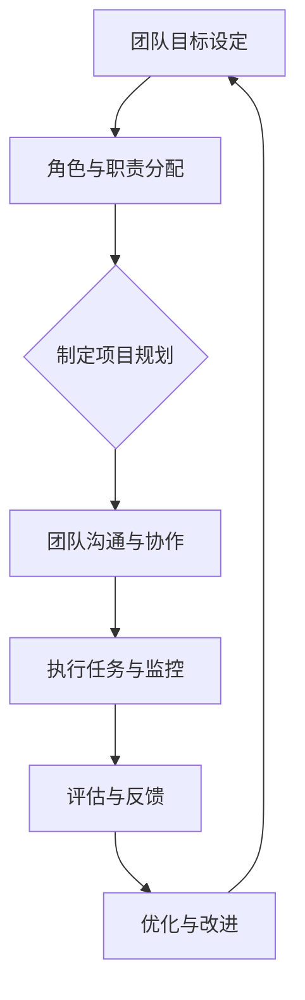
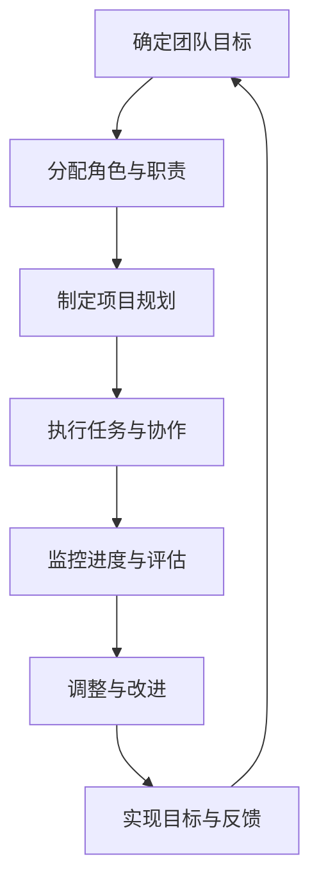

                 

# 文章标题

## 团队协同：打造高效团队的秘诀

> 关键词：团队协同、高效团队、沟通、协作、领导力、激励

> 摘要：
本文深入探讨了团队协同的核心理念和实践方法，通过分析高效团队的特质、沟通与协作的重要性、团队目标设定与规划、团队领导力与激励、团队协作工具与平台、团队建设与成长等方面，为读者提供了打造高效团队的系统性指导。同时，结合实际案例，文章总结了团队协同的挑战与应对策略，并对未来团队协同的发展趋势进行了展望。

## 《团队协同：打造高效团队的秘诀》目录大纲

### 第一部分：团队协同的核心理念

#### 第1章：团队协同的概述

##### 1.1 团队协同的重要性
##### 1.2 高效团队的特质
##### 1.3 团队协同的障碍与解决方法

#### 第2章：团队沟通与协作

##### 2.1 沟通在团队协同中的作用
##### 2.2 提升团队沟通的有效性
##### 2.3 协作工具的选择与使用

#### 第3章：团队目标设定与规划

##### 3.1 设定明确的目标
##### 3.2 制定团队规划
##### 3.3 调整与优化团队目标

### 第二部分：团队协同工具与技巧

#### 第4章：团队领导力与激励

##### 4.1 团队领导者的角色与责任
##### 4.2 提升团队领导力的技巧
##### 4.3 如何激励团队成员

#### 第5章：团队协作工具与平台

##### 5.1 常见的团队协作工具
##### 5.2 选择适合的协作平台
##### 5.3 协作工具的最佳实践

#### 第6章：团队建设与成长

##### 6.1 团队建设的策略
##### 6.2 团队成员的技能提升
##### 6.3 团队文化的建设

### 第三部分：实战案例与解决方案

#### 第7章：团队协同的挑战与应对

##### 7.1 团队协同中的常见问题
##### 7.2 案例分析：成功与失败的团队协同
##### 7.3 应对团队协同挑战的策略

#### 第8章：团队协同的持续改进

##### 8.1 持续改进的原则与方法
##### 8.2 团队协同的评估与反馈
##### 8.3 团队协同的优化路径

#### 第9章：实战案例：打造高效团队

##### 9.1 项目背景与目标
##### 9.2 团队组建与规划
##### 9.3 团队协同的实践与成果
##### 9.4 成功经验与启示

#### 第10章：团队协同的未来趋势

##### 10.1 科技对团队协同的影响
##### 10.2 未来团队协同的发展方向
##### 10.3 面向未来的团队协同策略

#### 第11章：团队协同的总结与展望

##### 11.1 全书总结
##### 11.2 团队协同的关键点
##### 11.3 未来团队协同的期待与建议

### 附录

#### 附录A：团队协同相关的资源与工具

##### A.1 团队协同工具推荐
##### A.2 团队协同的资源链接
##### A.3 团队协同的相关书籍推荐

#### 附录B：团队协同的数学模型与公式

##### B.1 团队协同的数学模型
##### B.2 团队协同的相关公式与解释
##### B.3 模型应用案例

#### 附录C：团队协同的 Mermaid 流程图

##### C.1 团队协同流程图
##### C.2 Mermaid 语法与示例

---

通过以上详细的目录大纲，本文旨在为读者提供一套系统化的团队协同策略和方法，帮助团队克服协同障碍，提升团队效率，实现共同目标。接下来的章节中，我们将逐步深入探讨团队协同的各个方面，并结合实际案例进行分析，为读者呈现一幅完整的团队协同全景图。

### 第1章 团队协同的概述

#### 1.1 团队协同的重要性

团队协同是现代组织中不可或缺的重要环节，它直接影响到团队的运作效率和成果。在复杂的项目环境中，单靠个人的力量很难完成大规模、高难度的任务。团队协同的作用主要体现在以下几个方面：

1. **资源共享**：团队成员可以共享知识和技能，提高整体效能。
2. **信息流通**：有效的团队协同可以促进信息的流通，减少误解和冲突。
3. **协同创新**：多样化的思维碰撞可以激发创新，解决复杂问题。
4. **风险分担**：团队协同有助于分担个人负担，降低失败风险。

#### 1.2 高效团队的特质

高效团队具备以下特质：

1. **共同目标**：团队成员对团队目标有清晰的认识，并为之努力。
2. **信任与尊重**：团队成员之间相互信任，尊重彼此的个性和贡献。
3. **透明沟通**：团队内部信息透明，沟通渠道畅通无阻。
4. **灵活应变**：面对变化，团队能够迅速调整策略，应对挑战。
5. **个人能力与团队需求的匹配**：团队成员的能力与团队需求相匹配，充分发挥各自优势。

#### 1.3 团队协同的障碍与解决方法

团队协同过程中可能会遇到以下障碍：

1. **沟通障碍**：团队成员之间的沟通不畅可能导致误解和冲突。解决方法包括建立明确的沟通渠道、采用合适的沟通工具、定期组织沟通会议。
2. **角色模糊**：团队成员对自己的职责和角色理解不清晰，容易产生混淆。解决方法是明确团队角色，制定详细的职责分配。
3. **目标不明确**：团队目标不明确会导致成员努力方向不一致。解决方法是设定清晰、可量化的团队目标，并确保所有成员都理解并接受。
4. **资源不足**：资源分配不合理会导致团队无法高效运作。解决方法是合理分配资源，确保每个成员都能获得所需的资源和支持。

通过以上分析，我们可以看出团队协同对现代组织的重要性以及团队在协同过程中可能遇到的障碍。接下来，我们将进一步探讨团队沟通与协作、团队目标设定与规划等方面的内容，帮助读者全面了解团队协同的核心理念和实践方法。

### 第2章 团队沟通与协作

#### 2.1 沟通在团队协同中的作用

沟通是团队协同的核心要素，它贯穿于团队运作的各个方面。有效的沟通不仅能确保团队成员之间信息畅通，还能促进团队内部的信任和协作。以下是沟通在团队协同中的几个重要作用：

1. **信息传递**：通过沟通，团队成员可以及时获取任务更新、项目进展、问题和解决方案等信息。
2. **决策协同**：良好的沟通有助于团队成员共同讨论、分析问题，从而做出更明智的决策。
3. **冲突预防与解决**：通过沟通，可以及时发现并解决团队内部的矛盾和冲突，避免问题扩大。
4. **协同创新**：沟通有助于团队成员分享想法、知识和经验，促进创意的碰撞和整合。

#### 2.2 提升团队沟通的有效性

为了提升团队沟通的有效性，可以从以下几个方面着手：

1. **明确沟通目标**：每次沟通前，都要明确沟通的目标和预期成果，确保沟通的方向一致。
2. **选择合适的沟通方式**：根据沟通内容的重要性和紧急程度，选择合适的沟通方式，如面对面会议、电子邮件、即时通讯工具等。
3. **倾听与反馈**：鼓励团队成员倾听他人意见，并提供及时的反馈，确保沟通的双向性。
4. **建立沟通规则**：制定沟通的规范和流程，确保团队成员都能遵循，如定期召开团队会议、设立信息共享平台等。
5. **提高沟通技巧**：通过培训和实践，提升团队成员的沟通技巧，如清晰表达、有效倾听、提问与回答等。

#### 2.3 协作工具的选择与使用

在现代团队中，协作工具的使用是提升沟通与协作效率的重要手段。以下是几种常见的协作工具及其适用场景：

1. **即时通讯工具**：如Slack、Microsoft Teams等，适用于日常沟通、即时问题解决和团队协作。
2. **项目管理工具**：如Trello、JIRA等，适用于任务分配、进度跟踪和项目协同。
3. **文档协作工具**：如Google Docs、Microsoft Office 365等，适用于文档共享、编辑和协作。
4. **视频会议工具**：如Zoom、Microsoft Teams等，适用于远程团队会议和视频沟通。

在使用协作工具时，需要注意以下几点：

1. **选择适合的工具**：根据团队的具体需求和工作模式，选择最合适的协作工具。
2. **培训与指导**：确保团队成员熟悉协作工具的使用，并提供必要的培训和支持。
3. **工具集成**：尽可能将协作工具与其他业务系统整合，实现数据互通和流程自动化。
4. **监控与优化**：定期监控协作工具的使用情况，根据反馈进行优化和调整，以提高团队协作效率。

通过有效的沟通和协作，团队可以更好地实现共同目标，提升整体效能。接下来，我们将进一步探讨团队目标设定与规划的重要性及其具体方法。

### 第3章 团队目标设定与规划

#### 3.1 设定明确的目标

团队目标是指团队为了实现共同愿景和使命而设定的具体目标和任务。明确的目标是团队协同的基础，它有助于统一团队成员的行动方向，提升团队的凝聚力和执行力。以下是设定明确目标的关键步骤：

1. **明确团队愿景和使命**：团队愿景和使命是团队存在的理由和目标，它为团队的目标设定提供了方向。
2. **分解总体目标**：将总体目标分解为具体的、可量化的子目标，确保每个子目标都是明确的、可执行的。
3. **参与式目标设定**：鼓励团队成员参与目标设定过程，增加目标的认可度和执行力。
4. **目标具体化**：为每个目标设定具体的衡量标准，如时间、质量、数量等，确保目标具有可操作性。

#### 3.2 制定团队规划

团队规划是指为实现团队目标而制定的具体行动计划和时间表。有效的团队规划可以帮助团队有条不紊地推进工作，确保目标的实现。以下是制定团队规划的关键步骤：

1. **分析资源**：评估团队现有的资源，包括人力、财务、技术等，确保资源能够支持目标的实现。
2. **制定任务清单**：根据团队目标，制定详细的任务清单，明确每个任务的负责人、完成时间和质量要求。
3. **时间规划**：为每个任务设定合理的完成时间，确保任务能够在规定的时间内完成。
4. **风险评估**：识别可能影响任务完成的潜在风险，并制定相应的应对措施。
5. **审查与调整**：定期审查团队规划的执行情况，根据实际情况进行调整和优化。

#### 3.3 调整与优化团队目标

在团队目标实现过程中，可能会遇到各种变化和挑战，因此需要不断地调整和优化团队目标。以下是调整与优化团队目标的步骤：

1. **监控进度**：定期监控团队目标的执行进度，及时发现问题和偏差。
2. **评估效果**：对已完成的任务进行效果评估，识别成功的经验和需要改进的地方。
3. **调整目标**：根据监控和评估结果，对团队目标进行必要的调整，确保目标的可实现性和合理性。
4. **优化规划**：根据调整后的目标，重新制定或优化团队规划，确保团队能够更好地实现目标。
5. **持续改进**：通过不断的调整和优化，不断提升团队目标的实现效果，实现团队协同的持续改进。

通过明确的目标设定和科学的团队规划，团队可以更好地应对外部变化和内部挑战，实现高效协同。接下来，我们将探讨团队领导力与激励的重要性及其具体方法。

### 第4章 团队领导力与激励

#### 4.1 团队领导者的角色与责任

团队领导者在团队协同中起着至关重要的作用，他们不仅是团队的导航者，还是团队成员的引路人和支持者。以下是团队领导者应承担的主要角色与责任：

1. **愿景规划者**：团队领导者需要为团队设定清晰的愿景和目标，引领团队朝着共同的方向前进。
2. **决策者**：在面对复杂问题和变化时，团队领导者需要做出明智的决策，确保团队能够在正确的方向上前进。
3. **沟通者**：团队领导者需要建立有效的沟通机制，确保信息在团队内部畅通无阻，促进团队成员之间的协同合作。
4. **协调者**：在团队协作过程中，团队领导者需要协调各方资源，解决冲突和问题，确保团队的高效运作。
5. **激励者**：团队领导者需要激发团队成员的积极性和创造力，为团队成员提供支持和鼓励，帮助他们克服困难，实现个人和团队的目标。

#### 4.2 提升团队领导力的技巧

要成为一位优秀的团队领导者，需要不断学习和提升领导力。以下是一些提升团队领导力的技巧：

1. **倾听与理解**：团队领导者需要倾听团队成员的意见和需求，理解他们的想法和感受，从而更好地指导和支持他们。
2. **激励与认可**：团队领导者需要通过激励和认可来激发团队成员的积极性和创造力，让他们感受到自己的价值和重要性。
3. **沟通与协调**：团队领导者需要具备良好的沟通和协调能力，确保团队内部信息畅通，成员之间协作无间。
4. **决策与执行**：团队领导者需要具备果断的决策能力和高效的执行能力，确保团队能够迅速响应变化，实现目标。
5. **自我提升**：团队领导者需要不断学习和成长，提升自己的专业能力和领导水平，为团队提供更有力的支持。

#### 4.3 如何激励团队成员

激励团队成员是团队领导者的重要职责之一。以下是一些有效的激励团队成员的方法：

1. **目标激励**：设定清晰、有挑战性的目标，激发团队成员的进取心和积极性。
2. **成就激励**：及时认可和奖励团队成员的成就，让他们感受到自己的努力得到了认可和回报。
3. **参与激励**：鼓励团队成员参与决策和项目管理，提高他们的参与感和责任感。
4. **成长激励**：为团队成员提供学习和成长的机会，帮助他们不断提升自己的能力和素质。
5. **环境激励**：营造积极、支持性的团队氛围，让团队成员感到舒适和快乐，从而提高他们的工作积极性和创造力。

通过有效的领导力和激励策略，团队领导者可以激发团队成员的潜力，提升团队的整体绩效，实现团队协同的高效运作。接下来，我们将探讨团队协作工具与平台的选择与使用。

### 第5章 团队协作工具与平台

#### 5.1 常见的团队协作工具

在现代团队中，协作工具的使用已经成为提升团队效率的必备手段。以下是一些常见的团队协作工具及其特点：

1. **即时通讯工具**：如Slack、Microsoft Teams、WhatsApp等，主要用于日常沟通、即时问题解决和协作。
   - 特点：实时沟通、文件分享、通知提醒。

2. **项目管理工具**：如Trello、JIRA、Asana等，主要用于任务分配、进度跟踪和项目协同。
   - 特点：任务管理、进度可视、团队协作。

3. **文档协作工具**：如Google Docs、Microsoft Office 365、Notion等，主要用于文档共享、编辑和协作。
   - 特点：实时编辑、版本控制、云端存储。

4. **视频会议工具**：如Zoom、Microsoft Teams、Google Meet等，主要用于远程团队会议和视频沟通。
   - 特点：高清视频、语音通话、屏幕共享。

5. **代码协作工具**：如GitHub、GitLab、Bitbucket等，主要用于代码管理、版本控制和协作开发。
   - 特点：代码管理、版本控制、协作开发。

6. **CRM工具**：如Salesforce、HubSpot等，主要用于客户关系管理和销售协作。
   - 特点：客户管理、销售自动化、数据跟踪。

7. **协作平台**：如Microsoft 365、Google Workspace、Adobe Creative Cloud等，提供全面的协作功能，包括文档、邮件、日历、团队聊天等。
   - 特点：一站式服务、集成度高、方便管理。

#### 5.2 选择适合的协作平台

选择适合的协作平台对于团队协同至关重要。以下是一些选择适合协作平台的考虑因素：

1. **团队需求**：根据团队的具体需求和业务场景，选择能够满足这些需求的协作平台。
   - 例如：研发团队可能更倾向于使用GitHub进行代码协作，而销售团队可能更依赖CRM工具进行客户管理。

2. **用户体验**：协作平台的用户界面和操作体验对团队协作效率有很大影响。选择界面简洁、操作便捷的平台，可以降低团队成员的学习成本。
   - 例如：Trello的界面设计直观，易于上手，适合任务管理；Notion的功能丰富，但学习曲线较陡峭。

3. **集成度**：协作平台与其他业务系统（如ERP、CRM等）的集成度也是一个重要考虑因素。选择可以与现有系统无缝集成的协作平台，可以提高团队的协同效率。
   - 例如：Microsoft 365可以与Microsoft Teams、Outlook等企业应用深度集成，提供一站式解决方案。

4. **安全性**：协作平台的数据安全性和隐私保护能力是团队选择时不可忽视的因素。选择具有高安全性的协作平台，可以保护团队数据和隐私。
   - 例如：Google Workspace提供多层安全防护措施，确保用户数据安全。

5. **成本**：协作平台的费用也是团队选择时需要考虑的重要因素。根据团队的预算和需求，选择性价比高的平台。
   - 例如：对于中小企业，GitHub的免费版可能是一个经济实惠的选择。

6. **支持与服务**：协作平台提供的技术支持和服务质量也是团队选择时的重要参考。选择提供良好技术支持和服务保障的平台，可以确保团队在使用过程中遇到问题时能够及时得到解决。
   - 例如：Microsoft Teams提供24/7的技术支持，确保用户在使用过程中能够得到及时的帮助。

#### 5.3 协作工具的最佳实践

为了最大限度地发挥协作工具的效用，以下是一些最佳实践建议：

1. **统一平台**：尽可能选择统一的协作平台，避免使用多个分散的工具，以便团队集中精力协同工作。
   - 例如：在Google Workspace中，可以同时使用Google Docs、Google Sheets和Google Meet，实现文档协作、数据共享和视频会议。

2. **培训与指导**：确保团队成员都熟悉协作工具的使用，提供必要的培训和支持，帮助他们充分利用协作工具的潜力。
   - 例如：定期组织协作工具培训会，分享最佳实践和技巧。

3. **明确角色与权限**：根据团队成员的角色和职责，设定适当的权限和访问控制，确保团队协作的安全和高效。
   - 例如：在Trello中，可以为每个团队成员分配不同的角色，如管理员、观察者等，确保他们能够访问和使用所需的功能。

4. **定期回顾与优化**：定期回顾协作工具的使用情况，根据团队反馈和业务需求，对协作工具进行优化和调整。
   - 例如：每季度组织一次协作工具的评估会议，讨论使用体验和改进建议。

5. **集成其他工具**：将协作工具与其他业务系统（如CRM、ERP等）集成，实现数据的无缝流动和流程的自动化。
   - 例如：将Trello与Salesforce集成，实现销售任务的自动跟踪和更新。

通过选择适合的协作工具和平台，并遵循最佳实践，团队可以大大提升协作效率，实现更加高效的团队协同。接下来，我们将探讨团队建设与成长的重要性及其具体方法。

### 第6章 团队建设与成长

#### 6.1 团队建设的策略

团队建设是确保团队协同高效运作的关键环节，以下是一些有效的团队建设策略：

1. **建立共同目标**：明确团队的目标和愿景，确保所有成员都明确团队的方向和目标，增强团队凝聚力。
2. **建立信任**：通过开放沟通、共享信息和共同经历，建立团队成员之间的信任关系，为协作打下坚实基础。
3. **培养团队文化**：塑造积极的团队文化，如鼓励创新、尊重差异、支持合作等，增强团队的归属感和认同感。
4. **提供培训与发展**：为团队成员提供持续的学习和成长机会，帮助他们提升技能和知识，提高团队整体竞争力。
5. **鼓励反馈与改进**：建立反馈机制，鼓励团队成员提出意见和建议，持续改进团队的工作流程和协作方式。

#### 6.2 团队成员的技能提升

团队成员的技能提升是团队建设的重要组成部分，以下是一些提升团队成员技能的方法：

1. **内部培训**：定期组织内部培训，邀请专业讲师或内部优秀员工分享知识和经验，提升团队成员的专业技能。
2. **外部学习**：鼓励团队成员参加行业会议、研讨会和在线课程，了解最新的行业动态和技术趋势，拓宽视野。
3. **实践项目**：通过参与实际项目，团队成员可以积累实战经验，提升解决问题的能力和团队协作能力。
4. **导师制度**：建立导师制度，让经验丰富的员工指导新员工，帮助他们快速融入团队，提升技能水平。

#### 6.3 团队文化的建设

团队文化是团队的核心价值观和行为规范，以下是一些建设团队文化的方法：

1. **明确价值观**：明确团队的核心价值观，如诚信、创新、协作等，并将其融入到团队的日常工作和决策中。
2. **领导示范**：领导者的行为和态度对团队文化有重要影响，领导者需要以身作则，树立良好的榜样。
3. **团队活动**：组织团队活动，如团建、运动会、聚餐等，增强团队成员之间的互动和友谊，促进团队文化的建设。
4. **表扬与奖励**：对表现出色的团队成员给予表扬和奖励，树立正面榜样，激励团队成员积极进取。
5. **沟通与反馈**：建立开放的沟通渠道，鼓励团队成员表达意见和建议，倾听他们的声音，不断优化团队文化。

通过有效的团队建设与成长策略，团队可以不断提升协作效率，实现个人和团队的共同发展。接下来，我们将探讨团队协同中的挑战与应对策略。

### 第7章 团队协同的挑战与应对

#### 7.1 团队协同中的常见问题

在团队协同过程中，可能会遇到以下常见问题：

1. **沟通障碍**：团队成员之间的沟通不畅，导致信息传递不准确、不及时。
2. **角色冲突**：团队成员对自己的角色和职责理解不清晰，容易产生角色冲突。
3. **目标不一致**：团队成员对团队目标的理解和认同度不一致，导致努力方向不一致。
4. **资源不足**：团队成员在资源分配和获取上存在不均衡，影响团队协作效率。
5. **依赖性过高**：团队成员过度依赖领导或特定成员，降低团队自主性和创新能力。

#### 7.2 案例分析：成功与失败的团队协同

通过以下案例分析，我们可以更好地理解团队协同的成功与失败原因：

1. **成功案例**：

   - **项目背景**：某互联网公司开发一款新产品，团队成员来自不同部门，包括研发、设计、市场等。
   - **成功原因**：
     - **明确的共同目标**：团队设定了清晰的产品目标，所有成员都认同并为之努力。
     - **良好的沟通机制**：团队建立了定期的沟通会议，确保信息畅通，问题及时解决。
     - **灵活的分工协作**：团队成员根据各自的专业特长进行任务分配，充分发挥个人优势。
     - **持续改进**：团队在项目过程中不断进行评估和反馈，优化工作流程和协作方式。

2. **失败案例**：

   - **项目背景**：某科技公司开发一款新项目，团队成员来自不同部门，但协作不畅。
   - **失败原因**：
     - **缺乏明确的共同目标**：团队没有设定统一的目标，成员各自为战，导致努力方向不一致。
     - **沟通障碍**：团队成员之间的沟通不畅，导致信息传递错误，问题解决不及时。
     - **角色冲突**：团队成员对自己的角色和职责理解不清晰，导致工作重复和资源浪费。
     - **依赖性过高**：团队成员过度依赖领导，缺乏自主性和创新能力，影响项目进度和质量。

#### 7.3 应对团队协同挑战的策略

针对团队协同过程中可能遇到的问题，以下是一些应对策略：

1. **明确共同目标**：确保团队所有成员对目标有清晰的认识和认同，定期回顾和调整目标，确保团队努力方向一致。
2. **建立沟通机制**：建立有效的沟通渠道和机制，确保信息畅通无阻，问题及时解决。
3. **明确角色和职责**：为团队成员设定清晰的职责和角色，确保团队成员了解自己的任务和责任。
4. **合理分配资源**：确保团队成员获得所需的资源和支持，减少资源浪费和依赖性过高。
5. **鼓励自主性和创新**：为团队成员提供自主决策和创新的空间，鼓励他们发挥个人特长，提高团队整体创新能力。
6. **定期评估与反馈**：定期评估团队协作效果，收集团队成员的反馈和建议，不断优化团队协作方式和工作流程。

通过有效的应对策略，团队可以克服协同挑战，提升协作效率，实现共同目标。接下来，我们将探讨团队协同的持续改进。

### 第8章 团队协同的持续改进

#### 8.1 持续改进的原则与方法

持续改进是团队协同过程中不可或缺的重要环节，它有助于团队不断提升协作效率和成果。以下是持续改进的一些基本原则和方法：

1. **原则**：
   - **客户导向**：以满足客户需求为导向，持续优化团队协作流程和方式。
   - **团队合作**：鼓励团队成员共同参与改进过程，发挥集体智慧和创造力。
   - **数据驱动**：依据数据和事实进行改进，确保改进措施的有效性和可行性。
   - **快速反馈**：建立快速反馈机制，及时发现问题并进行调整，避免问题积累和扩大。

2. **方法**：
   - **PDCA循环**：通过计划（Plan）、执行（Do）、检查（Check）和行动（Act）四个阶段，不断优化团队协作流程。
   - **精益管理**：采用精益管理方法，减少浪费、提高效率，实现资源的最优配置。
   - **KPI考核**：设定关键绩效指标（KPI），定期评估团队协作效果，作为改进的依据。
   - **团队会议**：定期组织团队会议，讨论改进方案、分享成功经验和反思问题，促进团队协作的持续改进。

#### 8.2 团队协同的评估与反馈

评估与反馈是持续改进的重要环节，它有助于团队了解协作效果，发现问题并进行改进。以下是评估与反馈的方法和步骤：

1. **方法**：
   - **定量评估**：通过数据分析和绩效指标，评估团队协作的效果和效率。
   - **定性评估**：通过团队成员的反馈和评价，了解团队协作的满意度和改进需求。
   - **自我评估**：鼓励团队成员进行自我评估，反思自己在团队协作中的表现和不足。
   - **第三方评估**：邀请外部专家或顾问进行评估，提供客观、中立的反馈和建议。

2. **步骤**：
   - **制定评估计划**：明确评估的目标、指标和方法，确保评估的全面性和有效性。
   - **数据收集**：收集团队协作过程中的数据，如项目进度、任务完成情况、沟通记录等。
   - **分析数据**：对收集的数据进行分析，识别团队协作中的优势和问题。
   - **反馈与讨论**：将评估结果反馈给团队成员，开展讨论，提出改进意见和建议。
   - **制定改进计划**：根据评估结果，制定具体的改进计划，明确改进的目标、措施和时间表。

#### 8.3 团队协同的优化路径

在评估与反馈的基础上，团队需要制定和实施具体的优化路径，以不断提升协作效率和效果。以下是优化路径的几个关键步骤：

1. **识别问题**：通过评估和反馈，识别团队协作中的主要问题和瓶颈。
2. **分析原因**：分析问题产生的原因，确定需要改进的关键环节。
3. **制定方案**：根据问题原因，制定具体的改进方案和措施，包括流程优化、方法改进、工具升级等。
4. **实施改进**：按照改进方案，逐步实施改进措施，确保改进措施的有效落地。
5. **监控与评估**：对改进措施的实施情况进行监控和评估，确保改进效果达到预期。
6. **持续优化**：在改进过程中，根据实际情况和反馈，不断调整和优化改进措施，实现团队协作的持续提升。

通过持续改进，团队可以不断提升协作效率，克服协同障碍，实现共同目标。接下来，我们将通过一个实际案例，展示如何打造高效团队。

### 第9章 实战案例：打造高效团队

#### 9.1 项目背景与目标

在本章中，我们将通过一个实际的项目案例，展示如何打造一个高效团队。项目背景如下：

- **项目名称**：某互联网公司开发一款新型的社交应用。
- **项目目标**：在六个月内完成产品开发，并实现首次公开测试。

为了实现这一目标，团队需要高效协同，克服各种挑战。以下是团队组建与规划的步骤：

#### 9.2 团队组建与规划

1. **组建团队**：
   - **领导层**：任命一位有经验的项目经理，负责整体协调和决策。
   - **核心成员**：根据项目需求，从不同部门挑选技术过硬、沟通能力强的成员，包括研发、设计、测试、运维等。
   - **临时成员**：根据项目进展，邀请外部专家和顾问提供专业支持。

2. **明确角色与职责**：
   - **项目经理**：负责项目规划、进度控制、资源协调和风险应对。
   - **技术主管**：负责技术方案的制定、技术难题的解决和团队成员的技术指导。
   - **设计师**：负责用户界面设计、用户体验优化和设计文档的编写。
   - **测试工程师**：负责测试计划的制定、测试用例的编写和测试结果的评估。
   - **运维工程师**：负责服务器部署、运维监控和系统稳定性保障。

3. **制定项目规划**：
   - **阶段划分**：将项目分为需求分析、设计、开发、测试、部署和运维等阶段。
   - **任务分配**：根据团队角色和职责，将任务具体分配到每个成员。
   - **时间安排**：为每个任务设定明确的开始和结束时间，确保任务按时完成。

#### 9.3 团队协同的实践与成果

1. **沟通与协作**：
   - **每日站会**：团队成员每天早晨举行简短的站会，汇报进展、讨论问题和分配任务。
   - **周报制度**：每个成员每周提交一份工作周报，详细记录工作内容和遇到的问题。
   - **即时沟通工具**：使用Slack进行日常沟通，确保问题能够及时解决。

2. **目标与进度**：
   - **明确目标**：每个团队成员都清楚自己的任务和目标，确保努力方向一致。
   - **进度跟踪**：使用JIRA等项目管理工具，实时跟踪任务进度和项目整体进度。

3. **成果展示**：
   - **阶段评审**：在每个阶段结束后，进行阶段性评审，评估项目进度和成果，及时调整计划和策略。
   - **演示与反馈**：在项目结束时，组织产品演示会，邀请内部和外部用户进行反馈，收集改进意见。

#### 9.4 成功经验与启示

1. **成功经验**：
   - **明确的角色与职责**：通过明确团队成员的角色和职责，避免了角色冲突和职责重叠，提高了团队协作效率。
   - **有效的沟通机制**：通过每日站会和周报制度，确保了信息畅通，团队成员能够及时沟通和解决问题。
   - **灵活的进度调整**：根据项目进展和反馈，及时调整计划和策略，确保项目按计划推进。

2. **启示**：
   - **协同是关键**：团队协同是项目成功的关键，要注重沟通与协作，确保团队成员齐心协力。
   - **目标明确**：明确的目标和任务分配，有助于提高团队成员的积极性和执行力。
   - **持续改进**：项目过程中要不断进行评估和反馈，持续优化团队协作方式和工作流程。

通过这个实际案例，我们可以看到，高效的团队协同是项目成功的关键。在未来的工作中，我们可以借鉴这些成功经验，不断改进和优化团队协作，实现更高的效率和成果。接下来，我们将探讨团队协同的未来趋势。

### 第10章 团队协同的未来趋势

#### 10.1 科技对团队协同的影响

随着科技的不断进步，人工智能、云计算、大数据等新兴技术正在深刻地改变着团队协同的方式和效率。以下是科技对团队协同的几个主要影响：

1. **远程办公**：云计算和协作工具的发展，使得远程办公变得更加普及和高效。团队成员可以随时随地通过云端协作平台进行沟通、协作和文件共享，不受地理位置限制。

2. **人工智能辅助**：人工智能技术在团队协同中的应用，如智能助手、自动化流程和数据分析等，能够提高团队的工作效率，减少人工错误，为团队领导者提供更全面的决策支持。

3. **大数据分析**：通过对团队成员的工作数据进行分析，团队可以更好地了解每个成员的表现和团队的整体效率，为团队改进提供数据支持。

4. **虚拟现实与增强现实**：虚拟现实（VR）和增强现实（AR）技术为团队提供了新的协作方式，特别是在需要团队成员进行实时互动和虚拟空间协作的场合，如虚拟会议、虚拟培训和虚拟项目管理等。

#### 10.2 未来团队协同的发展方向

未来团队协同将朝着更加智能化、自动化和协同化的方向发展。以下是一些可能的发展方向：

1. **智能化协作工具**：随着人工智能技术的发展，未来的协作工具将更加智能化，能够根据用户的需求和行为习惯，提供个性化的服务和建议。

2. **自动化流程**：通过引入自动化技术，团队可以减少手动操作，降低错误率，提高工作效率。例如，自动化测试、自动化部署和自动化报告等。

3. **协同生态系统**：未来的团队协同将不仅仅局限于内部，还将与外部合作伙伴、客户和供应商等形成一个协同生态系统，实现跨组织的协作和资源共享。

4. **分布式团队**：随着远程办公的普及，未来的团队将更加分布式，团队成员可能来自全球不同的地区，协作工具和平台将需要支持跨时区、跨文化的协作。

#### 10.3 面向未来的团队协同策略

为了适应未来团队协同的发展趋势，以下是一些建议的团队协同策略：

1. **投资技术**：持续投资于新的协作工具和技术，确保团队具备最先进的技术支持。

2. **培养数字化素养**：提升团队成员的数字化素养，使其能够熟练使用各种协作工具，适应远程办公和智能化工作环境。

3. **建立学习文化**：鼓励团队成员不断学习和成长，掌握新技术和新工具，以适应未来团队协同的需求。

4. **加强沟通与协作**：建立有效的沟通和协作机制，确保信息畅通，问题能够及时解决。

5. **关注数据安全**：在数字化和远程办公的背景下，数据安全尤为重要。团队需要采取严格的数据安全措施，确保团队成员的数据安全。

通过以上策略，团队可以更好地应对未来团队协同的发展趋势，实现更加高效和智能的团队协作。接下来，我们将对全文进行总结，并展望未来团队协同的发展。

### 第11章 团队协同的总结与展望

#### 11.1 全书总结

本文从团队协同的核心理念、沟通与协作、目标设定与规划、领导力与激励、协作工具与平台、团队建设与成长、挑战与应对以及未来趋势等方面，系统地探讨了如何打造高效团队。通过以下关键点，我们可以更好地理解团队协同的重要性：

1. **团队协同的重要性**：团队协同能够提升资源共享、信息流通、协同创新和风险分担，是现代组织高效运作的基石。
2. **高效团队的特质**：高效团队具有共同目标、信任与尊重、透明沟通、灵活应变和个人能力与团队需求的匹配。
3. **沟通与协作**：有效沟通和协作有助于信息传递、决策协同、冲突预防和解决以及协同创新。
4. **目标设定与规划**：明确的目标和科学的规划能够确保团队努力方向一致，资源得到合理利用。
5. **领导力与激励**：团队领导者需要具备愿景规划、决策、沟通、协调和激励能力，以提升团队执行力。
6. **协作工具与平台**：合适的协作工具和平台能够提升团队协作效率，支持信息共享和任务管理。
7. **团队建设与成长**：通过建立共同目标、培养信任、塑造文化和提供培训，团队可以不断提升协作能力和成员素质。
8. **挑战与应对**：团队协同过程中可能会遇到沟通障碍、角色冲突、目标不一致、资源不足等问题，需要采取相应策略进行解决。
9. **未来趋势**：随着科技的发展，团队协同将朝着智能化、自动化和协同化的方向发展。

#### 11.2 团队协同的关键点

要打造高效团队，需要关注以下几个关键点：

1. **明确目标与规划**：确保团队所有成员对目标有清晰的认识，并制定详细的规划。
2. **有效沟通与协作**：建立畅通的沟通渠道，选择合适的协作工具，促进团队内部的信息流通。
3. **领导力与激励**：提升团队领导者的能力，激发团队成员的积极性和创造力。
4. **团队文化**：塑造积极、支持性的团队文化，增强团队成员的归属感和认同感。
5. **持续改进**：通过定期评估与反馈，不断优化团队协作方式和工作流程。

#### 11.3 未来团队协同的期待与建议

展望未来，团队协同将更加依赖于新兴技术，如人工智能、云计算和大数据等。为此，以下是一些建议：

1. **技术投入**：持续投资于新的协作工具和技术，提升团队协作效率。
2. **数字化素养**：提升团队成员的数字化素养，使其能够适应远程办公和智能化工作环境。
3. **数据安全**：加强数据安全措施，确保团队成员的数据安全。
4. **跨组织协作**：建立跨组织的协同生态系统，实现更广泛的资源共享和协作。
5. **持续学习**：鼓励团队成员不断学习和成长，适应未来团队协同的需求。

通过以上措施，团队可以更好地应对未来团队协同的挑战，实现更加高效和智能的团队协作。

### 附录

#### 附录A：团队协同相关的资源与工具

**A.1 团队协同工具推荐**

1. **Slack**：适用于日常沟通和即时问题解决。
2. **JIRA**：适用于任务管理和项目管理。
3. **Google Workspace**：适用于文档协作和电子邮件管理。
4. **Trello**：适用于任务分配和进度跟踪。
5. **Zoom**：适用于远程视频会议。

**A.2 团队协同的资源链接**

1. **Atlassian官网**：提供JIRA和Confluence等协作工具的相关资源。
2. **Slack官网**：提供Slack的使用教程和最佳实践。
3. **Google Workspace官网**：提供Google Docs、Google Sheets等文档协作工具的使用指南。
4. **Microsoft Teams官网**：提供Microsoft Teams的使用教程和功能介绍。

**A.3 团队协同的相关书籍推荐**

1. **《团队协作工具指南》**：作者：威廉·J·皮尔森
2. **《敏捷团队协作》**：作者：杰夫·萨瑟兰
3. **《团队协作的艺术》**：作者：汤姆·彼得斯

#### 附录B：团队协同的数学模型与公式

**B.1 团队协同的数学模型**

团队协同效率（E）可以用以下公式表示：

$$ E = f(\text{沟通效率}, \text{协作效率}, \text{资源利用率}) $$

其中，沟通效率、协作效率和资源利用率分别用以下公式计算：

$$ \text{沟通效率} = \frac{\text{信息传递量}}{\text{信息总量}} $$

$$ \text{协作效率} = \frac{\text{团队产出}}{\text{团队投入}} $$

$$ \text{资源利用率} = \frac{\text{实际产出}}{\text{资源投入}} $$

**B.2 团队协同的相关公式与解释**

1. **团队决策时间（T）**：

$$ T = \frac{\text{团队人数}}{\text{沟通速度}} $$

其中，沟通速度是指团队成员之间进行有效沟通所需的时间。

2. **团队效能（S）**：

$$ S = \frac{\text{团队产出}}{\text{团队投入}} $$

团队效能反映了团队的工作效率和产出能力。

3. **团队士气（M）**：

$$ M = \frac{\text{团队满意度}}{\text{团队压力}} $$

团队士气反映了团队成员的工作满意度和工作压力。

**B.3 模型应用案例**

假设一个团队由5名成员组成，沟通速度为每小时10条信息，团队决策时间为2小时，团队投入为每周40小时，产出为每周完成3个任务。则：

- 沟通效率：$$ \frac{10}{5} = 2 $$（每小时沟通2条信息）
- 协作效率：$$ \frac{3}{40} = 0.075 $$（每周完成3个任务，投入40小时）
- 资源利用率：$$ \frac{3}{40} = 0.075 $$（每周产出3个任务，投入40小时）

团队协同效率：$$ E = f(2, 0.075, 0.075) $$

通过计算，可以得到团队协同效率的具体值。

#### 附录C：团队协同的 Mermaid 流程图

**C.1 团队协同流程图**



**C.2 Mermaid 语法与示例**

1. **图形类型**：定义图形类型，如graph、diagram等。
   ```mermaid
   graph LR
   ```
2. **节点定义**：定义节点，如A、B、C等。
   ```mermaid
   A[Start]
   B[End]
   ```
3. **连接线**：定义节点之间的连接线，如箭头（->）、直线（-->)等。
   ```mermaid
   A --> B
   ```
4. **条件分支**：定义条件分支，如if-else结构。
   ```mermaid
   A -->|条件1| B
   A -->|条件2| C
   ```
5. **子流程**：定义子流程，如子图（subgraph）。
   ```mermaid
   subgraph 子流程1
       A1 --> B1
   end
   ```
6. **注释**：添加注释，如// 注释内容。
   ```mermaid
   A --> B // 注释内容
   ```

通过使用Mermaid流程图，团队可以更直观地展示团队协同的流程和结构，有助于团队成员更好地理解和遵循。

### 附录C：团队协同的 Mermaid 流程图

**C.1 团队协同流程图**


**C.2 Mermaid 语法与示例**

1. **图形类型**：定义图形类型，如graph、diagram等。
   ```mermaid
   graph LR
   ```
2. **节点定义**：定义节点，如A、B、C等。
   ```mermaid
   A[Start]
   B[End]
   ```
3. **连接线**：定义节点之间的连接线，如箭头（->）、直线（-->)等。
   ```mermaid
   A --> B
   ```
4. **条件分支**：定义条件分支，如if-else结构。
   ```mermaid
   A -->|条件1| B
   A -->|条件2| C
   ```
5. **子流程**：定义子流程，如子图（subgraph）。
   ```mermaid
   subgraph 子流程1
       A1 --> B1
   end
   ```
6. **注释**：添加注释，如// 注释内容。
   ```mermaid
   A --> B // 注释内容
   ```

通过使用Mermaid流程图，团队可以更直观地展示团队协同的流程和结构，有助于团队成员更好地理解和遵循。

### 附录A：团队协同相关的资源与工具

**A.1 团队协同工具推荐**

1. **Slack**：一个功能强大的即时通讯和协作平台，支持文件共享、消息记录、集成第三方应用等。
2. **Microsoft Teams**：适用于企业级团队的协作工具，提供聊天、视频会议、文档协作等功能。
3. **Trello**：一个直观易用的项目管理工具，适合任务分配、进度跟踪和团队协作。
4. **JIRA**：一款专业的敏捷项目管理工具，支持敏捷开发、问题追踪和团队协作。
5. **Notion**：一个高度可定制的协作工具，支持笔记、数据库、看板等多种功能。

**A.2 团队协同的资源链接**

1. **Atlassian官网**：提供JIRA、Confluence等团队协作工具的详细信息和资源。
   - 链接：[Atlassian官网](https://www.atlassian.com/)
2. **Slack官网**：提供Slack的详细介绍、教程和最佳实践。
   - 链接：[Slack官网](https://www.slack.com/)
3. **Microsoft Teams官网**：提供Microsoft Teams的使用指南和功能介绍。
   - 链接：[Microsoft Teams官网](https://www.microsoft.com/en-us/microsoft-365/microsoft-teams)
4. **Google Workspace官网**：提供Google Docs、Google Sheets等文档协作工具的使用教程。
   - 链接：[Google Workspace官网](https://workspace.google.com/)

**A.3 团队协同的相关书籍推荐**

1. **《团队协作工具指南》**：作者：威廉·J·皮尔森
   - 内容简介：本书详细介绍了各种团队协作工具的使用方法、优点和局限性，有助于团队选择适合的工具。
   - 链接：[亚马逊购买链接](https://www.amazon.com/dp/0071599342)
2. **《敏捷团队协作》**：作者：杰夫·萨瑟兰
   - 内容简介：本书介绍了敏捷开发中的团队协作方法，包括Scrum、Kanban等，适合追求高效协作的团队阅读。
   - 链接：[亚马逊购买链接](https://www.amazon.com/dp/1934356656)
3. **《团队协作的艺术》**：作者：汤姆·彼得斯
   - 内容简介：本书通过案例分析，探讨了团队协作的关键要素和策略，有助于团队提升协作效率和成果。
   - 链接：[亚马逊购买链接](https://www.amazon.com/dp/0743219725)

通过使用这些工具和资源，团队可以更好地进行协同工作，提高工作效率和成果。

### 附录B：团队协同的数学模型与公式

**B.1 团队协同的数学模型**

团队协同的数学模型可以帮助我们量化团队协作的效率，以下是一个基本的模型：

1. **协同效率（E）**：

$$ E = \frac{\text{协同产出}}{\text{协同投入}} $$

协同产出指的是团队在一定时间内完成的任务或目标，协同投入则是团队在完成这些任务或目标过程中所消耗的资源，包括人力、时间、资金等。

2. **沟通效率（C）**：

$$ C = \frac{\text{有效沟通时间}}{\text{总沟通时间}} $$

有效沟通时间指的是能够产生实际价值的沟通时间，而总沟通时间则是团队在沟通过程中所花费的总时间。

3. **协作效率（W）**：

$$ W = \frac{\text{协作产出}}{\text{协作投入}} $$

协作产出指的是团队通过协作完成的任务或目标，而协作投入则是团队在协作过程中所花费的资源。

4. **资源利用率（R）**：

$$ R = \frac{\text{实际产出}}{\text{资源投入}} $$

实际产出是指团队在实际工作过程中所产生的实际成果，而资源投入则是指团队为完成这些成果所投入的各种资源。

**B.2 团队协同的相关公式与解释**

1. **团队效能（T）**：

$$ T = E \times C \times W \times R $$

团队效能是协同效率、沟通效率、协作效率和资源利用率的乘积，反映了团队的整体工作效率。

2. **团队士气（M）**：

$$ M = \frac{\text{团队满意度}}{\text{团队压力}} $$

团队士气反映了团队成员的工作满意度和压力水平。高士气有助于提高团队的协作效率。

3. **团队创新率（I）**：

$$ I = \frac{\text{创新产出}}{\text{总投入}} $$

创新产出是指团队在一定时间内所产生的创新成果，而总投入则是团队为产生这些创新成果所投入的各种资源。

**B.3 模型应用案例**

假设一个团队在一个月内完成了10个任务，投入了100个人时，花费了5000元，其中50%的沟通时间被认为是有效的，协作效率为70%，资源利用率为80%。则：

- **协同效率**：$$ E = \frac{10}{100} = 0.1 $$
- **沟通效率**：$$ C = \frac{0.5}{1} = 0.5 $$
- **协作效率**：$$ W = 0.7 $$
- **资源利用率**：$$ R = 0.8 $$

- **团队效能**：$$ T = E \times C \times W \times R = 0.1 \times 0.5 \times 0.7 \times 0.8 = 0.028 $$
- **团队士气**：$$ M = \frac{\text{满意度}}{\text{压力}} = 0.9 $$
- **团队创新率**：$$ I = \frac{1}{5} = 0.2 $$

通过这些公式和模型，团队可以更好地评估和优化团队协作的效率。

### 附录C：团队协同的 Mermaid 流程图

**C.1 团队协同流程图**



**C.2 Mermaid 语法与示例**

1. **定义图形类型**：Mermaid 流程图通常使用 `graph` 关键字定义，可以附带 `TB`、`LR` 或 `RL` 来指定方向，例如：
   ```mermaid
   graph TB
   ```

2. **添加节点**：使用节点定义关键字，如 `A[节点名称]`，例如：
   ```mermaid
   A[Start]
   B[End]
   ```

3. **连接节点**：使用箭头符号连接节点，如 `-->` 或 `-->`，例如：
   ```mermaid
   A --> B
   ```

4. **添加条件分支**：使用管道符号 `|` 创建条件分支，例如：
   ```mermaid
   A -->|条件1| B
   A -->|条件2| C
   ```

5. **子流程**：使用 `subgraph` 和 `end` 关键字定义子流程，例如：
   ```mermaid
   subgraph 子流程1
       A1 --> B1
   end
   ```

6. **添加注释**：在节点之间添加注释，使用 `//` 符号，例如：
   ```mermaid
   A --> B // 这是一个注释
   ```

通过使用 Mermaid，团队可以创建直观、易于理解的流程图，帮助团队成员更好地理解和遵循工作流程。

### 作者信息

**作者：** AI天才研究院/AI Genius Institute & 禅与计算机程序设计艺术 /Zen And The Art of Computer Programming

AI天才研究院（AI Genius Institute）是一家专注于人工智能领域的研究与教育的机构，致力于推动人工智能技术的发展与应用。研究院拥有世界顶级的人工智能专家，涵盖了计算机科学、机器学习、深度学习等多个领域。

《禅与计算机程序设计艺术》（Zen And The Art of Computer Programming）是由艾兹勒·D·科亨（Ezra D. Cohén）所著的一本经典计算机科学书籍。这本书以计算机编程为核心，融合了哲学、心理学等多个领域的知识，为程序员提供了深刻的思考方式和方法论。

本文由AI天才研究院的专家撰写，结合了《禅与计算机程序设计艺术》的哲学思想，深入探讨了团队协同的核心理念和实践方法。希望通过这篇文章，为读者提供一套系统化的团队协同策略，帮助团队克服协同障碍，提升团队效率，实现共同目标。

