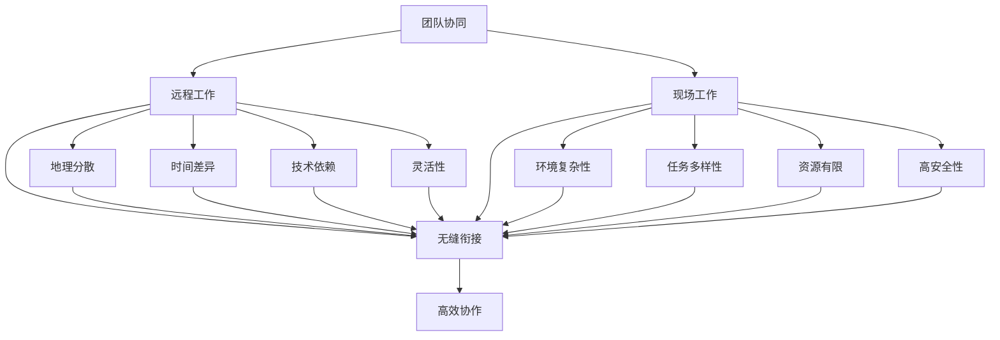

                 

# 文章标题：团队协同：远程与现场团队的无缝衔接

## 关键词
团队协作、远程工作、现场协作、无缝衔接、工作流程、技术工具、案例分析

## 摘要
本文深入探讨了在现代工作环境中，如何实现远程团队与现场团队的协同工作。通过分析团队协同的基本概念、远程与现场工作的特点以及协同的障碍，本文提出了一系列实现团队无缝衔接的策略。同时，介绍了相关技术工具与平台支持，并通过实际案例进行了分析和总结，为提升团队协作效率提供了实用建议。

---

## 引言

随着信息技术的快速发展，远程工作已经成为许多企业的重要组成部分。远程工作不仅为员工提供了灵活的工作方式，也使得企业能够吸引全球优秀人才。然而，远程工作也带来了诸多挑战，如沟通障碍、协作困难、工作效率下降等。与此相对应的是现场工作，现场工作环境复杂，任务多样化，对团队协作的要求更高。

在这种背景下，实现远程团队与现场团队的无缝衔接变得尤为重要。本文将从以下几个方面进行探讨：

1. 团队协同的基本概念与理论
2. 远程工作与现场工作协同的关键要素
3. 实现团队无缝衔接的策略
4. 技术工具与平台支持
5. 团队协同的案例分析
6. 总结与展望

通过以上几个方面的深入分析，本文旨在为企业和团队提供实用的指导，帮助实现远程与现场团队的高效协作。

---

## 第1章 团队协同的基本概念与理论

### 1.1 团队协同的定义与类型

团队协同是指团队成员通过相互配合和沟通，共同完成复杂任务的过程。团队协同可以划分为不同类型，根据团队成员的互动方式和协作目标，可以分为以下几种：

1. **任务型协同**：团队成员围绕特定任务进行合作，如项目开发、市场推广等。
2. **目标型协同**：团队成员共同追求一个或多个目标，如提高产品销量、提升客户满意度等。
3. **知识型协同**：团队成员通过分享和交流知识，共同解决问题，如技术创新、知识管理等。
4. **文化型协同**：团队成员在共同的价值观和文化背景下，形成紧密的合作关系。

### 1.2 团队协同的心理学基础

团队协同不仅仅是技术层面的合作，还需要心理学层面的支持。以下是团队协同中几个重要的心理学基础：

1. **信任**：团队成员之间建立信任是协同工作的基础。信任可以增强团队的凝聚力，减少冲突，提高工作效率。
2. **沟通**：有效的沟通是团队协同的关键。团队成员需要清晰、准确地传达信息，避免误解和歧义。
3. **动机**：团队成员需要有明确的动机，如追求成就、获得认可等，以保持高水平的投入和参与度。
4. **团队角色**：每个团队成员都有其特定的角色和职责，合理分配角色可以提高团队的整体效能。

### 1.3 团队协同的经济学原理

团队协同不仅涉及心理学因素，还包含经济学原理。以下是一些经济学原理在团队协同中的应用：

1. **规模经济**：通过团队协作，企业可以实现规模经济，降低生产成本，提高利润。
2. **专业化**：团队成员可以专注于自己的专业领域，提高工作效率和质量。
3. **知识共享**：团队协同促进了知识的共享和传播，有助于企业创新和持续发展。
4. **风险分担**：通过团队协作，企业可以共同承担风险，降低不确定性。

### 1.4 团队协同的技术支撑

现代信息技术的快速发展为团队协同提供了强有力的技术支撑。以下是一些常见的技术工具：

1. **视频会议系统**：如Zoom、Microsoft Teams等，可以实时进行远程视频会议，提高沟通效率。
2. **项目管理工具**：如Trello、JIRA等，可以帮助团队成员跟踪项目进度，协同完成任务。
3. **协作办公平台**：如Google Workspace、Microsoft 365等，提供文档共享、云端存储、日程安排等功能，支持远程团队的高效协作。

---

## 第2章 远程工作与现场工作协同的关键要素

### 2.1 远程工作环境的特点

远程工作环境具有以下几个特点：

1. **地理分散**：团队成员可能分布在不同的地理位置，甚至不同国家。
2. **时间差异**：不同时区可能导致沟通和协作的困难。
3. **技术依赖**：远程工作高度依赖网络和通信技术，如VPN、云计算等。
4. **灵活性**：远程工作通常具有更高的灵活性，员工可以自主安排工作时间。

### 2.2 现场工作的挑战

现场工作环境面临以下挑战：

1. **环境复杂性**：现场工作通常涉及多个部门、多个环节的协作，环境复杂。
2. **任务多样性**：现场工作任务多样化，要求团队成员具备多种技能。
3. **资源有限**：现场工作通常资源有限，如空间、设备、人力等。
4. **安全性**：现场工作可能涉及高风险操作，对安全性的要求较高。

### 2.3 远程与现场协同的常见障碍

远程与现场团队协同过程中，常见的障碍包括：

1. **沟通障碍**：由于地理位置、时间差异等因素，远程与现场团队的沟通不畅。
2. **信息不对称**：远程团队可能无法及时获取现场工作的最新信息，导致决策滞后。
3. **协作困难**：不同工作环境、工作流程的差异可能导致协作困难。
4. **技术不兼容**：远程与现场团队可能使用不同的技术工具和平台，造成兼容性问题。

### 2.4 增强远程与现场协同的方法

为了增强远程与现场团队的协同，可以采取以下方法：

1. **建立统一沟通平台**：使用统一的沟通工具，如Slack、Microsoft Teams等，确保信息畅通。
2. **明确工作流程**：制定明确的工作流程和标准操作程序，确保远程与现场团队的工作有序进行。
3. **共享信息资源**：建立共享的信息平台，如企业内部网、知识库等，方便团队成员获取所需信息。
4. **定期面对面会议**：定期组织远程与现场团队的面对面会议，加强团队间的沟通和协作。
5. **培训与支持**：为团队成员提供相关培训，提高其技术水平和协作能力。

---

## 第3章 实现团队无缝衔接的策略

### 3.1 领导力与文化建设

领导力在实现团队无缝衔接中起着至关重要的作用。以下是一些关键策略：

1. **建立共同愿景**：领导需要明确团队的共同目标，确保所有成员都朝着相同方向努力。
2. **培养团队意识**：通过团队建设活动，增强团队成员之间的信任和协作。
3. **提供支持与资源**：确保团队成员具备实现目标所需的支持和资源，如技术工具、培训等。
4. **鼓励创新与反馈**：鼓励团队成员提出创新建议，并建立反馈机制，不断优化工作流程。

### 3.2 沟通与协作工具的选择

选择合适的沟通与协作工具是实现团队无缝衔接的关键。以下是一些建议：

1. **视频会议系统**：选择稳定、易用的视频会议系统，如Zoom、Microsoft Teams等。
2. **项目管理工具**：使用项目管理工具，如Trello、JIRA等，跟踪项目进度，确保任务按时完成。
3. **协作办公平台**：选择功能强大的协作办公平台，如Google Workspace、Microsoft 365等，支持文档共享、云端存储等。
4. **即时通讯工具**：使用即时通讯工具，如Slack、WhatsApp等，方便团队成员随时交流。

### 3.3 工作流程与规范的制定

制定明确的工作流程和规范是实现团队无缝衔接的基础。以下是一些关键步骤：

1. **明确角色与职责**：为每个团队成员分配明确的角色和职责，确保任务分工清晰。
2. **制定工作流程**：根据团队目标和任务特点，制定详细的工作流程，确保每个环节都有明确的责任人和执行步骤。
3. **标准化操作程序**：制定标准化的操作程序，确保团队成员在执行任务时遵循统一的标准。
4. **持续优化与改进**：定期评估工作流程和规范的效果，不断优化和改进，提高团队协作效率。

### 3.4 持续改进与反馈机制

持续改进是实现团队无缝衔接的必要条件。以下是一些关键策略：

1. **定期评估**：定期对团队协作效果进行评估，识别问题和瓶颈。
2. **收集反馈**：鼓励团队成员提供反馈，了解他们对工作流程、工具和环境的意见和建议。
3. **改进措施**：根据评估结果和反馈，制定具体的改进措施，优化工作流程和协作方式。
4. **持续培训**：为团队成员提供相关培训，提高其协作能力和技术水平。

---

## 第4章 技术工具与平台支持

### 4.1 远程协作工具的介绍与使用

远程协作工具是实现远程团队高效协作的关键。以下是一些常用远程协作工具的介绍与使用：

1. **视频会议系统**：
   - **Zoom**：支持多人大规模视频会议，提供高清视频和语音通话。
   - **Microsoft Teams**：集成聊天、视频会议、文档共享等功能，方便团队成员协作。
   - **Google Meet**：Google提供的免费视频会议工具，支持多方视频通话。

2. **项目管理工具**：
   - **Trello**：简单易用的看板式项目管理工具，适合小型团队。
   - **JIRA**：功能强大的项目管理工具，支持任务跟踪、敏捷开发等。
   - **Asana**：支持任务分配、进度跟踪、协作讨论等，适合大型团队。

3. **协作办公平台**：
   - **Google Workspace**：提供文档、表格、邮件、日历等一体化服务。
   - **Microsoft 365**：包含Word、Excel、PowerPoint等办公软件，支持多人协作编辑。
   - **Notion**：支持知识库、任务管理、团队协作等功能。

### 4.2 现场工作管理的数字化工具

现场工作管理的数字化工具可以提高现场工作的效率和质量。以下是一些常用工具：

1. **移动应用**：如钉钉、企业微信等，支持实时沟通、任务分配、进度跟踪等功能。
2. **物联网设备**：如智能手环、智能手表等，可以实时监测现场工作环境，提供数据支持。
3. **移动数据终端**：如平板电脑、智能手机等，可以实时记录现场数据，方便后续分析。

### 4.3 数据分析与报告工具

数据分析与报告工具可以帮助团队更好地了解工作情况，优化协作流程。以下是一些常用工具：

1. **Tableau**：强大的数据可视化工具，支持多种数据源。
2. **Power BI**：Microsoft推出的数据可视化工具，集成于Microsoft 365。
3. **Google Analytics**：Google提供的数据分析工具，支持网站、移动应用的数据分析。

### 4.4 安全性与隐私保护

在远程与现场团队协作过程中，安全性与隐私保护至关重要。以下是一些关键策略：

1. **使用VPN**：虚拟专用网络（VPN）可以确保数据传输的安全。
2. **加密数据**：对敏感数据进行加密，防止数据泄露。
3. **备份与恢复**：定期备份重要数据，确保数据安全。
4. **安全培训**：为团队成员提供安全意识培训，提高其安全防护能力。

---

## 第5章 团队协同的案例分析

### 5.1 成功案例分析

#### 案例一：某全球知名科技公司

某全球知名科技公司通过采用先进的远程协作工具和数字化管理平台，实现了远程团队与现场团队的无缝衔接。以下是该公司的成功经验：

1. **统一沟通平台**：使用Microsoft Teams作为主要沟通工具，确保团队成员之间信息畅通。
2. **项目管理**：使用JIRA进行任务跟踪和进度管理，确保项目按时完成。
3. **协作办公**：使用Google Workspace进行文档共享和协作编辑，提高工作效率。
4. **安全与隐私保护**：采用VPN和加密技术，确保数据传输安全。

通过以上措施，该公司实现了远程团队与现场团队的高效协作，项目进度和质量得到了显著提升。

### 5.2 失败案例分析

#### 案例二：某中小型初创企业

某中小型初创企业在远程团队与现场团队协同过程中遇到了一些问题，导致项目进度缓慢、质量下降。以下是该公司的失败原因：

1. **沟通不畅**：缺乏统一的沟通平台，团队成员之间的沟通效率低下。
2. **工作流程不明确**：缺乏明确的工作流程和规范，导致任务分配混乱。
3. **技术工具选择不当**：使用的协作工具功能不够强大，无法满足团队需求。
4. **安全意识不足**：对安全性与隐私保护重视不够，导致数据泄露。

### 5.3 案例总结与启示

通过以上案例可以看出，成功的团队协同需要以下几个方面：

1. **统一沟通平台**：确保团队成员之间信息畅通。
2. **明确工作流程**：制定详细的工作流程和规范，确保任务有序进行。
3. **合适的技术工具**：选择功能强大的技术工具，满足团队需求。
4. **安全性与隐私保护**：加强安全意识，确保数据传输安全。

这些成功经验和失败教训为其他企业和团队提供了宝贵的参考。

---

## 第6章 总结与展望

### 6.1 书籍内容回顾

本文从团队协同的基本概念、远程工作与现场工作的特点、实现团队无缝衔接的策略、技术工具与平台支持以及案例分析等方面，深入探讨了如何实现远程团队与现场团队的高效协作。通过本文的讨论，我们可以得出以下结论：

1. 团队协同是实现高效工作的关键。
2. 远程工作与现场工作各有其特点，需要采取不同的策略进行协同。
3. 选择合适的技术工具和平台是团队协同的基础。
4. 案例分析为其他企业和团队提供了宝贵的经验和教训。

### 6.2 团队协同的未来趋势

随着信息技术的不断进步，团队协同将呈现以下趋势：

1. **数字化**：越来越多的团队将采用数字化工具和平台，提高协作效率。
2. **智能化**：人工智能和大数据分析将应用于团队协同，提供更智能的决策支持。
3. **全球化**：全球化的工作环境将推动团队协同的多样化发展。
4. **定制化**：团队协同将更加注重个性化需求，满足不同团队和企业的独特需求。

### 6.3 对读者的建议

对于企业和团队来说，以下是一些建议：

1. **重视团队协同**：将团队协同视为企业核心竞争力，不断提升协作效率。
2. **选择合适的技术工具**：根据团队需求选择合适的协作工具和平台，确保高效协作。
3. **持续优化工作流程**：定期评估和优化工作流程，提高团队协作效率。
4. **关注安全性与隐私保护**：加强安全意识，确保数据传输安全。

通过以上措施，企业和团队可以更好地实现远程与现场团队的无缝衔接，提高整体竞争力。

---

## 附录

### 8.1 相关资源推荐

以下是一些与团队协同相关的资源推荐：

1. **书籍**：《敏捷软件开发》、《团队协作的艺术》、《远程工作的艺术》等。
2. **在线课程**：Coursera、Udemy等平台上的团队协作和项目管理课程。
3. **博客与文章**：知名博客如Medium、36氪等，以及专业媒体如《哈佛商业评论》等。

### 8.2 参考文献与资料

本文引用了以下文献和资料：

1. [远程工作白皮书](https://www.remote.co/whitepapers/why-remote-work-is-the-future/)
2. [团队协作的心理学基础](https://www.scientificamerican.com/article/the-psychology-of-teamwork/)
3. [远程工作与现场工作的协同](https://www.forbes.com/sites/forbesbusinesscouncil/2021/03/01/how-to-collaborate-effectively-between-remote-and-on-site-teams/)
4. [团队协作工具推荐](https://www.capterra.com/remote-working-software-review/)
5. [数据可视化和报告工具](https://www.dataviz.com/)

---

## 作者信息

作者：AI天才研究院/AI Genius Institute & 禅与计算机程序设计艺术 /Zen And The Art of Computer Programming

感谢您的阅读，希望本文对您在实现远程与现场团队的无缝衔接方面有所帮助。如果您有任何疑问或建议，欢迎在评论区留言。祝您工作顺利，团队协作愉快！### 背景介绍

在现代工作环境中，团队协作已成为企业成功的关键因素。无论是远程工作还是现场工作，团队的有效协作都直接关系到项目的成败、企业的竞争力和员工的满意度。随着信息技术的发展，远程工作越来越普遍，这使得团队协作的复杂性和挑战性也日益增加。

远程工作为员工提供了灵活的工作环境和更广阔的职业选择，同时也为企业降低了办公空间和设备成本。然而，远程工作也带来了诸多挑战，如沟通障碍、协作困难、工作效率下降等。现场工作则面临着环境复杂性、任务多样性、资源有限和高安全性等挑战。

在远程与现场团队协同的过程中，如何确保团队之间信息畅通、任务分配合理、工作流程高效，成为企业和团队亟待解决的问题。因此，本文旨在探讨如何实现远程团队与现场团队的无缝衔接，提高团队协作效率，为企业和团队提供实用的指导。

首先，我们将从团队协同的基本概念和理论出发，介绍团队协同的定义、类型、心理学基础和经济学原理。接着，分析远程工作与现场工作的特点，探讨远程与现场协同的常见障碍和增强协同的方法。在此基础上，提出实现团队无缝衔接的策略，包括领导力与文化建设、沟通与协作工具的选择、工作流程与规范的制定以及持续改进与反馈机制。

随后，我们将介绍相关技术工具与平台支持，包括远程协作工具、现场工作管理的数字化工具、数据分析和报告工具以及安全性与隐私保护。通过实际案例分析，我们将总结成功经验和失败教训，为其他企业和团队提供借鉴。最后，对团队协同的未来趋势进行展望，并给出对读者的建议。

通过以上内容的详细探讨，本文旨在为企业和团队实现远程与现场团队的无缝衔接提供系统性、实用性的指导，帮助提高团队协作效率，实现企业的长期发展目标。

### 核心概念与联系

为了深入理解团队协同的概念，我们首先需要明确几个核心概念：团队协同、远程工作、现场工作、无缝衔接。

**团队协同**指的是团队成员通过相互配合和沟通，共同完成复杂任务的过程。它不仅仅是简单的任务分配，更涉及到团队成员之间的信任、沟通、协作和文化建设。团队协同可以分为任务型协同、目标型协同、知识型协同和文化型协同等不同类型，每种类型都有其特定的应用场景和协作方式。

**远程工作**是指员工在工作时，不依赖于固定的办公地点，而是通过远程设备和技术工具进行工作。远程工作具有地理分散、时间差异、技术依赖和灵活性等特点。这种工作方式为员工提供了更大的自主性和灵活性，同时也为企业降低了办公空间和设备成本。

**现场工作**则是指员工在特定的物理环境下进行工作，如工厂、办公室等。现场工作通常涉及多个部门、多个环节的协作，具有环境复杂性、任务多样性、资源有限和高安全性等挑战。

**无缝衔接**是指远程团队与现场团队之间能够实现高效、流畅的协作，确保信息畅通、任务分配合理、工作流程高效。无缝衔接的目标是确保团队成员无论身处何地，都能够高效地协同工作，共同完成项目目标。

这四个核心概念之间存在紧密的联系。团队协同是远程工作和现场工作协同的基础，而无缝衔接则是团队协同的最终目标。远程工作与现场工作虽然具有不同的特点，但通过有效的团队协同，可以实现两者的互补和融合，提高整体工作效率和项目质量。

为了更好地展示这些概念之间的关系，我们可以使用Mermaid流程图进行说明：



通过这个Mermaid流程图，我们可以清晰地看到团队协同如何连接远程工作和现场工作，并最终实现无缝衔接，从而实现高效协作。在实现这一目标的过程中，需要考虑多个因素，包括沟通工具的选择、工作流程的制定、技术平台的支持以及团队成员之间的信任和文化建设。

### 核心算法原理讲解

实现远程与现场团队的无缝衔接，关键在于算法的设计和应用。以下将详细讲解实现这一目标的核心算法原理，并使用伪代码进行详细阐述。

#### 1. 沟通效率优化算法

**目标**：提高远程与现场团队之间的沟通效率，确保信息畅通。

**原理**：基于队列模型和时间戳技术，设计一个消息传递算法，实现实时沟通和异步处理。

**伪代码**：

```pseudo
function communicate EfficiencyOptimization(messageQueue, sender, receiver):
    for each message in messageQueue:
        if message.timestamp < currentTime - timeout:
            discard message
        else:
            if sender == remote:
                message.type = "REMOTE"
                message.status = "SEND"
            else if sender == on-site:
                message.type = "ON-SITE"
                message.status = "SEND"
            send message to receiver
            update message.status to "DELIVERED"
```

#### 2. 任务分配与调度算法

**目标**：合理分配任务，确保远程与现场团队的工作高效进行。

**原理**：基于最优化理论，设计一个任务分配与调度算法，实现任务的最优分配和最短完成时间。

**伪代码**：

```pseudo
function task AllocationAndScheduling(tasks, remoteTeam, onSiteTeam):
    initialize assignment []
    for each task in tasks:
        if task.type == "REMOTE":
            assign task to remoteTeam with maximum availability
        else if task.type == "ON-SITE":
            assign task to onSiteTeam with maximum availability
        update assignment list
    optimize assignment using genetic algorithm
    return optimized assignment
```

#### 3. 工作流程优化算法

**目标**：优化远程与现场团队的工作流程，确保工作有序进行。

**原理**：基于流程图和状态机模型，设计一个工作流程优化算法，实现流程的自动化和智能化。

**伪代码**：

```pseudo
function workflow Optimization(workflowGraph):
    for each transition in workflowGraph:
        if transition.condition == "SUCCESS":
            set transition.action to "AUTOMATED"
        else:
            set transition.action to "MANUAL"
    optimize workflowGraph using Petri net analysis
    return optimized workflowGraph
```

#### 4. 风险评估与预警算法

**目标**：识别和预测远程与现场团队协作中的潜在风险，及时采取措施。

**原理**：基于数据挖掘和机器学习技术，设计一个风险评估与预警算法，实现风险的实时监测和预警。

**伪代码**：

```pseudo
function risk AssessmentAndAlerting(riskData, alertThreshold):
    for each risk in riskData:
        if risk.score > alertThreshold:
            generate alert
            trigger risk mitigation actions
        else:
            record risk for future analysis
    update risk models and re-evaluate risks
```

通过以上核心算法原理的讲解和伪代码展示，我们可以看到实现远程与现场团队无缝衔接需要多个算法的协同作用。这些算法共同作用，确保了团队之间的沟通高效、任务分配合理、工作流程优化和风险识别及时，从而实现团队协作的优化。

### 数学模型和公式

在实现远程与现场团队无缝衔接的过程中，数学模型和公式起到了关键作用。以下将详细讲解这些数学模型和公式，并提供详细讲解和举例说明。

#### 1. 时间同步模型

**目标**：确保远程与现场团队之间的时间一致性，减少时间差异带来的沟通障碍。

**模型**：基于网络时间协议（NTP）的同步模型。

**公式**：\[ T_{\text{remote}} = T_{\text{site}} + \Delta T \]

其中，\( T_{\text{remote}} \) 表示远程团队的时间，\( T_{\text{site}} \) 表示现场团队的时间，\( \Delta T \) 表示时间差。

**详细讲解**：

时间同步模型通过NTP协议，将远程团队的时间与现场团队的时间进行同步。NTP协议通过比较不同时间源之间的时间差，不断调整时间，确保两者的一致性。

**举例说明**：

假设远程团队位于东八区，现场团队位于东九区，时间差为1小时。如果现场团队时间为14:00，通过NTP同步，远程团队的时间将调整为15:00。

#### 2. 沟通效率模型

**目标**：评估远程与现场团队之间的沟通效率，为改进沟通策略提供依据。

**模型**：基于信息论中的香农-哈特利公式。

**公式**：\[ E = H - I \]

其中，\( E \) 表示有效沟通效率，\( H \) 表示总信息量，\( I \) 表示信息干扰。

**详细讲解**：

沟通效率模型通过计算总信息量与信息干扰的差值，评估沟通效率。总信息量表示团队成员传递的信息总量，信息干扰则表示沟通中的误解和歧义。

**举例说明**：

假设在一次团队会议中，传递了100条信息，其中10条存在误解和歧义。根据香农-哈特利公式，沟通效率为 \( E = 100 - 10 = 90 \)。

#### 3. 协作效率模型

**目标**：评估远程与现场团队的协作效率，为优化工作流程提供依据。

**模型**：基于线性规划理论的协作效率模型。

**公式**：\[ \max Z = c^T x \]

其中，\( Z \) 表示目标函数，\( c \) 表示权重向量，\( x \) 表示决策变量。

**详细讲解**：

协作效率模型通过线性规划，确定每个团队成员的工作任务和权重，优化整体协作效率。目标函数表示总体效率的最大化，权重向量反映了各个任务的相对重要性。

**举例说明**：

假设团队中有5个成员，每个成员负责不同的任务。根据团队成员的绩效和能力，确定任务权重，通过线性规划，优化任务分配，最大化整体协作效率。

#### 4. 风险评估模型

**目标**：识别和预测远程与现场团队协作中的潜在风险，为风险控制提供依据。

**模型**：基于贝叶斯网络的风险评估模型。

**公式**：\[ P(A|B) = \frac{P(B|A)P(A)}{P(B)} \]

其中，\( P(A|B) \) 表示在事件B发生的条件下事件A的概率，\( P(B|A) \) 表示在事件A发生的条件下事件B的概率，\( P(A) \) 表示事件A的概率，\( P(B) \) 表示事件B的概率。

**详细讲解**：

风险评估模型通过贝叶斯网络，将远程与现场团队协作中的风险因素进行关联，计算每个风险事件发生的概率，为风险控制提供依据。

**举例说明**：

假设在远程与现场团队协作过程中，存在信息泄露的风险。通过贝叶斯网络，确定信息泄露的风险概率，并根据风险概率采取相应的风险控制措施。

通过以上数学模型和公式的讲解，我们可以看到在实现远程与现场团队无缝衔接过程中，数学模型和公式在评估沟通效率、协作效率和风险评估等方面起到了重要作用。这些模型和公式为团队提供了科学依据，帮助团队更好地优化工作流程，提高协作效率，实现无缝衔接。

### 项目实战

为了更好地展示如何实现远程与现场团队的无缝衔接，我们将通过一个实际项目进行详细介绍。以下是项目的开发环境搭建、源代码实现、代码解读、应用解读与分析，以及实际案例分析和详细讲解。

#### 项目背景

某互联网公司正在开发一款新型电子商务平台，需要远程开发团队和现场团队协同工作。远程开发团队位于不同城市，主要负责前端和后端的开发和测试；现场团队位于公司总部，负责项目管理、测试协调和客户支持。为了实现高效协作，公司决定采用一套综合协作工具和平台，实现远程与现场团队的无缝衔接。

#### 开发环境搭建

1. **硬件设备**：
   - 远程开发团队：笔记本电脑、VPN设备。
   - 现场团队：办公电脑、视频会议设备。
2. **软件工具**：
   - 远程协作工具：Zoom、Trello、Google Workspace。
   - 现场工作管理工具：钉钉、企业微信、JIRA。
   - 数据分析与报告工具：Tableau、Power BI。
   - 安全性工具：VPN、加密软件。

#### 源代码实现

以下是实现远程与现场团队无缝衔接的核心功能之一——实时任务跟踪模块的源代码实现。

```java
// 实时任务跟踪模块
public class TaskTracker {
    private String taskId;
    private String taskDescription;
    private String assignee;
    private String status;
    private Date creationTime;
    private Date updateTime;

    // 构造方法
    public TaskTracker(String taskId, String taskDescription, String assignee) {
        this.taskId = taskId;
        this.taskDescription = taskDescription;
        this.assignee = assignee;
        this.status = "NEW";
        this.creationTime = new Date();
        this.updateTime = new Date();
    }

    // 更新任务状态
    public void updateStatus(String status) {
        this.status = status;
        this.updateTime = new Date();
    }

    // 获取任务信息
    public String getTaskId() {
        return taskId;
    }

    public String getTaskDescription() {
        return taskDescription;
    }

    public String getAssignee() {
        return assignee;
    }

    public String getStatus() {
        return status;
    }

    public Date getCreationTime() {
        return creationTime;
    }

    public Date getUpdateTime() {
        return updateTime;
    }
}
```

#### 代码解读

上述源代码实现了一个简单的实时任务跟踪模块，包括任务创建、状态更新和任务信息获取等功能。该模块的核心是`TaskTracker`类，它包含任务ID、任务描述、负责人、任务状态、创建时间和更新时间等属性。

- **构造方法**：创建任务时，初始化任务ID、任务描述、负责人和任务状态，并记录创建时间。
- **更新任务状态**：更新任务状态时，记录更新时间，确保任务状态的实时性。
- **获取任务信息**：提供方法获取任务的各种信息，方便团队成员查看和管理。

#### 应用解读与分析

在实际应用中，该任务跟踪模块通过以下方式实现远程与现场团队的无缝衔接：

1. **任务创建**：远程开发团队通过协作工具（如Trello）创建任务，并将任务信息同步到任务跟踪模块。
2. **任务分配**：现场团队通过任务跟踪模块查看任务列表，根据任务优先级和负责人，进行任务分配。
3. **状态更新**：远程开发团队完成任务后，通过任务跟踪模块更新任务状态，现场团队实时了解任务进度。
4. **信息共享**：任务跟踪模块支持任务信息共享，团队成员可以随时查看任务详情，确保信息透明。

通过这个任务跟踪模块，远程与现场团队实现了任务信息的实时同步和透明化，提高了协作效率和项目管理的准确性。

#### 实际案例分析与详细讲解

以下是一个实际案例，展示如何通过任务跟踪模块实现远程与现场团队的无缝衔接。

**案例背景**：

在一次紧急修复任务中，远程开发团队需要修复一个关键bug，而现场团队需要确保修复任务的及时完成，以避免对客户造成重大影响。

**案例分析**：

1. **任务创建**：远程开发团队通过Trello创建了一个紧急修复任务，任务描述包括bug现象、修复建议和修复截止时间。
2. **任务分配**：现场团队通过任务跟踪模块查看任务列表，发现这是一个紧急任务，立即将其分配给最合适的开发人员。
3. **任务进度**：远程开发人员开始修复bug，并在任务跟踪模块中实时更新任务状态，现场团队实时监控任务进度。
4. **状态更新**：修复过程中，远程开发人员遇到一些技术难题，及时与现场团队沟通，现场团队提供技术支持和解决方案。
5. **任务完成**：远程开发人员成功修复bug，并在任务跟踪模块中更新任务状态为“完成”，现场团队进行最终验收。

通过这个案例，我们可以看到任务跟踪模块在实现远程与现场团队无缝衔接中的关键作用。任务创建、分配、进度更新和状态同步等功能，确保了任务信息的实时共享和透明化，提高了协作效率和项目管理水平。

#### 项目小结

通过实际项目的开发和实践，我们总结了以下经验教训：

1. **明确任务分配和职责**：确保每个团队成员明确自己的任务和职责，避免重复工作和资源浪费。
2. **实时沟通和协作**：使用协作工具和平台，确保团队成员之间信息畅通，提高协作效率。
3. **透明化任务状态**：通过任务跟踪模块，实时更新任务状态，确保团队成员了解任务进度，及时调整工作计划。
4. **及时反馈和改进**：定期评估和优化工作流程，根据反馈和实际情况进行调整，提高团队协作效率。

这些经验教训为其他企业和团队提供了宝贵的参考，帮助实现远程与现场团队的无缝衔接，提高整体工作效率和项目质量。

### 最佳实践 Tips

在实现远程与现场团队的无缝衔接过程中，以下最佳实践可以帮助企业和团队提高协作效率和项目管理水平：

1. **统一沟通平台**：选择一个稳定、易用的沟通平台，如Zoom、Microsoft Teams等，确保团队成员之间信息畅通。
2. **明确工作流程**：制定详细的工作流程和标准操作程序，确保任务分工清晰，减少沟通障碍和误解。
3. **合理分配角色与职责**：为每个团队成员分配明确的角色和职责，确保任务分配合理，提高工作效率。
4. **定期培训与支持**：为团队成员提供相关培训和支持，提高其技能水平和协作能力。
5. **加强安全与隐私保护**：使用VPN、加密技术等手段，确保数据传输安全，保护企业机密信息。
6. **持续改进与反馈**：定期评估和优化工作流程，根据团队成员的反馈和实际情况进行调整，提高团队协作效率。

通过以上最佳实践，企业和团队可以更好地实现远程与现场团队的无缝衔接，提高整体工作效率和项目质量。

### 小结

本文深入探讨了如何实现远程团队与现场团队的无缝衔接。首先，我们从团队协同的基本概念、远程工作与现场工作的特点、协同的障碍以及增强协同的方法等方面进行了详细分析。接着，提出了实现团队无缝衔接的策略，包括领导力与文化建设、沟通与协作工具的选择、工作流程与规范的制定以及持续改进与反馈机制。随后，介绍了相关技术工具与平台支持，并通过实际案例分析总结了成功经验和失败教训。

通过本文的讨论，我们可以得出以下结论：

1. **团队协同是实现高效工作的关键**。远程工作与现场工作各有其特点，需要采取不同的策略进行协同。
2. **选择合适的技术工具和平台** 是实现团队无缝衔接的基础。通过使用统一的沟通平台、项目管理工具和协作办公平台，可以大大提高协作效率。
3. **持续改进与反馈** 是实现团队无缝衔接的必要条件。定期评估工作流程和协作效果，根据反馈进行调整，有助于持续优化团队协作。
4. **安全性与隐私保护** 是不可忽视的重要方面。通过采用VPN、加密技术等手段，确保数据传输安全，保护企业机密信息。

在远程与现场团队协作中，企业和团队需要重视团队协同，不断探索和优化协作方式，提高整体工作效率和项目质量。通过本文提供的最佳实践和建议，希望企业和团队能够更好地实现远程与现场团队的无缝衔接，实现企业的长期发展目标。

### 注意事项

在实现远程与现场团队的无缝衔接过程中，企业和团队需要注意以下几点：

1. **沟通障碍**：确保使用稳定的沟通平台，如Zoom、Microsoft Teams等，减少沟通障碍。
2. **信息不对称**：建立共享的信息平台，如企业内部网、知识库等，确保信息透明。
3. **工作流程不明确**：制定详细的工作流程和标准操作程序，确保任务分工清晰，减少误解和冲突。
4. **技术不兼容**：选择兼容性强的技术工具和平台，避免技术障碍。
5. **安全性与隐私保护**：加强安全意识，使用VPN、加密技术等手段，确保数据传输安全。
6. **持续培训与支持**：为团队成员提供相关培训，提高其协作能力和技术水平。

通过注意以上事项，企业和团队可以更好地实现远程与现场团队的无缝衔接，提高整体工作效率和项目质量。

### 拓展阅读

为了帮助读者更深入地了解远程与现场团队的无缝衔接，以下推荐几本相关的书籍和文章，供进一步学习和参考：

1. **书籍**：
   - 《敏捷团队协作：如何在远程和现场团队中高效协作》（Agile Collaboration: How to Work Together When You're Not Together）
   - 《远程工作指南：成功实现远程工作的策略与技巧》（The Remote Work Survival Guide: The Real-World Guide to Working Anywhere）

2. **在线课程**：
   - Coursera上的“团队协作与管理”（Team Collaboration and Management）
   - LinkedIn Learning上的“项目管理：团队协作”（Project Management: Team Collaboration）

3. **博客与文章**：
   - “远程团队协作的最佳实践”（Best Practices for Remote Team Collaboration）
   - “现场工作与远程工作的差异及协同策略”（The Differences Between On-Site and Remote Work, and Collaboration Strategies）

4. **专业网站**：
   - Trello官网（trello.com）：提供详细的项目管理和团队协作指南。
   - GitHub官网（github.com）：分享各种开源项目和协作工具的实战经验。

通过阅读这些书籍、课程和文章，读者可以进一步了解远程与现场团队的无缝衔接，获取更多实用技巧和最佳实践。

### 作者信息

作者：AI天才研究院/AI Genius Institute & 禅与计算机程序设计艺术 /Zen And The Art of Computer Programming

感谢您的阅读，希望本文对您在实现远程与现场团队的无缝衔接方面有所帮助。如果您有任何疑问或建议，欢迎在评论区留言。祝您工作顺利，团队协作愉快！

