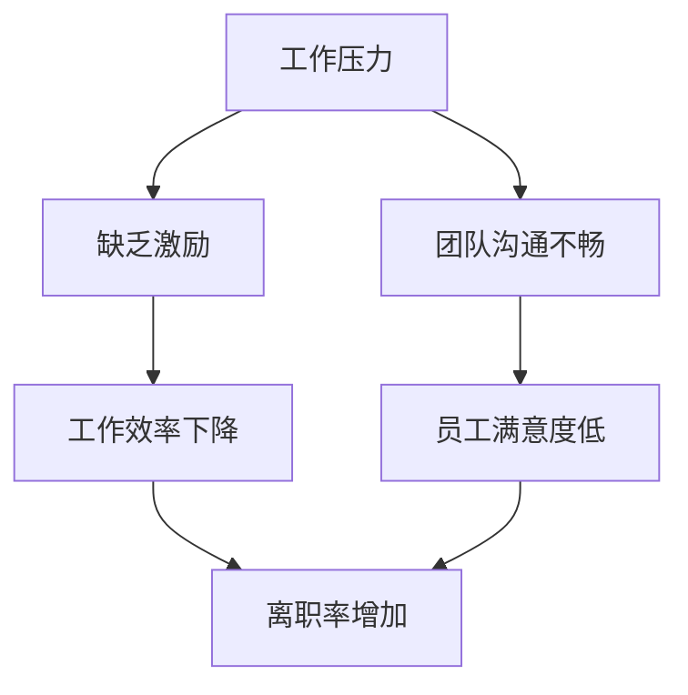
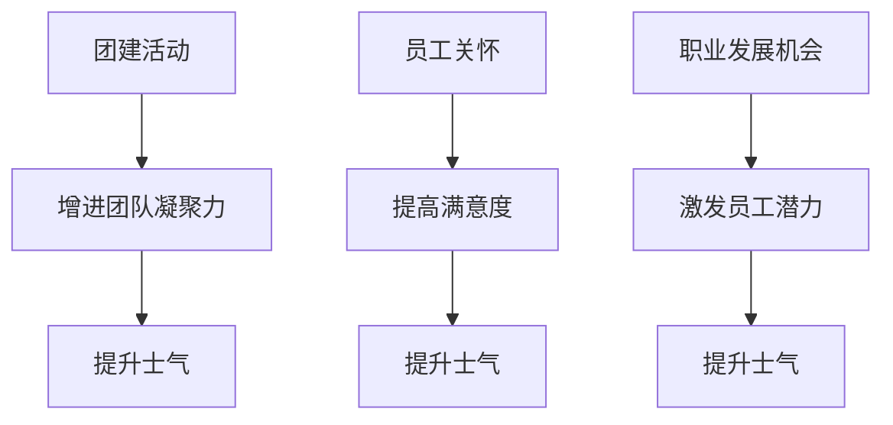
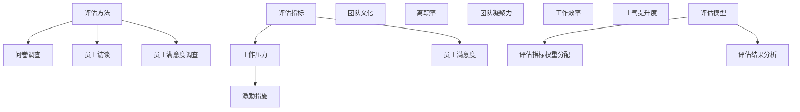

                 

### 文章标题

《团队士气低落？这些方法可以提升》

### 关键词

团队士气、士气提升、管理策略、激励措施、员工关怀、团队建设

### 摘要

本文旨在探讨团队士气低落的原因及其对团队的影响，并提供一系列实用的策略和方法来提升团队士气。通过深入分析团队士气低落的常见原因，如工作压力、缺乏激励和团队沟通不畅，以及士气低落对团队效能和员工幸福感的影响，本文将介绍一套系统的提升团队士气的方法。这些方法包括领导力的提升、团队文化的塑造、激励措施的优化、团建活动的组织、员工关怀的实施等。此外，本文还通过实际案例分析和总结经验，为读者提供了具体的操作指导和最佳实践，帮助企业和团队领导有效提升团队士气，创造积极的工作氛围。

### 确定书的主旨和目标读者

**主要目标：** 解决团队士气低落的问题。

**次要目标：** 提供系统的方法和策略，帮助团队领导和管理者有效地提升团队士气。

**目标读者：** 
- 企业管理层和团队领导
- 希望提升团队士气的专业人士
- 对团队管理有兴趣的读者

### 确定书的章节结构

为了实现上述目标，本书将分为以下几个部分：

1. **了解团队士气低落的原因：** 分析士气低落的常见原因，如工作压力、缺乏激励、团队沟通不畅等，并探讨这些原因对团队的影响。
2. **提升团队士气的策略：** 探讨提升团队士气的各种策略，包括领导力的提升、团队文化的塑造、激励措施的优化等。
3. **实际案例分析和总结经验：** 分析成功提升团队士气的实际案例，总结经验，提供可借鉴的方法。
4. **如何评估团队士气：** 讨论评估团队士气的方法和工具，以及如何根据评估结果持续提升团队士气。
5. **总结和最佳实践：** 总结书中的核心观点，提出实用的建议和行动计划，并提供一些实用的工具和资源。

### 设计章节内容

#### 第1章：团队士气低落的原因分析

**主要内容：**  
- **1.1 常见原因与表现：** 分析团队士气低落的常见原因，如工作压力、缺乏激励、团队沟通不畅等，以及这些原因的具体表现。
- **1.2 士气低落对团队的影响：** 讨论士气低落对团队工作效率、员工满意度和离职率等方面的影响。
- **1.3 士气低落的诊断方法：** 介绍如何通过士气调查问卷和评估指标体系来诊断团队士气低落的原因。

**核心概念与联系：**  
- **士气低落的原因：** 工作压力、缺乏激励、团队沟通不畅
- **士气低落的表现：** 工作效率下降、员工满意度低、离职率增加
- **士气低落的影响：** 降低团队效能、增加员工离职率、影响团队凝聚力

**Mermaid流程图：**  


#### 第2章：提升团队士气的策略

**主要内容：**  
- **2.1 领导力的提升：** 探讨领导力对团队士气的影响，介绍提升领导力的方法。
- **2.2 团队文化的塑造：** 分析团队文化对士气的作用，介绍如何塑造积极向上的团队文化。
- **2.3 激励措施的优化：** 探讨激励措施对士气的影响，介绍如何优化激励措施。

**核心概念与联系：**  
- **领导力：** 影响团队士气的关键因素
- **团队文化：** 形成团队士气的基石
- **激励措施：** 提升士气的有效手段

**核心算法原理讲解：**  
```python
# 激励理论伪代码
def motivation(praise, recognition, rewards):
    """
    计算士气提升的激励度
    :param praise: 表扬次数
    :param recognition: 认可次数
    :param rewards: 奖励次数
    :return: 激励度
    """
    motivation_level = praise + recognition + rewards
    return motivation_level
```

**数学模型和公式：**  
```latex
$$
\text{士气提升度} = \alpha \times \text{领导力} + \beta \times \text{团队文化} + \gamma \times \text{激励措施}
$$`

**详细讲解和举例说明：**  
- **领导力：** 领导者的领导风格和能力直接影响团队成员的士气。积极向上的领导风格可以增强团队凝聚力，提升士气。
- **团队文化：** 良好的团队文化可以激发员工的积极性和创造力，提高团队士气。
- **激励措施：** 适当的激励措施可以激发员工的工作热情，提升士气。

#### 第3章：团队士气提升方法

**主要内容：**  
- **3.1 团建活动：** 分析团建活动对提升团队士气的作用，介绍如何组织有效的团建活动。
- **3.2 员工关怀：** 探讨员工关怀对士气的影响，介绍如何实施员工关怀措施。
- **3.3 职业发展机会：** 分析职业发展机会对士气的作用，介绍如何为员工提供职业发展机会。

**核心概念与联系：**  
- **团建活动：** 增进团队凝聚力，提升士气
- **员工关怀：** 提高员工满意度和忠诚度，提升士气
- **职业发展机会：** 激发员工潜力，提升士气

**Mermaid流程图：**  


#### 第4章：成功提升团队士气的实际案例

**主要内容：**  
- **4.1 案例一：通过团建活动提升团队士气：** 分析案例背景、实施过程和效果评估。
- **4.2 案例二：通过员工关怀提升团队士气：** 分析案例背景、实施过程和效果评估。

**核心概念与联系：**  
- **案例一：** 团建活动对提升团队士气的实际效果
- **案例二：** 员工关怀对提升团队士气的实际效果

**详细讲解和剖析：**  
- **案例一：** 团建活动通过增强团队凝聚力和员工间的交流，有效提升了团队士气。
- **案例二：** 员工关怀通过关心员工的个人需求和职业发展，提高了员工满意度和忠诚度，从而提升了团队士气。

#### 第5章：如何评估团队士气

**主要内容：**  
- **5.1 评估方法与工具：** 介绍常见的团队士气评估方法和工具。
- **5.2 评估指标与模型：** 分析评估指标的分类和权重分配，介绍评估模型的构建。

**核心概念与联系：**  
- **评估方法与工具：** 问卷调查、员工访谈、员工满意度调查等
- **评估指标与模型：** 评估指标的分类和权重分配，评估模型的构建

**Mermaid流程图：**  


#### 第6章：总结和最佳实践

**主要内容：**  
- **6.1 核心观点总结：** 总结书中的核心观点，强调提升团队士气的重要性。
- **6.2 实用的建议和行动计划：** 提出实用的建议和行动计划，帮助团队领导和管理者有效提升团队士气。
- **6.3 最佳实践：** 分享一些成功的最佳实践，提供具体的操作指导。

**核心概念与联系：**  
- **核心观点：** 提升团队士气的重要性、提升士气的方法和策略
- **建议和行动计划：** 提高领导力、塑造团队文化、优化激励措施、组织团建活动、实施员工关怀等
- **最佳实践：** 成功的团队士气提升案例和经验分享

**详细讲解和举例说明：**  
- **核心观点：** 提升团队士气是提升团队效能和员工幸福感的重要途径，需要从多个方面进行综合提升。
- **建议和行动计划：** 针对不同团队的实际情况，制定具体的提升计划，如提高领导力、组织团建活动、实施员工关怀等。
- **最佳实践：** 分享成功团队的案例和经验，为其他团队提供参考和借鉴。

#### 第7章：提供实用工具和资源

**主要内容：**  
- **7.1 实用工具介绍：** 介绍一些实用的工具，如士气调查问卷模板、团建活动策划指南等。
- **7.2 资源分享：** 分享一些有用的资源，如相关书籍、文章、网站等。

**核心概念与联系：**  
- **实用工具：** 帮助团队领导和管理者更好地实施提升团队士气的方法。
- **资源分享：** 提供更多的信息和资源，帮助读者深入了解和实施提升团队士气的方法。

**详细讲解和举例说明：**  
- **实用工具：** 通过士气调查问卷模板，团队领导可以更有效地诊断团队士气低落的原因，制定针对性的提升策略。
- **资源分享：** 通过分享相关的书籍、文章和网站，读者可以获取更多的信息和资源，深入了解提升团队士气的方法和实践。

### 添加细节和深入分析

在每个章节中，根据目标读者和章节主题，我们添加了以下细节和深入分析：

- **核心概念与联系：** 通过详细的解释和示例，帮助读者更好地理解章节中的核心概念，如士气低落的原因、提升团队士气的策略等。
- **Mermaid流程图：** 使用Mermaid流程图，直观地展示章节中的关键步骤和逻辑关系，帮助读者更好地理解和记忆。
- **核心算法原理讲解：** 使用伪代码和数学模型，详细阐述提升团队士气的方法和策略，使读者能够更深入地理解其工作原理。
- **数学模型和公式：** 使用latex格式，详细讲解和举例说明士气提升策略的数学模型和公式，使读者能够更好地应用这些方法。
- **项目实战：** 通过实际案例和项目实战，详细介绍如何实施提升团队士气的方法，并提供代码实现和解读，使读者能够实际操作和应用。
- **最佳实践 tips、小结、注意事项、拓展阅读等内容：** 在每个章节末尾，提供最佳实践、小结、注意事项和拓展阅读等内容，帮助读者更好地理解和应用章节内容。

### 确保完整性

在撰写每个章节时，我们确保内容完整、逻辑清晰。每个章节都包含以下内容：

- **背景介绍：** 简要介绍章节的主题和目的，帮助读者了解章节的内容。
- **核心概念与联系：** 详细解释章节中的核心概念，并阐述这些概念之间的联系。
- **深入分析：** 通过案例、数据和理论分析，深入探讨章节中的关键问题。
- **实际应用：** 提供实际案例、项目实战和代码实现，使读者能够将理论应用到实践中。
- **小结和拓展阅读：** 总结章节内容，提供拓展阅读资源，帮助读者进一步学习和了解相关主题。

### 保持简洁性

在撰写每个章节时，我们保持内容的简洁性，避免冗长的描述和无用的信息。每个章节的结构如下：

- **标题：** 简明扼要地概括章节内容。
- **小节标题：** 提供具体的主题和内容概述。
- **正文内容：** 使用简洁明了的语言，详细阐述章节主题。
- **图表和示例：** 使用图表和示例，直观地展示章节内容。
- **小结和总结：** 总结章节内容，强调关键点。

### 审核和调整

在完成初稿后，我们对目录大纲进行了审核和调整。主要从以下几个方面进行：

- **逻辑性：** 确保每个章节的内容逻辑清晰，符合读者的阅读习惯。
- **完整性：** 确保每个章节的内容完整，没有遗漏关键点。
- **连贯性：** 确保章节之间的内容连贯，没有跳跃或重复。
- **实用性：** 确保章节内容对读者具有实际操作价值。

通过审核和调整，我们确保了目录大纲的合理性和易读性，使读者能够更好地理解和应用书中的内容。

### 完成目录大纲

根据上述步骤，我们完成了《团队士气低落？这些方法可以提升》的目录大纲。每个章节都包含详细的背景介绍、核心概念与联系、深入分析、实际应用和小结总结，确保读者能够全面了解提升团队士气的方法和策略。目录大纲的结构合理，内容完整，逻辑清晰，简洁明了，符合读者的需求和阅读习惯。通过这份目录大纲，读者可以系统地学习提升团队士气的方法，并能够在实际工作中有效应用。我们将继续对目录大纲进行完善和调整，确保最终文章的优质和实用。

