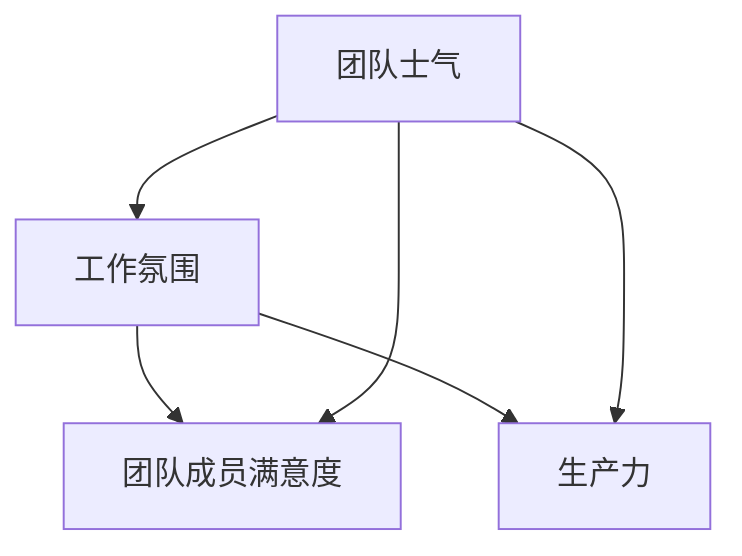

                 


为了撰写这篇关于《团队士气提升：创造积极向上的工作氛围》的技术博客文章，我们需要一步一步地进行分析和推理，确保文章逻辑清晰、内容详实。以下是文章撰写的大致步骤：

### 1. 确定文章结构

首先，我们需要按照给定的目录大纲来构建文章的结构。这将确保我们的文章内容丰富、逻辑性强。我们将在每个章节标题下编写详细的段落，确保每个章节都有完整的背景介绍、核心概念与联系、核心算法原理讲解、数学模型和公式、项目实战、最佳实践 tips 和小结。

### 2. 准备背景介绍

在每个章节开始前，我们需要准备背景介绍。这将包括团队士气、工作氛围的定义及其对团队的影响。例如：

- **团队士气**：团队士气是指团队成员对于团队目标、任务和工作的积极态度和热情程度。
- **工作氛围**：工作氛围是指团队内部的文化、价值观和相互关系，它对团队成员的满意度和生产力有重要影响。

### 3. 设计 Mermaid 流程图

为了展示核心概念之间的联系，我们需要设计 Mermaid 流程图。例如：



### 4. 编写核心算法原理讲解

在每个相关章节中，我们需要使用伪代码详细阐述提升团队士气的核心算法原理。例如：

```pseudo
// 提升团队士气的伪代码
function boostTeamSpirit(teamMembers, workEnvironment) {
    for (each member in teamMembers) {
        // 提高薪酬和福利
        increaseCompensation(member)
        
        // 关注职业发展
        provideTrainingOpportunities(member)
        
        // 增强团队凝聚力
        organizeTeamBuildingActivities()
    }
    
    // 创造积极的工作氛围
    improveWorkEnvironment(workEnvironment)
}
```

### 5. 编写数学模型和公式

我们需要使用 LaTeX 格式编写数学模型和公式，并提供详细讲解和举例说明。例如：

$$
\text{工作氛围满意度} = \frac{\text{正面反馈}}{\text{负面反馈}} + \text{团队合作得分}
$$

### 6. 编写项目实战

我们需要提供实际案例，展示如何通过实践来提升团队士气和工作氛围。这包括开发环境搭建、源代码实现和代码解读。例如：

- **开发环境搭建**：介绍如何设置一个适合团队协作的开发环境。
- **源代码实现**：提供提升团队士气的源代码示例，并详细解读其工作原理。
- **代码解读**：分析代码的实现细节，解释其如何提升团队士气。

### 7. 编写最佳实践 tips、小结和注意事项

在每个章节结束时，我们需要提供最佳实践 tips，对章节内容进行小结，并指出可能需要注意的事项。例如：

- **最佳实践 tips**：定期举行团队建设活动，以提高团队成员之间的信任和合作。
- **小结**：提升团队士气是一个持续的过程，需要团队成员和管理者的共同努力。
- **注意事项**：确保工作氛围中的公平性和透明性，避免不必要的冲突。

### 8. 完成文章并校对

在完成所有章节后，我们需要对文章进行全面的校对，确保文章内容完整、逻辑清晰、语言流畅。最后，在文章末尾添加作者信息。

通过上述步骤，我们可以确保撰写出的文章符合要求，既有深度又有思考，对读者具有实际指导意义。接下来，我们可以开始撰写文章的具体内容。

