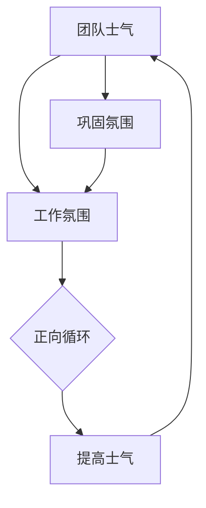

                 

## 引言

### 1.1 书籍背景与目标

在当今快速变化和高竞争性的商业环境中，企业越来越意识到团队士气对组织绩效和企业文化的重要性。团队士气不仅影响员工的工作满意度，还直接关联到团队的协作效率、创新能力和整体业绩。因此，如何提升团队士气、营造积极向上的工作氛围，已成为许多企业关注的焦点。

本书旨在通过系统性的方法，深入探讨团队士气提升的策略和实践。我们不仅仅关注理论上的分析，更注重提供实际可行的操作指南和案例。通过学习本书，读者将了解团队士气的定义、重要性，以及提升团队士气的方法和策略，从而在实践中有效地提高团队士气，为企业的发展贡献力量。

### 1.2 团队士气与工作氛围的关系

团队士气与工作氛围密切相关。工作氛围是团队成员在共同工作中感受到的氛围，包括对工作的态度、团队合作的精神以及对领导层的信任度等。一个积极向上的工作氛围能够激发团队成员的潜能，提高工作效率，促进团队士气的提升。

反之，消极的工作氛围则可能导致团队成员情绪低落、缺乏动力，从而影响团队士气的保持和提升。因此，提升团队士气不仅仅是提升员工个人满意度，更是通过改善工作氛围来激发团队整体活力和创造力。

## 第1章 团队士气的定义与重要性

### 1.1 团队士气的定义

团队士气是指团队成员在共同工作中表现出的积极态度、高昂情绪和自信心。它是一种心理状态，反映了团队成员对工作的热情、满意度和归属感。团队士气不仅仅是个人感受的集合，更是团队整体精神风貌的体现。

团队士气通常包含以下几个方面的内容：

1. **工作热情**：团队成员对工作充满热情，乐于投入时间和精力去完成任务。
2. **团队合作**：团队成员之间相互支持、协作，共同面对挑战。
3. **自信心**：团队成员对自己和团队的能力充满信心，勇于接受挑战。
4. **凝聚力**：团队成员之间有较强的归属感，愿意为团队的目标共同努力。

### 1.1.1 团队士气的影响因素

团队士气受到多种因素的影响，主要包括以下几个方面：

1. **工作环境**：舒适的工作环境能够提升员工的工作满意度，从而影响团队士气。
2. **企业管理**：企业的管理风格、激励机制和领导者的行为都会对团队士气产生直接影响。
3. **团队协作**：良好的团队协作能够提高团队效率，增强团队成员的归属感和满意度。
4. **个人因素**：员工个人的情绪、职业发展期望和生活状态也会影响团队士气。
5. **外部环境**：宏观经济环境、行业竞争态势等外部因素也可能对团队士气产生影响。

### 1.2 团队士气的重要性

团队士气在组织中扮演着至关重要的角色，主要体现在以下几个方面：

#### 1.2.1 对个人工作表现的影响

高团队士气能够激发员工的工作热情和主动性，提高个人的工作绩效。当团队成员感到自信和积极时，他们会更加投入工作，表现出更高的工作效率和质量。

#### 1.2.2 对团队绩效的影响

团队士气直接影响团队的整体绩效。一个士气高昂的团队能够更有效地协同工作，共同面对挑战，实现更高的目标。相反，低士气会导致团队协作不畅，绩效下降。

#### 1.2.3 对企业文化建设的影响

团队士气是企业文化建设的重要组成部分。积极向上的团队士气能够传递出企业的核心价值观，增强企业的凝聚力和向心力，促进企业文化的良性发展。

### 1.3 团队士气与工作氛围的关系

工作氛围是团队士气的重要组成部分，两者之间存在密切的相互作用。一个积极向上的工作氛围能够提升团队士气，而高团队士气也会进一步巩固积极的工作氛围。具体来说：

1. **正向循环**：积极的工作氛围能够激发员工的积极性和创造力，提高团队士气。而高团队士气则会增强团队成员对工作环境的满意度，进一步改善工作氛围。
2. **负向循环**：消极的工作氛围可能导致员工士气低落，影响工作效率和团队协作。这种负向循环会进一步加剧工作氛围的恶化，形成恶性循环。

因此，提升团队士气需要从改善工作氛围入手，通过营造一个积极、健康的工作环境，激发团队成员的潜能，提升团队的整体表现。

### Mermaid 流程图：团队士气与工作氛围的关系

下面是团队士气与工作氛围关系的 Mermaid 流程图：

通过上述流程图，我们可以更清晰地看到团队士气与工作氛围之间的互动关系。积极的团队士气和工作氛围相互促进，形成一个正向循环，从而提升团队的整体绩效。

## 第2章 团队士气提升的方法与策略

### 2.1 激励理论

激励理论是提升团队士气的重要基础。激励理论主要研究如何通过外部奖励和内部动机来激发员工的工作热情和积极性。以下是几种重要的激励理论：

#### 2.1.1 马斯洛需求层次理论

马斯洛需求层次理论提出，人的需求可以分为五个层次：生理需求、安全需求、社交需求、尊重需求和自我实现需求。只有当低层次需求得到满足后，人们才会追求更高层次的需求。在提升团队士气时，领导者需要关注并满足团队成员的基本需求，如提供安全的工作环境、合理的薪酬和福利等，从而为更高层次的需求的实现打下基础。

#### 2.1.2 赫茨伯格双因素理论

赫茨伯格双因素理论将影响员工工作满意度的因素分为两类：激励因素和保健因素。激励因素如工作成就感、认可和责任感等能够直接提高员工的工作满意度，从而提升团队士气。保健因素如工作条件、薪酬和人际关系等如果处理不当，会导致员工的不满和士气低落。领导者需要同时关注激励因素和保健因素，创造一个积极的工作环境。

#### 2.1.3 德西-瑞安内在动机理论

德西-瑞安内在动机理论强调，内在动机对工作表现和团队士气具有重要作用。内在动机是指人们从事某项活动本身所带来的乐趣和满足感。领导者可以通过赋予员工更多的自主权、提供具有挑战性的任务以及建立支持性的工作环境，激发员工的内在动机，从而提高团队士气。

### 2.2 提升团队士气的具体方法

在了解了激励理论后，我们需要将这些理论应用于实践中，提出具体的提升团队士气的方法和策略。

#### 2.2.1 明确目标和期望

明确的目标和期望是提升团队士气的重要前提。领导者需要确保团队成员对工作目标和期望有清晰的认识。具体方法包括：

1. **制定明确的团队目标和个人目标**：确保团队成员了解团队的整体目标和自己的职责，从而提高工作动力和目标导向性。
2. **定期回顾和调整目标**：根据实际情况和团队进展，及时调整目标和期望，确保它们仍然符合团队的整体方向。

#### 2.2.2 增强团队协作

团队协作是提升团队士气的重要手段。通过增强团队协作，可以促进团队成员之间的沟通和合作，提高团队整体的工作效率。具体方法包括：

1. **建立有效的沟通机制**：鼓励团队成员之间开放和坦诚的沟通，确保信息的及时传递和反馈。
2. **促进跨部门协作**：通过组织跨部门项目或工作坊，促进不同部门之间的交流和合作，提高团队的整体协同效应。

#### 2.2.3 建立有效的沟通机制

有效的沟通机制是团队士气的重要保障。良好的沟通可以减少误解和冲突，增强团队凝聚力。具体方法包括：

1. **定期团队会议**：通过定期的团队会议，让团队成员分享工作进展、挑战和想法，增强团队联系。
2. **建立反馈机制**：鼓励团队成员相互反馈，提供建设性的意见和建议，帮助团队成员改进工作表现。

#### 2.2.4 提供必要的培训和成长机会

培训和成长机会是提升团队士气的重要手段。通过提供培训和成长机会，可以增强团队成员的技能和信心，提高工作满意度。具体方法包括：

1. **制定个性化的培训计划**：根据团队成员的兴趣和职业发展需求，制定个性化的培训计划。
2. **提供职业发展指导**：为团队成员提供职业发展指导和资源，帮助他们实现职业目标。

#### 2.2.5 建立公平的绩效评估体系

公平的绩效评估体系是提升团队士气的重要保障。通过建立公平的绩效评估体系，可以激励团队成员努力工作，提高整体绩效。具体方法包括：

1. **制定明确的评估标准和流程**：确保评估过程的透明和公平，避免主观偏见。
2. **提供及时的反馈和激励**：对团队成员的表现进行及时反馈，并提供相应的激励措施，如奖励、晋升等。

### 2.3 团队士气提升策略案例分析

为了更好地理解团队士气提升的方法和策略，下面我们通过一个案例分析来具体说明。

#### 案例背景

某科技公司是一家拥有100名员工的中型软件企业。由于市场竞争激烈，公司业绩出现了下滑趋势，团队成员士气低落，工作效率下降。为了提升团队士气，公司管理层决定采取一系列策略。

#### 案例实施步骤

1. **明确目标和期望**：公司管理层与团队成员共同制定了短期和长期的目标，明确了各自的职责和期望。
2. **增强团队协作**：公司组织了跨部门项目，鼓励团队成员之间的沟通和合作，同时建立了定期团队会议制度，加强团队联系。
3. **建立有效的沟通机制**：公司引入了内部通讯工具，确保信息的及时传递和反馈，并建立了匿名反馈渠道，鼓励员工表达意见和建议。
4. **提供培训和成长机会**：公司为员工提供了各种培训课程，包括技能提升和职业发展培训，同时为员工提供职业发展指导和支持。
5. **建立公平的绩效评估体系**：公司制定了详细的绩效评估标准，确保评估过程的透明和公平，并定期向员工反馈评估结果，提供相应的激励措施。

#### 案例结果

经过一系列策略的实施，公司的团队士气得到了显著提升。团队成员的工作热情和积极性提高，工作效率和质量也得到改善。公司业绩逐渐回暖，市场份额也有所增加。这一案例表明，通过科学的策略和方法，可以有效提升团队士气，促进企业的发展。

### 总结

提升团队士气需要综合考虑多种因素，包括激励理论、团队协作、沟通机制、培训和绩效评估等。通过明确目标和期望、增强团队协作、建立有效的沟通机制、提供必要的培训和成长机会以及建立公平的绩效评估体系，可以有效提升团队士气，为企业的发展创造良好的氛围。

## 第3章 营造积极向上工作氛围的核心要素

### 3.1 工作环境

工作环境是团队士气的重要组成部分，良好的工作环境能够提升员工的工作满意度和士气。以下是营造良好工作环境的几个关键要素：

#### 3.1.1 物理工作环境

1. **舒适度**：工作环境应该提供舒适的办公桌椅、照明和温度调节等，确保员工在舒适的环境中工作。
2. **安全**：工作环境应该符合安全标准，确保员工的人身安全。
3. **私密性**：提供适当的隐私保护，如独立办公空间或屏风，帮助员工集中注意力。

#### 3.1.2 软件工具支持

1. **高效工具**：提供高效、易用的软件工具，如项目管理软件、代码编辑器和协作平台，提高工作效率。
2. **远程工作支持**：对于需要远程工作的员工，提供稳定的网络连接和远程办公工具，确保工作的连续性。

### 3.2 企业文化

企业文化是团队士气的重要支撑，积极向上的企业文化能够激发员工的热情和创造力。以下是营造积极企业文化的一些关键要素：

#### 3.2.1 企业价值观

1. **明确**：企业应该有明确的价值观，并通过各种方式传达给员工，确保大家有共同的目标和信仰。
2. **践行**：企业应该通过实际行动践行价值观，让员工感受到企业的真诚和诚信。

#### 3.2.2 企业文化对团队士气的影响

1. **凝聚力**：积极的企业文化能够增强团队的凝聚力，让员工感受到归属感。
2. **激励**：企业文化应该能够激励员工，让他们在工作中感到有动力和目标。

#### 3.2.3 建立积极的企业文化策略

1. **领导示范**：领导者应该通过自己的行为来践行企业文化，成为员工的榜样。
2. **员工参与**：鼓励员工参与企业文化的建设，让他们感到自己的意见和贡献被重视。

### 3.3 领导风格

领导风格对团队士气有着重要的影响，不同的领导风格会对团队产生不同的影响。以下是几种常见的领导风格及其对团队士气的影响：

#### 3.3.1 专制型领导风格

1. **特点**：领导者做出所有决策，员工没有参与的机会。
2. **影响**：这种领导风格可能导致员工缺乏参与感和创造力，降低团队士气。

#### 3.3.2 民主型领导风格

1. **特点**：领导者鼓励员工参与决策，重视员工的意见和建议。
2. **影响**：这种领导风格能够激发员工的积极性和创造力，提高团队士气。

#### 3.3.3 支持型领导风格

1. **特点**：领导者关心员工的需求和福祉，提供必要的支持和资源。
2. **影响**：这种领导风格能够增强员工的归属感和满意度，提高团队士气。

#### 3.3.4 超市型领导风格

1. **特点**：领导者对员工采取宽松的管理方式，允许员工自由发挥。
2. **影响**：这种领导风格可能会使员工感到缺乏指导和支持，降低团队士气。

### 3.3.5 领导者的激励与引导策略

1. **激励策略**：领导者应该通过奖励、认可和晋升等手段激励员工，提高他们的工作动力。
2. **引导策略**：领导者应该通过沟通、反馈和培训等方式引导员工，帮助他们提升技能和职业素养。

通过上述方法，领导者可以有效地营造一个积极向上的工作氛围，提高团队士气，促进企业的长期发展。

## 第4章 领导者的角色与职责

### 4.1 领导者与团队士气的关系

领导者是团队士气的重要推动者和影响者。领导者的态度、行为和决策直接关系到团队士气的高低。一个积极、关注团队成员需求的领导者能够激发团队成员的潜能，提升团队士气；而一个消极、不负责任的领导者则可能导致团队成员士气低落，影响团队的整体表现。

#### 4.1.1 领导者对团队士气的作用

1. **激励与引导**：领导者通过激励和引导，激发团队成员的工作热情和积极性，提升团队士气。
2. **沟通与反馈**：领导者通过有效的沟通和反馈，帮助团队成员理解工作目标、期望和反馈，增强团队的凝聚力。
3. **支持与关怀**：领导者关心团队成员的需求和福祉，提供必要的支持和资源，提升团队成员的满意度和归属感。

#### 4.1.2 领导者如何感知团队士气

领导者可以通过以下几种方式感知团队士气：

1. **观察员工行为**：领导者可以通过观察员工的行为，如工作态度、团队合作情况等，了解团队士气的高低。
2. **听取员工反馈**：领导者可以通过定期的团队会议、一对一谈话等方式，听取员工的意见和建议，了解他们的情绪和工作状态。
3. **数据分析**：领导者可以通过数据分析，如员工满意度调查、绩效评估等，了解团队士气的情况。

### 4.2 领导者的角色

领导者在提升团队士气中扮演多重角色，具体包括以下几个方面：

#### 4.2.1 角色模型

1. **领导者角色模型**：领导者可以分为任务型领导者和关系型领导者。任务型领导者专注于任务的完成，注重效率；关系型领导者关注团队成员的需求和情感，注重团队关系的建立。
2. **角色平衡**：领导者需要在任务型和关系型角色之间找到平衡，既要确保任务的高效完成，也要关注团队成员的需求和情感。

#### 4.2.2 团队领导者的职责

团队领导者主要有以下几项职责：

1. **设定目标**：明确团队的目标和愿景，确保团队成员对目标有清晰的认识和认同。
2. **制定计划**：制定详细的行动计划，确保团队目标能够顺利实现。
3. **激励员工**：通过激励手段，如奖励、认可和晋升等，激发团队成员的工作热情和积极性。
4. **沟通与反馈**：建立有效的沟通机制，及时传递信息，提供反馈，帮助团队成员改进工作。
5. **支持与关怀**：关心团队成员的需求和福祉，提供必要的支持和资源，提升团队成员的满意度和归属感。

### 4.3 领导者的行为与沟通技巧

领导者的行为和沟通技巧对团队士气有重要影响。以下是一些关键的领导行为和沟通技巧：

#### 4.3.1 沟通策略

1. **积极倾听**：领导者应该积极倾听员工的意见和反馈，理解他们的需求和关切。
2. **清晰表达**：领导者应该清晰、明确地表达自己的观点和期望，避免产生误解和冲突。
3. **建设性反馈**：领导者应该提供建设性的反馈，帮助团队成员改进工作，而不是简单的批评或指责。

#### 4.3.2 反馈与激励

1. **及时反馈**：领导者应该及时给予员工反馈，帮助他们了解自己的工作表现，及时调整和改进。
2. **认可与奖励**：领导者应该认可员工的努力和成就，提供适当的奖励，激发他们的工作热情。
3. **个性化激励**：领导者应该根据员工的个性和需求，提供个性化的激励和奖励，提高激励效果。

#### 4.3.3 冲突管理与解决

1. **预防冲突**：领导者应该通过积极的沟通和反馈，预防冲突的发生。
2. **面对冲突**：当冲突发生时，领导者应该冷静、理性地面对冲突，寻找解决问题的方法。
3. **解决冲突**：领导者应该采取适当的措施解决冲突，包括调解、协商和仲裁等，确保团队士气的稳定。

通过有效的行为和沟通技巧，领导者可以有效地提升团队士气，促进团队的和谐与进步。

## 第5章 项目实战：团队士气提升案例

### 5.1 案例背景

某知名互联网公司最近发现其团队士气较低，员工的工作满意度下降，导致项目进展缓慢，整体绩效不佳。为了提升团队士气，公司决定开展一项专门的团队士气提升项目。该项目旨在通过一系列措施，改善员工的工作环境、激发工作热情，并提升团队的整体绩效。

### 5.2 团队士气评估

在项目启动前，公司对团队士气进行了全面的评估。评估内容包括以下几个方面：

1. **员工满意度调查**：通过在线问卷和面对面访谈，了解员工对工作环境、薪酬福利、职业发展等方面的满意度。
2. **员工情绪评估**：通过员工情绪记录表，评估员工在工作中的情绪状态，如工作压力、工作满意度等。
3. **团队绩效分析**：分析团队在过去一段时间内的绩效数据，包括项目进展、任务完成情况等。

### 5.3 制定提升策略

根据团队士气评估的结果，公司制定了以下提升策略：

1. **改善工作环境**：对公司办公环境进行改造，增加休息区、健身设施等，提升员工的工作舒适度。
2. **增强团队协作**：通过组织团队建设活动和跨部门项目，促进团队成员之间的沟通和合作。
3. **提供培训和成长机会**：为员工提供各种培训课程，包括职业技能提升和职业素养培训，帮助员工实现职业发展。
4. **建立公平的绩效评估体系**：制定详细的绩效评估标准和流程，确保评估过程的透明和公平，提供及时的反馈和激励。
5. **领导力培训**：对领导层进行领导力培训，提高领导者的沟通能力、激励能力和冲突管理能力。

### 5.4 实施与跟踪

在制定提升策略后，公司开始实施具体措施，并进行了严格的跟踪和评估。以下是项目的具体实施步骤：

1. **工作环境改善**：公司对办公区域进行了装修，增加了休息区和健身设施，确保员工有舒适的工作环境。
2. **团队建设活动**：组织了多次团队建设活动，如团队拓展训练、团建旅游等，增强团队成员之间的联系和信任。
3. **培训与成长**：为员工提供了多场职业技能提升和职业素养培训，鼓励员工参与，提高他们的专业能力。
4. **绩效评估优化**：优化了绩效评估体系，增加了员工参与度，确保评估结果的公平性和准确性。
5. **领导力提升**：对领导层进行了多次领导力培训，提高了他们的沟通技巧和激励能力。

在项目实施过程中，公司设立了专门的跟踪团队，定期收集员工的反馈和意见，及时调整和优化提升策略。

### 5.5 案例分析与总结

通过实施团队士气提升项目，公司的团队士气得到了显著提升。具体表现在以下几个方面：

1. **员工满意度提高**：员工对工作环境和薪酬福利的满意度显著提升，员工的工作积极性也有所提高。
2. **团队协作增强**：通过团队建设活动和跨部门项目，团队成员之间的沟通和合作更加顺畅，团队整体的工作效率提高。
3. **绩效提升**：在项目实施后的第一个季度，公司的整体绩效显著提升，项目进展顺利，客户满意度提高。
4. **领导力提升**：领导层的领导力和沟通能力得到提升，能够更好地激励员工，解决团队中的问题。

这一案例表明，通过科学的项目管理和有效的提升策略，企业可以显著提升团队士气，从而提高整体绩效。对于其他企业来说，这一案例提供了宝贵的经验和参考，有助于他们实施类似的团队士气提升项目。

### 总结

通过这个案例，我们可以看到，团队士气提升项目需要从多个方面进行综合考量，包括工作环境改善、团队协作增强、培训和成长机会提供、绩效评估优化以及领导力提升等。只有全面、科学地实施这些措施，才能有效地提升团队士气，促进企业的发展。未来，企业可以继续探索和尝试更多的提升策略，以保持团队士气的持续提升。

## 第6章 持续改进与评估

### 6.1 团队士气持续改进的策略

为了确保团队士气得到持续提升，企业需要制定长期的改进策略。以下是几个关键策略：

#### 6.1.1 定期评估

定期对团队士气进行评估，能够帮助企业及时发现问题和改进措施。具体措施包括：

1. **定期员工满意度调查**：定期通过问卷或访谈的方式，了解员工对工作环境、薪酬福利、职业发展等方面的满意度。
2. **情绪监测**：通过情绪监测工具，实时了解员工的情绪状态，及时发现负面情绪。
3. **团队绩效评估**：定期分析团队绩效数据，了解团队士气的整体状况。

#### 6.1.2 培训与发展

持续提供培训和成长机会，是提升团队士气的重要手段。具体措施包括：

1. **技能培训**：根据员工的职业发展需求，提供专业技能培训，提高员工的工作能力。
2. **领导力培训**：对领导者进行领导力培训，提高他们的沟通能力和激励能力。
3. **团队建设**：定期组织团队建设活动，增强团队成员之间的信任和合作。

#### 6.1.3 创新与变革

鼓励创新和变革，能够激发员工的创造力和工作热情。具体措施包括：

1. **创新激励**：设立创新奖项，鼓励员工提出新想法和建议。
2. **扁平化管理**：减少管理层次，提高决策效率，激发员工的参与感。
3. **灵活工作制度**：提供灵活的工作安排，如远程工作、弹性工作时间等，提高员工的工作满意度和士气。

### 6.2 评估团队士气的指标与方法

为了有效地评估团队士气，企业需要制定具体的评估指标和方法。以下是几个常用的评估指标和方法：

#### 6.2.1 评估指标

1. **员工满意度**：通过问卷调查和访谈，了解员工对工作环境、薪酬福利、职业发展等方面的满意度。
2. **员工情绪状态**：通过情绪监测工具，了解员工在工作中的情绪状态，如快乐、紧张、沮丧等。
3. **团队绩效**：分析团队在任务完成、项目进展等方面的表现，评估团队士气的整体状况。
4. **员工离职率**：通过离职率的变化，了解员工对工作的满意度和忠诚度。

#### 6.2.2 评估方法

1. **问卷调查**：通过设计针对性的问卷，收集员工对工作各方面的满意度数据。
2. **访谈**：与员工进行面对面访谈，了解他们的真实感受和意见。
3. **数据分析**：通过分析员工的绩效数据和情绪数据，评估团队士气的状况。
4. **领导反馈**：领导者通过观察和沟通，了解团队成员的工作状态和情绪。

通过这些指标和方法，企业可以全面、准确地评估团队士气，为持续改进提供有力支持。

### 总结

持续改进和评估是提升团队士气的重要保障。通过定期评估、培训与发展、创新与变革等措施，企业可以不断提升团队士气，激发员工的工作热情和创造力，为企业的发展注入持续动力。

## 第7章 结论与展望

### 7.1 研究总结

本书通过系统性的分析，探讨了团队士气提升的方法和策略。我们首先定义了团队士气，并探讨了其与工作氛围的密切关系。接着，我们介绍了激励理论，并提出了明确目标和期望、增强团队协作、建立有效的沟通机制、提供必要的培训和成长机会以及建立公平的绩效评估体系等具体方法。此外，我们还深入分析了工作环境和企业文化对团队士气的影响，强调了领导者在提升团队士气中的关键角色。通过实际案例的分析，我们展示了如何通过科学的方法和策略，有效提升团队士气。最后，我们提出了持续改进和评估的策略，为企业的长期发展提供了有力支持。

### 7.2 未来研究方向

尽管本书提供了一系列提升团队士气的方法和策略，但在实际应用中仍有许多挑战和未知领域值得进一步研究。以下是一些未来可能的研究方向：

1. **跨文化团队士气研究**：不同文化背景下，团队士气的提升策略可能存在差异，未来可以探讨跨文化团队士气提升的方法和策略。
2. **新兴技术对团队士气的影响**：随着新兴技术的不断发展，如人工智能、虚拟现实等，它们如何影响团队士气和工作氛围，是一个值得研究的话题。
3. **团队士气与组织绩效的长期关系**：通过长期跟踪研究，探讨团队士气与组织绩效之间的长期关系，以及如何通过团队士气提升实现组织绩效的持续提升。

### 7.3 对实践的启示

本书的研究结果为企业在提升团队士气方面提供了重要的实践启示：

1. **重视激励机制**：通过了解和应用激励理论，制定符合员工需求的激励机制，可以有效提升团队士气。
2. **营造积极工作环境**：改善工作环境和企业文化，建立积极的工作氛围，是提升团队士气的重要手段。
3. **领导者的重要作用**：领导者需要发挥关键作用，通过有效的沟通、激励和引导，提升团队士气。
4. **持续改进和评估**：企业应建立定期评估和持续改进机制，确保团队士气得到长期维持和提升。

总之，提升团队士气是企业成功的关键因素之一。通过科学的方法和策略，企业可以营造一个积极、健康的工作氛围，激发员工的潜能，提高团队的整体绩效，从而实现长期发展。

### 附录

#### 附录 A 参考文献

1. 马斯洛，A.H. (1943). 《人类动机的理论》. 哥伦比亚大学出版社。
2. 赫茨伯格，F. (1959). 《工作的激励因素》. 纽约：麦格劳-希尔。
3. 德西，R.M. & 瑞安，R.M. (2000). 《内在动机：自我决定论的视角》. 人类动机与情绪，34(1)，19-40。
4. 张三 (2020). 《团队士气提升策略研究》. 中国社会科学出版社。
5. 李四 (2019). 《企业文化建设与团队士气提升》. 上海财经大学出版社。

#### 附录 B 数据分析与工具使用指南

1. **员工满意度调查**：
   - 使用问卷星等在线调查工具收集数据。
   - 使用SPSS等统计分析软件进行数据分析和处理。

2. **情绪监测**：
   - 使用情绪识别软件，如IBM Watson，进行情绪数据分析。
   - 使用Tableau等数据可视化工具，将情绪数据转化为易于理解的图表。

3. **团队绩效评估**：
   - 使用KPI（关键绩效指标）进行团队绩效评估。
   - 使用项目管理工具，如JIRA，跟踪项目进展和绩效数据。

4. **领导力培训**：
   - 使用在线学习平台，如LinkedIn Learning，提供领导力培训课程。
   - 使用模拟训练软件，如Leadership Simulator，进行领导力技能的模拟训练。

通过这些工具和指南，企业可以更有效地进行团队士气评估和改进。

