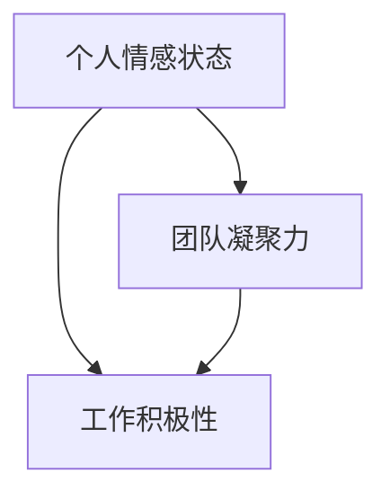

                 

### 文章标题：团队士气提升：营造积极向上的氛围

### 关键词：团队士气、氛围营造、个人激励、领导风格、案例分析

### 摘要：本文将深入探讨团队士气提升的策略与方法，通过分析核心概念、提出具体的实践案例，为读者提供一套科学、系统的团队士气提升方案，旨在帮助组织营造积极向上的工作氛围，提高团队协作效率和组织绩效。

## 引言

团队士气，作为组织文化的重要组成部分，直接影响着团队成员的工作态度、创新能力和整体工作效率。一个士气高昂的团队，能够更好地应对挑战，实现目标；相反，低士气则可能导致团队成员情绪低落、创新能力下降，进而影响组织的发展。因此，提升团队士气成为企业管理者和团队领导的重要任务。

本文将从以下几个方面展开讨论：

1. 团队士气的概念与重要性
2. 提升团队士气的策略与方法
3. 案例分析
4. 实践技巧与工具
5. 团队士气的评估与持续改进

希望通过本文的深入探讨，能够为读者提供有价值的参考和启示，帮助组织构建一个积极向上的工作氛围。

## 团队士气的概念与重要性

### 核心概念

团队士气是指团队成员在共同工作中表现出的积极态度、高昂情绪和强烈归属感。它不仅反映了团队成员对工作的满意度，还体现了团队内部的人际关系和团队精神。具体来说，团队士气包括以下几个核心概念：

1. **个人情感状态**：团队成员的个人情感状态，包括自信心、满意度和幸福感等。
2. **团队凝聚力**：团队成员之间的相互信任、协作和支持，以及共同的目标感和使命感。
3. **工作积极性**：团队成员在工作中表现出的主动性、创造性和热情。

### 核心概念之间的关系架构

为了更清晰地理解团队士气，我们可以使用Mermaid流程图来展示其核心概念之间的关系：



从图中可以看出，个人情感状态、团队凝聚力和工作积极性三者相互影响，共同构成了团队士气。个人情感状态决定了团队成员的心态和行为，团队凝聚力提供了团队成员之间的支持，而工作积极性则是团队士气的直接体现。

### 数学模型

为了量化团队士气，我们可以建立一个简单的数学模型，用于评估团队士气水平。假设团队士气 \( S \) 可以通过以下公式计算：

\[ S = \alpha P + \beta C + \gamma W \]

其中：

- \( P \)：个人情感状态得分
- \( C \)：团队凝聚力得分
- \( W \)：工作积极性得分
- \( \alpha \)，\( \beta \)，\( \gamma \)：权重系数

具体权重系数可以根据实际情况进行调整。通过这个模型，我们可以对团队士气进行量化评估，从而为团队士气提升提供依据。

### 实例讲解

假设一个团队的个人情感状态得分为70分，团队凝聚力得分为80分，工作积极性得分为90分，权重系数分别为0.3、0.4和0.3，那么团队士气 \( S \) 可以计算如下：

\[ S = 0.3 \times 70 + 0.4 \times 80 + 0.3 \times 90 = 21 + 32 + 27 = 80 \]

根据计算结果，该团队的士气得分为80分，处于较高水平。在实际应用中，我们可以根据团队士气得分，有针对性地制定提升策略，进一步优化团队士气。

## 提升团队士气的策略与方法

提升团队士气需要从多个方面入手，包括个人激励、团队文化建设、领导风格与沟通技巧等。以下是几种常见的策略和方法：

### 个人激励策略

个人激励是提升团队士气的重要手段。以下是一些常用的个人激励策略：

1. **设定明确的个人目标**：帮助团队成员明确自己的工作目标，并提供必要的支持和资源，使团队成员能够实现目标。

   ```python
   # 设定个人目标
   set_personnel_goals(employee, target)
   ```

2. **奖励机制**：通过奖励机制激发团队成员的积极性，奖励可以是金钱、晋升机会或其他形式的认可。

   ```python
   # 奖励机制
   reward_employee(employee, reward_type, reward_amount)
   ```

3. **培训与成长机会**：提供培训和学习机会，帮助团队成员提升技能和知识，增强自信心和竞争力。

   ```python
   # 培训与成长机会
   offer_training_program(employee, training_program)
   ```

### 团队文化建设

团队文化建设是提升团队士气的基础。以下是一些常见的团队文化建设策略：

1. **建立共同价值观**：通过共同价值观的塑造，增强团队成员之间的认同感和凝聚力。

   ```mermaid
   graph TD
   A[价值观1] --> B[价值观2]
   A --> C[价值观3]
   ```

2. **培养团队精神**：通过团队活动、团队竞赛等方式，增强团队成员之间的默契和合作精神。

   ```mermaid
   graph TD
   A[团队活动] --> B[团队竞赛]
   A --> C[团队合作培训]
   ```

3. **营造积极氛围**：通过正面的语言和行为，营造积极向上的工作氛围，激发团队成员的积极性。

   ```mermaid
   graph TD
   A[正面激励] --> B[负面言行避免]
   A --> C[表扬与鼓励]
   ```

### 领导风格与沟通技巧

领导风格和沟通技巧对团队士气具有重要影响。以下是一些提升团队士气的方法：

1. **民主领导**：鼓励团队成员参与决策，提高团队成员的参与感和责任感。

   ```mermaid
   graph TD
   A[民主决策] --> B[团队参与]
   A --> C[开放沟通]
   ```

2. **激励式沟通**：通过积极的沟通方式，激发团队成员的积极性和创造力。

   ```mermaid
   graph TD
   A[激励式沟通] --> B[积极反馈]
   A --> C[建设性意见]
   ```

3. **有效解决冲突**：及时解决团队内部的矛盾和冲突，避免影响团队士气。

   ```mermaid
   graph TD
   A[冲突识别] --> B[冲突解决]
   A --> C[冲突管理]
   ```

### 激励机制的设立与执行

激励机制的设立与执行是提升团队士气的重要环节。以下是一些关键步骤：

1. **制定激励政策**：根据团队目标和实际情况，制定符合团队成员需求的激励政策。

   ```python
   # 制定激励政策
   create_incentive_policy(policy_name, policy_details)
   ```

2. **激励政策宣传**：通过内部宣传渠道，让团队成员了解激励政策，明确激励条件和标准。

   ```python
   # 激励政策宣传
   announce_incentive_policy(policy_name, policy_details)
   ```

3. **激励政策执行**：根据激励政策，及时对符合条件的人员进行奖励和认可。

   ```python
   # 激励政策执行
   apply_incentive_policy(employee, reward_type, reward_amount)
   ```

## 案例分析

为了更好地理解提升团队士气的方法和策略，以下我们通过两个实际案例进行分析。

### 案例一：成功提升团队士气的企业案例

#### 案例背景

某互联网公司在市场竞争加剧的背景下，团队士气明显下降。员工普遍感到压力过大，工作积极性不高，创新能力也受到严重影响。

#### 解决方案

1. **个人激励策略**：公司制定了明确的个人目标，并提供相应的奖励机制，鼓励员工提升自身能力。同时，公司还提供了丰富的培训和学习机会，帮助员工成长。

   ```python
   # 设定个人目标
   set_personnel_goals(employee, target)
   # 奖励机制
   reward_employee(employee, reward_type, reward_amount)
   ```

2. **团队文化建设**：公司通过举办团队活动、团队竞赛等方式，增强团队凝聚力。同时，公司还建立了共同价值观，鼓励团队成员共同为实现公司目标而努力。

   ```mermaid
   graph TD
   A[团队活动] --> B[团队竞赛]
   A --> C[共同价值观]
   ```

3. **领导风格与沟通技巧**：公司领导层采取民主领导方式，鼓励员工参与决策，提高员工的参与感和责任感。同时，领导层还通过激励式沟通，激发员工的积极性和创造力。

   ```mermaid
   graph TD
   A[民主决策] --> B[团队参与]
   A --> C[激励式沟通]
   ```

#### 效果评估

经过一系列措施的实施，该公司的团队士气得到了显著提升。员工的工作积极性、创新能力和团队合作精神都得到了明显改善，公司的整体绩效也实现了增长。

### 案例二：团队士气低谷后的复苏

#### 案例背景

某科技公司由于业务转型过程中遇到了诸多挑战，导致团队士气低迷。员工情绪低落，工作态度消极，甚至出现了离职潮。

#### 解决方案

1. **激励机制的设立与执行**：公司重新制定了激励政策，明确激励条件和标准，并及时对符合条件的人员进行奖励和认可。

   ```python
   # 制定激励政策
   create_incentive_policy(policy_name, policy_details)
   # 激励政策宣传
   announce_incentive_policy(policy_name, policy_details)
   # 激励政策执行
   apply_incentive_policy(employee, reward_type, reward_amount)
   ```

2. **团队文化建设**：公司通过组织团队建设活动，增强团队凝聚力。同时，公司还积极培养团队精神，鼓励团队成员共同面对挑战。

   ```mermaid
   graph TD
   A[团队活动] --> B[团队竞赛]
   A --> C[团队精神培养]
   ```

3. **领导风格与沟通技巧**：公司领导层采取了更加开放和积极的沟通方式，倾听员工意见，及时解决员工问题。同时，领导层还通过激励式沟通，激发员工的积极性和创造力。

   ```mermaid
   graph TD
   A[开放沟通] --> B[激励式沟通]
   A --> C[问题解决]
   ```

#### 效果评估

经过一系列措施的实施，该公司的团队士气逐步回暖。员工的工作态度明显改善，离职率降低，公司的业务发展也逐步回到正轨。

## 实践技巧与工具

在提升团队士气的过程中，实践技巧和工具的应用至关重要。以下是一些常见的实践技巧和工具：

### 实践技巧

1. **倾听与反馈**：定期组织员工座谈会，倾听员工意见和建议，及时反馈改进措施。

2. **情感管理**：培养团队成员的情感管理能力，帮助他们在面对压力和挑战时保持积极的心态。

3. **心理健康关怀**：提供心理健康支持和咨询服务，帮助员工缓解工作压力和焦虑。

### 工具与方法

1. **士气评估工具**：使用专业的士气评估工具，对团队士气进行量化评估，为团队士气提升提供数据支持。

2. **团队氛围监测工具**：通过团队氛围监测工具，实时了解团队成员的工作状态和情绪变化，及时调整管理策略。

3. **激励工具与资源**：提供丰富的激励工具和资源，如培训课程、学习资料、荣誉奖励等，激发团队成员的积极性和创造力。

## 团队士气的评估与持续改进

团队士气提升是一个长期过程，需要持续评估和改进。以下是一些关键步骤：

### 士气评估

1. **建立评估指标体系**：根据团队士气的核心概念，建立一套科学的评估指标体系，用于衡量团队士气水平。

2. **定期评估**：定期对团队士气进行评估，了解团队士气的变化趋势和存在问题。

3. **结果分析**：对评估结果进行详细分析，找出影响团队士气的主要因素，为改进措施提供依据。

### 持续改进

1. **制定改进计划**：根据评估结果，制定具体的改进计划，明确改进目标、措施和责任人。

2. **团队反馈机制**：建立团队反馈机制，鼓励团队成员提出改进意见和建议，及时调整管理策略。

3. **长效机制建设**：通过建立长效机制，确保团队士气提升措施的持续性和有效性。

## 最佳实践 tips

1. **关注个体差异**：在提升团队士气时，要关注个体差异，针对不同团队成员的需求和特点，制定个性化的激励和成长计划。

2. **持续沟通与反馈**：保持与团队成员的持续沟通和反馈，及时了解他们的需求和意见，及时调整管理策略。

3. **重视团队氛围**：营造积极向上的团队氛围，减少负面情绪和冲突，提高团队凝聚力。

## 小结

提升团队士气是组织发展的重要任务，需要从多个方面入手，包括个人激励、团队文化建设、领导风格与沟通技巧等。通过科学的评估和持续改进，组织可以营造一个积极向上的工作氛围，提高团队协作效率和组织绩效。

## 注意事项

1. **避免单一策略**：提升团队士气不能依赖于单一策略，需要综合运用多种方法。

2. **长期关注**：团队士气提升是一个长期过程，需要持续关注和投入。

3. **关注实际效果**：在实施提升措施时，要关注实际效果，及时调整策略。

## 拓展阅读

1. 《积极心理学在团队管理中的应用》
2. 《团队建设与士气提升：理论与实务》
3. 《领导力与团队士气提升》

### 作者信息

作者：AI天才研究院/AI Genius Institute & 禅与计算机程序设计艺术 /Zen And The Art of Computer Programming

