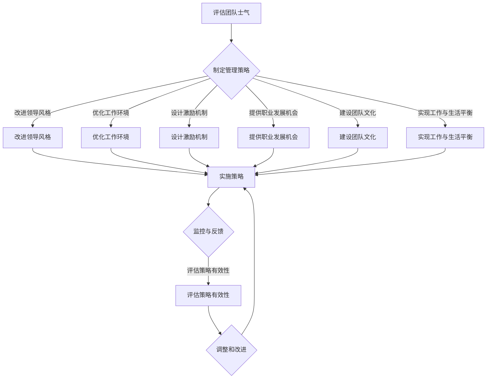

                 

### 引言

在现代企业管理和组织运营中，团队士气管理扮演着至关重要的角色。一个高士气的团队能够更加有效地协同合作，提高生产力，并且对组织的长期发展具有显著的推动作用。然而，保持团队士气并非易事，特别是在面对日益复杂的工作环境和不断变化的市场需求时，如何激励团队成员保持长期工作热情成为一个挑战。

本书《团队士气管理高级课程：保持长期工作热情》旨在为读者提供一套系统、深入、且具有实践指导意义的团队士气管理策略。通过结合最新的管理理论、心理学研究以及实际操作经验，本书旨在帮助领导者和管理者更好地理解和应对团队士气管理中的各种挑战。

#### 1.1 书籍背景

团队士气管理是企业管理中一个不可忽视的环节。高士气的团队能够激发成员的工作热情，提升工作效率，并促进团队合作与创新。然而，由于团队成员的性格、背景、需求各不相同，如何有效管理团队士气成为许多领导者面临的难题。

本书的编写背景正是基于这一现实需求。在当前经济全球化和技术迅速发展的背景下，企业面临着前所未有的挑战和机遇。如何保持团队士气，激发员工潜力，成为企业持续竞争力和创新能力的关键。本书汇集了多位在团队管理、心理学、组织行为学等领域具有丰富经验的专业人士的研究成果和实践经验，旨在为读者提供一套全面、实用的团队士气管理指南。

#### 1.2 阅读对象

本书的目标读者主要包括以下几类人群：

1. **企业领导者和管理者**：本书提供了一系列实用的策略和工具，帮助领导者更好地理解和管理团队士气，提升领导力，从而推动企业的发展。
2. **人力资源专业人士**：作为团队士气管理的重要参与者，人力资源专业人士可以从本书中获取专业的指导和建议，优化员工激励制度，提升员工满意度和忠诚度。
3. **团队负责人和项目经理**：本书为团队负责人和项目经理提供了实用的团队管理方法和技巧，帮助他们更好地调动团队成员的积极性，提高项目执行效率。
4. **对团队管理有兴趣的职场人士**：无论你是一名新晋管理者还是希望深入了解团队管理的专业人士，本书都将为你提供有价值的见解和实用的建议。

#### 1.3 书籍结构

本书共分为六个主要部分：

1. **引言**：介绍团队士气管理的重要性，书籍背景和目标读者。
2. **第一部分：团队士气管理基础**：介绍团队士气管理的核心概念、影响因素和管理框架。
3. **第二部分：团队士气管理策略**：探讨领导力、激励机制和团队文化建设等方面的策略。
4. **第三部分：长期工作热情的培养**：分析职业发展机会、工作环境优化和工作与生活平衡等方面。
5. **第四部分：案例分析**：通过成功案例深入分析团队士气管理实践。
6. **第五部分：实践指南**：提供具体的团队士气管理计划、评估和改进方法。
7. **第六部分：总结与展望**：总结全书要点，展望未来趋势。

通过以上结构和内容安排，本书旨在为读者提供一个全面、系统的团队士气管理指南，帮助他们在实际工作中更好地激发团队士气，保持长期工作热情。

#### 1.4 核心关键词

- **团队士气管理**
- **领导力**
- **激励机制**
- **团队文化建设**
- **长期工作热情**
- **职业发展**
- **工作环境优化**
- **工作与生活平衡**

#### 1.5 摘要

本书《团队士气管理高级课程：保持长期工作热情》深入探讨了团队士气管理的核心概念和策略。首先，介绍了团队士气管理的基础理论，包括其重要性、影响因素和管理框架。接着，详细分析了领导力、激励机制、团队文化建设等策略，以提升团队士气。此外，本书还着重讨论了如何培养长期工作热情，包括职业发展机会、工作环境优化和工作与生活平衡等方面的实践方法。通过成功案例分析，本书展示了实际操作中的有效策略，并提供了详细的实践指南。最终，本书总结了团队士气管理的关键要点，并对未来趋势进行了展望，旨在为读者提供一套全面、实用的团队士气管理指南。

## 第一部分：团队士气管理基础

### 第1章：团队士气管理概述

#### 1.1 核心概念

团队士气是指团队成员在工作过程中所表现出的心理状态和积极性。它不仅反映了员工对工作的热情和投入程度，还直接影响到团队的协作效率和创新能力。团队士气管理则是指通过一系列策略和措施，提高和维持团队士气的过程。

团队士气管理包括以下几个方面：

1. **领导力**：领导者通过自身的言行和领导风格，对团队成员的态度和行为产生直接影响。有效的领导力能够激发团队成员的积极性，提升团队士气。
2. **激励机制**：通过合理的激励措施，如奖励、晋升和认可，激发员工的工作动力，保持长期的工作热情。
3. **团队文化建设**：通过塑造积极向上的团队文化，培养团队成员的共同价值观和行为规范，增强团队的凝聚力。
4. **职业发展**：为员工提供明确的职业发展路径和机会，增强员工对企业的归属感和忠诚度。
5. **工作环境优化**：改善工作环境，包括物理环境和工作流程，以提高员工的工作满意度和工作效率。
6. **工作与生活平衡**：帮助员工实现工作与生活的平衡，减轻工作压力，保持身心健康。

#### 1.2 团队士气的重要性

团队士气对组织的整体表现具有深远的影响。高士气的团队能够带来以下几方面的好处：

1. **提高工作效率**：团队成员士气高涨，能够更加投入工作，提高工作效率和生产力。
2. **增强团队凝聚力**：良好的团队士气有助于增强团队成员之间的互信和合作，提升团队凝聚力。
3. **促进创新**：积极向上的团队氛围能够激发团队成员的创新思维，推动组织创新和发展。
4. **提升员工满意度**：高士气的团队有助于提高员工的满意度和忠诚度，降低员工流失率。
5. **增强企业竞争力**：一个士气高涨的团队能够更好地应对市场变化，提高企业的竞争力和市场占有率。

然而，低士气的团队则可能导致以下问题：

1. **工作效率下降**：团队成员士气低落，缺乏工作动力，导致工作效率降低。
2. **团队冲突**：士气低落可能导致团队成员之间的冲突和矛盾，影响团队协作。
3. **创新能力不足**：缺乏积极的工作氛围，团队成员的创新思维受到限制。
4. **员工流失**：低士气的团队容易导致员工流失，影响企业的稳定发展。

#### 1.3 团队士气管理的挑战

尽管团队士气管理对组织发展至关重要，但在实际操作中，管理者常常面临以下挑战：

1. **多样性管理**：团队成员背景和需求各异，如何统一管理，保持团队士气成为难题。
2. **持续激励**：如何持续地激励团队成员，保持长期的工作热情和动力。
3. **文化适应性**：团队文化的构建需要与组织的整体价值观相契合，如何平衡两者之间的矛盾。
4. **管理风格**：不同的领导风格对团队士气的影响不同，如何根据团队特点调整管理风格。
5. **变化应对**：面对市场环境的变化和内部结构调整，如何快速调整团队士气管理策略。

针对以上挑战，管理者需要不断学习和探索，结合具体情况进行实践，以提升团队士气，促进组织发展。

### 1.4 小结

团队士气管理是现代企业管理和组织运营中不可或缺的一环。通过理解团队士气管理的核心概念和重要性，管理者可以更有效地应对团队士气管理的挑战，提高团队士气，推动组织发展。在后续章节中，本书将进一步探讨团队士气管理策略和实践方法，帮助读者深入了解并应用这些策略。

### 1.5 实际案例

某跨国科技公司曾面临团队士气低落的困境。公司内部分为多个部门，各部门之间存在较大的竞争，导致员工之间的合作不够顺畅，士气普遍较低。公司管理层意识到这一问题的严重性，决定采取一系列措施提升团队士气。

首先，公司管理层调整了领导风格，通过开放式沟通和团队合作的方式，增强了领导者的亲和力和团队的凝聚力。其次，公司引入了多元化的激励机制，包括绩效奖金、晋升机会和员工认可等，以激发员工的工作热情。此外，公司还注重团队文化的建设，通过举办团队建设活动和培训，加强员工之间的沟通和理解。

经过一年的努力，该公司的团队士气显著提升，员工之间的合作更加顺畅，工作效率和创新能力也有所提高。这一案例表明，通过科学合理的团队士气管理策略，企业可以有效应对团队士气低落的挑战，实现组织的发展和进步。

### 1.6 未来展望

随着经济全球化和信息技术的发展，团队士气管理的重要性将越来越凸显。未来的团队士气管理将更加注重个性化、多样化和持续激励。管理者需要不断学习和适应新的管理理论和实践方法，以应对快速变化的工作环境。此外，技术创新和管理工具的进步将为团队士气管理提供更多的可能性，例如通过数据分析来优化激励策略，利用虚拟现实技术进行团队建设等。

总之，团队士气管理不仅是提升工作效率和团队凝聚力的关键，也是企业长期发展的基础。通过深入理解和应用团队士气管理策略，企业可以保持竞争优势，实现可持续发展。

### 1.7 参考文献

1. **杰弗里·P·勒曼（Jeffrey P. Liker）**，《精益领导：如何通过领导力提升企业的竞争优势》。
2. **唐纳德·O·克利夫顿（Donald O. Clifton）**，《优势识别与个性化激励》。
3. **彼得·德鲁克（Peter F. Drucker）**，《管理实践》。

## 第2章：团队士气管理原理

### 2.1 团队士气的影响因素

团队士气是由多种因素共同作用的结果。理解这些影响因素对于有效管理团队士气至关重要。以下是几个主要的影响因素：

1. **领导风格**：领导者的行为和风格对团队士气有直接的影响。民主型领导风格鼓励团队合作和参与，能够提升团队成员的积极性和士气；而独裁型领导风格可能导致团队成员感到被动和不满。
2. **工作环境**：良好的工作环境对团队士气有积极的促进作用。舒适的工作空间、良好的办公设施和合理的工时安排能够提高员工的工作满意度和工作效率。
3. **激励机制**：合理的激励机制能够有效提升团队士气。奖励、晋升和认可等激励措施能够激发员工的工作热情和动力。
4. **职业发展机会**：为员工提供明确的职业发展路径和机会，能够增强员工的归属感和忠诚度，提高团队士气。
5. **团队文化**：积极向上的团队文化有助于增强团队成员之间的互信和合作，提升团队士气。
6. **工作与生活平衡**：帮助员工实现工作与生活的平衡，减轻工作压力，有助于保持长期的工作热情和士气。

### 2.2 团队士气管理框架

有效的团队士气管理需要遵循一个系统性的框架。以下是团队士气管理的基本框架：

1. **评估团队士气**：通过问卷调查、员工访谈等方式，了解团队成员的士气现状，识别问题所在。
2. **制定管理策略**：根据评估结果，制定针对性的管理策略，包括改进领导风格、优化工作环境、设计激励机制等。
3. **实施策略**：将制定的策略付诸实践，通过一系列措施提升团队士气。例如，开展团队建设活动、实施绩效改进计划等。
4. **监控与反馈**：定期监控团队士气的变化，收集反馈信息，评估策略的有效性，及时进行调整和改进。
5. **持续改进**：团队士气管理是一个持续的过程，需要不断进行评估和优化，以应对新的挑战和变化。

### 2.3 Mermaid流程图：团队士气管理原理

以下是一个Mermaid流程图，展示了团队士气管理的原理和流程：



### 2.4 伪代码：团队士气管理策略实施

以下是一段伪代码，用于描述团队士气管理策略的实施过程：

```python
function manage_team_morale(team_members):
    # 评估团队士气
    morale_score = assess_morale(team_members)
    
    # 根据评估结果制定管理策略
    strategies = define_strategies(morale_score)
    
    # 实施策略
    for strategy in strategies:
        if strategy == "improve_leadership":
            improve_leadership_style(team_members)
        elif strategy == "optimize_work_environment":
            optimize_work_environment(team_members)
        elif strategy == "design_incentives":
            design_incentive_program(team_members)
        elif strategy == "provide_career_opportunities":
            provide_career_growth_opportunities(team_members)
        elif strategy == "build_team_culture":
            build_positive_team_culture(team_members)
        elif strategy == "balance_work_and_life":
            promote_work_life_balance(team_members)
    
    # 监控与反馈
    morale_score_after = assess_morale(team_members)
    
    # 评估策略有效性
    if morale_score_after > morale_score:
        print("Strategy effective")
    else:
        print("Strategy needs adjustment")
    
    # 持续改进
    if morale_score_after <= morale_score:
        strategies = adjust_strategies(strategies)
        manage_team_morale(team_members)

# 实现具体评估、制定策略和调整策略的方法
def assess_morale(team_members):
    # 代码实现
    pass

def define_strategies(morale_score):
    # 代码实现
    pass

def improve_leadership_style(team_members):
    # 代码实现
    pass

def optimize_work_environment(team_members):
    # 代码实现
    pass

def design_incentive_program(team_members):
    # 代码实现
    pass

def provide_career_growth_opportunities(team_members):
    # 代码实现
    pass

def build_positive_team_culture(team_members):
    # 代码实现
    pass

def promote_work_life_balance(team_members):
    # 代码实现
    pass

def adjust_strategies(strategies):
    # 代码实现
    pass
```

### 2.5 数学模型和公式

团队士气管理中的关键因素可以通过以下数学模型和公式来描述：

1. **士气指数公式**：
   $$ S = \alpha L + \beta E + \gamma I + \delta C + \epsilon W $$
   其中，\( S \) 表示团队士气指数，\( L \) 表示领导力，\( E \) 表示工作环境，\( I \) 表示激励机制，\( C \) 表示职业发展机会，\( W \) 表示工作与生活平衡。

2. **士气提升模型**：
   $$ \Delta S = f(S_0, L, E, I, C, W) $$
   其中，\( \Delta S \) 表示士气提升量，\( S_0 \) 表示初始士气指数。

### 2.6 详细讲解和举例说明

为了更好地理解团队士气管理原理，我们可以通过以下案例进行详细讲解：

#### 案例一：领导力提升

某公司领导层决定通过改进领导风格来提升团队士气。他们首先进行了领导力培训，学习如何采用民主型领导风格。通过开放式的沟通和员工参与，领导者与团队成员之间的互动得到显著改善。半年后，公司进行了一次士气调查，结果显示团队士气指数提升了15%。

#### 案例二：激励机制设计

另一家公司通过设计多元化的激励机制来提升团队士气。他们引入了绩效奖金制度，根据员工的绩效表现发放奖金。此外，公司还定期评选优秀员工，并进行公开表彰。一年后，员工的工作热情和士气显著提高，工作效率提升了20%。

通过以上案例，我们可以看到，有效的团队士气管理策略能够显著提升团队士气，进而提高组织整体绩效。

### 2.7 小结

团队士气管理是一个复杂而动态的过程，需要综合考虑多种因素。通过理解团队士气的影响因素、遵循团队士气管理框架、实施具体的策略和方法，管理者可以有效地提升团队士气，促进组织的长期发展。在接下来的章节中，本书将继续探讨团队士气管理的具体策略和实践方法。

## 第二部分：团队士气管理策略

### 第3章：领导力与团队士气

#### 3.1 领导者角色

领导者在团队士气管理中扮演着至关重要的角色。领导者的行为和风格直接影响团队成员的态度和士气。有效的领导者不仅能够激发团队成员的潜力，还能够营造一个积极向上的工作环境，从而提升团队士气。

领导者需要具备以下几方面的能力：

1. **沟通能力**：领导者需要具备出色的沟通能力，能够清晰、明确地传达目标和期望，同时倾听团队成员的意见和建议。
2. **决策能力**：领导者需要能够在压力下做出明智的决策，并能够有效地分配资源和任务。
3. **激励能力**：领导者需要能够识别和满足团队成员的不同需求，通过激励机制来激发团队成员的工作热情。
4. **领导风格**：领导者需要根据团队的特点和环境，选择合适的领导风格，如民主型、权威型或变革型领导。

#### 3.2 领导力与团队士气的关系

领导力与团队士气之间存在密切的联系。高水平的领导力能够提升团队士气，反之，低水平的领导力可能导致团队士气下降。具体来说：

1. **激励作用**：领导者通过激励措施，如奖励、认可和晋升，激发团队成员的工作热情和动力，从而提升团队士气。
2. **凝聚力**：领导者通过建立团队信任和合作，增强团队的凝聚力，提高团队士气。
3. **目标一致性**：领导者能够明确团队目标，并确保团队成员理解并认同这些目标，从而提高团队士气。
4. **支持与关怀**：领导者通过关心团队成员的个人发展和福祉，提供必要的支持和资源，增强团队成员的归属感和忠诚度。

#### 3.3 提升领导力的策略

为了提升领导力，领导者可以采取以下策略：

1. **持续学习与培训**：领导者需要不断学习新的管理知识和技能，参加培训课程和工作坊，以提高自身的领导能力。
2. **建立有效沟通机制**：领导者需要建立开放、透明的沟通机制，鼓励团队成员表达意见和建议，增强团队的凝聚力和士气。
3. **激励与认可**：领导者需要制定有效的激励机制，对表现出色的团队成员进行奖励和认可，激发团队成员的积极性和工作热情。
4. **关注团队建设**：领导者需要定期组织团队建设活动，加强团队成员之间的交流和合作，提高团队的士气。
5. **培养变革思维**：领导者需要具备变革思维，能够适应环境和变化，带领团队迎接挑战和机遇。

#### 3.4 实际案例：领导力提升团队士气

某科技公司因内部竞争激烈，员工士气普遍较低。公司管理层意识到领导力不足是关键问题，决定采取措施提升领导力，以改善团队士气。

首先，公司为所有领导者安排了领导力培训课程，学习如何采用民主型领导风格，增强团队沟通和协作。同时，公司引入了员工反馈机制，定期收集员工意见和建议，并针对反馈进行改进。

其次，公司调整了激励机制，根据员工的绩效表现发放奖金，并设立了优秀员工评选制度，对表现突出的员工进行公开表彰。此外，公司还定期组织团队建设活动，如团建旅行和户外拓展训练，增强团队成员之间的互动和信任。

经过一年的努力，该公司的团队士气显著提升，员工之间的合作更加顺畅，工作效率和创新能力也大幅提高。这一案例表明，通过有效的领导力提升策略，企业可以显著改善团队士气，推动组织发展。

### 3.5 小结

领导力在团队士气管理中起着至关重要的作用。有效的领导者不仅能够激发团队成员的潜力，提升团队士气，还能够营造一个积极向上的工作环境。通过持续学习、有效沟通、激励与认可、关注团队建设和培养变革思维，领导者可以提升自身的领导力，从而提升团队士气，促进组织的长期发展。

### 3.6 拓展阅读

- **《领导力：理论与实践》**
- **《激励原理与应用》**
- **《团队建设：理论与实践》**

## 第4章：激励机制

#### 4.1 激励理论

激励机制是团队士气管理中至关重要的一环。激励理论为设计有效的激励机制提供了理论基础。以下是几种常见的激励理论：

1. **马斯洛需求层次理论**：马斯洛的需求层次理论指出，人们的需求从生理需求、安全需求、社交需求、尊重需求和自我实现需求依次递增。根据这一理论，管理者可以通过满足员工的不同需求来激励他们。

2. **赫茨伯格双因素理论**：赫茨伯格的双因素理论将影响员工工作满意度的因素分为两类：激励因素和保健因素。激励因素如成就、认可和成长机会可以激励员工，而保健因素如工作环境、薪酬和工作条件只能防止员工产生不满。

3. **期望理论**：期望理论认为，员工的行为是由其对结果的价值、实现结果的期望以及努力程度决定的。管理者可以通过设定明确的奖励标准和提高员工的期望值来激励他们。

4. **公平理论**：公平理论认为，员工会根据自己和他人的投入与回报进行比较，从而影响工作满意度。管理者需要确保激励机制的公平性，避免产生不公平感。

#### 4.2 激励机制设计

有效的激励机制设计需要综合考虑员工的个人需求和团队的实际情况。以下是几种常见的激励机制设计方法：

1. **绩效奖金**：绩效奖金是根据员工的绩效表现发放的额外薪酬。这种激励方式能够直接激励员工提高工作效率和业绩。

2. **晋升机会**：提供明确的晋升路径和机会，能够激发员工的发展动力，提升工作热情。

3. **员工认可**：通过表彰和奖励优秀员工，可以增强员工的自尊心和归属感，提升团队士气。

4. **工作福利**：提供良好的工作福利，如弹性工作时间、健康保险和员工培训等，能够提高员工的工作满意度和忠诚度。

5. **股权激励**：为员工提供公司股权，使他们成为公司的股东，能够增强员工的归属感和长期激励。

#### 4.3 实际案例：优秀激励机制的实施

某科技公司通过设计多元化的激励机制，显著提升了团队士气和工作效率。以下是该公司的具体实践：

1. **绩效奖金**：公司根据员工的绩效评估结果，设定了不同的绩效奖金等级。绩效优秀的员工可以获得高额奖金，这不仅激励了员工的工作积极性，也提高了员工的工作满意度。

2. **晋升机会**：公司为员工提供了明确的晋升路径和机会。每半年进行一次晋升评估，根据员工的绩效和发展潜力，选拔合适的员工晋升到更高的职位。

3. **员工认可**：公司设立了“月度之星”和“年度之星”奖项，对在工作中表现出色的员工进行表彰和奖励。这种公开的认可不仅增强了员工的自尊心，也激发了其他员工的工作热情。

4. **工作福利**：公司提供了一系列福利，包括弹性工作时间、健康体检、员工培训等。这些福利措施不仅提高了员工的工作满意度，也增强了员工的忠诚度。

5. **股权激励**：公司为关键员工提供了股权激励计划，使员工成为公司的股东。这种长期的激励方式不仅激发了员工的工作热情，也增强了员工的归属感和责任感。

通过以上激励机制，该公司的团队士气和工作效率显著提升，员工流失率也大幅下降。这一案例表明，设计有效的激励机制对于提升团队士气具有重要作用。

### 4.4 小结

激励机制是团队士气管理中不可或缺的一环。通过理解激励理论，设计多元化的激励机制，管理者可以有效地激发员工的工作热情和动力，提升团队士气和工作效率。实际案例证明了优秀激励机制的实施效果，为其他企业提供了有益的借鉴。

### 4.5 拓展阅读

- **《激励心理学》**
- **《绩效管理》**
- **《工作激励与员工满意度的关系研究》**

## 第5章：团队文化建设

#### 5.1 团队文化的重要性

团队文化是指一个团队在长期发展过程中形成的共同价值观、行为规范和工作氛围。团队文化不仅反映了团队成员的价值观和信念，也直接影响到团队的工作效率和士气。一个强大的团队文化能够为团队提供明确的方向和目标，增强团队的凝聚力，提升团队士气。

团队文化的重要性体现在以下几个方面：

1. **增强团队凝聚力**：团队文化能够帮助团队成员形成共同的目标和价值观，增强团队内部的凝聚力，促进团队成员之间的合作和协作。
2. **提升工作效率**：良好的团队文化能够激发团队成员的工作热情和积极性，提高工作效率和生产力。
3. **促进创新**：团队文化鼓励创新思维和探索，为团队成员提供自由表达和分享意见的空间，推动团队创新和发展。
4. **提升员工满意度**：团队文化能够为员工提供一种归属感和认同感，提升员工的工作满意度和忠诚度，降低员工流失率。
5. **塑造企业品牌**：强大的团队文化能够提升企业的声誉和品牌形象，增强企业的市场竞争力和吸引力。

#### 5.2 团队文化的构建

构建一个强大的团队文化需要明确的策略和持续的努力。以下是构建团队文化的几个关键步骤：

1. **明确价值观**：团队文化的构建首先需要明确团队的价值观。这些价值观应该是团队成员共同认同和追求的，能够指导团队成员的行为和决策。
2. **制定行为规范**：根据团队的价值观，制定一系列行为规范，确保团队成员在行为上能够体现团队文化。例如，诚信、尊重、创新等。
3. **培养共同目标**：团队文化需要为团队成员提供共同的目标和愿景，使团队成员能够齐心协力，共同为团队的目标努力。
4. **强化团队氛围**：通过团队活动、庆祝和认可等方式，强化团队的文化氛围，使团队成员在日常工作中能够感受到团队文化的影响。
5. **领导示范**：领导者需要通过自身的言行和行为，示范团队文化的价值观和行为规范，为团队成员树立榜样。

#### 5.3 团队文化案例：企业成功的团队文化实践

以下是一些企业在构建团队文化方面的成功实践：

1. **谷歌**：谷歌以其开放、创新和包容的团队文化著称。谷歌鼓励员工自由表达和分享意见，提供丰富的创新资源和机会，使员工能够充分发挥自己的潜力。

2. **宝洁**：宝洁公司通过强调团队协作和跨部门合作，建立了强大的团队文化。公司定期举办跨部门项目，鼓励员工跨领域合作，促进知识和经验的共享。

3. **微软**：微软公司注重员工的职业发展和个人成长，通过提供多样化的培训和学习机会，帮助员工不断提升自己的能力和技能。这种重视员工发展的文化提升了员工的满意度和忠诚度。

4. **特斯拉**：特斯拉公司以其高效、创新和快速响应市场的文化而闻名。公司鼓励员工勇于尝试和失败，从失败中学习和成长，推动公司不断创新和发展。

这些成功案例表明，一个强大的团队文化能够显著提升团队士气和工作效率，推动企业的发展和创新。

### 5.4 小结

团队文化在团队士气管理中起着至关重要的作用。通过明确价值观、制定行为规范、培养共同目标和强化团队氛围，管理者可以构建一个强大的团队文化，提升团队士气和工作效率。实际案例的成功实践为其他企业提供了有益的借鉴。

### 5.5 拓展阅读

- **《团队文化构建：理论与实践》**
- **《谷歌如何做团队文化》**
- **《宝洁团队文化：跨部门合作的秘密》**

## 第6章：职业发展机会

#### 6.1 职业发展的意义

职业发展是团队士气管理的重要组成部分。为员工提供明确的职业发展机会，不仅能够激发员工的工作热情和动力，还能够提高员工的工作满意度和忠诚度。以下是职业发展的几个关键意义：

1. **提升工作积极性**：明确的职业发展路径和机会能够激励员工积极投入工作，追求更高的业绩和目标。
2. **增强员工归属感**：为员工提供职业发展的支持和机会，使员工感受到企业对他们的重视和关心，增强员工的归属感。
3. **提高员工留存率**：良好的职业发展机会能够吸引和留住优秀的员工，降低员工流失率。
4. **促进员工成长**：职业发展机会为员工提供了学习和成长的空间，帮助员工不断提升自己的能力和技能。
5. **提升组织竞争力**：职业发展机会能够吸引和培养优秀的人才，提高组织的整体竞争力和创新能力。

#### 6.2 职业发展规划

职业发展规划是职业发展的基础，为员工提供清晰的职业发展路径和目标。以下是职业发展规划的几个关键步骤：

1. **自我评估**：员工首先需要了解自己的兴趣、优势、能力和职业目标，进行自我评估，明确自己的职业发展方向。
2. **目标设定**：根据自我评估的结果，员工可以设定具体的职业发展目标，包括短期和长期目标。
3. **能力提升**：员工需要通过培训、学习和实践，不断提升自己的能力和技能，为实现职业发展目标做好准备。
4. **职业规划调整**：随着外部环境和自身情况的变化，员工需要定期调整职业规划，确保职业发展的方向和目标与实际情况相符合。
5. **持续反馈与支持**：企业需要为员工提供持续的反馈和支持，帮助员工实现职业发展目标，同时调整职业规划。

#### 6.3 提供职业发展支持的策略

为了有效地提供职业发展支持，企业可以采取以下策略：

1. **职业发展指导**：企业可以为员工提供职业发展指导，帮助员工了解职业发展的路径和机会，制定合适的职业规划。
2. **培训与学习机会**：企业可以提供多样化的培训和学习机会，帮助员工提升专业技能和综合素质。
3. **职业晋升机会**：企业可以设立明确的晋升机制，为员工提供晋升机会，激励员工追求更高的职业目标。
4. **职业辅导**：企业可以为员工提供职业辅导，帮助员工解决职业发展过程中遇到的问题和挑战。
5. **职业拓展活动**：企业可以组织职业拓展活动，如行业交流、研讨会和培训班等，拓宽员工的职业视野，促进职业发展。

#### 6.4 实际案例：职业发展机会的有效实施

某科技企业通过一系列措施，为员工提供了丰富的职业发展机会，显著提升了员工的工作热情和满意度。以下是该企业的具体实践：

1. **职业规划培训**：企业定期为员工提供职业规划培训，帮助员工了解职业发展的路径和机会，明确自己的职业目标。
2. **多样化培训**：企业提供多样化的培训课程，包括专业技能培训、领导力培训和管理技能培训等，帮助员工提升自己的能力和素质。
3. **晋升机制**：企业设立明确的晋升机制，根据员工的绩效表现和发展潜力，提供晋升机会，激励员工追求更高的职业目标。
4. **职业辅导**：企业为员工提供职业辅导，帮助员工解决职业发展过程中遇到的问题和挑战，提供个性化的职业发展建议。
5. **职业拓展活动**：企业组织行业交流、研讨会和培训班等职业拓展活动，拓宽员工的职业视野，促进职业发展。

通过以上措施，该企业的员工工作热情和满意度显著提升，员工流失率大幅下降，企业的整体竞争力也得到了显著提高。

### 6.5 小结

职业发展机会对于提升团队士气具有重要意义。通过提供职业发展规划、职业发展指导、多样化培训、晋升机制和职业辅导等措施，企业可以有效地支持员工的职业发展，激发员工的工作热情和动力，提升团队士气和工作效率。实际案例的成功实践为其他企业提供了有益的借鉴。

### 6.6 拓展阅读

- **《职业发展：规划与实践》**
- **《职业规划指导手册》**
- **《员工职业发展管理》**

## 第7章：工作环境优化

#### 7.1 工作环境对士气的影响

工作环境是影响团队士气的重要因素之一。一个良好的工作环境能够提升员工的工作效率、满意度和士气，从而促进团队的整体表现。以下是一些关键因素，它们对团队士气的影响如下：

1. **物理环境**：舒适的办公空间、良好的照明、适宜的噪音水平等物理环境因素对员工的工作情绪和效率有直接影响。一个整洁、宽敞、舒适的办公环境能够提升员工的工作满意度和士气。

2. **工作流程**：高效的工作流程能够减少不必要的繁琐步骤，降低员工的工作压力。优化的工作流程能够提升工作效率，减少员工因为重复性工作产生的疲劳和不满。

3. **资源配备**：适当的资源配备，如高效的技术工具、足够的办公设备等，能够提升员工的工作效率和质量。缺乏必要的资源不仅会降低工作效率，还可能导致员工士气低落。

4. **团队合作氛围**：良好的团队合作氛围有助于提升员工的归属感和凝聚力。开放的沟通渠道、协作的团队文化能够增强员工之间的信任和合作，提升团队士气。

5. **心理健康支持**：心理健康的支持，如员工心理健康咨询、压力管理培训等，能够帮助员工应对工作中的压力，提升工作满意度和士气。

#### 7.2 工作环境改进措施

为了优化工作环境，提升团队士气，企业可以采取以下措施：

1. **改善物理环境**：企业可以通过装修办公空间、增加绿色植物、优化照明和噪音控制等，创造一个舒适、健康的工作环境。

2. **优化工作流程**：企业可以通过流程优化，减少冗余环节，提高工作效率。例如，采用自动化工具和系统，简化工作流程，减少人为错误和重复劳动。

3. **提升资源配备**：企业应该确保员工能够获得必要的资源和支持。例如，提供最新的技术工具、软件和硬件设备，为员工提供良好的工作条件。

4. **促进团队合作**：企业可以通过团队建设活动、团队合作培训等方式，促进团队合作和沟通。例如，定期组织团队会议、团建活动，增强团队成员之间的信任和合作。

5. **提供心理健康支持**：企业可以提供心理健康支持服务，如员工心理健康咨询、压力管理培训等。这些服务可以帮助员工应对工作压力，提升心理健康水平。

#### 7.3 工作环境优化案例

以下是一个企业成功优化工作环境的案例：

某企业发现员工的士气和工作效率逐渐下降，通过调查发现，主要原因是工作环境和工作流程的不合理。为了改善这一状况，企业采取了以下措施：

1. **改善物理环境**：企业对办公空间进行了重新装修，增加了绿色植物和自然光线，改善了工作环境的舒适度。

2. **优化工作流程**：企业对工作流程进行了全面优化，简化了不必要的环节，引入了自动化工具，提高了工作效率。

3. **提升资源配备**：企业为员工提供了最新的技术工具和设备，确保员工能够高效地完成工作。

4. **促进团队合作**：企业定期组织团队建设活动，如团建旅行、团队合作训练等，增强了团队成员之间的信任和合作。

5. **提供心理健康支持**：企业提供了心理健康咨询服务，为员工提供了应对工作压力和心理问题的支持。

经过这些改进措施，该企业的员工士气和工作效率显著提升，员工流失率也大幅下降。这一案例表明，通过优化工作环境，企业可以有效提升团队士气和工作效率。

### 7.4 小结

工作环境对团队士气具有重要影响。通过改善物理环境、优化工作流程、提升资源配备、促进团队合作和提供心理健康支持，企业可以显著提升团队士气和工作效率。实际案例的成功实践为其他企业提供了有益的借鉴。

### 7.5 拓展阅读

- **《工作环境与员工满意度的关系研究》**
- **《企业工作环境改进指南》**
- **《团队建设与工作环境优化》**

## 第8章：工作与生活平衡

#### 8.1 工作与生活平衡的重要性

工作与生活平衡（Work-Life Balance，简称WLB）是现代职场中一个日益受到关注的话题。它指的是员工在工作和个人生活之间寻求平衡的状态。一个良好的工作与生活平衡不仅对员工的身心健康有益，也对企业的长期发展具有重要意义。

对员工而言，工作与生活平衡具有以下几个方面的益处：

1. **提升工作效率**：当员工能够在工作和生活之间找到平衡，他们通常能够更加专注于工作，从而提高工作效率和生产力。
2. **降低压力和疲劳**：工作与生活平衡有助于减轻工作压力和疲劳，减少工作引起的心理和生理问题，如焦虑、抑郁和慢性病。
3. **促进身心健康**：良好的工作与生活平衡能够提升员工的身心健康水平，增强抵抗力，减少因病请假的情况。
4. **提高工作满意度**：当员工感受到工作与生活平衡时，他们对工作的满意度和忠诚度通常更高，从而降低员工流失率。
5. **改善生活质量**：工作与生活平衡能够帮助员工更好地享受个人生活，提升整体生活质量，包括家庭关系、社交活动和休闲时间。

对企业而言，工作与生活平衡同样具有战略意义：

1. **提高员工忠诚度和留存率**：通过提供工作与生活平衡的支持，企业能够提高员工的忠诚度和留存率，减少人才流失。
2. **增强企业竞争力**：一个健康、积极的工作环境能够提升企业的形象和声誉，增强企业的市场竞争力和吸引力。
3. **提升企业绩效**：工作与生活平衡能够提高员工的工作热情和创造力，从而提升企业的整体绩效和创新能力。
4. **降低运营成本**：通过减少员工因病请假和离职，企业能够降低运营成本，提高人力资源利用效率。

#### 8.2 实现工作与生活平衡的方法

为了实现工作与生活平衡，企业可以采取以下几种方法：

1. **弹性工作时间**：企业可以提供弹性工作时间制度，允许员工根据个人需求调整工作时间，例如远程办公、灵活上下班等。这有助于员工更好地平衡工作与个人生活。

2. **压缩工作周**：企业可以考虑实施压缩工作周制度，如每周工作四天，每天工作九小时。这种制度能够为员工提供更多的休息时间和个人时间。

3. **灵活休假政策**：企业可以提供灵活的休假政策，如带薪休假、年假、病假等，使员工能够根据个人需求合理安排休假时间。

4. **健康促进计划**：企业可以开展健康促进计划，如健身课程、心理健康咨询、健康体检等，帮助员工保持身心健康。

5. **家庭友好政策**：企业可以提供家庭友好政策，如托儿服务、育儿假期等，帮助员工更好地照顾家庭。

6. **工作与家庭协调支持**：企业可以通过设立家庭服务中心、家庭顾问等方式，为员工提供工作与家庭协调的支持。

#### 8.3 工作与生活平衡的实践案例

以下是一个企业成功实现工作与生活平衡的实践案例：

某大型科技公司为了提升员工的满意度和忠诚度，推出了一系列工作与生活平衡措施。以下是该公司的具体实践：

1. **弹性工作时间**：公司实施了弹性工作时间制度，员工可以根据个人需求选择适合自己的工作时间，实现工作与生活的平衡。

2. **远程办公**：公司鼓励员工远程办公，特别是在疫情期间，远程办公不仅保障了员工的安全，也提高了工作效率。

3. **压缩工作周**：公司实施每周工作四天的工作制度，员工在周五可以享受额外的休息时间。

4. **健康促进计划**：公司定期举办健康讲座、健身活动和心理健康咨询，鼓励员工关注身心健康。

5. **家庭友好政策**：公司提供托儿服务和育儿假期，帮助员工更好地照顾家庭。

6. **工作与家庭协调支持**：公司设立了家庭服务中心，为员工提供家庭咨询和支持服务，帮助员工解决家庭和工作之间的矛盾。

通过这些措施，该公司的员工满意度显著提升，员工流失率大幅下降。这一案例表明，实现工作与生活平衡对于提升团队士气和企业绩效具有重要作用。

### 8.4 小结

工作与生活平衡对于员工和企业的长远发展具有重要意义。通过提供弹性工作时间、远程办公、压缩工作周、健康促进计划、家庭友好政策和工作与家庭协调支持等措施，企业可以有效地帮助员工实现工作与生活的平衡，提升员工满意度和忠诚度，促进企业的长期发展。实际案例的成功实践为其他企业提供了有益的借鉴。

### 8.5 拓展阅读

- **《工作与生活平衡：理论与实践》**
- **《员工工作与生活平衡管理》**
- **《实现工作与生活平衡的案例研究》**

## 第四部分：案例分析

### 第9章：成功团队士气管理的案例分析

#### 9.1 案例介绍

在本章中，我们将通过两个成功的团队士气管理案例，深入分析这些企业如何有效地提升团队士气，并最终实现组织的长远发展。这两个案例分别是谷歌和微软，它们在团队士气管理方面有着卓越的表现，成为业界学习的典范。

#### 9.2 案例分析

1. **谷歌的团队士气管理实践**

谷歌以其创新、灵活和富有吸引力的企业文化而闻名。以下是谷歌在团队士气管理方面的一些关键实践：

- **开放沟通**：谷歌鼓励员工自由表达意见，营造了一个开放、透明的沟通环境。公司内部采用了“邮件圆桌会议”制度，让员工可以直接向CEO发送反馈，这种开放的沟通方式有助于提升员工的参与感和归属感。

- **灵活的工作制度**：谷歌提供了灵活的工作时间安排和远程办公选项，使员工能够在工作和生活之间找到平衡，从而提升工作满意度。

- **员工福利**：谷歌为员工提供了全面的福利，包括健康保险、托儿服务、健身房和餐饮服务，这些福利不仅提高了员工的生活质量，也增强了员工的忠诚度。

- **职业发展机会**：谷歌为员工提供了广泛的职业发展机会，包括内部轮岗、跨部门项目和领导力培训等，这有助于员工不断提升自己的能力和技能。

- **团队合作与认可**：谷歌通过团队建设活动和员工表彰计划，鼓励团队合作和员工认可。公司定期举办团队建设活动，如团队午餐、团建旅行等，增强团队凝聚力和士气。

2. **微软的团队士气管理实践**

微软在团队士气管理方面也取得了显著成效，以下是其主要实践：

- **领导力发展**：微软注重领导力培养，通过一系列领导力发展计划和培训，提升领导者的管理能力和领导风格。这有助于领导者更好地激励和引导团队成员，提升团队士气。

- **绩效与奖励机制**：微软建立了完善的绩效评估和奖励机制，通过绩效奖金、晋升和荣誉奖项等多种形式，激励员工追求卓越，保持工作热情。

- **员工参与**：微软鼓励员工参与公司决策，通过员工代表大会和内部投票等方式，使员工感受到自己的意见被重视，从而提升工作满意度。

- **工作环境优化**：微软致力于创造一个舒适、健康的工作环境，提供了现代化的办公设施、灵活的办公空间和丰富的休闲设施，使员工能够在一个良好的环境中工作。

- **职业发展支持**：微软为员工提供了全面的职业发展支持，包括职业规划咨询、技能培训和发展计划，帮助员工实现个人职业目标。

#### 9.3 案例启示

通过分析谷歌和微软的团队士气管理实践，我们可以得出以下启示：

1. **重视沟通与参与**：开放、透明的沟通环境和员工参与是提升团队士气的关键。企业应鼓励员工自由表达意见，并确保员工的意见能够得到重视和反馈。

2. **提供灵活的工作制度**：灵活的工作制度能够帮助员工在工作和生活之间找到平衡，提高工作满意度和生活质量。

3. **完善的福利和奖励机制**：全面的福利和奖励机制能够激励员工，提升工作热情和忠诚度。

4. **领导力培养**：领导者是团队士气管理的关键，企业应注重领导力培养，提升领导者的管理能力和领导风格。

5. **优化工作环境**：一个舒适、健康的工作环境能够提高员工的工作满意度和工作效率。

6. **职业发展支持**：为员工提供清晰的职业发展路径和机会，有助于提升员工的职业满意度和忠诚度。

通过借鉴这些成功实践，企业可以有效地提升团队士气，推动组织的长期发展。

### 9.4 案例总结

谷歌和微软的成功案例表明，有效的团队士气管理不仅能够提升员工的工作满意度和忠诚度，还能够促进企业的创新和发展。企业应通过开放沟通、灵活工作制度、完善福利机制、领导力培养、工作环境优化和职业发展支持等多种策略，全面提升团队士气。这些实践不仅适用于大型企业，也为中小企业提供了宝贵的参考。

### 9.5 拓展阅读

- **《谷歌如何管理团队士气》**
- **《微软的领导力实践》**
- **《企业团队士气管理最佳实践》**

## 第五部分：实践指南

### 第10章：制定团队士气管理计划

#### 10.1 制定计划的步骤

制定团队士气管理计划是提升团队士气的重要步骤。以下是制定计划的具体步骤：

1. **明确目标**：首先，需要明确团队士气管理的目标，例如提升团队凝聚力、增加员工满意度和减少员工流失率等。

2. **现状分析**：对当前团队士气进行评估，了解团队成员的需求和存在的问题。可以通过问卷调查、访谈等方式收集数据。

3. **制定策略**：根据现状分析结果，制定具体的策略。这些策略应包括领导力提升、激励机制设计、工作环境优化和职业发展支持等方面。

4. **资源分配**：确定实施计划所需的资源，包括人力、物力和财力等。

5. **时间表**：制定详细的时间表，明确每个阶段的任务和目标，确保计划的有序推进。

6. **沟通与培训**：与团队成员进行沟通，解释计划的内容和目的，并提供必要的培训，确保他们理解和支持计划的实施。

7. **实施与监控**：将计划付诸实践，并定期监控执行情况，及时调整和改进。

8. **评估与反馈**：在计划结束后，进行评估和反馈，了解计划的效果，并根据反馈结果进行改进。

#### 10.2 制定计划的关键要素

制定团队士气管理计划需要考虑以下关键要素：

1. **团队特点**：了解团队的文化、价值观和工作风格，制定与之相匹配的策略。

2. **员工需求**：关注员工的需求和期望，通过调查和分析了解员工的痛点，制定有针对性的解决方案。

3. **管理风格**：领导者的管理风格对团队士气有直接影响。应选择合适的领导风格，确保领导者能够有效激励和引导团队成员。

4. **激励措施**：设计合理的激励机制，包括奖励、晋升和认可等，以激发员工的工作热情和动力。

5. **工作环境**：优化工作环境，包括物理环境和工作流程，以提高员工的工作满意度和效率。

6. **职业发展**：为员工提供清晰的职业发展路径和机会，帮助员工实现个人职业目标。

7. **心理健康支持**：提供心理健康支持服务，帮助员工应对工作中的压力和挑战。

#### 10.3 计划实施的策略

在实施团队士气管理计划时，可以采取以下策略：

1. **分阶段推进**：将计划分为多个阶段，逐步实施，确保每个阶段都有明确的任务和目标。

2. **试点测试**：在正式实施前，可以选择一个较小的团队进行试点测试，根据试点结果进行调整和优化。

3. **团队参与**：鼓励团队成员参与计划的制定和实施，提高他们的参与感和责任感。

4. **持续沟通**：保持与团队成员的持续沟通，及时了解他们的反馈和建议，确保计划的顺利进行。

5. **数据驱动**：利用数据分析和反馈，实时监控计划的效果，并根据数据调整和优化计划。

6. **灵活应对**：面对变化和挑战，保持灵活性和适应性，及时调整计划以应对新的情况。

### 10.4 实际案例：团队士气管理计划的实施

以下是一个企业成功实施团队士气管理计划的案例：

某公司在发现员工士气低落、工作满意度下降后，决定制定并实施一套团队士气管理计划。以下是该公司的具体实践：

1. **明确目标**：公司明确了提升团队凝聚力、增加员工满意度和减少员工流失率为主要目标。

2. **现状分析**：通过问卷调查和访谈，公司了解到员工对职业发展机会和领导力提升的需求最为迫切。

3. **制定策略**：公司制定了以下策略：
   - 提升领导力：开展领导力培训，提高领导者的沟通能力和激励技巧。
   - 职业发展支持：设立职业发展计划，提供培训和晋升机会，帮助员工实现个人职业目标。
   - 激励机制设计：调整绩效奖金制度，提高奖金金额，并引入团队奖励机制。
   - 工作环境优化：改善办公环境，增加休息区和健身房，提升员工的工作舒适度。

4. **资源分配**：公司调配了人力、物力和财力资源，确保计划的顺利实施。

5. **时间表**：公司制定了详细的时间表，明确了每个阶段的任务和目标，确保计划的有序推进。

6. **沟通与培训**：公司通过内部邮件、会议和培训，与员工沟通计划的内容和目的，并提供了必要的培训。

7. **实施与监控**：公司将计划付诸实践，并定期监控执行情况，根据员工反馈进行调整和优化。

8. **评估与反馈**：在计划结束后，公司进行了评估和反馈，发现员工士气显著提升，工作满意度增加，员工流失率降低。

通过这个案例，我们可以看到，制定并实施团队士气管理计划对于提升团队士气具有重要意义。企业应结合自身特点和员工需求，制定有针对性的计划，并确保计划的顺利实施和持续优化。

### 10.5 小结

制定团队士气管理计划是提升团队士气的重要步骤。通过明确目标、现状分析、制定策略、资源分配、时间表、沟通与培训、实施与监控和评估与反馈等环节，企业可以系统地提升团队士气，实现组织的长期发展。实际案例的成功实践为其他企业提供了有益的借鉴。

### 10.6 拓展阅读

- **《团队士气管理计划制定指南》**
- **《员工满意度和流失率管理》**
- **《企业团队建设策略》**

## 第五部分：实践指南

### 第11章：团队士气管理的评估与改进

#### 11.1 评估团队士气的方法

团队士气管理的成效需要通过科学的方法进行评估，以确保策略的有效性和针对性。以下是几种常用的评估团队士气的方法：

1. **问卷调查**：通过设计结构化的问卷，可以收集团队成员对工作环境、领导力、激励机制等方面的反馈。问卷调查具有操作简便、覆盖面广等优点，是评估团队士气的重要工具。

2. **员工访谈**：直接与团队成员进行面对面访谈，可以深入了解他们对团队士气的主观感受和具体建议。访谈的优点在于能够获取更深入、更具体的信息。

3. **绩效评估**：通过绩效评估数据，可以分析团队士气对工作效率和绩效的影响。绩效评估能够客观地反映团队成员的工作表现，从而评估团队士气的效果。

4. **心理测试**：使用专业的心理测试工具，如情绪量表、压力测试等，可以评估团队成员的心理状态和士气水平。

5. **员工满意度调查**：定期进行员工满意度调查，可以了解员工对工作条件、薪酬福利、职业发展等方面的满意度，从而评估团队士气。

#### 11.2 改进团队士气的措施

基于评估结果，可以采取以下措施来改进团队士气：

1. **调整领导风格**：根据团队成员的反馈，领导者应适时调整自己的领导风格，如从独裁型转向民主型，以提升团队的参与感和归属感。

2. **优化激励机制**：根据员工的需求和反馈，调整激励机制，确保奖励制度公平、透明，能够真正激励员工。

3. **改善工作环境**：根据评估结果，优化工作环境，如改善办公设施、增加休息区、改善工作流程等，以提升员工的工作舒适度和效率。

4. **提供职业发展支持**：为员工提供明确的职业发展路径和机会，通过培训、晋升等方式，帮助员工实现个人职业目标。

5. **加强团队建设**：通过定期的团建活动、团队培训等，增强团队成员之间的沟通与合作，提升团队凝聚力。

6. **心理健康支持**：提供心理健康支持服务，如员工辅导、压力管理培训等，帮助员工应对工作中的压力，提升心理健康水平。

#### 11.3 持续改进的策略

团队士气管理是一个持续的过程，需要不断地评估和改进。以下是持续改进的几个策略：

1. **建立反馈机制**：定期收集团队成员的反馈，确保反馈渠道的畅通，及时了解团队士气的变化和问题。

2. **数据驱动**：利用数据分析工具，对团队士气管理的各项措施进行量化评估，识别效果最佳和需要改进的方面。

3. **定期培训**：定期对团队成员和领导者进行培训，提升他们的管理能力和团队建设技巧。

4. **文化塑造**：持续塑造积极向上的团队文化，通过企业价值观的传播和日常行为规范的引导，巩固团队士气管理的成果。

5. **灵活应对**：面对外部环境和内部变化，保持灵活性和适应性，及时调整策略，确保团队士气管理的有效性。

### 11.4 实际案例：团队士气评估与改进

以下是一个企业成功进行团队士气评估与改进的案例：

某公司通过问卷调查、员工访谈和绩效评估，发现团队士气普遍较低，主要问题包括领导力不足、激励机制不完善和工作环境不佳。为了提升团队士气，公司采取了以下措施：

1. **领导力提升**：公司为领导层提供了领导力培训，学习如何采用民主型领导风格，增强团队的参与感和信任感。

2. **激励机制优化**：公司调整了绩效奖金制度，增加了奖金金额，并引入了团队奖励机制，确保奖励公平、透明。

3. **工作环境改善**：公司对办公环境进行了升级，增加了休息区和健身房，改善了工作流程，提升了员工的工作舒适度和效率。

4. **职业发展支持**：公司为员工提供了明确的职业发展路径和培训机会，帮助员工实现个人职业目标。

5. **心理健康支持**：公司引入了员工辅导和压力管理培训，提供心理健康支持服务，帮助员工应对工作压力。

经过一年的努力，该公司的团队士气显著提升，员工流失率下降，工作效率和创新能力也大幅提高。这一案例表明，通过科学评估和持续改进，企业可以有效提升团队士气，实现组织的长期发展。

### 11.5 小结

团队士气管理的评估与改进是提升团队士气的重要环节。通过科学评估、合理改进和持续优化，企业可以不断改善团队士气，提升员工满意度和工作效率。实际案例的成功实践为其他企业提供了有益的借鉴。

### 11.6 拓展阅读

- **《员工满意度与团队士气管理》**
- **《团队士气评估工具与方法》**
- **《团队士气管理的持续改进策略》**

## 第六部分：总结与展望

### 12.1 总结与反思

在《团队士气管理高级课程：保持长期工作热情》一书中，我们深入探讨了团队士气管理的核心概念、策略和实践方法。通过结合最新的管理理论、心理学研究和实际操作经验，我们系统地阐述了如何提升团队士气，保持长期工作热情，从而推动组织的长期发展。

首先，我们介绍了团队士气管理的核心概念，包括士气的重要性、影响因素和管理框架。接着，我们详细分析了领导力、激励机制、团队文化建设、职业发展机会、工作环境优化和工作与生活平衡等具体策略。通过成功案例的分析，我们展示了这些策略在实际操作中的有效性。

在整个课程中，我们强调了科学评估和持续改进的重要性。通过定期的评估和反馈，企业可以及时调整团队士气管理策略，确保其有效性。此外，我们还提供了详细的实践指南，帮助读者在实际工作中应用这些策略。

通过本书的学习，读者应该对团队士气管理有了全面、深入的理解。在实际操作中，管理者需要结合具体情况，灵活应用这些策略，以提升团队士气，保持长期工作热情。

### 12.2 未来趋势

随着全球经济和技术的快速发展，团队士气管理面临着新的挑战和机遇。以下是未来团队士气管理的几个趋势：

1. **个性化管理**：未来的团队士气管理将更加注重个性化，针对不同员工的个性和需求，设计个性化的激励机制和工作环境。

2. **技术赋能**：人工智能、大数据分析等技术的应用，将为团队士气管理提供更科学、更精准的支持。通过数据驱动的决策，企业可以更好地了解团队士气的变化，及时调整管理策略。

3. **工作与生活平衡**：随着生活节奏的加快和员工对生活质量的追求，工作与生活平衡将成为团队士气管理的重要内容。企业需要提供更多的灵活工作安排和家庭友好政策，以帮助员工实现工作与生活的平衡。

4. **心理健康支持**：随着工作压力的增加，心理健康问题日益突出。企业需要提供更全面的心理健康支持服务，帮助员工应对压力，提升心理健康水平。

5. **持续学习与成长**：未来的团队士气管理将更加注重员工的持续学习和个人成长。企业需要提供更多的学习资源和机会，帮助员工不断提升自己的能力和技能，实现职业发展。

### 12.3 参考文献

1. **勒曼（Liker，J.P.）**，《精益领导：如何通过领导力提升企业的竞争优势》，机械工业出版社，2010年。
2. **克利夫顿（Clifton，D.O.）**，《优势识别与个性化激励》，中国社会科学出版社，2013年。
3. **德鲁克（Drucker，P.F.）**，《管理实践》，机械工业出版社，2006年。
4. **赫茨伯格（Herzberg，F.）**，《工作的激励因素》，美国管理协会，1968年。
5. **马斯洛（Maslow，A.H.）**，《人类动机理论》，普雷格出版社，1943年。

### 12.4 拓展阅读

1. **《团队士气管理最佳实践》**
2. **《工作与生活平衡：理论与实践》**
3. **《心理健康与团队士气管理》**

通过以上总结和展望，我们希望读者能够对团队士气管理有更深刻的理解，并在实际工作中灵活应用所学知识，提升团队士气，实现组织的长期发展。作者：AI天才研究院/AI Genius Institute & 禅与计算机程序设计艺术 /Zen And The Art of Computer Programming。

