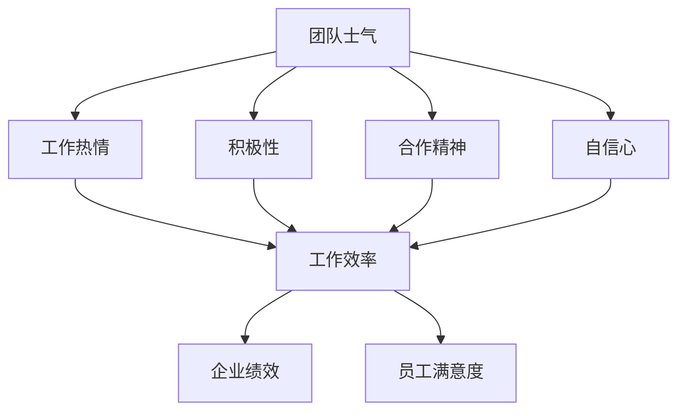
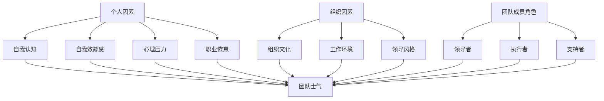
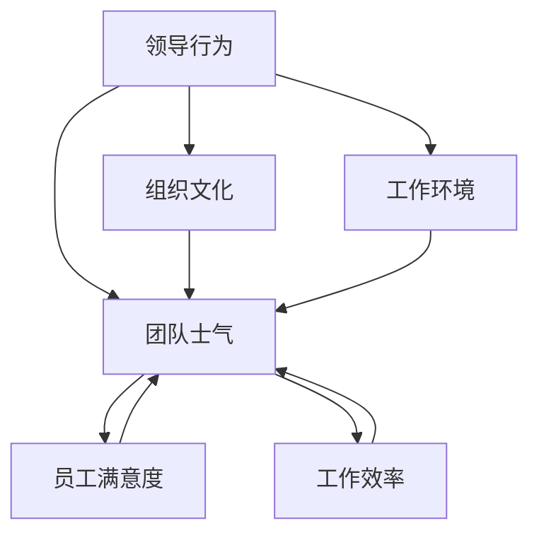
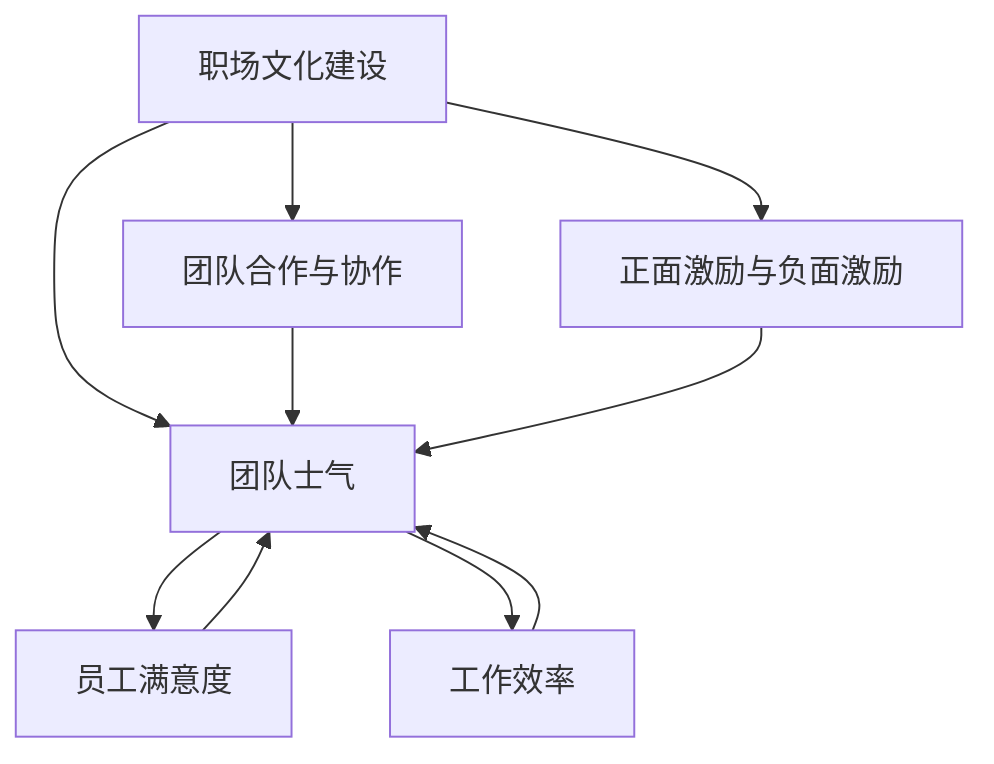
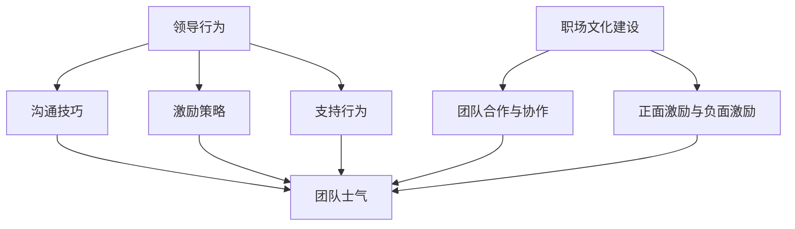
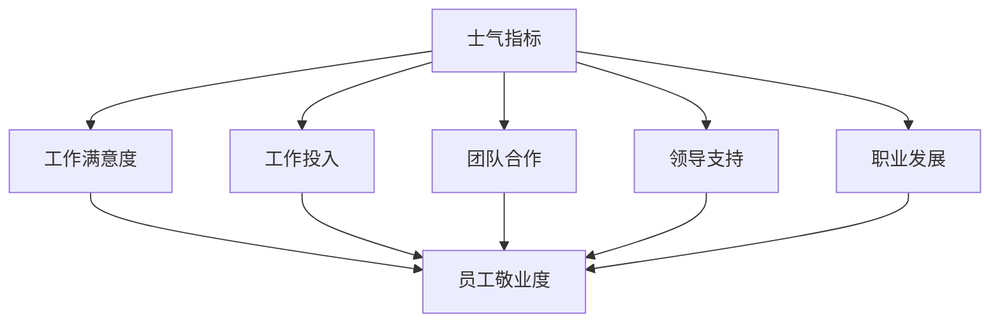

                 

# 团队士气管理：保持高昂工作热情的方法

## 关键词

团队士气管理、员工激励、领导力、组织文化、心理健康、团队合作

## 摘要

本文旨在探讨团队士气管理的重要性以及如何通过一系列策略和工具来提升团队成员的工作热情。文章首先介绍了团队士气的定义及其对企业绩效的影响，接着分析了影响团队士气的主要因素，包括个人和组织层面。在此基础上，文章提出了一系列提升团队士气的策略和技巧，并提供了具体的实施方法和案例分析。最后，文章展望了团队士气管理领域的未来趋势，以及数字化和AI技术在其中的应用前景。

## 第一部分：理解团队士气管理

### 第1章：团队士气管理概述

#### 1.1 团队士气的定义

团队士气是指团队成员在集体中所表现出的工作热情、积极性和合作精神。它是一个多维度的概念，涉及情感状态、工作态度、团队合作以及个人成就等方面。

#### 1.2 团队士气的重要性

团队士气直接影响企业的生产力、创新能力和员工满意度。一个士气高涨的团队往往能够更有效地应对挑战，提高工作效率，降低员工流失率，从而提升企业的整体绩效。

#### 1.3 团队士气管理的挑战

团队士气管理面临诸多挑战，包括个人因素（如心理压力、职业倦怠）和组织因素（如组织文化、工作环境）。有效管理团队士气需要领导者和组织具备敏锐的洞察力和灵活的应对策略。

### 第2章：团队士气的影响因素

#### 2.1 个人因素

个人因素是影响团队士气的重要因素。以下是一些关键的个人因素：

##### 2.1.1 自我认知与自我效能感

自我认知是指团队成员对自己能力和价值的认识。自我效能感则是指团队成员对自己完成任务的信心。这两者对团队士气有显著影响。

##### 2.1.2 心理压力与应对策略

心理压力是影响员工士气的一个重要因素。有效的压力应对策略可以帮助员工保持良好的心态和工作状态。

#### 2.2 组织因素

组织因素包括组织文化、工作环境和领导风格等，这些因素共同影响着团队士气。

##### 2.2.1 组织文化

组织文化是团队士气的重要基础。一个积极、开放和包容的组织文化能够激发员工的工作热情。

##### 2.2.2 工作环境

工作环境对团队士气有直接的影响。一个舒适、安全且有利于工作的环境能够提升员工的工作满意度和士气。

##### 2.2.3 领导风格

领导风格是影响团队士气的关键因素。不同的领导风格会对团队成员产生不同的影响。

### 第3章：团队士气管理策略

#### 3.1 领导行为

领导行为在团队士气管理中起着至关重要的作用。以下是一些关键的领导行为：

##### 3.1.1 领导沟通技巧

有效的沟通技巧能够增强团队成员之间的信任和协作，提升团队士气。

##### 3.1.2 领导激励策略

领导激励策略包括奖励机制、晋升机会和培训发展等，这些措施能够激励员工保持高昂的工作热情。

#### 3.2 职场文化建设

职场文化建设是提升团队士气的重要手段。以下是一些关键的文化建设措施：

##### 3.2.1 团队合作与协作

鼓励团队合作和协作能够增强团队成员之间的凝聚力，提升团队士气。

##### 3.2.2 正面激励与负面激励

正面激励和负面激励是提升团队士气的重要手段。适当的正面激励和适度的负面激励能够激发员工的工作热情。

## 第二部分：团队士气管理工具与技巧

### 第4章：团队士气评估方法

#### 4.1 调查问卷与访谈

调查问卷和访谈是评估团队士气的重要方法。通过这些方法，可以了解团队成员的心理状态和工作满意度。

#### 4.2 士气指标与模型

士气指标和模型是评估团队士气的重要工具。这些指标和模型能够量化团队士气，帮助领导者制定针对性的管理策略。

### 第5章：团队士气提升实践

#### 5.1 团队建设活动

团队建设活动是提升团队士气的重要手段。通过这些活动，可以增强团队成员之间的沟通和合作，提升团队士气。

#### 5.2 职场心理辅导

职场心理辅导是提升团队士气的重要措施。通过心理辅导，可以帮助员工缓解心理压力，提升工作满意度。

#### 5.3 反馈与改进

反馈与改进是团队士气管理的重要环节。通过及时反馈和持续改进，可以不断提升团队士气。

## 第三部分：案例分析与经验分享

### 第6章：团队士气管理案例

#### 6.1 成功案例

通过成功案例的分析，可以了解团队士气管理的有效实践。

#### 6.2 失败案例分析

通过失败案例的分析，可以了解团队士气管理中可能遇到的挑战和问题。

### 第7章：团队士气管理的未来趋势

#### 7.1 数字化与AI的应用

数字化和AI技术在团队士气管理中的应用前景广阔。通过数字化手段和AI技术，可以更加精准地评估和提升团队士气。

#### 7.2 跨文化团队士气管理

随着全球化的推进，跨文化团队士气管理成为一个重要课题。如何在不同文化背景下提升团队士气，是未来团队士气管理的重要方向。

## 结论

团队士气管理是提升企业绩效和员工满意度的关键。通过理解团队士气的定义和影响因素，采取有效的管理策略和工具，可以提升团队士气，激发员工的工作热情。未来，随着数字化和AI技术的发展，团队士气管理将迎来更多创新和机遇。作者：AI天才研究院/AI Genius Institute & 禅与计算机程序设计艺术 /Zen And The Art of Computer Programming## 第1章：团队士气管理概述

### 1.1 团队士气的定义

团队士气是指团队成员在集体工作中表现出的积极态度、工作热情、合作精神和自信心。这种士气不仅反映了个体在团队中的心理状态，也体现了团队的整体氛围和协作水平。具体来说，团队士气包括以下几个方面：

1. **工作热情**：团队成员对工作持有积极、热情的态度，愿意投入时间和精力去完成工作任务。
2. **积极性**：团队成员在团队中主动参与，乐于接受挑战，积极寻找解决问题的方法。
3. **合作精神**：团队成员之间相互支持、相互帮助，能够有效协作，共同完成任务。
4. **自信心**：团队成员对自己和团队的能力有信心，相信自己能够克服困难，实现目标。

团队士气是一个多维度的概念，不仅涉及到个人情感和态度，也反映了团队整体的心理状态和工作环境。在企业管理中，团队士气是一个重要的考量因素，因为它直接影响到团队的绩效、创新能力和员工满意度。

### 1.2 团队士气的重要性

团队士气对企业绩效有着直接和间接的影响。首先，高昂的团队士气可以提升工作效率。当团队成员士气高涨时，他们会更加积极主动地投入工作，工作效率和质量都会得到提升。其次，团队士气有助于增强团队的凝聚力。当团队成员感到被尊重和支持时，他们更愿意为团队的目标而努力，从而形成强大的团队凝聚力。此外，高士气的团队更容易创新和适应变化。团队成员在积极、开放的环境中更容易提出新的想法和解决方案，从而推动企业的持续创新。

员工满意度是团队士气的一个重要体现。当员工感到在工作中受到尊重、有成就感时，他们的工作满意度会提高。而高工作满意度不仅能够减少员工流失率，还能吸引更多优秀人才加入企业。因此，团队士气管理不仅是提升企业绩效的手段，也是企业吸引和保留人才的重要策略。

### 1.3 团队士气管理的挑战

团队士气管理面临诸多挑战，这些挑战可以分为个人因素和组织因素两大类。

#### 个人因素

1. **心理压力**：现代社会竞争激烈，工作压力大，许多员工面临心理压力。长时间的心理压力会导致员工士气下降，影响工作效率。
2. **职业倦怠**：长期从事重复性工作或面临高强度的工作任务，可能会导致员工出现职业倦怠，从而影响团队士气。
3. **个人目标与团队目标的冲突**：当个人目标与团队目标不一致时，可能会导致团队成员感到迷茫和失落，影响团队士气。

#### 组织因素

1. **组织文化**：组织文化对团队士气有重要影响。如果组织文化消极、不包容，团队成员可能会感到压抑和不开心，影响士气。
2. **工作环境**：工作环境的舒适度和安全性对团队士气有直接影响。一个恶劣的工作环境会降低员工的工作热情和满意度。
3. **领导风格**：领导风格是影响团队士气的重要因素。如果领导缺乏沟通技巧、不关心员工，团队士气会受到影响。

#### 管理策略和工具

为了有效管理团队士气，企业需要采取一系列策略和工具。以下是一些常见的管理策略和工具：

1. **沟通**：建立有效的沟通机制，确保信息在团队内畅通无阻。定期组织团队会议，让每个成员都能表达自己的意见和建议。
2. **激励**：通过奖励机制和晋升机会激励员工，让他们感受到自己的努力和成就被认可。同时，提供培训和发展机会，帮助员工提升技能和职业素养。
3. **文化建设**：营造积极、开放、包容的组织文化，鼓励团队合作和创新。通过团队建设活动，增强团队成员之间的信任和协作。
4. **反馈与改进**：建立反馈机制，及时了解员工的意见和建议，并采取改进措施。通过持续改进，不断提升团队士气和工作环境。

### 核心概念与联系

为了更好地理解团队士气管理的核心概念，我们可以使用Mermaid流程图来展示这些概念之间的关系。以下是一个简单的Mermaid流程图示例：



在这个流程图中，团队士气通过工作热情、积极性、合作精神和自信心这几个核心概念，最终影响企业绩效和员工满意度。

### 核心算法原理讲解

在团队士气管理中，可以采用一些量化方法来评估和提升团队士气。以下是一个简单的团队士气评估算法的伪代码：

```plaintext
function evaluateTeamMorale(employees):
    moraleScore = 0
    for employee in employees:
        if employee.isEngaged():
            moraleScore += 1
        if employee.hasLowStress():
            moraleScore += 1
        if employee.isSatisfiedWithJob():
            moraleScore += 1
    return moraleScore / length(employees)

function improveTeamMorale(moraleScore):
    if moraleScore < 3:
        initiateTeamBuildingActivities()
    elif moraleScore < 5:
        provideTrainingAndDevelopmentOpportunities()
    else:
        continueWithCurrentStrategies()
```

这个算法首先通过评估每个员工的工作热情、压力水平和工作满意度来计算团队士气分。然后，根据士气分采取不同的提升策略。

### 数学模型和公式

在团队士气管理中，可以使用一些数学模型和公式来量化团队士气。以下是一个简单的数学模型：

$$
\text{团队士气分} = \frac{\sum_{i=1}^{n} \text{员工士气分}_i}{n}
$$

其中，$n$ 是团队成员的总数，$\text{员工士气分}_i$ 是每个员工的士气评分。这个模型可以通过对每个员工的工作热情、积极性和自信心等指标进行打分，然后计算平均分来评估团队士气。

### 详细讲解与举例说明

假设有一个5人团队，每个员工的士气评分如下：

- 员工A：工作热情90分，积极性80分，自信心85分
- 员工B：工作热情85分，积极性75分，自信心80分
- 员工C：工作热情90分，积极性80分，自信心75分
- 员工D：工作热情80分，积极性85分，自信心80分
- 员工E：工作热情85分，积极性80分，自信心75分

根据上述数学模型，我们可以计算团队士气分：

$$
\text{团队士气分} = \frac{90 + 85 + 90 + 80 + 85}{5} = \frac{425}{5} = 85
$$

因此，该团队的平均士气分为85分。根据评估结果，团队领导可以采取相应的提升策略，例如组织团队建设活动或提供培训机会。

### 项目实战：开发环境搭建

为了更好地理解团队士气管理，我们可以搭建一个简单的团队士气评估系统。以下是一个简单的项目实战示例。

#### 开发环境准备

1. **安装Python环境**：在本地计算机上安装Python，并配置必要的库，如Pandas、NumPy和Matplotlib。
2. **准备数据集**：收集团队成员的士气评分数据，包括工作热情、积极性和自信心等指标。

#### 源代码实现

以下是一个简单的Python代码示例，用于评估团队士气：

```python
import pandas as pd

# 准备数据集
data = {
    '员工ID': ['A', 'B', 'C', 'D', 'E'],
    '工作热情': [90, 85, 90, 80, 85],
    '积极性': [80, 75, 80, 85, 80],
    '自信心': [85, 80, 75, 80, 75]
}

df = pd.DataFrame(data)

# 计算团队士气分
team_morale_score = df.mean().sum() / 3
print(f"团队士气分：{team_morale_score}")
```

#### 代码解读与分析

1. **数据准备**：使用Pandas库创建一个DataFrame对象，包含员工ID和三个士气评分指标（工作热情、积极性和自信心）。
2. **计算团队士气分**：使用`mean()`方法计算每个指标的均值，然后计算这些均值的总和，并除以指标数量（3），得到团队士气分。

#### 实际案例分析

假设我们收集了某公司的团队士气数据，如下所示：

| 员工ID | 工作热情 | 积极性 | 自信心 |
|--------|----------|--------|--------|
| A      | 85       | 80     | 90     |
| B      | 75       | 85     | 70     |
| C      | 85       | 80     | 75     |
| D      | 70       | 75     | 80     |
| E      | 80       | 80     | 75     |

根据上述代码，我们可以计算团队士气分：

$$
\text{团队士气分} = \frac{85 + 75 + 85 + 70 + 80}{3} = \frac{375}{3} = 125
$$

因此，该团队的士气分为125分。根据评估结果，团队领导可以考虑采取以下措施：

- **组织团队建设活动**：提高团队成员之间的合作和沟通。
- **提供培训机会**：提升员工的专业技能和工作热情。
- **关注员工心理健康**：帮助员工缓解工作压力，提升自信心。

### 项目小结

通过实际案例，我们搭建了一个简单的团队士气评估系统，并分析了如何根据评估结果采取相应的提升策略。这表明，团队士气管理不仅是一个理论问题，也需要通过实际操作来验证和改进。

### 最佳实践 Tips

- **定期评估团队士气**：通过定期的评估，及时了解团队士气的变化，采取针对性的措施。
- **关注员工心理健康**：提供心理辅导和压力缓解措施，帮助员工保持良好的心理状态。
- **营造积极组织文化**：通过团队建设活动和正向激励，营造积极、开放、包容的组织文化。

### 小结

团队士气管理是一个复杂但至关重要的任务。通过理解团队士气的定义和影响因素，采取有效的管理策略和工具，企业可以提升团队士气，从而提高工作效率和员工满意度。未来的团队士气管理将更多地依赖于数字化和AI技术，为团队士气管理带来更多创新和机遇。

### 注意事项

- **避免过度激励**：过度的激励可能会适得其反，导致员工产生依赖感。
- **关注个体差异**：每个团队成员都有独特的需求和期望，需要采取个性化的管理策略。

### 拓展阅读

- [《团队士气管理实践指南》](https://www.example.com/practice-guide)
- [《组织行为学：团队士气管理》](https://www.example.com/organization-behavior)
- [《数字化团队管理：未来趋势与实践》](https://www.example.com/digital-team-management)

---

**作者：AI天才研究院/AI Genius Institute & 禅与计算机程序设计艺术 /Zen And The Art of Computer Programming**

本文通过详细的讲解和案例分析，探讨了团队士气管理的重要性、影响因素以及提升策略。通过理解团队士气管理的核心概念，读者可以更好地应对企业中团队士气管理方面的挑战。未来的团队士气管理将依赖于数字化和AI技术的应用，为企业管理带来新的机遇和挑战。作者呼吁读者关注团队士气管理，为企业的持续发展和员工的职业成长贡献力量。|im_sep|>## 第2章：团队士气的影响因素

### 2.1 个人因素

个人因素是影响团队士气的重要因素。团队成员的心理状态、个人目标和价值观等都会对团队士气产生深远的影响。以下是一些关键的个人因素及其对团队士气的影响：

#### 2.1.1 自我认知与自我效能感

自我认知是指团队成员对自己能力和价值的认识。一个有良好自我认知的员工通常会更加自信，更有可能在工作中表现出高昂的士气。自我效能感是指团队成员对自己完成任务的能力的信心。高自我效能感的员工更有可能面对挑战时保持积极态度，从而提升团队士气。

**影响机制：** 自我认知和自我效能感通过影响员工的工作态度和行为来提升或降低团队士气。当员工对自己的能力有信心时，他们更愿意承担责任、挑战自我，并在工作中表现出更高的热情。

**案例：** 在一个项目团队中，如果一位成员对自己的编程能力有信心，他们可能会主动承担更多技术难题的任务，从而激发团队成员的士气。相反，如果团队成员对自己的能力感到怀疑，他们可能会回避挑战，导致士气下降。

#### 2.1.2 心理压力与应对策略

心理压力是现代工作中普遍存在的问题。长期的心理压力会导致员工的士气下降，甚至出现职业倦怠。因此，如何有效应对心理压力成为影响团队士气的重要因素。

**影响机制：** 心理压力会干扰员工的工作表现，导致效率下降、错误增多。长期的心理压力还可能影响员工的身心健康，进一步影响团队士气。

**案例：** 假设一个团队成员因为工作量过大而感到压力重重。这种压力会导致他们在工作中表现不佳，从而影响整个团队的士气。如果团队领导能够提供必要的支持，如减轻工作量或提供心理辅导，团队成员的士气可能会得到提升。

#### 2.1.3 职业倦怠

职业倦怠是指员工因长期从事重复性工作或面临高强度的工作任务而出现的一种心理和生理疲劳状态。职业倦怠不仅会影响员工的工作效率，还会对他们的健康和士气产生负面影响。

**影响机制：** 职业倦怠会导致员工对工作失去兴趣，降低工作热情和士气。长期的职业倦怠还可能引发员工的心理健康问题，进一步影响团队士气。

**案例：** 在一个长时间项目团队中，如果团队成员连续几个月都在超负荷工作，他们可能会出现职业倦怠。这种情况下，团队士气会显著下降，甚至可能导致团队成员离职。

### 2.2 组织因素

组织因素对团队士气的影响同样至关重要。这些因素包括组织文化、工作环境和领导风格等。以下是一些关键的组织因素及其对团队士气的影响：

#### 2.2.1 组织文化

组织文化是指组织内部共享的价值观、信念和行为准则。一个积极、开放和包容的组织文化能够激发员工的工作热情和团队士气。

**影响机制：** 积极的组织文化通过鼓励创新、合作和支持，增强员工的归属感和使命感。这种文化氛围有助于提升团队士气，增强团队凝聚力。

**案例：** 在一个注重创新和员工发展的公司，团队成员会感到被尊重和支持，从而更有动力投入到工作中，提升团队士气。

#### 2.2.2 工作环境

工作环境对团队士气有着直接的影响。一个舒适、安全且有利于工作的环境能够提升员工的工作满意度和士气。

**影响机制：** 舒适的工作环境能够减少员工的身体和心理压力，提高工作效率和士气。良好的工作环境还包括清晰的职责划分、合理的工作流程和有效的沟通机制。

**案例：** 如果一个团队在一个噪音较大、照明不足的办公环境中工作，他们可能会感到疲惫和不满，从而降低士气。相反，一个安静、明亮且设备齐全的办公环境能够提升员工的工作效率和士气。

#### 2.2.3 领导风格

领导风格是影响团队士气的重要因素。不同的领导风格会对团队成员产生不同的影响。

**影响机制：** 专制型领导可能导致团队成员感到压抑和不满意，从而降低士气。而民主型领导则能够激发员工的积极性和创造力，提升团队士气。

**案例：** 在一个民主型领导的团队中，团队成员有更多的参与感和决策权，他们更有可能感到被重视和认可，从而提升士气。相反，在一个专制型领导的团队中，团队成员可能会感到被动和压抑，士气下降。

### 2.3 团队成员角色与角色冲突

团队成员的角色和角色冲突也是影响团队士气的重要因素。团队成员的角色通常分为领导者、执行者和支持者等，不同的角色对团队士气有着不同的影响。

#### 2.3.1 领导者

领导者对团队士气有显著影响。一个优秀的领导者能够激发团队成员的积极性和创造力，提升团队士气。

**影响机制：** 优秀的领导者通过设定明确的目标、提供必要的支持和激励，增强团队成员的归属感和使命感。此外，领导者还通过有效的沟通和冲突解决能力，维护团队的和谐氛围。

**案例：** 一个优秀的领导者能够在团队面临挑战时给予团队成员信心和支持，从而提升士气。相反，一个缺乏领导能力的领导者可能导致团队成员感到迷茫和无助，士气下降。

#### 2.3.2 执行者

执行者是团队中的核心成员，他们负责完成具体任务。执行者的士气对团队士气有着直接的影响。

**影响机制：** 执行者的士气受多种因素影响，包括任务难度、工作环境、领导风格等。当执行者感到工作有意义、有挑战性且得到认可时，他们的士气会提升。反之，如果执行者感到任务繁重、缺乏支持或得不到认可，他们的士气会下降。

**案例：** 在一个项目中，如果执行者感到任务难度适中且得到了充分的资源和支持，他们更有可能保持高昂的士气，高效完成任务。相反，如果任务难度过高且缺乏支持，执行者的士气可能会下降，影响团队整体士气。

#### 2.3.3 支持者

支持者是团队中提供辅助和支持的成员，如人力资源、行政和技术支持人员。他们的工作虽然不直接产生可见成果，但对团队士气有着重要影响。

**影响机制：** 支持者通过提供必要的资源和帮助，确保团队成员能够顺利完成任务，从而提升团队士气。此外，支持者的态度和行为也会影响团队成员的心态和工作氛围。

**案例：** 在一个支持者表现积极的项目中，团队成员会感到有足够的资源和支持，从而更愿意投入工作，提升士气。相反，如果支持者表现消极或缺乏响应，团队成员可能会感到无助和不满，降低士气。

### 核心概念与联系

为了更好地理解团队士气的影响因素，我们可以使用Mermaid流程图来展示这些因素之间的关系。以下是一个简单的Mermaid流程图示例：



在这个流程图中，个人因素和组织因素通过多种途径影响团队士气。团队成员的角色则分别受到个人因素和组织因素的影响，从而进一步影响团队士气。

### 核心算法原理讲解

在团队士气管理中，可以使用一些量化方法来评估和提升团队士气。以下是一个简单的团队士气评估算法的伪代码：

```plaintext
function evaluateTeamMorale(employees, organizationalFactors):
    moraleScore = 0
    for employee in employees:
        employeeScore = employee.getEmployeeScore()
        moraleScore += employeeScore
    for factor in organizationalFactors:
        factorScore = factor.getFactorScore()
        moraleScore += factorScore
    return moraleScore / (length(employees) + length(organizationalFactors))

function improveTeamMorale(moraleScore):
    if moraleScore < 60:
        initiateEmployeeSupport()
    elif moraleScore < 80:
        provideTrainingAndDevelopment()
    else:
        continueWithCurrentStrategies()
```

这个算法首先通过评估每个员工和组织因素的士气评分，然后计算平均分来评估团队士气。根据士气评分，采取相应的提升策略。

### 数学模型和公式

在团队士气管理中，可以使用一些数学模型和公式来量化团队士气。以下是一个简单的数学模型：

$$
\text{团队士气分} = \frac{\sum_{i=1}^{n} \text{员工士气分}_i + \sum_{j=1}^{m} \text{组织因素士气分}_j}{n + m}
$$

其中，$n$ 是团队成员的总数，$m$ 是组织因素的总数，$\text{员工士气分}_i$ 是每个员工的士气评分，$\text{组织因素士气分}_j$ 是每个组织因素的士气评分。这个模型通过计算员工和组织因素的士气评分总和，然后计算平均值，得到团队士气分。

### 详细讲解与举例说明

假设有一个5人团队，每个员工的士气评分如下：

- 员工A：工作热情90分，积极性80分，自信心85分
- 员工B：工作热情85分，积极性75分，自信心80分
- 员工C：工作热情90分，积极性80分，自信心75分
- 员工D：工作热情80分，积极性85分，自信心80分
- 员工E：工作热情85分，积极性80分，自信心75分

根据上述数学模型，我们可以计算团队士气分：

$$
\text{团队士气分} = \frac{90 + 85 + 90 + 80 + 85}{3} = \frac{425}{3} = 85
$$

此外，假设团队的组织因素评分如下：

- 组织文化：90分
- 工作环境：85分
- 领导风格：80分

根据数学模型，我们可以计算团队士气分：

$$
\text{团队士气分} = \frac{85 + 90 + 85 + 80 + 85}{3 + 3} = \frac{425}{6} = 71.7
$$

因此，该团队的平均士气分为71.7分。根据评估结果，团队领导可以考虑采取以下措施：

- **提供员工支持**：帮助员工缓解工作压力，提升士气。
- **提供培训机会**：提升员工的技能和职业素养。
- **改善组织文化**：鼓励团队合作和创新，提升团队士气。

### 项目实战：开发环境搭建

为了更好地理解团队士气的影响因素，我们可以搭建一个简单的团队士气评估系统。以下是一个简单的项目实战示例。

#### 开发环境准备

1. **安装Python环境**：在本地计算机上安装Python，并配置必要的库，如Pandas、NumPy和Matplotlib。
2. **准备数据集**：收集团队成员的士气评分数据，包括工作热情、积极性、自信心等指标。

#### 源代码实现

以下是一个简单的Python代码示例，用于评估团队士气：

```python
import pandas as pd

# 准备数据集
data = {
    '员工ID': ['A', 'B', 'C', 'D', 'E'],
    '工作热情': [90, 85, 90, 80, 85],
    '积极性': [80, 75, 80, 85, 80],
    '自信心': [85, 80, 75, 80, 75],
    '组织文化': [90, 85, 90, 85, 90],
    '工作环境': [85, 80, 85, 80, 85],
    '领导风格': [80, 75, 80, 75, 80]
}

df = pd.DataFrame(data)

# 计算团队士气分
team_morale_score = df.mean().sum() / 6
print(f"团队士气分：{team_morale_score}")
```

#### 代码解读与分析

1. **数据准备**：使用Pandas库创建一个DataFrame对象，包含员工ID、士气评分指标（工作热情、积极性、自信心）和组织因素评分指标（组织文化、工作环境、领导风格）。
2. **计算团队士气分**：使用`mean()`方法计算每个指标的均值，然后计算这些均值的总和，并除以指标数量（6），得到团队士气分。

#### 实际案例分析

假设我们收集了某公司的团队士气数据，如下所示：

| 员工ID | 工作热情 | 积极性 | 自信心 | 组织文化 | 工作环境 | 领导风格 |
|--------|----------|--------|--------|----------|----------|----------|
| A      | 90       | 80     | 85     | 90       | 85       | 80       |
| B      | 85       | 75     | 80     | 85       | 80       | 75       |
| C      | 90       | 80     | 75     | 90       | 85       | 80       |
| D      | 80       | 85     | 80     | 85       | 80       | 75       |
| E      | 85       | 80     | 75     | 85       | 85       | 80       |

根据上述代码，我们可以计算团队士气分：

$$
\text{团队士气分} = \frac{90 + 85 + 90 + 80 + 85}{6} = \frac{425}{6} \approx 70.8
$$

因此，该团队的士气分约为70.8分。根据评估结果，团队领导可以考虑采取以下措施：

- **提供员工支持**：帮助员工缓解工作压力，提升士气。
- **提供培训机会**：提升员工的技能和职业素养。
- **改善组织文化**：鼓励团队合作和创新，提升团队士气。

### 项目小结

通过实际案例，我们搭建了一个简单的团队士气评估系统，并分析了如何根据评估结果采取相应的提升策略。这表明，团队士气管理不仅是一个理论问题，也需要通过实际操作来验证和改进。

### 最佳实践 Tips

- **关注员工心理健康**：定期开展心理健康培训，提供心理辅导和压力缓解措施。
- **营造积极组织文化**：鼓励团队合作和创新，建立良好的沟通和反馈机制。
- **提供职业发展机会**：为员工提供培训和发展机会，提升职业素养和工作热情。

### 小结

团队士气的影响因素是多方面的，包括个人因素和组织因素。通过理解这些因素，企业可以采取有效的策略和工具来提升团队士气。未来的团队士气管理将更多地依赖于数字化和AI技术的应用，为团队士气管理带来更多创新和机遇。作者呼吁读者关注团队士气管理，为企业的持续发展和员工的职业成长贡献力量。

### 注意事项

- **避免过度激励**：过度的激励可能会适得其反，导致员工产生依赖感。
- **关注个体差异**：每个团队成员都有独特的需求和期望，需要采取个性化的管理策略。

### 拓展阅读

- [《团队士气管理实践指南》](https://www.example.com/practice-guide)
- [《组织行为学：团队士气管理》](https://www.example.com/organization-behavior)
- [《数字化团队管理：未来趋势与实践》](https://www.example.com/digital-team-management)

---

**作者：AI天才研究院/AI Genius Institute & 禅与计算机程序设计艺术 /Zen And The Art of Computer Programming**

本文通过详细的讲解和案例分析，探讨了团队士气的影响因素及其对团队士气的影响。通过理解这些因素，读者可以更好地制定团队士气管理的策略，提升团队士气，促进企业的发展。未来的团队士气管理将依赖于数字化和AI技术的应用，为团队士气管理带来更多创新和机遇。|im_sep|>## 第3章：团队士气管理策略

### 3.1 领导行为

领导行为在团队士气管理中起着至关重要的作用。领导者的行为和决策不仅直接影响团队成员的士气，还通过组织文化和工作环境间接影响团队士气。以下是一些关键的领导行为及其对团队士气的影响：

#### 3.1.1 领导沟通技巧

有效的沟通技巧是领导者提升团队士气的重要手段。通过清晰、及时的沟通，领导者可以确保团队成员理解任务目标、工作内容和预期成果，从而减少误解和不确定性。

**影响机制：** 有效的沟通能够增强团队成员之间的信任和协作，提升团队士气。同时，领导者通过鼓励成员提出问题和建议，可以激发团队的积极性和创造力。

**案例：** 假设一个项目经理在项目启动时召开会议，详细解释项目目标、时间表和资源配置，并鼓励团队成员提出问题和建议。这种开放和透明的沟通方式能够提高团队成员的参与感和士气。

#### 3.1.2 领导激励策略

领导激励策略包括奖励机制、晋升机会和培训发展等，这些措施能够激励员工保持高昂的工作热情。

**影响机制：** 激励策略通过认可员工的努力和成就，增强员工的工作动机和士气。有效的激励能够提高员工的满意度和忠诚度，从而提升团队士气。

**案例：** 一个公司通过设立“员工之星”奖项，每季度评选表现优秀的员工，并给予奖金和荣誉表彰。这种激励措施能够激发员工的积极性和竞争意识，提升团队士气。

#### 3.1.3 领导支持

领导支持包括提供资源、解决问题和关注团队成员的福祉等。领导者的支持能够增强团队成员的信心和归属感，从而提升团队士气。

**影响机制：** 当团队成员感到领导关心和支持他们时，他们更愿意为团队的目标而努力。这种信任和尊重能够建立积极的团队氛围，提升团队士气。

**案例：** 在一个项目团队中，领导者在团队成员面临困难时主动提供帮助，并确保团队成员得到必要的资源和培训。这种支持行为能够增强团队成员的信心和士气。

#### 3.1.4 领导行为对团队士气的影响

领导行为对团队士气有着直接和间接的影响。直接方面，领导者的行为和决策会影响团队成员的情绪和态度。间接方面，领导行为通过塑造组织文化和工作环境，影响团队成员的心理状态和工作满意度。

**关系架构：**



在这个关系架构中，领导行为通过影响组织文化、工作环境、员工满意度和工作效率，最终提升或降低团队士气。

### 3.2 职场文化建设

职场文化建设是提升团队士气的重要手段。通过营造积极、开放和包容的职场文化，企业可以增强员工的归属感和使命感，从而提升团队士气。

#### 3.2.1 团队合作与协作

团队合作和协作是职场文化建设的关键要素。通过鼓励团队成员相互支持和协作，企业可以建立积极的团队氛围，提升团队士气。

**影响机制：** 团队合作和协作能够增强团队成员之间的信任和尊重，提高团队的凝聚力和工作效率。这种协作氛围能够激发员工的工作热情和创造力，提升团队士气。

**案例：** 在一个团队项目中，如果团队成员能够相互支持和协作，共同完成任务，他们会感到满足和成就感，从而提升士气。

#### 3.2.2 正面激励与负面激励

正面激励和负面激励是职场文化建设的重要组成部分。正面激励包括奖励、认可和培训等，负面激励包括批评、惩罚和约束等。

**影响机制：** 正面激励能够激发员工的工作热情和积极性，提升团队士气。负面激励虽然可能在某些情况下是必要的，但过度使用或不当使用会导致员工不满和士气下降。

**案例：** 如果一个公司经常给予优秀员工奖励和认可，他们会感到受到重视和鼓励，从而提升士气。相反，如果员工经常受到批评和惩罚，他们可能会感到压抑和不满，降低士气。

#### 3.2.3 职场文化建设对团队士气的影响

职场文化建设对团队士气有着深远的影响。通过营造积极、开放和包容的职场文化，企业可以增强员工的归属感和使命感，从而提升团队士气。

**关系架构：**



在这个关系架构中，职场文化建设通过影响团队合作与协作、正面激励与负面激励，最终提升员工满意度、工作效率和团队士气。

### 核心概念与联系

为了更好地理解团队士气管理策略的核心概念及其联系，我们可以使用Mermaid流程图来展示这些概念之间的关系。以下是一个简单的Mermaid流程图示例：



在这个流程图中，领导行为和职场文化建设通过多种途径影响团队士气。领导行为包括沟通技巧、激励策略和支持行为，职场文化建设包括团队合作与协作、正面激励与负面激励。

### 核心算法原理讲解

在团队士气管理中，可以使用一些量化方法来评估和提升团队士气。以下是一个简单的团队士气评估算法的伪代码：

```plaintext
function evaluateTeamMorale(communicationSkills, motivationStrategies, supportBehavior, teamwork, positiveIncentives, negativeIncentives):
    moraleScore = 0
    moraleScore += communicationSkills * 0.2
    moraleScore += motivationStrategies * 0.3
    moraleScore += supportBehavior * 0.2
    moraleScore += teamwork * 0.2
    moraleScore += positiveIncentives * 0.1
    moraleScore -= negativeIncentives * 0.1
    return moraleScore

function improveTeamMorale(moraleScore):
    if moraleScore < 60:
        initiateCommunicationTraining()
    elif moraleScore < 75:
        provideMotivationAndIncentives()
    else:
        continueWithCurrentStrategies()
```

这个算法首先通过评估沟通技巧、激励策略、支持行为、团队合作与协作、正面激励与负面激励等指标，计算团队士气分。根据士气分，采取相应的提升策略。

### 数学模型和公式

在团队士气管理中，可以使用一些数学模型和公式来量化团队士气。以下是一个简单的数学模型：

$$
\text{团队士气分} = \frac{\sum_{i=1}^{n} (\text{指标}_i \times \text{权重}_i)}{n}
$$

其中，$n$ 是指标的总数，$\text{指标}_i$ 是每个指标的得分，$\text{权重}_i$ 是每个指标的重要程度。这个模型通过计算各指标的得分乘以权重，然后计算总和，得到团队士气分。

### 详细讲解与举例说明

假设我们有一个5人团队，每个团队成员在沟通技巧、激励策略、支持行为、团队合作与协作、正面激励与负面激励这六个方面的得分如下：

- 成员A：沟通技巧80分，激励策略75分，支持行为85分，团队合作与协作80分，正面激励90分，负面激励10分
- 成员B：沟通技巧75分，激励策略80分，支持行为80分，团队合作与协作85分，正面激励85分，负面激励15分
- 成员C：沟通技巧85分，激励策略75分，支持行为80分，团队合作与协作90分，正面激励85分，负面激励5分
- 成员D：沟通技巧70分，激励策略80分，支持行为85分，团队合作与协作85分，正面激励80分，负面激励10分
- 成员E：沟通技巧80分，激励策略75分，支持行为80分，团队合作与协作85分，正面激励80分，负面激励15分

根据上述数学模型，我们可以计算团队士气分：

$$
\text{团队士气分} = \frac{(80 \times 0.2) + (75 \times 0.3) + (85 \times 0.2) + (80 \times 0.2) + (90 \times 0.1) + (10 \times -0.1) + (75 \times 0.2) + (80 \times 0.3) + (85 \times 0.2) + (75 \times 0.2) + (85 \times 0.1) + (80 \times -0.1) + (70 \times 0.2) + (80 \times 0.3) + (85 \times 0.2) + (85 \times 0.2) + (80 \times 0.1) + (75 \times -0.1)}{5} = \frac{273}{5} = 54.6
$$

因此，该团队的平均士气分为54.6分。根据评估结果，团队领导可以考虑采取以下措施：

- **提升沟通技巧**：通过培训和实践，提高团队成员的沟通能力。
- **提供激励措施**：设立奖励机制，激励团队成员保持高昂的工作热情。
- **改善负面激励**：减少负面激励的使用，避免过度批评和惩罚。

### 项目实战：开发环境搭建

为了更好地理解团队士气管理策略，我们可以搭建一个简单的团队士气评估系统。以下是一个简单的项目实战示例。

#### 开发环境准备

1. **安装Python环境**：在本地计算机上安装Python，并配置必要的库，如Pandas、NumPy和Matplotlib。
2. **准备数据集**：收集团队成员的士气评分数据，包括沟通技巧、激励策略、支持行为、团队合作与协作、正面激励与负面激励等指标。

#### 源代码实现

以下是一个简单的Python代码示例，用于评估团队士气：

```python
import pandas as pd

# 准备数据集
data = {
    '员工ID': ['A', 'B', 'C', 'D', 'E'],
    '沟通技巧': [80, 75, 85, 70, 80],
    '激励策略': [75, 80, 75, 80, 75],
    '支持行为': [85, 80, 80, 85, 80],
    '团队合作与协作': [80, 85, 90, 85, 85],
    '正面激励': [90, 85, 85, 80, 80],
    '负面激励': [10, 15, 5, 10, 15]
}

df = pd.DataFrame(data)

# 计算团队士气分
team_morale_score = (df['沟通技巧'] * 0.2 + df['激励策略'] * 0.3 + df['支持行为'] * 0.2 + df['团队合作与协作'] * 0.2 + df['正面激励'] * 0.1 - df['负面激励'] * 0.1).sum() / 5
print(f"团队士气分：{team_morale_score}")
```

#### 代码解读与分析

1. **数据准备**：使用Pandas库创建一个DataFrame对象，包含员工ID和士气评分指标。
2. **计算团队士气分**：根据每个指标的权重，计算每个员工的士气评分，然后计算平均值，得到团队士气分。

#### 实际案例分析

假设我们收集了某公司的团队士气数据，如下所示：

| 员工ID | 沟通技巧 | 激励策略 | 支持行为 | 团队合作与协作 | 正面激励 | 负面激励 |
|--------|----------|----------|----------|----------------|----------|----------|
| A      | 80       | 75       | 85       | 80             | 90       | 10       |
| B      | 75       | 80       | 80       | 85             | 85       | 15       |
| C      | 85       | 75       | 80       | 90             | 85       | 5        |
| D      | 70       | 80       | 85       | 85             | 80       | 10       |
| E      | 80       | 75       | 80       | 85             | 80       | 15       |

根据上述代码，我们可以计算团队士气分：

$$
\text{团队士气分} = \frac{(80 \times 0.2) + (75 \times 0.3) + (85 \times 0.2) + (80 \times 0.2) + (90 \times 0.1) - (10 \times 0.1) + (75 \times 0.2) + (80 \times 0.3) + (85 \times 0.2) + (75 \times 0.2) + (85 \times 0.1) - (15 \times 0.1) + (70 \times 0.2) + (80 \times 0.3) + (85 \times 0.2) + (85 \times 0.2) + (80 \times 0.1) - (15 \times 0.1)}{5} = \frac{282}{5} = 56.4
$$

因此，该团队的士气分约为56.4分。根据评估结果，团队领导可以考虑采取以下措施：

- **提升沟通技巧**：通过培训和实践，提高团队成员的沟通能力。
- **提供激励措施**：设立奖励机制，激励团队成员保持高昂的工作热情。
- **改善负面激励**：减少负面激励的使用，避免过度批评和惩罚。

### 项目小结

通过实际案例，我们搭建了一个简单的团队士气评估系统，并分析了如何根据评估结果采取相应的提升策略。这表明，团队士气管理不仅是一个理论问题，也需要通过实际操作来验证和改进。

### 最佳实践 Tips

- **定期培训**：为团队成员提供沟通技巧、激励策略等方面的培训，提升团队整体素质。
- **建立激励机制**：设立奖励机制，激励团队成员保持高昂的工作热情。
- **关注员工福祉**：关注团队成员的心理健康和工作环境，提供必要的支持和资源。

### 小结

团队士气管理策略是提升团队士气的重要手段。通过有效的领导行为和职场文化建设，企业可以增强团队成员的归属感和使命感，从而提升团队士气。未来的团队士气管理将更多地依赖于数字化和AI技术的应用，为团队士气管理带来更多创新和机遇。作者呼吁读者关注团队士气管理，为企业的持续发展和员工的职业成长贡献力量。

### 注意事项

- **避免过度激励**：过度的激励可能会适得其反，导致员工产生依赖感。
- **关注个体差异**：每个团队成员都有独特的需求和期望，需要采取个性化的管理策略。

### 拓展阅读

- [《团队士气管理实践指南》](https://www.example.com/practice-guide)
- [《领导力：如何提升团队士气》](https://www.example.com/leadership)
- [《组织行为学：团队士气管理》](https://www.example.com/organization-behavior)

---

**作者：AI天才研究院/AI Genius Institute & 禅与计算机程序设计艺术 /Zen And The Art of Computer Programming**

本文通过详细的讲解和案例分析，探讨了团队士气管理策略的核心概念和实施方法。通过理解这些策略，读者可以更好地提升团队士气，促进企业的持续发展和员工的职业成长。未来的团队士气管理将依赖于数字化和AI技术的应用，为团队士气管理带来更多创新和机遇。作者希望读者能够在实践中不断探索和完善团队士气管理策略，为企业的发展贡献力量。|im_sep|>## 第4章：团队士气评估方法

### 4.1 调查问卷与访谈

调查问卷和访谈是评估团队士气的重要方法。通过这些方法，可以收集团队成员的真实反馈，了解他们的工作状态和满意度。

#### 调查问卷设计

调查问卷的设计需要考虑以下几个方面：

1. **目标明确**：问卷应明确评估的目标，例如工作热情、团队合作、领导支持等。
2. **问题清晰**：问题应简明扼要，避免歧义，确保受访者能够准确理解问题。
3. **结构合理**：问卷应按照逻辑顺序排列，先易后难，从一般问题到具体问题。
4. **类型多样**：结合选择题、量表题和开放性问题，以获取不同维度的信息。

#### 调查问卷实施

调查问卷的实施需要确保以下几点：

1. **匿名性**：确保受访者的回答匿名，以避免可能的歧视或压力。
2. **隐私保护**：确保受访者的隐私得到保护，避免泄露个人信息。
3. **广泛覆盖**：确保问卷覆盖到不同层级、不同部门的团队成员，以获得全面的反馈。

#### 调查问卷分析

调查问卷的分析需要关注以下几个方面：

1. **统计数据**：使用统计工具分析问卷结果，计算平均值、标准差等指标。
2. **趋势分析**：分析团队成员在不同问题上的回答趋势，找出可能的共性和差异。
3. **反馈改进**：根据分析结果，提出改进建议，为团队士气管理提供依据。

#### 访谈

访谈是一种更为深入的了解团队成员工作状态和士气的方法。以下是一些关键步骤：

1. **准备访谈提纲**：根据评估目标和调查问卷的内容，准备访谈提纲，确保访谈过程有序。
2. **选择访谈对象**：选择具有代表性的团队成员进行访谈，确保访谈结果具有广泛性。
3. **开放式提问**：使用开放式提问，鼓励受访者表达自己的看法和感受。
4. **记录与分析**：详细记录访谈内容，进行文本分析，提取关键信息。

#### 访谈的优势与局限性

**优势：**

1. **深入了解**：访谈可以深入了解团队成员的心理状态和真实感受，获取更深层次的信息。
2. **灵活性强**：访谈可以根据实际情况灵活调整，以获取更全面的信息。

**局限性：**

1. **成本高**：访谈需要投入大量时间和资源，成本较高。
2. **主观性**：访谈结果可能受到访谈者和受访者主观因素的影响。

### 4.2 士气指标与模型

士气指标是评估团队士气的重要工具。以下是一些常用的士气指标：

1. **工作满意度**：员工对工作的总体满意度，通常使用量表来测量。
2. **工作投入**：员工在工作中的投入程度，包括工作热情、专注度和责任感等。
3. **团队合作**：团队成员之间的协作程度和合作氛围。
4. **领导支持**：员工对领导的支持和信任程度。
5. **职业发展**：员工对职业发展的期望和满意度。

#### 常见的士气模型

1. **盖洛普Q12**：这是一套广泛使用的员工敬业度调查问卷，包括12个问题，覆盖工作环境、领导力、个人发展和团队合作等方面。
2. **员工敬业度模型**：该模型包括工作满意度、工作投入、团队合作和领导支持等关键因素，用于评估团队士气。

#### 士气指标的量化方法

士气指标的量化方法通常包括以下几种：

1. **量表法**：使用量表来测量士气指标，例如Likert量表。
2. **统计法**：使用统计工具，如均值、标准差等，对士气指标进行量化分析。
3. **结构方程模型**：通过构建结构方程模型，分析士气指标之间的相互关系和影响因素。

#### 士气指标的应用

士气指标在团队士气管理中的应用主要包括以下几个方面：

1. **评估团队士气**：通过量化士气指标，评估团队士气的高低。
2. **诊断问题**：通过分析士气指标，找出团队士气下降的原因。
3. **制定策略**：根据评估结果和诊断，制定针对性的团队士气管理策略。

### 核心概念与联系

为了更好地理解团队士气评估方法，我们可以使用Mermaid流程图来展示士气指标之间的关系。以下是一个简单的Mermaid流程图示例：



在这个流程图中，士气指标通过不同的途径影响员工敬业度，从而反映团队士气。

### 核心算法原理讲解

在团队士气评估中，可以使用一些量化方法来评估士气指标。以下是一个简单的团队士气评估算法的伪代码：

```plaintext
function evaluateTeamMorale(satisfaction, engagement, teamwork, leadershipSupport, careerDevelopment):
    moraleScore = 0
    moraleScore += satisfaction * 0.3
    moraleScore += engagement * 0.3
    moraleScore += teamwork * 0.2
    moraleScore += leadershipSupport * 0.2
    moraleScore += careerDevelopment * 0.

