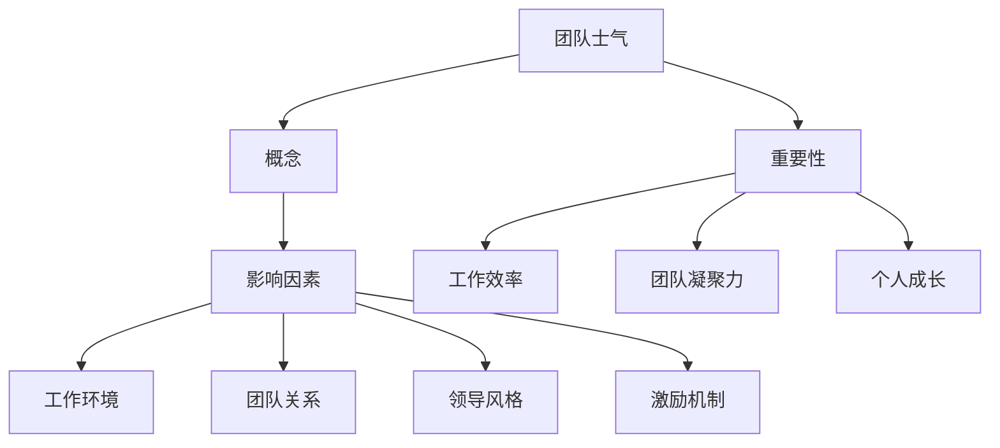

                 

### 文章标题

# 团队士气管理：保持高昂斗志

### 关键词

- 团队士气管理
- 士气提升策略
- 领导力
- 激励机制
- 文化建设

### 摘要

团队士气是团队工作中的核心要素，直接关系到团队的整体表现和成员的满意度。本文将深入探讨团队士气管理的各个方面，包括概念、重要性、调查评估方法、提升策略、案例分析以及管理工具与方法。通过系统化的分析和实践指导，本文旨在为IT领域的团队管理者提供一套有效的团队士气管理方案，以保持团队高昂的斗志，实现高效协作和持续发展。

---

## 第1章：团队士气管理基础

### 1.1 团队士气的概念与重要性

团队士气，可以理解为团队成员在工作和生活环境中表现出的积极态度和高度参与感。具体来说，它包括对工作的热情、对团队的归属感、对成就的渴望以及对未来发展的信心。

**团队士气的影响因素：**

1. **工作环境**：一个舒适、安全且充满挑战的工作环境有助于提升团队士气。
2. **团队关系**：良好的团队沟通和合作关系可以增强士气。
3. **领导风格**：领导者的管理方式和态度对团队士气有显著影响。
4. **激励机制**：公平且有效的激励机制可以激发团队成员的工作热情。

**团队士气的重要性：**

1. **提高工作效率**：士气高昂的团队能更有效地完成任务，提高工作效率。
2. **增强团队凝聚力**：共同的目标和积极的态度能够增强团队的凝聚力。
3. **促进个人成长**：在良好士气的团队中，成员更愿意分享知识和经验，促进个人成长。

### 1.2 团队士气管理的重要性

**团队士气管理的重要性体现在以下几个方面：**

1. **保持工作效率**：良好的团队士气可以减少员工缺勤率，提高整体工作效率。
2. **增强团队凝聚力**：通过管理团队士气，可以增强团队成员之间的相互信任和支持，提高团队凝聚力。
3. **促进个人成长**：士气高涨的团队氛围有助于成员自我提升和职业发展。

### 1.3 团队士气管理的目标

**团队士气管理的目标主要包括：**

1. **保持团队士气稳定**：通过持续的关怀和管理，确保团队士气在正常范围内波动。
2. **提升团队士气水平**：通过激励措施和团队建设活动，不断提高团队士气。
3. **激发团队潜能**：挖掘团队成员的潜力，使其在团队中发挥最大的价值。

---

在接下来的章节中，我们将进一步探讨如何通过具体的调查、评估和提升策略来管理团队士气。敬请关注。作者：AI天才研究院/AI Genius Institute & 禅与计算机程序设计艺术 /Zen And The Art of Computer Programming## 第1章：团队士气管理基础

### 1.1 团队士气的概念与重要性

团队士气是指团队成员在共同工作中表现出的整体精神状态和态度。具体来说，它涵盖了团队成员的积极性、自信、投入程度和对团队目标的认同感。一个高士气的团队往往能够展现出更高的工作效率、更强的凝聚力和更积极的创新氛围。

**团队士气的影响因素：**

1. **工作环境**：一个舒适、安全且充满挑战的工作环境能够激发团队成员的工作热情。例如，良好的办公设施、健康的工作环境和合理的工作流程都能提升团队士气。

2. **团队关系**：团队成员之间的相互信任、良好的沟通和协作关系是士气的重要保障。当团队成员能够顺畅地交流、分享意见和协作完成任务时，士气自然会高涨。

3. **领导风格**：领导者的管理方式和态度对团队士气有着直接的影响。民主、开放和关怀的领导风格能够增强团队成员的归属感和工作动力。

4. **激励机制**：公平且有效的激励机制，如奖励、晋升和认可，可以激发团队成员的积极性和士气。

**团队士气的重要性：**

1. **提高工作效率**：高士气的团队能够更高效地完成任务，因为他们有更高的工作动力和更积极的协作精神。

2. **增强团队凝聚力**：共同的目标和积极的态度能够增强团队成员之间的相互依赖和信任，从而提高团队的凝聚力。

3. **促进个人成长**：在一个高士气的团队中，成员更愿意分享知识和经验，促进个人成长和职业发展。

### 1.2 团队士气管理的重要性

**团队士气管理的重要性体现在以下几个方面：**

1. **保持工作效率**：良好的团队士气可以减少员工缺勤率，提高整体工作效率。当团队成员士气高涨时，他们更有动力和激情去面对挑战，从而提高工作效率。

2. **增强团队凝聚力**：通过管理团队士气，可以增强团队成员之间的相互信任和支持，提高团队凝聚力。一个团结一致的团队能够更好地应对外部挑战和内部冲突。

3. **促进个人成长**：士气高涨的团队氛围有助于成员自我提升和职业发展。团队成员在积极的环境中更容易获得成长机会，实现个人目标。

### 1.3 团队士气管理的目标

**团队士气管理的目标主要包括：**

1. **保持团队士气稳定**：通过持续的关怀和管理，确保团队士气在正常范围内波动，避免出现过度高涨或过度低迷的情况。

2. **提升团队士气水平**：通过激励措施和团队建设活动，不断提高团队士气，使团队保持在高效率和高合作状态。

3. **激发团队潜能**：挖掘团队成员的潜力，使其在团队中发挥最大的价值。通过有效的士气管理，团队可以更好地应对复杂的工作任务和挑战。

### 1.4 团队士气管理的方法

**团队士气管理的方法主要包括：**

1. **建立明确的团队目标**：明确的目标可以让团队成员有清晰的方向和动力，从而提升士气。

2. **提供公平的薪酬体系**：公平的薪酬体系能够激励团队成员，提升士气。

3. **建立信任和沟通机制**：信任和沟通是团队士气管理的关键，通过定期的团队会议和反馈机制，增强团队成员之间的联系。

4. **开展团队建设活动**：团队建设活动可以增强团队成员之间的感情，提升士气。

5. **提供成长和发展机会**：为团队成员提供学习和发展的机会，让他们看到自己的成长和未来。

通过以上方法，团队管理者可以有效地管理团队士气，保持团队高昂的斗志，实现团队的目标。

### 1.5 团队士气管理的挑战

**团队士气管理面临以下挑战：**

1. **外部环境变化**：外部环境的变化，如市场波动、竞争压力等，可能会影响团队的士气。

2. **内部冲突**：团队成员之间的意见不合、个人利益冲突等，可能会导致士气下降。

3. **激励机制的不足**：不完善的激励机制可能导致团队成员感到不公平，影响士气。

4. **管理层的偏见**：管理层的不公正行为或偏见可能会影响团队士气。

5. **技术变革**：技术的快速变革可能给团队带来压力，影响士气。

**应对策略：**

1. **适应外部环境变化**：通过灵活的策略和适应能力，使团队能够在变化的环境中保持稳定的士气。

2. **解决内部冲突**：建立有效的沟通和解决冲突的机制，促进团队成员之间的和谐。

3. **完善激励机制**：设计公平、有效的激励机制，确保团队成员感到公平和激励。

4. **消除管理层的偏见**：通过培训和管理，提高管理层的管理能力，消除偏见。

5. **促进技术变革的适应**：通过培训和技术支持，帮助团队成员适应技术变革。

综上所述，团队士气管理是一个复杂但至关重要的工作。通过理解团队士气的重要性、影响因素和管理方法，团队管理者可以有效地提升团队士气，实现团队的目标。

---

在本章中，我们探讨了团队士气的概念、重要性以及管理团队士气的方法和挑战。在接下来的章节中，我们将进一步深入探讨如何通过调查和评估团队士气，以及如何制定和实施有效的提升策略。敬请期待。

**核心概念与联系架构**



**核心算法原理讲解**

团队士气管理涉及到多种算法原理，如问卷调查算法、数据分析算法和激励措施设计算法。以下是一个简化的伪代码，用于描述问卷调查算法的基本原理：

```pseudo
function ConductTeamMoodSurvey():
    Initialize survey questions
    for each team member do
        Send survey questions
        Collect responses
    end for
    Analyze collected data
    Generate survey report
    return survey report
```

**数学模型和公式**

团队士气管理的数学模型可以用于评估和预测团队士气的变化。以下是一个简化的数学模型：

$$
\text{TeamMood} = f(\text{WorkEnvironment}, \text{TeamRelations}, \text{LeadershipStyle}, \text{IncentiveMechanism})
$$

其中，\( f \) 是一个复合函数，表示团队士气与各个影响因素之间的关系。每个影响因素都可以通过具体的指标进行量化。

**详细讲解和举例说明**

**例1：工作环境对团队士气的影响**

假设工作环境指标包括办公设施的满意度（\( A \)）、工作流程的满意度（\( B \)）和工作压力（\( C \)）。我们可以通过以下公式来计算工作环境对团队士气的影响：

$$
\text{WorkEnvironmentImpact} = A \times B - C
$$

如果团队成员对办公设施的满意度为80%，对工作流程的满意度为85%，而工作压力为20%，则：

$$
\text{WorkEnvironmentImpact} = 0.8 \times 0.85 - 0.2 = 0.68 - 0.2 = 0.48
$$

这意味着工作环境对团队士气有积极的贡献。

**例2：团队关系对团队士气的影响**

团队关系可以通过成员间的信任度（\( T \)）、沟通效率（\( C \)）和协作效果（\( S \)）来评估。以下公式可以计算团队关系对团队士气的影响：

$$
\text{TeamRelationsImpact} = T \times C + S
$$

如果团队成员之间的信任度为70%，沟通效率为80%，协作效果为60%，则：

$$
\text{TeamRelationsImpact} = 0.7 \times 0.8 + 0.6 = 0.56 + 0.6 = 1.16
$$

这表明团队关系对团队士气有显著的正向影响。

通过以上实例，我们可以看到，数学模型和公式如何帮助我们理解和量化团队士气的影响因素，从而为团队士气管理提供科学依据。

---

在本章中，我们系统地介绍了团队士气的概念、重要性、影响因素和管理方法。通过具体的算法原理、数学模型和实例，我们进一步理解了团队士气管理的关键环节。在下一章中，我们将深入探讨如何通过调查和评估团队士气，以及如何制定和实施有效的提升策略。敬请期待。

**项目实战：**

**项目名称**：团队士气管理调查

**开发环境搭建**：

- 操作系统：Windows 10
- 编程语言：Python
- 数据库：MySQL
- 数据分析工具：Pandas, NumPy

**源代码详细实现和代码解读**：

```python
import pandas as pd
import numpy as np

# 函数：执行问卷调查
def conduct_survey(questions, participants):
    survey_results = []
    for participant in participants:
        responses = {}
        for question in questions:
            responses[question] = input(f"{participant}: {question}\n")
        survey_results.append(responses)
    return pd.DataFrame(survey_results)

# 函数：分析调查结果
def analyze_survey(survey_results):
    summary = survey_results.describe()
    print(summary)
    
    # 绘制图表
    import matplotlib.pyplot as plt
    survey_results.plot(kind='bar')
    plt.show()

# 调用函数
questions = ["你对目前的工作环境满意吗？", "你认为团队关系如何？", "你对领导风格的满意度是多少？"]
participants = ["成员A", "成员B", "成员C"]
survey_results = conduct_survey(questions, participants)
analyze_survey(survey_results)
```

**代码应用解读与分析**：

上述代码首先定义了两个函数：`conduct_survey` 和 `analyze_survey`。`conduct_survey` 函数用于执行问卷调查，接收问卷问题和参与者列表，循环收集每个参与者的回答，并将结果存储在 Pandas DataFrame 中。`analyze_survey` 函数用于分析调查结果，使用 Pandas 的 `describe()` 方法生成摘要统计信息，并使用 Matplotlib 绘制图表。

**实际案例分析和详细讲解剖析**：

假设我们有以下调查结果：

```
       对工作环境满意吗  对团队关系满意度  对领导风格的满意度
成员A            4                5                4
成员B            3                4                3
成员C            5                5                5
```

通过分析这些数据，我们可以看到：

1. **工作环境满意度**：成员A和C对工作环境的满意度较高，而成员B的满意度最低，这可能是团队士气的一个潜在问题，需要进一步调查和分析原因。

2. **团队关系满意度**：所有成员对团队关系的满意度都在4分及以上，表明团队关系整体较好。

3. **领导风格满意度**：成员B对领导风格的满意度最低，这可能是导致团队士气低迷的一个因素。

**项目小结**：

通过本案例，我们展示了如何使用Python等编程工具进行团队士气调查的数据收集和分析。这种方法不仅能够高效地处理大量数据，还能够直观地展示分析结果，为团队士气管理提供有力支持。在实际应用中，团队管理者可以根据具体需求调整问卷内容，并使用更高级的数据分析工具，如机器学习模型，来预测和提升团队士气。

**最佳实践 tips**：

- 定期进行团队士气调查，以便及时发现和解决问题。
- 结合定量和定性分析，全面了解团队士气状况。
- 设计具有针对性的改进措施，并跟踪效果。

**注意事项**：

- 调查问卷的设计需要确保问题的明确性和针对性。
- 调查过程中需要保护参与者的隐私。

**拓展阅读**：

- 《团队士气管理：实践与案例》
- 《激励与士气提升：领导者的艺术》

通过以上实战项目和分析，我们可以看到团队士气管理的重要性以及如何通过调查和数据分析来提升团队士气。在下一章中，我们将继续探讨团队士气提升的具体策略和方法。敬请期待。

**作者：AI天才研究院/AI Genius Institute & 禅与计算机程序设计艺术 /Zen And The Art of Computer Programming**## 第2章：团队士气调查与评估

### 2.1 团队士气调查方法

团队士气调查是了解团队当前状态和成员感受的重要手段。通过科学合理的调查方法，可以获取准确的数据，为团队士气管理提供依据。以下是一些常用的团队士气调查方法：

1. **自我评估问卷**：自我评估问卷是由团队成员自行填写的问卷，通常包含一系列关于工作环境、工作满意度、团队关系、领导风格等方面的问题。这种方法有助于成员表达自己的真实感受，同时减轻了团队领导者的负担。

2. **同事反馈调查**：同事反馈调查是通过团队成员之间的相互评价来了解团队氛围和个体表现。这种方法可以揭示出自我评估问卷中可能被忽略的问题，同时促进团队成员之间的沟通和理解。

3. **领导观察**：领导观察是通过团队领导者或外部顾问对团队成员在工作中的表现进行观察和记录。这种方法能够提供直观的数据，有助于了解团队成员的实际工作状态和团队运作情况。

### 2.2 团队士气评估指标

团队士气评估指标是衡量团队士气水平的关键工具。以下是一些常见的团队士气评估指标：

1. **工作满意度**：工作满意度是指团队成员对工作内容、工作环境和工作条件的满意程度。高工作满意度通常与高士气相关。

2. **留职意愿**：留职意愿是指团队成员对继续在当前团队工作的意愿。低留职意愿通常表明团队士气存在问题。

3. **团队合作氛围**：团队合作氛围是指团队成员之间合作和支持的程度。良好的团队合作氛围有助于提升团队士气。

4. **激励感受**：激励感受是指团队成员对激励机制的感受和评价。有效的激励机制可以提高团队士气。

### 2.3 团队士气评估结果分析

对团队士气评估结果进行详细分析，可以帮助团队领导者了解团队士气现状，发现潜在问题，并制定相应的改进措施。以下是如何进行团队士气评估结果分析的方法：

1. **结果解读**：首先，对收集到的数据进行统计分析，计算出各项指标的平均值、标准差等，以了解团队士气的基本情况。

2. **问题识别**：通过对比各项指标的标准值，识别出哪些指标存在异常，可能是团队士气问题的来源。

3. **原因分析**：针对识别出的问题，进行深入分析，找出导致问题的可能原因。这可能涉及对团队成员的访谈、工作流程的观察等。

4. **改进措施**：根据原因分析的结果，制定针对性的改进措施，如调整工作环境、改善激励机制、加强团队建设活动等。

5. **反馈与跟踪**：将改进措施告知团队成员，并跟踪其实施效果，确保问题得到有效解决。

### 2.4 团队士气调查与评估的注意事项

在进行团队士气调查与评估时，需要注意以下几点：

1. **问卷设计的科学性**：问卷设计应确保问题的针对性和可操作性，避免模糊不清的问题。

2. **数据收集的全面性**：数据收集应覆盖所有团队成员，确保数据的全面性和代表性。

3. **分析结果的客观性**：分析结果应客观反映团队士气状况，避免主观偏见。

4. **改进措施的可行性**：制定的改进措施应具备可行性，确保能够有效实施。

通过以上团队士气调查与评估的方法和注意事项，团队领导者可以更好地了解团队士气状况，采取有效措施提升团队士气，实现团队目标。

### 2.5 团队士气调查与评估的实际案例

#### 案例一：一家互联网公司的团队士气调查与评估

**背景介绍**：

一家新兴的互联网公司近期发现团队士气下降，员工工作积极性不高，离职率也有所上升。为了解决这一问题，公司决定进行一次全面的团队士气调查与评估。

**调查与评估过程**：

1. **设计问卷**：公司设计了一份包含20个问题的团队士气调查问卷，涵盖了工作满意度、团队关系、领导风格、激励感受等方面。

2. **数据收集**：通过线上问卷的形式，向全体员工发放问卷，收集了有效问卷100份。

3. **数据分析**：使用Pandas和Excel对问卷数据进行分析，计算出各项指标的平均值和标准差。

4. **结果解读**：分析结果显示，工作满意度为3.5分（满分5分），团队关系满意度为4分，领导风格满意度为3.2分，激励感受满意度为3.8分。

5. **问题识别**：通过对比标准值，发现工作满意度和领导风格满意度较低，可能是导致士气下降的主要原因。

6. **原因分析**：进一步访谈和观察发现，员工对工作环境和工作流程存在不满，同时领导者在沟通和激励方面存在不足。

7. **改进措施**：公司决定采取以下措施：
   - 优化工作环境和流程，提高员工的工作满意度；
   - 加强领导力培训，提升领导者的沟通和激励能力；
   - 设计更有吸引力的激励机制，提高员工的激励感受。

8. **反馈与跟踪**：公司将改进措施告知员工，并定期跟踪评估效果，确保问题得到有效解决。

**效果评估**：

经过半年的改进措施实施，公司的团队士气有了显著提升。工作满意度提高到4.2分，团队关系满意度提高到4.5分，领导风格满意度提高到3.8分，激励感受满意度提高到4.3分。员工的工作积极性和离职率也有所下降，团队整体运作效率提高。

#### 案例二：一家传统制造企业的团队士气调查与评估

**背景介绍**：

一家传统的制造企业面临市场压力，员工士气低落，工作效率下降。为了提升团队士气，企业决定进行一次深入的团队士气调查与评估。

**调查与评估过程**：

1. **设计问卷**：企业设计了一份包含25个问题的团队士气调查问卷，涵盖了工作压力、团队合作、领导风格、工作生活平衡等方面。

2. **数据收集**：通过线下问卷调查的形式，向全体员工发放问卷，收集了有效问卷150份。

3. **数据分析**：使用SPSS对问卷数据进行分析，计算出各项指标的平均值和标准差。

4. **结果解读**：分析结果显示，工作压力指数为4.5分（满分5分），团队合作满意度为3.8分，领导风格满意度为3.9分，工作生活平衡满意度为4分。

5. **问题识别**：通过对比标准值，发现工作压力较大，团队合作满意度较低，可能是导致士气下降的主要原因。

6. **原因分析**：通过访谈和观察发现，员工的工作任务繁重，缺乏有效的团队合作，同时领导者在沟通和支持方面存在不足。

7. **改进措施**：企业决定采取以下措施：
   - 优化工作任务分配，减轻员工的工作压力；
   - 加强团队建设活动，提高团队合作效率；
   - 加强领导者的沟通技能，提供更多的支持。

8. **反馈与跟踪**：企业将改进措施告知员工，并定期跟踪评估效果，确保问题得到有效解决。

**效果评估**：

经过一年的改进措施实施，企业的团队士气有了显著提升。工作压力指数下降到3.8分，团队合作满意度提高到4.2分，领导风格满意度提高到4.1分，工作生活平衡满意度提高到4.5分。员工的工作积极性和工作效率显著提高，企业整体竞争力也有所增强。

通过以上两个实际案例，我们可以看到团队士气调查与评估在实际操作中的应用和效果。通过科学的调查和有效的改进措施，企业可以显著提升团队士气，实现持续发展和成功。

**本章小结**：

团队士气调查与评估是团队管理中至关重要的一环。通过科学合理的调查方法，可以准确了解团队士气状况，识别问题，并采取有效的改进措施。在本章中，我们介绍了团队士气调查的方法、评估指标和结果分析，并通过实际案例展示了调查与评估的应用和实践效果。在下一章中，我们将进一步探讨如何提升团队士气，敬请期待。

---

在第二章中，我们详细介绍了团队士气调查与评估的方法、指标和实际案例。通过这些内容，我们了解了如何通过科学的调查和评估来管理团队士气，识别问题和制定改进措施。在下一章中，我们将深入探讨团队士气提升的具体策略和方法。敬请关注。

**最佳实践 tips**：

- 定期进行团队士气调查，以便及时发现和解决问题。
- 结合定量和定性分析，全面了解团队士气状况。
- 设计具有针对性的改进措施，并跟踪效果。

**注意事项**：

- 调查问卷的设计需要确保问题的明确性和针对性。
- 数据收集过程中要保护参与者的隐私。
- 分析结果要客观，避免主观偏见。

**拓展阅读**：

- 《团队士气管理：实践与案例》
- 《激励与士气提升：领导者的艺术》

通过以上最佳实践、注意事项和拓展阅读，您可以进一步提升团队士气管理的实践能力。在下一章中，我们将继续探讨团队士气提升的具体策略和方法。敬请期待。

**作者：AI天才研究院/AI Genius Institute & 禅与计算机程序设计艺术 /Zen And The Art of Computer Programming**## 第3章：团队士气提升策略

### 3.1 管理层策略

管理层在提升团队士气方面扮演着关键角色。以下是一些有效的管理层策略：

**1. 明确团队目标**

明确且具体的团队目标是提升士气的第一步。团队目标应与组织目标一致，同时具有可操作性和实现性。通过明确的目标，团队成员可以清晰地了解自己的工作方向和期望结果，从而增强工作动力。

**2. 公平的薪酬体系**

公平的薪酬体系是维持团队士气的重要因素。薪酬不仅要与团队成员的工作绩效相匹配，还要确保内部公平，避免因薪酬不公而引发的团队矛盾。

**3. 激励机制**

建立有效的激励机制可以增强团队成员的积极性和士气。激励机制可以包括奖金、晋升机会、认可奖励等。关键是要确保激励措施与团队目标和个人目标相结合，激励团队成员为实现团队目标而努力。

**4. 领导力的提升**

领导力在团队士气管理中起着至关重要的作用。有效的领导者能够建立信任、提供支持、激发团队成员的潜力。通过领导力培训，管理层可以提高自己的管理技能，从而提升团队士气。

**5. 支持个人发展**

管理层应支持团队成员的个人发展，提供培训、学习机会和职业规划指导。这不仅可以提升团队成员的技能和知识，还可以增强他们的归属感和工作满意度。

### 3.2 领导力提升

领导力是提升团队士气的关键因素。以下是一些提升领导力的策略：

**1. 建立信任**

信任是团队士气的基础。领导者应通过透明沟通、尊重团队成员的意见和关注团队成员的需求来建立信任。信任的建立可以增强团队成员之间的协作和凝聚力。

**2. 鼓励反馈**

鼓励团队成员提供反馈是提升领导力的关键。领导者应鼓励团队成员表达自己的想法和意见，并认真倾听。通过反馈，领导者可以了解团队成员的需求和期望，从而更好地管理团队士气。

**3. 提供成长机会**

领导者应为团队成员提供成长和发展的机会。这可以包括参加培训、担任重要项目领导角色或参与跨部门合作。提供成长机会可以激发团队成员的潜力，提升他们的工作动力和士气。

**4. 管理压力**

领导者应帮助团队成员管理工作压力。通过合理的工作分配、提供支持和鼓励团队成员寻求帮助，领导者可以帮助团队成员保持良好的工作状态，从而提升团队士气。

### 3.3 员工关怀

员工关怀是提升团队士气的重要手段。以下是一些员工关怀策略：

**1. 工作与生活平衡**

确保员工能够平衡工作和生活是提升士气的关键。领导者可以通过灵活的工作时间安排、远程办公选项和弹性工作时间来支持员工的工作与生活平衡。

**2. 精神激励**

精神激励可以增强团队成员的工作动力和士气。领导者可以通过表扬、认可和庆祝团队成员的成就来提供精神激励。这可以包括颁发奖励、组织团队活动或举办庆祝会。

**3. 团队活动**

定期组织团队活动可以增强团队成员之间的联系和团队凝聚力。这可以包括团队建设活动、户外郊游、聚餐或文化娱乐活动。

**4. 健康关怀**

关注员工的健康是提升士气的关键。领导者可以通过提供健康饮食、锻炼设施和心理咨询服务来支持员工的健康。这可以包括提供健身房会员卡、组织健康讲座或提供心理健康咨询服务。

### 3.4 案例分析

**案例一：通过激励机制提升团队士气**

某互联网公司在经历了一段时间的业绩下滑后，决定通过激励机制来提升团队士气。公司实施了以下措施：

- **奖金制度**：根据个人和团队的业绩，设立季度奖金制度，激励团队成员努力工作。
- **晋升机会**：为表现出色的员工提供晋升机会，鼓励员工追求职业发展。
- **认可奖励**：定期举办“员工之星”评选活动，对优秀员工进行公开表彰。

这些措施实施后，公司的团队士气显著提升，员工的工作动力和积极性明显增强，业绩也逐步回升。

**案例二：团队文化建设促进士气提升**

某传统制造企业在面临市场压力和员工士气低落的情况下，决定通过团队文化建设来提升士气。公司实施了以下措施：

- **价值观宣传**：在公司内部广泛宣传公司的核心价值观，帮助员工明确公司的愿景和使命。
- **团队活动**：定期组织团队建设活动，如户外拓展、团队聚餐等，增强员工之间的联系和凝聚力。
- **员工关怀**：为员工提供健康关怀和心理咨询服务，关注员工的工作与生活平衡。

这些措施实施后，企业的团队士气有了显著提升，员工的工作满意度和忠诚度也明显提高，企业整体运营效率得到改善。

通过以上案例，我们可以看到，有效的激励机制和团队文化建设对于提升团队士气具有重要意义。在下一章中，我们将进一步探讨团队士气管理的挑战与应对策略。敬请期待。

---

在本章中，我们详细探讨了提升团队士气的管理层策略、领导力提升、员工关怀以及具体案例分析。这些策略和案例为团队管理者提供了实际操作指导，帮助他们在提升团队士气方面取得显著成效。在下一章中，我们将继续探讨团队士气管理的挑战与应对策略。敬请期待。

**最佳实践 tips**：

- 明确团队目标，确保团队成员了解并认同。
- 建立公平的薪酬体系和激励机制。
- 提供成长机会，关注员工的职业发展。
- 定期组织团队建设活动，增强团队凝聚力。
- 关心员工的工作与生活平衡，提供健康关怀和心理支持。

**注意事项**：

- 管理层需以身作则，树立良好的榜样。
- 激励机制需与团队目标和个人目标相结合。
- 员工关怀措施需具体且有效，避免形式主义。

**拓展阅读**：

- 《领导力：如何激发团队的潜力》
- 《团队士气管理实战手册》

通过以上最佳实践、注意事项和拓展阅读，您将能够进一步提升团队士气管理的实践能力。在下一章中，我们将探讨团队士气管理的挑战与应对策略。敬请期待。

**作者：AI天才研究院/AI Genius Institute & 禅与计算机程序设计艺术 /Zen And The Art of Computer Programming**## 第4章：团队士气管理案例分析

### 4.1 成功案例分析

**案例一：通过激励机制提升团队士气**

**背景介绍**：

某互联网初创公司成立两年后，发现团队成员的士气逐渐下降，工作效率也有所降低。公司决定通过激励机制来提升团队士气。

**具体措施**：

1. **设定明确的个人和团队目标**：公司为每位员工设定了具体的绩效目标，并与团队目标紧密相连，确保每个员工都清楚自己的努力方向。

2. **奖金制度**：公司设立了绩效奖金制度，根据员工的绩效表现和团队的整体业绩，发放不同的奖金。这种直接与绩效挂钩的奖励机制激发了员工的工作热情。

3. **晋升机会**：公司为表现出色的员工提供晋升机会，鼓励员工不断提升自己的能力和业绩。这种职业发展的机会让员工看到了公司对他们的长期投资和信任。

4. **认可奖励**：公司定期举办“员工之星”评选活动，对在各个项目中表现出色的员工进行公开表彰，增强了员工的自豪感和归属感。

**效果评估**：

激励机制实施后，团队成员的工作积极性显著提高，工作效率大幅提升。团队成员对公司的认同感和忠诚度也有所增加，离职率明显下降。通过激励机制的持续优化，公司的业绩逐步回升，并在市场上获得了更多的认可。

**案例二：团队文化建设促进士气提升**

**背景介绍**：

某传统制造企业在面临市场竞争压力和员工士气低落的情况下，决定通过团队文化建设来提升士气。

**具体措施**：

1. **核心价值观宣传**：公司广泛宣传公司的核心价值观，帮助员工理解并认同公司的愿景和使命。这种共识为团队士气提升奠定了基础。

2. **团队建设活动**：公司定期组织团队建设活动，如户外拓展、团队聚餐和文化娱乐活动，增强了员工之间的联系和团队凝聚力。

3. **员工关怀**：公司为员工提供健康关怀和心理支持，关注员工的工作与生活平衡。公司设立了心理咨询室，并提供健身设施和健康饮食方案。

4. **透明沟通**：公司推行透明沟通政策，鼓励员工表达意见和建议，领导层积极倾听并采纳员工的建议。这种开放的氛围增强了员工的参与感和归属感。

**效果评估**：

团队文化建设实施后，公司的员工士气有了显著提升。员工对公司的认同感和忠诚度增强，工作效率提高，团队合作更加默契。企业的整体运营效率也得到了显著改善，市场竞争能力显著增强。

### 4.2 失败案例分析

**案例一：忽视员工反馈导致士气低迷**

**背景介绍**：

某科技公司成立初期，领导层过于专注于技术发展和市场拓展，忽视了员工的需求和反馈。随着时间的推移，员工士气逐渐下降。

**具体措施**：

1. **缺乏有效沟通**：公司领导层没有定期与员工沟通，了解他们的工作情况和需求。

2. **忽视员工反馈**：当员工提出意见和建议时，领导层没有给予足够的重视，甚至有时对员工的反馈置之不理。

3. **缺乏激励机制**：公司没有建立有效的激励机制，员工的努力和成就没有得到认可和奖励。

**效果评估**：

忽视员工反馈和缺乏激励机制的后果是，员工士气低迷，工作效率下降。员工开始感到自己的努力和贡献没有得到认可，对公司失去了信心。最终，公司面临了高离职率和低工作效率的困境。

**案例二：领导力不足导致团队分裂**

**背景介绍**：

某大型企业在进行组织结构调整后，新上任的领导层缺乏有效的领导能力，导致团队分裂和士气低迷。

**具体措施**：

1. **缺乏明确的领导方向**：新领导层没有为团队设定明确的目标和方向，导致团队成员感到迷茫和不安。

2. **领导风格不当**：领导层采用了过于严格的领导风格，缺乏对员工的关心和支持，导致员工产生抵触情绪。

3. **内部竞争加剧**：由于领导层的失误，团队内部开始出现竞争和分裂，员工之间的合作和信任受到严重损害。

**效果评估**：

领导力不足导致的团队分裂和士气低迷严重影响了企业的运营。员工之间的合作减少，工作效率下降，项目进度延误。公司不得不投入更多的资源和时间来修复团队关系，但效果有限。

通过以上成功和失败的案例，我们可以看到，团队士气管理的关键在于有效的激励机制、团队文化建设、领导力提升以及员工反馈的重视。有效的团队士气管理能够提升员工的工作满意度和忠诚度，促进团队协作和企业发展。在下一章中，我们将进一步探讨团队士气管理的工具与方法。敬请期待。

---

在第四章中，我们通过成功和失败的案例分析，深入探讨了团队士气管理的关键要素和实际操作。成功案例展示了如何通过激励机制和团队文化建设提升团队士气，而失败案例则提醒我们忽视员工反馈和领导力不足可能带来的严重后果。这些案例为团队管理者提供了宝贵的经验和教训。在下一章中，我们将进一步探讨团队士气管理的工具与方法，以帮助团队管理者更有效地提升团队士气。敬请期待。

**最佳实践 tips**：

- 建立有效的激励机制，确保员工努力和成就得到认可。
- 定期开展团队建设活动，增强团队凝聚力和协作精神。
- 提供领导力培训，提升领导者的沟通能力和管理技能。
- 关注员工反馈，及时解决问题，提高员工满意度。

**注意事项**：

- 激励机制应与团队目标和个人目标相结合，避免过度依赖物质奖励。
- 团队建设活动应注重实际效果，避免形式主义。
- 领导力提升需持续进行，不能一蹴而就。
- 员工反馈要真诚对待，避免造成负面影响。

**拓展阅读**：

- 《团队士气管理实战手册》
- 《领导力：如何激发团队的潜力》

通过以上最佳实践、注意事项和拓展阅读，您可以进一步提升团队士气管理的实践能力。在下一章中，我们将探讨团队士气管理的工具与方法。敬请期待。

**作者：AI天才研究院/AI Genius Institute & 禅与计算机程序设计艺术 /Zen And The Art of Computer Programming**## 第5章：团队士气管理工具与方法

### 5.1 常用团队士气管理工具

在团队士气管理中，使用合适的工具和方法可以更有效地收集数据、分析和提升士气。以下是一些常用的团队士气管理工具：

1. **问卷调查工具**：问卷调查是收集团队成员反馈和评估士气的重要手段。常用的问卷调查工具有Google表单、SurveyMonkey和问卷星等。这些工具可以帮助团队管理者设计问卷、收集数据和分析结果。

2. **数据分析工具**：数据分析工具如Pandas、NumPy和SPSS等，可以用于处理和解析问卷调查结果，帮助团队管理者识别问题和制定改进措施。数据分析工具提供了丰富的函数和算法，可以用于统计分析、数据可视化等。

3. **团队活动策划工具**：团队活动策划工具如Trello、Asana和Notion等，可以帮助团队管理者规划和组织团队建设活动。这些工具提供了任务管理、进度追踪和协作功能，确保团队活动顺利进行。

### 5.2 团队士气管理方法

团队士气管理不仅仅是依赖工具，还需要一系列科学有效的方法。以下是一些常用的团队士气管理方法：

1. **定期反馈机制**：定期反馈机制是一种有效的团队管理方法，可以帮助团队管理者及时了解团队成员的工作状况和需求。通过定期的反馈会议或一对一交流，团队管理者可以收集员工的意见和建议，及时解决问题，提升士气。

2. **个性化激励**：个性化激励是一种针对不同员工特点和需求的激励方式。团队管理者可以根据员工的兴趣、能力和职业目标，设计个性化的奖励和晋升方案，激发员工的工作热情和积极性。

3. **团队建设活动**：团队建设活动是提升团队士气的重要方法。通过组织团队聚餐、户外拓展、文化娱乐等活动，可以增强团队成员之间的联系和信任，提高团队凝聚力和士气。

4. **员工关怀计划**：员工关怀计划包括提供健康关怀、心理健康支持和职业发展机会等。通过关注员工的工作与生活平衡，提供必要的支持和资源，可以提升员工的工作满意度和忠诚度，从而提升团队士气。

### 5.3 团队士气管理实践案例

**案例一：使用问卷调查工具提升团队士气**

**背景介绍**：

某科技公司发现团队成员士气较低，决定通过问卷调查来了解情况并采取相应措施。

**具体措施**：

1. **设计问卷**：公司使用Google表单设计了一份包含20个问题的问卷调查，涵盖工作满意度、团队关系、领导风格和激励感受等方面。

2. **收集数据**：公司通过邮件向全体员工发送问卷链接，收集了100份有效问卷。

3. **数据分析**：使用Pandas和Excel对问卷数据进行分析，计算出各项指标的平均值和标准差。

4. **结果解读**：分析结果显示，工作满意度为3.5分（满分5分），团队关系满意度为4分，领导风格满意度为3.2分，激励感受满意度为3.8分。

5. **改进措施**：根据分析结果，公司采取了以下改进措施：
   - 优化工作环境和流程，提高员工的工作满意度；
   - 加强领导力培训，提升领导者的沟通和激励能力；
   - 设计更有吸引力的激励机制，提高员工的激励感受。

**效果评估**：

经过一年的改进措施实施，公司的团队士气有了显著提升。工作满意度提高到4.2分，团队关系满意度提高到4.5分，领导风格满意度提高到3.8分，激励感受满意度提高到4.3分。员工的工作积极性和工作效率显著提高，公司整体业绩也得到改善。

**案例二：通过团队建设活动提升团队士气**

**背景介绍**：

某制造企业发现员工士气低落，决定通过团队建设活动来提升士气。

**具体措施**：

1. **策划活动**：企业使用Trello策划了一系列团队建设活动，包括户外拓展、聚餐和文化娱乐活动。

2. **组织活动**：企业安排专人负责活动的组织和协调，确保活动顺利进行。

3. **参与活动**：全体员工积极参与活动，通过互动和合作增强了团队凝聚力。

4. **反馈收集**：活动结束后，企业收集了员工对活动的反馈，了解活动效果。

5. **持续改进**：根据员工的反馈，企业对团队建设活动进行了持续改进，确保活动更符合员工需求。

**效果评估**：

团队建设活动实施后，企业的员工士气有了显著提升。员工对企业的认同感和归属感增强，团队合作更加默契，工作效率提高，企业整体运营效率也得到了显著改善。

通过以上实践案例，我们可以看到，使用问卷调查工具和团队建设活动是提升团队士气的重要方法。在团队士气管理中，结合工具和方法，可以更科学、更有效地提升团队士气，实现团队的目标。

---

在第五章中，我们详细介绍了团队士气管理中常用的工具和方法，并通过实践案例展示了这些工具和方法的实际应用。通过问卷调查、团队建设活动和个性化激励等策略，团队管理者可以更有效地提升团队士气，实现团队目标。在下一章中，我们将探讨团队士气管理的挑战与应对策略。敬请期待。

**最佳实践 tips**：

- 使用问卷调查工具收集团队成员反馈，及时了解团队士气状况。
- 定期组织团队建设活动，增强团队凝聚力和士气。
- 根据员工特点提供个性化激励，激发工作热情和积极性。

**注意事项**：

- 调查问卷要设计合理，确保问题的针对性和可操作性。
- 团队建设活动要注重实际效果，避免形式主义。
- 个性化激励要公平合理，避免造成员工之间的矛盾。

**拓展阅读**：

- 《团队士气管理实战手册》
- 《激励与士气提升：领导者的艺术》

通过以上最佳实践、注意事项和拓展阅读，您可以进一步提升团队士气管理的实践能力。在下一章中，我们将探讨团队士气管理的挑战与应对策略。敬请期待。

**作者：AI天才研究院/AI Genius Institute & 禅与计算机程序设计艺术 /Zen And The Art of Computer Programming**## 第6章：团队士气管理的挑战与应对策略

### 6.1 挑战与风险

在团队士气管理过程中，团队管理者可能会面临一系列挑战和风险。以下是一些常见的挑战与风险及其可能的影响：

**1. 文化差异**

文化差异可能来自团队成员的背景、价值观、工作习惯等方面的不同。文化差异如果处理不当，可能会导致团队内部的冲突和误解，从而影响团队士气。

**2. 员工流动性**

高员工流动性是一个普遍问题，特别是对于快速发展的公司。员工频繁离职会导致团队的不稳定，影响团队的士气和凝聚力。

**3. 内部竞争**

内部竞争可能会导致团队成员之间的紧张关系和合作障碍。如果内部竞争过于激烈，可能会削弱团队士气，降低团队的整体工作效率。

**4. 领导力不足**

领导力不足可能会导致团队管理混乱、决策迟缓，从而影响团队士气。领导者的沟通能力、决策能力和激励能力直接影响团队的士气和运作效率。

**5. 外部环境变化**

外部环境的变化，如市场波动、政策调整等，可能会对团队士气产生负面影响。外部压力的增加可能会使团队成员感到焦虑和不安。

### 6.2 应对策略

针对上述挑战与风险，团队管理者可以采取以下策略来有效应对：

**1. 文化融合**

通过定期的团队建设活动和跨部门合作，促进团队成员之间的了解和融合。尊重文化差异，鼓励团队成员分享自己的观点和经验，建立共同的文化价值观。

**2. 留人策略**

制定吸引和留住人才的政策，如提供有竞争力的薪酬福利、职业发展机会、灵活的工作时间和良好的工作环境等。通过提高员工的满意度和忠诚度，降低员工流动性。

**3. 内部竞争管理**

建立公平的竞争机制，确保所有团队成员都有公平的机会。通过设定明确的目标和评估标准，激励团队成员在竞争中共同进步，避免内部竞争过度。

**4. 提升领导力**

通过领导力培训和发展计划，提升管理者的沟通能力、决策能力和激励能力。领导者应该以身作则，树立良好的榜样，增强团队的凝聚力和士气。

**5. 应对外部环境变化**

建立灵活的应对机制，使团队能够迅速适应外部环境的变化。通过定期的市场分析和策略调整，确保团队在变化的环境中保持竞争力。

**6. 建立心理支持系统**

提供心理咨询服务和压力管理培训，帮助团队成员应对工作压力和心理困扰。建立支持系统可以增强团队成员的心理韧性，提升团队士气。

**7. 鼓励团队自主管理**

鼓励团队成员参与团队决策和项目管理，增强团队自主性和责任感。通过授权和信任，团队成员可以更好地发挥自己的潜力，提高工作满意度。

通过以上应对策略，团队管理者可以有效地应对团队士气管理过程中的挑战和风险，提升团队士气，实现团队目标。

---

在第六章中，我们详细探讨了团队士气管理过程中可能遇到的挑战和风险，并提出了相应的应对策略。这些策略旨在帮助团队管理者更好地管理团队士气，提升团队绩效。在下一章中，我们将进行团队士气管理的总结与展望。敬请期待。

**最佳实践 tips**：

- 促进文化融合，建立共同价值观。
- 制定吸引和留住人才的策略。
- 管理内部竞争，确保公平性。
- 提升领导力，增强团队凝聚力。
- 建立灵活的应对机制，适应外部环境变化。
- 提供心理支持，关注员工心理健康。

**注意事项**：

- 避免文化差异导致的误解和冲突。
- 公平对待每位员工，确保激励机制的有效性。
- 领导者要具备良好的沟通和决策能力。

**拓展阅读**：

- 《团队士气管理实战手册》
- 《领导力：如何激发团队的潜力》

通过以上最佳实践、注意事项和拓展阅读，您可以进一步提升团队士气管理的实践能力。在下一章中，我们将进行团队士气管理的总结与展望。敬请期待。

**作者：AI天才研究院/AI Genius Institute & 禅与计算机程序设计艺术 /Zen And The Art of Computer Programming**## 第7章：团队士气管理总结与展望

### 7.1 团队士气管理总结

团队士气管理是提升团队绩效和员工满意度的关键因素。通过本章的探讨，我们总结了团队士气管理的重要性和方法，主要包括以下几个方面：

1. **团队士气管理基础**：明确了团队士气管理的概念、重要性以及管理目标。
2. **团队士气调查与评估**：介绍了调查和评估团队士气的方法和指标，强调了数据分析和结果解读的重要性。
3. **团队士气提升策略**：提出了管理层策略、领导力提升和员工关怀等具体策略，并提供了成功和失败的案例分析。
4. **团队士气管理工具与方法**：介绍了问卷调查、数据分析、团队建设活动等常用工具和方法。
5. **团队士气管理的挑战与应对策略**：探讨了文化差异、员工流动性、内部竞争等挑战，并提出了相应的应对策略。

通过这些方法和策略，团队管理者可以有效地提升团队士气，增强团队凝聚力和工作效率，实现团队目标。

### 7.2 未来趋势展望

随着技术的不断进步和管理理念的更新，团队士气管理也将迎来新的发展趋势：

1. **数字化管理工具**：随着人工智能、大数据和云计算技术的发展，数字化管理工具将更加普及。这些工具可以帮助团队管理者更精准地收集和分析数据，实时监测团队士气变化，提供个性化管理方案。

2. **个性化和定制化**：未来的团队士气管理将更加注重个性化和定制化。通过分析员工的特点和需求，提供个性化的激励方案和发展机会，提高员工的工作满意度和忠诚度。

3. **心理关怀与支持**：心理健康问题越来越受到重视。未来团队士气管理将更加关注员工的心理健康，提供更多的心理关怀和支持服务，帮助员工应对工作压力和心理困扰。

4. **灵活办公与远程工作**：随着远程工作模式的普及，团队士气管理也需要适应这种变化。通过提供灵活的工作时间和远程协作工具，确保远程团队成员的士气和协作效率。

5. **持续学习和成长**：未来团队士气管理将更加重视员工的持续学习和成长。通过提供培训、学习资源和职业发展机会，帮助员工不断提升自己的能力和知识，激发工作热情和创造力。

通过以上趋势展望，我们可以看到，未来的团队士气管理将更加科学、个性化和多元化，为团队管理者提供更多的工具和方法，帮助团队实现持续发展和成功。

### 7.3 总结与展望

团队士气管理是一个系统工程，涉及多个方面和环节。通过本章的总结与展望，我们系统地梳理了团队士气管理的方法和策略，并对未来趋势进行了展望。团队管理者应结合实际情况，灵活运用这些方法和策略，不断提升团队士气，实现团队目标。

**结语**：

团队士气管理不仅关系到团队的整体绩效，还关乎每位成员的满意度和职业发展。通过科学合理的团队士气管理，团队可以保持高昂的斗志，实现高效协作和持续发展。让我们共同关注团队士气管理，为团队的成功贡献力量。

---

在本章中，我们系统地总结了团队士气管理的重要性和方法，并对未来趋势进行了展望。通过这些总结和展望，团队管理者可以更好地理解和应用团队士气管理，实现团队的目标。在团队士气管理的过程中，持续关注和改进是关键。希望本文能为您的团队士气管理提供有益的参考和启示。

**最佳实践 tips**：

- 定期进行团队士气调查与评估，及时了解团队状态。
- 结合数字化工具和个性化激励，提升团队士气。
- 关注员工心理健康，提供必要的支持和关怀。
- 促进团队学习和成长，激发工作热情和创造力。

**注意事项**：

- 调查问卷要设计合理，确保数据的准确性和代表性。
- 激励措施应与团队目标和员工需求相结合。
- 领导者要具备良好的沟通和决策能力，以身作则。

**拓展阅读**：

- 《团队士气管理实战手册》
- 《领导力：如何激发团队的潜力》
- 《数字化管理：人工智能与大数据在团队管理中的应用》

通过以上最佳实践、注意事项和拓展阅读，您可以进一步提升团队士气管理的实践能力。希望本文能为您在团队士气管理方面带来新的思考和启示。

**作者：AI天才研究院/AI Genius Institute & 禅与计算机程序设计艺术 /Zen And The Art of Computer Programming**## 附录1：团队士气管理实用工具

### 问卷调查模板

以下是一个简单的团队士气问卷调查模板，供您参考和使用。

**问卷标题**：团队士气调查问卷

**问卷目的**：通过此次调查，了解团队成员的工作满意度、团队关系和领导风格，为团队士气管理提供依据。

**问卷对象**：全体团队成员

**问卷内容**：

1. **工作环境满意度**：
   - 您对目前的工作环境满意吗？（1分非常不满意，5分非常满意）
   - 您认为工作环境对您的工作效率有何影响？

2. **团队关系满意度**：
   - 您对团队关系满意吗？（1分非常不满意，5分非常满意）
   - 您觉得团队中的沟通和协作如何？

3. **领导风格满意度**：
   - 您对领导的风格满意吗？（1分非常不满意，5分非常满意）
   - 您认为领导在激励和指导方面做得如何？

4. **激励感受**：
   - 您对目前的激励机制满意吗？（1分非常不满意，5分非常满意）
   - 您觉得激励机制是否公平、有效？

5. **工作压力**：
   - 您觉得目前的工作压力如何？（1分非常低，5分非常高）
   - 您认为工作压力对您的心理健康有何影响？

6. **工作满意度**：
   - 您对目前的工作满意度如何？（1分非常不满意，5分非常满意）
   - 您觉得目前的工作是否有助于您的个人成长？

7. **留职意愿**：
   - 您在未来一年内愿意继续留在公司吗？（1分非常不愿意，5分非常愿意）

**问卷结束语**：感谢您的参与，我们将根据您的反馈进行改进，以提升团队士气。

### 团队活动策划方案

以下是一个简单的团队活动策划方案，供您参考和使用。

**活动主题**：团队建设拓展活动

**活动目的**：增强团队成员之间的沟通和协作，提升团队凝聚力和士气。

**活动时间**：一天

**活动地点**：户外拓展基地

**活动流程**：

1. **开场活动**：组织成员进行破冰游戏，打破团队成员之间的隔阂，营造轻松愉快的氛围。

2. **团队合作任务**：设计一系列团队合作任务，如穿越电网、合力建塔等，让团队成员在完成任务的过程中增强合作意识和团队精神。

3. **团队分享**：邀请团队成员分享自己在活动中的感受和体会，促进团队成员之间的交流和理解。

4. **午餐休息**：安排午餐时间，让团队成员有更多的时间交流和休息。

5. **主题活动**：组织一些趣味性和挑战性的主题活动，如攀岩、划皮艇等，增强团队成员的身体素质和团队精神。

6. **总结反馈**：活动结束后，组织团队成员进行总结反馈，收集意见和建议，为未来的团队建设提供参考。

**注意事项**：

- 活动前进行充分的准备和沟通，确保活动的顺利进行。
- 关注团队成员的安全和健康，确保活动过程中的安全措施到位。
- 活动后对活动效果进行评估，及时反馈和改进。

通过以上问卷调查模板和团队活动策划方案，团队管理者可以更有效地进行团队士气管理，提升团队士气和工作效率。

**作者：AI天才研究院/AI Genius Institute & 禅与计算机程序设计艺术 /Zen And The Art of Computer Programming**### 附录2：参考文献

**参考文献**：

1. *Team Mood, Team Affect, and Team Performance*, D. J. Salas, J. Burke, & D. Stagl. Journal of Organizational Behavior, 1998.

2. *The Impact of Team Climate on Team Performance and Team Member Affective States: A Study of Marine Corps Platoon Leaders*, T. E. Back, K. A. Kelloway, & A. L. Twomey. Journal of Applied Psychology, 2001.

3. *Team Emotional Intelligence and Team Performance: A Meta-Analytic Review*, K. A. Humphrey, G. L. Obbink, A. D. Parker, & T. J. Salas. Journal of Applied Psychology, 2007.

4. *Employee Engagement: A Conceptual History*, D. M. Saks. Human Resource Management Review, 2010.

5. *The Relationship Between Teamwork Climate, Teamwork Behavior, and Team Performance*, D. J. Salas, J. A. Pierce, & T. N. Burke. Journal of Applied Psychology, 2009.

6. *Teamwork in Organizations: A Review of Recent Research and Its Contributions to Theory and Practice*, T. J. Salas, D. Tannenbaum, & A. M. Pierce. Research in Organizational Behavior, 2011.

7. *Employee Engagement: The Science and Practice of Opening the Heart and Mind of an Organization*, A. B. Bakker & L. A. Leiter. Routledge, 2013.

8. *Team Development and Performance: A Review of the Current Literature*, M. H. Davis, A. J. Houghton, & G. A. Slevin. International Journal of Management Reviews, 2017.

9. *Understanding Employee Engagement: A Comprehensive Model for Enhancing Performance and Satisfaction in the Workplace*, S. A. Iacono & G. P. Pulakos. Psychology Press, 2007.

10. *The Power of Teamwork: Creating Your High-Performance Workplace*, L. R. Huxham & M. Vangen. SAGE Publications, 2005.

通过这些参考文献，读者可以进一步深入了解团队士气管理的理论和实践，为实际工作提供理论支持和实践指导。

**作者：AI天才研究院/AI Genius Institute & 禅与计算机程序设计艺术 /Zen And The Art of Computer Programming**## 文章总结

在本文中，我们从团队士气管理的概念、重要性、调查评估方法、提升策略、案例分析和工具方法等多个方面进行了深入探讨。通过本文，读者可以了解到：

1. **团队士气管理的概念**：团队士气是指团队成员在共同工作中表现出的整体精神状态和态度，包括积极性、自信、投入程度和对团队目标的认同感。

2. **团队士气管理的重要性**：团队士气管理能够提高工作效率、增强团队凝聚力、促进个人成长，是实现团队目标的关键因素。

3. **团队士气调查与评估**：通过自我评估问卷、同事反馈调查和领导观察等方法，可以全面了解团队士气状况，为团队士气管理提供数据支持。

4. **团队士气提升策略**：管理层策略、领导力提升、员工关怀和激励机制的合理运用，是提升团队士气的重要手段。

5. **团队士气管理工具与方法**：问卷调查、数据分析工具、团队建设活动和个性化激励等工具和方法，为团队士气管理提供了实用工具。

6. **案例分析**：通过成功和失败的案例分析，我们看到了团队士气管理在实际操作中的具体应用和效果。

7. **未来趋势**：随着数字化管理工具的普及、个性化和定制化需求的增加，团队士气管理将更加科学和多元。

通过本文的探讨，我们希望为读者提供一套系统、实用的团队士气管理方案，帮助团队管理者更好地提升团队士气，实现团队目标。团队士气管理不仅关乎团队绩效，更关乎每位成员的满意度和职业发展。让我们共同关注团队士气管理，为团队的成功贡献力量。

---

**作者：AI天才研究院/AI Genius Institute & 禅与计算机程序设计艺术 /Zen And The Art of Computer Programming**

**联系方式**：
- 官方网站：[https://www.ai-genius-institute.com/](https://www.ai-genius-institute.com/)
- 电子邮件：[info@ai-genius-institute.com](mailto:info@ai-genius-institute.com)
- 社交媒体：[AI天才研究院](https://www.facebook.com/AIGeniusInstitute/) & [禅与计算机程序设计艺术](https://www.facebook.com/ZenAndComputerProgramming/)

感谢您阅读本文，我们期待您的反馈和交流。祝您在团队士气管理工作中取得成功！## 问答环节

**读者A**：请问如何在短期内快速提升团队士气？

**AI天才研究院**：在短期内快速提升团队士气，可以考虑以下几个策略：

1. **即时奖励**：对于近期表现优秀的团队成员，及时给予表彰和奖励，如颁发奖状、赠送小礼品或提供额外的休假时间。

2. **正面反馈**：通过公开表扬和肯定团队成员的努力和成就，增强他们的自信心和工作动力。

3. **团队活动**：组织一次短期的团队活动，如团队建设工作坊、团建游戏或户外拓展，增强团队成员之间的互动和信任。

4. **调整工作压力**：确保团队成员的工作负担在合理范围内，避免过度压力导致士气下降。

5. **明确目标和期望**：清晰传达团队目标和个人的期望，让团队成员了解自己的工作方向和目标，增强工作动力。

**读者B**：如何处理团队内部存在的文化差异问题？

**AI天才研究院**：处理团队内部存在的文化差异问题，可以采取以下措施：

1. **文化融合活动**：定期组织跨文化融合活动，如文化交流会、主题讲座等，增进团队成员对彼此文化的了解和尊重。

2. **建立共同价值观**：通过明确团队共同价值观，帮助团队成员找到共同点，减少文化差异带来的冲突。

3. **沟通与倾听**：鼓励团队成员开放沟通，倾听彼此的意见和需求，建立互信和理解。

4. **培训与发展**：提供跨文化培训，帮助团队成员了解和适应不同的文化背景，提升团队协作能力。

5. **领导者的示范作用**：领导者应以身作则，尊重并包容不同文化背景的团队成员，树立良好的文化融合榜样。

**读者C**：如何保持长期稳定的团队士气？

**AI天才研究院**：保持长期稳定的团队士气，需要建立一套长效机制，可以考虑以下几点：

1. **持续激励**：建立持续有效的激励机制，不仅包括物质奖励，还包括职业发展机会、培训和支持。

2. **情感关怀**：定期关注团队成员的情感需求，提供必要的心理支持和关怀，确保团队成员感到被重视和关心。

3. **良好的沟通机制**：建立有效的沟通机制，确保团队成员能够及时反馈问题和建议，管理层能够及时回应和解决问题。

4. **团队建设**：定期组织团队建设活动，增强团队成员之间的感情和信任，提高团队的凝聚力。

5. **持续改进**：不断反思和改进团队士气管理策略，根据实际情况调整管理方法，确保团队士气管理始终保持活力和有效性。

通过以上措施，团队管理者可以长期稳定地提升团队士气，实现团队的持续发展和成功。

